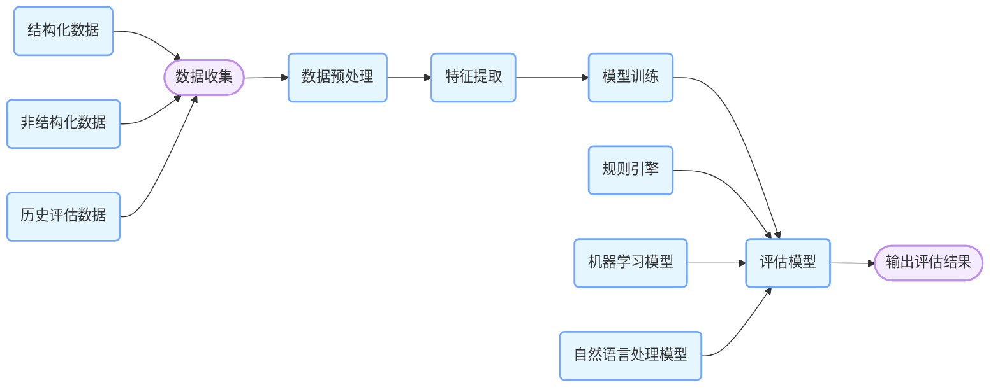

# AI智能体在评估管理层诚信度中的作用

> 关键词：AI智能体、管理层诚信度评估、数据挖掘、机器学习、自然语言处理

> 摘要：本文聚焦于AI智能体在评估管理层诚信度方面的作用。首先介绍了相关背景，包括研究目的、预期读者等内容。接着阐述了AI智能体、管理层诚信度等核心概念及其联系，并给出了相应的原理和架构示意图。详细讲解了用于评估的核心算法原理及具体操作步骤，同时辅以Python代码进行说明。深入探讨了涉及的数学模型和公式，并举例解释。通过项目实战，展示了开发环境搭建、源代码实现与解读。分析了AI智能体在评估管理层诚信度中的实际应用场景，推荐了学习资源、开发工具框架以及相关论文著作。最后总结了未来发展趋势与挑战，解答了常见问题，并提供了扩展阅读和参考资料，旨在全面剖析AI智能体在该领域的重要价值和应用潜力。

## 1. 背景介绍 
### 1.1 目的和范围
在当今复杂的商业环境中，管理层的诚信度对于企业的长期发展、投资者的决策以及市场的稳定都具有至关重要的影响。然而，传统的管理层诚信度评估方法往往依赖于有限的信息来源和主观判断，存在评估不准确、效率低下等问题。本研究的目的在于探讨AI智能体在评估管理层诚信度方面的应用，通过利用AI智能体强大的数据处理和分析能力，提高评估的准确性、客观性和效率。

本研究的范围涵盖了AI智能体的相关技术，如机器学习、自然语言处理等在管理层诚信度评估中的应用。同时，会结合实际案例分析AI智能体在不同行业、不同规模企业中的具体应用效果，以及可能面临的挑战和解决方案。

### 1.2 预期读者
本文的预期读者主要包括企业管理者、投资者、金融分析师、监管机构人员以及对AI技术在商业领域应用感兴趣的研究人员。企业管理者可以通过了解AI智能体在评估管理层诚信度方面的作用，更好地审视自身管理团队的诚信状况，提升企业治理水平；投资者和金融分析师可以借助AI智能体的评估结果，做出更明智的投资决策；监管机构人员可以将其作为一种有效的监管工具，加强对企业管理层的监督；研究人员则可以从技术和应用的角度深入探索该领域的发展趋势和研究方向。

### 1.3 文档结构概述
本文将按照以下结构进行阐述：首先介绍背景信息，包括研究目的、预期读者和文档结构概述等内容；接着阐述AI智能体、管理层诚信度等核心概念及其相互联系，并给出相应的原理和架构示意图；详细讲解用于评估的核心算法原理及具体操作步骤，同时使用Python代码进行说明；深入探讨涉及的数学模型和公式，并举例解释；通过项目实战，展示开发环境搭建、源代码实现与解读；分析AI智能体在评估管理层诚信度中的实际应用场景；推荐学习资源、开发工具框架以及相关论文著作；最后总结未来发展趋势与挑战，解答常见问题，并提供扩展阅读和参考资料。

### 1.4 术语表
#### 1.4.1 核心术语定义
- **AI智能体（AI Agent）**：是指能够感知环境、根据感知到的信息进行决策并采取行动以实现特定目标的人工智能实体。在本文中，AI智能体主要用于收集、处理和分析与管理层诚信度相关的信息，并给出评估结果。
- **管理层诚信度（Management Integrity）**：是指企业管理层在经营决策、信息披露、遵守法律法规等方面表现出的诚实、守信和道德水准。它反映了管理层是否能够以公正、透明的方式履行职责，维护企业和股东的利益。
- **机器学习（Machine Learning）**：是一门多领域交叉学科，涉及概率论、统计学、逼近论、凸分析、算法复杂度理论等多门学科。它专门研究计算机怎样模拟或实现人类的学习行为，以获取新的知识或技能，重新组织已有的知识结构使之不断改善自身的性能。在本文中，机器学习算法用于从大量数据中挖掘与管理层诚信度相关的特征和规律。
- **自然语言处理（Natural Language Processing, NLP）**：是计算机科学、人工智能和语言学的交叉领域，旨在让计算机理解、处理和生成人类语言。在评估管理层诚信度中，自然语言处理技术可用于分析管理层的言论、报告等文本信息。

#### 1.4.2 相关概念解释
- **数据挖掘（Data Mining）**：是指从大量的数据中通过算法搜索隐藏于其中信息的过程。在评估管理层诚信度时，数据挖掘可以帮助发现数据中的潜在模式和关系，为评估提供依据。
- **深度学习（Deep Learning）**：是机器学习的一个分支领域，它试图使用包含复杂结构或由多重非线性变换构成的多个处理层对数据进行高层抽象的算法。深度学习在处理大规模数据和复杂任务方面具有显著优势，可用于更准确地评估管理层诚信度。

#### 1.4.3 缩略词列表
- **AI**：Artificial Intelligence，人工智能
- **ML**：Machine Learning，机器学习
- **NLP**：Natural Language Processing，自然语言处理
- **DNN**：Deep Neural Network，深度神经网络

## 2. 核心概念与联系 
### 核心概念原理
#### AI智能体原理
AI智能体的工作原理基于感知、决策和行动三个主要步骤。首先，它通过各种传感器或数据接口感知环境中的信息，这些信息可以是结构化数据（如财务报表数据）或非结构化数据（如新闻报道、社交媒体评论等）。然后，AI智能体利用内置的算法和模型对感知到的信息进行分析和处理，做出决策。最后，根据决策结果采取相应的行动，例如输出管理层诚信度的评估报告。

#### 管理层诚信度评估原理
管理层诚信度评估主要基于对多种信息源的分析。这些信息源包括企业的财务数据、管理层的言论和行为记录、企业的合规情况等。通过对这些信息的综合分析，可以发现管理层在经营决策、信息披露等方面是否存在不诚信的迹象。例如，如果企业的财务报表存在异常波动，而管理层未能给出合理的解释，可能暗示管理层存在诚信问题。

### 架构示意图


该架构图展示了AI智能体评估管理层诚信度的主要流程。首先，从结构化数据、非结构化数据和历史评估数据中收集相关信息。然后对收集到的数据进行预处理，包括数据清洗、归一化等操作。接着进行特征提取，提取与管理层诚信度相关的特征。之后使用这些特征对机器学习模型、自然语言处理模型等进行训练。在评估阶段，结合规则引擎和训练好的模型对管理层诚信度进行评估，并最终输出评估结果。

## 3. 核心算法原理 & 具体操作步骤 
### 核心算法原理
#### 逻辑回归算法
逻辑回归是一种广泛应用于分类问题的机器学习算法。在评估管理层诚信度中，可以将其作为一个二分类问题，即判断管理层是否诚信。逻辑回归的基本原理是通过一个逻辑函数将线性回归的输出映射到[0, 1]区间，从而得到一个概率值。假设输入特征向量为 $x = [x_1, x_2,..., x_n]$，逻辑回归的输出概率 $p$ 可以表示为：

$$p = \frac{1}{1 + e^{-(w_0 + w_1x_1 + w_2x_2 +... + w_nx_n)}}$$

其中，$w_0, w_1,..., w_n$ 是模型的参数，需要通过训练数据进行学习。

#### 决策树算法
决策树是一种基于树结构进行决策的算法。在评估管理层诚信度时，决策树可以根据不同的特征进行划分，形成不同的分支，最终得到一个分类结果。决策树的构建过程是通过递归地选择最优特征进行划分，直到满足停止条件为止。

### 具体操作步骤
#### 数据收集
收集与管理层诚信度相关的各种数据，包括企业的财务报表、管理层的言论记录、新闻报道、监管机构的处罚信息等。

#### 数据预处理
对收集到的数据进行清洗，去除噪声数据和缺失值。对数值型数据进行归一化处理，对文本数据进行分词、去除停用词等操作。

#### 特征提取
从预处理后的数据中提取与管理层诚信度相关的特征。例如，从财务报表中提取利润率、资产负债率等特征；从文本数据中提取关键词、情感倾向等特征。

#### 模型训练
使用提取的特征和标注好的训练数据对逻辑回归、决策树等模型进行训练。训练过程中，通过优化算法（如梯度下降法）调整模型的参数，使得模型的预测结果与真实标签之间的误差最小。

#### 模型评估
使用测试数据对训练好的模型进行评估，计算准确率、召回率、F1值等评估指标，评估模型的性能。

#### 输出评估结果
根据评估好的模型对新的管理层数据进行评估，输出管理层诚信度的评估结果。

### Python代码示例
```python
import pandas as pd
from sklearn.model_selection import train_test_split
from sklearn.linear_model import LogisticRegression
from sklearn.tree import DecisionTreeClassifier
from sklearn.metrics import accuracy_score

# 数据收集与预处理
data = pd.read_csv('management_integrity_data.csv')
X = data.drop('integrity_label', axis=1)
y = data['integrity_label']

# 特征提取（这里假设数据已经经过特征提取）

# 划分训练集和测试集
X_train, X_test, y_train, y_test = train_test_split(X, y, test_size=0.2, random_state=42)

# 模型训练 - 逻辑回归
logreg = LogisticRegression()
logreg.fit(X_train, y_train)

# 模型训练 - 决策树
dtree = DecisionTreeClassifier()
dtree.fit(X_train, y_train)

# 模型评估 - 逻辑回归
logreg_pred = logreg.predict(X_test)
logreg_accuracy = accuracy_score(y_test, logreg_pred)
print(f"逻辑回归模型准确率: {logreg_accuracy}")

# 模型评估 - 决策树
dtree_pred = dtree.predict(X_test)
dtree_accuracy = accuracy_score(y_test, dtree_pred)
print(f"决策树模型准确率: {dtree_accuracy}")

# 输出评估结果（这里简单输出测试集的预测结果）
print("逻辑回归模型预测结果:", logreg_pred)
print("决策树模型预测结果:", dtree_pred)
```

## 4. 数学模型和公式 & 详细讲解 & 举例说明 
### 逻辑回归数学模型和公式
#### 模型公式
逻辑回归的模型公式如前面所述：

$$p = \frac{1}{1 + e^{-(w_0 + w_1x_1 + w_2x_2 +... + w_nx_n)}}$$

其中，$p$ 表示管理层诚信的概率，$x_i$ 是输入的特征，$w_i$ 是对应的权重。

#### 损失函数
逻辑回归通常使用对数损失函数（也称为交叉熵损失函数）来衡量模型预测结果与真实标签之间的误差。对于一个样本 $(x, y)$，其中 $y$ 是真实标签（取值为 0 或 1），$p$ 是模型预测的概率，对数损失函数可以表示为：

$$L(y, p) = -[y\log(p) + (1 - y)\log(1 - p)]$$

对于 $m$ 个样本的数据集，总的损失函数为：

$$J(w) = \frac{1}{m}\sum_{i = 1}^{m}L(y^{(i)}, p^{(i)})$$

其中，$y^{(i)}$ 和 $p^{(i)}$ 分别是第 $i$ 个样本的真实标签和预测概率。

#### 举例说明
假设我们有一个简单的数据集，包含两个特征 $x_1$ 和 $x_2$，以及对应的标签 $y$。我们使用逻辑回归模型进行训练，训练完成后得到权重 $w_0 = 0.1$，$w_1 = 0.2$，$w_2 = 0.3$。对于一个新的样本 $x = [1, 2]$，我们可以计算其预测概率：

$$z = w_0 + w_1x_1 + w_2x_2 = 0.1 + 0.2\times1 + 0.3\times2 = 0.9$$

$$p = \frac{1}{1 + e^{-z}} = \frac{1}{1 + e^{-0.9}} \approx 0.71$$

这意味着该样本对应的管理层诚信的概率约为 0.71。

### 决策树数学模型和公式
#### 信息增益
决策树的构建通常基于信息增益准则。信息增益是指在划分数据集前后信息熵的变化。信息熵是衡量数据集中不确定性的指标，对于一个数据集 $D$，其信息熵可以表示为：

$$H(D) = -\sum_{i = 1}^{k}p_i\log_2(p_i)$$

其中，$k$ 是数据集中不同类别的数量，$p_i$ 是第 $i$ 类样本在数据集中所占的比例。

假设使用特征 $A$ 对数据集 $D$ 进行划分，划分后得到 $v$ 个子数据集 $D_1, D_2,..., D_v$，则特征 $A$ 对数据集 $D$ 的信息增益为：

$$Gain(D, A) = H(D) - \sum_{v = 1}^{V}\frac{|D_v|}{|D|}H(D_v)$$

其中，$|D|$ 表示数据集 $D$ 的样本数量，$|D_v|$ 表示子数据集 $D_v$ 的样本数量。

#### 举例说明
假设我们有一个数据集，包含 10 个样本，其中 6 个样本的标签为 0，4 个样本的标签为 1。则该数据集的信息熵为：

$$H(D) = -\frac{6}{10}\log_2(\frac{6}{10}) - \frac{4}{10}\log_2(\frac{4}{10}) \approx 0.97$$

现在我们使用一个特征 $A$ 对数据集进行划分，划分后得到两个子数据集 $D_1$ 和 $D_2$，其中 $D_1$ 包含 4 个样本，标签都为 0；$D_2$ 包含 6 个样本，其中 2 个样本的标签为 0，4 个样本的标签为 1。则子数据集 $D_1$ 的信息熵为：

$$H(D_1) = -\frac{4}{4}\log_2(\frac{4}{4}) = 0$$

子数据集 $D_2$ 的信息熵为：

$$H(D_2) = -\frac{2}{6}\log_2(\frac{2}{6}) - \frac{4}{6}\log_2(\frac{4}{6}) \approx 0.92$$

特征 $A$ 对数据集 $D$ 的信息增益为：

$$Gain(D, A) = H(D) - (\frac{4}{10}H(D_1) + \frac{6}{10}H(D_2)) = 0.97 - (\frac{4}{10}\times0 + \frac{6}{10}\times0.92) \approx 0.42$$

## 5. 项目实战：代码实际案例和详细解释说明 
### 5.1  开发环境搭建
#### 安装Python
首先需要安装Python环境，建议使用Python 3.7及以上版本。可以从Python官方网站（https://www.python.org/downloads/）下载对应操作系统的安装包进行安装。

#### 安装必要的库
使用以下命令安装项目所需的库：
```sh
pip install pandas scikit-learn
```

### 5.2  源代码详细实现和代码解读
```python
import pandas as pd
from sklearn.model_selection import train_test_split
from sklearn.linear_model import LogisticRegression
from sklearn.tree import DecisionTreeClassifier
from sklearn.metrics import accuracy_score

# 数据收集与预处理
# 假设数据存储在CSV文件中，文件名为'management_integrity_data.csv'
data = pd.read_csv('management_integrity_data.csv')
# 分离特征和标签
X = data.drop('integrity_label', axis=1)
y = data['integrity_label']

# 特征提取（这里假设数据已经经过特征提取）

# 划分训练集和测试集
# test_size=0.2表示将20%的数据作为测试集
# random_state=42是为了保证每次运行代码时划分结果一致
X_train, X_test, y_train, y_test = train_test_split(X, y, test_size=0.2, random_state=42)

# 模型训练 - 逻辑回归
logreg = LogisticRegression()
# 使用训练集数据对逻辑回归模型进行训练
logreg.fit(X_train, y_train)

# 模型训练 - 决策树
dtree = DecisionTreeClassifier()
# 使用训练集数据对决策树模型进行训练
dtree.fit(X_train, y_train)

# 模型评估 - 逻辑回归
# 使用训练好的逻辑回归模型对测试集进行预测
logreg_pred = logreg.predict(X_test)
# 计算逻辑回归模型的准确率
logreg_accuracy = accuracy_score(y_test, logreg_pred)
print(f"逻辑回归模型准确率: {logreg_accuracy}")

# 模型评估 - 决策树
# 使用训练好的决策树模型对测试集进行预测
dtree_pred = dtree.predict(X_test)
# 计算决策树模型的准确率
dtree_accuracy = accuracy_score(y_test, dtree_pred)
print(f"决策树模型准确率: {dtree_accuracy}")

# 输出评估结果（这里简单输出测试集的预测结果）
print("逻辑回归模型预测结果:", logreg_pred)
print("决策树模型预测结果:", dtree_pred)
```

### 5.3  代码解读与分析
#### 数据收集与预处理
使用 `pandas` 库的 `read_csv` 函数读取存储在CSV文件中的数据。然后使用 `drop` 方法分离特征和标签，将标签列从特征数据中移除。

#### 特征提取
代码中假设数据已经经过特征提取，实际应用中可能需要根据具体情况进行特征提取，例如从文本数据中提取关键词、计算数值特征的统计量等。

#### 划分训练集和测试集
使用 `train_test_split` 函数将数据集划分为训练集和测试集，方便后续模型的训练和评估。

#### 模型训练
分别使用 `LogisticRegression` 和 `DecisionTreeClassifier` 初始化逻辑回归模型和决策树模型，并使用训练集数据对模型进行训练。

#### 模型评估
使用训练好的模型对测试集进行预测，然后使用 `accuracy_score` 函数计算模型的准确率，评估模型的性能。

#### 输出评估结果
最后输出逻辑回归模型和决策树模型的准确率以及测试集的预测结果。

## 6. 实际应用场景 
### 投资者决策
投资者在进行投资决策时，需要评估企业管理层的诚信度。AI智能体可以收集企业的财务报表、管理层的言论记录、新闻报道等多方面的数据，通过分析这些数据评估管理层的诚信度。投资者可以根据AI智能体的评估结果，决定是否投资该企业，以及投资的金额和比例。例如，如果AI智能体评估某企业管理层诚信度较高，投资者可能会更愿意投资该企业；反之，如果评估结果显示管理层存在诚信问题，投资者可能会谨慎考虑或放弃投资。

### 企业内部治理
企业自身也可以利用AI智能体评估管理层的诚信度，加强内部治理。通过对管理层的行为和决策进行实时监测和分析，及时发现潜在的诚信问题，并采取相应的措施进行纠正。例如，如果AI智能体发现管理层在财务报表中存在异常操作，企业可以及时进行调查和整改，避免问题进一步恶化。同时，AI智能体的评估结果也可以作为管理层绩效考核的一个重要指标，激励管理层保持诚信。

### 监管机构监督
监管机构可以借助AI智能体对企业管理层的诚信度进行监督。AI智能体可以收集大量企业的相关数据，进行全面、客观的评估。监管机构可以根据评估结果，对诚信度较低的企业进行重点监管，加强对其经营活动的审查和监督。例如，如果发现某企业管理层存在频繁的违规行为，监管机构可以对其进行处罚，责令其整改，维护市场的公平和稳定。

### 金融机构信贷审批
金融机构在进行信贷审批时，需要评估借款企业管理层的诚信度。AI智能体可以帮助金融机构更准确地评估企业管理层的诚信状况，降低信贷风险。如果AI智能体评估借款企业管理层诚信度较高，金融机构可能会更愿意为其提供贷款，并且给予更优惠的贷款利率；反之，如果评估结果显示管理层存在诚信问题，金融机构可能会拒绝贷款申请或提高贷款利率。

## 7. 工具和资源推荐
### 7.1 学习资源推荐
#### 7.1.1 书籍推荐
- 《Python机器学习》：本书详细介绍了Python在机器学习领域的应用，包括各种机器学习算法的原理和实现，适合初学者入门。
- 《深度学习》：由深度学习领域的三位顶尖专家Ian Goodfellow、Yoshua Bengio和Aaron Courville撰写，全面介绍了深度学习的理论和实践。
- 《自然语言处理入门》：系统地介绍了自然语言处理的基本概念、方法和技术，对于理解和应用自然语言处理技术评估管理层言论非常有帮助。

#### 7.1.2 在线课程
- Coursera上的“机器学习”课程：由斯坦福大学教授Andrew Ng授课，是机器学习领域的经典课程，讲解深入浅出，适合初学者。
- edX上的“深度学习专业课程”：包含多个深度学习相关的课程，内容丰富，适合有一定基础的学习者深入学习。
- 中国大学MOOC上的“自然语言处理”课程：由国内高校的知名教授授课，结合了国内的研究成果和实际应用案例，具有很强的实用性。

#### 7.1.3 技术博客和网站
- Medium：是一个技术博客平台，上面有很多关于AI、机器学习和自然语言处理的优秀文章，可以帮助你了解最新的技术动态和研究成果。
- Towards Data Science：专注于数据科学和机器学习领域，提供了大量的教程、案例分析和技术文章。
- Kaggle：是一个数据科学竞赛平台，上面有很多公开的数据集和优秀的解决方案，可以通过参与竞赛和学习他人的解决方案来提高自己的技术水平。

### 7.2 开发工具框架推荐
#### 7.2.1 IDE和编辑器
- PyCharm：是一款专门为Python开发设计的集成开发环境，具有强大的代码编辑、调试和项目管理功能，适合专业开发者使用。
- Jupyter Notebook：是一个基于Web的交互式开发环境，支持Python、R等多种编程语言，非常适合进行数据分析和模型实验。
- Visual Studio Code：是一款轻量级的代码编辑器，支持多种编程语言和插件扩展，具有良好的用户体验和丰富的功能。

#### 7.2.2 调试和性能分析工具
- TensorBoard：是TensorFlow的可视化工具，可以帮助开发者直观地查看模型的训练过程、性能指标等信息，方便调试和优化模型。
- Py-Spy：是一个Python性能分析工具，可以实时监测Python程序的CPU使用情况、函数调用栈等信息，帮助开发者找出性能瓶颈。
- cProfile：是Python标准库中的性能分析模块，可以统计Python程序中各个函数的调用次数、执行时间等信息，方便进行性能优化。

#### 7.2.3 相关框架和库
- Scikit-learn：是一个简单易用的机器学习库，提供了各种机器学习算法的实现，如逻辑回归、决策树、支持向量机等，适合初学者快速上手。
- TensorFlow：是Google开发的深度学习框架，具有强大的分布式计算能力和丰富的工具集，广泛应用于深度学习领域。
- PyTorch：是Facebook开发的深度学习框架，具有动态图的特点，代码简洁易懂，适合研究人员和开发者进行快速实验和开发。

### 7.3 相关论文著作推荐
#### 7.3.1 经典论文
- 《Gradient-Based Learning Applied to Document Recognition》：介绍了卷积神经网络在手写字符识别中的应用，是深度学习领域的经典论文之一。
- 《Long Short-Term Memory》：提出了长短期记忆网络（LSTM），解决了传统循环神经网络在处理长序列数据时的梯度消失问题，对自然语言处理和时间序列分析有重要影响。
- 《Random Forests》：详细介绍了随机森林算法的原理和应用，随机森林是一种强大的机器学习算法，在分类和回归问题中都有广泛应用。

#### 7.3.2 最新研究成果
- 关注顶级学术会议如NeurIPS（神经信息处理系统大会）、ICML（国际机器学习会议）、ACL（计算语言学协会年会）等上发表的关于AI、机器学习和自然语言处理的最新研究成果，了解该领域的前沿技术和发展趋势。
- 阅读相关领域的顶级期刊如《Journal of Artificial Intelligence Research》、《Machine Learning》、《Computational Linguistics》等上的论文，获取高质量的研究成果。

#### 7.3.3 应用案例分析
- 一些知名企业如Google、Microsoft、Amazon等会在其官方博客或技术报告中分享AI技术在实际业务中的应用案例，可以从中学习到如何将AI技术应用于管理层诚信度评估等实际问题。
- 一些行业研究机构会发布关于AI应用的调研报告和案例分析，例如麦肯锡、波士顿咨询等公司的报告，可以帮助你了解AI技术在不同行业的应用现状和发展趋势。

## 8. 总结：未来发展趋势与挑战
### 未来发展趋势
#### 多模态数据融合
未来，AI智能体在评估管理层诚信度时将越来越多地融合多模态数据，如文本数据、图像数据、音频数据等。通过综合分析多种类型的数据，可以更全面、准确地评估管理层的诚信度。例如，结合管理层的演讲视频（音频和图像数据）和相关的新闻报道（文本数据），可以更好地分析管理层的言行举止和态度，发现潜在的诚信问题。

#### 强化学习的应用
强化学习是一种通过智能体与环境进行交互并根据奖励信号来学习最优策略的机器学习方法。在评估管理层诚信度中，强化学习可以用于动态调整评估策略。例如，AI智能体可以根据不同企业的特点和环境变化，自动调整评估指标和权重，以提高评估的准确性和适应性。

#### 与区块链技术结合
区块链技术具有去中心化、不可篡改、可追溯等特点。将AI智能体与区块链技术结合，可以保证评估数据的真实性和可靠性。例如，将管理层的行为记录和相关数据存储在区块链上，AI智能体可以从区块链上获取数据进行评估，避免数据被篡改和伪造，提高评估结果的可信度。

### 挑战
#### 数据质量和隐私问题
数据质量是影响AI智能体评估结果准确性的关键因素之一。在收集和使用与管理层诚信度相关的数据时，可能会存在数据缺失、噪声、错误等问题，需要进行有效的数据清洗和预处理。同时，数据隐私也是一个重要问题。管理层的相关数据可能包含敏感信息，如何在保护数据隐私的前提下进行有效的评估是一个挑战。

#### 模型可解释性
虽然深度学习等复杂模型在评估管理层诚信度方面具有较高的准确性，但这些模型往往是黑盒模型，缺乏可解释性。在实际应用中，决策者需要了解模型的评估依据和决策过程，以便做出合理的决策。因此，提高模型的可解释性是一个亟待解决的问题。

#### 技术更新换代快
AI技术发展迅速，新的算法和模型不断涌现。为了保证AI智能体的性能和准确性，需要不断更新和优化技术。这对开发人员和使用者的技术能力和学习能力提出了较高的要求。

## 9. 附录：常见问题与解答
### 问题1：AI智能体评估管理层诚信度的结果是否可靠？
解答：AI智能体评估管理层诚信度的结果具有一定的可靠性，但也存在一定的局限性。其可靠性取决于数据的质量、模型的选择和训练等因素。如果数据准确、全面，模型经过合理的训练和优化，评估结果可以为决策提供有价值的参考。然而，由于管理层的诚信度是一个复杂的概念，受到多种因素的影响，AI智能体可能无法完全捕捉到所有的信息，因此评估结果不能作为唯一的决策依据。

### 问题2：如何解决AI智能体评估中的数据隐私问题？
解答：可以采用多种方法解决数据隐私问题。例如，在数据收集阶段，可以对数据进行脱敏处理，去除敏感信息；在数据传输和存储过程中，采用加密技术保证数据的安全性；在模型训练过程中，可以使用联邦学习等技术，在不共享原始数据的情况下进行模型训练。

### 问题3：AI智能体评估管理层诚信度需要哪些专业知识？
解答：需要掌握机器学习、自然语言处理等相关的AI技术知识，了解企业管理、财务分析等领域的基本知识。同时，还需要具备数据处理和分析的能力，能够对收集到的数据进行有效的清洗、预处理和特征提取。

## 10. 扩展阅读 & 参考资料
### 扩展阅读
- 《人工智能：现代方法》：全面介绍了人工智能的基本概念、方法和技术，是人工智能领域的经典教材。
- 《数据挖掘：概念与技术》：详细介绍了数据挖掘的各种算法和应用，对于理解如何从大量数据中挖掘与管理层诚信度相关的信息有很大帮助。
- 《人工智能时代的企业管理变革》：探讨了人工智能技术对企业管理的影响和变革，有助于深入理解AI智能体在企业管理中的应用。

### 参考资料
- 相关学术论文和研究报告，如在IEEE、ACM等学术数据库中搜索关于AI智能体、管理层诚信度评估的论文。
- 企业官方网站和年报，从中可以获取企业的财务数据、管理层言论等信息。
- 监管机构发布的公告和报告，如证券监管机构发布的企业违规处罚信息等。

作者：AI天才研究院/AI Genius Institute & 禅与计算机程序设计艺术 /Zen And The Art of Computer Programming