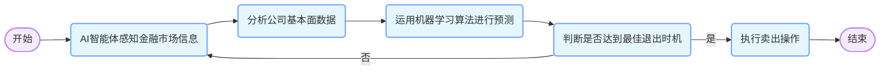

# AI智能体在识别价值投资机会的最佳退出时机中的作用

> 关键词：AI智能体、价值投资、最佳退出时机、机器学习、金融市场

> 摘要：本文深入探讨了AI智能体在识别价值投资机会最佳退出时机方面的作用。首先介绍了研究的背景、目的、预期读者等内容，接着阐述了AI智能体、价值投资等核心概念及其联系，详细讲解了相关核心算法原理并给出Python代码示例，分析了其中涉及的数学模型和公式。通过项目实战展示了如何运用AI智能体进行实际操作，并探讨了其在不同金融场景中的实际应用。此外，还推荐了相关的学习资源、开发工具框架以及论文著作。最后总结了AI智能体在该领域的未来发展趋势与挑战，同时提供了常见问题的解答和扩展阅读参考资料。

## 1. 背景介绍 
### 1.1 目的和范围
价值投资是一种长期投资策略，投资者通过分析公司的基本面，寻找被低估的股票并长期持有。然而，确定最佳的退出时机是价值投资中极具挑战性的问题。传统的投资分析方法往往依赖于投资者的经验和主观判断，难以准确把握市场的复杂变化。本研究的目的在于探讨AI智能体在识别价值投资机会最佳退出时机中的作用，通过利用先进的人工智能技术，提高投资决策的准确性和效率。研究范围涵盖了金融市场中的股票、债券等多种投资领域，以及常见的AI智能体技术和算法。

### 1.2 预期读者
本文预期读者包括金融投资领域的专业人士，如基金经理、投资顾问等，他们希望借助AI技术提升投资决策的水平；计算机科学和人工智能领域的研究人员和开发者，对将AI应用于金融领域感兴趣；以及对价值投资和AI技术有一定了解，希望深入学习相关知识的普通投资者。

### 1.3 文档结构概述
本文首先介绍背景信息，让读者了解研究的目的和范围。接着阐述核心概念与联系，帮助读者理解AI智能体和价值投资的基本原理和相互关系。然后详细讲解核心算法原理和具体操作步骤，并给出相关的数学模型和公式。通过项目实战部分，展示如何将理论应用于实际。随后探讨AI智能体在不同场景下的实际应用。推荐相关的学习资源、开发工具框架和论文著作，为读者提供进一步学习的途径。最后总结未来发展趋势与挑战，解答常见问题并提供扩展阅读参考资料。

### 1.4 术语表
#### 1.4.1 核心术语定义
- **AI智能体**：一种能够感知环境、做出决策并采取行动以实现特定目标的智能程序或系统。它可以通过学习和适应不断提高自己的性能。
- **价值投资**：一种投资策略，投资者通过分析公司的基本面，如财务状况、行业竞争力等，寻找被市场低估的资产，并长期持有，以期望在资产价值回归时获得收益。
- **最佳退出时机**：在价值投资中，指能够实现投资收益最大化或风险最小化的卖出资产的时间点。

#### 1.4.2 相关概念解释
- **机器学习**：AI的一个重要分支，通过让计算机从数据中学习模式和规律，从而实现预测和决策等任务。在识别最佳退出时机中，机器学习算法可以分析大量的金融数据，发现潜在的投资信号。
- **金融市场**：进行资金融通和金融资产交易的场所，包括股票市场、债券市场、期货市场等。价值投资活动主要在金融市场中进行。

#### 1.4.3 缩略词列表
- **AI**：Artificial Intelligence，人工智能
- **ML**：Machine Learning，机器学习

## 2. 核心概念与联系 

### 2.1 AI智能体原理
AI智能体通常由感知模块、决策模块和执行模块组成。感知模块负责收集环境信息，例如金融市场的价格数据、公司财务报表等。决策模块根据感知到的信息，运用各种算法和模型进行分析和判断，确定最佳的行动方案。执行模块则根据决策结果采取相应的行动，如买入或卖出股票。

其基本架构可以用以下文本示意图表示：

```plaintext
          +----------------+
          |  感知模块      |
          |  (收集信息)    |
          +----------------+
                   |
                   v
          +----------------+
          |  决策模块      |
          |  (分析判断)    |
          +----------------+
                   |
                   v
          +----------------+
          |  执行模块      |
          |  (采取行动)    |
          +----------------+
```

### 2.2 价值投资原理
价值投资的核心思想是寻找被市场低估的资产。投资者通过对公司的基本面进行深入分析，包括财务报表、行业前景、管理层能力等，评估公司的内在价值。如果市场价格低于公司的内在价值，投资者认为该资产具有投资价值，会选择买入并长期持有，等待市场价格回归内在价值时卖出获利。

### 2.3 AI智能体与价值投资的联系
AI智能体可以为价值投资提供强大的支持。在价值投资中，确定最佳退出时机需要考虑众多因素，如市场趋势、公司业绩变化、宏观经济环境等。AI智能体可以通过感知模块收集大量的相关信息，利用决策模块中的机器学习算法对这些信息进行分析和处理，挖掘出潜在的投资信号，从而帮助投资者更准确地识别最佳退出时机。例如，AI智能体可以实时监测市场数据，分析公司财务报表的变化趋势，预测行业的发展前景，为投资者提供科学的决策依据。

### 2.4 Mermaid流程图


## 3. 核心算法原理 & 具体操作步骤 

### 3.1 核心算法原理 - 机器学习算法
在识别价值投资机会的最佳退出时机中，常用的机器学习算法包括决策树、支持向量机和神经网络等。这里以决策树算法为例进行详细讲解。

决策树是一种基于树结构进行决策的算法。它通过对数据的特征进行分析和划分，构建一棵决策树。每个内部节点表示一个特征上的测试，每个分支表示一个测试输出，每个叶节点表示一个类别或值。在金融投资领域，决策树可以根据市场数据和公司基本面信息，对是否达到最佳退出时机进行判断。

### 3.2 Python源代码实现决策树算法
```python
import pandas as pd
from sklearn.model_selection import train_test_split
from sklearn.tree import DecisionTreeClassifier
from sklearn.metrics import accuracy_score

# 读取金融数据
data = pd.read_csv('financial_data.csv')

# 提取特征和标签
X = data.drop('exit_signal', axis=1)
y = data['exit_signal']

# 划分训练集和测试集
X_train, X_test, y_train, y_test = train_test_split(X, y, test_size=0.2, random_state=42)

# 创建决策树分类器
clf = DecisionTreeClassifier()

# 训练模型
clf.fit(X_train, y_train)

# 预测测试集
y_pred = clf.predict(X_test)

# 计算准确率
accuracy = accuracy_score(y_test, y_pred)
print(f"模型准确率: {accuracy}")
```

### 3.3 具体操作步骤
1. **数据收集**：收集金融市场的相关数据，包括股票价格、公司财务报表、宏观经济指标等。
2. **数据预处理**：对收集到的数据进行清洗、归一化等处理，以提高数据的质量和可用性。
3. **特征选择**：从预处理后的数据中选择与最佳退出时机相关的特征，如市盈率、市净率等。
4. **模型训练**：使用训练集数据对决策树模型进行训练，调整模型的参数，使其达到最佳性能。
5. **模型评估**：使用测试集数据对训练好的模型进行评估，计算准确率、召回率等指标，评估模型的性能。
6. **预测与决策**：使用训练好的模型对新的数据进行预测，根据预测结果判断是否达到最佳退出时机，做出投资决策。

## 4. 数学模型和公式 & 详细讲解 & 举例说明 

### 4.1 决策树算法的数学模型
决策树算法的核心是选择最优的特征进行划分，以构建决策树。常用的特征选择方法是信息增益和基尼不纯度。

#### 4.1.1 信息增益
信息增益是衡量特征对分类结果影响程度的指标。设数据集 $D$ 的信息熵为 $H(D)$，特征 $A$ 对数据集 $D$ 的信息增益为 $G(D, A)$，其计算公式为：

$$G(D, A) = H(D) - H(D|A)$$

其中，$H(D)$ 表示数据集 $D$ 的信息熵，计算公式为：

$$H(D) = -\sum_{k=1}^{K} p_k \log_2 p_k$$

$p_k$ 表示数据集 $D$ 中第 $k$ 类样本所占的比例，$K$ 表示类别数。

$H(D|A)$ 表示在特征 $A$ 给定的条件下数据集 $D$ 的条件熵，计算公式为：

$$H(D|A) = \sum_{i=1}^{n} \frac{|D_i|}{|D|} H(D_i)$$

其中，$D_i$ 表示根据特征 $A$ 的取值将数据集 $D$ 划分成的第 $i$ 个子集，$|D_i|$ 表示子集 $D_i$ 的样本数，$|D|$ 表示数据集 $D$ 的样本数。

#### 4.1.2 基尼不纯度
基尼不纯度也是衡量数据集纯度的指标。设数据集 $D$ 的基尼不纯度为 $Gini(D)$，其计算公式为：

$$Gini(D) = 1 - \sum_{k=1}^{K} p_k^2$$

在决策树的构建过程中，选择基尼不纯度最小的特征进行划分。

### 4.2 举例说明
假设有一个金融数据集，包含股票的价格、市盈率、市净率等特征，以及是否达到最佳退出时机的标签（0 表示未达到，1 表示达到）。我们可以使用信息增益或基尼不纯度来选择最优的特征进行划分。

例如，对于特征“市盈率”，我们可以计算其对数据集的信息增益或基尼不纯度，根据计算结果判断该特征是否适合作为划分节点。如果信息增益较大或基尼不纯度较小，则说明该特征对分类结果的影响较大，适合作为划分节点。

## 5. 项目实战：代码实际案例和详细解释说明 

### 5.1  开发环境搭建
1. **安装Python**：从Python官方网站（https://www.python.org/downloads/）下载并安装Python 3.x 版本。
2. **安装必要的库**：使用pip命令安装所需的库，如pandas、scikit-learn等。
```bash
pip install pandas scikit-learn
```
3. **准备数据**：收集金融市场的相关数据，并保存为CSV文件，如`financial_data.csv`。

### 5.2  源代码详细实现和代码解读
```python
import pandas as pd
from sklearn.model_selection import train_test_split
from sklearn.tree import DecisionTreeClassifier
from sklearn.metrics import accuracy_score

# 读取金融数据
data = pd.read_csv('financial_data.csv')

# 代码解读：使用pandas库的read_csv函数读取CSV文件中的金融数据，将其存储在DataFrame对象data中。

# 提取特征和标签
X = data.drop('exit_signal', axis=1)
y = data['exit_signal']

# 代码解读：使用DataFrame的drop方法删除标签列'exit_signal'，将剩余的列作为特征存储在X中；将标签列存储在y中。

# 划分训练集和测试集
X_train, X_test, y_train, y_test = train_test_split(X, y, test_size=0.2, random_state=42)

# 代码解读：使用sklearn库的train_test_split函数将数据集划分为训练集和测试集，测试集占比为20%，random_state参数用于保证结果的可重复性。

# 创建决策树分类器
clf = DecisionTreeClassifier()

# 代码解读：使用sklearn库的DecisionTreeClassifier类创建一个决策树分类器对象clf。

# 训练模型
clf.fit(X_train, y_train)

# 代码解读：使用训练集数据对决策树分类器进行训练，通过fit方法让模型学习数据中的模式和规律。

# 预测测试集
y_pred = clf.predict(X_test)

# 代码解读：使用训练好的模型对测试集数据进行预测，将预测结果存储在y_pred中。

# 计算准确率
accuracy = accuracy_score(y_test, y_pred)
print(f"模型准确率: {accuracy}")

# 代码解读：使用sklearn库的accuracy_score函数计算模型的准确率，将测试集的真实标签y_test和预测标签y_pred作为输入，输出模型的准确率并打印。
```

### 5.3  代码解读与分析
- **数据处理**：使用pandas库对金融数据进行读取和处理，方便进行数据的分析和操作。
- **模型选择**：选择决策树分类器作为预测模型，该模型具有简单易懂、可解释性强等优点。
- **模型训练和评估**：通过划分训练集和测试集，对模型进行训练和评估，计算准确率来评估模型的性能。
- **局限性**：决策树模型可能存在过拟合的问题，在实际应用中可以通过调整模型参数、使用剪枝技术等方法来提高模型的泛化能力。

## 6. 实际应用场景 
### 6.1 股票投资
在股票投资中，AI智能体可以实时监测股票的价格走势、公司的财务状况、行业的发展趋势等信息，通过分析这些信息，判断是否达到最佳退出时机。例如，当公司的业绩出现下滑、行业竞争加剧或市场环境发生变化时，AI智能体可以及时发出卖出信号，帮助投资者避免损失。

### 6.2 债券投资
对于债券投资，AI智能体可以分析债券的信用评级、利率走势、宏观经济环境等因素，预测债券的价格变化。当债券的价格达到预期目标或市场风险增加时，AI智能体可以提醒投资者卖出债券，实现投资收益的最大化。

### 6.3 基金投资
在基金投资中，AI智能体可以评估基金的业绩表现、投资策略、基金经理的能力等方面。当基金的业绩持续不佳或投资策略与市场趋势不符时，AI智能体可以建议投资者赎回基金，调整投资组合。

## 7. 工具和资源推荐
### 7.1 学习资源推荐
#### 7.1.1 书籍推荐
- 《Python机器学习》：介绍了Python在机器学习领域的应用，包括各种机器学习算法的原理和实现。
- 《价值投资实战手册》：深入讲解了价值投资的理论和实践方法，为投资者提供了实用的投资指导。
- 《人工智能：现代方法》：全面介绍了人工智能的基本概念、算法和应用，是人工智能领域的经典教材。

#### 7.1.2 在线课程
- Coursera上的“机器学习”课程：由斯坦福大学的Andrew Ng教授授课，系统地介绍了机器学习的基础知识和算法。
- edX上的“人工智能基础”课程：帮助学习者了解人工智能的基本概念和技术。
- 中国大学MOOC上的“金融投资学”课程：提供了金融投资领域的专业知识和实践案例。

#### 7.1.3 技术博客和网站
- Medium：上面有很多关于AI和金融投资的技术文章和案例分享。
- 知乎：有很多专业人士在上面讨论AI和金融投资的相关问题，可以获取到最新的行业动态和观点。
- 雪球网：专注于金融投资领域，提供股票、基金等投资产品的分析和讨论。

### 7.2 开发工具框架推荐
#### 7.2.1 IDE和编辑器
- PyCharm：一款功能强大的Python集成开发环境，提供代码编辑、调试、版本控制等功能。
- Jupyter Notebook：适合进行数据分析和模型开发，支持交互式编程和可视化展示。
- Visual Studio Code：轻量级的代码编辑器，支持多种编程语言和插件扩展。

#### 7.2.2 调试和性能分析工具
- PDB：Python自带的调试工具，可以帮助开发者定位和解决代码中的问题。
- cProfile：Python的性能分析工具，用于分析代码的执行时间和性能瓶颈。
- TensorBoard：用于可视化深度学习模型的训练过程和性能指标。

#### 7.2.3 相关框架和库
- Scikit-learn：提供了丰富的机器学习算法和工具，方便进行模型开发和评估。
- TensorFlow：一个开源的深度学习框架，可用于构建和训练复杂的神经网络模型。
- Pandas：用于数据处理和分析的Python库，提供了高效的数据结构和操作方法。

### 7.3 相关论文著作推荐
#### 7.3.1 经典论文
- “A Machine Learning Approach to Stock Price Prediction”：探讨了机器学习算法在股票价格预测中的应用。
- “Value Investing: The Use of Historical Financial Statement Information to Separate Winners from Losers”：研究了价值投资中如何利用历史财务报表信息进行投资决策。

#### 7.3.2 最新研究成果
- 关注顶级学术会议和期刊，如NeurIPS、ICML、