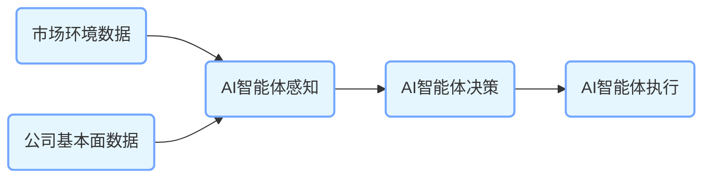

# AI智能体在识别价值投资陷阱中的应用

> 关键词：AI智能体、价值投资陷阱、数据挖掘、机器学习、风险识别

> 摘要：本文聚焦于AI智能体在识别价值投资陷阱中的应用。首先介绍了研究的背景、目的、预期读者等信息，详细阐述了AI智能体和价值投资陷阱的核心概念及联系。接着深入探讨了相关核心算法原理，用Python代码进行了详细说明，并给出了数学模型和公式。通过项目实战，展示了如何搭建开发环境、实现源代码并进行解读。分析了AI智能体在实际投资场景中的应用，推荐了学习资源、开发工具框架以及相关论文著作。最后总结了未来发展趋势与挑战，解答了常见问题，并提供了扩展阅读和参考资料，旨在为投资者和相关从业者提供全面的技术和理论支持，帮助更好地利用AI智能体识别价值投资陷阱。

## 1. 背景介绍 
### 1.1 目的和范围
在价值投资领域，投资者往往希望通过分析公司的基本面来寻找被低估的资产，从而获取长期的投资回报。然而，市场中存在着各种价值投资陷阱，这些陷阱可能导致投资者误判公司的价值，进而遭受损失。本研究的目的在于探索如何利用AI智能体来识别这些价值投资陷阱，提高投资决策的准确性和可靠性。

研究范围涵盖了多种类型的价值投资陷阱，包括但不限于财务造假、行业衰退、竞争优势丧失等。同时，涉及到多种AI技术，如机器学习、深度学习、自然语言处理等，以全面分析和处理与投资相关的各种数据。

### 1.2 预期读者
本文的预期读者包括专业投资者、投资机构的分析师、金融科技领域的从业者以及对价值投资和AI技术感兴趣的研究人员。对于专业投资者和分析师来说，本文可以为他们提供新的投资分析工具和方法；对于金融科技从业者，有助于他们了解AI在金融投资领域的应用场景；对于研究人员，则可以作为进一步深入研究的参考资料。

### 1.3 文档结构概述
本文首先介绍了研究的背景信息，包括目的、预期读者和文档结构。接着详细阐述了AI智能体和价值投资陷阱的核心概念及它们之间的联系，并给出了相应的示意图和流程图。然后深入探讨了用于识别价值投资陷阱的核心算法原理，并用Python代码进行了具体实现。之后，介绍了相关的数学模型和公式，并通过具体例子进行了说明。通过项目实战，展示了如何搭建开发环境、实现源代码并进行详细解读。分析了AI智能体在实际投资场景中的应用，推荐了学习资源、开发工具框架以及相关论文著作。最后总结了未来发展趋势与挑战，解答了常见问题，并提供了扩展阅读和参考资料。

### 1.4 术语表
#### 1.4.1 核心术语定义
- **AI智能体**：是一种能够感知环境、自主决策并采取行动以实现特定目标的人工智能实体。在本文中，AI智能体用于分析投资相关的数据，识别价值投资陷阱。
- **价值投资陷阱**：指投资者在进行价值投资时，由于对公司的基本面分析出现偏差，误将一些看似具有投资价值但实际上存在潜在风险的资产视为优质投资标的，从而导致投资损失的情况。
- **机器学习**：是一门多领域交叉学科，涉及概率论、统计学、逼近论、凸分析、算法复杂度理论等多门学科。它专门研究计算机怎样模拟或实现人类的学习行为，以获取新的知识或技能，重新组织已有的知识结构使之不断改善自身的性能。
- **深度学习**：是机器学习的一个分支领域，它是一种基于对数据进行表征学习的方法。深度学习通过构建具有很多层的神经网络模型，自动从大量数据中学习特征和模式。

#### 1.4.2 相关概念解释
- **数据挖掘**：是指从大量的数据中通过算法搜索隐藏于其中信息的过程。在识别价值投资陷阱中，数据挖掘可以用于从海量的金融数据中提取有价值的信息，如公司的财务指标、市场行情等。
- **自然语言处理**：是计算机科学领域与人工智能领域中的一个重要方向。它研究能实现人与计算机之间用自然语言进行有效通信的各种理论和方法。在投资分析中，自然语言处理可以用于分析新闻报道、公司公告等文本信息，以获取有关公司的最新动态和潜在风险。

#### 1.4.3 缩略词列表
- **AI**：Artificial Intelligence，人工智能
- **ML**：Machine Learning，机器学习
- **DL**：Deep Learning，深度学习
- **NLP**：Natural Language Processing，自然语言处理

## 2. 核心概念与联系 

### 核心概念原理
#### AI智能体
AI智能体是一种能够感知环境、做出决策并采取行动的实体。它通常由感知模块、决策模块和执行模块组成。感知模块负责收集环境中的信息，如市场数据、公司财务报表等；决策模块根据感知到的信息进行分析和推理，判断是否存在价值投资陷阱；执行模块则根据决策结果采取相应的行动，如提醒投资者、调整投资组合等。

#### 价值投资陷阱
价值投资陷阱的形成原因多种多样，主要包括以下几个方面：
- **财务造假**：公司为了美化财务报表，可能会进行虚假的会计处理，如虚构收入、隐瞒债务等。这种情况下，投资者根据虚假的财务数据进行价值评估，很容易陷入投资陷阱。
- **行业衰退**：某些行业由于技术进步、市场需求变化等原因，可能会进入衰退期。如果投资者没有及时察觉行业的变化，仍然按照过去的业绩和前景对行业内的公司进行价值评估，就可能会高估公司的价值。
- **竞争优势丧失**：公司的竞争优势是其价值的重要支撑。如果公司由于竞争对手的挑战、自身经营管理不善等原因，丧失了原有的竞争优势，其价值也会随之下降。

### 架构的文本示意图
```plaintext
                +----------------+
                |  市场环境数据  |
                +----------------+
                       |
                       v
+----------------+     |     +----------------+
|  AI智能体感知  |<----+---->|  公司基本面数据  |
+----------------+           +----------------+
                       |
                       v
+----------------+
|  AI智能体决策  |
+----------------+
                       |
                       v
+----------------+
|  AI智能体执行  |
+----------------+
```

### Mermaid流程图


## 3. 核心算法原理 & 具体操作步骤 

### 核心算法原理
#### 机器学习算法 - 决策树
决策树是一种常用的机器学习算法，它通过对数据进行递归划分，构建一个树状结构的模型。在识别价值投资陷阱中，决策树可以根据公司的各种特征（如财务指标、行业排名等），对公司是否存在投资陷阱进行分类。

决策树的构建过程主要包括以下几个步骤：
1. **特征选择**：选择对分类结果影响最大的特征作为划分节点。常用的特征选择方法有信息增益、信息增益比、基尼指数等。
2. **节点划分**：根据选择的特征，将数据集划分为不同的子集。
3. **递归构建**：对每个子集重复上述步骤，直到满足终止条件（如子集内的样本数小于某个阈值、所有样本属于同一类别等）。

#### 深度学习算法 - 神经网络
神经网络是一种模仿人类神经系统的计算模型，它由多个神经元组成的层构成。在识别价值投资陷阱中，神经网络可以自动学习数据中的复杂模式和特征。

神经网络的训练过程主要包括以下几个步骤：
1. **数据预处理**：对输入数据进行归一化、标准化等处理，以提高模型的训练效果。
2. **模型构建**：定义神经网络的结构，包括输入层、隐藏层和输出层的神经元数量和连接方式。
3. **损失函数定义**：选择合适的损失函数来衡量模型的预测结果与真实标签之间的差异。
4. **优化算法选择**：选择合适的优化算法（如随机梯度下降、Adam等）来更新模型的参数，以最小化损失函数。
5. **模型训练**：将预处理后的数据输入到模型中进行训练，不断调整模型的参数，直到达到满意的效果。

### 具体操作步骤及Python源代码

#### 决策树算法实现
```python
import pandas as pd
from sklearn.model_selection import train_test_split
from sklearn.tree import DecisionTreeClassifier
from sklearn.metrics import accuracy_score

# 加载数据集
data = pd.read_csv('investment_data.csv')

# 分离特征和标签
X = data.drop('is_trap', axis=1)
y = data['is_trap']

# 划分训练集和测试集
X_train, X_test, y_train, y_test = train_test_split(X, y, test_size=0.2, random_state=42)

# 创建决策树分类器
clf = DecisionTreeClassifier()

# 训练模型
clf.fit(X_train, y_train)

# 预测测试集
y_pred = clf.predict(X_test)

# 计算准确率
accuracy = accuracy_score(y_test, y_pred)
print(f"决策树模型的准确率: {accuracy}")
```

#### 神经网络算法实现
```python
import pandas as pd
import numpy as np
from sklearn.model_selection import train_test_split
from sklearn.preprocessing import StandardScaler
import tensorflow as tf
from tensorflow.keras.models import Sequential
from tensorflow.keras.layers import Dense

# 加载数据集
data = pd.read_csv('investment_data.csv')

# 分离特征和标签
X = data.drop('is_trap', axis=1)
y = data['is_trap']

# 数据预处理
scaler = StandardScaler()
X = scaler.fit_transform(X)

# 划分训练集和测试集
X_train, X_test, y_train, y_test = train_test_split(X, y, test_size=0.2, random_state=42)

# 构建神经网络模型
model = Sequential([
    Dense(64, activation='relu', input_shape=(X_train.shape[1],)),
    Dense(32, activation='relu'),
    Dense(1, activation='sigmoid')
])

# 编译模型
model.compile(optimizer='adam', loss='binary_crossentropy', metrics=['accuracy'])

# 训练模型
model.fit(X_train, y_train, epochs=50, batch_size=32, validation_data=(X_test, y_test))

# 评估模型
_, accuracy = model.evaluate(X_test, y_test)
print(f"神经网络模型的准确率: {accuracy}")
```

## 4. 数学模型和公式 & 详细讲解 & 举例说明 

### 决策树的信息增益公式
信息增益是决策树中常用的特征选择方法，它衡量了使用某个特征进行划分后，数据集的不确定性减少的程度。信息增益的计算公式如下：
$$
IG(D, A) = H(D) - H(D|A)
$$
其中，$IG(D, A)$ 表示特征 $A$ 对数据集 $D$ 的信息增益，$H(D)$ 表示数据集 $D$ 的熵，$H(D|A)$ 表示在特征 $A$ 的条件下，数据集 $D$ 的条件熵。

#### 熵的计算公式
$$
H(D) = -\sum_{k=1}^{K}p_k\log_2p_k
$$
其中，$K$ 表示数据集 $D$ 中类别的数量，$p_k$ 表示第 $k$ 类样本在数据集 $D$ 中所占的比例。

#### 条件熵的计算公式
$$
H(D|A) = \sum_{i=1}^{n}\frac{|D_i|}{|D|}H(D_i)
$$
其中，$n$ 表示特征 $A$ 的取值个数，$D_i$ 表示特征 $A$ 取值为第 $i$ 个值的样本子集，$|D|$ 表示数据集 $D$ 的样本数量，$|D_i|$ 表示子集 $D_i$ 的样本数量。

#### 举例说明
假设有一个数据集 $D$ 包含 10 个样本，其中 6 个样本属于类别 0，4 个样本属于类别 1。则数据集 $D$ 的熵为：
$$
H(D) = -\frac{6}{10}\log_2\frac{6}{10} - \frac{4}{10}\log_2\frac{4}{10} \approx 0.971
$$
假设特征 $A$ 有两个取值，$A_1$ 和 $A_2$。其中，$A_1$ 对应的样本子集 $D_1$ 包含 4 个样本，其中 3 个属于类别 0，1 个属于类别 1；$A_2$ 对应的样本子集 $D_2$ 包含 6 个样本，其中 3 个属于类别 0，3 个属于类别 1。则特征 $A$ 的条件熵为：
$$
H(D|A) = \frac{4}{10}(-\frac{3}{4}\log_2\frac{3}{4} - \frac{1}{4}\log_2\frac{1}{4}) + \frac{6}{10}(-\frac{3}{6}\log_2\frac{3}{6} - \frac{3}{6}\log_2\frac{3}{6}) \approx 0.811
$$
因此，特征 $A$ 对数据集 $D$ 的信息增益为：
$$
IG(D, A) = H(D) - H(D|A) \approx 0.971 - 0.811 = 0.16
$$

### 神经网络的损失函数 - 二元交叉熵
在二分类问题中，常用的损失函数是二元交叉熵。二元交叉熵的计算公式如下：
$$
L(y, \hat{y}) = -\frac{1}{N}\sum_{i=1}^{N}[y_i\log(\hat{y}_i) + (1 - y_i)\log(1 - \hat{y}_i)]
$$
其中，$N$ 表示样本数量，$y_i$ 表示第 $i$ 个样本的真实标签（0 或 1），$\hat{y}_i$ 表示第 $i$ 个样本的预测概率。

#### 举例说明
假设我们有 3 个样本，真实标签分别为 $y = [1, 0, 1]$，预测概率分别为 $\hat{y} = [0.8, 0.2, 0.6]$。则二元交叉熵损失为：
$$
L(y, \hat{y}) = -\frac{1}{3}[(1\times\log(0.8) + (1 - 1)\times\log(1 - 0.8)) + (0\times\log(0.2) + (1 - 0)\times\log(1 - 0.2)) + (1\times\log(0.6) + (1 - 1)\times\log(1 - 0.6))] \approx 0.367
$$

## 5. 项目实战：代码实际案例和详细解释说明 

### 5.1  开发环境搭建
#### 安装Python
首先，需要安装Python环境。可以从Python官方网站（https://www.python.org/downloads/） 下载适合自己操作系统的Python版本，并按照安装向导进行安装。

#### 安装必要的库
使用以下命令安装项目所需的库：
```sh
pip install pandas scikit-learn tensorflow
```

### 5.2  源代码详细实现和代码解读
#### 数据加载和预处理
```python
import pandas as pd
from sklearn.preprocessing import StandardScaler

# 加载数据集
data = pd.read_csv('investment_data.csv')

# 分离特征和标签
X = data.drop('is_trap', axis=1)
y = data['is_trap']

# 数据预处理
scaler = StandardScaler()
X = scaler.fit_transform(X)
```
代码解读：
- `pd.read_csv('investment_data.csv')`：使用 `pandas` 库读取存储在 `investment_data.csv` 文件中的数据集。
- `data.drop('is_trap', axis=1)`：从数据集中删除 `is_trap` 列，将其余列作为特征。
- `StandardScaler()`：创建一个标准化器对象，用于对特征数据进行标准化处理，使数据的均值为 0，标准差为 1。

#### 模型构建和训练
```python
from sklearn.model_selection import train_test_split
import tensorflow as tf
from tensorflow.keras.models import Sequential
from tensorflow.keras.layers import Dense

# 划分训练集和测试集
X_train, X_test, y_train, y_test = train_test_split(X, y, test_size=0.2, random_state=42)

# 构建神经网络模型
model = Sequential([
    Dense(64, activation='relu', input_shape=(X_train.shape[1],)),
    Dense(32, activation='relu'),
    Dense(1, activation='sigmoid')
])

# 编译模型
model.compile(optimizer='adam', loss='binary_crossentropy', metrics=['accuracy'])

# 训练模型
model.fit(X_train, y_train, epochs=50, batch_size=32, validation_data=(X_test, y_test))
```
代码解读：
- `train_test_split(X, y, test_size=0.2, random_state=42)`：使用 `sklearn` 库的 `train_test_split` 函数将数据集划分为训练集和测试集，其中测试集占总数据集的 20%。
- `Sequential()`：创建一个顺序模型，这是一种简单的线性堆叠模型。
- `Dense(64, activation='relu', input_shape=(X_train.shape[1],))`：添加一个全连接层，包含 64 个神经元，激活函数为 `relu`，输入形状为训练集特征的维度。
- `model.compile(optimizer='adam', loss='binary_crossentropy', metrics=['accuracy'])`：编译模型，指定优化器为 `adam`，损失函数为二元交叉熵，评估指标为准确率。
- `model.fit(X_train, y_train, epochs=50, batch_size=32, validation_data=(X_test, y_test))`：训练模型，设置训练轮数为 50，每个批次的样本数为 32，并使用测试集进行验证。

#### 模型评估
```python
# 评估模型
_, accuracy = model.evaluate(X_test, y_test)
print(f"神经网络模型的准确率: {accuracy}")
```
代码解读：
- `model.evaluate(X_test, y_test)`：使用测试集对模型进行评估，返回损失值和准确率。

### 5.3  代码解读与分析
通过上述代码，我们实现了一个基于神经网络的价值投资陷阱识别模型。首先，我们对数据进行了加载和预处理，确保数据的质量和可用性。然后，构建了一个简单的神经网络模型，并使用训练集对模型进行训练。在训练过程中，通过不断调整模型的参数，使模型的损失函数逐渐减小，准确率逐渐提高。最后，使用测试集对模型进行评估，得到模型的准确率。

需要注意的是，模型的性能可能受到多种因素的影响，如数据质量、模型结构、超参数设置等。在实际应用中，需要对这些因素进行优化和调整，以提高模型的性能。

## 6. 实际应用场景 
### 投资机构
投资机构可以使用AI智能体来辅助投资决策。在进行价值投资时，AI智能体可以快速分析大量的公司数据，识别潜在的价值投资陷阱，帮助投资机构避免投资失误。例如，投资机构可以将AI智能体集成到其投资分析系统中，在筛选投资标的时，自动对公司进行评估，标记出可能存在风险的公司。

### 个人投资者
个人投资者可以利用AI智能体来提高自己的投资水平。个人投资者通常缺乏专业的投资分析能力和大量的时间来研究公司基本面。AI智能体可以为个人投资者提供实时的投资建议，帮助他们识别价值投资陷阱。例如，个人投资者可以使用手机应用程序中的AI智能体，在查看股票信息时，获得关于该股票是否存在投资陷阱的提示。

### 金融监管机构
金融监管机构可以使用AI智能体来加强对金融市场的监管。AI智能体可以监测市场中的异常交易行为和公司的财务状况，及时发现潜在的价值投资陷阱和金融风险。例如，监管机构可以利用AI智能体对上市公司的财务报表进行分析，识别可能存在的财务造假行为，维护金融市场的稳定和健康发展。

## 7. 工具和资源推荐
### 7.1 学习资源推荐
#### 7.1.1 书籍推荐
- 《机器学习》（周志华）：这本书全面介绍了机器学习的基本概念、算法和应用，是学习机器学习的经典教材。
- 《深度学习》（Ian Goodfellow、Yoshua Bengio和Aaron Courville）：该书系统地介绍了深度学习的理论和实践，适合对深度学习感兴趣的读者深入学习。
- 《Python数据分析实战》（Sebastian Raschka）：本书结合Python编程语言，介绍了数据分析的基本方法和技巧，对于处理投资相关的数据非常有帮助。

#### 7.1.2 在线课程
- Coursera上的“机器学习”课程（Andrew Ng教授）：该课程是机器学习领域的经典课程，由斯坦福大学的Andrew Ng教授授课，内容涵盖了机器学习的基本概念、算法和应用。
- edX上的“深度学习专项课程”（deeplearning.ai）：这是一个系列课程，由深度学习领域的知名专家授课，深入介绍了深度学习的各个方面。
- 网易云课堂上的“Python金融数据分析实战”课程：该课程结合金融领域的实际案例，介绍了如何使用Python进行金融数据分析，对于投资分析非常有帮助。

#### 7.1.3 技术博客和网站
- Towards Data Science：这是一个专注于数据科学和机器学习的技术博客，上面有很多关于AI技术在金融领域应用的文章。
- Kaggle：Kaggle是一个数据科学竞赛平台，上面有很多关于金融数据的数据集和优秀的解决方案，可以学习到很多实用的数据分析和机器学习技巧。
- 金融界网站：该网站提供了丰富的金融资讯和数据，对于了解金融市场和投资信息非常有帮助。

### 7.2 开发工具框架推荐
#### 7.2.1 IDE和编辑器
- PyCharm：是一款专门为Python开发设计的集成开发环境，具有代码编辑、调试、自动完成等功能，非常适合Python项目的开发。
- Jupyter Notebook：是一个基于Web的交互式计算环境，可以方便地进行数据分析、模型训练和结果展示，对于数据科学项目非常有用。

#### 7.2.2 调试和性能分析工具
- TensorBoard：是TensorFlow提供的一个可视化工具，可以用于可视化模型的训练过程、损失函数变化、网络结构等，帮助开发者调试和优化模型。
- Scikit-learn的交叉验证工具：可以用于评估模型的性能和选择最佳的超参数，提高模型的泛化能力。

#### 7.2.3 相关框架和库
- TensorFlow：是一个开源的机器学习框架，提供了丰富的工具和接口，支持深度学习模型的构建、训练和部署。
- PyTorch：是另一个流行的深度学习框架，具有动态图的特点，易于使用和调试，适合快速开发和实验。
- Scikit-learn：是一个简单易用的机器学习库，提供了各种机器学习算法和工具，如分类、回归、聚类等，对于初学者非常友好。

### 7.3 相关论文著作推荐
#### 7.3.1 经典论文
- “A Decision-Theoretic Generalization of On-Line Learning and an Application to Boosting”（Yoav Freund和Robert E. Schapire）：该论文提出了AdaBoost算法，是机器学习领域的经典论文之一。
- “ImageNet Classification with Deep Convolutional Neural Networks”（Alex Krizhevsky、Ilya Sutskever和Geoffrey E. Hinton）：这篇论文介绍了AlexNet模型，开创了深度学习在图像分类领域的先河。

#### 7.3.2 最新研究成果
- 可以关注顶级学术会议如NeurIPS、ICML、CVPR等上的相关研究成果，了解AI技术在金融投资领域的最新进展。
- 一些知名的学术期刊如《Journal of Financial Economics》、《Review of Financial Studies》等也会发表关于金融投资和AI应用的研究论文。

#### 7.3.3 应用案例分析
- 《金融科技前沿：AI、区块链与量化金融》：该书介绍了AI技术在金融领域的各种应用案例，包括价值投资陷阱识别、风险评估等，对于实际应用具有很好的参考价值。

## 8. 总结：未来发展趋势与挑战
### 未来发展趋势
#### 多模态数据融合
未来，AI智能体将不仅仅依赖于结构化的金融数据，还会融合文本、图像、音频等多模态数据。例如，通过分析公司的年报、新闻报道等文本信息，以及产品图片、视频等视觉信息，更全面地了解公司的情况，提高识别价值投资陷阱的准确性。

#### 强化学习的应用
强化学习可以使AI智能体在不断的实践中学习和优化投资策略。未来，强化学习将更多地应用于价值投资领域，让AI智能体根据市场环境的变化自动调整投资决策，更好地应对价值投资陷阱。

#### 与区块链技术结合
区块链技术具有去中心化、不可篡改等特点，可以保证金融数据的真实性和安全性。将AI智能体与区块链技术结合，可以有效防止财务造假等问题，提高价值投资的可靠性。

### 挑战
#### 数据质量和隐私问题
高质量的数据是AI智能体准确识别价值投资陷阱的基础。然而，金融数据往往存在噪声、缺失值等问题，需要进行复杂的数据清洗和预处理。同时，金融数据涉及到用户的隐私和商业机密，如何在保证数据安全和隐私的前提下，充分利用数据进行分析是一个挑战。

#### 模型可解释性
深度学习模型通常是黑盒模型，难以解释其决策过程和依据。在价值投资领域，投资者需要了解AI智能体的决策原因，以便做出合理的投资决策。因此，提高模型的可解释性是一个亟待解决的问题。

#### 市场变化的适应性
金融市场是复杂多变的，新的价值投资陷阱形式可能不断出现。AI智能体需要具备良好的适应性，能够及时学习和应对市场的变化，否则可能会出现误判。

## 9. 附录：常见问题与解答
### 问题1：AI智能体识别价值投资陷阱的准确率有多高？
答：AI智能体的准确率受到多种因素的影响，如数据质量、模型结构、超参数设置等。在实际应用中，需要不断优化和调整这些因素，以提高模型的准确率。一般来说，经过良好训练的模型可以达到较高的准确率，但不能保证100%的准确性。

### 问题2：如何选择适合的AI算法来识别价值投资陷阱？
答：选择适合的AI算法需要考虑多个因素，如数据的特点、问题的复杂度、计算资源等。对于简单的分类问题，可以选择决策树、逻辑回归等传统机器学习算法；对于复杂的模式识别问题，可以选择深度学习算法，如神经网络。在实际应用中，可以尝试多种算法，并比较它们的性能，选择最优的算法。

### 问题3：AI智能体可以完全替代人类投资者吗？
答：虽然AI智能体在识别价值投资陷阱方面具有一定的优势，但它不能完全替代人类投资者。人类投资者具有丰富的经验、直觉和判断力，可以考虑到一些AI智能体难以量化的因素，如市场情绪、政策变化等。因此，在实际投资中，应该将AI智能体作为辅助工具，结合人类投资者的智慧，做出更合理的投资决策。

## 10. 扩展阅读 & 参考资料
### 扩展阅读
- 《智能投资：从AI到量化投资》：本书介绍了AI技术在投资领域的应用，包括智能选股、风险控制等方面，对于深入了解AI在投资中的应用有很大帮助。
- 《金融科技：重构未来金融生态》：该书探讨了金融科技的发展趋势和应用场景，其中涉及到AI智能体在金融监管、投资分析等方面的应用。

### 参考资料
- [周志华. 机器学习[M]. 清华大学出版社, 2016.]
- [Ian Goodfellow, Yoshua Bengio, Aaron Courville. Deep Learning[M]. MIT Press, 2016.]
- [Sebastian Raschka. Python Machine Learning[M]. Packt Publishing, 2015.]

作者：AI天才研究院/AI Genius Institute & 禅与计算机程序设计艺术 /Zen And The Art of Computer Programming