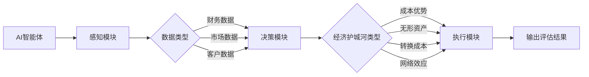

# AI智能体在识别经济护城河中的作用

> 关键词：AI智能体、经济护城河、识别、数据分析、机器学习

> 摘要：本文深入探讨了AI智能体在识别经济护城河方面的重要作用。首先介绍了相关背景知识，包括目的、预期读者、文档结构和术语表。接着阐述了AI智能体与经济护城河的核心概念及联系，并给出了相应的文本示意图和Mermaid流程图。详细讲解了核心算法原理和具体操作步骤，结合Python源代码进行说明。还分析了数学模型和公式，并举例说明。通过项目实战展示了代码实际案例及详细解释。探讨了AI智能体在识别经济护城河的实际应用场景，推荐了相关的工具和资源。最后总结了未来发展趋势与挑战，提供了常见问题解答和扩展阅读参考资料。

## 1. 背景介绍 
### 1.1 目的和范围
在当今复杂多变的经济环境中，准确识别企业的经济护城河对于投资者、分析师和企业管理者都具有至关重要的意义。经济护城河代表了企业抵御竞争对手、维持长期盈利能力的能力。然而，传统的识别方法往往依赖于人工分析和经验判断，存在主观性强、效率低下等问题。本文章的目的在于探讨AI智能体在识别经济护城河方面的应用，通过先进的技术手段提高识别的准确性和效率。范围涵盖了AI智能体的相关技术、经济护城河的主要类型以及两者之间的结合应用。

### 1.2 预期读者
本文的预期读者包括金融领域的投资者、分析师，希望借助AI技术更好地评估企业投资价值；企业管理者，期望通过了解经济护城河的识别方法来制定战略决策；以及对AI和经济领域交叉应用感兴趣的科研人员和学生。

### 1.3 文档结构概述
本文将首先介绍核心概念，包括AI智能体和经济护城河的定义和联系；接着详细讲解用于识别经济护城河的核心算法原理和具体操作步骤，并给出Python代码示例；然后分析相关的数学模型和公式；通过项目实战展示实际应用；探讨AI智能体在不同场景下的应用；推荐学习资源、开发工具和相关论文；最后总结未来发展趋势与挑战，解答常见问题并提供扩展阅读资料。

### 1.4 术语表
#### 1.4.1 核心术语定义
- **AI智能体（AI Agent）**：是一种能够感知环境、进行决策并采取行动以实现特定目标的人工智能实体。它可以自主地从环境中获取信息，运用内置的算法和模型进行分析和推理，最终做出决策并执行相应的操作。
- **经济护城河（Economic Moat）**：由沃伦·巴菲特提出的概念，指企业拥有的一种可持续的竞争优势，使企业能够在长期内抵御竞争对手的侵蚀，保持高于行业平均水平的盈利能力。

#### 1.4.2 相关概念解释
- **机器学习（Machine Learning）**：是AI智能体的核心技术之一，它使计算机能够从数据中自动学习模式和规律，而无需明确的编程指令。通过对大量数据的训练，机器学习模型可以对未知数据进行预测和分类。
- **数据挖掘（Data Mining）**：是从大量的、不完全的、有噪声的、模糊的、随机的数据中提取隐含在其中的、人们事先不知道的、但又是潜在有用的信息和知识的过程。在识别经济护城河时，数据挖掘可以帮助发现与企业竞争优势相关的关键因素。

#### 1.4.3 缩略词列表
- **ML**：Machine Learning（机器学习）
- **DL**：Deep Learning（深度学习）
- **NLP**：Natural Language Processing（自然语言处理）

## 2. 核心概念与联系 

### 2.1 AI智能体核心概念
AI智能体是人工智能领域的一个重要概念，它可以看作是一个具有自主性、反应性、社会性和适应性的实体。自主性意味着AI智能体能够在没有人类干预的情况下自主地执行任务；反应性使它能够感知环境的变化并及时做出响应；社会性表示它可以与其他智能体或人类进行交互；适应性则指它能够根据环境的变化调整自己的行为和策略。

AI智能体的架构通常包括感知模块、决策模块和执行模块。感知模块负责从环境中获取信息，如数据、图像、文本等；决策模块对感知到的信息进行分析和处理，运用各种算法和模型做出决策；执行模块根据决策结果采取相应的行动。

### 2.2 经济护城河核心概念
经济护城河主要有以下几种类型：
- **成本优势护城河**：企业通过规模经济、独特的生产工艺或低成本的原材料采购等方式，使其生产成本低于竞争对手，从而在市场上具有价格优势。
- **无形资产护城河**：包括品牌、专利、商标、特许权等。这些无形资产可以使企业的产品或服务具有独特性，吸引消费者并提高客户忠诚度。
- **转换成本护城河**：当客户从一个企业的产品或服务转换到另一个企业的产品或服务时，需要付出较高的成本，如时间、金钱、精力等。这种转换成本会使客户倾向于继续使用原企业的产品或服务。
- **网络效应护城河**：随着用户数量的增加，产品或服务的价值也会随之增加。例如，社交网络平台的用户越多，其对新用户的吸引力就越大，从而形成一种良性循环。

### 2.3 核心概念联系
AI智能体可以通过对大量的企业数据进行分析，识别出企业是否具有经济护城河以及护城河的类型和强度。例如，AI智能体可以利用机器学习算法对企业的财务数据、市场数据、客户数据等进行挖掘，发现与成本优势、无形资产、转换成本和网络效应相关的特征。通过对这些特征的分析，AI智能体可以判断企业是否拥有经济护城河，并对其进行量化评估。

### 2.4 文本示意图
```plaintext
AI智能体
|
|--感知模块（获取企业数据：财务、市场、客户等）
|
|--决策模块（机器学习算法分析数据，识别经济护城河特征）
|
|--执行模块（输出经济护城河评估结果）

经济护城河
|
|--成本优势护城河
|
|--无形资产护城河
|
|--转换成本护城河
|
|--网络效应护城河
```

### 2.5 Mermaid流程图


## 3. 核心算法原理 & 具体操作步骤 

### 3.1 核心算法原理
在识别经济护城河时，常用的机器学习算法包括决策树、随机森林、支持向量机和深度学习算法等。下面以决策树算法为例进行详细讲解。

决策树是一种基于树结构进行决策的机器学习算法。它通过对数据的特征进行划分，构建一个树形结构，每个内部节点表示一个特征上的测试，每个分支表示测试输出，每个叶节点表示一个类别或值。决策树的构建过程是一个递归的过程，通过选择最优的特征进行划分，使得划分后的子集具有较高的纯度。

### 3.2 具体操作步骤
#### 3.2.1 数据收集
收集企业的相关数据，包括财务数据（如营业收入、净利润、毛利率等）、市场数据（如市场份额、竞争对手情况等）、客户数据（如客户满意度、客户忠诚度等）。

#### 3.2.2 数据预处理
对收集到的数据进行清洗、转换和归一化处理。清洗数据是指去除重复值、缺失值和异常值；转换数据是指将非数值型数据转换为数值型数据；归一化处理是指将数据缩放到一个特定的范围，如[0, 1]。

#### 3.2.3 特征选择
从预处理后的数据中选择与经济护城河相关的特征。可以使用相关性分析、方差分析等方法进行特征选择，选择那些对经济护城河有显著影响的特征。

#### 3.2.4 模型训练
使用选择好的特征和对应的经济护城河标签（如是否具有经济护城河、护城河的类型等）对决策树模型进行训练。可以使用Python的scikit-learn库来实现决策树模型的训练。

#### 3.2.5 模型评估
使用测试数据对训练好的模型进行评估，计算模型的准确率、召回率、F1值等指标，评估模型的性能。

#### 3.2.6 模型应用
使用训练好的模型对未知企业的数据进行预测，识别企业是否具有经济护城河以及护城河的类型和强度。

### 3.3 Python源代码示例
```python
import pandas as pd
from sklearn.model_selection import train_test_split
from sklearn.tree import DecisionTreeClassifier
from sklearn.metrics import accuracy_score

# 1. 数据收集和读取
data = pd.read_csv('enterprise_data.csv')

# 2. 数据预处理
# 去除缺失值
data = data.dropna()

# 分离特征和标签
X = data.drop('has_moat', axis=1)
y = data['has_moat']

# 3. 特征选择（这里简单选择所有特征）
# 可以使用更复杂的特征选择方法，如相关性分析等

# 4. 划分训练集和测试集
X_train, X_test, y_train, y_test = train_test_split(X, y, test_size=0.2, random_state=42)

# 5. 模型训练
model = DecisionTreeClassifier()
model.fit(X_train, y_train)

# 6. 模型评估
y_pred = model.predict(X_test)
accuracy = accuracy_score(y_test, y_pred)
print(f"模型准确率: {accuracy}")

# 7. 模型应用
new_data = pd.read_csv('new_enterprise_data.csv')
new_pred = model.predict(new_data)
print(f"新企业是否有经济护城河的预测结果: {new_pred}")
```

## 4. 数学模型和公式 & 详细讲解 & 举例说明 

### 4.1 信息熵
信息熵是决策树算法中用于衡量数据纯度的一个重要指标。它表示数据的不确定性程度，信息熵越大，数据的不确定性越大，纯度越低；信息熵越小，数据的不确定性越小，纯度越高。

信息熵的计算公式为：
$$H(X) = -\sum_{i=1}^{n}p(x_i)\log_2p(x_i)$$
其中，$X$ 是一个随机变量，$p(x_i)$ 是 $X$ 取值为 $x_i$ 的概率，$n$ 是 $X$ 可能取值的个数。

### 4.2 信息增益
信息增益是决策树算法中用于选择最优特征进行划分的指标。它表示在使用某个特征进行划分后，数据的纯度提高的程度。信息增益越大，说明使用该特征进行划分后，数据的纯度提高得越多，该特征越适合作为划分特征。

信息增益的计算公式为：
$$IG(D, A) = H(D) - \sum_{v=1}^{V}\frac{|D^v|}{|D|}H(D^v)$$
其中，$D$ 是数据集，$A$ 是特征，$H(D)$ 是数据集 $D$ 的信息熵，$V$ 是特征 $A$ 可能取值的个数，$D^v$ 是数据集 $D$ 中特征 $A$ 取值为 $v$ 的子集，$|D|$ 和 $|D^v|$ 分别表示数据集 $D$ 和子集 $D^v$ 的样本数量。

### 4.3 详细讲解
在决策树的构建过程中，首先计算数据集的信息熵 $H(D)$。然后对于每个特征 $A$，计算使用该特征进行划分后的信息增益 $IG(D, A)$。选择信息增益最大的特征作为当前节点的划分特征，将数据集划分为多个子集。对于每个子集，递归地重复上述过程，直到满足停止条件（如子集的样本数量小于某个阈值、信息增益小于某个阈值等）。

### 4.4 举例说明
假设有一个数据集 $D$ 包含 10 个样本，其中 6 个样本属于类别 1，4 个样本属于类别 2。则数据集 $D$ 的信息熵为：
$$H(D) = -\frac{6}{10}\log_2\frac{6}{10} - \frac{4}{10}\log_2\frac{4}{10} \approx 0.971$$
假设现在有一个特征 $A$，它有两个取值 $A_1$ 和 $A_2$。其中，取值为 $A_1$ 的样本有 4 个，属于类别 1 的有 3 个，属于类别 2 的有 1 个；取值为 $A_2$ 的样本有 6 个，属于类别 1 的有 3 个，属于类别 2 的有 3 个。则使用特征 $A$ 进行划分后的信息熵为：
$$H(D^1) = -\frac{3}{4}\log_2\frac{3}{4} - \frac{1}{4}\log_2\frac{1}{4} \approx 0.811$$
$$H(D^2) = -\frac{3}{6}\log_2\frac{3}{6} - \frac{3}{6}\log_2\frac{3}{6} = 1$$
$$\sum_{v=1}^{2}\frac{|D^v|}{|D|}H(D^v) = \frac{4}{10} \times 0.811 + \frac{6}{10} \times 1 \approx 0.924$$
信息增益为：
$$IG(D, A) = H(D) - \sum_{v=1}^{2}\frac{|D^v|}{|D|}H(D^v) = 0.971 - 0.924 = 0.047$$

## 5. 项目实战：代码实际案例和详细解释说明 

### 5.1  开发环境搭建
#### 5.1.1 安装Python
首先需要安装Python，建议安装Python 3.7及以上版本。可以从Python官方网站（https://www.python.org/downloads/）下载安装包，按照安装向导进行安装。

#### 5.1.2 安装必要的库
使用pip命令安装必要的库，包括pandas、scikit-learn等。在命令行中执行以下命令：
```sh
pip install pandas scikit-learn
```

### 5.2  源代码详细实现和代码解读
```python
import pandas as pd
from sklearn.model_selection import train_test_split
from sklearn.tree import DecisionTreeClassifier
from sklearn.metrics import accuracy_score

# 1. 数据收集和读取
data = pd.read_csv('enterprise_data.csv')

# 代码解读：使用pandas库的read_csv函数读取存储企业数据的CSV文件，并将其存储为DataFrame对象。

# 2. 数据预处理
# 去除缺失值
data = data.dropna()

# 代码解读：使用DataFrame的dropna函数去除数据中的缺失值。

# 分离特征和标签
X = data.drop('has_moat', axis=1)
y = data['has_moat']

# 代码解读：将数据集中的特征和标签分离。'has_moat' 是表示企业是否具有经济护城河的标签列，使用drop函数去除该列得到特征矩阵X，将该列单独提取出来作为标签向量y。

# 3. 特征选择（这里简单选择所有特征）
# 可以使用更复杂的特征选择方法，如相关性分析等

# 代码解读：这里简单地选择了所有特征进行模型训练，实际应用中可以使用更复杂的特征选择方法，如相关性分析、方差分析等，选择与经济护城河相关性较高的特征。

# 4. 划分训练集和测试集
X_train, X_test, y_train, y_test = train_test_split(X, y, test_size=0.2, random_state=42)

# 代码解读：使用scikit-learn库的train_test_split函数将数据集划分为训练集和测试集，测试集占总数据集的20%，random_state参数用于保证每次划分的结果一致。

# 5. 模型训练
model = DecisionTreeClassifier()
model.fit(X_train, y_train)

# 代码解读：创建一个决策树分类器对象，使用训练集的特征矩阵X_train和标签向量y_train对模型进行训练。

# 6. 模型评估
y_pred = model.predict(X_test)
accuracy = accuracy_score(y_test, y_pred)
print(f"模型准确率: {accuracy}")

# 代码解读：使用训练好的模型对测试集的特征矩阵X_test进行预测，得到预测结果y_pred。使用accuracy_score函数计算预测结果与真实标签y_test之间的准确率，并将其打印输出。

# 7. 模型应用
new_data = pd.read_csv('new_enterprise_data.csv')
new_pred = model.predict(new_data)
print(f"新企业是否有经济护城河的预测结果: {new_pred}")

# 代码解读：读取新企业的数据文件，使用训练好的模型对新企业的数据进行预测，得到预测结果并打印输出。
```

### 5.3  代码解读与分析
- **数据处理部分**：数据的收集和预处理是模型训练的基础。通过去除缺失值和分离特征和标签，保证了数据的质量和可用性。
- **模型训练部分**：使用决策树分类器进行模型训练，决策树算法具有简单易懂、可解释性强的优点。
- **模型评估部分**：使用准确率作为评估指标，评估模型在测试集上的性能。准确率越高，说明模型的预测能力越强。
- **模型应用部分**：将训练好的模型应用于新企业的数据，预测新企业是否具有经济护城河，为投资者和企业管理者提供决策参考。

## 6. 实际应用场景 
### 6.1 投资决策
对于投资者来说，准确识别企业的经济护城河可以帮助他们选择具有长期投资价值的企业。AI智能体可以通过对大量企业数据的分析，快速准确地评估企业的经济护城河，为投资者提供决策支持。例如，投资者可以根据AI智能体的评估结果，选择那些具有较强经济护城河的企业进行投资，从而降低投资风险，提高投资回报率。

### 6.2 企业战略规划
企业管理者可以利用AI智能体识别自身企业的经济护城河，了解企业的竞争优势和劣势。根据评估结果，企业可以制定相应的战略规划，加强自身的经济护城河。例如，如果发现企业具有成本优势护城河，企业可以进一步扩大生产规模，降低生产成本，提高市场竞争力。

### 6.3 行业分析
AI智能体可以对整个行业的企业进行经济护城河的识别和评估，帮助分析师了解行业的竞争格局和发展趋势。通过对行业内企业经济护城河的比较分析，分析师可以发现行业内的龙头企业和潜在的竞争对手，为行业研究和投资分析提供有价值的信息。

## 7. 工具和资源推荐
### 7.1 学习资源推荐
#### 7.1.1 书籍推荐
- 《机器学习》（周志华）：本书是机器学习领域的经典教材，系统地介绍了机器学习的基本概念、算法和应用。
- 《Python机器学习实战》（Sebastian Raschka）：通过大量的Python代码示例，详细介绍了机器学习算法的实现和应用。
- 《人工智能：一种现代的方法》（Stuart Russell, Peter Norvig）：全面介绍了人工智能的各个领域，包括搜索、知识表示、推理、学习等。

#### 7.1.2 在线课程
- Coursera上的“机器学习”课程（Andrew Ng）：由机器学习领域的知名专家Andrew Ng教授授课，是学习机器学习的经典课程。
- edX上的“人工智能基础”课程：系统地介绍了人工智能的基本概念、算法和应用。
- 中国大学MOOC上的“Python语言程序设计”课程：适合初学者学习Python编程语言。

#### 7.1.3 技术博客和网站
- Medium：上面有很多关于AI和机器学习的技术文章和教程。
- Towards Data Science：专注于数据科学和机器学习领域的技术博客，提供了很多实用的教程和案例。
- 开源中国：国内知名的开源技术社区，提供了丰富的技术文章和资源。

### 7.2 开发工具框架推荐
#### 7.2.1 IDE和编辑器
- PyCharm：一款专业的Python集成开发环境，提供了丰富的功能和插件，适合开发Python项目。
- Jupyter Notebook：一种交互式的开发环境，适合进行数据分析和模型训练，支持Python、R等多种编程语言。
- Visual Studio Code：一款轻量级的代码编辑器，支持多种编程语言，具有丰富的插件生态系统。

#### 7.2.2 调试和性能分析工具
- pdb：Python自带的调试工具，可以帮助开发者调试Python代码。
- cProfile：Python标准库中的性能分析工具，可以分析代码的运行时间和函数调用次数。
- TensorBoard：TensorFlow提供的可视化工具，可以帮助开发者可视化模型的训练过程和性能指标。

#### 7.2.3 相关框架和库
- scikit-learn：一个简单易用的机器学习库，提供了丰富的机器学习算法和工具，适合初学者和快速开发。
- TensorFlow：Google开发的深度学习框架，具有强大的计算能力和分布式训练功能。
- PyTorch：Facebook开发的深度学习框架，具有动态图的优势，适合研究和开发。

### 7.3 相关论文著作推荐
#### 7.3.1 经典论文
- “A Decision-Theoretic Generalization of On-Line Learning and an Application to Boosting”（Yoav Freund, Robert E. Schapire）：介绍了AdaBoost算法，是机器学习领域的经典论文。
- “ImageNet Classification with Deep Convolutional Neural Networks”（Alex Krizhevsky, Ilya Sutskever, Geoffrey E. Hinton）：提出了AlexNet模型，开启了深度学习在计算机视觉领域的应用热潮。
- “Attention Is All You Need”（Ashish Vaswani, Noam Shazeer, Niki Parmar等）：提出了Transformer模型，是自然语言处理领域的重要突破。

#### 7.3.2 最新研究成果
- 关注顶级学术会议如NeurIPS、ICML、CVPR等的论文，这些会议汇集了人工智能领域的最新研究成果。
- 关注知名学术期刊如Journal of Artificial Intelligence Research (JAIR)、Artificial Intelligence等的论文。

#### 7.3.3 应用案例分析
- 《人工智能在金融领域的应用案例》：介绍了人工智能在金融领域的各种应用案例，包括风险评估、投资决策等。
- 《AI智能体在企业战略中的应用实践》：分享了AI智能体在企业战略规划中的实际应用案例和经验。

## 8. 总结：未来发展趋势与挑战
### 8.1 未来发展趋势
- **多模态数据融合**：未来AI智能体将不仅局限于处理结构化数据，还将融合图像、文本、语音等多模态数据，更全面地识别企业的经济护城河。例如，通过分析企业的品牌形象图片、产品宣传视频等非结构化数据，更好地评估企业的无形资产护城河。
- **强化学习的应用**：强化学习可以使AI智能体在动态的经济环境中不断学习和优化决策策略。未来，强化学习可能会被应用于识别经济护城河的过程中，让AI智能体根据市场变化实时调整识别方法和评估指标。
- **与区块链技术结合**：区块链技术可以提供安全、可信的数据存储和共享环境。将AI智能体与区块链技术结合，可以确保企业数据的真实性和完整性，提高识别经济护城河的准确性。

### 8.2 挑战
- **数据质量和隐私问题**：准确识别经济护城河需要大量高质量的数据，但企业数据往往存在质量参差不齐、不完整等问题。同时，数据隐私保护也是一个重要的挑战，如何在保护企业数据隐私的前提下，充分利用数据进行分析是需要解决的问题。
- **模型可解释性**：虽然深度学习等复杂模型在识别经济护城河方面具有较高的准确率，但这些模型往往缺乏可解释性。对于投资者和企业管理者来说，他们需要了解模型的决策依据，以便做出合理的决策。因此，提高模型的可解释性是一个重要的挑战。
- **经济环境的复杂性**：经济环境是复杂多变的，企业的经济护城河也会随着市场竞争、技术创新等因素的变化而变化。AI智能体需要具备适应复杂经济环境的能力，及时准确地识别经济护城河的变化。

## 9. 附录：常见问题与解答
### 9.1 AI智能体识别经济护城河的准确率有多高？
AI智能体识别经济护城河的准确率受到多种因素的影响，如数据质量、特征选择、模型算法等。一般来说，通过合理的数据处理和模型训练，准确率可以达到70% - 90%左右。但在实际应用中，需要根据具体情况进行评估和调整。

### 9.2 AI智能体能否替代人工分析？
虽然AI智能体在识别经济护城河方面具有高效、准确的优点，但它不能完全替代人工分析。人工分析可以结合行业经验、市场动态等因素进行综合判断，而AI智能体目前还缺乏对这些复杂因素的理解和处理能力。因此，在实际应用中，通常将AI智能体和人工分析相结合，以提高识别的准确性和可靠性。

### 9.3 如何提高AI智能体识别经济护城河的性能？
可以从以下几个方面提高AI智能体的性能：
- 提高数据质量：收集更多、更准确的企业数据，并进行有效的数据预处理。
- 优化特征选择：选择与经济护城河相关性更高的特征，去除无关或冗余的特征。
- 选择合适的模型算法：根据数据特点和问题需求，选择合适的机器学习或深度学习算法。
- 进行模型调优：通过调整模型的参数，提高模型的性能。

## 10. 扩展阅读 & 参考资料
- 《经济护城河：寻找超级明星公司的投资秘籍》（Pat Dorsey）
- 《机器学习实战》（Peter Harrington）
- “The Use of Artificial Intelligence in Financial Analysis”（Journal of Financial Economics）
- https://scikit-learn.org/
- https://www.tensorflow.org/
- https://pytorch.org/

作者：AI天才研究院/AI Genius Institute & 禅与计算机程序设计艺术 /Zen And The Art of Computer Programming