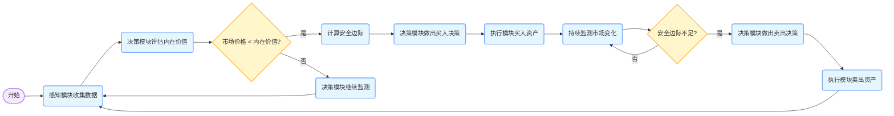

# AI智能体如何实现格雷厄姆的安全边际原则

> 关键词：AI智能体、格雷厄姆、安全边际原则、价值评估、风险控制

> 摘要：本文深入探讨了AI智能体如何实现格雷厄姆的安全边际原则。首先介绍了相关背景知识，包括目的范围、预期读者等。接着阐述了核心概念，如安全边际原则的原理和架构。详细讲解了实现该原则的核心算法原理及具体操作步骤，给出了Python代码示例。通过数学模型和公式进一步分析了安全边际原则的计算和应用。结合项目实战，展示了代码的实际案例和详细解释。探讨了该原则在实际中的应用场景，推荐了学习、开发工具及相关论文著作。最后总结了未来发展趋势与挑战，并提供了常见问题解答和扩展阅读资料。

## 1. 背景介绍 
### 1.1 目的和范围
本文章的目的是详细阐述AI智能体怎样实现格雷厄姆的安全边际原则。安全边际原则是投资领域的重要理念，由本杰明·格雷厄姆提出，强调在投资时要预留足够的安全空间以应对不确定性。AI智能体则是具备智能决策能力的软件系统。我们将探讨如何让AI智能体运用该原则进行投资决策、风险评估等。范围涵盖了从理论原理到实际应用的各个方面，包括核心概念的解释、算法的实现、数学模型的构建、项目实战案例以及实际应用场景的分析等。

### 1.2 预期读者
本文预期读者包括对投资和人工智能交叉领域感兴趣的专业人士，如金融分析师、投资经理、AI开发者等。也适合想要了解如何利用先进技术提升投资决策水平的投资者，以及相关专业的学生和研究人员。

### 1.3 文档结构概述
本文首先介绍背景知识，让读者了解文章的目的、受众和整体结构。接着阐述核心概念，包括安全边际原则和AI智能体的相关原理和联系。然后详细讲解核心算法原理和具体操作步骤，通过Python代码进行说明。之后给出数学模型和公式，并举例说明其应用。通过项目实战展示代码的实际应用和详细解读。分析该原则在实际中的应用场景，推荐学习资源、开发工具和相关论文著作。最后总结未来发展趋势与挑战，提供常见问题解答和扩展阅读资料。

### 1.4 术语表
#### 1.4.1 核心术语定义
- **AI智能体**：一种能够感知环境、进行决策并采取行动以实现特定目标的软件实体。它可以通过学习和推理来适应不同的情况。
- **格雷厄姆的安全边际原则**：在投资中，投资者应该以低于资产内在价值的价格购买资产，以应对市场波动和不确定性带来的风险。安全边际是内在价值与市场价格之间的差值。
- **内在价值**：资产在合理的经济假设下所具有的真实价值，通常通过对资产未来现金流的折现计算得出。

#### 1.4.2 相关概念解释
- **投资组合**：由多种资产组成的集合，投资者通过合理配置不同资产来降低风险和提高收益。
- **风险评估**：对投资过程中可能面临的各种风险进行量化和分析的过程，包括市场风险、信用风险等。
- **市场价格**：资产在市场上实际交易的价格，受到供求关系、市场情绪等多种因素的影响。

#### 1.4.3 缩略词列表
- **AI**：Artificial Intelligence，人工智能
- **DCF**：Discounted Cash Flow，现金流折现法

## 2. 核心概念与联系 
### 2.1 格雷厄姆的安全边际原则原理
格雷厄姆认为，市场价格往往会受到投资者情绪、短期供求关系等因素的影响而偏离资产的内在价值。投资者应该寻找那些市场价格低于内在价值的资产进行投资，这样即使市场出现不利变化，投资者也能因为有安全边际而减少损失。安全边际的大小取决于内在价值与市场价格的差值，差值越大，安全边际越高，投资风险越低。

### 2.2 AI智能体的架构
一个典型的AI智能体架构通常包括感知模块、决策模块和执行模块。感知模块负责收集环境信息，如市场数据、公司财务报表等；决策模块根据感知到的信息进行分析和推理，运用各种算法和模型来评估资产的内在价值和安全边际，并做出投资决策；执行模块则根据决策结果进行实际的投资操作，如买入或卖出资产。

### 2.3 两者的联系
AI智能体可以利用其强大的数据分析和处理能力，更准确地评估资产的内在价值，从而更好地实现格雷厄姆的安全边际原则。通过收集大量的市场数据和公司信息，AI智能体可以运用各种算法和模型进行深入分析，找出那些具有较大安全边际的投资机会。同时，AI智能体可以实时监测市场变化，及时调整投资组合，以保持足够的安全边际。

### 2.4 文本示意图
```plaintext
              AI智能体
           ┌─────────────────┐
           │  感知模块      │
           │  （收集市场数据、公司信息）│
           └─────────────────┘
                    │
                    ▼
           ┌─────────────────┐
           │  决策模块      │
           │  （评估内在价值、安全边际，做出决策）│
           └─────────────────┘
                    │
                    ▼
           ┌─────────────────┐
           │  执行模块      │
           │  （买入或卖出资产）│
           └─────────────────┘
```

### 2.5 Mermaid流程图


## 3. 核心算法原理 & 具体操作步骤 
### 3.1 核心算法原理
#### 3.1.1 内在价值评估算法
常用的内在价值评估方法是现金流折现法（DCF）。该方法的基本思想是将资产未来的现金流按照一定的折现率折现到当前时刻，得到资产的内在价值。具体公式为：

$$V = \sum_{t=1}^{n} \frac{CF_t}{(1 + r)^t}$$

其中，$V$ 表示资产的内在价值，$CF_t$ 表示第 $t$ 期的现金流，$r$ 表示折现率，$n$ 表示现金流的期数。

#### 3.1.2 安全边际计算算法
安全边际可以用以下公式计算：

$$安全边际 = \frac{内在价值 - 市场价格}{内在价值} \times 100\%$$

### 3.2 具体操作步骤
#### 3.2.1 数据收集
AI智能体的感知模块收集与资产相关的数据，包括公司的财务报表、行业数据、宏观经济数据等。这些数据将用于后续的内在价值评估。

#### 3.2.2 内在价值评估
使用现金流折现法计算资产的内在价值。具体步骤如下：
1. 预测未来各期的现金流 $CF_t$。可以通过分析公司的历史财务数据、行业发展趋势等进行预测。
2. 确定折现率 $r$。折现率通常考虑了无风险利率、市场风险溢价等因素。
3. 根据公式计算内在价值 $V$。

#### 3.2.3 安全边际计算
根据市场价格和计算得到的内在价值，使用上述安全边际计算公式计算安全边际。

#### 3.2.4 决策制定
如果安全边际大于设定的阈值，AI智能体的决策模块将做出买入决策；否则，继续监测市场。

#### 3.2.5 投资执行
执行模块根据决策结果进行实际的投资操作，买入或卖出资产。

### 3.3 Python源代码实现
```python
import numpy as np

def calculate_intrinsic_value(cash_flows, discount_rate):
    """
    计算资产的内在价值
    :param cash_flows: 未来各期的现金流列表
    :param discount_rate: 折现率
    :return: 内在价值
    """
    periods = len(cash_flows)
    present_values = []
    for t in range(periods):
        present_value = cash_flows[t] / ((1 + discount_rate) ** (t + 1))
        present_values.append(present_value)
    intrinsic_value = np.sum(present_values)
    return intrinsic_value

def calculate_safety_margin(intrinsic_value, market_price):
    """
    计算安全边际
    :param intrinsic_value: 内在价值
    :param market_price: 市场价格
    :return: 安全边际（百分比）
    """
    safety_margin = ((intrinsic_value - market_price) / intrinsic_value) * 100
    return safety_margin

# 示例数据
cash_flows = [100, 120, 150, 180, 200]
discount_rate = 0.1
market_price = 500

# 计算内在价值
intrinsic_value = calculate_intrinsic_value(cash_flows, discount_rate)
print(f"内在价值: {intrinsic_value}")

# 计算安全边际
safety_margin = calculate_safety_margin(intrinsic_value, market_price)
print(f"安全边际: {safety_margin}%")

# 决策制定
threshold = 20
if safety_margin > threshold:
    print("决策: 买入")
else:
    print("决策: 继续监测")
```

## 4. 数学模型和公式 & 详细讲解 & 举例说明 
### 4.1 现金流折现法（DCF）模型
#### 4.1.1 公式推导
现金流折现法的基本思想是基于货币的时间价值。一笔未来的现金流在当前时刻的价值低于其在未来时刻的价值，因为资金可以在当前进行投资并获得收益。假设每年的现金流为 $CF_t$，折现率为 $r$，则第 $t$ 期现金流在当前时刻的现值为 $\frac{CF_t}{(1 + r)^t}$。将未来各期的现金流现值相加，就得到了资产的内在价值 $V$：

$$V = \sum_{t=1}^{n} \frac{CF_t}{(1 + r)^t}$$

#### 4.1.2 详细讲解
- **现金流预测**：准确预测未来的现金流是DCF模型的关键。可以通过分析公司的历史财务数据、行业发展趋势、市场竞争情况等因素来进行预测。例如，如果公司所处行业处于增长阶段，且公司具有较强的市场竞争力，那么未来的现金流可能会呈现增长趋势。
- **折现率确定**：折现率反映了投资者对投资风险的要求。通常，折现率由无风险利率和风险溢价组成。无风险利率可以参考国债收益率，风险溢价则根据资产的风险程度进行调整。例如，对于风险较高的股票，风险溢价会相对较高。

#### 4.1.3 举例说明
假设一家公司未来五年的现金流分别为100万元、120万元、150万元、180万元和200万元，折现率为10%。则该公司的内在价值计算如下：

第1年现金流的现值：$\frac{100}{(1 + 0.1)^1} \approx 90.91$（万元）

第2年现金流的现值：$\frac{120}{(1 + 0.1)^2} \approx 99.17$（万元）

第3年现金流的现值：$\frac{150}{(1 + 0.1)^3} \approx 112.70$（万元）

第4年现金流的现值：$\frac{180}{(1 + 0.1)^4} \approx 122.94$（万元）

第5年现金流的现值：$\frac{200}{(1 + 0.1)^5} \approx 124.18$（万元）

内在价值：$V = 90.91 + 99.17 + 112.70 + 122.94 + 124.18 = 549.9$（万元）

### 4.2 安全边际计算公式
#### 4.2.1 公式推导
安全边际是为了衡量投资的安全性，它表示内在价值与市场价格之间的差值占内在价值的比例。计算公式为：

$$安全边际 = \frac{内在价值 - 市场价格}{内在价值} \times 100\%$$

#### 4.2.2 详细讲解
安全边际越大，说明投资的安全性越高。当市场价格低于内在价值时，安全边际为正；当市场价格高于内在价值时，安全边际为负。投资者通常会设定一个安全边际阈值，只有当安全边际大于该阈值时，才会考虑进行投资。

#### 4.2.3 举例说明
假设某股票的内在价值为100元，市场价格为80元，则安全边际为：

$$安全边际 = \frac{100 - 80}{100} \times 100\% = 20\%$$

如果投资者设定的安全边际阈值为15%，由于该股票的安全边际大于阈值，投资者可以考虑买入该股票。

## 5. 项目实战：代码实际案例和详细解释说明 
### 5.1  开发环境搭建
#### 5.1.1 安装Python
首先，需要安装Python编程语言。可以从Python官方网站（https://www.python.org/downloads/）下载适合自己操作系统的Python版本，并按照安装向导进行安装。

#### 5.1.2 安装必要的库
在项目中，我们使用了`numpy`库进行数值计算。可以使用以下命令安装`numpy`库：

```sh
pip install numpy
```

### 5.2  源代码详细实现和代码解读
```python
import numpy as np

def calculate_intrinsic_value(cash_flows, discount_rate):
    """
    计算资产的内在价值
    :param cash_flows: 未来各期的现金流列表
    :param discount_rate: 折现率
    :return: 内在价值
    """
    periods = len(cash_flows)
    present_values = []
    for t in range(periods):
        present_value = cash_flows[t] / ((1 + discount_rate) ** (t + 1))
        present_values.append(present_value)
    intrinsic_value = np.sum(present_values)
    return intrinsic_value

def calculate_safety_margin(intrinsic_value, market_price):
    """
    计算安全边际
    :param intrinsic_value: 内在价值
    :param market_price: 市场价格
    :return: 安全边际（百分比）
    """
    safety_margin = ((intrinsic_value - market_price) / intrinsic_value) * 100
    return safety_margin

# 示例数据
cash_flows = [100, 120, 150, 180, 200]
discount_rate = 0.1
market_price = 500

# 计算内在价值
intrinsic_value = calculate_intrinsic_value(cash_flows, discount_rate)
print(f"内在价值: {intrinsic_value}")

# 计算安全边际
safety_margin = calculate_safety_margin(intrinsic_value, market_price)
print(f"安全边际: {safety_margin}%")

# 决策制定
threshold = 20
if safety_margin > threshold:
    print("决策: 买入")
else:
    print("决策: 继续监测")
```

#### 5.2.1 代码解读
- **`calculate_intrinsic_value`函数**：该函数接受未来各期的现金流列表和折现率作为输入，通过循环计算每一期现金流的现值，并将它们相加得到资产的内在价值。
- **`calculate_safety_margin`函数**：该函数接受内在价值和市场价格作为输入，根据安全边际计算公式计算安全边际，并将结果以百分比形式返回。
- **主程序部分**：定义了示例数据，包括未来各期的现金流、折现率和市场价格。调用`calculate_intrinsic_value`函数计算内在价值，调用`calculate_safety_margin`函数计算安全边际。最后，根据设定的安全边际阈值进行决策制定，并输出决策结果。

### 5.3  代码解读与分析
#### 5.3.1 优点
- **简单易懂**：代码结构清晰，函数功能明确，易于理解和维护。
- **可扩展性**：可以通过修改现金流预测方法、折现率确定方法等，对代码进行扩展和优化。

#### 5.3.2 局限性
- **现金流预测的不确定性**：代码中使用的现金流是假设值，实际中现金流的预测具有很大的不确定性，可能会影响内在价值的计算结果。
- **折现率的主观性**：折现率的确定具有一定的主观性，不同的投资者可能会采用不同的折现率，从而导致内在价值的计算结果不同。

## 6. 实际应用场景 
### 6.1 股票投资
在股票投资中，AI智能体可以运用格雷厄姆的安全边际原则来筛选具有投资价值的股票。通过分析公司的财务报表、行业前景等信息，评估股票的内在价值，并与市场价格进行比较。如果安全边际足够大，AI智能体可以建议投资者买入该股票；当市场价格上涨导致安全边际不足时，AI智能体可以建议投资者卖出股票。

### 6.2 债券投资
对于债券投资，AI智能体可以评估债券的内在价值，考虑债券的票面利率、到期时间、信用风险等因素。通过比较债券的内在价值和市场价格，计算安全边际。当安全边际较高时，投资者可以考虑买入债券，以获得相对稳定的收益。

### 6.3 房地产投资
在房地产投资领域，AI智能体可以分析房地产的租金收入、增值潜力等因素，评估其内在价值。同时，考虑市场供需关系、宏观经济环境等因素对市场价格的影响。通过计算安全边际，帮助投资者判断是否值得投资房地产项目。

### 6.4 投资组合管理
AI智能体可以将格雷厄姆的安全边际原则应用于投资组合管理。通过对不同资产的内在价值和安全边际进行评估，合理配置资产，降低投资组合的风险。当市场情况发生变化时，AI智能体可以实时调整投资组合，以保持足够的安全边际。

## 7. 工具和资源推荐
### 7.1 学习资源推荐
#### 7.1.1 书籍推荐
- 《聪明的投资者》（The Intelligent Investor）：本杰明·格雷厄姆的经典著作，详细阐述了价值投资的理念和方法，包括安全边际原则。
- 《证券分析》（Security Analysis）：同样是格雷厄姆的重要著作，对证券的价值评估和投资分析进行了深入探讨。
- 《Python金融实战》（Python for Finance）：介绍了如何使用Python进行金融数据分析和投资决策，适合想要将Python应用于投资领域的读者。

#### 7.1.2 在线课程
- Coursera上的“金融市场”（Financial Markets）课程：由耶鲁大学教授罗伯特·席勒（Robert Shiller）主讲，涵盖了金融市场的基本原理和投资策略。
- edX上的“Python数据科学入门”（Introduction to Data Science in Python）课程：帮助学习者掌握Python在数据科学领域的应用，为使用Python进行投资分析打下基础。

#### 7.1.3 技术博客和网站
- Seeking Alpha：提供专业的金融分析和投资观点，包括对股票、债券等资产的分析和评级。
- QuantNet：专注于量化投资领域，有许多关于金融建模、算法交易等方面的技术文章和讨论。

### 7.2 开发工具框架推荐
#### 7.2.1 IDE和编辑器
- PyCharm：一款专业的Python集成开发环境，具有代码编辑、调试、版本控制等功能，适合开发复杂的Python项目。
- Jupyter Notebook：交互式的开发环境，支持代码、文本、图表等多种形式的展示，非常适合进行数据分析和实验。

#### 7.2.2 调试和性能分析工具
- pdb：Python自带的调试工具，可以帮助开发者定位和解决代码中的问题。
- cProfile：Python的性能分析工具，可以分析代码的运行时间和函数调用情况，帮助开发者优化代码性能。

#### 7.2.3 相关框架和库
- Pandas：用于数据处理和分析的Python库，提供了高效的数据结构和数据操作方法。
- NumPy：用于数值计算的Python库，提供了多维数组对象和各种数学函数。
- Scikit-learn：用于机器学习的Python库，提供了各种机器学习算法和工具，可用于数据建模和预测。

### 7.3 相关论文著作推荐
#### 7.3.1 经典论文
- “The Theory of Investment Value”（投资价值理论）：由约翰·伯尔·威廉姆斯（John Burr Williams）撰写，提出了现金流折现法的基本思想，对价值投资理论的发展产生了重要影响。
- “Security Analysis and Portfolio Management”（证券分析与投资组合管理）：探讨了证券分析的方法和投资组合的构建原则，为投资实践提供了理论指导。

#### 7.3.2 最新研究成果
- 近年来，关于AI在投资领域的应用研究不断涌现。可以关注一些顶级学术期刊，如《Journal of Financial Economics》（金融经济学杂志）、《Review of Financial Studies》（金融研究评论）等，获取最新的研究成果。

#### 7.3.3 应用案例分析
- 一些金融机构和研究机构会发布关于AI在投资决策中的应用案例分析报告。可以通过关注这些报告，了解实际应用中的经验和教训。

## 8. 总结：未来发展趋势与挑战
### 8.1 未来发展趋势
#### 8.1.1 更精准的价值评估
随着数据的不断丰富和算法的不断优化，AI智能体将能够更精准地评估资产的内在价值。通过结合更多的数据源，如社交媒体数据、物联网数据等，AI智能体可以更全面地了解公司的运营情况和市场环境，从而提高价值评估的准确性。

#### 8.1.2 智能化的投资决策
AI智能体将具备更强的智能化决策能力。它可以根据不同投资者的风险偏好、投资目标等因素，为投资者提供个性化的投资建议。同时，AI智能体可以实时监测市场变化，自动调整投资组合，实现智能化的投资决策。

#### 8.1.3 与其他技术的融合
AI智能体将与区块链、云计算等技术进行深度融合。区块链技术可以提供更安全、透明的交易环境，云计算技术可以提供强大的计算能力支持。这些技术的融合将进一步提升AI智能体在投资领域的应用效果。

### 8.2 挑战
#### 8.2.1 数据质量和隐私问题
AI智能体的性能依赖于高质量的数据。然而，数据的质量和准确性往往难以保证，存在数据缺失、错误等问题。同时，数据隐私问题也是一个重要的挑战，如何在保护数据隐私的前提下，合理利用数据进行分析和决策是需要解决的问题。

#### 8.2.2 算法的可解释性
AI算法通常具有较高的复杂性，其决策过程往往难以解释。在投资领域，投资者需要了解AI智能体的决策依据，以便做出合理的投资决策。因此，提高算法的可解释性是一个重要的挑战。

#### 8.2.3 市场的不确定性
市场具有高度的不确定性，AI智能体难以完全预测市场的变化。即使AI智能体能够准确评估资产的内在价值和安全边际，市场的突发情况仍然可能导致投资损失。因此，如何应对市场的不确定性是AI智能体在实现格雷厄姆的安全边际原则时需要面对的挑战。

## 9. 附录：常见问题与解答
### 9.1 如何确定折现率？
折现率的确定需要考虑多个因素，包括无风险利率、市场风险溢价、资产的特定风险等。无风险利率可以参考国债收益率，市场风险溢价可以根据历史数据和市场情况进行估算。资产的特定风险则需要根据资产的行业特点、财务状况等因素进行调整。

### 9.2 现金流预测的准确性如何保证？
现金流预测具有一定的不确定性，难以完全保证其准确性。可以通过分析公司的历史财务数据、行业发展趋势、市场竞争情况等因素，采用多种预测方法进行预测，并对预测结果进行敏感性分析，以评估预测结果的可靠性。

### 9.3 AI智能体的决策结果是否一定可靠？
AI智能体的决策结果受到多种因素的影响，包括数据质量、算法的准确性、市场的不确定性等。虽然AI智能体可以利用先进的技术和算法进行分析和决策，但不能保证其决策结果一定可靠。投资者在参考AI智能体的决策结果时，还需要结合自己的判断和经验进行综合考虑。

## 10. 扩展阅读 & 参考资料
### 10.1 扩展阅读
- 《价值投资实战手册》：作者唐朝，结合实际案例，深入讲解了价值投资的方法和策略。
- 《金融炼金术》（The Alchemy of Finance）：乔治·索罗斯（George Soros）的著作，探讨了金融市场的运行规律和投资者的心理因素对市场的影响。

### 10.2 参考资料
- Graham, Benjamin. The Intelligent Investor. HarperBusiness, 2003.
- Williams, John Burr. The Theory of Investment Value. Harvard University Press, 1938.

作者：AI天才研究院/AI Genius Institute & 禅与计算机程序设计艺术 /Zen And The Art of Computer Programming