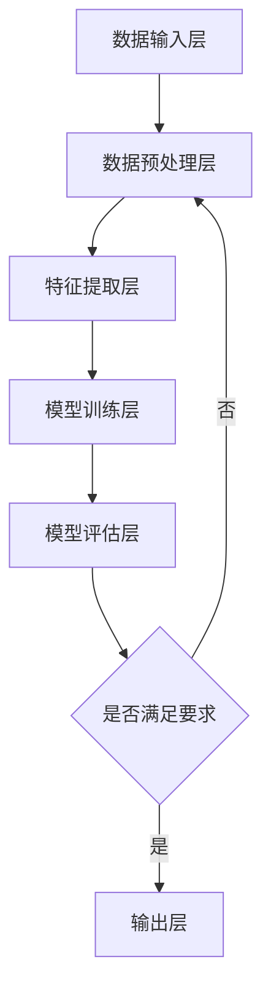

# AI模型在处理噪声数据时的鲁棒性研究

> 关键词：AI模型、噪声数据、鲁棒性、数据处理、机器学习、深度学习、抗干扰能力

> 摘要：本文聚焦于AI模型在处理噪声数据时的鲁棒性研究。随着AI技术在各个领域的广泛应用，数据中不可避免地会存在噪声，这对AI模型的性能和可靠性提出了挑战。文章深入探讨了AI模型鲁棒性的核心概念，详细阐述了相关算法原理、数学模型，通过项目实战展示了在实际场景中提升模型鲁棒性的方法，分析了其实际应用场景，并推荐了相关的学习资源、开发工具和论文著作。最后总结了未来AI模型鲁棒性发展的趋势与面临的挑战，旨在为研究人员和开发者提供全面且深入的参考，以推动AI模型在复杂数据环境下的稳定应用。

## 1. 背景介绍 
### 1.1 目的和范围
在当今数字化时代，AI技术已经渗透到金融、医疗、交通等众多领域。然而，现实世界中的数据往往受到各种因素的干扰，存在噪声。噪声数据可能导致AI模型的性能下降，预测结果不准确，甚至做出错误的决策。因此，研究AI模型在处理噪声数据时的鲁棒性具有重要的现实意义。

本研究的范围涵盖了常见的AI模型，如机器学习中的决策树、支持向量机，深度学习中的卷积神经网络（CNN）、循环神经网络（RNN）等。同时，涉及不同类型的噪声，如高斯噪声、椒盐噪声等，旨在全面探讨提升AI模型鲁棒性的方法和策略。

### 1.2 预期读者
本文预期读者包括从事AI研究的科研人员、AI领域的开发者、对AI技术感兴趣的学生以及相关行业中需要应用AI模型进行数据分析和决策的从业者。希望通过本文，能够帮助读者深入理解AI模型在噪声环境下的工作原理，掌握提升模型鲁棒性的技术和方法。

### 1.3 文档结构概述
本文将按照以下结构展开：首先介绍核心概念与联系，明确AI模型鲁棒性的基本原理和架构；接着详细阐述核心算法原理和具体操作步骤，通过Python代码进行说明；然后介绍相关的数学模型和公式，并举例说明；通过项目实战展示如何在实际中提升模型的鲁棒性；分析AI模型在处理噪声数据时的实际应用场景；推荐相关的学习资源、开发工具和论文著作；最后总结未来发展趋势与挑战，并提供常见问题与解答以及扩展阅读和参考资料。

### 1.4 术语表
#### 1.4.1 核心术语定义
- **AI模型**：指利用人工智能技术构建的用于解决特定问题的模型，如分类模型、回归模型等。
- **噪声数据**：指数据中包含的与真实信息无关的干扰信息，这些信息可能会影响模型的学习和预测效果。
- **鲁棒性**：指AI模型在存在噪声数据、异常值等不确定因素的情况下，仍能保持较好性能的能力。

#### 1.4.2 相关概念解释
- **过拟合**：指模型在训练数据上表现良好，但在测试数据或新数据上表现不佳的现象。噪声数据可能会导致模型过拟合。
- **正则化**：一种用于防止模型过拟合的技术，通过在损失函数中添加正则项来约束模型的复杂度。

#### 1.4.3 缩略词列表
- **CNN**：Convolutional Neural Network，卷积神经网络
- **RNN**：Recurrent Neural Network，循环神经网络
- **SVM**：Support Vector Machine，支持向量机

## 2. 核心概念与联系 

### 2.1 核心概念原理
AI模型的鲁棒性主要体现在其对噪声数据的抵抗能力。当数据中存在噪声时，模型需要能够从噪声中提取出有用的信息，而不是被噪声所误导。这涉及到模型的结构设计、训练方法以及数据预处理等多个方面。

例如，在机器学习中，决策树模型通过对数据进行划分来构建决策规则。在存在噪声数据的情况下，决策树可能会过度拟合噪声，导致在新数据上的性能下降。为了提高决策树的鲁棒性，可以采用剪枝等技术，去除一些不必要的分支，减少噪声的影响。

在深度学习中，卷积神经网络通过卷积层、池化层等结构自动提取数据的特征。噪声数据可能会干扰特征的提取，影响模型的性能。为了提高CNN的鲁棒性，可以采用数据增强、正则化等方法。

### 2.2 架构的文本示意图
AI模型处理噪声数据的架构可以分为以下几个部分：
1. **数据输入层**：接收原始数据，其中可能包含噪声。
2. **数据预处理层**：对输入数据进行清洗、归一化等操作，去除或减少噪声的影响。
3. **特征提取层**：通过各种方法提取数据的特征，如卷积神经网络的卷积层。
4. **模型训练层**：使用预处理后的数据和提取的特征对模型进行训练。
5. **模型评估层**：使用测试数据评估模型的性能，检查模型在噪声数据下的鲁棒性。
6. **输出层**：输出模型的预测结果。

### 2.3 Mermaid流程图


## 3. 核心算法原理 & 具体操作步骤 

### 3.1 算法原理讲解
#### 3.1.1 数据预处理算法
数据预处理是提高AI模型鲁棒性的重要步骤。常见的数据预处理算法包括均值滤波、中值滤波等。

均值滤波的原理是将每个像素的值替换为其邻域内像素值的平均值。这样可以平滑图像，减少噪声的影响。中值滤波则是将每个像素的值替换为其邻域内像素值的中值，对于椒盐噪声等具有较好的去除效果。

以下是使用Python实现均值滤波和中值滤波的代码示例：
```python
import cv2
import numpy as np

# 读取图像
image = cv2.imread('noisy_image.jpg', 0)

# 均值滤波
mean_filtered_image = cv2.blur(image, (3, 3))

# 中值滤波
median_filtered_image = cv2.medianBlur(image, 3)

# 显示结果
cv2.imshow('Original Image', image)
cv2.imshow('Mean Filtered Image', mean_filtered_image)
cv2.imshow('Median Filtered Image', median_filtered_image)
cv2.waitKey(0)
cv2.destroyAllWindows()
```

#### 3.1.2 正则化算法
正则化是一种常用的防止模型过拟合的方法。常见的正则化方法包括L1正则化和L2正则化。

L1正则化是在损失函数中添加模型参数的绝对值之和，L2正则化是在损失函数中添加模型参数的平方和。以下是使用Python实现L2正则化的代码示例：
```python
import numpy as np
from sklearn.linear_model import Ridge

# 生成数据
X = np.array([[1, 2], [3, 4], [5, 6]])
y = np.array([3, 7, 11])

# 创建L2正则化的线性回归模型
model = Ridge(alpha=0.5)

# 训练模型
model.fit(X, y)

# 预测
prediction = model.predict(X)
print(prediction)
```

### 3.2 具体操作步骤
1. **数据收集**：收集包含噪声的数据，确保数据的多样性和代表性。
2. **数据预处理**：根据数据的特点选择合适的预处理算法，如均值滤波、中值滤波等，去除或减少噪声的影响。
3. **特征提取**：使用合适的特征提取方法，如卷积神经网络的卷积层，提取数据的特征。
4. **模型选择**：根据问题的类型选择合适的AI模型，如分类问题可以选择决策树、支持向量机等，回归问题可以选择线性回归、岭回归等。
5. **模型训练**：使用预处理后的数据和提取的特征对模型进行训练，同时可以采用正则化等方法防止模型过拟合。
6. **模型评估**：使用测试数据评估模型的性能，检查模型在噪声数据下的鲁棒性。
7. **模型优化**：根据评估结果对模型进行优化，如调整模型的参数、更换模型结构等。

## 4. 数学模型和公式 & 详细讲解 & 举例说明 

### 4.1 均值滤波的数学模型和公式
均值滤波的数学模型可以表示为：
$$
\hat{f}(x,y)=\frac{1}{M\times N}\sum_{i=-m}^{m}\sum_{j=-n}^{n}f(x + i,y + j)
$$
其中，$\hat{f}(x,y)$ 是滤波后的像素值，$f(x + i,y + j)$ 是邻域内的像素值，$M = 2m + 1$ 和 $N = 2n + 1$ 是邻域的大小。

例如，对于一个 $3\times3$ 的邻域，$m = n = 1$，则滤波后的像素值为邻域内9个像素值的平均值。

### 4.2 L2正则化的数学模型和公式
L2正则化的数学模型可以表示为：
$$
J(\theta)=J_0(\theta)+\frac{\lambda}{2}\sum_{i = 1}^{n}\theta_i^2
$$
其中，$J(\theta)$ 是正则化后的损失函数，$J_0(\theta)$ 是原始的损失函数，$\lambda$ 是正则化参数，$\theta_i$ 是模型的参数。

例如，对于线性回归模型，原始的损失函数为：
$$
J_0(\theta)=\frac{1}{2m}\sum_{i = 1}^{m}(h_{\theta}(x^{(i)})-y^{(i)})^2
$$
其中，$m$ 是样本数量，$h_{\theta}(x^{(i)})$ 是模型的预测值，$y^{(i)}$ 是真实值。

添加L2正则化后，损失函数变为：
$$
J(\theta)=\frac{1}{2m}\sum_{i = 1}^{m}(h_{\theta}(x^{(i)})-y^{(i)})^2+\frac{\lambda}{2}\sum_{i = 1}^{n}\theta_i^2
$$

### 4.3 举例说明
假设我们有一个简单的线性回归问题，数据集为：
$$
X = \begin{bmatrix}
1 \\
2 \\
3
\end{bmatrix}, y = \begin{bmatrix}
2 \\
4 \\
6
\end{bmatrix}
$$
原始的线性回归模型的损失函数为：
$$
J_0(\theta)=\frac{1}{2\times3}\sum_{i = 1}^{3}(h_{\theta}(x^{(i)})-y^{(i)})^2
$$
其中，$h_{\theta}(x^{(i)})=\theta_0+\theta_1x^{(i)}$。

添加L2正则化后，损失函数变为：
$$
J(\theta)=\frac{1}{2\times3}\sum_{i = 1}^{3}(h_{\theta}(x^{(i)})-y^{(i)})^2+\frac{\lambda}{2}(\theta_0^2+\theta_1^2)
$$
假设 $\lambda = 0.5$，通过最小化 $J(\theta)$ 可以得到更鲁棒的模型参数。

## 5. 项目实战：代码实际案例和详细解释说明 

### 5.1  开发环境搭建
本项目使用Python作为开发语言，需要安装以下库：
- **numpy**：用于数值计算。
- **pandas**：用于数据处理。
- **scikit-learn**：用于机器学习模型的训练和评估。
- **tensorflow** 或 **pytorch**：用于深度学习模型的开发。

可以使用以下命令安装这些库：
```bash
pip install numpy pandas scikit-learn tensorflow
```

### 5.2  源代码详细实现和代码解读
#### 5.2.1 数据生成
首先，我们生成一个包含噪声的数据集：
```python
import numpy as np
import matplotlib.pyplot as plt

# 生成真实数据
x = np.linspace(0, 10, 100)
y_true = 2 * x + 1

# 添加噪声
noise = np.random.normal(0, 1, 100)
y_noisy = y_true + noise

# 绘制数据
plt.scatter(x, y_noisy, label='Noisy Data')
plt.plot(x, y_true, color='red', label='True Data')
plt.legend()
plt.show()
```
这段代码首先生成了一个真实的线性数据，然后添加了高斯噪声，最后绘制了包含噪声的数据和真实数据的图像。

#### 5.2.2 模型训练
接下来，我们使用线性回归模型对包含噪声的数据进行训练：
```python
from sklearn.linear_model import LinearRegression

# 准备数据
X = x.reshape(-1, 1)
y = y_noisy

# 创建线性回归模型
model = LinearRegression()

# 训练模型
model.fit(X, y)

# 预测
y_pred = model.predict(X)

# 绘制结果
plt.scatter(x, y_noisy, label='Noisy Data')
plt.plot(x, y_true, color='red', label='True Data')
plt.plot(x, y_pred, color='green', label='Predicted Data')
plt.legend()
plt.show()
```
这段代码使用 `scikit-learn` 库中的 `LinearRegression` 类创建了一个线性回归模型，并对包含噪声的数据进行训练。最后绘制了预测结果和真实数据的图像。

#### 5.2.3 正则化处理
为了提高模型的鲁棒性，我们可以使用岭回归（L2正则化的线性回归）：
```python
from sklearn.linear_model import Ridge

# 创建岭回归模型
ridge_model = Ridge(alpha=0.5)

# 训练模型
ridge_model.fit(X, y)

# 预测
y_ridge_pred = ridge_model.predict(X)

# 绘制结果
plt.scatter(x, y_noisy, label='Noisy Data')
plt.plot(x, y_true, color='red', label='True Data')
plt.plot(x, y_pred, color='green', label='Linear Regression Predicted Data')
plt.plot(x, y_ridge_pred, color='blue', label='Ridge Regression Predicted Data')
plt.legend()
plt.show()
```
这段代码使用 `scikit-learn` 库中的 `Ridge` 类创建了一个岭回归模型，并对包含噪声的数据进行训练。最后绘制了岭回归的预测结果和其他数据的图像。

### 5.3  代码解读与分析
- **数据生成部分**：通过 `np.linspace` 生成了一个线性数据，然后使用 `np.random.normal` 添加了高斯噪声。这模拟了现实世界中数据存在噪声的情况。
- **模型训练部分**：使用 `LinearRegression` 类创建了一个线性回归模型，并对包含噪声的数据进行训练。由于噪声的存在，线性回归模型可能会过拟合噪声，导致预测结果与真实数据存在偏差。
- **正则化处理部分**：使用 `Ridge` 类创建了一个岭回归模型，通过添加L2正则化项，减少了模型的复杂度，提高了模型的鲁棒性。从绘制的图像中可以看出，岭回归的预测结果更接近真实数据。

## 6. 实际应用场景 
### 6.1 金融领域
在金融领域，股票价格、汇率等数据往往受到各种因素的影响，存在噪声。AI模型在进行风险评估、预测股票价格等任务时，需要具备良好的鲁棒性。例如，使用机器学习模型预测股票价格时，噪声数据可能会导致模型的预测结果不准确，通过提高模型的鲁棒性，可以提高预测的准确性，为投资者提供更可靠的决策依据。

### 6.2 医疗领域
在医疗领域，医学图像（如X光、CT等）和生理信号（如心电图、脑电图等）中可能存在噪声。AI模型在进行疾病诊断、医学图像分析等任务时，需要能够从噪声中提取有用的信息。例如，使用深度学习模型对X光图像进行肺部疾病诊断时，噪声可能会干扰模型的判断，通过提高模型的鲁棒性，可以提高诊断的准确性，帮助医生更好地进行治疗。

### 6.3 交通领域
在交通领域，传感器采集的交通数据（如车辆速度、流量等）可能受到天气、环境等因素的影响，存在噪声。AI模型在进行交通流量预测、智能驾驶等任务时，需要具备良好的鲁棒性。例如，在智能驾驶中，传感器数据的噪声可能会导致自动驾驶车辆做出错误的决策，通过提高模型的鲁棒性，可以提高自动驾驶的安全性和可靠性。

## 7. 工具和资源推荐
### 7.1 学习资源推荐
#### 7.1.1 书籍推荐
- 《机器学习》（周志华）：全面介绍了机器学习的基本概念、算法和应用，是机器学习领域的经典教材。
- 《深度学习》（Ian Goodfellow、Yoshua Bengio和Aaron Courville）：深入介绍了深度学习的原理、方法和应用，是深度学习领域的权威著作。
- 《Python机器学习》（Sebastian Raschka）：通过Python代码详细介绍了机器学习的算法和实现，适合初学者学习。

#### 7.1.2 在线课程
- Coursera上的《机器学习》课程（Andrew Ng）：由机器学习领域的知名学者Andrew Ng授课，内容全面，讲解