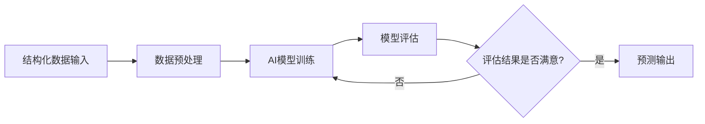

# AI模型在处理结构化数据时的效率提升

> 关键词：AI模型、结构化数据、效率提升、算法优化、数据预处理

> 摘要：本文围绕AI模型在处理结构化数据时的效率提升展开深入探讨。首先介绍了相关背景，包括目的、预期读者等内容。接着阐述了核心概念及联系，详细讲解了核心算法原理和具体操作步骤，并给出了数学模型和公式。通过项目实战展示了代码实现和分析，探讨了实际应用场景。还推荐了学习、开发工具和相关论文著作。最后总结了未来发展趋势与挑战，提供了常见问题解答和扩展阅读参考资料，旨在为提升AI模型处理结构化数据的效率提供全面而深入的指导。

## 1. 背景介绍 
### 1.1 目的和范围
在当今数字化时代，结构化数据广泛存在于各个领域，如金融、医疗、电商等。AI模型在处理这些结构化数据时，其效率直接影响到业务的响应速度和决策的及时性。本文章的目的在于深入研究如何提升AI模型处理结构化数据的效率，范围涵盖了从数据预处理、算法优化到实际应用场景等多个方面，旨在为相关从业者提供全面而系统的方法和策略。

### 1.2 预期读者
本文预期读者包括AI领域的研究人员、数据科学家、软件工程师以及对AI模型处理结构化数据感兴趣的技术爱好者。无论是希望深入了解相关理论知识，还是寻求实际项目中效率提升解决方案的读者，都能从本文中获得有价值的信息。

### 1.3 文档结构概述
本文将按照以下结构进行阐述：首先介绍核心概念与联系，帮助读者建立起对相关知识的基础认知；接着详细讲解核心算法原理和具体操作步骤，并给出相应的Python代码示例；然后介绍数学模型和公式，进一步从理论层面深化理解；通过项目实战展示代码实现和详细分析；探讨实际应用场景，说明效率提升的实际意义；推荐相关的学习资源、开发工具和论文著作；最后总结未来发展趋势与挑战，提供常见问题解答和扩展阅读参考资料。

### 1.4 术语表
#### 1.4.1 核心术语定义
- **AI模型**：是指基于人工智能技术构建的用于解决特定问题的数学模型，如神经网络、决策树等。
- **结构化数据**：是指具有固定格式和结构的数据，通常存储在数据库中，如关系型数据库中的表格数据。
- **效率提升**：是指在处理结构化数据时，通过优化算法、数据预处理等手段，减少处理时间和资源消耗，提高处理速度和性能。

#### 1.4.2 相关概念解释
- **数据预处理**：是指在将数据输入到AI模型之前，对数据进行清洗、转换、归一化等操作，以提高数据的质量和可用性。
- **算法优化**：是指对AI模型所使用的算法进行改进和优化，以提高算法的效率和性能。

#### 1.4.3 缩略词列表
- **ML**：Machine Learning，机器学习
- **DL**：Deep Learning，深度学习
- **CPU**：Central Processing Unit，中央处理器
- **GPU**：Graphics Processing Unit，图形处理器

## 2. 核心概念与联系 
### 核心概念原理
在AI模型处理结构化数据的过程中，涉及到多个核心概念。首先是数据的表示，结构化数据通常以表格形式存在，每一行代表一个样本，每一列代表一个特征。AI模型的目标是通过对这些特征的学习，预测目标变量的值。

常见的AI模型包括线性回归、逻辑回归、决策树、随机森林和神经网络等。线性回归和逻辑回归是基于线性模型的算法，它们通过寻找特征和目标变量之间的线性关系来进行预测。决策树和随机森林则是基于树结构的算法，它们通过对特征进行递归划分来构建决策树，从而进行预测。神经网络是一种模仿人类神经系统的算法，它通过多层神经元的连接和激活函数的作用，学习数据的复杂特征和模式。

### 架构的文本示意图
```plaintext
结构化数据输入 -> 数据预处理 -> AI模型训练 -> 模型评估 -> 预测输出
```

### Mermaid流程图


## 3. 核心算法原理 & 具体操作步骤 
### 线性回归算法原理
线性回归是一种用于预测连续数值的算法，其基本原理是寻找一个线性函数 $y = \theta_0 + \theta_1x_1 + \theta_2x_2 + \cdots + \theta_nx_n$，使得预测值 $y$ 与真实值之间的误差最小。其中，$\theta_0, \theta_1, \cdots, \theta_n$ 是模型的参数，$x_1, x_2, \cdots, x_n$ 是输入的特征。

### 具体操作步骤
1. **数据准备**：收集和整理结构化数据，将其分为训练集和测试集。
2. **特征选择**：选择与目标变量相关的特征，去除无关或冗余的特征。
3. **模型训练**：使用训练集数据来估计模型的参数 $\theta$。常用的方法是最小二乘法，即最小化预测值与真实值之间的平方误差和。
4. **模型评估**：使用测试集数据来评估模型的性能，常用的评估指标包括均方误差（MSE）、均方根误差（RMSE）和决定系数（$R^2$）等。
5. **预测**：使用训练好的模型对新的数据进行预测。

### Python源代码实现
```python
import numpy as np
from sklearn.model_selection import train_test_split
from sklearn.linear_model import LinearRegression
from sklearn.metrics import mean_squared_error, r2_score

# 生成示例数据
X = np.random.rand(100, 5)
y = 2 * X[:, 0] + 3 * X[:, 1] + 4 * X[:, 2] + np.random.randn(100)

# 划分训练集和测试集
X_train, X_test, y_train, y_test = train_test_split(X, y, test_size=0.2, random_state=42)

# 创建线性回归模型
model = LinearRegression()

# 训练模型
model.fit(X_train, y_train)

# 预测
y_pred = model.predict(X_test)

# 评估模型
mse = mean_squared_error(y_test, y_pred)
r2 = r2_score(y_test, y_pred)

print(f"均方误差: {mse}")
print(f"决定系数: {r2}")
```

## 4. 数学模型和公式 & 详细讲解 & 举例说明 
### 线性回归的数学模型和公式
线性回归的数学模型可以表示为：
$$y = \theta_0 + \theta_1x_1 + \theta_2x_2 + \cdots + \theta_nx_n + \epsilon$$
其中，$y$ 是目标变量，$x_1, x_2, \cdots, x_n$ 是输入的特征，$\theta_0, \theta_1, \cdots, \theta_n$ 是模型的参数，$\epsilon$ 是误差项，服从均值为 0，方差为 $\sigma^2$ 的正态分布。

最小二乘法的目标是最小化误差平方和：
$$J(\theta) = \frac{1}{2m} \sum_{i=1}^{m} (h_{\theta}(x^{(i)}) - y^{(i)})^2$$
其中，$m$ 是样本数量，$h_{\theta}(x^{(i)})$ 是模型对第 $i$ 个样本的预测值，$y^{(i)}$ 是第 $i$ 个样本的真实值。

为了求解最优的参数 $\theta$，可以对 $J(\theta)$ 求偏导数，并令其等于 0：
$$\frac{\partial J(\theta)}{\partial \theta_j} = \frac{1}{m} \sum_{i=1}^{m} (h_{\theta}(x^{(i)}) - y^{(i)}) x_j^{(i)} = 0$$

### 详细讲解
最小二乘法的核心思想是通过最小化预测值与真实值之间的平方误差和，来找到最优的模型参数。误差平方和的计算公式中，使用平方是为了避免正负误差相互抵消，同时也使得误差的惩罚更加明显。

### 举例说明
假设有一组数据，包含两个特征 $x_1$ 和 $x_2$，以及一个目标变量 $y$。数据如下：
| $x_1$ | $x_2$ | $y$ |
| --- | --- | --- |
| 1 | 2 | 5 |
| 2 | 3 | 7 |
| 3 | 4 | 9 |

我们可以使用线性回归模型来预测 $y$ 的值。首先，我们需要构建模型：
$$y = \theta_0 + \theta_1x_1 + \theta_2x_2$$

然后，使用最小二乘法来估计模型的参数 $\theta_0, \theta_1, \theta_2$。通过求解上述偏导数等于 0 的方程组，我们可以得到最优的参数值。

## 5. 项目实战：代码实际案例和详细解释说明 
### 5.1  开发环境搭建
为了实现本项目，我们需要搭建以下开发环境：
- **Python**：建议使用 Python 3.7 及以上版本。
- **开发工具**：可以使用 Jupyter Notebook 或 PyCharm 等开发工具。
- **相关库**：需要安装 `numpy`、`pandas`、`scikit-learn` 等库。可以使用以下命令进行安装：
```sh
pip install numpy pandas scikit-learn
```

### 5.2  源代码详细实现和代码解读
```python
import numpy as np
import pandas as pd
from sklearn.model_selection import train_test_split
from sklearn.ensemble import RandomForestRegressor
from sklearn.metrics import mean_squared_error

# 加载数据
data = pd.read_csv('structured_data.csv')

# 分离特征和目标变量
X = data.drop('target', axis=1)
y = data['target']

# 划分训练集和测试集
X_train, X_test, y_train, y_test = train_test_split(X, y, test_size=0.2, random_state=42)

# 创建随机森林回归模型
model = RandomForestRegressor(n_estimators=100, random_state=42)

# 训练模型
model.fit(X_train, y_train)

# 预测
y_pred = model.predict(X_test)

# 评估模型
mse = mean_squared_error(y_test, y_pred)
print(f"均方误差: {mse}")
```

### 代码解读与分析
1. **数据加载**：使用 `pandas` 库的 `read_csv` 函数加载结构化数据。
2. **特征和目标变量分离**：使用 `drop` 函数将目标变量从特征数据中分离出来。
3. **数据集划分**：使用 `train_test_split` 函数将数据集划分为训练集和测试集，其中测试集占比为 20%。
4. **模型创建**：使用 `RandomForestRegressor` 类创建随机森林回归模型，设置树的数量为 100。
5. **模型训练**：使用 `fit` 方法对模型进行训练。
6. **预测**：使用 `predict` 方法对测试集进行预测。
7. **模型评估**：使用 `mean_squared_error` 函数计算均方误差，评估模型的性能。

## 6. 实际应用场景 
### 金融领域
在金融领域，结构化数据包括客户的信用信息、交易记录等。AI模型可以通过处理这些数据，进行风险评估、信用评分和投资决策等。例如，银行可以使用AI模型对客户的信用信息进行分析，预测客户的违约概率，从而决定是否给予贷款。

### 医疗领域
在医疗领域，结构化数据包括患者的病历、检查报告等。AI模型可以通过处理这些数据，进行疾病诊断、治疗方案推荐等。例如，医生可以使用AI模型对患者的病历和检查报告进行分析，辅助诊断疾病，并推荐合适的治疗方案。

### 电商领域
在电商领域，结构化数据包括用户的浏览记录、购买记录等。AI模型可以通过处理这些数据，进行商品推荐、用户行为预测等。例如，电商平台可以使用AI模型对用户的浏览和购买记录进行分析，为用户推荐感兴趣的商品。

## 7. 工具和资源推荐
### 7.1 学习资源推荐
#### 7.1.1 书籍推荐
- 《机器学习》（周志华）：全面介绍了机器学习的基本概念、算法和应用。
- 《深度学习》（Ian Goodfellow、Yoshua Bengio 和 Aaron Courville）：深度学习领域的经典著作，深入讲解了深度学习的原理和应用。

#### 7.1.2 在线课程
- Coursera 上的《机器学习》课程（Andrew Ng 教授）：经典的机器学习入门课程，涵盖了机器学习的基本概念和算法。
- edX 上的《深度学习》课程：由全球知名高校的教授授课，深入讲解了深度学习的原理和应用。

#### 7.1.3 技术博客和网站
- Medium：有很多机器学习和深度学习领域的优秀博客文章。
- Towards Data Science：专注于数据科学和机器学习领域的技术博客。

### 7.2 开发工具框架推荐
#### 7.2.1 IDE和编辑器
- PyCharm：功能强大的 Python 集成开发环境，适合专业开发者。
- Jupyter Notebook：交互式的开发环境，适合数据探索和模型实验。

#### 7.2.2 调试和性能分析工具
- TensorBoard：用于可视化深度学习模型的训练过程和性能指标。
- Scikit-learn 的 `GridSearchCV`：用于模型调优和参数搜索。

#### 7.2.3 相关框架和库
- TensorFlow：谷歌开发的深度学习框架，功能强大，应用广泛。
- PyTorch：Facebook 开发的深度学习框架，易于使用，适合快速原型开发。

### 7.3 相关论文著作推荐
#### 7.3.1 经典论文
- 《A Few Useful Things to Know about Machine Learning》（Pedro Domingos）：总结了机器学习领域的一些重要观点和经验。
- 《Deep Residual Learning for Image Recognition》（Kaiming He 等）：提出了残差网络（ResNet），在图像识别领域取得了巨大成功。

#### 7.3.2 最新研究成果
- arXiv：一个预印本平台，提供了机器学习和深度学习领域的最新研究成果。
- NeurIPS、ICML 等顶级学术会议的论文：展示了机器学习和深度学习领域的最新研究进展。

#### 7.3.3 应用案例分析
- Kaggle：一个数据科学竞赛平台，提供了很多实际应用案例和解决方案。
- Google AI Blog：分享了谷歌在人工智能领域的应用案例和研究成果。

## 8. 总结：未来发展趋势与挑战
### 未来发展趋势
- **模型融合**：将多种不同类型的AI模型进行融合，以提高模型的性能和泛化能力。
- **自动化机器学习**：通过自动化的方法进行模型选择、特征工程和参数调优，提高开发效率。
- **边缘计算**：将AI模型部署到边缘设备上，实现实时处理和决策，减少数据传输延迟。

### 挑战
- **数据隐私和安全**：在处理结构化数据时，需要保护数据的隐私和安全，防止数据泄露和滥用。
- **模型可解释性**：随着AI模型的复杂度不断增加，模型的可解释性变得越来越重要，需要开发更加可解释的模型。
- **计算资源需求**：处理大规模结构化数据需要大量的计算资源，如何优化计算资源的使用是一个挑战。

## 9. 附录：常见问题与解答
### 问题1：如何选择合适的AI模型处理结构化数据？
答：选择合适的AI模型需要考虑数据的特点、问题的类型和模型的性能等因素。例如，如果数据具有线性关系，可以选择线性回归模型；如果数据具有复杂的非线性关系，可以选择神经网络模型。

### 问题2：数据预处理对AI模型的效率有什么影响？
答：数据预处理可以提高数据的质量和可用性，减少噪声和异常值的影响，从而提高AI模型的训练效率和性能。

### 问题3：如何评估AI模型的性能？
答：评估AI模型的性能可以使用各种评估指标，如均方误差、准确率、召回率等。具体选择哪种评估指标需要根据问题的类型和需求来决定。

## 10. 扩展阅读 & 参考资料
### 扩展阅读
- 《人工智能：现代方法》（Stuart Russell 和 Peter Norvig）：全面介绍了人工智能的基本概念、算法和应用。
- 《Python 数据分析实战》（Sebastian Raschka）：介绍了使用 Python 进行数据分析和机器学习的方法和技巧。

### 参考资料
- 《机器学习实战》（Peter Harrington）：通过实际案例介绍了机器学习的基本算法和应用。
- 《深度学习实战》（Antoine Géron）：深入讲解了深度学习的原理和应用，提供了很多实际案例和代码示例。

作者：AI天才研究院/AI Genius Institute & 禅与计算机程序设计艺术 /Zen And The Art of Computer Programming