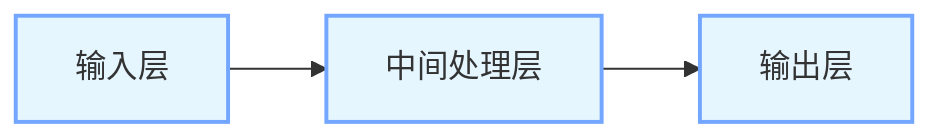

# AI模型在复杂任务中的决策过程优化

> 关键词：AI模型、复杂任务、决策过程优化、算法原理、实际应用

> 摘要：本文聚焦于AI模型在复杂任务中的决策过程优化这一核心主题。首先介绍了研究的背景、目的、预期读者等内容，接着阐述了核心概念及其联系，深入讲解了核心算法原理和具体操作步骤，给出了相关的数学模型和公式并举例说明。通过项目实战展示了代码的实际案例及详细解释，分析了其在实际应用场景中的表现。同时推荐了学习资源、开发工具框架以及相关论文著作。最后总结了未来发展趋势与挑战，提供了常见问题解答和扩展阅读参考资料，旨在为提升AI模型在复杂任务中的决策效率和准确性提供全面的技术指导。

## 1. 背景介绍 
### 1.1 目的和范围
在当今科技飞速发展的时代，AI模型已经广泛应用于各个领域，如医疗诊断、自动驾驶、金融投资等。然而，面对复杂任务时，AI模型的决策过程往往面临着诸多挑战，如决策效率低下、决策准确性不高、对复杂环境的适应性不足等。本文章的目的在于深入探讨如何优化AI模型在复杂任务中的决策过程，提高其决策的效率和准确性，以更好地应对实际应用中的各种复杂情况。
本文章的范围涵盖了AI模型决策过程优化的核心概念、算法原理、数学模型、实际应用案例等方面，同时还提供了相关的学习资源、开发工具和论文著作推荐，旨在为读者提供一个全面、系统的关于AI模型在复杂任务中决策过程优化的知识体系。

### 1.2 预期读者
本文预期读者包括AI领域的研究人员、工程师、开发者，以及对AI技术感兴趣的学生和专业人士。对于从事AI模型研发和应用的人员，本文可以为他们提供决策过程优化的理论基础和实践经验；对于初学者，本文可以帮助他们了解AI模型在复杂任务中决策的基本原理和方法，为进一步深入学习和研究打下基础。

### 1.3 文档结构概述
本文共分为十个部分。第一部分为背景介绍，阐述了研究的目的、范围、预期读者和文档结构概述；第二部分介绍核心概念与联系，包括核心概念的原理和架构，并给出文本示意图和Mermaid流程图；第三部分讲解核心算法原理和具体操作步骤，使用Python源代码进行详细阐述；第四部分给出数学模型和公式，并进行详细讲解和举例说明；第五部分通过项目实战展示代码实际案例和详细解释说明；第六部分分析实际应用场景；第七部分推荐学习资源、开发工具框架和相关论文著作；第八部分总结未来发展趋势与挑战；第九部分为附录，提供常见问题与解答；第十部分列出扩展阅读和参考资料。

### 1.4 术语表
#### 1.4.1 核心术语定义
- **AI模型**：人工智能模型是一种基于数学和统计学原理构建的算法结构，它通过对大量数据的学习和分析，能够模拟人类的智能行为，如识别、分类、预测等。
- **复杂任务**：指具有高维度、不确定性、动态性等特征的任务，这些任务通常需要综合考虑多个因素，并且决策过程受到多种复杂因素的影响。
- **决策过程**：AI模型在面对任务时，根据输入信息，通过一系列的计算和推理，最终得出决策结果的过程。
- **决策过程优化**：通过改进AI模型的结构、算法或参数，提高决策过程的效率和准确性，使模型能够更好地应对复杂任务。

#### 1.4.2 相关概念解释
- **机器学习**：是一门多领域交叉学科，涉及概率论、统计学、逼近论、凸分析、算法复杂度理论等多门学科。它专门研究计算机怎样模拟或实现人类的学习行为，以获取新的知识或技能，重新组织已有的知识结构使之不断改善自身的性能。
- **深度学习**：是机器学习的一个分支领域，它是一种基于对数据进行表征学习的方法。深度学习通过构建具有很多层的神经网络模型，自动从数据中学习到复杂的特征和模式。
- **强化学习**：是一类机器学习算法，智能体通过与环境进行交互，根据环境反馈的奖励信号来学习最优的行为策略，以最大化长期累积奖励。

#### 1.4.3 缩略词列表
- **ML**：Machine Learning，机器学习
- **DL**：Deep Learning，深度学习
- **RL**：Reinforcement Learning，强化学习
- **DNN**：Deep Neural Network，深度神经网络
- **CNN**：Convolutional Neural Network，卷积神经网络
- **RNN**：Recurrent Neural Network，循环神经网络

## 2. 核心概念与联系 
### 核心概念原理
在AI模型的决策过程中，主要涉及到输入层、中间处理层和输出层。输入层接收来自外界的各种信息，如图像、文本、传感器数据等。中间处理层是AI模型的核心部分，它包含了一系列的计算单元和算法，用于对输入信息进行处理和分析。输出层则根据中间处理层的结果，给出最终的决策结果。

以一个简单的图像分类任务为例，输入层接收一张图像，中间处理层通过卷积神经网络（CNN）对图像进行特征提取和分析，输出层根据提取的特征判断图像所属的类别。

### 架构的文本示意图
```plaintext
输入层（接收外界信息） -> 中间处理层（特征提取、分析、推理） -> 输出层（给出决策结果）
```

### Mermaid流程图


在这个流程图中，输入层将信息传递给中间处理层，中间处理层经过处理后将结果传递给输出层，最终输出决策结果。这个过程不断循环，AI模型通过不断地学习和优化，提高决策的准确性和效率。

## 3. 核心算法原理 & 具体操作步骤 
### 核心算法原理
在AI模型的决策过程优化中，常用的算法包括深度学习算法、强化学习算法等。这里以深度学习中的卷积神经网络（CNN）为例进行讲解。

卷积神经网络是一种专门用于处理具有网格结构数据（如图像）的神经网络。它主要由卷积层、池化层和全连接层组成。

- **卷积层**：卷积层是CNN的核心部分，它通过卷积核在输入数据上滑动，进行卷积操作，提取数据的局部特征。卷积操作可以表示为：
$$
y_{i,j} = \sum_{m=0}^{M-1} \sum_{n=0}^{N-1} x_{i+m,j+n} \cdot k_{m,n} + b
$$
其中，$x$ 是输入数据，$k$ 是卷积核，$b$ 是偏置项，$y$ 是卷积结果。

- **池化层**：池化层用于减少数据的维度，降低计算量，同时增强模型的鲁棒性。常用的池化方法有最大池化和平均池化。最大池化是取每个池化窗口中的最大值作为输出，平均池化是取每个池化窗口中的平均值作为输出。

- **全连接层**：全连接层将卷积层和池化层提取的特征进行整合，输出最终的分类结果。

### 具体操作步骤
以下是使用Python和PyTorch库实现一个简单的CNN模型进行图像分类的具体步骤：

```python
import torch
import torch.nn as nn
import torch.optim as optim
from torchvision import datasets, transforms

# 数据预处理
transform = transforms.Compose([
    transforms.ToTensor(),
    transforms.Normalize((0.5,), (0.5,))
])

# 加载数据集
train_dataset = datasets.MNIST(root='./data', train=True,
                               download=True, transform=transform)
test_dataset = datasets.MNIST(root='./data', train=False,
                              download=True, transform=transform)

train_loader = torch.utils.data.DataLoader(train_dataset, batch_size=64, shuffle=True)
test_loader = torch.utils.data.DataLoader(test_dataset, batch_size=64, shuffle=False)

# 定义CNN模型
class SimpleCNN(nn.Module):
    def __init__(self):
        super(SimpleCNN, self).__init__()
        self.conv1 = nn.Conv2d(1, 10, kernel_size=5)
        self.pool = nn.MaxPool2d(2)
        self.conv2 = nn.Conv2d(10, 20, kernel_size=5)
        self.fc1 = nn.Linear(320, 50)
        self.fc2 = nn.Linear(50, 10)

    def forward(self, x):
        x = self.pool(torch.relu(self.conv1(x)))
        x = self.pool(torch.relu(self.conv2(x)))
        x = x.view(-1, 320)
        x = torch.relu(self.fc1(x))
        x = self.fc2(x)
        return x

# 初始化模型、损失函数和优化器
model = SimpleCNN()
criterion = nn.CrossEntropyLoss()
optimizer = optim.SGD(model.parameters(), lr=0.01, momentum=0.5)

# 训练模型
def train(model, train_loader, criterion, optimizer, epochs):
    model.train()
    for epoch in range(epochs):
        running_loss = 0.0
        for i, (images, labels) in enumerate(train_loader):
            optimizer.zero_grad()
            outputs = model(images)
            loss = criterion(outputs, labels)
            loss.backward()
            optimizer.step()
            running_loss += loss.item()
        print(f'Epoch {epoch + 1}, Loss: {running_loss / len(train_loader)}')

# 测试模型
def test(model, test_loader):
    model.eval()
    correct = 0
    total = 0
    with torch.no_grad():
        for images, labels in test_loader:
            outputs = model(images)
            _, predicted = torch.max(outputs.data, 1)
            total += labels.size(0)
            correct += (predicted == labels).sum().item()
    print(f'Accuracy: {100 * correct / total}%')

# 训练和测试模型
train(model, train_loader, criterion, optimizer, epochs=5)
test(model, test_loader)
```

### 代码解释
1. **数据预处理**：使用`transforms.Compose`将图像转换为张量，并进行归一化处理。
2. **加载数据集**：使用`torchvision.datasets.MNIST`加载MNIST手写数字数据集，并使用`DataLoader`进行批量加载。
3. **定义CNN模型**：定义一个简单的CNN模型，包含两个卷积层、两个池化层和两个全连接层。
4. **初始化模型、损失函数和优化器**：使用`CrossEntropyLoss`作为损失函数，使用随机梯度下降（SGD）作为优化器。
5. **训练模型**：在训练过程中，不断计算损失并进行反向传播，更新模型的参数。
6. **测试模型**：在测试过程中，使用训练好的模型对测试数据进行预测，并计算准确率。

## 4. 数学模型和公式 & 详细讲解 & 举例说明 
### 卷积操作的数学模型
在卷积神经网络中，卷积操作是核心操作之一。如前面所述，卷积操作可以表示为：
$$
y_{i,j} = \sum_{m=0}^{M-1} \sum_{n=0}^{N-1} x_{i+m,j+n} \cdot k_{m,n} + b
$$
其中，$x$ 是输入数据，$k$ 是卷积核，$b$ 是偏置项，$y$ 是卷积结果。$M$ 和 $N$ 分别是卷积核的高度和宽度。

### 详细讲解
卷积操作的本质是对输入数据进行特征提取。卷积核可以看作是一个滤波器，它在输入数据上滑动，对每个局部区域进行加权求和，得到一个新的值。通过不同的卷积核，可以提取出不同的特征，如边缘、纹理等。

### 举例说明
假设我们有一个输入矩阵 $x$ 和一个卷积核 $k$ 如下：
$$
x = \begin{bmatrix}
1 & 2 & 3 \\
4 & 5 & 6 \\
7 & 8 & 9
\end{bmatrix}
$$
$$
k = \begin{bmatrix}
1 & 0 \\
0 & 1
\end{bmatrix}
$$
偏置项 $b = 0$。

我们从输入矩阵的左上角开始，将卷积核与输入矩阵的局部区域进行对应元素相乘并求和：
$$
y_{0,0} = 1 \times 1 + 2 \times 0 + 4 \times 0 + 5 \times 1 + 0 = 6
$$
然后将卷积核向右滑动一个位置，继续进行卷积操作：
$$
y_{0,1} = 2 \times 1 + 3 \times 0 + 5 \times 0 + 6 \times 1 + 0 = 8
$$
以此类推，最终得到卷积结果矩阵 $y$。

### 损失函数的数学模型
在深度学习中，常用的损失函数有交叉熵损失函数、均方误差损失函数等。这里以交叉熵损失函数为例进行讲解。

对于一个多分类问题，假设模型的输出为 $y_{pred}$，真实标签为 $y_{true}$，交叉熵损失函数可以表示为：
$$
L = - \sum_{i=1}^{C} y_{true,i} \log(y_{pred,i})
$$
其中，$C$ 是类别数。

### 详细讲解
交叉熵损失函数衡量的是模型预测结果与真实标签之间的差异。当模型的预测结果与真实标签越接近时，交叉熵损失函数的值越小；反之，当模型的预测结果与真实标签差异越大时，交叉熵损失函数的值越大。

### 举例说明
假设我们有一个三分类问题，模型的输出为 $y_{pred} = [0.2, 0.3, 0.5]$，真实标签为 $y_{true} = [0, 0, 1]$。

则交叉熵损失函数的值为：
$$
L = - (0 \times \log(0.2) + 0 \times \log(0.3) + 1 \times \log(0.5)) \approx 0.693
$$

## 5. 项目实战：代码实际案例和详细解释说明 
### 5.1  开发环境搭建
为了实现AI模型在复杂任务中的决策过程优化，我们需要搭建一个合适的开发环境。以下是具体的搭建步骤：

#### 安装Python
首先，我们需要安装Python。建议使用Python 3.7及以上版本，可以从Python官方网站（https://www.python.org/downloads/）下载并安装。

#### 安装深度学习框架
我们选择使用PyTorch作为深度学习框架。可以使用以下命令安装PyTorch：
```bash
pip install torch torchvision
```

#### 安装其他必要的库
还需要安装一些其他必要的库，如NumPy、Matplotlib等。可以使用以下命令安装：
```bash
pip install numpy matplotlib
```

### 5.2  源代码详细实现和代码解读
我们以一个基于强化学习的自动驾驶决策优化项目为例进行讲解。

```python
import numpy as np
import torch
import torch.nn as nn
import torch.optim as optim
import gym

# 定义神经网络模型
class DQN(nn.Module):
    def __init__(self, input_dim, output_dim):
        super(DQN, self).__init__()
        self.fc1 = nn.Linear(input_dim, 64)
        self.fc2 = nn.Linear(64, 64)
        self.fc3 = nn.Linear(64, output_dim)

    def forward(self, x):
        x = torch.relu(self.fc1(x))
        x = torch.relu(self.fc2(x))
        x = self.fc3(x)
        return x

# 定义强化学习智能体
class Agent:
    def __init__(self, input_dim, output_dim):
        self.model = DQN(input_dim, output_dim)
        self.optimizer = optim.Adam(self.model.parameters(), lr=0.001)
        self.criterion = nn.MSELoss()

    def act(self, state):
        state = torch.FloatTensor(state).unsqueeze(0)
        q_values = self.model(state)
        action = torch.argmax(q_values, dim=1).item()
        return action

    def learn(self, state, action, reward, next_state, done):
        state = torch.FloatTensor(state).unsqueeze(0)
        next_state = torch.FloatTensor(next_state).unsqueeze(0)
        action = torch.LongTensor([action])
        reward = torch.FloatTensor([reward])
        done = torch.FloatTensor([done])

        q_values = self.model(state)
        q_value = q_values.gather(1, action.unsqueeze(1)).squeeze(1)

        next_q_values = self.model(next_state)
        next_q_value = next_q_values.max(1)[0]
        expected_q_value = reward + (1 - done) * 0.99 * next_q_value

        loss = self.criterion(q_value, expected_q_value.detach())
        self.optimizer.zero_grad()
        loss.backward()
        self.optimizer.step()

# 训练智能体
def train_agent():
    env = gym.make('CartPole-v1')
    input_dim = env.observation_space.shape[0]
    output_dim = env.action_space.n
    agent = Agent(input_dim, output_dim)

    num_episodes = 1000
    for episode in range(num_episodes):
        state = env.reset()
        total_reward = 0
        done = False
        while not done:
            action = agent.act(state)
            next_state, reward, done, _ = env.step(action)
            agent.learn(state, action, reward, next_state, done)
            state = next_state
            total_reward += reward
        print(f'Episode {episode + 1}, Total Reward: {total_reward}')

    env.close()

if __name__ == "__main__":
    train_agent()
```

### 代码解读
1. **定义神经网络模型**：`DQN`类定义了一个简单的全连接神经网络，用于估计Q值。
2. **定义强化学习智能体**：`Agent`类包含了神经网络模型、优化器和损失函数。`act`方法根据当前状态选择动作，`learn`方法根据经验进行学习。
3. **训练智能体**：在`train_agent`函数中，我们使用OpenAI Gym库创建一个`CartPole-v1`环境，初始化智能体，并进行训练。在每个回合中，智能体根据当前状态选择动作，与环境进行交互，获取奖励和下一个状态，并进行学习。

### 5.3  代码解读与分析
通过上述代码，我们可以看到强化学习在自动驾驶决策优化中的应用。智能体通过不断地与环境进行交互，学习到最优的动作策略，以最大化长期累积奖励。

在代码中，我们使用了深度Q网络（DQN）算法，该算法结合了深度学习和Q学习的思想，通过神经网络来估计Q值。在学习过程中，我们使用均方误差损失函数来最小化预测Q值与目标Q值之间的差异。

通过不断地训练，智能体可以逐渐提高决策的准确性和效率，从而更好地应对复杂的自动驾驶任务。

## 6. 实际应用场景 
### 医疗诊断
在医疗诊断领域，AI模型可以通过对患者的病历、影像数据等进行分析，辅助医生进行疾病的诊断和治疗方案的制定。例如，在癌症诊断中，AI模型可以对X光、CT等影像数据进行分析，识别肿瘤的位置、大小和类型，为医生提供参考。

### 自动驾驶
在自动驾驶领域，AI模型需要根据传感器获取的周围环境信息，如雷达、摄像头等，做出实时的决策，如加速、减速、转弯等。通过优化决策过程，AI模型可以提高自动驾驶的安全性和可靠性。

### 金融投资
在金融投资领域，AI模型可以对市场数据、公司财务报表等进行分析，预测股票、债券等金融产品的价格走势，为投资者提供投资建议。通过优化决策过程，AI模型可以提高投资决策的准确性和收益。

### 工业制造
在工业制造领域，AI模型可以对生产过程中的数据进行分析，优化生产流程，提高生产效率和产品质量。例如，在机器人焊接过程中，AI模型可以根据焊接部位的形状、材质等信息，调整焊接参数，提高焊接质量。

## 7. 工具和资源推荐
### 7.1 学习资源推荐
#### 7.1.1 书籍推荐
- 《深度学习》（Deep Learning）：作者Ian Goodfellow、Yoshua Bengio和Aaron Courville，这本书是深度学习领域的经典教材，全面介绍了深度学习的基本概念、算法和应用。
- 《机器学习》（Machine Learning）：作者Tom M. Mitchell，这本书是机器学习领域的经典教材，系统地介绍了机器学习的基本概念、算法和理论。
- 《强化学习：原理与Python实现》：作者智能系统实验室，这本书详细介绍了强化学习的基本概念、算法和应用，并给出了Python代码实现。

#### 7.1.2 在线课程
- Coursera上的“深度学习专项课程”（Deep Learning Specialization）：由Andrew Ng教授主讲，涵盖了深度学习的各个方面，包括神经网络、卷积神经网络、循环神经网络等。
- edX上的“强化学习基础”（Foundations of Reinforcement Learning）：由加州大学伯克利分校的Pieter Abbeel教授主讲，系统地介绍了强化学习的基本概念、算法和应用。

#### 7.1.3 技术博客和网站
- Medium：上面有很多AI领域的技术博客和文章，涵盖了最新的研究成果和应用案例。
- arXiv：是一个预印本平台，上面有很多AI领域的最新研究论文。

### 7.2 开发工具框架推荐
#### 7.2.1 IDE和编辑器
- PyCharm：是一款专门用于Python开发的集成开发环境，具有强大的代码编辑、调试和版本控制功能。
- Jupyter Notebook：是一个交互式的开发环境，适合进行数据分析和模型训练，支持Python、R等多种编程语言。

#### 7.2.2 调试和性能分析工具
- TensorBoard：是TensorFlow的可视化工具，可以用于可视化模型的训练过程、损失函数、准确率等指标。
- PyTorch Profiler：是PyTorch的性能分析工具，可以用于分析模型的性能瓶颈，优化代码性能。

#### 7.2.3 相关框架和库
- TensorFlow：是Google开发的深度学习框架，具有广泛的应用和丰富的工具库。
- PyTorch：是Facebook开发的深度学习框架，具有动态图机制，易于使用和调试。
- Scikit-learn：是一个机器学习库，提供了丰富的机器学习算法和工具，如分类、回归、聚类等。

### 7.3 相关论文著作推荐
#### 7.3.1 经典论文
- “ImageNet Classification with Deep Convolutional Neural Networks”：这篇论文是卷积神经网络在图像分类领域的开创性工作，提出了AlexNet模型，开启了深度学习在计算机视觉领域的革命。
- “Playing Atari with Deep Reinforcement Learning”：这篇论文提出了深度Q网络（DQN）算法，将深度学习和强化学习相结合，在Atari游戏中取得了很好的效果。

#### 7.3.2 最新研究成果
- 关注NeurIPS、ICML、CVPR等顶级学术会议上的最新研究成果，这些会议上的论文代表了AI领域的最新研究方向和技术。

#### 7.3.3 应用案例分析
- 可以参考一些实际应用案例的论文，如AI在医疗、金融、交通等领域的应用案例，了解AI模型在实际场景中的应用和优化方法。

## 8. 总结：未来发展趋势与挑战
### 未来发展趋势
- **多模态融合**：未来的AI模型将更加注重多模态数据的融合，如将图像、文本、语音等多种数据类型结合起来，以提高决策的准确性和全面性。
- **可解释性增强**：随着AI模型在各个领域的广泛应用，对模型可解释性的要求越来越高。未来的AI模型将更加注重可解释性，以便用户更好地理解模型的决策过程和结果。
- **边缘计算与云计算结合**：为了提高决策的实时性和效率，未来的AI模型将更加注重边缘计算与云计算的结合。边缘设备可以在本地进行部分计算和决策，减少数据传输延迟，同时将复杂的计算任务上传到云端进行处理。

### 挑战
- **数据隐私和安全**：AI模型的训练和决策过程需要大量的数据，如何保护数据的隐私和安全是一个重要的挑战。
- **模型复杂度和计算资源**：随着AI模型的不断发展，模型的复杂度越来越高，需要大量的计算资源。如何在有限的计算资源下提高模型的性能是一个亟待解决的问题。
- **泛化能力和适应性**：AI模型在实际应用中需要面对各种复杂的环境和任务，如何提高模型的泛化能力和适应性，使其能够在不同的场景下都能做出准确的决策，是一个挑战。

## 9. 附录：常见问题与解答
### 问题1：如何选择合适的AI模型进行复杂任务的决策？
解答：选择合适的AI模型需要考虑多个因素，如任务的类型、数据的特点、计算资源等。对于图像分类任务，可以选择卷积神经网络（CNN）；对于序列数据处理任务，可以选择循环神经网络（RNN）或长短时记忆网络（LSTM）；对于强化学习任务，可以选择深度Q网络（DQN）、策略梯度算法等。

### 问题2：如何优化AI模型的决策过程？
解答：可以从以下几个方面进行优化：
- **数据预处理**：对输入数据进行清洗、归一化等处理，提高数据的质量。
- **模型结构优化**：选择合适的模型结构，如增加网络层数、调整卷积核大小等。
- **算法优化**：选择合适的算法，如使用更高效的优化器、调整学习率等。
- **强化学习策略优化**：在强化学习中，可以调整奖励函数、探索策略等，提高智能体的学习效率。

### 问题3：AI模型在实际应用中可能会遇到哪些问题？
解答：AI模型在实际应用中可能会遇到以下问题：
- **数据偏差**：训练数据可能存在偏差，导致模型在实际应用中表现不佳。
- **过拟合和欠拟合**：模型可能会出现过拟合或欠拟合的问题，影响模型的泛化能力。
- **计算资源不足**：复杂的AI模型需要大量的计算资源，可能会导致计算时间过长或无法运行。
- **可解释性差**：一些深度学习模型的决策过程比较复杂，难以解释，影响用户对模型的信任。

## 10. 扩展阅读 & 参考资料
### 扩展阅读
- 《人工智能：现代方法》（Artificial Intelligence: A Modern Approach）：这本书全面介绍了人工智能的各个领域，包括搜索算法、知识表示、机器学习、自然语言处理等。
- 《深度学习实战》（Deep Learning in Practice）：这本书通过实际案例介绍了深度学习的应用，包括图像识别、语音识别、自然语言处理等。

### 参考资料
- Goodfellow, I., Bengio, Y., & Courville, A. (2016). Deep Learning. MIT Press.
- Mitchell, T. M. (1997). Machine Learning. McGraw-Hill.
- Mnih, V., Kavukcuoglu, K., Silver, D., Rusu, A. A., Veness, J., Bellemare, M. G.,... & Hassabis, D. (2015). Human-level control through deep reinforcement learning. Nature, 518(7540), 529-533.

作者：AI天才研究院/AI Genius Institute & 禅与计算机程序设计艺术 /Zen And The Art of Computer Programming