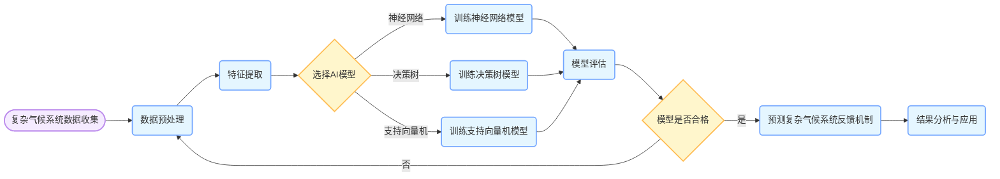

# AI模型在复杂气候系统反馈机制预测中的应用研究

> 关键词：AI模型、复杂气候系统、反馈机制、预测、应用研究

> 摘要：本文聚焦于AI模型在复杂气候系统反馈机制预测中的应用。首先介绍了相关研究的背景，包括目的范围、预期读者等内容。详细阐述了复杂气候系统反馈机制以及AI模型的核心概念与联系，并给出了相应的文本示意图和Mermaid流程图。深入讲解了核心算法原理，用Python源代码进行了详细阐述，同时给出了相关的数学模型和公式并举例说明。通过项目实战展示了代码的实际案例和详细解释。探讨了AI模型在复杂气候系统反馈机制预测中的实际应用场景，推荐了相关的学习资源、开发工具框架以及论文著作。最后总结了未来发展趋势与挑战，解答了常见问题并提供了扩展阅读与参考资料，旨在全面深入地研究AI模型在该领域的应用，为相关研究和实践提供有价值的参考。

## 1. 背景介绍 
### 1.1 目的和范围
气候系统是一个极其复杂的系统，包含了大气、海洋、陆地、冰雪等多个子系统，它们之间存在着复杂的相互作用和反馈机制。准确预测复杂气候系统的反馈机制对于理解气候变化、制定应对策略以及保障人类社会的可持续发展具有至关重要的意义。传统的气候预测方法在处理复杂气候系统的非线性、多尺度和不确定性等问题时存在一定的局限性。而AI模型具有强大的数据分析和模式识别能力，能够从海量的气候数据中挖掘出潜在的规律和特征，为复杂气候系统反馈机制的预测提供了新的思路和方法。

本研究的范围涵盖了常见的AI模型，如神经网络、决策树、支持向量机等在复杂气候系统反馈机制预测中的应用。主要关注这些模型如何处理气候数据，如何构建有效的预测模型，以及如何评估模型的性能和可靠性等方面。

### 1.2 预期读者
本文的预期读者包括从事气候科学研究的科研人员，他们可以通过本文了解AI模型在复杂气候系统反馈机制预测中的最新应用和技术，为其研究工作提供新的方法和思路；计算机科学领域的研究人员和开发者，他们可以从气候科学的角度深入理解AI模型的应用场景和挑战，拓展AI技术的应用领域；相关专业的研究生和本科生，他们可以通过本文系统地学习AI模型在复杂气候系统反馈机制预测中的基本原理、方法和实践，为其专业学习和研究打下基础；以及对气候变化和AI技术感兴趣的普通读者，他们可以通过本文了解到前沿的科学研究成果和技术应用，增强对气候变化问题的认识和理解。

### 1.3 文档结构概述
本文将按照以下结构进行组织：首先介绍背景知识，包括研究的目的、范围、预期读者和文档结构概述等内容，让读者对本文的研究背景和整体框架有一个清晰的了解。接着阐述复杂气候系统反馈机制以及AI模型的核心概念与联系，通过文本示意图和Mermaid流程图直观地展示其原理和架构。然后深入讲解核心算法原理，用Python源代码详细阐述算法的实现过程，并给出相关的数学模型和公式，通过具体例子进行说明。通过项目实战展示代码的实际案例，包括开发环境搭建、源代码详细实现和代码解读等内容，让读者能够将理论知识应用到实际项目中。探讨AI模型在复杂气候系统反馈机制预测中的实际应用场景，让读者了解其实际应用价值。推荐相关的学习资源、开发工具框架以及论文著作，为读者提供进一步学习和研究的参考。最后总结未来发展趋势与挑战，解答常见问题并提供扩展阅读与参考资料，使读者对整个研究领域有一个全面的认识。

### 1.4 术语表
#### 1.4.1 核心术语定义
- **复杂气候系统**：由大气圈、水圈、岩石圈、冰雪圈和生物圈等组成的庞大系统，各子系统之间存在着复杂的相互作用和反馈机制，具有高度的非线性、多尺度和不确定性等特征。
- **反馈机制**：在气候系统中，一个变量的变化会引起其他变量的变化，而这些变化又会反过来影响原变量，形成一个相互作用的循环过程。反馈机制可以分为正反馈和负反馈，正反馈会放大初始变化，负反馈则会抑制初始变化。
- **AI模型**：即人工智能模型，是基于计算机科学和数学原理构建的算法模型，能够从数据中学习模式和规律，并进行预测和决策。常见的AI模型包括神经网络、决策树、支持向量机等。
- **气候预测**：根据对过去和现在气候状况的观测和分析，运用一定的方法和模型，对未来气候的变化趋势和特征进行预测和估计。

#### 1.4.2 相关概念解释
- **非线性系统**：指系统的输出与输入之间不存在线性关系的系统。在复杂气候系统中，许多过程和现象都表现出非线性特征，如大气环流、海洋温度变化等。非线性系统的行为往往具有复杂性和不确定性，难以用简单的线性模型进行描述和预测。
- **多尺度特征**：复杂气候系统包含了从微观到宏观的多个尺度的过程和现象，如大气中的湍流运动、全球尺度的气候变化等。不同尺度的过程和现象相互作用、相互影响，共同决定了气候系统的整体行为。
- **不确定性**：由于气候系统的复杂性和人类对其认识的局限性，气候预测中存在着各种不确定性因素，如观测数据的误差、模型的简化和假设等。不确定性的存在增加了气候预测的难度和挑战性。

#### 1.4.3 缩略词列表
- **AI**：Artificial Intelligence，人工智能
- **ANN**：Artificial Neural Network，人工神经网络
- **SVM**：Support Vector Machine，支持向量机
- **DT**：Decision Tree，决策树

## 2. 核心概念与联系 

### 复杂气候系统反馈机制原理
复杂气候系统的反馈机制是一个复杂而微妙的过程。以地球的能量平衡为例，太阳辐射是地球的主要能量来源，地球吸收太阳辐射后会向外发射长波辐射。当大气中的温室气体浓度增加时，会吸收更多的长波辐射，导致大气温度升高。大气温度升高又会引起一系列的变化，如冰川融化、海面蒸发增加等。冰川融化会减少地球表面的反射率，使更多的太阳辐射被吸收，进一步加剧温度升高，这就是一个正反馈过程。而海面蒸发增加会形成更多的云，云可以反射太阳辐射，减少地球吸收的能量，从而抑制温度升高，这是一个负反馈过程。

### AI模型原理
常见的AI模型如神经网络，它是由大量的神经元组成的复杂网络结构。神经元之间通过权重相互连接，信息在网络中传播和处理。神经网络通过对大量数据的学习，调整权重参数，使得网络的输出与期望输出尽可能接近。例如，一个简单的三层神经网络包括输入层、隐藏层和输出层。输入层接收外界的数据，隐藏层对数据进行特征提取和转换，输出层给出最终的预测结果。

### 两者联系
AI模型可以用于分析复杂气候系统的反馈机制。通过收集大量的气候数据，如温度、湿度、气压等，将这些数据作为AI模型的输入。AI模型可以学习这些数据之间的内在关系，识别出复杂气候系统中的反馈机制模式。例如，神经网络可以通过对历史气候数据的学习，预测未来气候系统中某个变量的变化，以及这种变化可能引发的反馈过程。

### 文本示意图
复杂气候系统反馈机制与AI模型的联系可以用以下文本示意图表示：

复杂气候系统包含多个子系统，如大气、海洋、陆地等，这些子系统之间存在着复杂的相互作用和反馈关系。AI模型作为一种数据分析工具，通过收集和处理来自复杂气候系统的各种数据，如气象观测数据、卫星遥感数据等，学习数据中的模式和规律。AI模型的输出可以用于预测复杂气候系统的未来状态，以及分析其中的反馈机制。同时，预测结果和分析结论又可以反馈到复杂气候系统的研究和管理中，为制定应对气候变化的策略提供依据。

### Mermaid流程图


## 3. 核心算法原理 & 具体操作步骤 

### 神经网络算法原理
神经网络是一种模仿人类神经系统的计算模型，由多个神经元组成的层次结构。每个神经元接收来自其他神经元的输入，经过加权求和和非线性激活函数处理后，产生输出。以一个简单的前馈神经网络为例，其数学表达式为：

设输入层有 $n$ 个神经元，隐藏层有 $m$ 个神经元，输出层有 $k$ 个神经元。输入向量为 $\mathbf{x} = [x_1, x_2, \cdots, x_n]^T$，隐藏层的权重矩阵为 $\mathbf{W}^h = [w_{ij}^h]_{m\times n}$，偏置向量为 $\mathbf{b}^h = [b_1^h, b_2^h, \cdots, b_m^h]^T$，输出层的权重矩阵为 $\mathbf{W}^o = [w_{ij}^o]_{k\times m}$，偏置向量为 $\mathbf{b}^o = [b_1^o, b_2^o, \cdots, b_k^o]^T$。

隐藏层的输入为：
$$\mathbf{z}^h = \mathbf{W}^h\mathbf{x} + \mathbf{b}^h$$

隐藏层的输出为：
$$\mathbf{a}^h = f(\mathbf{z}^h)$$
其中 $f$ 为激活函数，常见的激活函数有Sigmoid函数、ReLU函数等。

输出层的输入为：
$$\mathbf{z}^o = \mathbf{W}^o\mathbf{a}^h + \mathbf{b}^o$$

输出层的输出为：
$$\mathbf{y} = g(\mathbf{z}^o)$$
其中 $g$ 为输出层的激活函数，根据具体问题选择合适的函数。

### Python源代码实现
```python
import numpy as np

# 定义Sigmoid激活函数
def sigmoid(x):
    return 1 / (1 + np.exp(-x))

# 定义神经网络类
class NeuralNetwork:
    def __init__(self, input_size, hidden_size, output_size):
        # 初始化隐藏层权重和偏置
        self.weights_hidden = np.random.rand(hidden_size, input_size)
        self.bias_hidden = np.random.rand(hidden_size, 1)
        # 初始化输出层权重和偏置
        self.weights_output = np.random.rand(output_size, hidden_size)
        self.bias_output = np.random.rand(output_size, 1)

    def forward(self, x):
        # 前向传播计算隐藏层输入和输出
        z_hidden = np.dot(self.weights_hidden, x) + self.bias_hidden
        a_hidden = sigmoid(z_hidden)
        # 前向传播计算输出层输入和输出
        z_output = np.dot(self.weights_output, a_hidden) + self.bias_output
        a_output = sigmoid(z_output)
        return a_output

# 示例使用
input_size = 3
hidden_size = 4
output_size = 1
nn = NeuralNetwork(input_size, hidden_size, output_size)
x = np.array([[0.1], [0.2], [0.3]])
output = nn.forward(x)
print("神经网络输出:", output)
```

### 具体操作步骤
1. **数据准备**：收集复杂气候系统的相关数据，如温度、湿度、气压等，并进行预处理，包括数据清洗、归一化等操作。
2. **模型构建**：根据问题的需求和数据的特点，选择合适的神经网络结构，确定输入层、隐藏层和输出层的神经元数量。
3. **参数初始化**：随机初始化神经网络的权重和偏置参数。
4. **前向传播**：将输入数据传入神经网络，按照上述公式进行计算，得到输出结果。
5. **损失计算**：根据输出结果和真实标签，计算损失函数的值，常用的损失函数有均方误差、交叉熵等。
6. **反向传播**：根据损失函数的值，计算权重和偏置的梯度，使用梯度下降等优化算法更新参数。
7. **重复训练**：重复步骤4 - 6，直到模型的性能达到满意的程度。
8. **模型评估**：使用测试数据对训练好的模型进行评估，计算评估指标，如准确率、均方误差等。
9. **预测应用**：使用训练好的模型对新的气候数据进行预测，分析复杂气候系统的反馈机制。

## 4. 数学模型和公式 & 详细讲解 & 举例说明 

### 损失函数
在神经网络训练中，损失函数用于衡量模型的输出与真实标签之间的差异。常见的损失函数有均方误差（Mean Squared Error, MSE）和交叉熵损失（Cross-Entropy Loss）。

#### 均方误差
均方误差的数学表达式为：
$$MSE = \frac{1}{n}\sum_{i=1}^{n}(y_i - \hat{y}_i)^2$$
其中 $n$ 为样本数量，$y_i$ 为真实标签，$\hat{y}_i$ 为模型的预测输出。

详细讲解：均方误差通过计算预测值与真实值之间的平方差的平均值来衡量模型的误差。平方的作用是放大误差，使得较大的误差对损失函数的影响更大。均方误差适用于回归问题，即预测连续值的问题。

举例说明：假设有一个简单的回归问题，真实标签为 $y = [1, 2, 3]$，模型的预测输出为 $\hat{y} = [1.1, 1.9, 3.2]$，样本数量 $n = 3$。则均方误差为：
$$MSE = \frac{1}{3}[(1 - 1.1)^2 + (2 - 1.9)^2 + (3 - 3.2)^2] = \frac{1}{3}[(-0.1)^2 + 0.1^2 + (-0.2)^2] = \frac{1}{3}[0.01 + 0.01 + 0.04] = \frac{0.06}{3} = 0.02$$

#### 交叉熵损失
交叉熵损失常用于分类问题，其数学表达式为：
$$H(p, q) = -\sum_{i=1}^{n}p_i\log(q_i)$$
其中 $p$ 为真实概率分布，$q$ 为模型预测的概率分布。

详细讲解：交叉熵损失衡量的是两个概率分布之间的差异。在分类问题中，真实标签通常用one-hot编码表示，即只有一个类别为1，其他类别为0。模型的输出是每个类别的概率。交叉熵损失鼓励模型预测的概率分布尽可能接近真实概率分布。

举例说明：假设有一个二分类问题，真实标签为 $p = [1, 0]$，模型的预测输出为 $q = [0.8, 0.2]$。则交叉熵损失为：
$$H(p, q) = -(1\times\log(0.8) + 0\times\log(0.2)) = -\log(0.8) \approx 0.223$$

### 梯度下降算法
梯度下降算法是一种常用的优化算法，用于更新神经网络的权重和偏置参数，使得损失函数的值最小化。其数学表达式为：
$$\theta_{t+1} = \theta_t - \alpha\nabla J(\theta_t)$$
其中 $\theta$ 为待更新的参数（权重或偏置），$\alpha$ 为学习率，$\nabla J(\theta_t)$ 为损失函数 $J$ 关于参数 $\theta$ 在 $t$ 时刻的梯度。

详细讲解：梯度下降算法的基本思想是沿着损失函数的负梯度方向更新参数，因为负梯度方向是损失函数下降最快的方向。学习率 $\alpha$ 控制了每次更新的步长，过大的学习率可能导致算法无法收敛，过小的学习率会导致收敛速度过慢。

举例说明：假设有一个简单的损失函数 $J(\theta) = \theta^2$，其梯度为 $\nabla J(\theta) = 2\theta$。初始参数 $\theta_0 = 2$，学习率 $\alpha = 0.1$。则第一次更新后的参数为：
$$\theta_1 = \theta_0 - \alpha\nabla J(\theta_0) = 2 - 0.1\times 2\times 2 = 2 - 0.4 = 1.6$$

## 5. 项目实战：代码实际案例和详细解释说明 

### 5.1  开发环境搭建
#### 操作系统
本项目可以在Windows、Linux或macOS等主流操作系统上进行开发。建议使用Ubuntu 18.04及以上版本的Linux系统，因为其具有良好的开源软件支持和稳定性。

#### Python环境
安装Python 3.7及以上版本，可以通过Anaconda或官方Python网站进行安装。Anaconda是一个流行的Python发行版，它集成了许多常用的科学计算库和工具，方便我们进行开发。

#### 安装必要的库
使用pip或conda安装以下必要的库：
- **NumPy**：用于数值计算和数组操作。
- **Pandas**：用于数据处理和分析。
- **Scikit-learn**：提供了许多机器学习算法和工具。
- **TensorFlow或PyTorch**：用于构建和训练神经网络模型。

以下是使用conda安装这些库的命令：
```bash
conda install numpy pandas scikit-learn tensorflow
```

### 5.2  源代码详细实现和代码解读
#### 数据加载和预处理
```python
import pandas as pd
from sklearn.preprocessing import StandardScaler

# 加载气候数据
data = pd.read_csv('climate_data.csv')

# 分离特征和标签
X = data.drop('target_variable', axis=1)
y = data['target_variable']

# 数据标准化
scaler = StandardScaler()
X_scaled = scaler.fit_transform(X)
```
代码解读：首先使用Pandas库的`read_csv`函数加载气候数据文件。然后将特征和标签分离，`drop`方法用于删除目标变量列，得到特征矩阵 $X$，目标变量存储在 $y$ 中。最后使用`StandardScaler`对特征矩阵进行标准化处理，使得每个特征的均值为0，标准差为1，这样可以提高模型的训练效果。

#### 构建神经网络模型
```python
import tensorflow as tf
from tensorflow.keras.models import Sequential
from tensorflow.keras.layers import Dense

# 构建Sequential模型
model = Sequential()

# 添加输入层和隐藏层
model.add(Dense(64, activation='relu', input_shape=(X_scaled.shape[1],)))

# 添加更多隐藏层
model.add(Dense(32, activation='relu'))

# 添加输出层
model.add(Dense(1, activation='linear'))

# 编译模型
model.compile(optimizer='adam', loss='mse', metrics=['mse'])
```
代码解读：使用TensorFlow的Keras API构建一个Sequential模型，Sequential模型是一种线性堆叠的模型结构。通过`add`方法添加不同的层，第一个`Dense`层为输入层和隐藏层，指定神经元数量为64，激活函数为ReLU，`input_shape`参数指定输入的特征维度。接着添加一个包含32个神经元的隐藏层，激活函数同样为ReLU。最后添加一个输出层，神经元数量为1，激活函数为线性函数，因为这是一个回归问题。使用`compile`方法编译模型，指定优化器为Adam，损失函数为均方误差（MSE），并选择MSE作为评估指标。

#### 模型训练
```python
# 划分训练集和测试集
from sklearn.model_selection import train_test_split
X_train, X_test, y_train, y_test = train_test_split(X_scaled, y, test_size=0.2, random_state=42)

# 训练模型
model.fit(X_train, y_train, epochs=100, batch_size=32, validation_data=(X_test, y_test))
```
代码解读：使用`train_test_split`函数将标准化后的特征矩阵和标签划分为训练集和测试集，测试集占总数据的20%。使用`fit`方法训练模型，指定训练的轮数（epochs）为100，每批次的样本数量（batch_size）为32，同时传入测试集作为验证数据，以便在训练过程中监控模型在测试集上的性能。

### 5.3  代码解读与分析
#### 数据预处理的重要性
数据预处理是机器学习项目中非常重要的一步。在本项目中，对气候数据进行标准化处理可以使得不同特征具有相同的尺度，避免某些特征因为数值范围过大或过小而对模型的训练产生不良影响。同时，数据标准化还可以加快模型的收敛速度，提高训练效率。

#### 神经网络模型结构分析
本项目构建的神经网络模型包含输入层、两个隐藏层和一个输出层。隐藏层使用ReLU激活函数可以引入非线性因素，使得模型能够学习到更复杂的模式和特征。输出层使用线性激活函数是因为这是一个回归问题，需要预测连续值。

#### 模型训练过程分析
在训练过程中，使用了Adam优化器来更新模型的参数。Adam优化器结合了Adagrad和RMSProp的优点，能够自适应地调整学习率，提高训练的稳定性和效率。通过指定训练的轮数和批次大小，可以控制模型的训练过程。同时，使用验证数据可以及时发现模型是否存在过拟合或欠拟合的问题，以便调整模型的结构和参数。

## 6. 实际应用场景 
### 气候灾害预警
AI模型可以通过对复杂气候系统反馈机制的预测，提前预警可能发生的气候灾害，如暴雨、洪水、台风等。例如，通过分析大气环流、海洋温度等因素的变化，预测暴雨的发生概率和强度，及时向相关部门和公众发布预警信息，采取相应的防范措施，减少灾害造成的损失。

### 农业生产决策
气候条件对农业生产有着重要的影响。AI模型可以预测未来的气候趋势，帮助农民合理安排种植计划、灌溉和施肥等农事活动。例如，根据预测的降水和温度变化，确定最佳的播种时间和作物品种，提高农作物的产量和质量。

### 能源管理
能源系统与气候系统密切相关。AI模型可以预测复杂气候系统的变化对能源需求和供应的影响，帮助能源企业优化能源生产和调度计划。例如，预测风力发电和太阳能发电的发电量，合理安排电网的调度，提高能源利用效率。

### 生态环境保护
复杂气候系统的变化会对生态环境产生深远的影响。AI模型可以预测气候变化对生态系统的影响，如物种分布的变化、生态系统服务功能的退化等。为生态环境保护和管理提供科学依据，制定相应的保护措施和政策。

## 7. 工具和资源推荐
### 7.1 学习资源推荐
#### 7.1.1 书籍推荐
- 《深度学习》（Deep Learning）：由Ian Goodfellow、Yoshua Bengio和Aaron Courville三位深度学习领域的权威专家撰写，全面介绍了深度学习的基本概念、算法和应用，是深度学习领域的经典教材。
- 《Python机器学习》（Python Machine Learning）：作者Sebastian Raschka和Vahid Mirjalili，详细介绍了使用Python进行机器学习的方法和技术，包括数据预处理、模型选择、评估和优化等内容，适合初学者入门。
- 《气候系统动力学》：系统介绍了气候系统的基本原理、动力学过程和反馈机制，对于理解复杂气候系统的本质和特征具有重要的参考价值。

#### 7.1.2 在线课程
- Coursera平台上的“深度学习专项课程”（Deep Learning Specialization）：由Andrew Ng教授主讲，包括深度学习基础、改善深层神经网络、结构化机器学习项目、卷积神经网络和序列模型等五个课程，全面深入地介绍了深度学习的理论和实践。
- edX平台上的“气候科学基础”（Fundamentals of Climate Science）：由麻省理工学院（MIT）的教授授课，系统讲解了气候系统的基本原理、气候变化的原因和影响等内容，帮助学习者建立起气候科学的基础知识体系。
- 中国大学MOOC平台上的“机器学习”课程：由国内知名高校的教授授课，详细介绍了机器学习的基本算法和应用，结合实际案例进行讲解，适合国内学习者学习。

#### 7.1.3 技术博客和网站
- Medium：一个技术博客平台，上面有许多关于AI和气候科学的优质文章，涵盖了最新的研究成果、技术应用和实践经验等内容。
- arXiv：一个预印本数据库，提供了大量关于AI和气候科学的研究论文，方便研究者及时了解最新的研究动态。
- 中国气象数据网：提供了丰富的气象数据和相关的研究报告，是了解中国气候状况和获取气候数据的重要渠道。

### 7.2 开发工具框架推荐
#### 7.2.1 IDE和编辑器
- PyCharm：一款功能强大的Python集成开发环境（IDE），提供了代码编辑、调试、版本控制等丰富的功能，适合专业的Python开发者使用。
- Jupyter Notebook：一个交互式的开发环境，支持Python、R等多种编程语言，方便进行数据探索、模型训练和结果展示等工作，适合数据科学家和研究者使用。
- Visual Studio Code：一款轻量级的代码编辑器，支持多种编程语言和插件扩展，具有良好的可定制性和开发效率，适合初学者和快速开发场景。

#### 7.2.2 调试和性能分析工具
- TensorBoard：TensorFlow提供的可视化工具，可以实时监控模型的训练过程，如损失函数的变化、准确率的变化等，还可以可视化模型的结构和参数分布，帮助开发者调试和优化模型。
- PyTorch Profiler：PyTorch提供的性能分析工具，可以分析模型的计算时间、内存使用等性能指标，帮助开发者找出模型的性能瓶颈，进行优化。
- Scikit-learn的GridSearchCV和RandomizedSearchCV：用于模型超参数调优的工具，可以通过网格搜索或随机搜索的方式找到最优的超参数组合，提高模型的性能。

#### 7.2.3 相关框架和库
- TensorFlow：一个开源的机器学习框架，提供了丰富的工具和接口，支持深度学习模型的构建、训练和部署，广泛应用于图像识别、自然语言处理等领域。
- PyTorch：另一个流行的深度学习框架，具有动态计算图的特点，代码简洁易懂，适合快速开发和研究，在学术界和工业界都有广泛的应用。
- Scikit-learn：一个简单易用的机器学习库，提供了各种机器学习算法和工具，如分类、回归、聚类等，适合初学者和快速实现机器学习任务。

### 7.3 相关论文著作推荐
#### 7.3.1 经典论文
- “ImageNet Classification with Deep Convolutional Neural Networks”：由Alex Krizhevsky、Ilya Sutskever和Geoffrey E. Hinton发表的论文，介绍了AlexNet模型，开创了深度学习在图像识别领域的先河，具有重要的历史意义。
- “Long Short-Term Memory”：由Sepp Hochreiter和Jürgen Schmidhuber发表的论文，提出了长短期记忆网络（LSTM），解决了传统循环神经网络中的梯度消失和梯度爆炸问题，在序列数据处理中得到了广泛的应用。
- “The Physical Science Basis”：是IPCC（政府间气候变化专门委员会）发布的气候变化评估报告的一部分，系统总结了气候科学的最新研究成果，是了解气候变化科学基础的重要文献。

#### 7.3.2 最新研究成果
- 关注Nature、Science、Journal of Climate等国际知名学术期刊，这些期刊经常发表关于AI和气候科学的最新研究成果，反映了该领域的前沿动态。
- 参加相关的国际学术会议，如NeurIPS（神经信息处理系统大会）、AGU（美国地球物理联合会年会）等，与国内外的专家学者交流最新的研究进展和成果。

#### 7.3.3 应用案例分析
- 参考相关的行业报告和案例研究，了解AI模型在复杂气候系统反馈机制预测中的实际应用案例，学习他人的经验和方法，为自己的研究和实践提供参考。
- 关注一些知名企业和科研机构的官方网站，如谷歌、微软、中国科学院等，他们经常发布关于AI和气候科学的应用案例和研究成果。

## 8. 总结：未来发展趋势与挑战
### 未来发展趋势
#### 多学科融合
未来，AI模型在复杂气候系统反馈机制预测中的应用将更加注重多学科的融合。气候科学、计算机科学、数学、物理学等多个学科的知识和方法将相互交叉和渗透，共同推动该领域的发展。例如，结合地球系统模式和AI模型，充分利用地球系统模式的物理过程描述能力和AI模型的数据驱动能力，提高气候预测的准确性和可靠性。

#### 深度学习技术的不断创新
深度学习技术将不断发展和创新，新的模型结构和算法将不断涌现。例如，生成对抗网络（GAN）、Transformer等模型在气候数据处理和预测中的应用将得到进一步的探索和研究。这些新的技术和方法将为复杂气候系统反馈机制的预测提供更强大的工具和手段。

#### 大数据和云计算的支持
随着大数据和云计算技术的不断发展，气候数据的收集、存储和处理能力将得到极大的提升。更多的气候数据将被收集和整合，为AI模型的训练和优化提供更丰富的信息。同时，云计算平台将为大规模的模型训练和计算提供强大的计算资源支持，提高研究和应用的效率。

#### 实时监测和预测
未来的气候预测将更加注重实时性和动态性。通过建立实时监测系统，及时获取气候数据的变化信息，并利用AI模型进行实时分析和预测。这将有助于及时发现气候变化的趋势和异常情况，为应对气候变化提供更及时有效的决策支持。

### 挑战
#### 数据质量和不确定性
气候数据的质量和不确定性是影响AI模型预测准确性的重要因素。气候数据的观测误差、缺失值、异常值等问题会影响模型的训练和预测效果。同时，气候系统本身的不确定性也给模型的预测带来了挑战。如何处理数据质量和不确定性问题，提高模型的鲁棒性和可靠性，是未来需要解决的重要问题。

#### 模型可解释性
AI模型，尤其是深度学习模型，通常被视为“黑箱”模型，其决策过程和结果难以解释。在复杂气候系统反馈机制预测中，模型的可解释性非常重要，因为决策者需要了解模型的预测依据和可靠性。如何提高AI模型的可解释性，使其能够为气候决策提供科学合理的解释和建议，是当前面临的一个挑战。

#### 计算资源和效率
训练和优化复杂的AI模型需要大量的计算资源和时间。随着模型规模的不断增大和数据量的不断增加，计算资源和效率的问题将变得更加突出。如何优化模型结构和算法，提高计算效率，降低计算成本，是未来需要解决的关键问题。

#### 伦理和社会问题
AI模型在复杂气候系统反馈机制预测中的应用还涉及到伦理和社会问题。例如，模型的预测结果可能会对社会和经济产生重大影响，如何确保模型的公正性和客观性，避免对某些群体造成不公平的影响，是需要关注的问题。同时，数据隐私和安全问题也需要得到重视，保护气候数据的安全和隐私。

## 9. 附录：常见问题与解答
### 1. AI模型在复杂气候系统反馈机制预测中的准确性如何保证？
要保证AI模型在复杂气候系统反馈机制预测中的准确性，需要从多个方面入手。首先，要确保数据的质量，对气候数据进行严格的清洗、预处理和验证，减少数据误差和噪声的影响。其次，选择合适的AI模型和算法，根据问题的特点和数据的分布选择最适合的模型结构和参数。此外，进行充分的模型训练和优化，使用交叉验证、超参数调优等方法，提高模型的泛化能力。最后，对模型的预测结果进行评估和验证，与实际观测数据进行对比分析，不断改进模型。

### 2. 如何处理气候数据中的缺失值和异常值？
处理气候数据中的缺失值和异常值有多种方法。对于缺失值，可以采用删除法、插补法等。删除法是直接删除包含缺失值的样本或特征，但这种方法可能会导致数据信息的丢失。插补法是通过一定的方法估计缺失值，如均值插补、中位数插补、线性回归插补等。对于异常值，可以采用统计方法（如Z-score法、IQR法等）进行识别和处理，将异常值替换为合理的值或直接删除。

### 3. AI模型在复杂气候系统反馈机制预测中会受到哪些因素的影响？
AI模型在复杂气候系统反馈机制预测中会受到多种因素的影响。数据因素包括数据的质量、数量、分布等。模型因素包括模型的结构、参数、算法等。环境因素包括气候系统的复杂性、不确定性、非线性等。此外，人为因素如数据处理方法、模型选择和训练过程等也会对预测结果产生影响。

### 4. 如何提高AI模型的可解释性？
提高AI模型的可解释性可以采用多种方法。一种方法是使用可解释性较强的模型，如决策树、线性回归等。这些模型的决策过程和结果比较容易理解和解释。另一种方法是采用模型解释技术，如特征重要性分析、局部解释方法（如LIME、SHAP等），通过分析模型的输入特征和输出结果之间的关系，解释模型的决策依据。此外，还可以将AI模型与物理模型相结合，利用物理模型的可解释性来提高AI模型的可解释性。

### 5. AI模型在复杂气候系统反馈机制预测中的应用前景如何？
AI模型在复杂气候系统反馈机制预测中具有广阔的应用前景。随着AI技术的不断发展和气候数据的不断丰富，AI模型将能够更准确地预测复杂气候系统的反馈机制，为气候变化的研究和应对提供更有力的支持。在气候灾害预警、农业生产决策、能源管理、生态环境保护等领域，AI模型的应用将有助于提高决策的科学性和有效性，减少气候变化带来的损失和影响。

## 10. 扩展阅读 & 参考资料
### 扩展阅读
- 《人工智能时代的气候科学》：探讨了AI技术在气候科学中的应用现状和未来发展趋势，深入分析了AI模型在复杂气候系统反馈机制预测中的作用和挑战。
- 《气候变化与可持续发展》：介绍了气候变化对人类社会和生态环境的影响，以及如何通过可持续发展的方式应对气候变化，为AI模型在气候领域的应用提供了更广阔的背景和视角。

### 参考资料
- IPCC（政府间气候变化专门委员会）发布的各类气候变化评估报告，提供了关于气候科学的权威数据和研究成果。
- 相关的学术论文和研究报告，如发表在Nature、Science、Journal of Climate等学术期刊上的论文，以及各大科研机构发布的研究报告，为本文的研究和撰写提供了理论和实践依据。
- 开源代码库和数据集，如Kaggle上的气候数据集、GitHub上的相关AI模型实现代码，为项目实战和技术实现提供了参考和支持。

作者：AI天才研究院/AI Genius Institute & 禅与计算机程序设计艺术 /Zen And The Art of Computer Programming