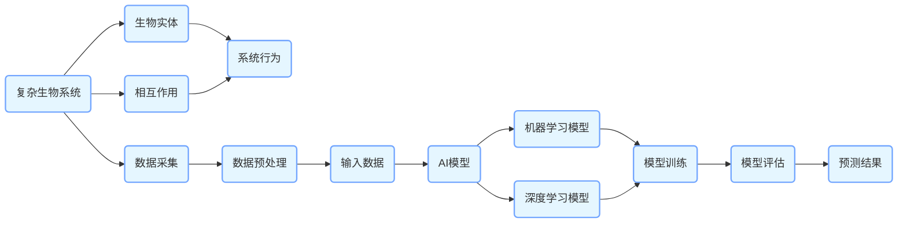

# AI模型在复杂生物系统动态预测中的应用研究

> 关键词：AI模型、复杂生物系统、动态预测、机器学习、深度学习

> 摘要：本文聚焦于AI模型在复杂生物系统动态预测中的应用。首先介绍了研究的背景、目的、预期读者等内容。接着阐述了核心概念，包括复杂生物系统和AI模型的原理及架构，并给出了相应的示意图和流程图。详细讲解了核心算法原理，通过Python代码进行说明，同时介绍了相关的数学模型和公式。通过项目实战，展示了如何搭建开发环境、实现源代码并进行解读分析。探讨了AI模型在复杂生物系统动态预测中的实际应用场景，推荐了学习资源、开发工具框架和相关论文著作。最后总结了未来发展趋势与挑战，解答了常见问题，并提供了扩展阅读和参考资料。旨在为相关领域的研究和应用提供全面的技术指导和理论支持。

## 1. 背景介绍 
### 1.1 目的和范围
复杂生物系统如生态系统、细胞内信号传导网络、生物代谢途径等，具有高度的复杂性、非线性、动态性和不确定性。准确预测这些系统的动态变化对于理解生物过程、疾病诊断与治疗、药物研发、生态保护等方面都具有重要意义。本研究的目的在于探讨AI模型在复杂生物系统动态预测中的应用，分析不同AI模型的优势和局限性，为实际应用提供有效的方法和策略。研究范围涵盖了常见的AI模型，如机器学习中的决策树、支持向量机，深度学习中的神经网络等，以及多种复杂生物系统的动态预测问题。

### 1.2 预期读者
本文预期读者包括生物信息学、系统生物学、人工智能等领域的研究人员、学生和从业者。对于希望了解如何将AI技术应用于生物系统研究的生物学专业人员，以及对生物领域应用感兴趣的AI工程师和数据科学家都具有参考价值。

### 1.3 文档结构概述
本文首先介绍研究的背景信息，包括目的、预期读者和文档结构。接着阐述核心概念，解释复杂生物系统和AI模型的相关原理和联系。然后详细讲解核心算法原理和具体操作步骤，通过Python代码进行演示。介绍相关的数学模型和公式，并举例说明。通过项目实战展示如何将AI模型应用于复杂生物系统动态预测，包括开发环境搭建、源代码实现和代码解读。探讨实际应用场景，推荐学习资源、开发工具框架和相关论文著作。最后总结未来发展趋势与挑战，解答常见问题，并提供扩展阅读和参考资料。

### 1.4 术语表
#### 1.4.1 核心术语定义
- **复杂生物系统**：由大量相互作用的生物组分（如细胞、分子、物种等）组成的系统，具有高度的复杂性、非线性、动态性和不确定性，其行为难以通过简单的线性模型进行描述和预测。
- **AI模型**：人工智能模型是指基于机器学习、深度学习等技术构建的算法模型，能够从数据中学习模式和规律，并用于预测、分类、聚类等任务。
- **动态预测**：对系统随时间变化的状态和行为进行预测，考虑系统的动态特性和时间序列信息。

#### 1.4.2 相关概念解释
- **机器学习**：是一门多领域交叉学科，涉及概率论、统计学、逼近论、凸分析、算法复杂度理论等多门学科。它专门研究计算机怎样模拟或实现人类的学习行为，以获取新的知识或技能，重新组织已有的知识结构使之不断改善自身的性能。
- **深度学习**：是机器学习的一个分支领域，它是一种基于对数据进行表征学习的方法。深度学习通过构建具有很多层的神经网络模型，自动从大量数据中学习到复杂的特征和模式。
- **生物信息学**：是一门交叉学科，它综合运用数学、计算机科学和生物学的各种工具，来阐明和理解大量生物数据所包含的生物学意义。

#### 1.4.3 缩略词列表
- **ML**：Machine Learning，机器学习
- **DL**：Deep Learning，深度学习
- **SVM**：Support Vector Machine，支持向量机
- **DNN**：Deep Neural Network，深度神经网络
- **RNN**：Recurrent Neural Network，循环神经网络

## 2. 核心概念与联系 
### 复杂生物系统
复杂生物系统是由众多生物实体（如细胞、分子、物种等）通过复杂的相互作用构成的网络。这些相互作用包括生物化学反应、信号传导、基因调控等，使得系统呈现出高度的复杂性和非线性。例如，细胞内的信号传导网络中，一个信号分子的激活可能会引发一系列的级联反应，影响多个基因的表达和细胞的行为。

### AI模型
AI模型是用于处理和分析数据的算法框架。在复杂生物系统动态预测中，常用的AI模型包括机器学习模型和深度学习模型。机器学习模型如决策树、支持向量机等，通过对训练数据的学习，建立输入特征和输出结果之间的映射关系。深度学习模型如神经网络，具有强大的特征学习能力，能够自动从大量数据中提取复杂的特征。

### 核心概念原理和架构的文本示意图
```plaintext
复杂生物系统
|-- 生物实体（细胞、分子、物种等）
|   |-- 相互作用（生物化学反应、信号传导、基因调控等）
|   |   |-- 系统行为（动态变化、稳态、适应等）
|
|-- 数据采集（实验测量、观测等）
|   |-- 数据预处理（清洗、归一化、特征提取等）
|   |   |-- 输入数据
|
|-- AI模型
|   |-- 机器学习模型（决策树、支持向量机等）
|   |   |-- 模型训练
|   |   |   |-- 模型评估
|   |   |   |   |-- 预测结果
|   |
|   |-- 深度学习模型（神经网络、循环神经网络等）
|   |   |-- 模型训练
|   |   |   |-- 模型评估
|   |   |   |   |-- 预测结果
```

### Mermaid流程图


## 3. 核心算法原理 & 具体操作步骤 
### 决策树算法原理
决策树是一种基于树结构进行决策的机器学习算法。它通过对数据的特征进行划分，构建一棵决策树，每个内部节点表示一个特征上的测试，每个分支表示一个测试输出，每个叶节点表示一个类别或值。决策树的构建过程是一个递归的过程，通过选择最优的特征进行划分，使得划分后的子集纯度最高。

以下是使用Python的`scikit-learn`库实现决策树分类的示例代码：
```python
from sklearn.datasets import load_iris
from sklearn.model_selection import train_test_split
from sklearn.tree import DecisionTreeClassifier
from sklearn.metrics import accuracy_score

# 加载鸢尾花数据集
iris = load_iris()
X = iris.data
y = iris.target

# 划分训练集和测试集
X_train, X_test, y_train, y_test = train_test_split(X, y, test_size=0.3, random_state=42)

# 创建决策树分类器
clf = DecisionTreeClassifier()

# 训练模型
clf.fit(X_train, y_train)

# 预测测试集
y_pred = clf.predict(X_test)

# 计算准确率
accuracy = accuracy_score(y_test, y_pred)
print(f"决策树分类准确率: {accuracy}")
```

### 支持向量机算法原理
支持向量机（SVM）是一种二分类模型，它的基本思想是在特征空间中找到一个最优的超平面，使得不同类别的样本能够被最大程度地分开。对于线性可分的数据，SVM通过求解一个凸二次规划问题来找到最优超平面。对于线性不可分的数据，SVM通过引入核函数将数据映射到高维空间，使得数据在高维空间中线性可分。

以下是使用Python的`scikit-learn`库实现支持向量机分类的示例代码：
```python
from sklearn.datasets import load_iris
from sklearn.model_selection import train_test_split
from sklearn.svm import SVC
from sklearn.metrics import accuracy_score

# 加载鸢尾花数据集
iris = load_iris()
X = iris.data
y = iris.target

# 划分训练集和测试集
X_train, X_test, y_train, y_test = train_test_split(X, y, test_size=0.3, random_state=42)

# 创建支持向量机分类器
clf = SVC()

# 训练模型
clf.fit(X_train, y_train)

# 预测测试集
y_pred = clf.predict(X_test)

# 计算准确率
accuracy = accuracy_score(y_test, y_pred)
print(f"支持向量机分类准确率: {accuracy}")
```

### 神经网络算法原理
神经网络是一种模仿人类神经系统的计算模型，由大量的神经元组成。每个神经元接收输入信号，经过加权求和和激活函数处理后，输出一个信号。神经网络通过多层神经元的连接，能够自动学习数据中的复杂特征和模式。常见的神经网络包括前馈神经网络、卷积神经网络和循环神经网络等。

以下是使用Python的`TensorFlow`库实现简单的前馈神经网络分类的示例代码：
```python
import tensorflow as tf
from sklearn.datasets import load_iris
from sklearn.model_selection import train_test_split
from sklearn.preprocessing import OneHotEncoder
import numpy as np

# 加载鸢尾花数据集
iris = load_iris()
X = iris.data
y = iris.target

# 对标签进行独热编码
encoder = OneHotEncoder(sparse=False)
y = encoder.fit_transform(y.reshape(-1, 1))

# 划分训练集和测试集
X_train, X_test, y_train, y_test = train_test_split(X, y, test_size=0.3, random_state=42)

# 定义神经网络模型
model = tf.keras.Sequential([
    tf.keras.layers.Dense(10, activation='relu', input_shape=(4,)),
    tf.keras.layers.Dense(3, activation='softmax')
])

# 编译模型
model.compile(optimizer='adam', loss='categorical_crossentropy', metrics=['accuracy'])

# 训练模型
model.fit(X_train, y_train, epochs=100, batch_size=32, validation_data=(X_test, y_test))

# 评估模型
_, accuracy = model.evaluate(X_test, y_test)
print(f"神经网络分类准确率: {accuracy}")
```

## 4. 数学模型和公式 & 详细讲解 & 举例说明 
### 决策树的信息增益公式
决策树在选择最优特征进行划分时，常用信息增益作为衡量标准。信息增益表示划分前后信息熵的减少量，信息熵是对数据不确定性的度量。

信息熵的计算公式为：
$$H(D)=-\sum_{i=1}^{n}p_i\log_2p_i$$
其中，$D$ 表示数据集，$p_i$ 表示第 $i$ 类样本在数据集中所占的比例。

信息增益的计算公式为：
$$Gain(D, A)=H(D)-\sum_{v=1}^{V}\frac{|D^v|}{|D|}H(D^v)$$
其中，$A$ 表示特征，$V$ 表示特征 $A$ 的取值个数，$D^v$ 表示特征 $A$ 取值为 $v$ 的样本子集。

举例说明：假设有一个数据集 $D$ 包含 10 个样本，分为两类，第一类有 6 个样本，第二类有 4 个样本。则数据集 $D$ 的信息熵为：
$$H(D)=-\frac{6}{10}\log_2\frac{6}{10}-\frac{4}{10}\log_2\frac{4}{10}\approx 0.971$$
假设有一个特征 $A$ 有两个取值 $A_1$ 和 $A_2$，$A_1$ 对应的样本子集 $D^{A_1}$ 有 3 个第一类样本和 1 个第二类样本，$A_2$ 对应的样本子集 $D^{A_2}$ 有 3 个第一类样本和 3 个第二类样本。则 $D^{A_1}$ 的信息熵为：
$$H(D^{A_1})=-\frac{3}{4}\log_2\frac{3}{4}-\frac{1}{4}\log_2\frac{1}{4}\approx 0.811$$
$D^{A_2}$ 的信息熵为：
$$H(D^{A_2})=-\frac{3}{6}\log_2\frac{3}{6}-\frac{3}{6}\log_2\frac{3}{6}=1$$
特征 $A$ 的信息增益为：
$$Gain(D, A)=0.971-\frac{4}{10}\times0.811-\frac{6}{10}\times1\approx 0.126$$

### 支持向量机的优化目标函数
支持向量机的优化目标是找到一个最优的超平面，使得不同类别的样本能够被最大程度地分开。对于线性可分的数据，支持向量机的优化目标函数为：
$$\min_{\mathbf{w},b}\frac{1}{2}\|\mathbf{w}\|^2$$
$$s.t. \quad y_i(\mathbf{w}^T\mathbf{x}_i + b)\geq 1, \quad i = 1,2,\cdots,n$$
其中，$\mathbf{w}$ 是超平面的法向量，$b$ 是偏置项，$\mathbf{x}_i$ 是第 $i$ 个样本的特征向量，$y_i$ 是第 $i$ 个样本的标签（$y_i\in\{-1,1\}$）。

通过引入拉格朗日乘子 $\alpha_i$，可以将上述优化问题转化为对偶问题：
$$\max_{\boldsymbol{\alpha}}\sum_{i=1}^{n}\alpha_i-\frac{1}{2}\sum_{i=1}^{n}\sum_{j=1}^{n}\alpha_i\alpha_jy_iy_j\mathbf{x}_i^T\mathbf{x}_j$$
$$s.t. \quad \sum_{i=1}^{n}\alpha_iy_i = 0, \quad \alpha_i\geq 0, \quad i = 1,2,\cdots,n$$

### 神经网络的损失函数和梯度下降算法
神经网络的训练过程是通过最小化损失函数来调整网络的参数。常用的损失函数包括均方误差损失函数和交叉熵损失函数。

均方误差损失函数的计算公式为：
$$L(\mathbf{y},\hat{\mathbf{y}})=\frac{1}{n}\sum_{i=1}^{n}(y_i - \hat{y}_i)^2$$
其中，$\mathbf{y}$ 是真实标签向量，$\hat{\mathbf{y}}$ 是预测标签向量。

交叉熵损失函数的计算公式为：
$$L(\mathbf{y},\hat{\mathbf{y}})=-\sum_{i=1}^{n}y_i\log\hat{y}_i$$

梯度下降算法是一种常用的优化算法，用于更新神经网络的参数。其基本思想是沿着损失函数的负梯度方向更新参数，使得损失函数逐渐减小。参数更新公式为：
$$\theta_{t+1}=\theta_t-\eta\nabla L(\theta_t)$$
其中，$\theta$ 是神经网络的参数，$\eta$ 是学习率，$\nabla L(\theta_t)$ 是损失函数在参数 $\theta_t$ 处的梯度。

## 5. 项目实战：代码实际案例和详细解释说明 
### 5.1  开发环境搭建
#### 安装Python
首先需要安装Python，建议使用Python 3.7及以上版本。可以从Python官方网站（https://www.python.org/downloads/）下载并安装适合自己操作系统的Python版本。

#### 安装必要的库
使用`pip`命令安装必要的库，包括`numpy`、`pandas`、`scikit-learn`、`tensorflow`等。
```sh
pip install numpy pandas scikit-learn tensorflow
```

### 5.2  源代码详细实现和代码解读
#### 数据准备
假设我们要预测一个生物系统中某种生物分子的浓度变化，我们可以使用一个包含多个特征和目标变量的数据集。以下是一个简单的数据准备示例：
```python
import pandas as pd
from sklearn.model_selection import train_test_split
from sklearn.preprocessing import StandardScaler

# 读取数据集
data = pd.read_csv('biological_data.csv')

# 分离特征和目标变量
X = data.drop('target_variable', axis=1)
y = data['target_variable']

# 数据标准化
scaler = StandardScaler()
X = scaler.fit_transform(X)

# 划分训练集和测试集
X_train, X_test, y_train, y_test = train_test_split(X, y, test_size=0.2, random_state=42)
```
代码解读：
- 使用`pandas`库读取数据集。
- 分离特征和目标变量。
- 使用`StandardScaler`对特征数据进行标准化处理，使得数据具有零均值和单位方差。
- 使用`train_test_split`函数将数据集划分为训练集和测试集。

#### 构建和训练神经网络模型
```python
import tensorflow as tf
from tensorflow.keras.models import Sequential
from tensorflow.keras.layers import Dense

# 定义神经网络模型
model = Sequential([
    Dense(64, activation='relu', input_shape=(X_train.shape[1],)),
    Dense(32, activation='relu'),
    Dense(1)
])

# 编译模型
model.compile(optimizer='adam', loss='mse')

# 训练模型
history = model.fit(X_train, y_train, epochs=100, batch_size=32, validation_data=(X_test, y_test))
```
代码解读：
- 使用`Sequential`模型构建一个简单的前馈神经网络。
- 定义三个全连接层，分别有64、32和1个神经元。
- 使用`adam`优化器和均方误差损失函数编译模型。
- 使用`fit`方法训练模型，并记录训练过程中的损失值。

#### 模型评估
```python
from sklearn.metrics import mean_squared_error

# 预测测试集
y_pred = model.predict(X_test)

# 计算均方误差
mse = mean_squared_error(y_test, y_pred)
print(f"均方误差: {mse}")
```
代码解读：
- 使用训练好的模型对测试集进行预测。
- 使用`mean_squared_error`函数计算预测结果和真实值之间的均方误差。

### 5.3  代码解读与分析
#### 数据预处理的重要性
数据预处理是机器学习和深度学习中非常重要的一步。在本项目中，我们使用了数据标准化处理，使得数据具有相似的尺度，有助于模型的收敛和训练效果的提升。

#### 神经网络模型的结构选择
神经网络模型的结构选择需要根据具体的问题和数据集进行调整。在本项目中，我们使用了一个简单的三层前馈神经网络，通过增加隐藏层和神经元的数量，可以提高模型的表达能力，但也可能会导致过拟合问题。

#### 模型评估指标的选择
均方误差是一种常用的回归问题评估指标，它衡量了预测值和真实值之间的平均平方误差。在实际应用中，还可以使用其他评估指标，如平均绝对误差、决定系数等，根据具体需求选择合适的评估指标。

## 6. 实际应用场景 
### 疾病诊断与预测
AI模型可以通过分析患者的基因数据、临床症状、影像数据等多源信息，预测疾病的发生风险、诊断疾病类型和病情发展趋势。例如，通过对癌症患者的基因表达数据进行分析，预测患者对不同治疗方案的反应，为个性化治疗提供依据。

### 药物研发
在药物研发过程中，AI模型可以用于预测药物的活性、毒性和药代动力学性质，加速药物筛选和优化过程。例如，通过对大量化合物的结构和生物活性数据进行学习，建立预测模型，预测新化合物的生物活性，提高药物研发的效率和成功率。

### 生态系统动态预测
AI模型可以用于预测生态系统的动态变化，如物种数量的变化、生态系统的稳定性等。通过对生态系统的监测数据进行分析，建立生态系统模型，预测生态系统在不同干扰下的响应，为生态保护和管理提供决策支持。

### 生物代谢途径分析
AI模型可以用于分析生物代谢途径中的关键节点和调控机制，预测代谢产物的生成和积累。例如，通过对微生物代谢网络的分析，优化发酵工艺，提高生物制品的产量和质量。

## 7. 工具和资源推荐
### 7.1 学习资源推荐
#### 7.1.1 书籍推荐
- 《机器学习》（周志华）：全面介绍了机器学习的基本概念、算法和应用，是机器学习领域的经典教材。
- 《深度学习》（Ian Goodfellow、Yoshua Bengio和Aaron Courville）：深入讲解了深度学习的理论和实践，适合有一定机器学习基础的读者。
- 《生物信息学：算法与应用》（Jian Ma、M. S. Waterman）：介绍了生物信息学中的各种算法和应用，包括序列分析、基因表达分析、蛋白质结构预测等。

#### 7.1.2 在线课程
- Coursera上的“机器学习”课程（Andrew Ng教授）：是一门经典的机器学习入门课程，通过视频讲解、编程作业和考试等方式，帮助学习者掌握机器学习的基本概念和算法。
- edX上的“深度学习”课程（MIT）：深入介绍了深度学习的理论和实践，包括神经网络、卷积神经网络、循环神经网络等。
- Kaggle上的“生物信息学竞赛”：提供了丰富的生物信息学数据集和竞赛题目，通过参与竞赛可以提高实际应用能力。

#### 7.1.3 技术博客和网站
- Medium上的“Towards Data Science”：是一个专注于数据科学和机器学习的博客平台，提供了大量的技术文章和案例分析。
- Bioinformatics Stack Exchange：是一个生物信息学领域的问答社区，用户可以在这里提问、回答问题和分享经验。
- ArXiv.org：是一个预印本服务器，提供了大量的学术论文，包括机器学习、深度学习和生物信息学等领域的最新研究成果。

### 7.2 开发工具框架推荐
#### 7.2.1 IDE和编辑器
- PyCharm：是一款专门为Python开发设计的集成开发环境，提供了代码编辑、调试、版本控制等功能，适合专业的Python开发者。
- Jupyter Notebook：是一个交互式的笔记本环境，支持Python、R等多种编程语言，适合数据探索、模型开发和结果展示。
- Visual Studio Code：是一款轻量级的代码编辑器，支持多种编程语言和插件扩展，具有丰富的代码编辑和调试功能。

#### 7.2.2 调试和性能分析工具
- TensorBoard：是TensorFlow提供的一个可视化工具，用于监控模型的训练过程、可视化模型结构和分析模型性能。
- PyTorch Profiler：是PyTorch提供的一个性能分析工具，用于分析模型的计算时间、内存使用等性能指标，帮助优化模型性能。
- Scikit-learn的GridSearchCV：是一个用于模型参数调优的工具，通过网格搜索的方式寻找最优的模型参数组合。

#### 7.2.3 相关框架和库
- TensorFlow：是一个开源的机器学习框架，提供了丰富的工具和库，支持深度学习模型的构建、训练和部署。
- PyTorch：是一个开源的深度学习框架，具有动态图机制和简洁的API，适合快速开发和研究。
- Scikit-learn：是一个简单易用的机器学习库，提供了各种机器学习算法和工具，包括分类、回归、聚类等。

### 7.3 相关论文著作推荐
#### 7.3.1 经典论文
- “Support-Vector Networks”（Cortes和Vapnik）：介绍了支持向量机的基本原理和算法，是支持向量机领域的经典论文。
- “Gradient-based learning applied to document recognition”（LeCun等人）：介绍了卷积神经网络的基本原理和应用，是深度学习领域的经典论文。
- “Long Short-Term Memory”（Hochreiter和Schmidhuber）：介绍了长短期记忆网络（LSTM）的基本原理和算法，是循环神经网络领域的经典论文。

#### 7.3.2 最新研究成果
- 在生物信息学和机器学习领域的顶级会议（如NeurIPS、ICML、Bioinformatics等）上发表的最新研究论文，关注AI模型在复杂生物系统动态预测中的最新应用和技术进展。
- 在生物信息学和机器学习领域的顶级期刊（如Nature Biotechnology、Cell、Journal of Machine Learning Research等）上发表的研究论文，了解该领域的前沿研究成果。

#### 7.3.3 应用案例分析
- 《AI in Healthcare: Transforming Medicine through Machine Learning》（Sameer Singh等人）：介绍了AI在医疗保健领域的应用案例，包括疾病诊断、药物研发、医疗影像分析等。
- 《Machine Learning in Bioinformatics》（Sanjay Jain等人）：介绍了机器学习在生物信息学中的应用案例，包括序列分析、基因表达分析、蛋白质结构预测等。

## 8. 总结：未来发展趋势与挑战
### 未来发展趋势
#### 多模态数据融合
复杂生物系统的研究涉及到多种类型的数据，如基因数据、蛋白质数据、影像数据等。未来的AI模型将更加注重多模态数据的融合，通过整合不同来源的数据，提高预测的准确性和可靠性。

#### 可解释性AI
随着AI模型在生物系统研究中的应用越来越广泛，模型的可解释性变得越来越重要。未来的研究将致力于开发可解释性强的AI模型，使得研究人员能够理解模型的决策过程和依据，提高模型的可信度和实用性。

#### 强化学习的应用
强化学习是一种通过与环境进行交互来学习最优策略的机器学习方法。在复杂生物系统动态预测中，强化学习可以用于优化生物实验设计、药物治疗方案等。未来的研究将探索强化学习在生物系统研究中的更多应用场景。

### 挑战
#### 数据质量和数量
复杂生物系统的数据通常具有高维度、噪声大、样本量小等特点，数据质量和数量对AI模型的性能有很大影响。如何获取高质量、大规模的生物数据，以及如何处理和分析这些数据是未来面临的一个挑战。

#### 模型复杂性和计算资源
深度学习模型通常具有较高的复杂性，需要大量的计算资源进行训练和推理。如何在有限的计算资源下，提高模型的训练效率和性能，是未来需要解决的问题。

#### 生物系统的复杂性和不确定性
复杂生物系统具有高度的复杂性和不确定性，其动态变化受到多种因素的影响。如何建立准确的生物系统模型，捕捉生物系统的动态特性和不确定性，是未来研究的难点。

## 9. 附录：常见问题与解答
### 问题1：AI模型在复杂生物系统动态预测中的准确性如何保证？
解答：保证AI模型在复杂生物系统动态预测中的准确性需要从多个方面入手。首先，要确保数据的质量和数量，对数据进行充分的预处理和特征工程。其次，选择合适的AI模型和算法，根据具体问题进行模型调优和参数选择。此外，还可以采用集成学习等方法，结合多个模型的预测结果，提高预测的准确性。

### 问题2：如何处理复杂生物系统中的高维数据？
解答：处理复杂生物系统中的高维数据可以采用特征选择和特征提取的方法。特征选择是从原始特征中选择出对预测结果影响较大的特征，减少特征的维度。常用的特征选择方法包括过滤法、包装法和嵌入法。特征提取是将原始特征转换为低维的特征表示，常用的特征提取方法包括主成分分析（PCA）、线性判别分析（LDA）等。

### 问题3：AI模型在生物系统研究中的可解释性如何提高？
解答：提高AI模型在生物系统研究中的可解释性可以采用多种方法。一种方法是使用可解释性强的模型，如决策树、线性回归等。另一种方法是对模型的决策过程进行分析和解释，如使用特征重要性分析、局部解释方法等。此外，还可以结合生物领域的知识，对模型的预测结果进行解释和验证。

## 10. 扩展阅读 & 参考资料
### 扩展阅读
- 《人工智能：一种现代的方法》（Stuart Russell和Peter Norvig）：全面介绍了人工智能的基本概念、算法和应用，是人工智能领域的经典教材。
- 《生物信息学中的机器学习》（Jian Ma和M. S. Waterman）：深入介绍了机器学习在生物信息学中的应用，包括序列分析、基因表达分析、蛋白质结构预测等。
- 《深度学习实战》（Aurélien Géron）：通过实际案例介绍了深度学习的应用和实践，适合有一定机器学习基础的读者。

### 参考资料
- 相关学术论文和研究报告，如在NeurIPS、ICML、Bioinformatics等会议和期刊上发表的论文。
- 开源代码库和数据集，如Kaggle、GitHub等平台上的生物信息学相关项目和数据集。
- 官方文档和教程，如TensorFlow、PyTorch、Scikit-learn等框架的官方文档和教程。

作者：AI天才研究院/AI Genius Institute & 禅与计算机程序设计艺术 /Zen And The Art of Computer Programming