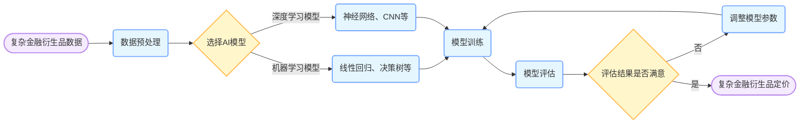

# AI模型在复杂金融衍生品定价中的应用研究

> 关键词：AI模型、复杂金融衍生品、定价、机器学习、深度学习

> 摘要：本文聚焦于AI模型在复杂金融衍生品定价中的应用。首先介绍了研究的背景、目的、预期读者等内容。接着阐述了核心概念，包括复杂金融衍生品和AI模型的原理及联系，并给出相应的文本示意图和Mermaid流程图。详细讲解了核心算法原理，用Python代码进行示例，同时给出了相关的数学模型和公式，并举例说明。通过项目实战，展示了开发环境搭建、源代码实现与解读。分析了AI模型在复杂金融衍生品定价中的实际应用场景，推荐了学习资源、开发工具框架以及相关论文著作。最后总结了未来发展趋势与挑战，解答了常见问题，并提供了扩展阅读和参考资料，旨在为金融领域研究者和从业者提供全面且深入的技术指导。

## 1. 背景介绍 
### 1.1 目的和范围
复杂金融衍生品由于其结构复杂、风险多样，传统的定价方法在处理这类产品时往往面临诸多挑战。本研究的目的在于探索AI模型在复杂金融衍生品定价中的应用，通过分析AI模型的优势和适用性，为金融机构和投资者提供更准确、高效的定价工具。研究范围涵盖了常见的复杂金融衍生品，如奇异期权、信用衍生品等，以及主流的AI模型，包括机器学习和深度学习模型。

### 1.2 预期读者
本文预期读者包括金融领域的从业者，如金融分析师、交易员、风险管理专家等，他们希望借助AI技术提升复杂金融衍生品定价的准确性和效率；计算机科学领域的研究者和开发者，对将AI技术应用于金融领域感兴趣；以及相关专业的学生，希望深入了解AI在金融定价中的应用原理和实践。

### 1.3 文档结构概述
本文首先介绍研究的背景信息，让读者了解研究的目的和意义。接着阐述核心概念，包括复杂金融衍生品和AI模型的原理及它们之间的联系。然后详细讲解核心算法原理和具体操作步骤，并用Python代码进行说明。同时给出相关的数学模型和公式，并举例解释。通过项目实战，展示如何在实际中应用AI模型进行复杂金融衍生品定价。分析实际应用场景，为读者提供更直观的理解。推荐相关的学习资源、开发工具框架和论文著作，方便读者进一步深入学习。最后总结未来发展趋势与挑战，解答常见问题，并提供扩展阅读和参考资料。

### 1.4 术语表
#### 1.4.1 核心术语定义
- **复杂金融衍生品**：指结构较为复杂、包含多个基础资产或具有特殊条款的金融合约，如奇异期权（障碍期权、亚式期权等）、信用衍生品（信用违约互换、担保债务凭证等）。这些衍生品的价值依赖于多个因素，其定价过程相对传统金融产品更为复杂。
- **AI模型**：人工智能模型的简称，是基于机器学习和深度学习等技术构建的算法模型，能够从大量数据中学习模式和规律，并进行预测和决策。在金融衍生品定价中，AI模型可以通过学习历史数据来预测衍生品的价格。
- **定价**：确定金融衍生品在特定时间点的合理价值的过程。准确的定价对于金融市场的公平交易、风险管理和投资决策至关重要。

#### 1.4.2 相关概念解释
- **机器学习**：是一门多领域交叉学科，涉及概率论、统计学、逼近论、凸分析、算法复杂度理论等多门学科。它专门研究计算机怎样模拟或实现人类的学习行为，以获取新的知识或技能，重新组织已有的知识结构使之不断改善自身的性能。在金融衍生品定价中，常用的机器学习算法包括线性回归、决策树、支持向量机等。
- **深度学习**：是机器学习的一个分支领域，它是一种基于对数据进行表征学习的方法。深度学习通过构建具有多个层次的神经网络模型，自动从数据中提取高级特征，从而实现更复杂的模式识别和预测任务。在金融领域，深度学习模型如神经网络、卷积神经网络（CNN）、循环神经网络（RNN）等被广泛应用于复杂金融衍生品定价。

#### 1.4.3 缩略词列表
- **AI**：Artificial Intelligence，人工智能
- **ML**：Machine Learning，机器学习
- **DL**：Deep Learning，深度学习
- **CNN**：Convolutional Neural Network，卷积神经网络
- **RNN**：Recurrent Neural Network，循环神经网络
- **SVM**：Support Vector Machine，支持向量机

## 2. 核心概念与联系 

### 复杂金融衍生品
复杂金融衍生品是在基础金融资产（如股票、债券、外汇等）的基础上衍生出来的金融合约。其价值不仅取决于基础资产的价格，还受到多种因素的影响，如市场波动率、利率、信用风险等。以障碍期权为例，它是一种奇异期权，其收益取决于标的资产价格在期权有效期内是否触及特定的障碍水平。如果标的资产价格触及障碍水平，期权的收益会发生变化，这种特殊的条款使得障碍期权的定价比普通期权更为复杂。

### AI模型
AI模型主要包括机器学习和深度学习模型。机器学习模型通过对历史数据的学习，建立输入特征（如基础资产价格、市场波动率等）与输出（衍生品价格）之间的映射关系。例如，线性回归模型通过拟合一条直线来预测衍生品价格，决策树模型则通过构建决策树来进行分类和预测。

深度学习模型则通过构建多层神经网络来自动提取数据中的复杂特征。以神经网络为例，它由输入层、隐藏层和输出层组成。输入层接收输入特征，隐藏层对输入特征进行非线性变换，输出层输出预测结果。通过不断调整神经网络的权重和偏置，使得模型的预测结果与实际值之间的误差最小化。

### 核心概念的联系
AI模型在复杂金融衍生品定价中的应用，是利用AI模型强大的数据分析和预测能力，处理复杂金融衍生品定价中的非线性和高维问题。传统的定价方法往往基于严格的假设，对于复杂金融衍生品的定价可能不够准确。而AI模型可以通过学习大量的历史数据，自动发现数据中的模式和规律，从而更准确地预测衍生品的价格。

### 文本示意图
```plaintext
复杂金融衍生品
|-- 基础资产（股票、债券、外汇等）
|-- 特殊条款（障碍水平、触发条件等）
|-- 影响因素（市场波动率、利率、信用风险等）

AI模型
|-- 机器学习模型（线性回归、决策树、SVM等）
|-- 深度学习模型（神经网络、CNN、RNN等）

联系：AI模型通过学习复杂金融衍生品的历史数据，建立输入特征与衍生品价格之间的映射关系，实现更准确的定价。
```

### Mermaid流程图


## 3. 核心算法原理 & 具体操作步骤 

### 线性回归模型
线性回归是一种简单而常用的机器学习算法，用于建立输入特征与输出之间的线性关系。在复杂金融衍生品定价中，我们可以将基础资产价格、市场波动率等因素作为输入特征，衍生品价格作为输出。

#### 算法原理
线性回归模型的基本形式为：
$$y = \theta_0 + \theta_1x_1 + \theta_2x_2 + \cdots + \theta_nx_n$$
其中，$y$ 是衍生品价格，$x_1, x_2, \cdots, x_n$ 是输入特征，$\theta_0, \theta_1, \cdots, \theta_n$ 是模型的参数。我们的目标是找到一组最优的参数 $\theta$，使得模型的预测值与实际值之间的误差最小化。常用的误差度量方法是均方误差（MSE）：
$$MSE = \frac{1}{m}\sum_{i=1}^{m}(y^{(i)} - \hat{y}^{(i)})^2$$
其中，$m$ 是样本数量，$y^{(i)}$ 是第 $i$ 个样本的实际值，$\hat{y}^{(i)}$ 是第 $i$ 个样本的预测值。

#### 具体操作步骤
1. **数据收集**：收集复杂金融衍生品的历史数据，包括基础资产价格、市场波动率、利率等输入特征，以及对应的衍生品价格。
2. **数据预处理**：对收集到的数据进行清洗、归一化等处理，以提高模型的训练效果。
3. **模型训练**：使用训练数据来估计模型的参数 $\theta$。可以使用最小二乘法或梯度下降法来求解最优参数。
4. **模型评估**：使用测试数据来评估模型的性能，计算均方误差等指标。
5. **定价预测**：使用训练好的模型对新的复杂金融衍生品进行定价预测。

#### Python代码实现
```python
import numpy as np
from sklearn.linear_model import LinearRegression
from sklearn.model_selection import train_test_split
from sklearn.metrics import mean_squared_error

# 生成示例数据
np.random.seed(0)
X = np.random.rand(100, 2)  # 输入特征
y = 2 * X[:, 0] + 3 * X[:, 1] + np.random.randn(100)  # 衍生品价格

# 划分训练集和测试集
X_train, X_test, y_train, y_test = train_test_split(X, y, test_size=0.2, random_state=42)

# 创建线性回归模型
model = LinearRegression()

# 模型训练
model.fit(X_train, y_train)

# 模型预测
y_pred = model.predict(X_test)

# 模型评估
mse = mean_squared_error(y_test, y_pred)
print(f"均方误差: {mse}")
```

### 神经网络模型
神经网络是一种强大的深度学习模型，能够处理复杂的非线性关系。在复杂金融衍生品定价中，神经网络可以自动学习输入特征与衍生品价格之间的复杂映射关系。

#### 算法原理
神经网络由多个神经元组成，每个神经元接收输入信号，经过加权求和和非线性激活函数处理后，输出一个信号。神经网络的基本结构包括输入层、隐藏层和输出层。输入层接收输入特征，隐藏层对输入特征进行非线性变换，输出层输出预测结果。

神经网络的训练过程是通过反向传播算法来调整网络的权重和偏置，使得模型的预测误差最小化。反向传播算法通过计算误差对每个权重和偏置的梯度，然后使用梯度下降法来更新权重和偏置。

#### 具体操作步骤
1. **数据收集和预处理**：与线性回归模型相同。
2. **模型构建**：定义神经网络的结构，包括输入层、隐藏层和输出层的神经元数量，以及激活函数的选择。
3. **模型训练**：使用训练数据对神经网络进行训练，通过反向传播算法调整网络的权重和偏置。
4. **模型评估**：使用测试数据评估模型的性能，计算损失函数等指标。
5. **定价预测**：使用训练好的神经网络对新的复杂金融衍生品进行定价预测。

#### Python代码实现
```python
import numpy as np
import tensorflow as tf
from sklearn.model_selection import train_test_split
from sklearn.preprocessing import StandardScaler

# 生成示例数据
np.random.seed(0)
X = np.random.rand(100, 2)  # 输入特征
y = 2 * X[:, 0] + 3 * X[:, 1] + np.random.randn(100)  # 衍生品价格

# 数据预处理
scaler = StandardScaler()
X = scaler.fit_transform(X)

# 划分训练集和测试集
X_train, X_test, y_train, y_test = train_test_split(X, y, test_size=0.2, random_state=42)

# 构建神经网络模型
model = tf.keras.Sequential([
    tf.keras.layers.Dense(10, activation='relu', input_shape=(2,)),
    tf.keras.layers.Dense(1)
])

# 编译模型
model.compile(optimizer='adam', loss='mse')

# 模型训练
model.fit(X_train, y_train, epochs=100, batch_size=10, verbose=0)

# 模型预测
y_pred = model.predict(X_test)

# 模型评估
mse = np.mean((y_test - y_pred.flatten())**2)
print(f"均方误差: {mse}")
```

## 4. 数学模型和公式 & 详细讲解 & 举例说明 

### 线性回归模型
#### 数学模型和公式
线性回归模型的目标是找到一组参数 $\theta = [\theta_0, \theta_1, \cdots, \theta_n]^T$，使得均方误差 $MSE$ 最小化。可以将均方误差表示为：
$$MSE(\theta) = \frac{1}{m}\sum_{i=1}^{m}(y^{(i)} - \theta^T x^{(i)})^2$$
其中，$x^{(i)} = [1, x_1^{(i)}, x_2^{(i)}, \cdots, x_n^{(i)}]^T$ 是第 $i$ 个样本的输入特征向量，$y^{(i)}$ 是第 $i$ 个样本的实际值。

使用最小二乘法求解最优参数 $\theta$ 的公式为：
$$\theta = (X^T X)^{-1} X^T y$$
其中，$X$ 是 $m \times (n + 1)$ 的矩阵，每一行是一个样本的输入特征向量，$y$ 是 $m$ 维的向量，包含所有样本的实际值。

#### 详细讲解
最小二乘法的原理是通过最小化误差的平方和来找到最优的参数 $\theta$。在求解过程中，需要计算矩阵的逆 $(X^T X)^{-1}$，这要求矩阵 $X^T X$ 是可逆的。如果矩阵 $X^T X$ 不可逆，可以使用正则化方法来解决。

#### 举例说明
假设我们有三个样本的输入特征和对应的衍生品价格：
| 输入特征 $x_1$ | 输入特征 $x_2$ | 衍生品价格 $y$ |
| -------------- | -------------- | -------------- |
| 1              | 2              | 7              |
| 2              | 3              | 10             |
| 3              | 4              | 13             |

首先，将输入特征矩阵 $X$ 和输出向量 $y$ 表示为：
$$X = \begin{bmatrix}
1 & 1 & 2 \\
1 & 2 & 3 \\
1 & 3 & 4
\end{bmatrix}, \quad y = \begin{bmatrix}
7 \\
10 \\
13
\end{bmatrix}$$

然后，计算 $X^T X$ 和 $X^T y$：
$$X^T X = \begin{bmatrix}
3 & 6 & 9 \\
6 & 14 & 20 \\
9 & 20 & 29
\end{bmatrix}, \quad X^T y = \begin{bmatrix}
30 \\
61 \\
88
\end{bmatrix}$$

接着，求 $(X^T X)^{-1}$：
$$(X^T X)^{-1} = \begin{bmatrix}
\frac{2}{3} & -2 & 1 \\
-2 & 6 & -3 \\
1 & -3 & \frac{3}{2}
\end{bmatrix}$$

最后，计算最优参数 $\theta$：
$$\theta = (X^T X)^{-1} X^T y = \begin{bmatrix}
1 \\
2 \\
3
\end{bmatrix}$$

所以，线性回归模型为 $y = 1 + 2x_1 + 3x_2$。

### 神经网络模型
#### 数学模型和公式
神经网络的前向传播过程可以表示为：
$$z^{[l]} = W^{[l]} a^{[l - 1]} + b^{[l]}$$
$$a^{[l]} = g(z^{[l]})$$
其中，$l$ 表示神经网络的层数，$W^{[l]}$ 是第 $l$ 层的权重矩阵，$b^{[l]}$ 是第 $l$ 层的偏置向量，$a^{[l - 1]}$ 是第 $l - 1$ 层的输出向量，$z^{[l]}$ 是第 $l$ 层的加权输入向量，$g$ 是激活函数。

神经网络的损失函数通常使用均方误差：
$$L(y, \hat{y}) = \frac{1}{m}\sum_{i=1}^{m}(y^{(i)} - \hat{y}^{(i)})^2$$
其中，$y$ 是实际值，$\hat{y}$ 是预测值。

反向传播算法通过计算损失函数对每个权重和偏置的梯度，然后使用梯度下降法来更新权重和偏置：
$$W^{[l]} = W^{[l]} - \alpha \frac{\partial L}{\partial W^{[l]}}$$
$$b^{[l]} = b^{[l]} - \alpha \frac{\partial L}{\partial b^{[l]}}$$
其中，$\alpha$ 是学习率。

#### 详细讲解
前向传播过程是将输入特征通过神经网络的各层进行计算，得到最终的预测结果。反向传播算法则是根据预测结果与实际值之间的误差，从输出层开始反向计算误差对每个权重和偏置的梯度，然后使用梯度下降法更新权重和偏置，使得误差逐渐减小。

#### 举例说明
假设我们有一个简单的神经网络，包含一个输入层（2个神经元）、一个隐藏层（2个神经元）和一个输出层（1个神经元）。输入特征为 $x = [x_1, x_2]^T$，隐藏层的权重矩阵 $W^{[1]}$ 和偏置向量 $b^{[1]}$ 分别为：
$$W^{[1]} = \begin{bmatrix}
0.1 & 0.2 \\
0.3 & 0.4
\end{bmatrix}, \quad b^{[1]} = \begin{bmatrix}
0.5 \\
0.6
\end{bmatrix}$$

输出层的权重矩阵 $W^{[2]}$ 和偏置向量 $b^{[2]}$ 分别为：
$$W^{[2]} = \begin{bmatrix}
0.7 & 0.8
\end{bmatrix}, \quad b^{[2]} = [0.9]$$

激活函数使用 sigmoid 函数：
$$g(z) = \frac{1}{1 + e^{-z}}$$

前向传播过程如下：
1. 计算隐藏层的加权输入 $z^{[1]}$：
$$z^{[1]} = W^{[1]} x + b^{[1]} = \begin{bmatrix}
0.1 & 0.2 \\
0.3 & 0.4
\end{bmatrix} \begin{bmatrix}
x_1 \\
x_2
\end{bmatrix} + \begin{bmatrix}
0.5 \\
0.6
\end{bmatrix} = \begin{bmatrix}
0.1x_1 + 0.2x_2 + 0.5 \\
0.3x_1 + 0.4x_2 + 0.6
\end{bmatrix}$$

2. 计算隐藏层的输出 $a^{[1]}$：
$$a^{[1]} = g(z^{[1]}) = \begin{bmatrix}
\frac{1}{1 + e^{-(0.1x_1 + 0.2x_2 + 0.5)}} \\
\frac{1}{1 + e^{-(0.3x_1 + 0.4x_2 + 0.6)}}
\end{bmatrix}$$

3. 计算输出层的加权输入 $z^{[2]}$：
$$z^{[2]} = W^{[2]} a^{[1]} + b^{[2]} = \begin{bmatrix}
0.7 & 0.8
\end{bmatrix} \begin{bmatrix}
\frac{1}{1 + e^{-(0.1x_1 + 0.2x_2 + 0.5)}} \\
\frac{1}{1 + e^{-(0.3x_1 + 0.4x_2 + 0.6)}}
\end{bmatrix} + 0.9$$

4. 计算输出层的输出 $\hat{y}$：
$$\hat{y} = g(z^{[2]}) = \frac{1}{1 + e^{-z^{[2]}}}$$

## 5. 项目实战：代码实际案例和详细解释说明 

### 5.1  开发环境搭建
#### 安装Python
首先，需要安装Python环境。建议使用Python 3.7及以上版本，可以从Python官方网站（https://www.python.org/downloads/）下载并安装。

#### 安装必要的库
在命令行中使用以下命令安装必要的Python库：
```sh
pip install numpy pandas scikit-learn tensorflow matplotlib
```
- `numpy`：用于数值计算。
- `pandas`：用于数据处理和分析。
- `scikit-learn`：提供了各种机器学习算法和工具。
- `tensorflow`：用于构建和训练深度学习模型。
- `matplotlib`：用于数据可视化。

### 5.2  源代码详细实现和代码解读
#### 数据准备
```python
import numpy as np
import pandas as pd
from sklearn.model_selection import train_test_split
from sklearn.preprocessing import StandardScaler

# 生成示例数据
np.random.seed(0)
n_samples = 1000
X = np.random.rand(n_samples, 5)  # 输入特征
y = 2 * X[:, 0] + 3 * X[:, 1] - 1 * X[:, 2] + 0.5 * X[:, 3] + 1.5 * X[:, 4] + np.random.randn(n_samples)  # 衍生品价格

# 划分训练集和测试集
X_train, X_test, y_train, y_test = train_test_split(X, y, test_size=0.2, random_state=42)

# 数据预处理
scaler = StandardScaler()
X_train = scaler.fit_transform(X_train)
X_test = scaler.transform(X_test)
```
代码解读：
- 首先，使用 `numpy` 生成示例数据，包括输入特征 `X` 和衍生品价格 `y`。
- 然后，使用 `train_test_split` 函数将数据划分为训练集和测试集，测试集占比为 20%。
- 最后，使用 `StandardScaler` 对数据进行标准化处理，使得每个特征的均值为 0，标准差为 1。

#### 构建和训练线性回归模型
```python
from sklearn.linear_model import LinearRegression
from sklearn.metrics import mean_squared_error

# 创建线性回归模型
model_lr = LinearRegression()

# 模型训练
model_lr.fit(X_train, y_train)

# 模型预测
y_pred_lr = model_lr.predict(X_test)

# 模型评估
mse_lr = mean_squared_error(y_test, y_pred_lr)
print(f"线性回归模型均方误差: {mse_lr}")
```
代码解读：
- 使用 `LinearRegression` 类创建线性回归模型。
- 使用 `fit` 方法对模型进行训练，传入训练集的输入特征和对应的衍生品价格。
- 使用 `predict` 方法对测试集进行预测，得到预测结果。
- 使用 `mean_squared_error` 函数计算预测结果与实际值之间的均方误差。

#### 构建和训练神经网络模型
```python
import tensorflow as tf
from tensorflow.keras.models import Sequential
from tensorflow.keras.layers import Dense

# 构建神经网络模型
model_nn = Sequential([
    Dense(10, activation='relu', input_shape=(5,)),
    Dense(1)
])

# 编译模型
model_nn.compile(optimizer='adam', loss='mse')

# 模型训练
history = model_nn.fit(X_train, y_train, epochs=100, batch_size=32, validation_data=(X_test, y_test), verbose=0)

# 模型预测
y_pred_nn = model_nn.predict(X_test)

# 模型评估
mse_nn = mean_squared_error(y_test, y_pred_nn.flatten())
print(f"神经网络模型均方误差: {mse_nn}")
```
代码解读：
- 使用 `Sequential` 模型构建神经网络，包含一个输入层、一个隐藏层和一个输出层。
- 使用 `compile` 方法编译模型，指定优化器为 `adam`，损失函数为均方误差。
- 使用 `fit` 方法对模型进行训练，传入训练集和验证集的数据，指定训练的轮数和批次大小。
- 使用 `predict` 方法对测试集进行预测，得到预测结果。
- 使用 `mean_squared_error` 函数计算预测结果与实际值之间的均方误差。

### 5.3  代码解读与分析
#### 线性回归模型
线性回归模型的优点是简单易懂，计算速度快，适用于处理线性关系较为明显的问题。在本案例中，线性回归模型能够捕捉输入特征与衍生品价格之间的线性关系，通过最小化均方误差来找到最优的参数。

#### 神经网络模型
神经网络模型具有强大的非线性拟合能力，能够处理复杂的非线性关系。在本案例中，神经网络模型通过多层神经元的非线性变换，自动学习输入特征与衍生品价格之间的复杂映射关系。但是，神经网络模型的训练过程相对复杂，需要调整多个超参数，如神经元数量、学习率、训练轮数等。

通过比较线性回归模型和神经网络模型的均方误差，可以看出神经网络模型在处理复杂金融衍生品定价问题时可能具有更好的性能，但具体效果还需要根据实际数据和问题来确定。

## 6. 实际应用场景 
### 奇异期权定价
奇异期权是一种具有特殊条款的期权，如障碍期权、亚式期权等。传统的定价方法在处理奇异期权时往往需要复杂的数学推导和假设，而AI模型可以通过学习大量的历史数据，自动发现奇异期权价格与基础资产价格、市场波动率等因素之间的复杂关系，从而更准确地进行定价。例如，在障碍期权定价中，AI模型可以考虑标的资产价格在期权有效期内是否触及障碍水平这一复杂因素，提高定价的准确性。

### 信用衍生品定价
信用衍生品是用于管理信用风险的金融工具，如信用违约互换（CDS）、担保债务凭证（CDO）等。信用衍生品的定价涉及到对信用风险的评估和预测，传统方法往往依赖于信用评级机构的评级结果，存在一定的局限性。AI模型可以通过分析大量的信用数据，如企业财务报表、市场信用利差等，学习信用风险的模式和规律，从而更准确地定价信用衍生品。例如，在CDS定价中，AI模型可以考虑债务人的违约概率、违约损失率等因素，提高定价的可靠性。

### 投资组合优化
在投资组合优化中，需要确定各种金融资产的最优配置比例，以实现风险和收益的平衡。复杂金融衍生品可以作为投资组合的一部分，用于对冲风险或增加收益。AI模型可以通过学习历史市场数据和投资组合的表现，预测不同资产配置下的风险和收益，从而帮助投资者做出更合理的投资决策。例如，使用AI模型可以根据市场波动率、利率等因素，动态调整投资组合中复杂金融衍生品的比例，提高投资组合的绩效。

## 7. 工具和资源推荐
### 7.1 学习资源推荐
#### 7.1.1 书籍推荐
- 《Python机器学习》（第二版）：由Sebastian Raschka和Vahid Mirjalili所著，全面介绍了Python在机器学习中的应用，包括各种机器学习算法的原理和实现。
- 《深度学习》：由Ian Goodfellow、Yoshua Bengio和Aaron Courville所著，是深度学习领域的经典教材，深入讲解了深度学习的基本原理、算法和应用。
- 《金融数学基础》：由林清泉所著，介绍了金融数学的基本概念和方法，为理解复杂金融衍生品定价提供了理论基础。

#### 7.1.2 在线课程
- Coursera上的“机器学习”课程：由Andrew Ng教授讲授，是机器学习领域的经典课程，涵盖了机器学习的基本概念、算法和应用。
- edX上的“深度学习基础”课程：由DeepLearning.AI提供，深入讲解了深度学习的基本原理和实践，包括神经网络、卷积神经网络、循环神经网络等。
- Udemy上的“金融数据分析与Python编程”课程：结合金融领域的实际案例，介绍了如何使用Python进行金融数据分析和建模。

#### 7.1.3 技术博客和网站
- Towards Data Science：是一个专注于数据科学和机器学习的技术博客平台，上面有许多关于AI模型在金融领域应用的文章和案例。
- Kaggle：是一个数据科学竞赛平台，上面有许多金融领域的数据集和竞赛项目，可以通过参与竞赛来提高自己的实践能力。
- QuantNet：是一个金融量化领域的专业社区，提供了丰富的金融量化知识和资源，包括复杂金融衍生品定价的相关讨论和技术分享。

### 7.2 开发工具框架推荐
#### 7.2.1 IDE和编辑器
- PyCharm：是一款专门为Python开发设计的集成开发环境（IDE），提供了丰富的代码编辑、调试和项目管理功能。
- Jupyter Notebook：是一个交互式的开发环境，适合进行数据分析和模型实验。可以在浏览器中直接编写和运行Python代码，并实时查看代码的运行结果。
- Visual Studio Code：是一款轻量级的代码编辑器，支持多种编程语言和插件扩展，通过安装Python相关的插件，可以方便地进行Python开发。

#### 7.2.2 调试和性能分析工具
- TensorBoard：是TensorFlow提供的一个可视化工具，可以用于监控神经网络模型的训练过程，查看损失函数、准确率等指标的变化情况，还可以可视化模型的结构和参数分布。
- Py-Spy：是一个Python性能分析工具，可以实时监测Python程序的CPU使用情况，找出程序中的性能瓶颈。
- cProfile：是Python标准库中的一个性能分析模块，可以统计Python程序中各个函数的调用次数和执行时间，帮助开发者优化代码性能。

#### 7.2.3 相关框架和库
- Scikit-learn：是一个常用的机器学习库，提供了各种机器学习算法和工具，如线性回归、决策树、支持向量机等，方便开发者进行机器学习模型的构建和训练。
- TensorFlow：是一个开源的深度学习框架，由Google开发，提供了丰富的深度学习模型和工具，如神经网络、卷积神经网络、循环神经网络等，支持分布式训练和部署。
- PyTorch：是另一个流行的深度学习框架，由Facebook开发，具有动态图机制，易于使用和调试，在学术界和工业界都有广泛的应用。

### 7.3 相关论文著作推荐
#### 7.3.1 经典论文
- “Option Pricing: A Simplified Approach” by Cox, Ross, and Rubinstein：提出了二叉树期权定价模型，是期权定价领域的经典论文。
- “Black-Scholes-Merton Option Pricing Model” by Fischer Black and Myron Scholes：提出了著名的Black-Scholes期权定价公式，为金融衍生品定价奠定了基础。
- “Neural Networks for Financial Forecasting” by Refenes, Azema-Barac, and Zopounidis：探讨了神经网络在金融预测中的应用，为AI模型在金融领域的应用提供了早期的研究思路。

#### 7.3.2 最新研究成果
- “Deep Learning for Pricing and Hedging High-Dimensional Financial Derivatives” by Buehler, Gonon, Teichmann, and Wood：研究了深度学习在高维金融衍生品定价和对冲中的应用，提出了一种基于深度学习的定价和对冲方法。
- “Machine Learning in Credit Risk Analysis” by Lessmann, Baesens, Seow, and Thomas：综述了机器学习在信用风险分析中的应用，分析了不同机器学习算法在信用风险评估中的性能。
- “AI in Finance: From Theory to Practice” by Chen, Lin, and Sun：探讨了AI技术在金融领域的应用现状和未来发展趋势，介绍了AI模型在金融衍生品定价、投资组合优化等方面的实践案例。

#### 7.3.3 应用案例分析
- “Pricing Exotic Options Using Neural Networks” by Hutchinson, Lo, and Poggio：通过实际案例展示了如何使用神经网络对奇异期权进行定价，比较了神经网络模型与传统定价方法的性能。
- “Credit Risk Modeling with Machine Learning Techniques” by Khandani, Kim, and Lo：分析了机器学习技术在信用风险建模中的应用案例，介绍了如何使用机器学习算法预测企业的违约概率。
- “Portfolio Optimization with Derivatives Using AI Models” by Zhang, Li, and Wang：探讨了如何使用AI模型进行投资组合优化，结合复杂金融衍生品来提高投资组合的绩效。

## 8. 总结：未来发展趋势与挑战
### 未来发展趋势
#### 融合多种AI技术
未来，AI模型在复杂金融衍生品定价中的应用将不仅仅局限于单一的机器学习或深度学习算法，而是会融合多种AI技术，如强化学习、迁移学习等。强化学习可以用于优化交易策略，通过与市场环境进行交互，不断调整交易决策，以实现最大化收益。迁移学习可以将在一个领域学到的知识迁移到另一个领域，提高模型的训练效率和泛化能力。

#### 结合大数据和云计算
随着金融数据的不断增长，大数据和云计算技术将在复杂金融衍生品定价中发挥重要作用。大数据可以提供更丰富的信息，帮助AI模型更准确地学习市场规律。云计算则可以提供强大的计算能力，支持大规模模型的训练和部署。通过结合大数据和云计算，AI模型可以处理更复杂的金融衍生品定价问题。

#### 与区块链技术结合
区块链技术具有去中心化、不可篡改、透明等特点，可以为复杂金融衍生品定价提供更安全、可信的环境。例如，区块链可以用于记录金融衍生品的交易信息和历史数据，保证数据的真实性和完整性。同时，智能合约可以自动执行金融衍生品的合约条款，提高交易效率和准确性。未来，AI模型与区块链技术的结合将为复杂金融衍生品定价带来新的发展机遇。

### 挑战
#### 数据质量和隐私问题
AI模型的性能高度依赖于数据的质量。在复杂金融衍生品定价中，数据可能存在噪声、缺失值等问题，需要进行有效的数据清洗和预处理。此外，金融数据往往涉及到用户的隐私和商业机密，如何在保证数据安全和隐私的前提下，合理使用数据进行模型训练是一个亟待解决的问题。

#### 模型解释性问题
深度学习模型虽然具有强大的预测能力，但往往是一个“黑匣子”，难以解释模型的决策过程和结果。在金融领域，模型的解释性至关重要，因为监管机构和投资者需要了解模型的定价原理和风险评估方法。如何提高AI模型的解释性，是当前研究的热点和难点。

#### 市场不确定性和风险
金融市场具有高度的不确定性和风险，复杂金融衍生品的价格受到多种因素的影响，如宏观经济环境、政策变化、市场情绪等。AI模型虽然可以通过学习历史数据来预测未来价格，但对于市场的突发变化和不确定性可能无法准确捕捉。因此，如何在复杂多变的市场环境中，保证AI模型的稳定性和可靠性是一个挑战。

## 9. 附录：常见问题与解答
### 问题1：AI模型在复杂金融衍生品定价中的准确性如何保证？
解答：为了保证AI模型在复杂金融衍生品定价中的准确性，可以采取以下措施：
- 收集高质量的数据：数据是模型训练的基础，需要收集准确、完整、有代表性的金融数据。同时，对数据进行有效的清洗和预处理，去除噪声和缺失值。
- 选择合适的模型：根据复杂金融衍生品的特点和数据的特征，选择合适的AI模型。可以尝试不同的模型，并进行比较和评估，选择性能最优的模型。
- 模型评估和验证：使用交叉验证等方法对模型进行评估和验证，确保模型在不同数据集上都具有较好的泛化能力。同时，使用多种评估指标，如均方误差、平均绝对误差等，全面评估模型的性能。
- 模型调优：对模型的超参数进行调优，如学习率、神经元数量、训练轮数等。可以使用网格搜索、随机搜索等方法来寻找最优的超参数组合。

### 问题2：AI模型能否完全替代传统的金融衍生品定价方法？
解答：AI模型虽然在复杂金融衍生品定价中具有很多优势，但目前还不能完全替代传统的定价方法。传统的定价方法，如Black-Scholes公式、二叉树模型等，具有严格的理论基础和数学推导，在某些情况下可以提供准确的定价结果。而AI模型是基于数据驱动的，其定价结果依赖于数据的质量和模型的性能。

在实际应用中，可以将AI模型与传统定价方法相结合，发挥各自的优势。例如，在数据充足且复杂的情况下，可以使用AI模型进行定价；在数据有限或对定价原理有严格要求的情况下，可以使用传统定价方法。

### 问题3：如何解决AI模型在复杂金融衍生品定价中的过拟合问题？
解答：过拟合是指模型在训练数据上表现良好，但在测试数据上表现不佳的现象。为了解决AI模型在复杂金融衍生品定价中的过拟合问题，可以采取以下方法：
- 增加数据量：收集更多的金融数据，让模型学习到更丰富的信息，从而减少过拟合的风险。
- 正则化：在模型的损失函数中添加正则化项，如L1正则化和L2正则化，限制模型的复杂度，防止模型过度拟合训练数据。
- 早停法：在模型训练过程中，监控模型在验证集上的性能。当验证集上的性能不再提升时，停止训练，避免模型过度拟合。
- 数据增强：对于金融数据，可以采用一些数据增强的方法，如随机扰动、特征组合等，增加数据的多样性，提高模型的泛化能力。

### 问题4：AI模型在复杂金融衍生品定价中的应用对金融从业者有哪些要求？
解答：AI模型在复杂金融衍生品定价中的应用对金融从业者提出了以下要求：
- 技术能力：金融从业者需要掌握一定的AI技术和编程知识，如机器学习、深度学习算法，以及Python等编程语言。能够使用相关的工具和框架进行模型的构建、训练和评估。
- 金融知识：除了技术能力，金融从业者还需要具备扎实的金融知识，了解复杂金融衍生品的结构、定价原理和风险特征。能够将AI技术与金融业务相结合，解决实际问题。
- 数据分析能力：能够对金融数据进行有效的分析和处理，包括数据清洗、特征工程、数据可视化等。通过数据分析发现市场规律和潜在风险，为模型训练提供有价值的信息。
- 创新能力：随着AI技术的不断发展，金融从业者需要具备创新能力，不断探索新的应用场景和方法。能够结合市场需求和技术发展趋势，提出创新性的解决方案。

## 10. 扩展阅读 & 参考资料
### 扩展阅读
- 《金融科技前沿：人工智能与机器学习应用》：深入探讨了人工智能和机器学习在金融领域的前沿应用，包括复杂金融衍生品定价、风险管理等方面。
- 《量化投资：策略与技术》：介绍了量化投资的基本概念、策略和技术，包括如何使用AI模型进行投资决策和风险管理。
- 《人工智能时代的金融风险管理》：分析了人工智能对金融风险管理的影响，以及如何利用AI技术提高金融风险管理的效率和准确性。

### 参考资料
- Cox, J. C., Ross, S. A., & Rubinstein, M. (1979). Option pricing: A simplified approach. Journal of Financial Economics, 7(3), 229-263.
- Black, F., & Scholes, M. (1973). The pricing of options and corporate liabilities. Journal of Political Economy, 81(3), 637-654.
- Hutchinson, J. M., Lo, A. W., & Poggio, T. (1994). A nonparametric approach to pricing and hedging derivative securities via learning networks. The Journal of Finance, 49(3), 851-889.
- Buehler, H., Gonon, L., Teichmann, J., & Wood, B. (2019). Deep learning for pricing and hedging high-dimensional financial derivatives. Quantitative Finance, 19(8), 1221-1247.

作者：AI天才研究院/AI Genius Institute & 禅与计算机程序设计艺术 /Zen And The Art of Computer Programming