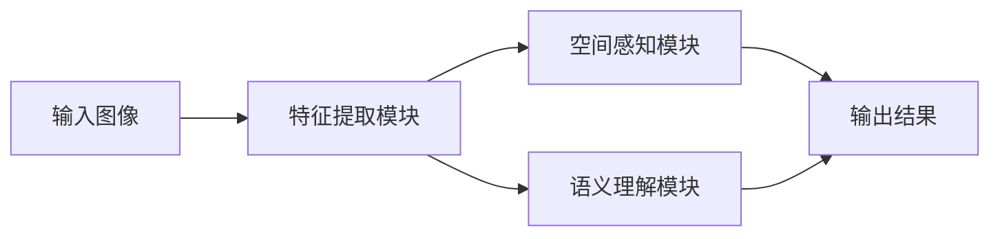

# AI模型在视觉空间问题上的潜在突破点

> 关键词：AI模型、视觉空间问题、潜在突破点、计算机视觉、深度学习

> 摘要：本文聚焦于AI模型在视觉空间问题上的潜在突破点。首先介绍了相关背景，包括研究目的、预期读者等内容。接着阐述了核心概念及联系，通过文本示意图和Mermaid流程图清晰展示。详细讲解了核心算法原理和具体操作步骤，结合Python源代码进行说明。深入探讨了数学模型和公式，并举例阐释。通过项目实战，从开发环境搭建到源代码实现与解读进行了全面分析。列举了实际应用场景，推荐了学习资源、开发工具框架和相关论文著作。最后总结了未来发展趋势与挑战，还包含常见问题解答和扩展阅读参考资料，旨在为相关领域研究者和开发者提供全面的技术洞察。

## 1. 背景介绍 
### 1.1 目的和范围
随着人工智能技术的飞速发展，AI模型在各个领域都取得了显著的成果，特别是在计算机视觉领域。然而，视觉空间问题仍然是一个具有挑战性的研究方向。本文的目的在于深入探讨AI模型在视觉空间问题上可能的突破点，涵盖从基础概念到实际应用的多个层面。研究范围包括但不限于常见的视觉空间任务，如目标检测、语义分割、三维重建等，以及相关的算法、数学模型和实际案例。

### 1.2 预期读者
本文预期读者主要包括计算机视觉领域的研究者、AI模型开发者、相关专业的学生以及对AI在视觉空间应用感兴趣的技术爱好者。对于有一定编程基础和机器学习知识的读者，将能更好地理解文中的技术细节和代码实现。

### 1.3 文档结构概述
本文将按照以下结构展开：首先介绍核心概念与联系，为后续的内容奠定基础；接着详细讲解核心算法原理和具体操作步骤，结合Python代码进行说明；然后深入探讨数学模型和公式，并通过实例进行解释；通过项目实战展示如何将理论应用到实际中；列举实际应用场景，体现研究的实用性；推荐相关的学习资源、开发工具框架和论文著作；最后总结未来发展趋势与挑战，并提供常见问题解答和扩展阅读参考资料。

### 1.4 术语表
#### 1.4.1 核心术语定义
- **AI模型**：人工智能模型，是基于一定算法和数据构建的用于解决特定问题的计算模型，如深度学习中的卷积神经网络（CNN）、循环神经网络（RNN）等。
- **视觉空间问题**：涉及对图像或视频中的物体在三维空间中的位置、姿态、形状等信息进行感知、理解和处理的问题。
- **目标检测**：在图像或视频中识别出特定目标的位置和类别。
- **语义分割**：将图像中的每个像素分配到不同的语义类别中。
- **三维重建**：从二维图像或视频中恢复出物体的三维结构。

#### 1.4.2 相关概念解释
- **卷积神经网络（CNN）**：一种专门用于处理具有网格结构数据（如图像）的深度学习模型，通过卷积层、池化层和全连接层等组件提取图像特征。
- **注意力机制**：一种模拟人类视觉注意力的机制，能够自动关注图像中的重要区域，提高模型的性能。
- **生成对抗网络（GAN）**：由生成器和判别器组成的深度学习模型，用于生成逼真的图像或数据。

#### 1.4.3 缩略词列表
- **CNN**：Convolutional Neural Network（卷积神经网络）
- **RNN**：Recurrent Neural Network（循环神经网络）
- **GAN**：Generative Adversarial Network（生成对抗网络）
- **SSD**：Single Shot MultiBox Detector（单阶段多框检测器）
- **Faster R - CNN**：Faster Region - based Convolutional Neural Network（基于区域的快速卷积神经网络）

## 2. 核心概念与联系 
### 核心概念原理
在处理视觉空间问题时，AI模型的核心目标是从二维图像或视频数据中提取出与三维空间相关的信息。这涉及到多个核心概念，下面分别进行介绍。

#### 图像特征提取
图像特征提取是计算机视觉的基础，通过卷积神经网络（CNN）可以自动学习图像中的特征。CNN的卷积层使用卷积核在图像上滑动，提取不同尺度和方向的特征。例如，在早期的卷积层中，卷积核可能会提取边缘、角点等简单特征，而在较深的卷积层中，特征会变得更加抽象，能够表示物体的整体形状和结构。

#### 空间感知
空间感知是指模型能够理解图像中物体的空间位置和关系。这可以通过多种方式实现，如使用锚框机制在目标检测中预测物体的边界框，或者通过深度估计技术获取物体的深度信息，从而构建三维空间模型。

#### 语义理解
语义理解是将图像中的像素或区域与具体的语义类别相关联。语义分割任务就是典型的语义理解问题，通过对每个像素进行分类，将图像划分为不同的语义区域，如人、车、建筑物等。

### 架构的文本示意图
以下是一个简化的AI模型处理视觉空间问题的架构示意图：

输入图像 -> 特征提取模块（CNN） -> 空间感知模块（锚框机制、深度估计等） -> 语义理解模块（分类器） -> 输出结果（目标检测框、语义分割图、三维重建模型等）

### Mermaid流程图


## 3. 核心算法原理 & 具体操作步骤 
### 目标检测算法原理
目标检测是视觉空间问题中的一个重要任务，这里以Faster R - CNN为例介绍其核心算法原理。

Faster R - CNN主要由两个部分组成：区域提议网络（RPN）和Fast R - CNN。RPN负责生成可能包含目标的候选区域，Fast R - CNN则在这些候选区域上进行分类和边界框回归。

#### 区域提议网络（RPN）
RPN的输入是CNN提取的特征图，它通过一个小型的卷积网络在特征图上滑动，为每个位置生成多个不同尺度和宽高比的锚框。对于每个锚框，RPN会预测其是否包含目标（二分类问题）以及边界框的偏移量（回归问题）。

#### Fast R - CNN
Fast R - CNN接收RPN生成的候选区域，通过RoI Pooling层将不同大小的候选区域池化为固定大小的特征图，然后使用全连接层进行分类和边界框回归，最终输出目标的类别和精确的边界框。

### Python源代码实现
```python
import torch
import torchvision
from torchvision.models.detection import fasterrcnn_resnet50_fpn
from torchvision.transforms import functional as F

# 加载预训练的Faster R - CNN模型
model = fasterrcnn_resnet50_fpn(pretrained=True)
model.eval()

# 加载图像
image = torchvision.io.read_image('test_image.jpg').float()
image = F.normalize(image, mean=[0.485, 0.456, 0.406], std=[0.229, 0.224, 0.225])
image = image.unsqueeze(0)

# 进行目标检测
with torch.no_grad():
    predictions = model(image)

# 输出检测结果
boxes = predictions[0]['boxes']
labels = predictions[0]['labels']
scores = predictions[0]['scores']

for box, label, score in zip(boxes, labels, scores):
    if score > 0.5:
        print(f'Label: {label}, Score: {score}, Box: {box}')
```

### 具体操作步骤
1. **模型加载**：使用`torchvision`库加载预训练的Faster R - CNN模型，并将其设置为评估模式。
2. **图像预处理**：读取图像并进行归一化处理，然后添加一个维度以匹配模型的输入要求。
3. **目标检测**：使用`model`对预处理后的图像进行推理，得到预测结果。
4. **结果筛选**：根据置信度阈值筛选出置信度较高的检测结果，并输出目标的类别、置信度和边界框信息。

## 4. 数学模型和公式 & 详细讲解 & 举例说明 
### 目标检测中的损失函数
在目标检测中，常用的损失函数由分类损失和回归损失组成。以Faster R - CNN为例，其损失函数可以表示为：

$$L(p, t) = L_{cls}(p, p^*) + \lambda [p^* > 0] L_{reg}(t, t^*)$$

其中，$p$ 是预测的类别概率，$p^*$ 是真实的类别标签，$t$ 是预测的边界框偏移量，$t^*$ 是真实的边界框偏移量，$\lambda$ 是平衡分类损失和回归损失的权重系数，$[p^* > 0]$ 是一个指示函数，当 $p^* > 0$ 时取值为1，否则取值为0。

#### 分类损失 $L_{cls}$
分类损失通常使用交叉熵损失函数，其公式为：

$$L_{cls}(p, p^*) = - \sum_{i=1}^{C} p_i^* \log(p_i)$$

其中，$C$ 是类别数，$p_i$ 是预测的第 $i$ 类的概率，$p_i^*$ 是真实的第 $i$ 类的标签。

#### 回归损失 $L_{reg}$
回归损失通常使用Smooth L1损失函数，其公式为：

$$Smooth L_1(x) = \begin{cases}
0.5x^2, & \text{if } |x| < 1 \\
|x| - 0.5, & \text{otherwise}
\end{cases}$$

回归损失计算预测的边界框偏移量 $t$ 和真实的边界框偏移量 $t^*$ 之间的差异，即：

$$L_{reg}(t, t^*) = Smooth L_1(t - t^*)$$

### 举例说明
假设我们有一个二分类目标检测问题，真实标签 $p^* = [1, 0]$，预测概率 $p = [0.8, 0.2]$，预测的边界框偏移量 $t = [0.1, 0.2, 0.3, 0.4]$，真实的边界框偏移量 $t^* = [0.15, 0.25, 0.35, 0.45]$。

#### 分类损失计算
$$L_{cls}(p, p^*) = - (1 \times \log(0.8) + 0 \times \log(0.2)) \approx 0.223$$

#### 回归损失计算
首先计算 $t - t^* = [-0.05, -0.05, -0.05, -0.05]$，然后使用Smooth L1损失函数计算：

$$L_{reg}(t, t^*) = 4 \times 0.5 \times (-0.05)^2 = 0.005$$

假设 $\lambda = 1$，则总的损失函数为：

$$L(p, t) = L_{cls}(p, p^*) + \lambda [p^* > 0] L_{reg}(t, t^*) = 0.223 + 1 \times 1 \times 0.005 = 0.228$$

## 5. 项目实战：代码实际案例和详细解释说明 
### 5.1  开发环境搭建
#### 安装Python和相关库
首先需要安装Python 3.x版本，建议使用Anaconda来管理Python环境。然后使用以下命令安装所需的库：

```bash
pip install torch torchvision opencv-python
```

#### 下载数据集
可以使用公开的目标检测数据集，如COCO数据集。下载数据集后，将其解压到指定的目录。

### 5.2  源代码详细实现和代码解读
```python
import torch
import torchvision
from torchvision.models.detection import fasterrcnn_resnet50_fpn
from torchvision.transforms import functional as F
from torch.utils.data import DataLoader
from torchvision.datasets import CocoDetection
from torchvision.transforms import ToTensor

# 定义数据集和数据加载器
train_dataset = CocoDetection(root='path/to/coco/train2017', annFile='path/to/coco/annotations/instances_train2017.json', transform=ToTensor())
train_loader = DataLoader(train_dataset, batch_size=2, shuffle=True, num_workers=4)

# 加载预训练的Faster R - CNN模型
model = fasterrcnn_resnet50_fpn(pretrained=True)

# 定义优化器和学习率调度器
params = [p for p in model.parameters() if p.requires_grad]
optimizer = torch.optim.SGD(params, lr=0.005, momentum=0.9, weight_decay=0.0005)
lr_scheduler = torch.optim.lr_scheduler.StepLR(optimizer, step_size=3, gamma=0.1)

# 训练模型
num_epochs = 10
device = torch.device('cuda' if torch.cuda.is_available() else 'cpu')
model.to(device)

for epoch in range(num_epochs):
    model.train()
    for images, targets in train_loader:
        images = list(image.to(device) for image in images)
        targets = [{k: v.to(device) for k, v in t.items()} for t in targets]

        loss_dict = model(images, targets)
        losses = sum(loss for loss in loss_dict.values())

        optimizer.zero_grad()
        losses.backward()
        optimizer.step()

    lr_scheduler.step()
    print(f'Epoch {epoch + 1}/{num_epochs}, Loss: {losses.item()}')
```

### 5.3  代码解读与分析
#### 数据集和数据加载器
使用`CocoDetection`类加载COCO数据集，并使用`DataLoader`将数据集封装成可迭代的数据加载器，方便批量训练。

#### 模型加载
使用`fasterrcnn_resnet50_fpn`加载预训练的Faster R - CNN模型。

#### 优化器和学习率调度器
使用随机梯度下降（SGD）优化器和步长学习率调度器，根据训练的轮数调整学习率。

#### 训练过程
在每个训练轮次中，将模型设置为训练模式，遍历数据加载器中的每个批次。将图像和目标数据移动到指定的设备（GPU或CPU）上，然后将其输入到模型中计算损失。使用反向传播算法更新模型的参数，并根据学习率调度器调整学习率。

## 6. 实际应用场景 
### 自动驾驶
在自动驾驶领域，AI模型在视觉空间问题上的应用至关重要。通过目标检测技术，车辆可以识别道路上的其他车辆、行人、交通标志等目标，从而做出相应的决策。语义分割技术可以帮助车辆理解道路场景，区分车道、人行道、障碍物等区域。三维重建技术可以构建车辆周围的三维环境模型，为路径规划和避障提供更准确的信息。

### 安防监控
安防监控系统中，AI模型可以实时监测监控画面中的目标，进行目标检测和跟踪。通过分析目标的行为和运动轨迹，系统可以及时发现异常事件，如入侵、盗窃等，并发出警报。语义分割技术可以对监控画面进行背景和前景分离，提高目标检测的准确性。

### 虚拟现实和增强现实
在虚拟现实（VR）和增强现实（AR）应用中，AI模型可以实现对真实场景的三维重建和理解。通过对用户周围环境的感知，系统可以将虚拟物体与真实场景进行融合，提供更加逼真的交互体验。目标检测和语义分割技术可以帮助系统识别真实场景中的物体，为虚拟物体的放置和交互提供参考。

### 医疗影像分析
在医疗影像分析中，AI模型可以帮助医生对X光、CT、MRI等影像进行诊断。通过目标检测和语义分割技术，模型可以识别影像中的病变区域，如肿瘤、骨折等，并提供病变的位置、大小、形状等信息。三维重建技术可以将二维的医疗影像重建为三维模型，帮助医生更直观地观察病变的形态和周围组织的关系。

## 7. 工具和资源推荐
### 7.1 学习资源推荐
#### 7.1.1 书籍推荐
- 《深度学习》（Deep Learning）：由Ian Goodfellow、Yoshua Bengio和Aaron Courville合著，是深度学习领域的经典教材，涵盖了深度学习的基本原理、算法和应用。
- 《计算机视觉：算法与应用》（Computer Vision: Algorithms and Applications）：由Richard Szeliski编写，介绍了计算机视觉的各种算法和应用，包括图像特征提取、目标检测、三维重建等。
- 《Python深度学习》（Deep Learning with Python）：由Francois Chollet编写，以Python和Keras为工具，介绍了深度学习的基本概念和实践方法。

#### 7.1.2 在线课程
- Coursera上的“深度学习专项课程”（Deep Learning Specialization）：由Andrew Ng教授主讲，包括深度学习基础、卷积神经网络、循环神经网络等多个课程。
- edX上的“计算机视觉基础”（Foundations of Computer Vision）：介绍了计算机视觉的基本原理和算法，包括图像滤波、特征提取、目标检测等。
- Udemy上的“Python深度学习实战”（Deep Learning A-Z™: Hands-On Artificial Neural Networks）：通过实际案例介绍了Python和深度学习的应用，包括图像分类、目标检测等。

#### 7.1.3 技术博客和网站
- Medium上的Towards Data Science：提供了大量关于数据科学、机器学习和深度学习的文章和教程。
- arXiv：是一个预印本数据库，包含了许多计算机科学和人工智能领域的最新研究成果。
- Kaggle：是一个数据科学竞赛平台，提供了丰富的数据集和竞赛项目，可以帮助学习者提高实践能力。

### 7.2 开发工具框架推荐
#### 7.2.1 IDE和编辑器
- PyCharm：是一款专门为Python开发设计的集成开发环境（IDE），提供了代码编辑、调试、版本控制等功能。
- Jupyter Notebook：是一个交互式的笔记本环境，适合进行数据分析、模型训练和可视化。
- Visual Studio Code：是一款轻量级的代码编辑器，支持多种编程语言和插件，可用于Python开发和深度学习项目。

#### 7.2.2 调试和性能分析工具
- PyTorch Profiler：是PyTorch自带的性能分析工具，可以帮助开发者分析模型的性能瓶颈，如计算时间、内存使用等。
- TensorBoard：是TensorFlow的可视化工具，也可以与PyTorch集成，用于可视化模型的训练过程和性能指标。
- NVIDIA Nsight Systems：是NVIDIA提供的性能分析工具，可用于分析GPU上的深度学习模型的性能。

#### 7.2.3 相关框架和库
- PyTorch：是一个开源的深度学习框架，提供了丰富的神经网络层和优化算法，易于使用和扩展。
- TensorFlow：是Google开发的深度学习框架，具有广泛的应用和强大的分布式训练能力。
- OpenCV：是一个开源的计算机视觉库，提供了各种图像处理和计算机视觉算法，如特征提取、目标检测、图像分割等。

### 7.3 相关论文著作推荐
#### 7.3.1 经典论文
- “Faster R - CNN: Towards Real - Time Object Detection with Region Proposal Networks”：提出了Faster R - CNN目标检测算法，大大提高了目标检测的速度和准确性。
- “Mask R - CNN”：提出了Mask R - CNN算法，在目标检测的基础上实现了实例分割任务。
- “Deep Residual Learning for Image Recognition”：提出了残差网络（ResNet），解决了深度学习中的梯度消失问题，提高了模型的训练效率和性能。

#### 7.3.2 最新研究成果
- 关注arXiv上关于计算机视觉和深度学习的最新论文，如基于Transformer的视觉模型、无监督学习在视觉空间问题上的应用等。
- 参加计算机视觉领域的顶级会议，如CVPR、ICCV、ECCV等，了解最新的研究动态和技术成果。

#### 7.3.3 应用案例分析
- 查看各大科技公司的技术博客和研究报告，了解AI模型在实际应用中的案例和经验，如谷歌、微软、亚马逊等公司的相关文章。
- 参考Kaggle上的优秀解决方案，学习如何将AI模型应用到实际问题中，提高解决问题的能力。

## 8. 总结：未来发展趋势与挑战
### 未来发展趋势
#### 多模态融合
未来的AI模型将更加注重多模态信息的融合，如将视觉信息与语音、文本、雷达等信息相结合，以提高对复杂场景的理解和处理能力。例如，在自动驾驶中，结合视觉和雷达信息可以更准确地检测目标和估计距离。

#### 无监督和自监督学习
目前的AI模型大多依赖于大量的标注数据进行训练，标注数据的成本较高。未来，无监督和自监督学习将成为研究的热点，通过让模型自动学习数据中的模式和结构，减少对标注数据的依赖。

#### 可解释性和可靠性
随着AI模型在关键领域的应用越来越广泛，其可解释性和可靠性变得尤为重要。未来的研究将致力于开发可解释的AI模型，让人们能够理解模型的决策过程和依据，同时提高模型的可靠性和鲁棒性。

### 挑战
#### 数据质量和隐私问题
高质量的数据是训练AI模型的基础，但数据的收集、标注和管理面临着诸多挑战。同时，数据隐私问题也越来越受到关注，如何在保护数据隐私的前提下训练出有效的模型是一个亟待解决的问题。

#### 计算资源和能耗
深度学习模型通常需要大量的计算资源和能耗，特别是在处理大规模数据和复杂模型时。如何提高计算效率，降低能耗，是未来需要解决的重要问题。

#### 模型泛化能力
目前的AI模型在某些特定场景下表现良好，但在不同的数据集和场景下的泛化能力还有待提高。如何让模型在不同的环境中都能保持较好的性能，是一个具有挑战性的问题。

## 9. 附录：常见问题与解答
### 问题1：如何选择合适的AI模型解决视觉空间问题？
解答：选择合适的AI模型需要考虑多个因素，如任务类型（目标检测、语义分割、三维重建等）、数据集大小和质量、计算资源等。对于小型数据集和简单任务，可以选择轻量级的模型；对于大型数据集和复杂任务，可以选择性能较强的模型。同时，可以参考相关的研究论文和开源项目，了解不同模型的优缺点和适用场景。

### 问题2：如何提高AI模型在视觉空间问题上的性能？
解答：可以从以下几个方面提高模型的性能：
- 增加数据集的多样性和规模，以提高模型的泛化能力。
- 选择合适的模型架构和超参数，通过实验进行调优。
- 使用数据增强技术，如旋转、翻转、缩放等，增加数据的多样性。
- 采用迁移学习的方法，利用预训练模型的权重初始化模型，加快模型的训练速度。

### 问题3：AI模型在视觉空间问题上的应用存在哪些局限性？
解答：AI模型在视觉空间问题上的应用存在以下局限性：
- 对光照、遮挡等环境因素较为敏感，可能会影响模型的性能。
- 模型的可解释性较差，难以理解模型的决策过程和依据。
- 模型的泛化能力有限，在不同的数据集和场景下的性能可能会有所下降。

## 10. 扩展阅读 & 参考资料
### 扩展阅读
- 《人工智能：一种现代的方法》（Artificial Intelligence: A Modern Approach）：全面介绍了人工智能的基本概念、算法和应用，适合对人工智能感兴趣的读者深入学习。
- 《深度学习实战：基于Python的理论与实现》（Deep Learning in Practice: Theory and Implementation with Python）：通过实际案例介绍了深度学习的应用，包括图像识别、自然语言处理等。

### 参考资料
- 相关的学术论文和研究报告，如CVPR、ICCV、ECCV等会议的论文。
- 开源项目和代码库，如GitHub上的计算机视觉和深度学习相关项目。
- 官方文档和教程，如PyTorch、TensorFlow、OpenCV等框架的官方文档。

作者：AI天才研究院/AI Genius Institute & 禅与计算机程序设计艺术 /Zen And The Art of Computer Programming