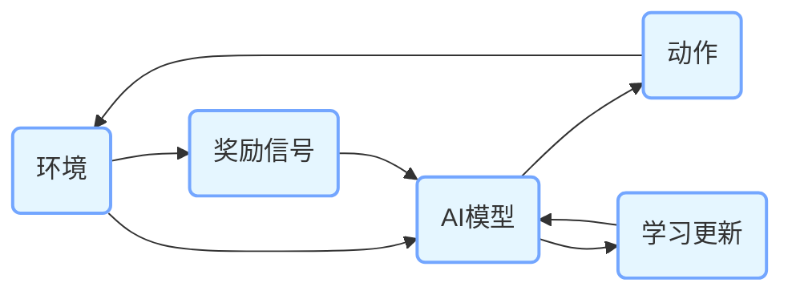

# AI模型自我学习能力的提升策略

> 关键词：AI模型、自我学习能力、提升策略、强化学习、元学习

> 摘要：本文围绕AI模型自我学习能力的提升策略展开深入探讨。首先介绍了相关背景，包括目的范围、预期读者等内容。接着阐述了核心概念，分析了AI模型自我学习的原理和架构。通过Python代码详细讲解了核心算法原理和具体操作步骤，同时给出了数学模型和公式，并举例说明。在项目实战部分，展示了代码实际案例并进行详细解释。探讨了AI模型自我学习能力提升策略在不同场景的实际应用，推荐了学习资源、开发工具框架以及相关论文著作。最后总结了未来发展趋势与挑战，还提供了常见问题解答和扩展阅读参考资料，旨在为提升AI模型的自我学习能力提供全面且深入的指导。

## 1. 背景介绍 
### 1.1 目的和范围
在当今数字化时代，人工智能技术飞速发展，AI模型在众多领域得到了广泛应用。然而，现有的AI模型在面对复杂多变的环境和任务时，往往表现出一定的局限性。提升AI模型的自我学习能力，使其能够自主地从环境中获取知识、优化自身性能，成为了人工智能领域的研究热点。本文的目的在于系统地探讨提升AI模型自我学习能力的策略，涵盖从理论原理到实际应用的各个方面。范围包括常见的AI模型类型，如神经网络、决策树等，以及相关的学习算法，如强化学习、元学习等。

### 1.2 预期读者
本文预期读者主要包括人工智能领域的研究人员、开发者、学生以及对AI技术感兴趣的爱好者。对于研究人员，本文可以提供新的研究思路和方向；对于开发者，能够帮助他们在实际项目中更好地提升AI模型的性能；对于学生，可以作为学习人工智能相关知识的参考资料；对于爱好者，则有助于他们深入了解AI模型自我学习能力的提升方法。

### 1.3 文档结构概述
本文将按照以下结构进行阐述：首先介绍背景信息，让读者了解本文的目的和适用对象；接着讲解核心概念与联系，明确AI模型自我学习的相关定义和原理；然后详细阐述核心算法原理和具体操作步骤，并给出相应的Python代码；之后介绍数学模型和公式，通过具体例子加深理解；在项目实战部分，展示代码实际案例并进行详细解读；探讨实际应用场景，说明提升策略的实用性；推荐相关的工具和资源，方便读者进一步学习和实践；最后总结未来发展趋势与挑战，提供常见问题解答和扩展阅读参考资料。

### 1.4 术语表
#### 1.4.1 核心术语定义
- **AI模型**：人工智能模型是对人类智能的一种模拟，通过算法和数据进行训练，以实现特定的任务，如图像识别、自然语言处理等。
- **自我学习能力**：指AI模型在没有人工干预的情况下，能够自主地从环境中获取信息、发现规律，并对自身的参数和结构进行调整，以提高性能的能力。
- **强化学习**：一种机器学习方法，智能体通过与环境进行交互，根据环境反馈的奖励信号来学习最优的行为策略。
- **元学习**：也称为“学习如何学习”，旨在让模型快速适应新的任务和环境，通过在多个任务上进行训练，学习到通用的学习策略。

#### 1.4.2 相关概念解释
- **泛化能力**：AI模型在未见过的数据上能够保持良好性能的能力。提升自我学习能力有助于提高模型的泛化能力。
- **自适应能力**：模型能够根据环境的变化自动调整自身行为的能力，是自我学习能力的重要体现。
- **迁移学习**：将在一个任务上学习到的知识迁移到另一个相关任务上，是提升模型学习效率的一种方法。

#### 1.4.3 缩略词列表
- **RL**：Reinforcement Learning，强化学习
- **ML**：Machine Learning，机器学习
- **DL**：Deep Learning，深度学习
- **MAML**：Model-Agnostic Meta-Learning，模型无关元学习

## 2. 核心概念与联系 
### 核心概念原理
AI模型的自我学习能力主要基于机器学习和深度学习的相关理论。其核心思想是让模型能够自主地从数据中发现模式和规律，并根据这些规律对自身进行优化。例如，在监督学习中，模型通过大量的标注数据进行训练，学习输入和输出之间的映射关系；在无监督学习中，模型则通过对无标注数据的分析，发现数据的内在结构和特征。

强化学习是提升AI模型自我学习能力的重要方法之一。在强化学习中，智能体与环境进行交互，根据环境的状态采取行动，并获得相应的奖励。智能体的目标是通过不断地尝试和探索，找到能够最大化长期奖励的行为策略。元学习则侧重于让模型学习如何快速适应新的任务。它通过在多个任务上进行训练，学习到通用的学习策略，使得模型在面对新任务时能够更快地收敛到较好的性能。

### 架构示意图
下面是一个简单的AI模型自我学习架构示意图：



该图展示了AI模型与环境的交互过程。AI模型从环境中获取状态信息，根据自身的策略选择动作并执行。环境根据动作给出奖励信号，AI模型根据奖励信号进行学习更新，不断优化自身的策略。

## 3. 核心算法原理 & 具体操作步骤 
### 强化学习算法原理
强化学习的核心算法之一是Q-learning。Q-learning是一种基于值函数的强化学习算法，其目标是学习一个最优的动作价值函数 $Q(s,a)$，表示在状态 $s$ 下采取动作 $a$ 所能获得的最大期望累积奖励。

Q-learning的更新公式为：

$$Q(s_t,a_t) \leftarrow Q(s_t,a_t) + \alpha [r_{t+1} + \gamma \max_{a} Q(s_{t+1},a) - Q(s_t,a_t)]$$

其中，$s_t$ 是当前状态，$a_t$ 是当前动作，$r_{t+1}$ 是执行动作 $a_t$ 后获得的奖励，$s_{t+1}$ 是下一个状态，$\alpha$ 是学习率，$\gamma$ 是折扣因子。

### Python代码实现
```python
import numpy as np

# 定义环境参数
num_states = 5
num_actions = 2
gamma = 0.9
alpha = 0.1

# 初始化Q表
Q = np.zeros((num_states, num_actions))

# 定义奖励矩阵
rewards = np.array([
    [-1, -1],
    [-1, -1],
    [-1, 10],
    [-1, -1],
    [-1, -1]
])

# 定义状态转移函数
def transition(state, action):
    if action == 0:
        next_state = max(state - 1, 0)
    else:
        next_state = min(state + 1, num_states - 1)
    return next_state

# Q-learning算法
num_episodes = 1000
for episode in range(num_episodes):
    state = 0
    done = False
    while not done:
        # 选择动作
        if np.random.uniform(0, 1) < 0.1:
            action = np.random.choice(num_actions)
        else:
            action = np.argmax(Q[state, :])
        
        # 执行动作，获取奖励和下一个状态
        next_state = transition(state, action)
        reward = rewards[state, action]
        
        # 更新Q表
        Q[state, action] = Q[state, action] + alpha * (reward + gamma * np.max(Q[next_state, :]) - Q[state, action])
        
        # 判断是否结束
        if next_state == 2 and action == 1:
            done = True
        
        state = next_state

# 输出最终的Q表
print("Final Q-table:")
print(Q)
```
### 代码解释
1. **初始化参数**：定义了状态数、动作数、折扣因子和学习率，并初始化Q表和奖励矩阵。
2. **状态转移函数**：根据当前状态和动作，计算下一个状态。
3. **Q-learning算法**：通过多个回合的训练，智能体不断与环境交互，根据Q-learning更新公式更新Q表。
4. **动作选择**：采用 $\epsilon$-贪心策略，以一定的概率随机选择动作，以探索新的状态和动作。
5. **输出结果**：训练结束后，输出最终的Q表。

### 元学习算法原理
以MAML（Model-Agnostic Meta-Learning）为例，MAML的目标是学习一个初始化参数，使得模型在新的任务上能够通过少量的梯度更新快速收敛到较好的性能。

具体步骤如下：
1. **采样任务**：从任务分布中采样一批任务。
2. **内部更新**：对于每个任务，使用该任务的训练数据进行一次或多次梯度更新，得到临时参数。
3. **外部更新**：使用所有任务的临时参数，计算元梯度，并更新模型的初始化参数。

### Python代码实现
```python
import torch
import torch.nn as nn
import torch.optim as optim

# 定义一个简单的神经网络模型
class SimpleNet(nn.Module):
    def __init__(self):
        super(SimpleNet, self).__init__()
        self.fc1 = nn.Linear(10, 20)
        self.fc2 = nn.Linear(20, 1)
    
    def forward(self, x):
        x = torch.relu(self.fc1(x))
        x = self.fc2(x)
        return x

# 初始化模型和优化器
model = SimpleNet()
meta_optimizer = optim.Adam(model.parameters(), lr=0.001)

# 定义任务分布
num_tasks = 10
num_samples_per_task = 20

# 元训练循环
num_meta_epochs = 10
for meta_epoch in range(num_meta_epochs):
    meta_loss = 0
    for task in range(num_tasks):
        # 采样任务数据
        inputs = torch.randn(num_samples_per_task, 10)
        targets = torch.randn(num_samples_per_task, 1)
        
        # 复制模型参数
        fast_weights = list(model.parameters())
        
        # 内部更新
        inner_optimizer = optim.SGD(fast_weights, lr=0.01)
        for _ in range(3):
            outputs = model(inputs)
            loss = nn.MSELoss()(outputs, targets)
            inner_optimizer.zero_grad()
            loss.backward(retain_graph=True)
            inner_optimizer.step()
        
        # 计算外部损失
        outputs = model(inputs)
        task_loss = nn.MSELoss()(outputs, targets)
        meta_loss += task_loss
    
    # 外部更新
    meta_optimizer.zero_grad()
    meta_loss.backward()
    meta_optimizer.step()

    print(f"Meta epoch {meta_epoch + 1}, Meta loss: {meta_loss.item()}")
```
### 代码解释
1. **定义模型**：定义了一个简单的两层神经网络模型。
2. **初始化参数**：初始化模型和元优化器。
3. **元训练循环**：在多个元训练周期内，采样多个任务，进行内部更新和外部更新。
4. **内部更新**：对于每个任务，使用SGD进行多次梯度更新，得到临时参数。
5. **外部更新**：使用所有任务的临时参数，计算元损失，并更新模型的初始化参数。

## 4. 数学模型和公式 & 详细讲解 & 举例说明 
### 强化学习数学模型
强化学习可以用马尔可夫决策过程（MDP）来描述。一个MDP由一个四元组 $(S, A, P, R)$ 组成，其中：
- $S$ 是状态空间，表示环境的所有可能状态。
- $A$ 是动作空间，表示智能体可以采取的所有动作。
- $P(s_{t+1}|s_t,a_t)$ 是状态转移概率，表示在状态 $s_t$ 下采取动作 $a_t$ 后转移到状态 $s_{t+1}$ 的概率。
- $R(s_t,a_t)$ 是奖励函数，表示在状态 $s_t$ 下采取动作 $a_t$ 所获得的即时奖励。

智能体的目标是找到一个最优策略 $\pi^*(s)$，使得长期累积奖励最大化。长期累积奖励可以用折扣累积奖励来表示：

$$G_t = \sum_{k=0}^{\infty} \gamma^k r_{t+k+1}$$

其中，$\gamma$ 是折扣因子，$0 \leq \gamma \leq 1$。

### 举例说明
假设有一个简单的网格世界环境，智能体的目标是从起点到达终点。状态空间 $S$ 是网格中的所有位置，动作空间 $A$ 包括上下左右四个方向。状态转移概率 $P$ 取决于环境的物理规则，例如在没有障碍物的情况下，智能体向某个方向移动的概率为1。奖励函数 $R$ 可以设置为：到达终点时获得正奖励，撞到障碍物或超出边界时获得负奖励，其他情况获得零奖励。

### 元学习数学模型
MAML的目标是找到一个初始化参数 $\theta$，使得在新的任务 $\tau$ 上，经过少量的梯度更新后，模型的损失最小。设 $\mathcal{L}_{\tau}$ 是任务 $\tau$ 的损失函数，$\theta'$ 是经过一次梯度更新后的参数：

$$\theta' = \theta - \alpha \nabla_{\theta} \mathcal{L}_{\tau}(f_{\theta})$$

其中，$f_{\theta}$ 是参数为 $\theta$ 的模型，$\alpha$ 是内部学习率。

MAML的元损失可以定义为：

$$\mathcal{L}_{meta}(\theta) = \sum_{\tau \in \mathcal{T}} \mathcal{L}_{\tau}(f_{\theta'})$$

其中，$\mathcal{T}$ 是任务分布。

### 举例说明
假设有多个回归任务，每个任务的数据集不同。MAML的目标是学习一个初始化参数，使得在新的回归任务上，通过少量的梯度更新，模型能够快速拟合数据。例如，在一个二维平面上，每个任务的目标函数可能是不同的线性函数，MAML可以学习到一个通用的初始化参数，使得模型在面对新的线性函数时能够快速调整参数。

## 5. 项目实战：代码实际案例和详细解释说明 
### 5.1  开发环境搭建
#### 安装Python
首先需要安装Python，建议使用Python 3.7及以上版本。可以从Python官方网站（https://www.python.org/downloads/）下载安装包，按照安装向导进行安装。

#### 安装深度学习库
在本项目中，我们使用PyTorch作为深度学习框架。可以使用以下命令安装PyTorch：
```sh
pip install torch torchvision
```

#### 安装其他依赖库
还需要安装一些其他的依赖库，如NumPy、Matplotlib等。可以使用以下命令安装：
```sh
pip install numpy matplotlib
```

### 5.2  源代码详细实现和代码解读
#### 项目背景
我们以一个简单的迷宫游戏为例，实现一个基于强化学习的智能体，让智能体学会在迷宫中找到出口。

#### 迷宫环境定义
```python
import numpy as np

class MazeEnv:
    def __init__(self):
        self.maze = np.array([
            [0, 0, 0, 0],
            [0, 1, 1, 0],
            [0, 1, 0, 0],
            [0, 0, 0, 2]
        ])
        self.start_state = (0, 0)
        self.current_state = self.start_state
        self.goal_state = (3, 3)
    
    def reset(self):
        self.current_state = self.start_state
        return self.current_state
    
    def step(self, action):
        x, y = self.current_state
        if action == 0:  # 上
            new_x = max(x - 1, 0)
            new_y = y
        elif action == 1:  # 下
            new_x = min(x + 1, self.maze.shape[0] - 1)
            new_y = y
        elif action == 2:  # 左
            new_x = x
            new_y = max(y - 1, 0)
        elif action == 3:  # 右
            new_x = x
            new_y = min(y + 1, self.maze.shape[1] - 1)
        
        if self.maze[new_x, new_y] == 1:  # 障碍物
            reward = -1
            done = False
        elif (new_x, new_y) == self.goal_state:  # 到达终点
            reward = 10
            done = True
        else:
            reward = -0.1
            done = False
        
        self.current_state = (new_x, new_y)
        return self.current_state, reward, done
```
#### 代码解读
- `__init__` 方法：初始化迷宫环境，包括迷宫地图、起始状态和目标状态。
- `reset` 方法：将智能体的状态重置为起始状态，并返回起始状态。
- `step` 方法：根据智能体的动作，更新智能体的状态，并返回新的状态、奖励和是否结束的标志。

#### 强化学习智能体实现
```python
import numpy as np

class QLearningAgent:
    def __init__(self, num_states, num_actions, gamma=0.9, alpha=0.1, epsilon=0.1):
        self.num_states = num_states
        self.num_actions = num_actions
        self.gamma = gamma
        self.alpha = alpha
        self.epsilon = epsilon
        self.Q = np.zeros((num_states, num_actions))
    
    def choose_action(self, state):
        if np.random.uniform(0, 1) < self.epsilon:
            action = np.random.choice(self.num_actions)
        else:
            action = np.argmax(self.Q[state, :])
        return action
    
    def update(self, state, action, reward, next_state):
        self.Q[state, action] = self.Q[state, action] + self.alpha * (reward + self.gamma * np.max(self.Q[next_state, :]) - self.Q[state, action])
```
#### 代码解读
- `__init__` 方法：初始化Q表和学习参数，包括折扣因子、学习率和探索率。
- `choose_action` 方法：采用 $\epsilon$-贪心策略选择动作。
- `update` 方法：根据Q-learning更新公式更新Q表。

#### 训练过程
```python
# 创建迷宫环境和智能体
env = MazeEnv()
num_states = env.maze.size
num_actions = 4
agent = QLearningAgent(num_states, num_actions)

# 训练参数
num_episodes = 1000
for episode in range(num_episodes):
    state = env.reset()
    state_index = np.ravel_multi_index(state, env.maze.shape)
    done = False
    while not done:
        action = agent.choose_action(state_index)
        next_state, reward, done = env.step(action)
        next_state_index = np.ravel_multi_index(next_state, env.maze.shape)
        agent.update(state_index, action, reward, next_state_index)
        state_index = next_state_index
    
    if episode % 100 == 0:
        print(f"Episode {episode}: Completed")
```
#### 代码解读
- 创建迷宫环境和强化学习智能体。
- 在多个回合内进行训练，每个回合中，智能体与环境交互，根据Q-learning算法更新Q表。
- 每100个回合输出一次训练进度。

### 5.3  代码解读与分析
通过上述代码，我们实现了一个简单的迷宫游戏智能体。在训练过程中，智能体通过不断地与环境交互，学习到了在不同状态下采取最优动作的策略。Q表记录了每个状态下每个动作的价值，智能体根据Q表选择动作。

随着训练的进行，智能体的性能逐渐提高，能够更快地找到迷宫的出口。通过调整学习参数，如折扣因子、学习率和探索率，可以进一步优化智能体的性能。

## 6. 实际应用场景 
### 游戏领域
在游戏中，AI模型的自我学习能力可以让游戏角色更加智能和灵活。例如，在策略游戏中，AI可以通过自我学习不断优化战术，提高胜率；在角色扮演游戏中，AI角色可以根据玩家的行为和环境变化做出不同的反应，增强游戏的趣味性和挑战性。

### 自动驾驶领域
自动驾驶汽车需要在复杂多变的道路环境中做出决策。AI模型的自我学习能力可以让自动驾驶系统不断适应新的路况、交通规则和环境变化。例如，通过强化学习，自动驾驶汽车可以学习到最优的驾驶策略，提高行车安全性和效率。

### 医疗领域
在医疗诊断中，AI模型可以通过自我学习从大量的医疗数据中发现疾病的特征和规律，提高诊断的准确性和效率。例如，通过分析医学影像、病历数据等，AI模型可以自动识别疾病，为医生提供辅助诊断建议。

### 金融领域
在金融市场中，AI模型的自我学习能力可以用于风险评估、投资决策等方面。例如，通过学习历史市场数据和宏观经济信息，AI模型可以预测股票价格走势、评估投资风险，为投资者提供决策支持。

## 7. 工具和资源推荐
### 7.1 学习资源推荐
#### 7.1.1 书籍推荐
- 《深度学习》（Deep Learning）：由Ian Goodfellow、Yoshua Bengio和Aaron Courville所著，是深度学习领域的经典教材，涵盖了深度学习的基本原理、算法和应用。
- 《强化学习：原理与Python实现》：详细介绍了强化学习的基本概念、算法和实际应用，并提供了Python代码示例。
- 《元学习：理论与实践》：系统地阐述了元学习的理论和方法，适合对元学习感兴趣的研究人员和开发者。

#### 7.1.2 在线课程
- Coursera上的“深度学习专项课程”（Deep Learning Specialization）：由Andrew Ng教授授课，包括神经网络、卷积神经网络、循环神经网络等多个主题，是学习深度学习的优质课程。
- edX上的“强化学习基础”（Fundamentals of Reinforcement Learning）：介绍了强化学习的基本概念和算法，通过实际案例帮助学习者掌握强化学习的应用。
- OpenAI Gym官方文档和教程：OpenAI Gym是一个用于开发和比较强化学习算法的工具包，其官方文档和教程提供了丰富的学习资源。

#### 7.1.3 技术博客和网站
- Medium上的AI相关博客：Medium上有许多AI领域的优秀博客，如Towards Data Science，涵盖了深度学习、强化学习、元学习等多个方面的技术文章。
- arXiv：一个预印本服务器，提供了大量的AI研究论文，及时了解最新的研究成果。
- OpenAI官方博客：OpenAI是人工智能领域的领先研究机构，其官方博客发布了许多关于AI技术的最新进展和研究成果。

### 7.2 开发工具框架推荐
#### 7.2.1 IDE和编辑器
- PyCharm：一款专业的Python集成开发环境，提供了代码编辑、调试、版本控制等功能，适合开发Python项目。
- Jupyter Notebook：一个交互式的开发环境，支持Python、R等多种编程语言，方便进行数据探索、模型训练和结果展示。
- Visual Studio Code：一款轻量级的代码编辑器，支持多种编程语言和插件扩展，具有丰富的功能和良好的用户体验。

#### 7.2.2 调试和性能分析工具
- TensorBoard：TensorFlow的可视化工具，可以用于可视化模型训练过程中的损失曲线、准确率曲线等信息，帮助开发者调试和优化模型。
- Py-Spy：一个用于分析Python代码性能的工具，可以实时监控Python进程的CPU使用率、函数调用次数等信息，帮助开发者找出性能瓶颈。
- cProfile：Python标准库中的性能分析模块，可以统计函数的调用次数、执行时间等信息，帮助开发者优化代码性能。

#### 7.2.3 相关框架和库
- PyTorch：一个开源的深度学习框架，具有动态图计算、易于使用等优点，广泛应用于深度学习研究和开发。
- TensorFlow：另一个流行的深度学习框架，提供了丰富的工具和库，支持分布式训练和模型部署。
- OpenAI Gym：一个用于开发和比较强化学习算法的工具包，提供了多种经典的强化学习环境，方便开发者进行实验和测试。

### 7.3 相关论文著作推荐
#### 7.3.1 经典论文
- “Human-level control through deep reinforcement learning”：由DeepMind团队发表于《Nature》杂志，介绍了深度Q网络（DQN）算法，实现了在多个Atari游戏上达到人类水平的控制。
- “Model-Agnostic Meta-Learning for Fast Adaptation of Deep Networks”：提出了MAML算法，是元学习领域的经典论文。
- “Policy Gradient Methods for Reinforcement Learning with Function Approximation”：介绍了策略梯度算法，为强化学习中的策略优化提供了理论基础。

#### 7.3.2 最新研究成果
- 关注顶级AI学术会议，如NeurIPS、ICML、CVPR等，这些会议上发表的论文代表了AI领域的最新研究成果。
- arXiv上的最新预印本论文，及时了解AI技术的前沿动态。

#### 7.3.3 应用案例分析
- 《AI in Healthcare: Transforming Medicine through Artificial Intelligence》：介绍了AI在医疗领域的应用案例，包括疾病诊断、药物研发等方面。
- 《Autonomous Driving: Technology, Regulations, and Social Impact》：探讨了自动驾驶技术的发展现状、面临的挑战和社会影响，提供了许多实际应用案例。

## 8. 总结：未来发展趋势与挑战
### 未来发展趋势
- **多模态学习**：未来的AI模型将能够处理多种模态的数据，如图像、文本、语音等，实现更加全面和深入的学习。
- **终身学习**：AI模型将具备终身学习的能力，能够在不断变化的环境中持续学习和适应，不断提升自身的性能。
- **与其他技术的融合**：AI将与物联网、区块链、量子计算等技术深度融合，创造出更加智能和高效的应用场景。

### 挑战
- **数据隐私和安全**：随着AI模型的广泛应用，数据隐私和安全问题日益突出。如何在保证数据安全的前提下，让AI模型充分利用数据进行学习，是一个亟待解决的问题。
- **可解释性**：许多AI模型，尤其是深度学习模型，是一个“黑盒”，难以解释其决策过程和结果。提高AI模型的可解释性，让用户能够理解和信任模型的决策，是未来发展的重要方向。
- **计算资源需求**：提升AI模型的自我学习能力往往需要大量的计算资源，如何降低计算成本，提高计算效率，是一个挑战。

## 9. 附录：常见问题与解答
### 如何选择合适的学习算法来提升AI模型的自我学习能力？
选择合适的学习算法需要考虑多个因素，如任务类型、数据特点、计算资源等。如果任务是连续决策问题，强化学习可能是一个不错的选择；如果需要模型快速适应新任务，元学习可能更合适；如果数据有标注，监督学习可以作为基础方法。同时，还可以结合不同的学习算法，发挥各自的优势。

### 如何评估AI模型的自我学习能力？
可以从多个方面评估AI模型的自我学习能力，如模型的泛化能力、自适应能力、学习效率等。泛化能力可以通过在未见过的数据上测试模型的性能来评估；自适应能力可以观察模型在环境变化时的表现；学习效率可以通过模型在训练过程中的收敛速度和最终性能来衡量。

### 提升AI模型的自我学习能力是否一定会增加计算成本？
不一定。虽然一些提升自我学习能力的方法，如深度强化学习和元学习，可能需要大量的计算资源，但通过优化算法、使用高效的硬件和分布式计算等方法，可以在一定程度上降低计算成本。同时，一些轻量级的学习算法和模型架构也可以在保证一定自我学习能力的前提下，减少计算需求。

## 10. 扩展阅读 & 参考资料
- Sutton, R. S., & Barto, A. G. (2018). Reinforcement learning: An introduction. MIT press.
- Finn, C., Abbeel, P., & Levine, S. (2017). Model-agnostic meta-learning for fast adaptation of deep networks. In Proceedings of the 34th International Conference on Machine Learning-Volume 70 (pp. 1126-1135). JMLR. org.
- Goodfellow, I., Bengio, Y., & Courville, A. (2016). Deep learning. MIT press.

作者：AI天才研究院/AI Genius Institute & 禅与计算机程序设计艺术 /Zen And The Art of Computer Programming