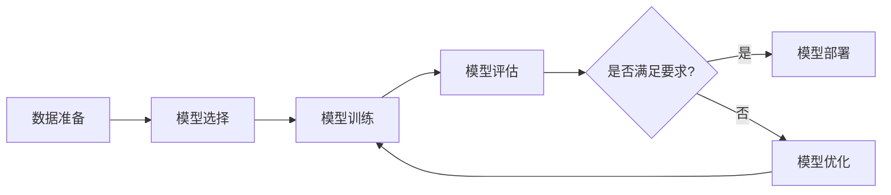

# AI模型训练与优化步骤详解

> 关键词：AI模型训练、模型优化、训练步骤、优化策略、深度学习

> 摘要：本文旨在详细阐述AI模型训练与优化的完整步骤。从背景介绍入手，明确文章目的、预期读者和文档结构。接着深入讲解核心概念，包括模型训练和优化的原理及架构，通过文本示意图和Mermaid流程图进行直观展示。详细剖析核心算法原理，使用Python源代码进行说明，并介绍相关数学模型和公式。通过项目实战，展示开发环境搭建、源代码实现和代码解读。分析实际应用场景，推荐学习资源、开发工具框架和相关论文著作。最后总结未来发展趋势与挑战，提供常见问题解答和扩展阅读参考资料，帮助读者全面掌握AI模型训练与优化的关键技术。

## 1. 背景介绍 
### 1.1 目的和范围
AI在当今科技领域的应用日益广泛，从图像识别到自然语言处理，从自动驾驶到智能医疗，AI模型的性能直接影响着应用的效果。然而，要构建高性能的AI模型并非易事，需要经过复杂的训练和优化过程。本文的目的就是详细介绍AI模型训练与优化的步骤，帮助读者系统地了解从数据准备到模型部署的全过程。范围涵盖常见的AI模型类型，如神经网络、决策树等，以及深度学习框架下的模型训练与优化方法。

### 1.2 预期读者
本文适合对AI技术有一定基础了解，希望深入学习模型训练与优化的开发者、数据科学家和研究人员。无论是初学者想要系统学习，还是有一定经验的从业者希望进一步提升技能，都能从本文中获得有价值的信息。

### 1.3 文档结构概述
本文将按照以下结构进行阐述：首先介绍核心概念与联系，帮助读者建立基本的知识体系；接着详细讲解核心算法原理和具体操作步骤，通过Python代码进行示例；然后介绍相关的数学模型和公式，并举例说明；通过项目实战展示实际应用中的代码实现和解读；分析AI模型在不同领域的实际应用场景；推荐学习资源、开发工具框架和相关论文著作；最后总结未来发展趋势与挑战，提供常见问题解答和扩展阅读参考资料。

### 1.4 术语表
#### 1.4.1 核心术语定义
- **AI模型**：是对现实世界中的问题进行抽象和建模，通过算法和数据进行训练，以实现特定任务的程序或系统。例如，图像分类模型可以根据输入的图像判断其所属的类别。
- **训练**：是指使用大量的数据对AI模型进行调整和优化，使模型能够学习到数据中的模式和规律，从而提高模型的性能。
- **优化**：在训练过程中，通过调整模型的参数和超参数，使模型的损失函数达到最小，从而提高模型的泛化能力和准确性。
- **损失函数**：用于衡量模型预测结果与真实标签之间的差异，是模型优化的目标。常见的损失函数有均方误差（MSE）、交叉熵损失等。
- **超参数**：是在模型训练前需要手动设置的参数，如学习率、批量大小、迭代次数等，它们会影响模型的训练效果和性能。

#### 1.4.2 相关概念解释
- **数据集**：是用于训练和评估AI模型的数据集合，通常分为训练集、验证集和测试集。训练集用于模型的训练，验证集用于调整超参数，测试集用于评估模型的最终性能。
- **过拟合**：是指模型在训练集上表现良好，但在测试集上表现不佳的现象。这是因为模型过于复杂，学习到了训练数据中的噪声和异常值，而没有学习到数据的本质特征。
- **欠拟合**：是指模型在训练集和测试集上的表现都不佳的现象。这是因为模型过于简单，无法学习到数据中的复杂模式和规律。
- **正则化**：是一种防止过拟合的技术，通过在损失函数中添加正则化项，限制模型参数的大小，从而降低模型的复杂度。

#### 1.4.3 缩略词列表
- **MSE**：Mean Squared Error，均方误差
- **SGD**：Stochastic Gradient Descent，随机梯度下降
- **CNN**：Convolutional Neural Network，卷积神经网络
- **RNN**：Recurrent Neural Network，循环神经网络
- **LSTM**：Long Short-Term Memory，长短期记忆网络

## 2. 核心概念与联系 

### 核心概念原理
AI模型训练与优化的核心目标是让模型能够从数据中学习到有效的模式和规律，从而对未知数据进行准确的预测。这个过程主要包括以下几个关键步骤：
1. **数据准备**：收集、清洗和预处理数据，将数据转换为适合模型输入的格式。
2. **模型选择**：根据任务的特点和数据的类型，选择合适的模型架构，如神经网络、决策树等。
3. **模型训练**：使用训练数据对模型进行训练，通过优化算法不断调整模型的参数，使模型的损失函数逐渐减小。
4. **模型评估**：使用验证集和测试集对模型的性能进行评估，检查模型是否过拟合或欠拟合。
5. **模型优化**：根据评估结果，调整模型的超参数或架构，进一步提高模型的性能。
6. **模型部署**：将训练好的模型部署到实际应用中，进行实时预测。

### 架构的文本示意图
```
+----------------+
|    数据准备    |
+----------------+
       |
       v
+----------------+
|    模型选择    |
+----------------+
       |
       v
+----------------+
|    模型训练    |
+----------------+
       |
       v
+----------------+
|    模型评估    |
+----------------+
       |
       v
+----------------+
|    模型优化    |
+----------------+
       |
       v
+----------------+
|    模型部署    |
+----------------+
```

### Mermaid流程图


## 3. 核心算法原理 & 具体操作步骤 

### 核心算法原理
在AI模型训练中，最常用的优化算法是梯度下降算法。梯度下降算法的基本思想是通过计算损失函数对模型参数的梯度，然后沿着梯度的反方向更新模型参数，使得损失函数逐渐减小。具体来说，对于一个具有参数 $\theta$ 的模型，其损失函数为 $L(\theta)$，梯度下降算法的更新公式为：

$$\theta_{t+1} = \theta_{t} - \alpha \nabla L(\theta_{t})$$

其中，$\theta_{t}$ 是第 $t$ 次迭代时的模型参数，$\alpha$ 是学习率，$\nabla L(\theta_{t})$ 是损失函数在 $\theta_{t}$ 处的梯度。

### 具体操作步骤
下面以一个简单的线性回归模型为例，使用Python代码详细说明AI模型训练的具体操作步骤。

```python
import numpy as np

# 1. 数据准备
# 生成一些示例数据
np.random.seed(0)
X = 2 * np.random.rand(100, 1)
y = 4 + 3 * X + np.random.randn(100, 1)

# 2. 模型选择
# 这里选择简单的线性回归模型，模型形式为 y = w * x + b
# 初始化模型参数
w = np.random.randn(1, 1)
b = np.random.randn(1, 1)

# 3. 模型训练
# 定义超参数
learning_rate = 0.01
num_iterations = 1000

for iteration in range(num_iterations):
    # 前向传播
    y_pred = np.dot(X, w) + b
    
    # 计算损失函数（均方误差）
    loss = np.mean((y_pred - y) ** 2)
    
    # 反向传播
    dw = 2 * np.dot(X.T, (y_pred - y)) / len(X)
    db = 2 * np.sum(y_pred - y) / len(X)
    
    # 更新模型参数
    w = w - learning_rate * dw
    b = b - learning_rate * db
    
    # 每100次迭代打印一次损失值
    if iteration % 100 == 0:
        print(f'Iteration {iteration}: Loss = {loss}')

# 4. 模型评估
# 打印最终的模型参数
print(f'Final w: {w}, Final b: {b}')

# 5. 模型优化
# 在这个简单示例中，我们可以通过调整学习率和迭代次数来进一步优化模型

# 6. 模型部署
# 在实际应用中，我们可以使用训练好的模型对新的数据进行预测
new_X = np.array([[3]])
new_y_pred = np.dot(new_X, w) + b
print(f'Prediction for new data: {new_y_pred}')
```

### 代码解释
1. **数据准备**：使用 `np.random.rand` 生成一些随机数据，并添加一些噪声，模拟真实数据。
2. **模型选择**：选择简单的线性回归模型，初始化模型参数 $w$ 和 $b$。
3. **模型训练**：使用梯度下降算法进行模型训练，通过前向传播计算预测值，计算损失函数，然后通过反向传播计算梯度，最后更新模型参数。
4. **模型评估**：打印最终的模型参数，检查模型的训练效果。
5. **模型优化**：可以通过调整学习率和迭代次数来进一步优化模型。
6. **模型部署**：使用训练好的模型对新的数据进行预测。

## 4. 数学模型和公式 & 详细讲解 & 举例说明 

### 线性回归模型
线性回归模型是一种最简单的机器学习模型，用于预测连续的数值。其数学模型可以表示为：

$$y = w_{1}x_{1} + w_{2}x_{2} + \cdots + w_{n}x_{n} + b$$

其中，$y$ 是预测值，$x_{1}, x_{2}, \cdots, x_{n}$ 是输入特征，$w_{1}, w_{2}, \cdots, w_{n}$ 是模型参数，$b$ 是偏置项。

### 损失函数（均方误差）
均方误差（MSE）是线性回归模型中常用的损失函数，用于衡量模型预测值与真实值之间的差异。其公式为：

$$MSE = \frac{1}{m} \sum_{i=1}^{m} (y_{i} - \hat{y}_{i})^{2}$$

其中，$m$ 是样本数量，$y_{i}$ 是第 $i$ 个样本的真实值，$\hat{y}_{i}$ 是第 $i$ 个样本的预测值。

### 梯度计算
为了使用梯度下降算法更新模型参数，需要计算损失函数对模型参数的梯度。对于线性回归模型，损失函数对 $w$ 和 $b$ 的梯度分别为：

$$\frac{\partial MSE}{\partial w_{j}} = \frac{2}{m} \sum_{i=1}^{m} (y_{i} - \hat{y}_{i}) x_{ij}$$

$$\frac{\partial MSE}{\partial b} = \frac{2}{m} \sum_{i=1}^{m} (y_{i} - \hat{y}_{i})$$

其中，$x_{ij}$ 是第 $i$ 个样本的第 $j$ 个特征。

### 举例说明
假设我们有一个简单的线性回归问题，输入特征 $x$ 只有一个维度，真实值 $y$ 与 $x$ 的关系为 $y = 2x + 1$。我们使用以下数据进行训练：

| $x$ | $y$ |
| --- | --- |
| 1   | 3   |
| 2   | 5   |
| 3   | 7   |

初始化模型参数 $w = 0$，$b = 0$，学习率 $\alpha = 0.01$，迭代次数为 100。

1. **第一次迭代**：
    - 前向传播：$\hat{y}_{1} = w \times 1 + b = 0$，$\hat{y}_{2} = w \times 2 + b = 0$，$\hat{y}_{3} = w \times 3 + b = 0$
    - 计算损失函数：$MSE = \frac{1}{3} [(3 - 0)^{2} + (5 - 0)^{2} + (7 - 0)^{2}] = \frac{1}{3} [9 + 25 + 49] = \frac{83}{3}$
    - 计算梯度：
        - $\frac{\partial MSE}{\partial w} = \frac{2}{3} [(3 - 0) \times 1 + (5 - 0) \times 2 + (7 - 0) \times 3] = \frac{2}{3} [3 + 10 + 21] = \frac{68}{3}$
        - $\frac{\partial MSE}{\partial b} = \frac{2}{3} [(3 - 0) + (5 - 0) + (7 - 0)] = \frac{2}{3} [3 + 5 + 7] = 10$
    - 更新模型参数：
        - $w = w - \alpha \frac{\partial MSE}{\partial w} = 0 - 0.01 \times \frac{68}{3} \approx -0.227$
        - $b = b - \alpha \frac{\partial MSE}{\partial b} = 0 - 0.01 \times 10 = -0.1$

2. **后续迭代**：重复上述步骤，不断更新模型参数，直到损失函数收敛或达到最大迭代次数。

## 5. 项目实战：代码实际案例和详细解释说明 

### 5.1  开发环境搭建
为了完成这个项目实战，我们需要搭建以下开发环境：
1. **Python**：建议使用Python 3.7及以上版本。
2. **深度学习框架**：这里我们使用TensorFlow 2.x版本，它是一个开源的深度学习框架，提供了丰富的工具和函数，方便我们进行模型训练和优化。
3. **数据处理库**：使用NumPy和Pandas进行数据处理和分析。
4. **可视化库**：使用Matplotlib和Seaborn进行数据可视化。

可以使用以下命令安装所需的库：

```bash
pip install tensorflow numpy pandas matplotlib seaborn
```

### 5.2  源代码详细实现和代码解读
我们以一个手写数字识别的项目为例，详细介绍AI模型训练与优化的代码实现。

```python
import tensorflow as tf
from tensorflow.keras.datasets import mnist
from tensorflow.keras.models import Sequential
from tensorflow.keras.layers import Dense, Flatten
import matplotlib.pyplot as plt

# 1. 数据准备
# 加载MNIST数据集
(train_images, train_labels), (test_images, test_labels) = mnist.load_data()

# 数据预处理
train_images = train_images / 255.0
test_images = test_images / 255.0

# 2. 模型选择
# 构建一个简单的神经网络模型
model = Sequential([
    Flatten(input_shape=(28, 28)),
    Dense(128, activation='relu'),
    Dense(10, activation='softmax')
])

# 3. 模型编译
model.compile(optimizer='adam',
              loss='sparse_categorical_crossentropy',
              metrics=['accuracy'])

# 4. 模型训练
history = model.fit(train_images, train_labels, epochs=5, validation_split=0.2)

# 5. 模型评估
test_loss, test_acc = model.evaluate(test_images, test_labels)
print(f'Test accuracy: {test_acc}')

# 6. 模型优化
# 可以通过调整超参数、增加模型复杂度等方式进行优化

# 7. 模型部署
# 可以使用训练好的模型对新的手写数字图像进行预测
predictions = model.predict(test_images)

# 可视化训练过程
plt.plot(history.history['accuracy'])
plt.plot(history.history['val_accuracy'])
plt.title('Model accuracy')
plt.ylabel('Accuracy')
plt.xlabel('Epoch')
plt.legend(['Train', 'Validation'], loc='upper left')
plt.show()

plt.plot(history.history['loss'])
plt.plot(history.history['val_loss'])
plt.title('Model loss')
plt.ylabel('Loss')
plt.xlabel('Epoch')
plt.legend(['Train', 'Validation'], loc='upper left')
plt.show()
```

### 代码解读与分析
1. **数据准备**：使用 `mnist.load_data()` 加载MNIST手写数字数据集，将图像数据归一化到0-1之间。
2. **模型选择**：使用 `Sequential` 模型构建一个简单的神经网络，包括一个 `Flatten` 层将二维图像数据转换为一维向量，一个 `Dense` 层作为隐藏层，使用ReLU激活函数，最后一个 `Dense` 层作为输出层，使用Softmax激活函数输出每个类别的概率。
3. **模型编译**：使用 `adam` 优化器，`sparse_categorical_crossentropy` 损失函数，`accuracy` 作为评估指标。
4. **模型训练**：使用 `fit` 方法进行模型训练，设置训练轮数为5，使用20%的数据作为验证集。
5. **模型评估**：使用 `evaluate` 方法对模型在测试集上的性能进行评估，打印测试集的准确率。
6. **模型优化**：可以通过调整超参数（如学习率、批量大小、迭代次数等）、增加模型复杂度（如增加隐藏层、增加神经元数量等）等方式进行优化。
7. **模型部署**：使用 `predict` 方法对测试集进行预测，得到每个样本的预测概率。
8. **可视化训练过程**：使用Matplotlib绘制训练集和验证集的准确率和损失曲线，帮助我们观察模型的训练过程和性能。

## 6. 实际应用场景 
AI模型训练与优化在各个领域都有广泛的应用，以下是一些常见的应用场景：
1. **图像识别**：如人脸识别、物体检测、图像分类等。通过训练深度卷积神经网络（CNN），可以实现对图像中物体的准确识别和分类。例如，在安防领域，人脸识别技术可以用于门禁系统、监控系统等；在医疗领域，图像识别技术可以用于医学影像诊断，帮助医生更准确地检测疾病。
2. **自然语言处理**：如文本分类、情感分析、机器翻译等。通过训练循环神经网络（RNN）、长短期记忆网络（LSTM）或Transformer等模型，可以实现对文本的理解和生成。例如，在社交媒体平台上，情感分析技术可以用于分析用户的情绪和态度；在翻译领域，机器翻译技术可以实现不同语言之间的自动翻译。
3. **语音识别**：如语音助手、语音导航等。通过训练深度学习模型，如卷积神经网络（CNN）和循环神经网络（RNN）的组合，可以实现对语音信号的准确识别和转换。例如，在智能手机上，语音助手可以帮助用户完成各种任务，如查询信息、设置提醒等。
4. **推荐系统**：如电商推荐、音乐推荐、视频推荐等。通过分析用户的历史行为和偏好，训练推荐模型，可以为用户提供个性化的推荐服务。例如，在电商平台上，推荐系统可以根据用户的浏览记录和购买历史，为用户推荐相关的商品。
5. **自动驾驶**：通过训练深度学习模型，如卷积神经网络（CNN）和强化学习模型，可以实现对自动驾驶车辆的环境感知、决策和控制。例如，在自动驾驶汽车中，CNN可以用于识别道路、交通标志和其他车辆，强化学习模型可以用于决策和控制车辆的行驶方向和速度。

## 7. 工具和资源推荐
### 7.1 学习资源推荐
#### 7.1.1 书籍推荐
- 《深度学习》（Deep Learning）：由Ian Goodfellow、Yoshua Bengio和Aaron Courville所著，是深度学习领域的经典教材，全面介绍了深度学习的基本概念、算法和应用。
- 《Python机器学习》（Python Machine Learning）：由Sebastian Raschka所著，通过Python代码详细介绍了机器学习的基本算法和实践技巧。
- 《动手学深度学习》（Dive into Deep Learning）：由李沐等人所著，提供了丰富的代码示例和实践项目，帮助读者快速上手深度学习。

#### 7.1.2 在线课程
- Coursera上的《深度学习专项课程》（Deep Learning Specialization）：由Andrew Ng教授主讲，包括五门课程，系统地介绍了深度学习的各个方面。
- edX上的《人工智能基础》（Introduction to Artificial Intelligence）：由麻省理工学院（MIT）的教授主讲，介绍了人工智能的基本概念、算法和应用。
- 吴恩达老师的《机器学习》课程：在Coursera平台上非常受欢迎，适合初学者入门。

#### 7.1.3 技术博客和网站
- Medium：是一个技术博客平台，有很多关于AI和机器学习的优质文章。
- Towards Data Science：专注于数据科学和机器学习领域，提供了很多实用的教程和案例。
- Kaggle：是一个数据科学竞赛平台，有很多公开的数据集和优秀的解决方案，可以学习到很多实战经验。

### 7.2 开发工具框架推荐
#### 7.2.1 IDE和编辑器
- PyCharm：是一款专业的Python集成开发环境（IDE），提供了丰富的代码编辑、调试和分析功能。
- Jupyter Notebook：是一个交互式的开发环境，适合进行数据分析和模型训练的实验和演示。
- Visual Studio Code：是一款轻量级的代码编辑器，支持多种编程语言和插件扩展，非常适合快速开发和调试。

#### 7.2.2 调试和性能分析工具
- TensorBoard：是TensorFlow提供的可视化工具，可以用于监控模型的训练过程、可视化模型结构和分析模型性能。
- PyTorch Profiler：是PyTorch提供的性能分析工具，可以帮助我们找出模型训练过程中的性能瓶颈。
- cProfile：是Python标准库中的性能分析工具，可以用于分析Python代码的执行时间和调用关系。

#### 7.2.3 相关框架和库
- TensorFlow：是一个开源的深度学习框架，提供了丰富的工具和函数，支持多种深度学习模型的训练和部署。
- PyTorch：是另一个流行的深度学习框架，具有动态图和易于使用的特点，适合快速开发和研究。
- Scikit-learn：是一个简单易用的机器学习库，提供了各种机器学习算法和工具，适合初学者入门。

### 7.3 相关论文著作推荐
#### 7.3.1 经典论文
- 《ImageNet Classification with Deep Convolutional Neural Networks》：由Alex Krizhevsky、Ilya Sutskever和Geoffrey E. Hinton所著，提出了AlexNet模型，开启了深度学习在图像识别领域的热潮。
- 《Long Short-Term Memory》：由Sepp Hochreiter和Jürgen Schmidhuber所著，介绍了长短期记忆网络（LSTM）的原理和应用。
- 《Attention Is All You Need》：由Ashish Vaswani等人所著，提出了Transformer模型，在自然语言处理领域取得了巨大的成功。

#### 7.3.2 最新研究成果
- arXiv：是一个预印本平台，收录了大量的最新研究论文，可以及时了解AI领域的最新进展。
- NeurIPS、ICML、CVPR等顶级学术会议：每年都会发表很多高质量的研究论文，展示了AI领域的最新研究成果。

#### 7.3.3 应用案例分析
- Google AI Blog：Google官方的AI博客，分享了很多Google在AI领域的应用案例和技术经验。
- Facebook AI Research：Facebook的AI研究团队发布了很多关于AI技术的应用案例和研究成果。

## 8. 总结：未来发展趋势与挑战
### 未来发展趋势
1. **模型的智能化和自动化**：未来的AI模型将越来越智能化和自动化，能够自动进行数据处理、模型选择、超参数调整等操作，减少人工干预，提高模型的开发效率和性能。
2. **多模态融合**：将不同模态的数据（如图像、语音、文本等）进行融合，能够更全面地理解和处理信息，提高模型的性能和应用范围。例如，在智能安防领域，将图像和语音数据进行融合，可以实现更准确的目标识别和行为分析。
3. **强化学习的应用拓展**：强化学习在游戏、机器人控制等领域已经取得了很好的效果，未来将在更多领域得到应用，如自动驾驶、金融投资等。强化学习可以让模型通过与环境的交互不断学习和优化策略，实现更智能的决策和控制。
4. **量子计算与AI的结合**：量子计算具有强大的计算能力，将量子计算与AI相结合，可以加速模型的训练和推理过程，解决一些传统计算机难以解决的问题。例如，在药物研发、气象预测等领域，量子计算与AI的结合有望取得重大突破。

### 挑战
1. **数据隐私和安全**：随着AI技术的广泛应用，数据隐私和安全问题越来越受到关注。在模型训练过程中，需要使用大量的数据，这些数据可能包含用户的敏感信息，如何保护数据的隐私和安全是一个亟待解决的问题。
2. **模型可解释性**：很多深度学习模型是黑盒模型，难以解释其决策过程和结果。在一些关键领域，如医疗、金融等，模型的可解释性非常重要，如何提高模型的可解释性是一个挑战。
3. **计算资源和能源消耗**：训练大规模的AI模型需要大量的计算资源和能源消耗，这不仅增加了成本，还对环境造成了一定的压力。如何提高模型的训练效率，降低计算资源和能源消耗是一个重要的研究方向。
4. **伦理和社会问题**：AI技术的发展也带来了一些伦理和社会问题，如失业、偏见、不公平等。如何确保AI技术的发展符合人类的利益和价值观，是一个需要全社会共同关注和解决的问题。

## 9. 附录：常见问题与解答
### 1. 什么是过拟合和欠拟合？如何解决？
过拟合是指模型在训练集上表现良好，但在测试集上表现不佳的现象。这是因为模型过于复杂，学习到了训练数据中的噪声和异常值，而没有学习到数据的本质特征。解决过拟合的方法包括增加训练数据、正则化、减少模型复杂度等。

欠拟合是指模型在训练集和测试集上的表现都不佳的现象。这是因为模型过于简单，无法学习到数据中的复杂模式和规律。解决欠拟合的方法包括增加模型复杂度、调整超参数等。

### 2. 如何选择合适的损失函数和优化算法？
损失函数的选择取决于具体的任务类型。对于回归问题，常用的损失函数有均方误差（MSE）、平均绝对误差（MAE）等；对于分类问题，常用的损失函数有交叉熵损失、对数损失等。

优化算法的选择也需要根据具体情况进行调整。常见的优化算法有随机梯度下降（SGD）、Adagrad、Adadelta、Adam等。一般来说，Adam算法在大多数情况下表现较好，是一个比较常用的选择。

### 3. 如何评估模型的性能？
评估模型的性能需要使用合适的评估指标。对于分类问题，常用的评估指标有准确率、精确率、召回率、F1值等；对于回归问题，常用的评估指标有均方误差（MSE）、平均绝对误差（MAE）、决定系数（R²）等。此外，还可以使用交叉验证等方法来更全面地评估模型的性能。

### 4. 如何调整模型的超参数？
调整模型的超参数可以使用网格搜索、随机搜索、贝叶斯优化等方法。网格搜索是一种穷举搜索方法，会遍历所有可能的超参数组合；随机搜索则是在超参数空间中随机采样进行搜索；贝叶斯优化则是基于贝叶斯定理，根据已有的搜索结果来预测下一个可能的超参数组合，从而提高搜索效率。

## 10. 扩展阅读 & 参考资料
### 扩展阅读
- 《人工智能：现代方法》（Artificial Intelligence: A Modern Approach）：全面介绍了人工智能的各个领域，包括搜索算法、知识表示、机器学习、自然语言处理等。
- 《人工智能时代》（The Age of AI）：探讨了人工智能技术对社会、经济和人类生活的影响。
- 《智能时代》（The Fourth Industrial Revolution）：介绍了第四次工业革命中人工智能、大数据、物联网等技术的发展和应用。

### 参考资料
- 官方文档：TensorFlow、PyTorch等深度学习框架的官方文档是学习和使用这些框架的重要参考资料。
- 学术论文：可以通过IEEE Xplore、ACM Digital Library等学术数据库查找相关的学术论文，了解最新的研究成果和技术发展趋势。
- 开源项目：GitHub上有很多优秀的开源项目，可以学习到其他人的代码实现和经验。

作者：AI天才研究院/AI Genius Institute & 禅与计算机程序设计艺术 /Zen And The Art of Computer Programming