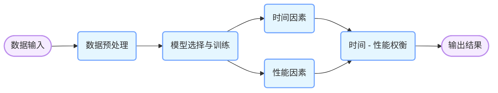

# AI系统中的时间 - 性能权衡

> 关键词：AI系统、时间 - 性能权衡、算法复杂度、优化策略、实际应用场景

> 摘要：本文围绕AI系统中的时间 - 性能权衡展开深入探讨。首先介绍了相关背景知识，包括目的范围、预期读者等内容。接着阐述了核心概念及其联系，详细分析了核心算法原理和具体操作步骤，并结合数学模型和公式进行说明。通过项目实战展示了代码实际案例和详细解释。探讨了时间 - 性能权衡在不同实际应用场景中的体现，推荐了相关的学习资源、开发工具框架以及论文著作。最后总结了未来发展趋势与挑战，并给出常见问题解答和扩展阅读参考资料。旨在帮助读者全面理解AI系统中时间 - 性能权衡的重要性和实现方法。

## 1. 背景介绍 
### 1.1 目的和范围
在当今的AI领域，时间和性能是两个至关重要的指标。时间通常指的是AI系统完成特定任务所需的计算时间，而性能则涵盖了诸如准确率、召回率、F1值等衡量模型效果的指标。本文章的目的在于深入探讨在AI系统中如何平衡时间和性能这两个因素，以达到最优的系统效果。范围将涵盖常见的AI算法，如深度学习、机器学习中的分类和回归算法等，以及不同的应用场景，如自然语言处理、计算机视觉等。

### 1.2 预期读者
本文预期读者包括AI领域的初学者、开发者、研究人员以及对AI系统性能优化感兴趣的技术爱好者。初学者可以通过本文了解时间 - 性能权衡的基本概念和重要性；开发者可以从中获取实际的优化策略和代码示例；研究人员可以关注数学模型和最新的研究成果；技术爱好者则可以拓宽对AI系统的认识。

### 1.3 文档结构概述
本文将按照以下结构展开：首先介绍核心概念与联系，明确时间和性能在AI系统中的具体含义和相互关系；接着详细讲解核心算法原理和具体操作步骤，通过Python代码进行演示；然后引入数学模型和公式，进一步阐述时间 - 性能权衡的理论基础；通过项目实战展示如何在实际代码中实现权衡；探讨实际应用场景中时间 - 性能权衡的特点；推荐相关的学习资源、开发工具框架和论文著作；最后总结未来发展趋势与挑战，提供常见问题解答和扩展阅读参考资料。

### 1.4 术语表
#### 1.4.1 核心术语定义
- **时间复杂度**：描述算法执行时间随输入规模增长的变化趋势，通常用大O符号表示，如 $O(n)$ 表示算法执行时间与输入规模 $n$ 成正比。
- **空间复杂度**：指算法在执行过程中所需要的存储空间随输入规模增长的变化趋势。
- **准确率（Accuracy）**：在分类问题中，准确率是指分类正确的样本数占总样本数的比例。
- **召回率（Recall）**：在二分类问题中，召回率是指真正例占所有正例的比例。
- **F1值**：是准确率和召回率的调和平均数，用于综合衡量模型的性能。

#### 1.4.2 相关概念解释
- **过拟合**：模型在训练数据上表现良好，但在测试数据上表现不佳的现象，通常是由于模型过于复杂，学习了训练数据中的噪声。
- **欠拟合**：模型在训练数据和测试数据上的表现都不佳，通常是由于模型过于简单，无法捕捉数据中的复杂模式。
- **剪枝**：在决策树等模型中，通过去除一些不必要的节点来简化模型，从而减少计算时间和避免过拟合。

#### 1.4.3 缩略词列表
- **CNN**：卷积神经网络（Convolutional Neural Network）
- **RNN**：循环神经网络（Recurrent Neural Network）
- **LSTM**：长短期记忆网络（Long Short - Term Memory）
- **API**：应用程序编程接口（Application Programming Interface）

## 2. 核心概念与联系 

### 核心概念原理
在AI系统中，时间和性能是相互关联又相互制约的两个因素。时间主要涉及到算法的执行效率，包括数据处理、模型训练和推理的时间。性能则侧重于模型对数据的拟合程度和预测能力。

从算法复杂度的角度来看，时间复杂度和空间复杂度是衡量算法效率的重要指标。一个具有较高时间复杂度的算法，通常需要更长的执行时间，但可能会带来更好的性能。例如，在深度学习中，使用更深层次的神经网络模型往往可以提高模型的性能，但同时也会增加训练和推理的时间。

性能方面，常见的评估指标如准确率、召回率和F1值等，用于衡量模型在不同任务上的表现。在实际应用中，我们需要根据具体的任务需求来选择合适的性能指标。例如，在医疗诊断中，召回率可能更为重要，因为我们希望尽可能地检测出所有的疾病案例；而在垃圾邮件分类中，准确率可能是更关键的指标。

### 架构的文本示意图
```plaintext
AI系统
├── 数据输入
│   ├── 原始数据
│   └── 数据预处理
├── 模型选择与训练
│   ├── 算法选择
│   ├── 模型训练
│   └── 模型评估
├── 时间因素
│   ├── 数据处理时间
│   ├── 训练时间
│   └── 推理时间
├── 性能因素
│   ├── 准确率
│   ├── 召回率
│   └── F1值
└── 时间 - 性能权衡
    ├── 优化策略
    └── 实际应用调整
```

### Mermaid流程图


## 3. 核心算法原理 & 具体操作步骤 

### 算法原理讲解
我们以一个简单的线性回归模型为例，来说明时间 - 性能权衡的原理。线性回归的目标是找到一条直线 $y = wx + b$，使得预测值 $\hat{y}$ 与真实值 $y$ 之间的误差最小。通常使用均方误差（MSE）作为损失函数，其公式为：

$$MSE = \frac{1}{n}\sum_{i = 1}^{n}(y_i - \hat{y}_i)^2 = \frac{1}{n}\sum_{i = 1}^{n}(y_i - (wx_i + b))^2$$

其中，$n$ 是样本数量，$x_i$ 和 $y_i$ 分别是第 $i$ 个样本的输入和输出，$w$ 和 $b$ 是模型的参数。

为了最小化损失函数，我们可以使用梯度下降算法。梯度下降算法的基本思想是沿着损失函数的负梯度方向更新模型参数，直到损失函数收敛。具体来说，$w$ 和 $b$ 的更新公式如下：

$$w = w - \alpha\frac{\partial MSE}{\partial w}$$

$$b = b - \alpha\frac{\partial MSE}{\partial b}$$

其中，$\alpha$ 是学习率，控制每次参数更新的步长。

### Python源代码实现
```python
import numpy as np

# 生成一些示例数据
np.random.seed(0)
X = 2 * np.random.rand(100, 1)
y = 4 + 3 * X + np.random.randn(100, 1)

# 初始化参数
w = np.random.randn(1, 1)
b = np.random.randn(1, 1)

# 定义超参数
learning_rate = 0.01
num_iterations = 1000

# 梯度下降算法
for iteration in range(num_iterations):
    # 计算预测值
    y_pred = np.dot(X, w) + b
    
    # 计算损失函数
    mse = np.mean((y - y_pred) ** 2)
    
    # 计算梯度
    dw = -2 * np.dot(X.T, (y - y_pred)) / len(X)
    db = -2 * np.sum(y - y_pred) / len(X)
    
    # 更新参数
    w = w - learning_rate * dw
    b = b - learning_rate * db
    
    # 每100次迭代打印一次损失值
    if iteration % 100 == 0:
        print(f'Iteration {iteration}: MSE = {mse}')

print(f'Final parameters: w = {w}, b = {b}')
```

### 具体操作步骤
1. **数据生成**：使用 `numpy` 库生成一些随机数据作为示例输入。
2. **参数初始化**：随机初始化模型的参数 $w$ 和 $b$。
3. **超参数设置**：设置学习率和迭代次数。
4. **梯度下降迭代**：在每次迭代中，计算预测值、损失函数和梯度，并更新参数。
5. **结果输出**：打印最终的参数值。

在这个过程中，迭代次数会影响训练时间和模型性能。增加迭代次数可以使模型更接近最优解，提高性能，但同时也会增加训练时间。因此，我们需要在迭代次数和训练时间之间进行权衡。

## 4. 数学模型和公式 & 详细讲解 & 举例说明 

### 时间复杂度分析
对于上述线性回归模型的梯度下降算法，其时间复杂度主要取决于样本数量 $n$ 和特征数量 $m$。在每次迭代中，计算预测值和梯度的时间复杂度都是 $O(nm)$。因此，总的时间复杂度为 $O(k \cdot nm)$，其中 $k$ 是迭代次数。

例如，如果有 $n = 1000$ 个样本，每个样本有 $m = 10$ 个特征，迭代次数 $k = 100$，那么总的计算量为 $100 \times 1000 \times 10 = 10^6$ 次操作。

### 性能指标分析
在回归问题中，除了均方误差（MSE），还常用均方根误差（RMSE）和平均绝对误差（MAE）来评估模型性能。

- 均方根误差（RMSE）：

$$RMSE = \sqrt{\frac{1}{n}\sum_{i = 1}^{n}(y_i - \hat{y}_i)^2}$$

RMSE 是 MSE 的平方根，它的优点是与原始数据具有相同的单位，更直观地反映了预测值与真实值之间的平均误差。

- 平均绝对误差（MAE）：

$$MAE = \frac{1}{n}\sum_{i = 1}^{n}|y_i - \hat{y}_i|$$

MAE 计算预测值与真实值之间的绝对误差的平均值，它对异常值的敏感性较低。

### 举例说明
假设我们有以下真实值和预测值：

真实值 $y = [1, 2, 3, 4, 5]$

预测值 $\hat{y} = [1.2, 2.1, 2.9, 4.2, 4.8]$

计算 MSE、RMSE 和 MAE：

$$MSE = \frac{(1 - 1.2)^2+(2 - 2.1)^2+(3 - 2.9)^2+(4 - 4.2)^2+(5 - 4.8)^2}{5} = 0.02$$

$$RMSE = \sqrt{0.02} \approx 0.141$$

$$MAE = \frac{|1 - 1.2|+|2 - 2.1|+|3 - 2.9|+|4 - 4.2|+|5 - 4.8|}{5} = 0.12$$

从这些指标可以看出，模型的预测误差较小，性能较好。在实际应用中，我们可以根据具体需求选择合适的性能指标来评估模型。

## 5. 项目实战：代码实际案例和详细解释说明 

### 5.1  开发环境搭建
为了完成本项目实战，我们需要搭建一个Python开发环境，并安装必要的库。以下是具体步骤：

1. **安装Python**：可以从Python官方网站（https://www.python.org/downloads/）下载并安装Python 3.x版本。
2. **安装虚拟环境**：建议使用虚拟环境来管理项目的依赖。可以使用 `venv` 或 `conda` 来创建虚拟环境。以下是使用 `venv` 的示例：

```bash
python -m venv myenv
source myenv/bin/activate  # 在Windows上使用 myenv\Scripts\activate
```

3. **安装必要的库**：在虚拟环境中安装 `numpy`、`pandas`、`scikit-learn` 等库。

```bash
pip install numpy pandas scikit-learn
```

### 5.2  源代码详细实现和代码解读
我们以一个简单的鸢尾花分类任务为例，使用逻辑回归算法来展示时间 - 性能权衡。

```python
import numpy as np
import pandas as pd
from sklearn.datasets import load_iris
from sklearn.model_selection import train_test_split
from sklearn.linear_model import LogisticRegression
from sklearn.metrics import accuracy_score
import time

# 加载鸢尾花数据集
iris = load_iris()
X = iris.data
y = iris.target

# 划分训练集和测试集
X_train, X_test, y_train, y_test = train_test_split(X, y, test_size=0.2, random_state=42)

# 定义不同的迭代次数
max_iter_list = [10, 100, 1000]

for max_iter in max_iter_list:
    # 创建逻辑回归模型
    model = LogisticRegression(max_iter=max_iter)
    
    # 记录训练开始时间
    start_time = time.time()
    
    # 训练模型
    model.fit(X_train, y_train)
    
    # 记录训练结束时间
    end_time = time.time()
    
    # 计算训练时间
    training_time = end_time - start_time
    
    # 进行预测
    y_pred = model.predict(X_test)
    
    # 计算准确率
    accuracy = accuracy_score(y_test, y_pred)
    
    print(f'Max iterations: {max_iter}, Training time: {training_time:.4f} seconds, Accuracy: {accuracy:.4f}')
```

### 代码解读与分析
1. **数据加载与划分**：使用 `sklearn.datasets.load_iris` 加载鸢尾花数据集，并使用 `train_test_split` 将数据集划分为训练集和测试集。
2. **定义不同的迭代次数**：通过 `max_iter_list` 定义不同的迭代次数，用于测试不同迭代次数下的时间和性能。
3. **模型训练与评估**：在每次循环中，创建一个逻辑回归模型，并设置不同的迭代次数。记录训练开始和结束时间，计算训练时间。使用训练好的模型进行预测，并计算准确率。

从输出结果可以看出，随着迭代次数的增加，训练时间会逐渐增加，但准确率可能会先上升后趋于稳定。因此，我们需要在训练时间和准确率之间找到一个平衡点。

## 6. 实际应用场景 
### 自然语言处理
在自然语言处理中，时间 - 性能权衡非常重要。例如，在实时对话系统中，需要在短时间内给出准确的回答，因此对时间要求较高。可以使用轻量级的模型，如FastText等，来提高推理速度，但可能会牺牲一定的性能。而在文档分类等对时间要求不那么高的任务中，可以使用更复杂的模型，如BERT等，以获得更好的分类效果。

### 计算机视觉
在计算机视觉中，目标检测和图像分类是常见的任务。在一些实时监控系统中，需要快速检测出目标物体，因此可以使用YOLO等轻量级的目标检测算法。而在图像识别比赛中，为了获得更高的准确率，可以使用ResNet等深层的卷积神经网络，但训练和推理时间会相对较长。

### 医疗诊断
在医疗诊断中，时间和性能都至关重要。一方面，需要快速给出诊断结果，以便及时进行治疗；另一方面，诊断结果的准确性直接关系到患者的生命健康。可以使用深度学习模型进行疾病诊断，但需要在模型复杂度和推理时间之间进行权衡。例如，可以使用迁移学习的方法，在预训练模型的基础上进行微调，以减少训练时间。

## 7. 工具和资源推荐
### 7.1 学习资源推荐
#### 7.1.1 书籍推荐
- 《深度学习》（Deep Learning）：由Ian Goodfellow、Yoshua Bengio和Aaron Courville撰写，是深度学习领域的经典教材，涵盖了深度学习的基本原理、算法和应用。
- 《Python机器学习》（Python Machine Learning）：由Sebastian Raschka和Vahid Mirjalili撰写，介绍了使用Python进行机器学习的方法和技巧，适合初学者。
- 《动手学深度学习》（Dive into Deep Learning）：由李沐等人编写，提供了丰富的代码示例和实践项目，帮助读者快速掌握深度学习的应用。

#### 7.1.2 在线课程
- Coursera上的“深度学习专项课程”（Deep Learning Specialization）：由Andrew Ng教授授课，包括神经网络和深度学习、改善深层神经网络、结构化机器学习项目等多个课程。
- edX上的“使用Python进行数据科学”（Data Science with Python）：介绍了使用Python进行数据处理、分析和机器学习的方法。
- 吴恩达的“机器学习”课程：在Coursera平台上提供，是机器学习领域的经典入门课程。

#### 7.1.3 技术博客和网站
- Medium：有许多AI领域的优秀博客文章，如Towards Data Science等。
- arXiv：是一个预印本平台，提供了大量的AI研究论文。
- Kaggle：是一个数据科学竞赛平台，上面有许多关于AI的数据集、代码和讨论。

### 7.2 开发工具框架推荐
#### 7.2.1 IDE和编辑器
- PyCharm：是一款专业的Python集成开发环境，提供了丰富的代码编辑、调试和版本控制功能。
- Jupyter Notebook：是一个交互式的开发环境，适合进行数据分析和模型实验。
- Visual Studio Code：是一款轻量级的代码编辑器，支持多种编程语言和插件扩展。

#### 7.2.2 调试和性能分析工具
- TensorBoard：是TensorFlow提供的可视化工具，可以用于监控模型训练过程、可视化损失函数和准确率等指标。
- PyTorch Profiler：可以帮助分析PyTorch模型的性能瓶颈，如计算时间、内存使用等。
- cProfile：是Python标准库中的性能分析工具，可以分析Python代码的执行时间和函数调用次数。

#### 7.2.3 相关框架和库
- TensorFlow：是Google开发的深度学习框架，提供了丰富的工具和API，支持分布式训练和部署。
- PyTorch：是Facebook开发的深度学习框架，具有动态图的特点，易于使用和调试。
- Scikit - learn：是一个用于机器学习的Python库，提供了各种机器学习算法和工具，如分类、回归、聚类等。

### 7.3 相关论文著作推荐
#### 7.3.1 经典论文
- “Gradient - Based Learning Applied to Document Recognition”：由Yann LeCun等人发表，介绍了卷积神经网络（CNN）在手写数字识别中的应用，是CNN领域的经典论文。
- “Long Short - Term Memory”：由Sepp Hochreiter和Jürgen Schmidhuber发表，提出了长短期记忆网络（LSTM），解决了循环神经网络（RNN）中的梯度消失问题。
- “Attention Is All You Need”：由Google Brain团队发表，提出了Transformer架构，在自然语言处理领域取得了巨大成功。

#### 7.3.2 最新研究成果
- 关注顶级学术会议，如NeurIPS（神经信息处理系统大会）、ICML（国际机器学习会议）、CVPR（计算机视觉与模式识别会议）等，这些会议上会发表许多最新的AI研究成果。
- 一些知名的研究机构，如OpenAI、DeepMind等，也会发布一些前沿的研究论文。

#### 7.3.3 应用案例分析
- 可以在Kaggle上找到许多实际的AI应用案例，如医疗诊断、金融预测、图像识别等。
- 一些企业的技术博客，如Google AI Blog、Facebook AI Research等，也会分享一些实际应用案例和技术经验。

## 8. 总结：未来发展趋势与挑战
### 未来发展趋势
- **硬件加速**：随着硬件技术的不断发展，如GPU、TPU等的性能不断提升，将进一步加速AI系统的训练和推理过程，减少时间成本。
- **模型压缩与量化**：通过模型压缩和量化技术，可以减少模型的参数数量和计算量，在不牺牲太多性能的前提下，提高模型的运行速度。
- **自动化机器学习（AutoML）**：AutoML技术可以自动选择合适的模型和超参数，优化时间 - 性能权衡，降低AI开发的门槛。

### 挑战
- **数据隐私与安全**：在追求高性能的同时，需要保证数据的隐私和安全。一些优化策略可能会增加数据泄露的风险，需要找到合适的解决方案。
- **可解释性与可靠性**：随着AI模型越来越复杂，其可解释性和可靠性成为了重要的挑战。在实际应用中，需要在时间、性能和可解释性之间进行平衡。
- **跨领域融合**：AI技术与其他领域的融合越来越深入，需要考虑不同领域的特点和需求，进行更加复杂的时间 - 性能权衡。

## 9. 附录：常见问题与解答
### 问题1：如何选择合适的性能指标？
答：选择合适的性能指标需要根据具体的任务需求来决定。在分类问题中，如果正负样本比例均衡，可以使用准确率；如果关注正例的召回率，可以使用召回率或F1值。在回归问题中，常用均方误差、均方根误差和平均绝对误差等指标。

### 问题2：增加迭代次数一定能提高模型性能吗？
答：不一定。增加迭代次数可能会使模型更接近最优解，提高性能，但也可能会导致过拟合，使模型在测试数据上的表现变差。因此，需要通过交叉验证等方法来选择合适的迭代次数。

### 问题3：如何在实际项目中进行时间 - 性能权衡？
答：可以先根据任务需求确定一个性能目标，然后尝试不同的模型和优化策略，在满足性能目标的前提下，尽量减少时间成本。也可以使用自动化机器学习工具来自动进行权衡。

## 10. 扩展阅读 & 参考资料
- Goodfellow, I., Bengio, Y., & Courville, A. (2016). Deep Learning. MIT Press.
- Raschka, S., & Mirjalili, V. (2017). Python Machine Learning. Packt Publishing.
- 李沐, 阿斯顿·张, Zachary C. Lipton, 亚历山大·J. 斯莫拉 (2020). 动手学深度学习. 人民邮电出版社.
- LeCun, Y., Bottou, L., Bengio, Y., & Haffner, P. (1998). Gradient - Based Learning Applied to Document Recognition. Proceedings of the IEEE, 86(11), 2278 - 2324.
- Hochreiter, S., & Schmidhuber, J. (1997). Long Short - Term Memory. Neural Computation, 9(8), 1735 - 1780.
- Vaswani, A., Shazeer, N., Parmar, N., Uszkoreit, J., Jones, L., Gomez, A. N.,... & Polosukhin, I. (2017). Attention Is All You Need. Advances in Neural Information Processing Systems, 5998 - 6008.

作者：AI天才研究院/AI Genius Institute & 禅与计算机程序设计艺术 /Zen And The Art of Computer Programming