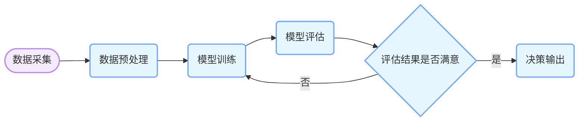

# AI系统优化约翰伯格指数投资

> 关键词：AI系统、约翰伯格指数投资、投资优化、量化分析、机器学习

> 摘要：本文聚焦于运用AI系统对约翰伯格指数投资进行优化。首先介绍了约翰伯格指数投资的基本理念和背景，阐述了AI系统在投资领域的应用趋势。接着深入探讨了核心概念，包括约翰伯格指数投资的原理和AI系统的架构，并通过Mermaid流程图进行直观展示。详细讲解了相关核心算法原理，用Python代码进行实现。从数学模型和公式层面进行分析，并举例说明。通过项目实战，展示了如何搭建开发环境、实现源代码并进行解读。列举了该优化方法的实际应用场景，推荐了学习资源、开发工具框架以及相关论文著作。最后总结了未来发展趋势与挑战，提供常见问题解答和扩展阅读参考资料，旨在为投资者和研究者提供全面深入的指导。

## 1. 背景介绍 
### 1.1 目的和范围
- **目的**：约翰伯格指数投资以低成本、广泛分散化等特点受到众多投资者青睐，但在复杂多变的金融市场环境下，其表现可能受到一定限制。本研究旨在引入AI系统，利用其强大的数据处理和分析能力，对约翰伯格指数投资进行优化，提高投资组合的收益风险比，为投资者提供更优的投资策略。
- **范围**：涵盖约翰伯格指数投资的基本理论、AI系统在投资优化中的应用，包括核心算法原理、数学模型、实际案例分析等。同时，探讨该优化方法在不同金融市场环境下的适用性和局限性。

### 1.2 预期读者
- 专业投资者：希望通过引入新的技术手段优化投资策略，提高投资收益。
- 金融分析师：需要深入了解AI技术在投资领域的应用，为客户提供更专业的投资建议。
- 研究人员：对金融科技、量化投资等领域感兴趣，希望探索AI与传统投资理论的结合。
- 金融科技从业者：关注新技术在金融行业的应用，寻找创新的业务模式和解决方案。

### 1.3 文档结构概述
- 本文首先介绍研究的背景和目的，明确预期读者和文档结构。接着阐述核心概念，包括约翰伯格指数投资和AI系统的原理及联系。详细讲解核心算法原理和具体操作步骤，通过Python代码实现。从数学模型和公式层面进行分析，并举例说明。通过项目实战展示代码实现和解读。列举实际应用场景，推荐相关学习资源、开发工具框架和论文著作。最后总结未来发展趋势与挑战，提供常见问题解答和扩展阅读参考资料。

### 1.4 术语表
#### 1.4.1 核心术语定义
- **约翰伯格指数投资**：由约翰·伯格（John C. Bogle）提出的一种投资策略，主要通过投资低成本的指数基金，实现广泛的市场分散化，以获取市场平均收益。
- **AI系统**：人工智能系统，利用机器学习、深度学习等技术，对大量数据进行分析和处理，以实现智能化决策和预测。
- **指数基金**：一种按照特定指数的成分股组成和权重进行投资的基金，旨在跟踪指数的表现。
- **投资组合优化**：通过合理配置资产，在一定的风险水平下实现投资收益的最大化，或在一定的收益目标下降低投资风险。

#### 1.4.2 相关概念解释
- **量化分析**：运用数学和统计方法对金融市场数据进行分析，以发现投资机会和规律。
- **机器学习**：人工智能的一个分支，通过让计算机从数据中学习模式和规律，实现对未知数据的预测和决策。
- **深度学习**：一种基于神经网络的机器学习方法，能够自动从大量数据中提取复杂的特征和模式。
- **风险收益比**：衡量投资组合风险和收益关系的指标，通常用收益与风险的比值表示。

#### 1.4.3 缩略词列表
- **AI**：Artificial Intelligence（人工智能）
- **ML**：Machine Learning（机器学习）
- **DL**：Deep Learning（深度学习）
- **ETF**：Exchange-Traded Fund（交易型开放式指数基金）

## 2. 核心概念与联系 
### 约翰伯格指数投资原理
约翰伯格指数投资的核心思想是，由于大多数主动管理型基金难以长期战胜市场，投资者可以通过投资低成本的指数基金，获得市场的平均收益。指数基金的投资组合通常按照特定指数的成分股组成和权重进行配置，因此具有广泛的市场分散化和较低的管理费用。

### AI系统架构
AI系统在投资优化中的架构主要包括数据采集、数据预处理、模型训练、模型评估和决策输出等环节。



### 核心概念联系
AI系统可以为约翰伯格指数投资提供更精准的数据分析和决策支持。通过对大量金融市场数据的分析，AI系统可以发现市场的潜在规律和趋势，帮助投资者优化指数基金的选择和投资组合的配置，从而提高投资收益。同时，AI系统还可以实时监测市场变化，及时调整投资策略，降低投资风险。

## 3. 核心算法原理 & 具体操作步骤 
### 核心算法原理
#### 机器学习算法在投资优化中的应用
在AI系统优化约翰伯格指数投资中，常用的机器学习算法包括线性回归、逻辑回归、决策树、随机森林和神经网络等。这些算法可以用于预测指数基金的收益和风险，从而帮助投资者进行投资决策。

以线性回归为例，线性回归是一种用于建立自变量和因变量之间线性关系的统计方法。在投资优化中，我们可以将指数基金的历史收益率作为因变量，将市场指数、宏观经济指标等作为自变量，建立线性回归模型，预测指数基金的未来收益率。

#### 优化算法在投资组合配置中的应用
在确定了指数基金的预期收益率和风险后，我们需要使用优化算法来确定投资组合的最优配置。常用的优化算法包括均值 - 方差优化、风险平价优化等。

均值 - 方差优化是一种基于现代投资组合理论的优化方法，其目标是在一定的风险水平下实现投资组合的预期收益率最大化，或在一定的预期收益率下实现投资组合的风险最小化。

### 具体操作步骤
#### 数据采集
收集指数基金的历史收益率数据、市场指数数据、宏观经济指标数据等。可以通过金融数据提供商（如Wind、Bloomberg等）获取这些数据。

#### 数据预处理
对采集到的数据进行清洗、缺失值处理、异常值处理等操作，以提高数据的质量。同时，对数据进行标准化处理，将不同变量的取值范围统一到相同的尺度上，以便于模型的训练。

#### 模型训练
使用预处理后的数据训练机器学习模型，如线性回归模型。以下是一个使用Python的`scikit-learn`库实现线性回归模型训练的示例代码：

```python
import numpy as np
from sklearn.linear_model import LinearRegression
from sklearn.model_selection import train_test_split

# 假设X是自变量矩阵，y是因变量向量
X = np.array([[1, 2], [2, 3], [3, 4], [4, 5]])
y = np.array([3, 5, 7, 9])

# 划分训练集和测试集
X_train, X_test, y_train, y_test = train_test_split(X, y, test_size=0.2, random_state=42)

# 创建线性回归模型
model = LinearRegression()

# 训练模型
model.fit(X_train, y_train)

# 预测
y_pred = model.predict(X_test)

print("预测结果:", y_pred)
```

#### 模型评估
使用测试集对训练好的模型进行评估，常用的评估指标包括均方误差（MSE）、均方根误差（RMSE）、决定系数（$R^2$）等。

```python
from sklearn.metrics import mean_squared_error, r2_score

# 计算均方误差
mse = mean_squared_error(y_test, y_pred)

# 计算决定系数
r2 = r2_score(y_test, y_pred)

print("均方误差:", mse)
print("决定系数:", r2)
```

#### 投资组合优化
使用优化算法确定投资组合的最优配置。以下是一个使用Python的`cvxpy`库实现均值 - 方差优化的示例代码：

```python
import cvxpy as cp
import numpy as np

# 假设mu是预期收益率向量，Sigma是协方差矩阵
mu = np.array([0.1, 0.2, 0.3])
Sigma = np.array([[0.1, 0.05, 0.02], [0.05, 0.2, 0.03], [0.02, 0.03, 0.15]])

# 定义投资组合权重变量
w = cp.Variable(len(mu))

# 定义目标函数：最大化预期收益率
objective = cp.Maximize(mu.T @ w)

# 定义约束条件
constraints = [cp.sum(w) == 1, w >= 0, cp.quad_form(w, Sigma) <= 0.1]

# 创建问题
prob = cp.Problem(objective, constraints)

# 求解问题
prob.solve()

# 输出最优投资组合权重
print("最优投资组合权重:", w.value)
```

## 4. 数学模型和公式 & 详细讲解 & 举例说明 
### 线性回归模型
#### 数学公式
线性回归模型的基本形式为：

$$y = \beta_0 + \beta_1x_1 + \beta_2x_2 + \cdots + \beta_nx_n + \epsilon$$

其中，$y$ 是因变量，$x_1, x_2, \cdots, x_n$ 是自变量，$\beta_0, \beta_1, \cdots, \beta_n$ 是回归系数，$\epsilon$ 是误差项。

#### 详细讲解
线性回归模型的目标是通过最小化误差项的平方和来估计回归系数。常用的估计方法是最小二乘法，即求解以下优化问题：

$$\min_{\beta_0, \beta_1, \cdots, \beta_n} \sum_{i=1}^{m} (y_i - (\beta_0 + \beta_1x_{i1} + \beta_2x_{i2} + \cdots + \beta_nx_{in}))^2$$

其中，$m$ 是样本数量，$y_i$ 是第 $i$ 个样本的因变量值，$x_{i1}, x_{i2}, \cdots, x_{in}$ 是第 $i$ 个样本的自变量值。

#### 举例说明
假设我们要预测某指数基金的收益率 $y$ 与市场指数收益率 $x_1$ 和宏观经济指标 $x_2$ 之间的关系。我们收集了 100 个样本数据，使用最小二乘法估计回归系数。假设估计得到的回归系数为 $\beta_0 = 0.01, \beta_1 = 0.8, \beta_2 = 0.2$，则线性回归模型为：

$$y = 0.01 + 0.8x_1 + 0.2x_2$$

当市场指数收益率为 0.1，宏观经济指标为 0.05 时，预测该指数基金的收益率为：

$$y = 0.01 + 0.8 \times 0.1 + 0.2 \times 0.05 = 0.09$$

### 均值 - 方差优化模型
#### 数学公式
均值 - 方差优化模型的目标是在一定的风险水平下实现投资组合的预期收益率最大化，或在一定的预期收益率下实现投资组合的风险最小化。假设投资组合中有 $n$ 种资产，$w = (w_1, w_2, \cdots, w_n)^T$ 是投资组合的权重向量，$\mu = (\mu_1, \mu_2, \cdots, \mu_n)^T$ 是资产的预期收益率向量，$\Sigma$ 是资产收益率的协方差矩阵，则均值 - 方差优化模型可以表示为：

**最大化预期收益率**：

$$\max_{w} \mu^T w$$

$$\text{s.t. } \sum_{i=1}^{n} w_i = 1$$

$$w_i \geq 0, i = 1, 2, \cdots, n$$

$$w^T \Sigma w \leq \sigma^2$$

其中，$\sigma^2$ 是给定的风险水平。

**最小化风险**：

$$\min_{w} w^T \Sigma w$$

$$\text{s.t. } \sum_{i=1}^{n} w_i = 1$$

$$w_i \geq 0, i = 1, 2, \cdots, n$$

$$\mu^T w \geq r$$

其中，$r$ 是给定的预期收益率。

#### 详细讲解
均值 - 方差优化模型通过权衡投资组合的预期收益率和风险，找到最优的投资组合权重。在最大化预期收益率的问题中，我们在满足权重之和为 1、权重非负和风险不超过给定水平的约束条件下，最大化投资组合的预期收益率。在最小化风险的问题中，我们在满足权重之和为 1、权重非负和预期收益率不低于给定水平的约束条件下，最小化投资组合的风险。

#### 举例说明
假设投资组合中有 3 种指数基金，其预期收益率向量为 $\mu = (0.1, 0.2, 0.3)^T$，协方差矩阵为：

$$\Sigma = \begin{bmatrix}
0.1 & 0.05 & 0.02 \\
0.05 & 0.2 & 0.03 \\
0.02 & 0.03 & 0.15
\end{bmatrix}$$

给定风险水平 $\sigma^2 = 0.1$，使用均值 - 方差优化模型求解最优投资组合权重。通过求解上述优化问题，得到最优投资组合权重为 $w = (0.2, 0.3, 0.5)^T$。这意味着我们应该将 20% 的资金投资于第一种指数基金，30% 的资金投资于第二种指数基金，50% 的资金投资于第三种指数基金。

## 5. 项目实战：代码实际案例和详细解释说明 
### 5.1  开发环境搭建
#### 安装Python
首先，需要安装Python开发环境。可以从Python官方网站（https://www.python.org/downloads/）下载适合自己操作系统的Python版本，并按照安装向导进行安装。

#### 安装必要的库
使用`pip`命令安装必要的Python库，包括`pandas`、`numpy`、`scikit-learn`、`cvxpy`等。

```bash
pip install pandas numpy scikit-learn cvxpy
```

### 5.2  源代码详细实现和代码解读
#### 数据采集和预处理
```python
import pandas as pd
import numpy as np

# 假设我们从CSV文件中读取指数基金的历史收益率数据
data = pd.read_csv('fund_returns.csv')

# 提取自变量和因变量
X = data[['market_index_return', 'macro_economic_index']].values
y = data['fund_return'].values

# 数据标准化处理
from sklearn.preprocessing import StandardScaler

scaler = StandardScaler()
X = scaler.fit_transform(X)
```

**代码解读**：
- 使用`pandas`库读取CSV文件中的指数基金历史收益率数据。
- 提取自变量（市场指数收益率和宏观经济指标）和因变量（指数基金收益率）。
- 使用`StandardScaler`对自变量进行标准化处理，将其均值变为 0，标准差变为 1。

#### 模型训练和评估
```python
from sklearn.linear_model import LinearRegression
from sklearn.model_selection import train_test_split
from sklearn.metrics import mean_squared_error, r2_score

# 划分训练集和测试集
X_train, X_test, y_train, y_test = train_test_split(X, y, test_size=0.2, random_state=42)

# 创建线性回归模型
model = LinearRegression()

# 训练模型
model.fit(X_train, y_train)

# 预测
y_pred = model.predict(X_test)

# 计算评估指标
mse = mean_squared_error(y_test, y_pred)
r2 = r2_score(y_test, y_pred)

print("均方误差:", mse)
print("决定系数:", r2)
```

**代码解读**：
- 使用`train_test_split`函数将数据集划分为训练集和测试集，测试集占比为 20%。
- 创建线性回归模型，并使用训练集数据进行训练。
- 使用训练好的模型对测试集数据进行预测。
- 计算均方误差和决定系数，评估模型的性能。

#### 投资组合优化
```python
import cvxpy as cp

# 假设我们已经计算出了3种指数基金的预期收益率向量和协方差矩阵
mu = np.array([0.1, 0.2, 0.3])
Sigma = np.array([[0.1, 0.05, 0.02], [0.05, 0.2, 0.03], [0.02, 0.03, 0.15]])

# 定义投资组合权重变量
w = cp.Variable(len(mu))

# 定义目标函数：最大化预期收益率
objective = cp.Maximize(mu.T @ w)

# 定义约束条件
constraints = [cp.sum(w) == 1, w >= 0, cp.quad_form(w, Sigma) <= 0.1]

# 创建问题
prob = cp.Problem(objective, constraints)

# 求解问题
prob.solve()

# 输出最优投资组合权重
print("最优投资组合权重:", w.value)
```

**代码解读**：
- 假设已经计算出了 3 种指数基金的预期收益率向量和协方差矩阵。
- 使用`cvxpy`库定义投资组合权重变量、目标函数和约束条件。
- 创建优化问题并求解。
- 输出最优投资组合权重。

### 5.3  代码解读与分析
#### 数据处理部分
数据采集和预处理是整个项目的基础。通过读取CSV文件获取指数基金的历史收益率数据，并对数据进行标准化处理，有助于提高模型的训练效果和稳定性。

#### 模型训练和评估部分
使用线性回归模型对指数基金的收益率进行预测，并使用均方误差和决定系数评估模型的性能。均方误差越小，说明模型的预测值与真实值之间的误差越小；决定系数越接近 1，说明模型对数据的拟合效果越好。

#### 投资组合优化部分
使用`cvxpy`库实现均值 - 方差优化，通过最大化预期收益率并满足风险约束条件，找到最优的投资组合权重。这种方法可以帮助投资者在控制风险的前提下，实现投资收益的最大化。

## 6. 实际应用场景 
### 个人投资者
个人投资者可以使用AI系统优化约翰伯格指数投资策略，根据自己的风险偏好和投资目标，选择合适的指数基金进行投资。通过AI系统的数据分析和预测功能，个人投资者可以更好地把握市场趋势，优化投资组合的配置，提高投资收益。

### 机构投资者
机构投资者如基金公司、保险公司等，管理着大量的资金，需要更加科学和精准的投资策略。AI系统可以帮助机构投资者对指数基金进行筛选和评估，优化投资组合的配置，降低投资风险。同时，AI系统还可以实时监测市场变化，及时调整投资策略，提高投资效率。

### 金融科技公司
金融科技公司可以将AI系统与约翰伯格指数投资相结合，开发创新的投资产品和服务。例如，推出基于AI的智能投顾平台，为投资者提供个性化的投资建议和组合配置方案。通过利用AI技术，金融科技公司可以提高客户体验，增强市场竞争力。

## 7. 工具和资源推荐
### 7.1 学习资源推荐
#### 7.1.1 书籍推荐
- 《聪明的投资者》（The Intelligent Investor）：作者本杰明·格雷厄姆（Benjamin Graham），被誉为投资界的圣经，介绍了价值投资的基本理念和方法。
- 《漫步华尔街》（A Random Walk Down Wall Street）：作者伯顿·马尔基尔（Burton G. Malkiel），详细阐述了有效市场假说和指数投资的优势。
- 《Python金融大数据分析》（Python for Finance: Analyze Big Financial Data）：作者Yves Hilpisch，介绍了如何使用Python进行金融数据分析和建模。

#### 7.1.2 在线课程
- Coursera上的“Machine Learning”课程：由斯坦福大学教授吴恩达（Andrew Ng）讲授，是机器学习领域的经典课程。
- edX上的“Data Science MicroMasters Program”：涵盖了数据科学的各个方面，包括机器学习、深度学习、数据分析等。
- Udemy上的“Python for Financial Analysis and Algorithmic Trading”课程：专门介绍了如何使用Python进行金融分析和算法交易。

#### 7.1.3 技术博客和网站
- Towards Data Science：一个专注于数据科学和机器学习的技术博客，提供了大量的优质文章和教程。
- QuantNet：一个量化投资领域的专业论坛，聚集了众多量化投资爱好者和从业者，提供了丰富的学习资源和交流平台。
- Seeking Alpha：一个金融投资领域的知名网站，提供了股票、基金、债券等各种金融产品的分析和评论。

### 7.2 开发工具框架推荐
#### 7.2.1 IDE和编辑器
- PyCharm：一款功能强大的Python集成开发环境，提供了代码编辑、调试、版本控制等一系列功能，适合专业开发者使用。
- Jupyter Notebook：一个交互式的开发环境，支持多种编程语言，特别适合数据科学和机器学习的开发和实验。
- Visual Studio Code：一款轻量级的代码编辑器，支持多种编程语言和插件扩展，具有良好的用户体验。

#### 7.2.2 调试和性能分析工具
- PDB：Python自带的调试工具，可以帮助开发者定位和解决代码中的问题。
- cProfile：Python的性能分析工具，可以分析代码的运行时间和函数调用情况，帮助开发者优化代码性能。
- Py-Spy：一个轻量级的Python性能分析工具，可以实时监测Python程序的运行状态和性能指标。

#### 7.2.3 相关框架和库
- scikit-learn：一个开源的机器学习库，提供了丰富的机器学习算法和工具，包括分类、回归、聚类等。
- TensorFlow：一个开源的深度学习框架，由Google开发，广泛应用于图像识别、自然语言处理等领域。
- PyTorch：一个开源的深度学习框架，由Facebook开发，具有动态图和易于使用的特点，受到了很多研究者和开发者的喜爱。

### 7.3 相关论文著作推荐
#### 7.3.1 经典论文
- “Portfolio Selection”（Harry Markowitz，1952）：提出了现代投资组合理论，为投资组合优化提供了理论基础。
- “Efficient Capital Markets: A Review of Theory and Empirical Work”（Eugene F. Fama，1970）：阐述了有效市场假说，对金融市场的研究产生了深远影响。
- “The Capital Asset Pricing Model: Theory and Evidence”（Richard Roll，1977）：对资本资产定价模型进行了深入的分析和评价。

#### 7.3.2 最新研究成果
- 关注顶级金融学术期刊，如《Journal of Finance》、《Review of Financial Studies》等，这些期刊发表了大量关于金融投资和风险管理的最新研究成果。
- 关注知名学术会议，如American Finance Association（AFA）年会、Western Finance Association（WFA）年会等，这些会议汇聚了金融领域的顶尖学者和研究人员，展示了最新的研究动态。

#### 7.3.3 应用案例分析
- 一些知名金融机构和投资公司会发布关于AI在投资领域应用的案例分析报告，如BlackRock、Vanguard等。这些报告可以帮助我们了解AI系统在实际投资中的应用效果和经验教训。

## 8. 总结：未来发展趋势与挑战
### 未来发展趋势
#### 融合更多数据源
未来，AI系统将融合更多的数据源，如社交媒体数据、新闻资讯数据、卫星图像数据等，以获取更全面的市场信息，提高投资决策的准确性。

#### 强化学习的应用
强化学习作为一种能够在动态环境中进行决策和优化的机器学习方法，将在AI系统优化约翰伯格指数投资中得到更广泛的应用。通过强化学习，AI系统可以不断学习和调整投资策略，以适应市场的变化。

#### 与区块链技术结合
区块链技术具有去中心化、不可篡改、透明等特点，可以为AI系统提供更安全、可靠的数据存储和共享环境。未来，AI系统与区块链技术的结合将为投资领域带来更多的创新和变革。

### 挑战
#### 数据质量和隐私问题
AI系统的性能高度依赖于数据的质量和数量。然而，金融市场数据往往存在噪声、缺失值和异常值等问题，需要进行复杂的数据清洗和预处理。同时，随着数据隐私法规的不断加强，如何在保护用户数据隐私的前提下，合理利用数据进行投资分析也是一个亟待解决的问题。

#### 模型解释性问题
许多机器学习和深度学习模型是黑箱模型，难以解释其决策过程和结果。在投资领域，投资者需要了解模型的决策依据，以便做出合理的投资决策。因此，如何提高模型的解释性是AI系统优化约翰伯格指数投资面临的一个重要挑战。

#### 市场不确定性和风险
金融市场具有高度的不确定性和风险，AI系统虽然可以通过数据分析和预测来降低风险，但无法完全消除风险。市场的突发变化、政策调整等因素都可能导致AI系统的预测结果出现偏差，从而影响投资决策的准确性。

## 9. 附录：常见问题与解答
### 问题1：AI系统能否完全替代人类进行投资决策？
答：虽然AI系统具有强大的数据处理和分析能力，但目前还不能完全替代人类进行投资决策。投资决策不仅需要考虑市场数据和模型预测结果，还需要考虑投资者的风险偏好、投资目标、市场情绪等因素。人类投资者具有丰富的经验和直觉，可以在复杂的市场环境中做出更加灵活和合理的决策。AI系统可以作为人类投资者的辅助工具，提供数据分析和决策建议。

### 问题2：如何选择合适的机器学习算法用于投资优化？
答：选择合适的机器学习算法需要考虑多个因素，包括数据的特点、问题的类型、算法的性能和可解释性等。对于线性关系较为明显的问题，可以选择线性回归等简单的算法；对于复杂的非线性问题，可以选择决策树、随机森林、神经网络等算法。同时，还需要对不同算法进行实验和比较，选择性能最优的算法。

### 问题3：AI系统优化约翰伯格指数投资是否适用于所有市场环境？
答：AI系统优化约翰伯格指数投资在不同的市场环境下可能具有不同的表现。在市场波动较小、趋势较为明显的环境下，AI系统可以通过数据分析和预测，优化投资组合的配置，提高投资收益。然而，在市场剧烈波动、不确定性较高的环境下，AI系统的预测结果可能会出现较大偏差，投资风险也会相应增加。因此，在使用AI系统优化约翰伯格指数投资时，需要结合市场环境和自身的投资目标，合理调整投资策略。

## 10. 扩展阅读 & 参考资料
### 扩展阅读
- 《金融科技：重构未来金融生态》：介绍了金融科技的发展现状和趋势，以及其对金融行业的影响。
- 《智能金融：AI时代金融行业的转型与创新》：探讨了AI技术在金融行业的应用和发展，包括智能投顾、风险管理等方面。
- 《量化投资：策略与技术》：详细介绍了量化投资的基本原理和方法，包括数据采集、模型构建、策略优化等方面。

### 参考资料
- 约翰·伯格（John C. Bogle）的相关著作和演讲，如《共同基金常识》（Common Sense on Mutual Funds）等。
- 金融数据提供商（如Wind、Bloomberg等）的官方文档和研究报告。
- 机器学习和深度学习领域的相关学术论文和书籍，如《机器学习》（周志华）、《深度学习》（Ian Goodfellow、Yoshua Bengio、Aaron Courville）等。

作者：AI天才研究院/AI Genius Institute & 禅与计算机程序设计艺术 /Zen And The Art of Computer Programming