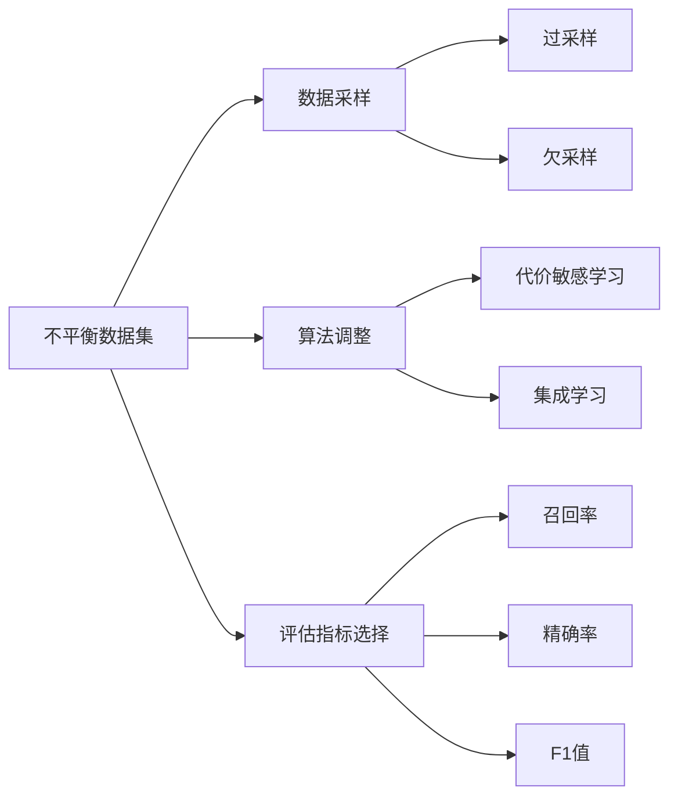

# AI系统在处理不平衡数据集时的策略

> 关键词：AI系统、不平衡数据集、处理策略、数据采样、算法调整

> 摘要：在实际的AI应用场景中，不平衡数据集是一个常见且具有挑战性的问题。不平衡数据集指的是数据集中不同类别的样本数量存在显著差异，这会导致AI模型在训练过程中偏向于多数类，而对少数类的识别和处理能力较差。本文旨在深入探讨AI系统在处理不平衡数据集时的各种策略，包括数据层面的采样方法、算法层面的调整以及评估指标的选择等。通过详细介绍这些策略的原理、实现步骤和实际应用案例，帮助读者更好地理解和应对不平衡数据集带来的挑战，提高AI模型在不平衡数据上的性能和泛化能力。

## 1. 背景介绍 
### 1.1 目的和范围
本文章的主要目的是全面介绍AI系统在处理不平衡数据集时所采用的各种策略。我们将涵盖从数据预处理到模型训练和评估的整个流程，深入分析不同策略的优缺点和适用场景。范围包括常见的数据采样方法，如过采样和欠采样；算法层面的调整，如代价敏感学习和集成学习；以及合适的评估指标选择。通过对这些策略的详细讲解，读者能够了解如何根据具体问题选择最合适的方法来提高AI模型在不平衡数据集上的性能。

### 1.2 预期读者
本文预期读者包括AI领域的研究人员、数据科学家、机器学习工程师以及对AI技术感兴趣的学生和爱好者。对于正在从事实际项目中面临不平衡数据集问题的专业人士，本文提供了实用的解决方案和实践经验；对于初学者，本文可以帮助他们建立对不平衡数据集问题的基本认识和理解。

### 1.3 文档结构概述
本文将按照以下结构进行组织：首先介绍核心概念与联系，包括不平衡数据集的定义、影响以及相关的基本概念；接着详细阐述核心算法原理和具体操作步骤，通过Python代码示例说明不同策略的实现；然后介绍数学模型和公式，并结合具体例子进行讲解；之后通过项目实战展示如何在实际应用中运用这些策略；再探讨实际应用场景；推荐相关的工具和资源；最后总结未来发展趋势与挑战，并提供常见问题解答和扩展阅读参考资料。

### 1.4 术语表
#### 1.4.1 核心术语定义
- **不平衡数据集**：指数据集中不同类别的样本数量存在显著差异的数据集。例如，在一个二分类问题中，正类样本数量远多于负类样本数量，或者反之。
- **过采样**：通过增加少数类样本的数量来平衡数据集的方法。常见的过采样技术包括随机过采样和SMOTE（Synthetic Minority Over-sampling Technique）。
- **欠采样**：通过减少多数类样本的数量来平衡数据集的方法。例如随机欠采样和Tomek Links等。
- **代价敏感学习**：在模型训练过程中，为不同类别的错误分类分配不同的代价，从而使模型更加关注少数类的分类准确性。
- **集成学习**：通过组合多个弱学习器来构建一个强学习器的方法。在处理不平衡数据集时，可以使用集成学习来提高模型的性能。

#### 1.4.2 相关概念解释
- **召回率（Recall）**：也称为敏感度，是指模型正确预测的正类样本占实际正类样本的比例。在不平衡数据集问题中，召回率对于评估模型对少数类的识别能力非常重要。
- **精确率（Precision）**：指模型正确预测的正类样本占预测为正类样本的比例。它反映了模型预测为正类的样本中有多少是真正的正类。
- **F1值**：是精确率和召回率的调和平均值，用于综合评估模型的性能。在不平衡数据集问题中，F1值比准确率更能反映模型的实际表现。

#### 1.4.3 缩略词列表
- **SMOTE**：Synthetic Minority Over-sampling Technique
- **ROC**：Receiver Operating Characteristic
- **AUC**：Area Under the Curve

## 2. 核心概念与联系 

### 不平衡数据集的影响
不平衡数据集会对AI模型的训练和性能产生显著影响。由于多数类样本数量远多于少数类样本数量，模型在训练过程中往往会更关注多数类，从而导致对少数类的分类性能较差。例如，在一个医疗诊断问题中，疾病样本（少数类）的数量可能远远少于健康样本（多数类），如果直接使用不平衡数据集进行训练，模型可能会倾向于将所有样本都预测为健康样本，从而忽略了疾病样本的存在。

### 核心概念的原理和架构示意图
下面是一个简单的示意图，展示了处理不平衡数据集的主要策略和它们之间的关系：



从图中可以看出，处理不平衡数据集主要有三个方面的策略：数据采样、算法调整和评估指标选择。数据采样包括过采样和欠采样，用于调整数据集的类别分布；算法调整包括代价敏感学习和集成学习，用于改进模型的训练过程；评估指标选择则是为了更准确地评估模型在不平衡数据集上的性能。

## 3. 核心算法原理 & 具体操作步骤 

### 过采样
#### 随机过采样
随机过采样是最简单的过采样方法，它通过随机复制少数类样本直到达到与多数类样本数量相近的水平来平衡数据集。以下是使用Python实现随机过采样的代码示例：

```python
from imblearn.over_sampling import RandomOverSampler
import numpy as np

# 示例数据集
X = np.array([[1, 2], [2, 3], [3, 4], [4, 5], [5, 6]])
y = np.array([0, 0, 0, 1, 1])

# 创建随机过采样对象
ros = RandomOverSampler(random_state=0)

# 进行过采样
X_resampled, y_resampled = ros.fit_resample(X, y)

print("原始数据集样本数量：", len(y))
print("过采样后数据集样本数量：", len(y_resampled))
```

#### SMOTE
SMOTE是一种更高级的过采样方法，它通过合成新的少数类样本来增加少数类样本的数量。具体来说，SMOTE会在少数类样本之间进行线性插值，生成新的样本。以下是使用Python实现SMOTE的代码示例：

```python
from imblearn.over_sampling import SMOTE
import numpy as np

# 示例数据集
X = np.array([[1, 2], [2, 3], [3, 4], [4, 5], [5, 6]])
y = np.array([0, 0, 0, 1, 1])

# 创建SMOTE对象
smote = SMOTE(random_state=0)

# 进行过采样
X_resampled, y_resampled = smote.fit_resample(X, y)

print("原始数据集样本数量：", len(y))
print("过采样后数据集样本数量：", len(y_resampled))
```

### 欠采样
#### 随机欠采样
随机欠采样是通过随机删除多数类样本直到达到与少数类样本数量相近的水平来平衡数据集。以下是使用Python实现随机欠采样的代码示例：

```python
from imblearn.under_sampling import RandomUnderSampler
import numpy as np

# 示例数据集
X = np.array([[1, 2], [2, 3], [3, 4], [4, 5], [5, 6]])
y = np.array([0, 0, 0, 1, 1])

# 创建随机欠采样对象
rus = RandomUnderSampler(random_state=0)

# 进行欠采样
X_resampled, y_resampled = rus.fit_resample(X, y)

print("原始数据集样本数量：", len(y))
print("欠采样后数据集样本数量：", len(y_resampled))
```

#### Tomek Links
Tomek Links是一种更复杂的欠采样方法，它通过删除多数类样本中与少数类样本距离最近的样本对来平衡数据集。以下是使用Python实现Tomek Links的代码示例：

```python
from imblearn.under_sampling import TomekLinks
import numpy as np

# 示例数据集
X = np.array([[1, 2], [2, 3], [3, 4], [4, 5], [5, 6]])
y = np.array([0, 0, 0, 1, 1])

# 创建Tomek Links对象
tl = TomekLinks()

# 进行欠采样
X_resampled, y_resampled = tl.fit_resample(X, y)

print("原始数据集样本数量：", len(y))
print("欠采样后数据集样本数量：", len(y_resampled))
```

### 代价敏感学习
代价敏感学习是在模型训练过程中为不同类别的错误分类分配不同的代价。例如，在一个二分类问题中，将少数类的错误分类代价设置得更高，从而使模型更加关注少数类的分类准确性。以下是使用Python实现代价敏感学习的代码示例：

```python
from sklearn.linear_model import LogisticRegression
import numpy as np

# 示例数据集
X = np.array([[1, 2], [2, 3], [3, 4], [4, 5], [5, 6]])
y = np.array([0, 0, 0, 1, 1])

# 创建代价敏感的逻辑回归模型
model = LogisticRegression(class_weight='balanced')

# 训练模型
model.fit(X, y)
```

### 集成学习
集成学习是通过组合多个弱学习器来构建一个强学习器。在处理不平衡数据集时，可以使用集成学习来提高模型的性能。例如，使用Bagging和Boosting算法。以下是使用Python实现基于Bagging的集成学习的代码示例：

```python
from sklearn.ensemble import BaggingClassifier
from sklearn.tree import DecisionTreeClassifier
import numpy as np

# 示例数据集
X = np.array([[1, 2], [2, 3], [3, 4], [4, 5], [5, 6]])
y = np.array([0, 0, 0, 1, 1])

# 创建Bagging分类器
bagging = BaggingClassifier(base_estimator=DecisionTreeClassifier(), n_estimators=10)

# 训练模型
bagging.fit(X, y)
```

## 4. 数学模型和公式 & 详细讲解 & 举例说明 

### 召回率、精确率和F1值
#### 召回率
召回率（Recall）也称为敏感度，它表示模型正确预测的正类样本占实际正类样本的比例。计算公式如下：

$$Recall = \frac{TP}{TP + FN}$$

其中，$TP$ 表示真正例（True Positives），即模型正确预测为正类的样本数量；$FN$ 表示假反例（False Negatives），即模型错误预测为负类的正类样本数量。

例如，在一个二分类问题中，实际正类样本有10个，模型正确预测为正类的样本有8个，错误预测为负类的正类样本有2个。则召回率为：

$$Recall = \frac{8}{8 + 2} = 0.8$$

#### 精确率
精确率（Precision）表示模型正确预测的正类样本占预测为正类样本的比例。计算公式如下：

$$Precision = \frac{TP}{TP + FP}$$

其中，$FP$ 表示假正例（False Positives），即模型错误预测为正类的负类样本数量。

例如，在上述二分类问题中，模型预测为正类的样本有10个，其中真正例有8个，假正例有2个。则精确率为：

$$Precision = \frac{8}{8 + 2} = 0.8$$

#### F1值
F1值是精确率和召回率的调和平均值，用于综合评估模型的性能。计算公式如下：

$$F1 = 2 \times \frac{Precision \times Recall}{Precision + Recall}$$

在上述例子中，精确率和召回率都为0.8，则F1值为：

$$F1 = 2 \times \frac{0.8 \times 0.8}{0.8 + 0.8} = 0.8$$

### 代价敏感学习的代价矩阵
在代价敏感学习中，需要为不同类别的错误分类分配不同的代价。通常使用代价矩阵来表示这些代价。例如，在一个二分类问题中，代价矩阵可以表示为：

$$C = \begin{bmatrix}
c_{00} & c_{01} \\
c_{10} & c_{11}
\end{bmatrix}$$

其中，$c_{ij}$ 表示将真实类别为 $i$ 的样本预测为类别 $j$ 的代价。一般来说，$c_{01}$ 和 $c_{10}$ 是需要重点关注的代价，因为它们分别表示将正类样本误判为负类样本和将负类样本误判为正类样本的代价。

例如，在一个医疗诊断问题中，将患病患者（正类）误判为健康人（负类）的代价可能非常高，因此可以将 $c_{10}$ 设置得很大；而将健康人误判为患病患者的代价相对较低，可以将 $c_{01}$ 设置得较小。

## 5. 项目实战：代码实际案例和详细解释说明 

### 5.1  开发环境搭建
在进行项目实战之前，需要搭建相应的开发环境。以下是搭建环境的步骤：

1. **安装Python**：建议安装Python 3.7及以上版本。可以从Python官方网站（https://www.python.org/downloads/）下载并安装。
2. **安装必要的库**：使用pip命令安装以下必要的库：
```bash
pip install numpy pandas scikit-learn imblearn matplotlib
```

### 5.2  源代码详细实现和代码解读
以下是一个完整的项目实战代码示例，展示了如何使用不同的策略处理不平衡数据集并评估模型的性能：

```python
import numpy as np
import pandas as pd
from sklearn.model_selection import train_test_split
from sklearn.linear_model import LogisticRegression
from sklearn.metrics import classification_report, confusion_matrix, roc_auc_score
from imblearn.over_sampling import SMOTE
from imblearn.under_sampling import RandomUnderSampler
import matplotlib.pyplot as plt

# 加载数据集
data = pd.read_csv('creditcard.csv')

# 分离特征和标签
X = data.drop('Class', axis=1)
y = data['Class']

# 划分训练集和测试集
X_train, X_test, y_train, y_test = train_test_split(X, y, test_size=0.2, random_state=42)

# 原始数据集上的模型训练和评估
model = LogisticRegression()
model.fit(X_train, y_train)
y_pred = model.predict(X_test)
print("原始数据集上的评估结果：")
print(classification_report(y_test, y_pred))
print("ROC AUC Score:", roc_auc_score(y_test, y_pred))

# 使用SMOTE进行过采样
smote = SMOTE(random_state=42)
X_train_smote, y_train_smote = smote.fit_resample(X_train, y_train)

# 过采样数据集上的模型训练和评估
model.fit(X_train_smote, y_train_smote)
y_pred_smote = model.predict(X_test)
print("过采样数据集上的评估结果：")
print(classification_report(y_test, y_pred_smote))
print("ROC AUC Score:", roc_auc_score(y_test, y_pred_smote))

# 使用随机欠采样
rus = RandomUnderSampler(random_state=42)
X_train_rus, y_train_rus = rus.fit_resample(X_train, y_train)

# 欠采样数据集上的模型训练和评估
model.fit(X_train_rus, y_train_rus)
y_pred_rus = model.predict(X_test)
print("欠采样数据集上的评估结果：")
print(classification_report(y_test, y_pred_rus))
print("ROC AUC Score:", roc_auc_score(y_test, y_pred_rus))

# 绘制混淆矩阵
def plot_confusion_matrix(cm, classes, title='Confusion matrix', cmap=plt.cm.Blues):
    plt.imshow(cm, interpolation='nearest', cmap=cmap)
    plt.title(title)
    plt.colorbar()
    tick_marks = np.arange(len(classes))
    plt.xticks(tick_marks, classes, rotation=45)
    plt.yticks(tick_marks, classes)

    thresh = cm.max() / 2.
    for i in range(cm.shape[0]):
        for j in range(cm.shape[1]):
            plt.text(j, i, format(cm[i, j], 'd'),
                     horizontalalignment="center",
                     color="white" if cm[i, j] > thresh else "black")

    plt.tight_layout()
    plt.ylabel('True label')
    plt.xlabel('Predicted label')

# 原始数据集的混淆矩阵
cm = confusion_matrix(y_test, y_pred)
plot_confusion_matrix(cm, classes=['0', '1'], title='Original Dataset Confusion Matrix')
plt.show()

# 过采样数据集的混淆矩阵
cm_smote = confusion_matrix(y_test, y_pred_smote)
plot_confusion_matrix(cm_smote, classes=['0', '1'], title='SMOTE Dataset Confusion Matrix')
plt.show()

# 欠采样数据集的混淆矩阵
cm_rus = confusion_matrix(y_test, y_pred_rus)
plot_confusion_matrix(cm_rus, classes=['0', '1'], title='Random Under Sampling Dataset Confusion Matrix')
plt.show()
```

### 5.3  代码解读与分析
1. **数据加载和预处理**：使用`pandas`库加载信用卡欺诈数据集，并分离特征和标签。然后使用`train_test_split`函数将数据集划分为训练集和测试集。
2. **原始数据集上的模型训练和评估**：使用逻辑回归模型在原始数据集上进行训练，并使用`classification_report`和`roc_auc_score`函数评估模型的性能。
3. **过采样处理**：使用`SMOTE`方法对训练集进行过采样，然后在过采样后的数据集上重新训练模型并评估性能。
4. **欠采样处理**：使用`RandomUnderSampler`方法对训练集进行欠采样，然后在欠采样后的数据集上重新训练模型并评估性能。
5. **混淆矩阵绘制**：使用`matplotlib`库绘制原始数据集、过采样数据集和欠采样数据集的混淆矩阵，直观地展示模型的分类结果。

通过比较不同数据集上的评估结果，可以看出使用过采样和欠采样方法可以显著提高模型对少数类的识别能力，从而提高模型在不平衡数据集上的整体性能。

## 6. 实际应用场景 
### 医疗诊断
在医疗诊断领域，疾病样本通常是少数类，而健康样本是多数类。例如，在癌症诊断中，患癌症的患者数量相对较少。处理不平衡数据集的策略可以帮助提高模型对癌症患者的识别准确率，从而实现早期诊断和治疗。

### 金融欺诈检测
在金融领域，欺诈交易通常是少数类，而正常交易是多数类。通过使用处理不平衡数据集的策略，可以提高模型对欺诈交易的检测能力，减少金融机构的损失。

### 网络入侵检测
在网络安全领域，网络入侵事件通常是少数类，而正常网络活动是多数类。处理不平衡数据集的策略可以帮助提高模型对网络入侵事件的检测准确率，保障网络安全。

## 7. 工具和资源推荐
### 7.1 学习资源推荐
#### 7.1.1 书籍推荐
- 《Python机器学习》：介绍了机器学习的基本概念和算法，包括处理不平衡数据集的方法。
- 《数据挖掘：概念与技术》：涵盖了数据挖掘的各个方面，包括数据预处理和不平衡数据集处理。

#### 7.1.2 在线课程
- Coursera上的“机器学习”课程：由斯坦福大学教授Andrew Ng主讲，是机器学习领域的经典课程，包含了处理不平衡数据集的相关内容。
- edX上的“数据科学微硕士项目”：提供了全面的数据科学知识和技能培训，包括不平衡数据集处理的实践。

#### 7.1.3 技术博客和网站
- Kaggle：一个数据科学竞赛平台，上面有很多关于处理不平衡数据集的优秀案例和讨论。
- Towards Data Science：一个专注于数据科学和机器学习的技术博客，有很多关于不平衡数据集处理的文章。

### 7.2 开发工具框架推荐
#### 7.2.1 IDE和编辑器
- PyCharm：一个功能强大的Python集成开发环境，提供了代码编辑、调试、版本控制等功能。
- Jupyter Notebook：一个交互式的开发环境，适合进行数据探索和模型实验。

#### 7.2.2 调试和性能分析工具
- TensorBoard：一个用于可视化深度学习模型训练过程的工具，可以帮助分析模型的性能和调试问题。
- Scikit-learn的`cross_val_score`函数：用于进行交叉验证和评估模型的性能。

#### 7.2.3 相关框架和库
- Imbalanced-learn：一个专门用于处理不平衡数据集的Python库，提供了各种采样方法和算法。
- Scikit-learn：一个广泛使用的机器学习库，包含了各种机器学习算法和工具，可用于处理不平衡数据集。

### 7.3 相关论文著作推荐
#### 7.3.1 经典论文
- 《SMOTE: Synthetic Minority Over-sampling Technique》：介绍了SMOTE过采样方法的原理和实现。
- 《Learning from Imbalanced Data》：对不平衡数据集问题进行了全面的综述和分析。

#### 7.3.2 最新研究成果
- 《Adversarial Oversampling for Imbalanced Classification》：提出了一种基于对抗学习的过采样方法。
- 《Deep Learning for Imbalanced Data Classification: A Survey》：对深度学习在处理不平衡数据集问题上的应用进行了综述。

#### 7.3.3 应用案例分析
- 《Fraud Detection in Credit Card Transactions: A Machine Learning Approach》：介绍了如何使用机器学习方法处理信用卡欺诈检测中的不平衡数据集问题。
- 《Medical Diagnosis Using Machine Learning: Addressing the Imbalanced Data Problem》：探讨了如何在医疗诊断中处理不平衡数据集问题。

## 8. 总结：未来发展趋势与挑战
### 未来发展趋势
- **深度学习的应用**：随着深度学习技术的不断发展，越来越多的研究将关注如何使用深度学习模型处理不平衡数据集。例如，通过设计专门的深度学习架构和损失函数来提高模型对少数类的识别能力。
- **集成学习的改进**：集成学习已经被证明是处理不平衡数据集的有效方法之一。未来的研究将致力于改进集成学习算法，提高模型的性能和稳定性。
- **多策略融合**：单一的处理策略可能无法完全解决不平衡数据集问题。未来的研究将探索如何将不同的策略进行融合，以获得更好的处理效果。

### 挑战
- **数据质量和多样性**：处理不平衡数据集需要大量的高质量数据。然而，在实际应用中，数据可能存在噪声、缺失值等问题，这会影响模型的性能。此外，数据的多样性也是一个挑战，不同领域的不平衡数据集具有不同的特点，需要针对性的处理方法。
- **计算资源和时间成本**：一些处理不平衡数据集的方法，如深度学习和集成学习，需要大量的计算资源和时间。在实际应用中，如何在有限的资源和时间内获得较好的处理效果是一个挑战。
- **模型可解释性**：在一些领域，如医疗和金融，模型的可解释性非常重要。然而，一些处理不平衡数据集的方法，如深度学习模型，往往缺乏可解释性。如何提高模型的可解释性是未来需要解决的问题之一。

## 9. 附录：常见问题与解答
### 1. 处理不平衡数据集时，过采样和欠采样哪个更好？
过采样和欠采样各有优缺点，选择哪种方法取决于具体的问题和数据集。过采样可以增加少数类样本的数量，从而使模型能够更好地学习少数类的特征，但可能会导致过拟合问题。欠采样可以减少多数类样本的数量，从而平衡数据集，但可能会丢失一些重要的信息。在实际应用中，可以尝试使用不同的方法并进行比较，选择性能最好的方法。

### 2. 代价敏感学习和采样方法有什么区别？
代价敏感学习是通过调整模型的训练过程，为不同类别的错误分类分配不同的代价，从而使模型更加关注少数类的分类准确性。而采样方法是通过调整数据集的类别分布来平衡数据集。代价敏感学习不需要改变数据集的样本数量，而采样方法会改变数据集的样本数量。

### 3. 如何选择合适的评估指标来评估模型在不平衡数据集上的性能？
在不平衡数据集问题中，准确率可能不是一个合适的评估指标，因为它可能会被多数类样本主导。建议使用召回率、精确率、F1值和ROC AUC等指标来评估模型的性能。这些指标可以更全面地反映模型对少数类的识别能力。

## 10. 扩展阅读 & 参考资料
- 《Imbalanced Learning: Foundations, Algorithms, and Applications》
- 《Machine Learning for Imbalanced Datasets: An Overview》
- https://scikit-learn.org/stable/modules/classes.html#module-sklearn.ensemble
- https://imbalanced-learn.org/stable/

作者：AI天才研究院/AI Genius Institute & 禅与计算机程序设计艺术 /Zen And The Art of Computer Programming