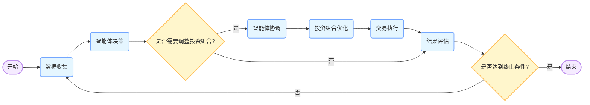

# AI赋能的约翰·伯格指数投资：多智能体优化方案

> 关键词：AI赋能、约翰·伯格指数投资、多智能体优化、指数基金、投资策略

> 摘要：本文聚焦于AI赋能的约翰·伯格指数投资多智能体优化方案。首先介绍了该方案提出的背景、目的、预期读者等信息。详细阐述了核心概念，包括约翰·伯格指数投资理念和多智能体系统，并给出了相关的架构示意图和流程图。深入讲解了核心算法原理，通过Python代码进行了详细说明，同时给出了相应的数学模型和公式，并举例说明。通过项目实战，展示了开发环境搭建、源代码实现和代码解读。探讨了该方案的实际应用场景，推荐了学习资源、开发工具框架以及相关论文著作。最后总结了未来发展趋势与挑战，还设置了常见问题解答和扩展阅读参考资料。旨在为投资者和相关研究人员提供一个全面且深入的关于AI赋能指数投资优化方案的研究。

## 1. 背景介绍 
### 1.1 目的和范围
约翰·伯格是指数基金的先驱，他倡导通过低成本的指数基金进行长期投资，以获取市场平均收益。随着人工智能技术的发展，将AI与约翰·伯格的指数投资理念相结合，可以进一步优化投资策略，提高投资收益。本方案的目的是利用多智能体系统优化约翰·伯格指数投资策略，通过多个智能体之间的协作和竞争，实现投资组合的动态调整和优化。
本方案的范围涵盖了从理论概念到实际应用的多个方面，包括核心概念的阐述、算法原理的讲解、数学模型的建立、项目实战的演示以及实际应用场景的探讨等。

### 1.2 预期读者
本文的预期读者包括对投资领域感兴趣的个人投资者、金融机构的投资经理、从事人工智能和金融交叉领域研究的科研人员以及相关专业的学生等。对于希望了解如何利用AI技术优化指数投资策略的读者具有一定的参考价值。

### 1.3 文档结构概述
本文将按照以下结构进行阐述：首先介绍相关背景信息，包括目的、预期读者和文档结构概述等；接着讲解核心概念与联系，给出相应的示意图和流程图；然后深入探讨核心算法原理和具体操作步骤，通过Python代码详细说明；建立数学模型和公式，并举例说明；进行项目实战，包括开发环境搭建、源代码实现和代码解读；分析实际应用场景；推荐相关的工具和资源；总结未来发展趋势与挑战；设置常见问题解答和扩展阅读参考资料。

### 1.4 术语表
#### 1.4.1 核心术语定义
- **约翰·伯格指数投资**：以约翰·伯格的投资理念为基础，通过投资低成本的指数基金，追求市场平均收益，避免主动管理带来的高成本和不确定性。
- **多智能体系统**：由多个智能体组成的系统，每个智能体具有一定的自主性和智能性，能够感知环境、做出决策并与其他智能体进行交互。
- **指数基金**：一种按照特定指数构成比例投资的基金，其目的是跟踪指数的表现，获取与指数相近的收益。
- **投资组合**：投资者持有的一系列资产的组合，通过合理配置不同资产，可以降低风险并提高收益。

#### 1.4.2 相关概念解释
- **AI赋能**：将人工智能技术应用于某个领域，以提高该领域的效率、质量和性能。在投资领域，AI赋能可以通过数据分析、模型预测等手段，优化投资策略。
- **智能体**：在多智能体系统中，智能体是具有感知、决策和行动能力的实体。每个智能体可以根据自身的目标和环境信息，做出相应的决策并采取行动。
- **优化方案**：针对某个问题或目标，通过一定的方法和策略，寻求最优的解决方案。在投资领域，优化方案可以是优化投资组合的配置、调整投资策略等。

#### 1.4.3 缩略词列表
- **AI**：Artificial Intelligence，人工智能
- **ETF**：Exchange Traded Fund，交易型开放式指数基金

## 2. 核心概念与联系 
### 核心概念原理
#### 约翰·伯格指数投资理念
约翰·伯格认为，大多数主动管理型基金难以长期战胜市场，而指数基金由于其低成本和广泛的市场覆盖，可以为投资者提供稳定的市场平均收益。指数基金通过复制特定指数的成分股构成，实现对市场的跟踪。投资者只需长期持有指数基金，无需进行频繁的交易和选股，就可以分享市场的增长。

#### 多智能体系统原理
多智能体系统由多个智能体组成，每个智能体具有一定的自主性和智能性。智能体可以感知环境信息，根据自身的目标和规则做出决策，并与其他智能体进行交互。在投资领域，每个智能体可以代表一个投资策略或一个投资组合，通过多个智能体之间的协作和竞争，实现投资组合的动态调整和优化。

### 架构的文本示意图
```plaintext
AI赋能的约翰·伯格指数投资多智能体优化方案架构

|-- 数据层
|   |-- 市场数据（指数价格、成交量等）
|   |-- 基金数据（基金净值、费率等）
|   |-- 宏观经济数据（GDP、利率等）
|
|-- 智能体层
|   |-- 智能体1（基于趋势分析的投资策略）
|   |-- 智能体2（基于风险评估的投资策略）
|   |-- 智能体3（基于资产配置的投资策略）
|   |--...
|
|-- 协调层
|   |-- 智能体协调器（协调智能体之间的交互和协作）
|
|-- 决策层
|   |-- 投资组合优化器（根据智能体的决策，优化投资组合）
|
|-- 执行层
|   |-- 交易执行模块（根据优化后的投资组合进行交易）
```

### Mermaid流程图


## 3. 核心算法原理 & 具体操作步骤 
### 核心算法原理
本方案采用多智能体强化学习算法来优化投资组合。每个智能体通过与环境进行交互，不断学习最优的投资策略。智能体的目标是最大化投资组合的收益，同时控制风险。

具体来说，每个智能体的决策过程可以表示为一个马尔可夫决策过程（MDP）。MDP由状态空间 $S$、动作空间 $A$、转移概率 $P$、奖励函数 $R$ 和折扣因子 $\gamma$ 组成。

- **状态空间 $S$**：包括市场数据、基金数据、宏观经济数据等，用于描述当前的投资环境。
- **动作空间 $A$**：包括买入、卖出和持有等操作，用于调整投资组合的配置。
- **转移概率 $P$**：表示在当前状态下采取某个动作后，转移到下一个状态的概率。
- **奖励函数 $R$**：根据投资组合的收益和风险，给予智能体相应的奖励。
- **折扣因子 $\gamma$**：用于权衡当前奖励和未来奖励的重要性。

智能体通过不断地尝试不同的动作，根据奖励函数的反馈来更新自己的策略，以最大化长期累积奖励。

### 具体操作步骤
#### 步骤1：数据收集
收集市场数据、基金数据和宏观经济数据等，作为智能体决策的输入。

#### 步骤2：智能体初始化
初始化每个智能体的策略和参数，例如动作价值函数 $Q(s,a)$。

#### 步骤3：智能体决策
每个智能体根据当前的状态，选择一个动作。可以采用 $\epsilon$-贪心策略，以一定的概率 $\epsilon$ 随机选择动作，以探索新的策略；以 $1 - \epsilon$ 的概率选择当前最优的动作。

#### 步骤4：环境交互
执行智能体选择的动作，更新投资组合的配置，并观察下一个状态和奖励。

#### 步骤5：策略更新
根据奖励和下一个状态，更新智能体的策略和参数。可以采用Q-learning算法，更新动作价值函数 $Q(s,a)$：

$$Q(s,a) \leftarrow Q(s,a) + \alpha [R(s,a,s') + \gamma \max_{a'} Q(s',a') - Q(s,a)]$$

其中，$\alpha$ 是学习率，$R(s,a,s')$ 是在状态 $s$ 采取动作 $a$ 转移到状态 $s'$ 时获得的奖励。

#### 步骤6：智能体协调
通过智能体协调器，协调多个智能体之间的交互和协作。例如，可以采用合作博弈的方法，让智能体之间共享信息，共同优化投资组合。

#### 步骤7：投资组合优化
根据智能体的决策，使用投资组合优化器对投资组合进行优化。可以采用均值-方差优化模型，在最大化预期收益的同时，控制投资组合的风险。

#### 步骤8：交易执行
根据优化后的投资组合，使用交易执行模块进行交易。

#### 步骤9：结果评估
评估投资组合的绩效，例如计算收益率、夏普比率等指标。根据评估结果，调整智能体的策略和参数。

### Python源代码实现
```python
import numpy as np
import random

# 定义状态空间、动作空间和折扣因子
state_space = range(10)
action_space = ['buy', 'sell', 'hold']
gamma = 0.9
alpha = 0.1
epsilon = 0.1

# 初始化Q表
Q = {s: {a: 0 for a in action_space} for s in state_space}

# 定义奖励函数
def reward_function(state, action, next_state):
    # 简单示例：买入后状态上升奖励为1，下降为-1
    if action == 'buy':
        if next_state > state:
            return 1
        else:
            return -1
    elif action == 'sell':
        if next_state < state:
            return 1
        else:
            return -1
    else:
        return 0

# 定义智能体决策函数
def agent_decision(state):
    if random.uniform(0, 1) < epsilon:
        # 随机选择动作
        action = random.choice(action_space)
    else:
        # 选择最优动作
        action = max(Q[state], key=Q[state].get)
    return action

# 定义Q-learning更新函数
def q_learning_update(state, action, next_state, reward):
    max_q_next = max(Q[next_state].values())
    Q[state][action] += alpha * (reward + gamma * max_q_next - Q[state][action])

# 模拟投资过程
num_episodes = 100
for episode in range(num_episodes):
    state = random.choice(state_space)
    done = False
    while not done:
        action = agent_decision(state)
        next_state = random.choice(state_space)
        reward = reward_function(state, action, next_state)
        q_learning_update(state, action, next_state, reward)
        state = next_state
        if random.random() < 0.1:
            done = True

# 输出最终的Q表
for s in state_space:
    print(f"State {s}: {Q[s]}")
```

## 4. 数学模型和公式 & 详细讲解 & 举例说明 
### 马尔可夫决策过程（MDP）
马尔可夫决策过程是一种用于描述智能体与环境交互的数学模型。它由状态空间 $S$、动作空间 $A$、转移概率 $P$、奖励函数 $R$ 和折扣因子 $\gamma$ 组成。

#### 状态空间 $S$
状态空间 $S$ 是一个有限或无限的集合，表示智能体在环境中可能处于的所有状态。在投资领域，状态可以包括市场数据、基金数据、宏观经济数据等。例如，$S = \{s_1, s_2, \cdots, s_n\}$，其中 $s_i$ 表示第 $i$ 个状态。

#### 动作空间 $A$
动作空间 $A$ 是一个有限或无限的集合，表示智能体在每个状态下可以采取的所有动作。在投资领域，动作可以包括买入、卖出和持有等操作。例如，$A = \{a_1, a_2, \cdots, a_m\}$，其中 $a_j$ 表示第 $j$ 个动作。

#### 转移概率 $P$
转移概率 $P(s'|s,a)$ 表示在状态 $s$ 采取动作 $a$ 后，转移到下一个状态 $s'$ 的概率。即：

$$P(s'|s,a) = Pr(S_{t+1} = s'|S_t = s, A_t = a)$$

其中，$S_t$ 表示时刻 $t$ 的状态，$A_t$ 表示时刻 $t$ 的动作。

#### 奖励函数 $R$
奖励函数 $R(s,a,s')$ 表示在状态 $s$ 采取动作 $a$ 转移到状态 $s'$ 时，智能体获得的奖励。奖励函数可以根据投资组合的收益和风险来定义。例如，$R(s,a,s')$ 可以表示投资组合在状态转移过程中的收益率。

#### 折扣因子 $\gamma$
折扣因子 $\gamma \in [0,1]$ 用于权衡当前奖励和未来奖励的重要性。$\gamma$ 越接近 1，表示智能体更注重未来的奖励；$\gamma$ 越接近 0，表示智能体更注重当前的奖励。

### 动作价值函数 $Q(s,a)$
动作价值函数 $Q(s,a)$ 表示在状态 $s$ 采取动作 $a$ 后，智能体所能获得的长期累积奖励的期望值。可以通过贝尔曼方程来计算：

$$Q(s,a) = E\left[R(s,a,S_{t+1}) + \gamma \max_{a'} Q(S_{t+1},a')\right]$$

其中，$E$ 表示期望值。

### Q-learning算法
Q-learning算法是一种基于动作价值函数的无模型强化学习算法，用于求解最优策略。其更新公式为：

$$Q(s,a) \leftarrow Q(s,a) + \alpha [R(s,a,s') + \gamma \max_{a'} Q(s',a') - Q(s,a)]$$

其中，$\alpha$ 是学习率，控制每次更新的步长。

### 举例说明
假设状态空间 $S = \{0, 1, 2\}$，动作空间 $A = \{'buy', 'sell', 'hold'\}$，折扣因子 $\gamma = 0.9$，学习率 $\alpha = 0.1$。初始时，$Q$ 表中的所有值都为 0。

在某个时刻，智能体处于状态 $s = 1$，选择动作 $a = 'buy'$，转移到状态 $s' = 2$，获得奖励 $R(1, 'buy', 2) = 1$。

根据Q-learning更新公式，更新 $Q(1, 'buy')$：

$$Q(1, 'buy) \leftarrow Q(1, 'buy) + \alpha [R(1, 'buy', 2) + \gamma \max_{a'} Q(2,a') - Q(1, 'buy)]$$

由于初始时 $Q$ 表中的所有值都为 0，所以 $\max_{a'} Q(2,a') = 0$，则：

$$Q(1, 'buy) \leftarrow 0 + 0.1 [1 + 0.9 \times 0 - 0] = 0.1$$

通过不断地重复这个过程，智能体可以学习到最优的投资策略。

## 5. 项目实战：代码实际案例和详细解释说明 
### 5.1  开发环境搭建
#### 安装Python
首先，需要安装Python环境。可以从Python官方网站（https://www.python.org/downloads/） 下载适合自己操作系统的Python版本，并按照安装向导进行安装。

#### 安装必要的库
本项目需要使用一些Python库，如NumPy、Pandas等。可以使用pip命令进行安装：

```sh
pip install numpy pandas
```

### 5.2  源代码详细实现和代码解读
```python
import numpy as np
import pandas as pd

# 模拟市场数据
def generate_market_data(num_periods):
    # 生成随机的指数价格
    prices = np.random.randn(num_periods).cumsum() + 100
    return prices

# 定义智能体类
class Agent:
    def __init__(self, state_space, action_space, gamma=0.9, alpha=0.1, epsilon=0.1):
        self.state_space = state_space
        self.action_space = action_space
        self.gamma = gamma
        self.alpha = alpha
        self.epsilon = epsilon
        # 初始化Q表
        self.Q = {s: {a: 0 for a in action_space} for s in state_space}

    def decision(self, state):
        if np.random.uniform(0, 1) < self.epsilon:
            # 随机选择动作
            action = np.random.choice(self.action_space)
        else:
            # 选择最优动作
            action = max(self.Q[state], key=self.Q[state].get)
        return action

    def update_q(self, state, action, next_state, reward):
        max_q_next = max(self.Q[next_state].values())
        self.Q[state][action] += self.alpha * (reward + self.gamma * max_q_next - self.Q[state][action])

# 定义投资组合类
class Portfolio:
    def __init__(self, initial_cash):
        self.cash = initial_cash
        self.shares = 0

    def buy(self, price, quantity):
        if self.cash >= price * quantity:
            self.cash -= price * quantity
            self.shares += quantity
            return True
        return False

    def sell(self, price, quantity):
        if self.shares >= quantity:
            self.cash += price * quantity
            self.shares -= quantity
            return True
        return False

    def value(self, price):
        return self.cash + self.shares * price

# 模拟投资过程
def simulate_investment(num_periods, initial_cash):
    # 生成市场数据
    prices = generate_market_data(num_periods)
    state_space = range(len(prices))
    action_space = ['buy', 'sell', 'hold']
    agent = Agent(state_space, action_space)
    portfolio = Portfolio(initial_cash)

    for t in range(num_periods - 1):
        state = t
        action = agent.decision(state)
        next_state = t + 1
        price = prices[state]
        next_price = prices[next_state]

        if action == 'buy':
            quantity = 1
            if portfolio.buy(price, quantity):
                reward = next_price - price
            else:
                reward = 0
        elif action == 'sell':
            quantity = 1
            if portfolio.sell(price, quantity):
                reward = price - next_price
            else:
                reward = 0
        else:
            reward = 0

        agent.update_q(state, action, next_state, reward)

    final_value = portfolio.value(prices[-1])
    return final_value

# 运行模拟
num_periods = 100
initial_cash = 1000
final_value = simulate_investment(num_periods, initial_cash)
print(f"Initial cash: {initial_cash}, Final value: {final_value}")
```

### 5.3  代码解读与分析
#### 代码结构
- `generate_market_data` 函数：用于生成模拟的市场数据，即指数价格。
- `Agent` 类：表示智能体，包含Q表的初始化、决策和Q表更新等方法。
- `Portfolio` 类：表示投资组合，包含买入、卖出和计算价值等方法。
- `simulate_investment` 函数：模拟投资过程，包括智能体决策、投资组合操作和Q表更新等。

#### 代码分析
- 首先，生成模拟的市场数据。
- 然后，初始化智能体和投资组合。
- 在每个时间步，智能体根据当前状态做出决策，投资组合根据决策进行相应的操作。
- 根据操作结果计算奖励，并更新智能体的Q表。
- 最后，计算投资组合的最终价值。

通过不断地重复这个过程，智能体可以学习到最优的投资策略，提高投资组合的收益。

## 6. 实际应用场景 
### 个人投资者
对于个人投资者来说，AI赋能的约翰·伯格指数投资多智能体优化方案可以帮助他们更好地管理投资组合。个人投资者可以使用该方案，根据自己的风险偏好和投资目标，选择合适的指数基金进行投资。通过多智能体系统的优化，可以动态调整投资组合的配置，提高投资收益。

### 金融机构
金融机构可以将该方案应用于资产管理、基金管理等业务中。例如，基金公司可以使用该方案来优化基金的投资策略，提高基金的绩效。银行可以将该方案应用于理财产品的设计和管理中，为客户提供更优质的投资服务。

### 量化投资团队
量化投资团队可以利用该方案进行量化投资策略的开发和优化。通过对大量的市场数据进行分析和挖掘，结合多智能体系统的优化，可以开发出更加有效的量化投资策略，提高投资的准确性和收益率。

## 7. 工具和资源推荐
### 7.1 学习资源推荐
#### 7.1.1 书籍推荐
- 《智能投资：人工智能与投资决策》：本书介绍了人工智能在投资领域的应用，包括机器学习、深度学习等技术在投资分析、投资组合优化等方面的应用。
- 《约翰·伯格的投资智慧》：本书详细介绍了约翰·伯格的投资理念和指数投资策略，对于理解指数投资的原理和方法具有重要的参考价值。
- 《强化学习：原理与Python实现》：本书系统地介绍了强化学习的原理和算法，并通过Python代码进行了详细的实现和讲解，对于学习多智能体强化学习算法具有重要的帮助。

#### 7.1.2 在线课程
- Coursera上的“人工智能基础”课程：该课程介绍了人工智能的基本概念、算法和应用，对于初学者来说是一个很好的入门课程。
- edX上的“机器学习”课程：该课程系统地介绍了机器学习的原理和算法，包括监督学习、无监督学习和强化学习等方面的内容。
- Udemy上的“量化投资实战”课程：该课程结合实际案例，介绍了量化投资的方法和技巧，对于希望将AI技术应用于投资领域的学习者具有一定的参考价值。

#### 7.1.3 技术博客和网站
- Medium：Medium上有很多关于人工智能和投资领域的技术博客和文章，可以帮助学习者了解最新的技术动态和研究成果。
- arXiv：arXiv是一个预印本服务器，上面有很多关于人工智能和金融领域的研究论文，可以帮助学习者深入了解相关的理论和方法。
- Towards Data Science：Towards Data Science是一个专注于数据科学和人工智能领域的技术博客，上面有很多高质量的文章和教程。

### 7.2 开发工具框架推荐
#### 7.2.1 IDE和编辑器
- PyCharm：PyCharm是一款专门用于Python开发的集成开发环境，具有代码编辑、调试、代码分析等功能，对于开发Python项目非常方便。
- Jupyter Notebook：Jupyter Notebook是一个交互式的开发环境，可以在浏览器中编写和运行代码，同时还可以插入文本、图片等元素，对于数据分析和模型实验非常有用。
- Visual Studio Code：Visual Studio Code是一款轻量级的代码编辑器，支持多种编程语言，具有丰富的插件和扩展功能，可以满足不同的开发需求。

#### 7.2.2 调试和性能分析工具
- PDB：PDB是Python自带的调试工具，可以在代码中设置断点，逐步执行代码，查看变量的值和程序的执行流程。
- cProfile：cProfile是Python自带的性能分析工具，可以分析代码的执行时间和函数调用次数，帮助开发者找出代码中的性能瓶颈。
- Py-Spy：Py-Spy是一个轻量级的性能分析工具，可以实时监测Python程序的CPU使用率和函数调用情况，对于分析Python程序的性能非常有用。

#### 7.2.3 相关框架和库
- NumPy：NumPy是Python中用于科学计算的基础库，提供了高效的多维数组对象和各种数学函数，对于处理大规模数据非常有用。
- Pandas：Pandas是Python中用于数据处理和分析的库，提供了高效的数据结构和数据操作方法，对于处理金融数据和市场数据非常方便。
- TensorFlow：TensorFlow是一个开源的机器学习框架，提供了丰富的机器学习算法和工具，对于开发深度学习模型非常有用。
- Stable Baselines3：Stable Baselines3是一个基于PyTorch的强化学习库，提供了多种强化学习算法的实现，对于开发多智能体强化学习算法非常方便。

### 7.3 相关论文著作推荐
#### 7.3.1 经典论文
- "Reinforcement Learning: An Introduction" by Richard S. Sutton and Andrew G. Barto：这本书是强化学习领域的经典著作，系统地介绍了强化学习的原理、算法和应用。
- "A Markov Decision Process Model for Portfolio Selection" by Harry M. Markowitz：这篇论文提出了均值-方差投资组合选择模型，为现代投资组合理论奠定了基础。
- "Efficient Market Hypothesis" by Eugene F. Fama：这篇论文提出了有效市场假说，对金融市场的效率和定价机制进行了深入的研究。

#### 7.3.2 最新研究成果
- "Multi-Agent Reinforcement Learning for Portfolio Optimization"：这篇论文研究了多智能体强化学习在投资组合优化中的应用，提出了一种基于合作博弈的多智能体强化学习算法。
- "AI-Enhanced Index Investing: A New Paradigm"：这篇论文探讨了AI技术在指数投资中的应用，提出了一种基于AI的指数投资优化方案。
- "Deep Reinforcement Learning in Finance"：这篇论文介绍了深度强化学习在金融领域的应用，包括投资组合优化、风险管理等方面的研究成果。

#### 7.3.3 应用案例分析
- "Case Studies in Quantitative Investing"：这本书通过实际案例，介绍了量化投资的方法和技巧，包括如何使用AI技术进行投资分析和决策。
- "AI in Asset Management: Real-World Applications"：这篇文章介绍了AI技术在资产管理领域的实际应用案例，包括如何使用机器学习算法进行资产定价和投资组合优化。
- "Quantitative Trading Strategies: Backtesting and Optimization"：这本书介绍了量化交易策略的开发和优化方法，包括如何使用历史数据进行策略回测和优化。

## 8. 总结：未来发展趋势与挑战
### 未来发展趋势
#### 更复杂的智能体模型
未来，多智能体系统中的智能体模型将变得更加复杂，不仅可以考虑市场数据和基金数据，还可以考虑宏观经济数据、政策变化等因素。智能体之间的交互和协作也将更加复杂，例如采用合作博弈、竞争博弈等方法，实现更高效的投资组合优化。

#### 与其他技术的融合
AI赋能的约翰·伯格指数投资多智能体优化方案将与其他技术，如区块链、物联网等进行融合。例如，区块链技术可以提高投资交易的透明度和安全性，物联网技术可以提供更丰富的市场数据和实时信息，从而进一步优化投资策略。

#### 个性化投资服务
随着大数据和人工智能技术的发展，未来的投资服务将更加个性化。根据投资者的风险偏好、投资目标、财务状况等因素，为投资者提供定制化的投资方案。多智能体系统可以根据投资者的个性化需求，动态调整投资组合的配置，提高投资收益。

### 挑战
#### 数据质量和安全
AI技术的应用依赖于大量的高质量数据。然而，金融市场数据往往存在噪声、缺失值等问题，数据质量的好坏直接影响到投资策略的有效性。此外，数据安全也是一个重要的问题，金融数据涉及到投资者的隐私和利益，需要采取有效的措施来保障数据的安全。

#### 模型解释性
深度学习等AI模型往往具有较高的复杂度，其决策过程难以解释。在投资领域，投资者和监管机构需要了解投资策略的决策依据和风险情况。因此，如何提高AI模型的解释性，是一个亟待解决的问题。

#### 市场不确定性
金融市场具有高度的不确定性，市场行情随时可能发生变化。即使采用了先进的AI技术和优化方案，也难以完全预测市场的走势。因此，如何在市场不确定性的情况下，保证投资策略的稳定性和有效性，是一个挑战。

## 9. 附录：常见问题与解答
### 问题1：什么是约翰·伯格指数投资？
约翰·伯格指数投资是一种以约翰·伯格的投资理念为基础的投资策略。约翰·伯格认为，大多数主动管理型基金难以长期战胜市场，而指数基金由于其低成本和广泛的市场覆盖，可以为投资者提供稳定的市场平均收益。投资者只需长期持有指数基金，无需进行频繁的交易和选股，就可以分享市场的增长。

### 问题2：多智能体系统在投资领域有什么优势？
多智能体系统在投资领域具有以下优势：
- **多样性**：多个智能体可以代表不同的投资策略和观点，通过协作和竞争，可以提高投资决策的多样性和准确性。
- **适应性**：智能体可以根据市场环境的变化，动态调整自己的策略，提高投资组合的适应性和灵活性。
- **分布式计算**：多智能体系统可以并行计算，提高投资决策的效率。

### 问题3：如何评估投资组合的绩效？
可以使用以下指标来评估投资组合的绩效：
- **收益率**：投资组合的收益率是指投资组合在一定时期内的收益与初始投资的比率。
- **夏普比率**：夏普比率是指投资组合的超额收益率与标准差的比率，用于衡量投资组合的风险调整后收益。
- **最大回撤**：最大回撤是指投资组合在一定时期内的最大亏损幅度，用于衡量投资组合的风险。

### 问题4：AI技术在投资领域的应用有哪些风险？
AI技术在投资领域的应用存在以下风险：
- **模型风险**：AI模型的性能取决于数据质量和模型结构，如果数据存在偏差或模型结构不合理，可能导致投资决策的失误。
- **市场风险**：金融市场具有高度的不确定性，即使采用了先进的AI技术，也难以完全预测市场的走势。
- **数据安全风险**：AI技术的应用依赖于大量的金融数据，数据安全问题可能导致投资者的隐私泄露和利益受损。

## 10. 扩展阅读 & 参考资料
### 扩展阅读
- 《金融科技前沿：AI与区块链在金融领域的应用》
- 《量化交易：从入门到精通》
- 《投资组合理论与实践》

### 参考资料
- 约翰·伯格. 《共同基金常识》. 机械工业出版社.
- Richard S. Sutton, Andrew G. Barto. 《Reinforcement Learning: An Introduction》. MIT Press.
- Harry M. Markowitz. "Portfolio Selection". The Journal of Finance, 1952.

作者：AI天才研究院/AI Genius Institute & 禅与计算机程序设计艺术 /Zen And The Art of Computer Programming