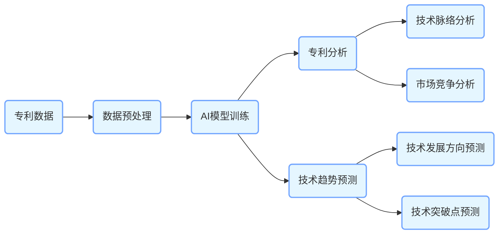

# AI辅助专利分析与技术趋势预测的方法与工具

> 关键词：AI、专利分析、技术趋势预测、方法、工具

> 摘要：本文聚焦于AI辅助专利分析与技术趋势预测的方法与工具。首先介绍了相关背景，包括目的范围、预期读者等。接着阐述核心概念及联系，分析核心算法原理与具体操作步骤，借助Python代码进行详细说明。同时给出数学模型和公式，并举例讲解。通过项目实战展示代码案例与解读。探讨了实际应用场景，推荐了学习资源、开发工具框架以及相关论文著作。最后总结未来发展趋势与挑战，还包含常见问题解答和扩展阅读参考资料，旨在为读者全面呈现AI在专利分析与技术趋势预测方面的应用。

## 1. 背景介绍 
### 1.1 目的和范围
专利作为科技创新的重要成果体现，蕴含着丰富的技术、市场和竞争信息。对专利进行有效分析以及准确预测技术趋势，有助于企业把握市场动态、制定研发策略、规避侵权风险，也能为科研机构指明研究方向。本文章的目的在于深入探讨如何利用AI技术辅助进行专利分析和技术趋势预测，涵盖从基本概念、算法原理到实际应用等多个层面，范围涉及常见的AI方法、相关工具以及具体的应用场景。

### 1.2 预期读者
本文预期读者包括科研人员，他们可以通过本文了解如何利用AI技术更好地进行专利调研和技术趋势把握，为科研项目的开展提供方向；企业的研发人员和管理人员，能够借助这些方法和工具制定更合理的研发计划和市场策略；专利代理人和律师，有助于他们更高效地进行专利检索、分析和侵权判定；以及对AI和专利分析领域感兴趣的学生和爱好者，为他们提供系统的学习资料。

### 1.3 文档结构概述
本文首先介绍核心概念与联系，清晰界定相关术语和概念，并展示其架构关系。接着阐述核心算法原理和具体操作步骤，结合Python代码详细说明。然后给出数学模型和公式，通过举例加深理解。在项目实战部分，从开发环境搭建到源代码实现和解读进行全面介绍。之后探讨实际应用场景，推荐相关的学习资源、开发工具框架和论文著作。最后总结未来发展趋势与挑战，提供常见问题解答和扩展阅读参考资料。

### 1.4 术语表
#### 1.4.1 核心术语定义
- **专利分析**：指对专利文献进行收集、整理、统计和分析，以获取有关技术、市场、竞争等方面信息的过程。
- **技术趋势预测**：基于现有的技术信息和数据，运用一定的方法和模型，对未来技术的发展方向、趋势和变化进行预测。
- **AI（人工智能）**：是一门研究如何使计算机能够模拟人类智能的学科和技术，包括机器学习、自然语言处理、计算机视觉等多个领域。

#### 1.4.2 相关概念解释
- **机器学习**：是AI的一个重要分支，它让计算机通过数据学习模式和规律，从而实现预测和决策。例如，在专利分析中，可以利用机器学习算法对专利文本进行分类和聚类。
- **自然语言处理（NLP）**：主要研究如何让计算机理解和处理人类语言。在专利分析中，NLP技术可以用于提取专利文本中的关键信息、进行语义分析等。

#### 1.4.3 缩略词列表
- **AI**：Artificial Intelligence（人工智能）
- **ML**：Machine Learning（机器学习）
- **NLP**：Natural Language Processing（自然语言处理）

## 2. 核心概念与联系 

### 核心概念原理
专利分析主要基于专利文献中的各种信息，如专利标题、摘要、权利要求书等，通过对这些文本信息以及专利的申请时间、申请人、引用关系等元数据进行挖掘和分析，来揭示技术的发展脉络、市场竞争态势等。技术趋势预测则是在专利分析的基础上，结合历史数据和行业动态，运用统计分析、机器学习等方法对未来技术的发展方向进行预估。

AI在其中的作用是利用其强大的数据处理和模式识别能力，提高专利分析的效率和准确性，以及技术趋势预测的可靠性。例如，机器学习算法可以自动对大量的专利文本进行分类、聚类和情感分析，自然语言处理技术可以提取专利文本中的关键技术术语和语义信息。

### 架构示意图


这个架构图展示了从专利数据获取到最终进行专利分析和技术趋势预测的整个流程。首先对专利数据进行预处理，然后使用预处理后的数据训练AI模型，训练好的模型分别用于专利分析和技术趋势预测，专利分析又可以细分为技术脉络分析和市场竞争分析，技术趋势预测可以分为技术发展方向预测和技术突破点预测。

## 3. 核心算法原理 & 具体操作步骤 

### 核心算法原理
在AI辅助专利分析与技术趋势预测中，常用的算法包括文本分类算法、聚类算法和时间序列分析算法。

#### 文本分类算法
文本分类算法用于将专利文本划分到不同的类别中。以朴素贝叶斯算法为例，它基于贝叶斯定理和特征条件独立假设，通过计算文本属于各个类别的概率，将文本分类到概率最大的类别中。假设 $C$ 表示类别，$x$ 表示文本的特征向量，贝叶斯定理可以表示为：

$P(C|x)=\frac{P(x|C)P(C)}{P(x)}$

其中，$P(C|x)$ 是在给定特征向量 $x$ 的情况下，文本属于类别 $C$ 的概率；$P(x|C)$ 是在类别 $C$ 下特征向量 $x$ 出现的概率；$P(C)$ 是类别 $C$ 出现的先验概率；$P(x)$ 是特征向量 $x$ 出现的概率。在实际应用中，由于 $P(x)$ 对于所有类别都是相同的，因此只需要比较 $P(x|C)P(C)$ 的大小即可。

#### 聚类算法
聚类算法用于将相似的专利文本聚合成不同的簇。以K-Means算法为例，它的基本思想是通过迭代的方式将数据点划分到 $K$ 个簇中，使得每个数据点到其所属簇的质心的距离之和最小。具体步骤如下：
1. 随机选择 $K$ 个数据点作为初始质心。
2. 计算每个数据点到各个质心的距离，将数据点划分到距离最近的质心所在的簇中。
3. 重新计算每个簇的质心。
4. 重复步骤2和3，直到质心不再发生变化或达到最大迭代次数。

#### 时间序列分析算法
时间序列分析算法用于分析专利申请数量等随时间变化的数据，以预测未来的趋势。以ARIMA（Autoregressive Integrated Moving Average）模型为例，它是一种常用的时间序列预测模型，结合了自回归（AR）、差分（I）和移动平均（MA）的思想。ARIMA模型的一般形式可以表示为：

$ARIMA(p, d, q)$

其中，$p$ 是自回归项的阶数，$d$ 是差分的阶数，$q$ 是移动平均项的阶数。

### 具体操作步骤及Python代码实现

#### 文本分类（使用朴素贝叶斯算法）
```python
import numpy as np
from sklearn.feature_extraction.text import CountVectorizer
from sklearn.naive_bayes import MultinomialNB
from sklearn.model_selection import train_test_split
from sklearn.metrics import accuracy_score

# 示例专利文本数据
corpus = [
    "This patent is about a new type of battery technology.",
    "A novel software algorithm for image processing is described in this patent.",
    "This is a patent related to a new kind of solar panel design.",
    "The patent presents a new approach to wireless communication."
]

# 对应的类别标签
labels = ["Battery", "Software", "Solar", "Communication"]

# 数据预处理：将文本转换为向量
vectorizer = CountVectorizer()
X = vectorizer.fit_transform(corpus)

# 划分训练集和测试集
X_train, X_test, y_train, y_test = train_test_split(X, labels, test_size=0.2, random_state=42)

# 训练朴素贝叶斯模型
clf = MultinomialNB()
clf.fit(X_train, y_train)

# 预测
y_pred = clf.predict(X_test)

# 计算准确率
accuracy = accuracy_score(y_test, y_pred)
print(f"Accuracy: {accuracy}")
```

#### 聚类（使用K-Means算法）
```python
from sklearn.cluster import KMeans
from sklearn.feature_extraction.text import TfidfVectorizer

# 示例专利文本数据
corpus = [
    "This patent is about a new type of battery technology.",
    "A novel software algorithm for image processing is described in this patent.",
    "This is a patent related to a new kind of solar panel design.",
    "The patent presents a new approach to wireless communication."
]

# 数据预处理：将文本转换为TF-IDF向量
vectorizer = TfidfVectorizer()
X = vectorizer.fit_transform(corpus)

# 训练K-Means模型
kmeans = KMeans(n_clusters=2, random_state=42)
kmeans.fit(X)

# 获取聚类标签
labels = kmeans.labels_
print(f"Cluster labels: {labels}")
```

#### 时间序列分析（使用ARIMA模型）
```python
import pandas as pd
from statsmodels.tsa.arima.model import ARIMA
import matplotlib.pyplot as plt

# 示例专利申请数量时间序列数据
data = [10, 12, 15, 13, 16, 18, 20, 22, 25, 23]
index = pd.date_range(start='2020-01-01', periods=len(data), freq='M')
ts = pd.Series(data, index=index)

# 训练ARIMA模型
model = ARIMA(ts, order=(1, 1, 1))
model_fit = model.fit()

# 预测未来3个月的专利申请数量
forecast = model_fit.get_forecast(steps=3)
forecast_mean = forecast.predicted_mean

# 绘制时间序列图和预测结果
plt.plot(ts, label='Original data')
plt.plot(forecast_mean, label='Forecast')
plt.legend()
plt.show()
```

## 4. 数学模型和公式 & 详细讲解 & 举例说明 

### 朴素贝叶斯算法的数学模型和公式
如前面所述，朴素贝叶斯算法基于贝叶斯定理：

$P(C|x)=\frac{P(x|C)P(C)}{P(x)}$

在实际应用中，通常假设特征向量 $x$ 中的各个特征是相互独立的，即：

$P(x|C)=\prod_{i=1}^{n}P(x_i|C)$

其中，$n$ 是特征向量 $x$ 的维度，$x_i$ 是特征向量 $x$ 的第 $i$ 个特征。

#### 举例说明
假设有两个类别 $C_1$ 和 $C_2$，以及一个文本的特征向量 $x=(x_1, x_2)$。已知：

$P(C_1)=0.6$，$P(C_2)=0.4$

$P(x_1|C_1)=0.7$，$P(x_1|C_2)=0.3$

$P(x_2|C_1)=0.8$，$P(x_2|C_2)=0.2$

则：

$P(x|C_1)=P(x_1|C_1)P(x_2|C_1)=0.7\times0.8 = 0.56$

$P(x|C_2)=P(x_1|C_2)P(x_2|C_2)=0.3\times0.2 = 0.06$

$P(x|C_1)P(C_1)=0.56\times0.6 = 0.336$

$P(x|C_2)P(C_2)=0.06\times0.4 = 0.024$

由于 $P(x|C_1)P(C_1)>P(x|C_2)P(C_2)$，因此该文本属于类别 $C_1$。

### K-Means算法的数学模型和公式
K-Means算法的目标是最小化以下目标函数：

$J=\sum_{i=1}^{n}\sum_{j=1}^{K}r_{ij}||x_i - \mu_j||^2$

其中，$n$ 是数据点的数量，$K$ 是簇的数量，$x_i$ 是第 $i$ 个数据点，$\mu_j$ 是第 $j$ 个簇的质心，$r_{ij}$ 是一个指示变量，如果数据点 $x_i$ 属于簇 $j$，则 $r_{ij}=1$，否则 $r_{ij}=0$。

#### 举例说明
假设有以下数据点：$x_1=(1, 2)$，$x_2=(2, 3)$，$x_3=(8, 9)$，$x_4=(9, 10)$，要将它们划分为 $K = 2$ 个簇。

首先随机选择两个质心，假设 $\mu_1=(1, 2)$，$\mu_2=(8, 9)$。

计算每个数据点到各个质心的距离：

$d(x_1, \mu_1)=0$，$d(x_1, \mu_2)=\sqrt{(1 - 8)^2+(2 - 9)^2}=\sqrt{49 + 49}=\sqrt{98}$

$d(x_2, \mu_1)=\sqrt{(2 - 1)^2+(3 - 2)^2}=\sqrt{1 + 1}=\sqrt{2}$，$d(x_2, \mu_2)=\sqrt{(2 - 8)^2+(3 - 9)^2}=\sqrt{36 + 36}=\sqrt{72}$

$d(x_3, \mu_1)=\sqrt{(8 - 1)^2+(9 - 2)^2}=\sqrt{49 + 49}=\sqrt{98}$，$d(x_3, \mu_2)=0$

$d(x_4, \mu_1)=\sqrt{(9 - 1)^2+(10 - 2)^2}=\sqrt{64 + 64}=\sqrt{128}$，$d(x_4, \mu_2)=\sqrt{(9 - 8)^2+(10 - 9)^2}=\sqrt{1 + 1}=\sqrt{2}$

根据距离将数据点划分到距离最近的质心所在的簇中：

簇1：$\{x_1, x_2\}$

簇2：$\{x_3, x_4\}$

重新计算每个簇的质心：

$\mu_1=\frac{x_1 + x_2}{2}=(\frac{1 + 2}{2}, \frac{2 + 3}{2})=(1.5, 2.5)$

$\mu_2=\frac{x_3 + x_4}{2}=(\frac{8 + 9}{2}, \frac{9 + 10}{2})=(8.5, 9.5)$

重复上述步骤，直到质心不再发生变化或达到最大迭代次数。

### ARIMA模型的数学模型和公式
ARIMA模型的一般形式为：

$\phi(B)(1 - B)^dY_t=\theta(B)\epsilon_t$

其中，$Y_t$ 是时间序列在时刻 $t$ 的值，$B$ 是滞后算子，$(1 - B)^d$ 表示对时间序列进行 $d$ 阶差分，$\phi(B)=1-\phi_1B-\phi_2B^2-\cdots-\phi_pB^p$ 是自回归多项式，$\theta(B)=1+\theta_1B+\theta_2B^2+\cdots+\theta_qB^q$ 是移动平均多项式，$\epsilon_t$ 是白噪声序列。

#### 举例说明
假设一个时间序列 $Y_t$ 经过一阶差分后可以用一个AR(1)模型表示，即：

$(1 - B)Y_t=\phi_1(1 - B)Y_{t - 1}+\epsilon_t$

展开可得：

$Y_t - Y_{t - 1}=\phi_1(Y_{t - 1}-Y_{t - 2})+\epsilon_t$

$Y_t=(1 + \phi_1)Y_{t - 1}-\phi_1Y_{t - 2}+\epsilon_t$

在实际应用中，可以使用历史数据估计模型的参数 $\phi_1$，然后进行预测。

## 5. 项目实战：代码实际案例和详细解释说明 

### 5.1  开发环境搭建
#### 操作系统
可以选择Windows、Linux（如Ubuntu）或macOS等主流操作系统。

#### Python环境
安装Python 3.6及以上版本。可以从Python官方网站（https://www.python.org/downloads/）下载安装包进行安装。

#### 依赖库安装
使用pip命令安装以下必要的依赖库：
```sh
pip install numpy pandas scikit-learn statsmodels matplotlib
```

### 5.2  源代码详细实现和代码解读
#### 数据获取与预处理
```python
import pandas as pd
from sklearn.feature_extraction.text import TfidfVectorizer
from sklearn.preprocessing import LabelEncoder

# 假设从CSV文件中读取专利数据
data = pd.read_csv('patent_data.csv')

# 提取专利文本和类别标签
texts = data['text'].tolist()
labels = data['label'].tolist()

# 数据预处理：将文本转换为TF-IDF向量
vectorizer = TfidfVectorizer()
X = vectorizer.fit_transform(texts)

# 对类别标签进行编码
le = LabelEncoder()
y = le.fit_transform(labels)
```
代码解读：首先使用 `pandas` 库从CSV文件中读取专利数据，然后提取专利文本和类别标签。使用 `TfidfVectorizer` 将文本转换为TF-IDF向量，这种向量表示方法可以反映文本中每个词的重要性。最后使用 `LabelEncoder` 对类别标签进行编码，将字符串类型的标签转换为整数类型，以便后续的机器学习模型处理。

#### 模型训练与评估
```python
from sklearn.model_selection import train_test_split
from sklearn.naive_bayes import MultinomialNB
from sklearn.metrics import accuracy_score

# 划分训练集和测试集
X_train, X_test, y_train, y_test = train_test_split(X, y, test_size=0.2, random_state=42)

# 训练朴素贝叶斯模型
clf = MultinomialNB()
clf.fit(X_train, y_train)

# 预测
y_pred = clf.predict(X_test)

# 计算准确率
accuracy = accuracy_score(y_test, y_pred)
print(f"Accuracy: {accuracy}")
```
代码解读：使用 `train_test_split` 函数将数据集划分为训练集和测试集，比例为8:2。然后使用 `MultinomialNB` 类创建一个朴素贝叶斯模型，并使用训练集数据进行训练。训练完成后，使用测试集数据进行预测，并计算预测结果的准确率。

### 5.3  代码解读与分析
在数据预处理阶段，将文本转换为TF-IDF向量是为了将文本数据转换为机器学习模型可以处理的数值数据。TF-IDF向量的每个元素表示一个词在文本中的重要性，通过考虑词的频率和在整个语料库中的逆文档频率，可以更好地反映词的区分能力。

在模型训练阶段，选择朴素贝叶斯模型是因为它在文本分类任务中具有简单、高效的特点。朴素贝叶斯模型基于贝叶斯定理和特征条件独立假设，通过计算文本属于各个类别的概率来进行分类。

在评估阶段，使用准确率作为评估指标，它表示预测正确的样本数占总样本数的比例。准确率是一个简单直观的评估指标，但在某些情况下可能不够全面，例如当数据集不平衡时，还可以考虑使用其他评估指标，如精确率、召回率和F1值等。

## 6. 实际应用场景 
### 企业研发决策
企业可以利用AI辅助专利分析和技术趋势预测来制定研发策略。通过分析竞争对手的专利布局，了解技术热点和空白领域，从而确定研发方向，避免重复研发和侵权风险。例如，一家智能手机制造商可以通过分析专利数据，发现新兴的显示技术或电池技术趋势，提前布局研发资源，推出具有竞争力的产品。

### 科研机构选题
科研机构可以借助这些方法和工具进行科研选题。通过对专利数据的分析，了解当前研究领域的前沿技术和发展趋势，选择具有创新性和应用前景的研究课题。例如，在生物医学领域，科研人员可以通过分析专利数据，发现新的疾病治疗方法或药物研发方向。

### 专利代理人和律师工作
专利代理人和律师在处理专利申请、侵权判定等工作时，可以利用AI技术提高工作效率和准确性。例如，在专利申请过程中，通过对专利文本的分析，检查申请的专利是否具有新颖性和创造性；在侵权判定中，通过对比专利文本和侵权产品的技术特征，快速准确地判断是否构成侵权。

### 政府政策制定
政府部门可以通过分析专利数据了解行业的技术发展水平和趋势，制定相关的产业政策和科技政策。例如，根据专利分析结果，确定重点扶持的技术领域，加大对这些领域的研发投入和政策支持，促进产业升级和科技创新。

## 7. 工具和资源推荐
### 7.1 学习资源推荐
#### 7.1.1 书籍推荐
- 《机器学习》（周志华）：这本书全面介绍了机器学习的基本概念、算法和应用，是学习机器学习的经典教材。
- 《Python自然语言处理》（Steven Bird等）：详细介绍了Python在自然语言处理领域的应用，包括文本处理、分类、聚类等内容。
- 《时间序列分析：预测与控制》（George E. P. Box等）：是时间序列分析领域的经典著作，深入讲解了时间序列分析的理论和方法。

#### 7.1.2 在线课程
- Coursera上的“机器学习”课程（Andrew Ng教授）：该课程由斯坦福大学的Andrew Ng教授授课，系统地介绍了机器学习的基本概念和算法，是学习机器学习的优质课程。
- edX上的“自然语言处理”课程：提供了自然语言处理的基础知识和实践项目，帮助学习者掌握自然语言处理的技术和应用。
- Udemy上的“时间序列分析与预测”课程：详细讲解了时间序列分析的方法和工具，通过实际案例帮助学习者掌握时间序列预测的技巧。

#### 7.1.3 技术博客和网站
- Medium：上面有很多关于AI、机器学习和专利分析的技术文章，作者来自不同的领域和背景，可以从中获取最新的技术动态和实践经验。
- arXiv：是一个开放的学术预印本平台，提供了大量关于AI和专利分析的研究论文，可以及时了解该领域的最新研究成果。
- KDnuggets：是一个专注于数据科学和机器学习的网站，提供了丰富的技术文章、教程和案例分析。

### 7.2 开发工具框架推荐
#### 7.2.1 IDE和编辑器
- PyCharm：是一款专业的Python集成开发环境，提供了代码编辑、调试、版本控制等功能，适合开发大型的Python项目。
- Jupyter Notebook：是一个交互式的开发环境，可以方便地编写和运行Python代码，同时支持可视化和文档编写，适合进行数据分析和模型训练。
- Visual Studio Code：是一款轻量级的代码编辑器，支持多种编程语言和插件扩展，具有良好的代码编辑体验和调试功能。

#### 7.2.2 调试和性能分析工具
- pdb：是Python自带的调试工具，可以在代码中设置断点，逐步执行代码，查看变量的值和程序的执行流程。
- cProfile：是Python的性能分析工具，可以分析代码的执行时间和函数调用次数，帮助找出代码中的性能瓶颈。
- TensorBoard：是TensorFlow提供的可视化工具，可以用于可视化模型的训练过程、损失函数的变化等，方便调试和优化模型。

#### 7.2.3 相关框架和库
- Scikit-learn：是一个常用的机器学习库，提供了丰富的机器学习算法和工具，包括分类、聚类、回归等算法，以及数据预处理、模型评估等功能。
- NLTK：是Python的自然语言处理库，提供了丰富的文本处理工具和语料库，包括分词、词性标注、命名实体识别等功能。
- Statsmodels：是一个用于统计建模和时间序列分析的Python库，提供了多种时间序列模型和统计检验方法。

### 7.3 相关论文著作推荐
#### 7.3.1 经典论文
- "A Probabilistic Model of Information Retrieval: Development and Comparative Experiments"（Stephen E. Robertson等）：介绍了概率信息检索模型，为文本分类和信息检索提供了理论基础。
- "K-Means++: The Advantages of Careful Seeding"（David Arthur等）：提出了K-Means++算法，改进了K-Means算法的初始质心选择方法，提高了算法的性能和稳定性。
- "Autoregressive Integrated Moving Average Models for Time Series Forecasting"（George E. P. Box等）：详细介绍了ARIMA模型的理论和应用，是时间序列分析领域的经典论文。

#### 7.3.2 最新研究成果
可以通过arXiv、IEEE Xplore、ACM Digital Library等学术数据库搜索关于AI辅助专利分析和技术趋势预测的最新研究成果。例如，一些研究探索了如何结合深度学习和图神经网络进行专利分析和技术趋势预测，取得了较好的效果。

#### 7.3.3 应用案例分析
可以参考一些行业报告和研究机构发布的应用案例分析，了解AI在专利分析和技术趋势预测中的实际应用效果。例如，一些咨询公司会发布关于特定行业的专利分析报告，分析该行业的技术发展趋势和竞争态势。

## 8. 总结：未来发展趋势与挑战
### 未来发展趋势
#### 多模态数据融合
未来的专利分析和技术趋势预测将不仅仅局限于文本数据，还会融合图像、视频等多模态数据。例如，在分析机械领域的专利时，可以结合专利中的附图进行更全面的技术分析；在分析生物医学领域的专利时，可以结合医学影像数据进行疾病诊断和治疗技术的研究。

#### 深度学习和强化学习的应用
深度学习和强化学习在AI领域取得了显著的成果，未来将更多地应用于专利分析和技术趋势预测。例如，使用深度学习模型对专利文本进行语义理解和情感分析，使用强化学习算法优化技术趋势预测的策略。

#### 跨领域融合分析
随着科技的发展，不同领域之间的交叉融合越来越明显。未来的专利分析和技术趋势预测将更加注重跨领域的融合分析，挖掘不同领域之间的潜在联系和创新机会。例如，分析人工智能和医疗健康领域的交叉专利，发现新的医疗诊断和治疗方法。

### 挑战
#### 数据质量和隐私问题
专利数据的质量参差不齐，存在噪声、错误和缺失值等问题，需要进行有效的数据清洗和预处理。同时，专利数据涉及企业的商业机密和个人隐私，如何在保证数据安全和隐私的前提下进行有效的分析是一个挑战。

#### 模型解释性问题
深度学习等复杂模型在专利分析和技术趋势预测中取得了较好的效果，但这些模型往往是黑盒模型，缺乏解释性。在实际应用中，需要对模型的预测结果进行解释，以便用户理解和信任模型的决策。

#### 技术更新换代快
AI技术发展迅速，新的算法和模型不断涌现。专利分析和技术趋势预测需要及时跟上技术的发展步伐，不断更新和优化分析方法和工具。

## 9. 附录：常见问题与解答
### 问题1：如何获取专利数据？
可以通过专利数据库如中国国家知识产权局专利数据库、美国专利商标局数据库、欧洲专利局数据库等获取专利数据。一些商业数据库如德温特世界专利索引（DWPI）、汤森路透知识产权与科学解决方案等也提供丰富的专利数据和分析工具。

### 问题2：在进行专利分析时，如何选择合适的算法？
选择合适的算法需要考虑数据的特点、分析的目的和任务。如果是文本分类任务，可以选择朴素贝叶斯、支持向量机等算法；如果是聚类任务，可以选择K-Means、DBSCAN等算法；如果是时间序列分析任务，可以选择ARIMA、LSTM等算法。同时，可以通过实验比较不同算法的性能，选择最优的算法。

### 问题3：如何评估技术趋势预测的准确性？
可以使用多种评估指标来评估技术趋势预测的准确性，如均方误差（MSE）、平均绝对误差（MAE）、平均绝对百分比误差（MAPE）等。同时，可以将预测结果与实际数据进行对比，观察预测曲线与实际曲线的拟合程度。此外，还可以邀请领域专家对预测结果进行评估和验证。

## 10. 扩展阅读 & 参考资料
- 《人工智能：现代方法》（Stuart Russell等）
- 《数据挖掘：概念与技术》（Jiawei Han等）
- 中国国家知识产权局官方网站（https://www.cnipa.gov.cn/）
- 美国专利商标局官方网站（https://www.uspto.gov/）
- 欧洲专利局官方网站（https://www.epo.org/）

作者：AI天才研究院/AI Genius Institute & 禅与计算机程序设计艺术 /Zen And The Art of Computer Programming