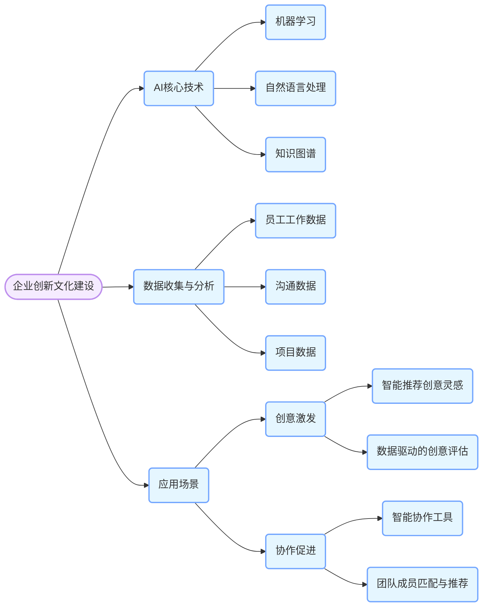

# AI辅助企业创新文化建设：激发创意与促进协作

> 关键词：AI、企业创新文化建设、创意激发、协作促进、人工智能应用

> 摘要：本文聚焦于AI在企业创新文化建设中的应用，深入探讨了如何利用AI技术激发企业员工的创意以及促进团队之间的协作。通过对AI核心概念、算法原理、数学模型的详细阐述，结合项目实战案例，分析了AI在企业创新文化建设中的具体操作和实际效果。同时，介绍了相关的应用场景、工具和资源，最后对AI在企业创新文化建设领域的未来发展趋势与挑战进行了总结。

## 1. 背景介绍 
### 1.1 目的和范围
随着科技的飞速发展，人工智能（AI）已经成为推动各行业变革的重要力量。在企业领域，创新文化建设对于企业的长期发展至关重要。本文章的目的在于探讨如何运用AI技术辅助企业进行创新文化建设，具体涵盖了利用AI激发员工创意、促进团队协作等方面。我们将深入研究AI在企业创新文化建设中的原理、方法和应用，为企业提供可行的解决方案和实践参考。

### 1.2 预期读者
本文的预期读者主要包括企业管理者、企业创新部门负责人、人力资源部门人员以及对AI在企业应用感兴趣的技术人员。企业管理者可以从中了解如何借助AI提升企业的创新能力和文化氛围；创新部门负责人可以获取激发团队创意和促进协作的具体方法；人力资源部门人员可以学习如何利用AI优化员工培训和团队建设；技术人员则可以深入研究AI相关的算法和实现细节。

### 1.3 文档结构概述
本文将按照以下结构进行阐述：首先介绍相关的核心概念与联系，明确AI在企业创新文化建设中的关键作用和相互关系；接着详细讲解核心算法原理和具体操作步骤，并给出Python源代码示例；然后介绍数学模型和公式，通过具体例子加深理解；之后通过项目实战案例，展示AI在企业创新文化建设中的实际应用和代码实现；再探讨AI在企业中的实际应用场景；推荐相关的工具和资源，包括学习资源、开发工具框架和相关论文著作；最后总结未来发展趋势与挑战，并提供常见问题与解答以及扩展阅读和参考资料。

### 1.4 术语表
#### 1.4.1 核心术语定义
- **人工智能（AI）**：是指让计算机系统能够模拟人类智能的技术，包括学习、推理、解决问题、感知和理解自然语言等能力。
- **企业创新文化建设**：是指企业通过一系列的措施和活动，营造一种鼓励创新、支持创意产生和实施的文化氛围，以提高企业的创新能力和竞争力。
- **创意激发**：是指通过各种方法和手段，促使员工产生新颖、独特的想法和解决方案。
- **协作促进**：是指采取措施提高团队成员之间的沟通、合作和协同工作的效率和效果。

#### 1.4.2 相关概念解释
- **机器学习**：是人工智能的一个重要分支，它让计算机通过数据学习模式和规律，从而进行预测和决策。在企业创新文化建设中，机器学习可以用于分析员工的行为数据，为创意激发和协作促进提供支持。
- **自然语言处理（NLP）**：是研究如何让计算机理解和处理人类语言的技术。在企业中，NLP可以用于智能客服、文本分析、知识管理等方面，促进信息的交流和共享，从而推动创新文化的建设。
- **知识图谱**：是一种用于表示实体之间关系的语义网络。在企业中，知识图谱可以整合企业内部的各种知识资源，帮助员工更好地获取和利用知识，激发创意。

#### 1.4.3 缩略词列表
- **AI**：Artificial Intelligence（人工智能）
- **ML**：Machine Learning（机器学习）
- **NLP**：Natural Language Processing（自然语言处理）

## 2. 核心概念与联系 

### 核心概念原理
在企业创新文化建设中，AI主要通过以下几个核心概念发挥作用：

#### 数据驱动的决策
AI系统可以收集和分析企业内部的各种数据，包括员工的工作数据、沟通数据、项目数据等。通过对这些数据的挖掘和分析，企业管理者可以了解员工的工作状态、创意产生的规律以及团队协作的情况，从而做出更科学的决策。例如，通过分析员工的沟通数据，发现某些团队成员之间的沟通频率较低，可能存在协作不畅的问题，管理者可以及时采取措施进行干预。

#### 智能推荐
AI可以根据员工的兴趣、技能和工作历史，为员工推荐相关的学习资源、项目机会和创意灵感。例如，一个对市场营销感兴趣的员工，AI系统可以为他推荐最新的市场营销案例和行业趋势分析，激发他的创意。同时，智能推荐还可以促进员工之间的协作，为员工推荐合适的合作伙伴。

#### 智能协作工具
AI技术可以应用于协作工具中，提供智能提醒、自动文档生成、智能会议记录等功能。这些功能可以提高团队协作的效率，减少沟通成本。例如，智能会议记录功能可以自动识别会议中的关键信息，并生成会议纪要，方便团队成员后续查看和跟进。

### 架构的文本示意图
```plaintext
企业创新文化建设
|
|-- AI核心技术
|   |-- 机器学习
|   |-- 自然语言处理
|   |-- 知识图谱
|
|-- 数据收集与分析
|   |-- 员工工作数据
|   |-- 沟通数据
|   |-- 项目数据
|
|-- 应用场景
|   |-- 创意激发
|   |   |-- 智能推荐创意灵感
|   |   |-- 数据驱动的创意评估
|   |
|   |-- 协作促进
|       |-- 智能协作工具
|       |-- 团队成员匹配与推荐
```

### Mermaid流程图


## 3. 核心算法原理 & 具体操作步骤 

### 智能推荐算法原理
智能推荐算法是AI在企业创新文化建设中用于激发创意和促进协作的重要算法之一。这里我们以基于内容的推荐算法为例进行详细讲解。

#### 算法原理
基于内容的推荐算法的核心思想是根据物品的特征和用户的偏好，为用户推荐与之匹配的物品。在企业创新文化建设中，物品可以是创意灵感、学习资源、项目机会等，用户则是企业员工。

具体步骤如下：
1. **特征提取**：对物品和用户进行特征提取。例如，对于一篇创意文章，可以提取文章的关键词、主题等特征；对于员工，可以提取员工的兴趣标签、技能标签等特征。
2. **相似度计算**：计算物品和用户特征之间的相似度。常用的相似度计算方法有余弦相似度、欧几里得距离等。
3. **推荐排序**：根据相似度得分对物品进行排序，为用户推荐相似度较高的物品。

#### Python源代码实现
```python
import numpy as np
from sklearn.feature_extraction.text import TfidfVectorizer
from sklearn.metrics.pairwise import cosine_similarity

# 示例数据：创意文章列表
articles = [
    "如何通过社交媒体提升品牌知名度",
    "创新的营销策略案例分析",
    "人工智能在企业管理中的应用"
]

# 示例数据：员工兴趣标签
employee_interests = ["市场营销", "人工智能"]

# 特征提取：使用TF-IDF向量器
vectorizer = TfidfVectorizer()
article_vectors = vectorizer.fit_transform(articles)
employee_vector = vectorizer.transform(employee_interests)

# 相似度计算：使用余弦相似度
similarities = cosine_similarity(employee_vector, article_vectors)

# 推荐排序
recommended_indices = np.argsort(similarities[0])[::-1]

# 输出推荐结果
print("推荐的创意文章：")
for index in recommended_indices:
    print(articles[index])
```

### 具体操作步骤
#### 数据准备
1. 收集企业内部的创意资源、员工信息等数据。创意资源可以包括文章、报告、案例等，员工信息可以包括兴趣爱好、技能专长等。
2. 对数据进行预处理，例如清洗、分词、提取特征等。

#### 算法选择与实现
根据企业的需求和数据特点，选择合适的推荐算法。如上述的基于内容的推荐算法，使用Python和相关的机器学习库进行实现。

#### 系统集成
将推荐算法集成到企业的创新管理系统或协作平台中，让员工可以方便地获取推荐结果。

#### 评估与优化
定期对推荐系统的效果进行评估，根据评估结果对算法和参数进行优化，提高推荐的准确性和有效性。

## 4. 数学模型和公式 & 详细讲解 & 举例说明 

### 余弦相似度公式
余弦相似度是一种常用的相似度计算方法，用于衡量两个向量之间的夹角余弦值。在基于内容的推荐算法中，我们可以使用余弦相似度来计算员工兴趣向量和创意文章向量之间的相似度。

#### 公式
给定两个向量 $\vec{A}=(a_1,a_2,\cdots,a_n)$ 和 $\vec{B}=(b_1,b_2,\cdots,b_n)$，它们的余弦相似度计算公式为：

$$
\cos(\theta)=\frac{\vec{A}\cdot\vec{B}}{\|\vec{A}\|\|\vec{B}\|}=\frac{\sum_{i=1}^{n}a_ib_i}{\sqrt{\sum_{i=1}^{n}a_i^2}\sqrt{\sum_{i=1}^{n}b_i^2}}
$$

其中，$\vec{A}\cdot\vec{B}$ 是向量 $\vec{A}$ 和 $\vec{B}$ 的点积，$\|\vec{A}\|$ 和 $\|\vec{B}\|$ 分别是向量 $\vec{A}$ 和 $\vec{B}$ 的模。

#### 详细讲解
余弦相似度的取值范围是 $[-1,1]$。当余弦相似度为 $1$ 时，表示两个向量完全相同；当余弦相似度为 $-1$ 时，表示两个向量完全相反；当余弦相似度为 $0$ 时，表示两个向量相互垂直，即没有相关性。

在基于内容的推荐算法中，我们通过计算员工兴趣向量和创意文章向量的余弦相似度，来判断文章是否符合员工的兴趣。相似度越高，说明文章越有可能被员工感兴趣。

#### 举例说明
假设我们有两个向量 $\vec{A}=(1,2,3)$ 和 $\vec{B}=(2,4,6)$。

首先计算点积：
$$
\vec{A}\cdot\vec{B}=1\times2 + 2\times4 + 3\times6 = 2 + 8 + 18 = 28
$$

然后计算向量的模：
$$
\|\vec{A}\|=\sqrt{1^2 + 2^2 + 3^2}=\sqrt{1 + 4 + 9}=\sqrt{14}
$$
$$
\|\vec{B}\|=\sqrt{2^2 + 4^2 + 6^2}=\sqrt{4 + 16 + 36}=\sqrt{56}=2\sqrt{14}
$$

最后计算余弦相似度：
$$
\cos(\theta)=\frac{\vec{A}\cdot\vec{B}}{\|\vec{A}\|\|\vec{B}\|}=\frac{28}{\sqrt{14}\times2\sqrt{14}}=\frac{28}{2\times14}=1
$$

这说明向量 $\vec{A}$ 和 $\vec{B}$ 完全相同，在推荐系统中，如果员工兴趣向量和某篇创意文章向量的余弦相似度为 $1$，则说明这篇文章完全符合员工的兴趣。

### TF-IDF公式
TF-IDF（Term Frequency-Inverse Document Frequency）是一种用于信息检索与文本挖掘的常用加权技术。在基于内容的推荐算法中，我们使用TF-IDF来提取创意文章和员工兴趣标签的特征。

#### 公式
- **词频（TF）**：指的是某一个给定的词语在该文件中出现的频率。计算公式为：

$$
TF_{t,d}=\frac{n_{t,d}}{\sum_{t'\in d}n_{t',d}}
$$

其中，$n_{t,d}$ 是词语 $t$ 在文档 $d$ 中出现的次数，$\sum_{t'\in d}n_{t',d}$ 是文档 $d$ 中所有词语出现的总次数。

- **逆文档频率（IDF）**：是一个词语普遍重要性的度量。计算公式为：

$$
IDF_{t}=\log\frac{N}{df_{t}}
$$

其中，$N$ 是文档集合中的文档总数，$df_{t}$ 是包含词语 $t$ 的文档数。

- **TF-IDF值**：是词频和逆文档频率的乘积，计算公式为：

$$
TF - IDF_{t,d}=TF_{t,d}\times IDF_{t}
$$

#### 详细讲解
TF-IDF的核心思想是，如果一个词语在某个文档中出现的频率很高，同时在其他文档中出现的频率很低，那么这个词语对于该文档来说就具有较高的重要性。通过计算TF-IDF值，我们可以提取出文档的关键特征。

#### 举例说明
假设我们有一个文档集合，包含 $N = 100$ 篇文档。其中，文档 $d$ 共有 $100$ 个词语，词语 $t$ 在文档 $d$ 中出现了 $5$ 次，而包含词语 $t$ 的文档数 $df_{t}=10$。

首先计算词频：
$$
TF_{t,d}=\frac{5}{100}=0.05
$$

然后计算逆文档频率：
$$
IDF_{t}=\log\frac{100}{10}=\log10 = 1
$$

最后计算TF-IDF值：
$$
TF - IDF_{t,d}=0.05\times1 = 0.05
$$

这说明词语 $t$ 在文档 $d$ 中的TF-IDF值为 $0.05$，可以作为文档 $d$ 的一个特征值。

## 5. 项目实战：代码实际案例和详细解释说明 

### 5.1  开发环境搭建
#### 操作系统
可以选择Windows、Linux或macOS操作系统，本案例以Windows 10为例。

#### Python环境
安装Python 3.7及以上版本。可以从Python官方网站（https://www.python.org/downloads/）下载安装包进行安装。安装完成后，配置好环境变量，确保在命令行中可以使用 `python` 和 `pip` 命令。

#### 相关库安装
使用 `pip` 命令安装所需的Python库：
```bash
pip install numpy scikit-learn
```

### 5.2  源代码详细实现和代码解读
```python
import numpy as np
from sklearn.feature_extraction.text import TfidfVectorizer
from sklearn.metrics.pairwise import cosine_similarity

# 步骤1：准备数据
# 创意文章列表
articles = [
    "如何通过社交媒体提升品牌知名度",
    "创新的营销策略案例分析",
    "人工智能在企业管理中的应用"
]

# 员工兴趣标签
employee_interests = ["市场营销", "人工智能"]

# 步骤2：特征提取
# 使用TF-IDF向量器
vectorizer = TfidfVectorizer()
# 对创意文章进行特征提取，得到文章向量
article_vectors = vectorizer.fit_transform(articles)
# 对员工兴趣标签进行特征提取，得到员工向量
employee_vector = vectorizer.transform(employee_interests)

# 步骤3：相似度计算
# 使用余弦相似度计算员工向量和文章向量之间的相似度
similarities = cosine_similarity(employee_vector, article_vectors)

# 步骤4：推荐排序
# 对相似度得分进行排序，得到推荐文章的索引
recommended_indices = np.argsort(similarities[0])[::-1]

# 步骤5：输出推荐结果
print("推荐的创意文章：")
for index in recommended_indices:
    print(articles[index])
```

### 5.3  代码解读与分析
#### 数据准备
- `articles` 列表存储了企业内部的创意文章，这些文章可以作为推荐的资源。
- `employee_interests` 列表存储了员工的兴趣标签，用于表示员工的兴趣偏好。

#### 特征提取
- `TfidfVectorizer` 是 `sklearn` 库中的一个类，用于将文本数据转换为TF-IDF特征向量。
- `fit_transform` 方法用于对创意文章进行特征提取，得到文章的TF-IDF向量。
- `transform` 方法用于对员工兴趣标签进行特征提取，得到员工的TF-IDF向量。

#### 相似度计算
- `cosine_similarity` 是 `sklearn` 库中的一个函数，用于计算两个向量之间的余弦相似度。
- `similarities` 数组存储了员工向量和文章向量之间的相似度得分。

#### 推荐排序
- `np.argsort` 是 `numpy` 库中的一个函数，用于对数组进行排序，并返回排序后的索引。
- `[::-1]` 用于将排序后的索引反转，使得相似度得分高的文章排在前面。

#### 输出推荐结果
- 通过遍历排序后的索引，输出推荐的创意文章。

## 6. 实际应用场景 
### 创意激发
#### 创意灵感推荐
企业可以使用AI系统收集各种创意资源，如行业报告、案例分析、前沿技术文章等。通过对员工的兴趣和技能进行分析，为员工推荐相关的创意灵感。例如，对于一个从事产品设计的员工，系统可以推荐最新的设计趋势和优秀的设计案例，激发他的创意。

#### 创意评估
AI可以通过对创意的文本描述进行分析，评估创意的可行性、创新性和市场潜力。例如，使用自然语言处理技术分析创意中的关键词、情感倾向等，为创意评估提供客观的依据。同时，AI还可以结合历史数据和行业标准，对创意进行打分和排名，帮助企业筛选出有价值的创意。

### 协作促进
#### 团队成员匹配
AI可以根据员工的技能、兴趣、工作风格等因素，为项目匹配最合适的团队成员。例如，一个需要开发新软件的项目，系统可以分析员工的编程技能、项目经验、沟通能力等，推荐最合适的开发人员、测试人员和项目经理，提高团队的协作效率。

#### 智能协作工具
AI技术可以应用于企业的协作工具中，提供智能提醒、自动文档生成、智能会议记录等功能。例如，智能提醒功能可以根据项目进度和任务安排，提醒团队成员按时完成任务；自动文档生成功能可以根据会议内容和讨论结果，自动生成会议纪要和项目报告；智能会议记录功能可以识别会议中的关键信息和决策，方便团队成员后续查看和跟进。

### 知识共享与传承
#### 知识图谱构建
企业可以使用AI技术构建知识图谱，整合企业内部的各种知识资源，如产品文档、技术资料、项目经验等。知识图谱可以帮助员工更好地理解企业的知识结构和关系，快速找到所需的知识。例如，员工在遇到技术问题时，可以通过知识图谱查询相关的解决方案和经验分享。

#### 智能搜索
AI可以为企业的知识管理系统提供智能搜索功能。员工可以使用自然语言进行搜索，系统可以理解员工的意图，快速定位到相关的知识资源。同时，智能搜索还可以根据员工的搜索历史和兴趣偏好，提供个性化的搜索结果。

## 7. 工具和资源推荐
### 7.1 学习资源推荐
#### 7.1.1 书籍推荐
- 《人工智能：一种现代的方法》（Artificial Intelligence: A Modern Approach）：这是一本经典的人工智能教材，涵盖了人工智能的各个领域，包括搜索算法、机器学习、自然语言处理等。
- 《Python机器学习》（Python Machine Learning）：本书详细介绍了如何使用Python进行机器学习，包括数据预处理、模型选择、算法实现等内容。
- 《自然语言处理入门》：适合初学者了解自然语言处理的基本概念和技术，包括分词、词性标注、命名实体识别等。

#### 7.1.2 在线课程
- Coursera上的“机器学习”课程：由斯坦福大学教授Andrew Ng授课，是一门非常经典的机器学习课程，涵盖了机器学习的基本概念、算法和应用。
- edX上的“人工智能基础”课程：介绍了人工智能的基本原理和方法，包括搜索、推理、学习等方面。
- 阿里云大学的“AI实战营”：提供了丰富的AI实践课程，包括机器学习、深度学习、自然语言处理等领域的实战项目。

#### 7.1.3 技术博客和网站
- 机器之心（https://www.alizila.com/）：专注于人工智能领域的技术资讯和深度报道，提供了大量的技术文章和案例分析。
- 算法之心（https://www.algorithmia.com/）：提供了各种算法和工具的介绍和使用方法，适合技术人员学习和参考。
- 开源中国（https://www.oschina.net/）：一个开源技术社区，包含了丰富的开源项目和技术文章，对AI相关的开源项目有很多介绍和讨论。

### 7.2 开发工具框架推荐
#### 7.2.1 IDE和编辑器
- PyCharm：一款专门为Python开发设计的集成开发环境，提供了丰富的代码编辑、调试、版本控制等功能，适合Python开发者使用。
- Jupyter Notebook：一个交互式的开发环境，支持多种编程语言，特别适合数据科学和机器学习的开发和实验。
- Visual Studio Code：一款轻量级的代码编辑器，支持多种编程语言和插件扩展，具有丰富的代码编辑和调试功能。

#### 7.2.2 调试和性能分析工具
- PDB：Python自带的调试器，可以帮助开发者在代码中设置断点、查看变量值等，进行代码调试。
- cProfile：Python的性能分析工具，可以分析代码的运行时间和函数调用次数，帮助开发者找出代码中的性能瓶颈。
- TensorBoard：用于可视化深度学习模型的训练过程和结果，帮助开发者监控模型的性能和参数变化。

#### 7.2.3 相关框架和库
- Scikit-learn：一个简单易用的机器学习库，提供了各种机器学习算法和工具，如分类、回归、聚类等。
- TensorFlow：一个开源的深度学习框架，广泛应用于图像识别、自然语言处理等领域，提供了丰富的深度学习模型和工具。
- PyTorch：另一个流行的深度学习框架，具有动态图的特点，易于使用和调试，适合研究和开发。

### 7.3 相关论文著作推荐
#### 7.3.1 经典论文
- 《A Logical Calculus of the Ideas Immanent in Nervous Activity》：由Warren McCulloch和Walter Pitts于1943年发表，提出了人工神经网络的第一个数学模型，为人工智能的发展奠定了基础。
- 《A Mathematical Theory of Communication》：由Claude Shannon于1948年发表，奠定了信息论的基础，对自然语言处理和机器学习等领域产生了深远的影响。
- 《Learning Representations by Back-propagating Errors》：由David Rumelhart、Geoffrey Hinton和Ronald Williams于1986年发表，介绍了反向传播算法，推动了神经网络的发展。

#### 7.3.2 最新研究成果
- 《Attention Is All You Need》：提出了Transformer架构，在自然语言处理领域取得了巨大的成功，推动了预训练模型的发展。
- 《Generative Adversarial Nets》：介绍了生成对抗网络（GAN）的概念，为图像生成、数据增强等领域提供了新的方法和思路。
- 《BERT: Pre-training of Deep Bidirectional Transformers for Language Understanding》：提出了BERT模型，在自然语言处理的多个任务中取得了领先的成绩，推动了自然语言处理技术的发展。

#### 7.3.3 应用案例分析
- 《AI in Business: Real-World Strategies for Success》：介绍了AI在企业中的各种应用案例，包括市场营销、客户服务、供应链管理等领域，为企业应用AI提供了实践参考。
- 《Artificial Intelligence for Business: The Ultimate Guide to Using AI to Drive Business Growth》：分析了AI在企业中的应用场景和商业价值，提供了企业实施AI战略的方法和步骤。

## 8. 总结：未来发展趋势与挑战
### 未来发展趋势
#### 更智能化的创意激发
未来，AI将能够更深入地理解员工的创意需求和思维模式，提供更加个性化、精准的创意激发方案。例如，通过分析员工的历史创意数据和行为模式，预测员工可能感兴趣的创意方向，并提供相关的资源和启发。

#### 全方位的协作支持
AI将不仅仅局限于团队成员匹配和智能协作工具，还将提供全方位的协作支持。例如，在团队协作过程中，AI可以实时分析团队成员的沟通和协作情况，提供实时的反馈和建议，帮助团队优化协作流程和提高协作效率。

#### 与其他技术的融合
AI将与物联网、大数据、区块链等技术深度融合，为企业创新文化建设带来更多的可能性。例如，通过物联网收集企业内部和外部的各种数据，为AI提供更丰富的信息来源；利用区块链技术保障企业知识和创意的安全和共享。

### 挑战
#### 数据隐私和安全问题
在使用AI辅助企业创新文化建设的过程中，需要收集和处理大量的员工数据和企业数据。如何保障这些数据的隐私和安全是一个重要的挑战。企业需要建立完善的数据安全管理制度，采用先进的加密技术和访问控制技术，防止数据泄露和滥用。

#### 员工接受度和培训问题
引入AI技术可能会引起员工的担忧和抵触情绪。企业需要加强对员工的培训和宣传，让员工了解AI技术的优势和作用，提高员工的接受度和使用能力。同时，企业还需要为员工提供相关的培训课程，帮助员工掌握AI技术的基本操作和应用方法。

#### 技术更新换代快
AI技术发展迅速，新的算法和模型不断涌现。企业需要不断跟踪和学习最新的技术，及时更新和优化自己的AI系统，以保持竞争力。这对企业的技术团队和管理团队提出了更高的要求。

## 9. 附录：常见问题与解答
### 问题1：AI系统的推荐结果不准确怎么办？
解答：可以从以下几个方面进行优化：
- 检查数据质量：确保创意资源和员工信息数据的准确性和完整性。
- 调整算法参数：尝试不同的相似度计算方法和推荐排序策略，找到最适合企业需求的参数。
- 增加反馈机制：让员工对推荐结果进行反馈，根据反馈结果调整推荐算法。

### 问题2：如何保障AI系统的安全性？
解答：可以采取以下措施：
- 数据加密：对企业内部的敏感数据进行加密处理，防止数据泄露。
- 访问控制：设置严格的用户权限，只有授权人员才能访问和操作AI系统。
- 定期更新和维护：及时更新AI系统的软件和补丁，修复安全漏洞。

### 问题3：AI技术会取代员工的工作吗？
解答：AI技术的主要作用是辅助员工进行创新和协作，而不是取代员工的工作。AI可以帮助员工提高工作效率、激发创意和促进协作，但员工的创造力、判断力和人际交往能力是AI无法替代的。企业应该将AI技术与员工的优势相结合，实现更好的发展。

## 10. 扩展阅读 & 参考资料
### 扩展阅读
- 《创新者的窘境》：探讨了企业在创新过程中面临的挑战和机遇，对企业创新文化建设有一定的启示作用。
- 《从0到1：开启商业与未来的秘密》：介绍了创业和创新的方法和思路，适合企业管理者和创新者阅读。
- 《人类简史：从动物到上帝》：从人类发展的角度探讨了创新和文化的演变，为企业创新文化建设提供了更广阔的视角。

### 参考资料
- 《人工智能基础教程》
- 《机器学习实战》
- 各AI技术官方文档和技术博客

作者：AI天才研究院/AI Genius Institute & 禅与计算机程序设计艺术 /Zen And The Art of Computer Programming