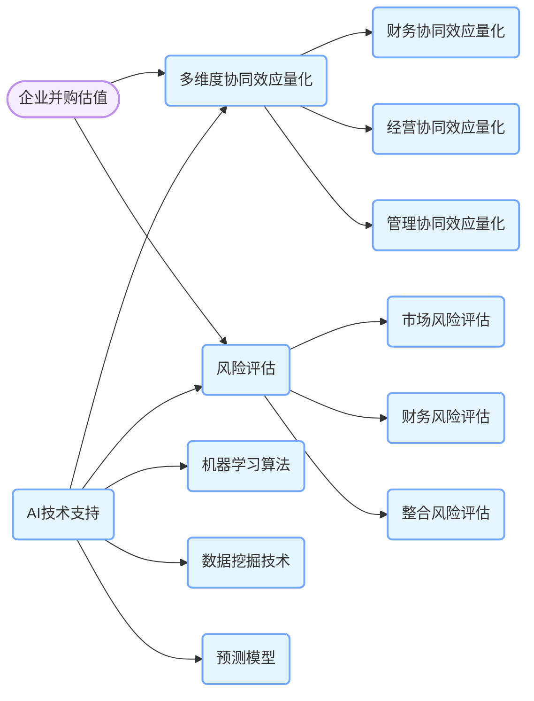

# AI辅助企业并购估值：多维度协同效应量化与风险评估

> 关键词：AI、企业并购估值、多维度协同效应量化、风险评估、机器学习算法

> 摘要：本文聚焦于AI在企业并购估值领域的应用，详细探讨了如何利用AI技术实现多维度协同效应的量化以及对并购风险的有效评估。首先介绍了研究的背景、目的和范围等基础信息，接着阐述了核心概念及其联系，分析了相关核心算法原理并给出Python代码示例，讲解了数学模型和公式，通过实际项目案例展示代码实现和解读。同时，探讨了AI在企业并购估值中的实际应用场景，推荐了学习资源、开发工具框架以及相关论文著作。最后对未来发展趋势与挑战进行总结，并提供常见问题解答和扩展阅读参考资料，旨在为企业在并购过程中利用AI技术进行准确估值和风险把控提供全面的技术指导和理论支持。

## 1. 背景介绍 
### 1.1 目的和范围
在当今竞争激烈的商业环境中，企业并购已成为企业实现快速扩张、增强市场竞争力的重要战略手段。然而，企业并购过程中的估值和风险评估是一项复杂且具有挑战性的任务。传统的估值方法往往依赖于经验和简单的财务指标，难以全面、准确地评估并购所带来的协同效应和潜在风险。本研究的目的在于探索如何利用人工智能（AI）技术，对企业并购中的多维度协同效应进行量化，并对并购风险进行科学评估，以提高企业并购决策的科学性和准确性。

本研究的范围涵盖了AI在企业并购估值中的多个方面，包括但不限于协同效应的量化方法、风险评估模型的构建、相关算法的应用以及实际项目案例的分析。通过对这些方面的研究，旨在为企业和投资者提供一套基于AI技术的企业并购估值和风险评估解决方案。

### 1.2 预期读者
本文的预期读者主要包括企业管理人员、投资银行家、财务分析师、风险管理专家以及对AI在金融领域应用感兴趣的研究人员和学生。对于企业管理人员和投资银行家来说，本文提供的方法和技术可以帮助他们在企业并购决策中做出更明智的选择；财务分析师可以利用本文的研究成果改进现有的估值模型；风险管理专家可以借鉴本文的风险评估方法，加强对并购风险的管控；研究人员和学生可以通过本文了解AI在企业并购估值领域的最新研究动态和应用实践。

### 1.3 文档结构概述
本文将按照以下结构进行组织：
- 核心概念与联系：介绍企业并购估值、多维度协同效应量化和风险评估的核心概念，并分析它们之间的联系。
- 核心算法原理 & 具体操作步骤：阐述用于协同效应量化和风险评估的核心算法原理，并给出具体的操作步骤和Python代码示例。
- 数学模型和公式 & 详细讲解 & 举例说明：介绍相关的数学模型和公式，并通过具体例子进行详细讲解。
- 项目实战：代码实际案例和详细解释说明：通过实际项目案例，展示如何使用AI技术进行企业并购估值和风险评估，并对代码进行详细解读。
- 实际应用场景：探讨AI在企业并购估值中的实际应用场景。
- 工具和资源推荐：推荐学习资源、开发工具框架以及相关论文著作。
- 总结：未来发展趋势与挑战：对AI在企业并购估值领域的未来发展趋势进行总结，并分析可能面临的挑战。
- 附录：常见问题与解答：提供常见问题的解答，帮助读者更好地理解本文的内容。
- 扩展阅读 & 参考资料：提供相关的扩展阅读材料和参考资料，方便读者进一步深入研究。

### 1.4 术语表
#### 1.4.1 核心术语定义
- **企业并购估值**：指对目标企业的价值进行评估，以确定并购交易的合理价格。
- **多维度协同效应**：指企业并购后，在财务、经营、管理等多个维度上产生的协同作用，包括成本节约、收入增长、市场份额扩大等。
- **风险评估**：指对企业并购过程中可能面临的各种风险进行识别、分析和评估，以制定相应的风险应对策略。
- **人工智能（AI）**：指计算机系统能够执行通常需要人类智能才能完成的任务，如学习、推理、解决问题等。
- **机器学习**：是AI的一个分支，它使计算机系统能够从数据中学习模式和规律，而无需明确的编程指令。

#### 1.4.2 相关概念解释
- **协同效应量化**：将多维度协同效应转化为具体的数值，以便在并购估值中进行考虑。
- **风险量化**：将企业并购风险转化为具体的数值或概率，以便进行风险评估和管理。
- **数据挖掘**：从大量数据中发现有价值的信息和知识的过程。
- **预测模型**：利用历史数据和机器学习算法构建的模型，用于预测未来的事件或结果。

#### 1.4.3 缩略词列表
- **AI**：Artificial Intelligence（人工智能）
- **ML**：Machine Learning（机器学习）
- **PCA**：Principal Component Analysis（主成分分析）
- **LSTM**：Long Short-Term Memory（长短期记忆网络）

## 2. 核心概念与联系 

### 2.1 核心概念原理

#### 2.1.1 企业并购估值
企业并购估值是企业并购过程中的核心环节，其目的是确定目标企业的合理价值。传统的估值方法主要包括资产基础法、市场法和收益法。资产基础法是基于目标企业的资产价值进行估值；市场法是通过比较目标企业与类似企业的市场交易价格来确定其价值；收益法是基于目标企业未来的收益能力进行估值。

然而，这些传统方法存在一定的局限性，例如难以考虑企业的未来增长潜力、协同效应等因素。因此，引入AI技术可以弥补这些不足，提高估值的准确性和可靠性。

#### 2.1.2 多维度协同效应量化
多维度协同效应是企业并购的重要驱动力之一。协同效应可以分为财务协同效应、经营协同效应和管理协同效应。财务协同效应主要体现在成本节约、税收优惠等方面；经营协同效应主要体现在市场份额扩大、产品线互补等方面；管理协同效应主要体现在管理效率提高、人才共享等方面。

量化多维度协同效应的关键在于确定协同效应的来源和影响因素，并建立相应的量化模型。通过AI技术，可以对大量的历史数据进行分析，挖掘协同效应的潜在规律，从而实现协同效应的准确量化。

#### 2.1.3 风险评估
企业并购过程中面临着各种风险，如市场风险、财务风险、整合风险等。风险评估的目的是识别和评估这些风险，并制定相应的风险应对策略。

传统的风险评估方法主要基于经验和主观判断，缺乏科学性和准确性。利用AI技术，可以构建风险评估模型，对风险进行量化分析，从而提高风险评估的准确性和可靠性。

### 2.2 架构的文本示意图
```plaintext
企业并购估值
|
|-- 多维度协同效应量化
|   |-- 财务协同效应量化
|   |-- 经营协同效应量化
|   |-- 管理协同效应量化
|
|-- 风险评估
|   |-- 市场风险评估
|   |-- 财务风险评估
|   |-- 整合风险评估
|
|-- AI技术支持
|   |-- 机器学习算法
|   |-- 数据挖掘技术
|   |-- 预测模型
```

### 2.3 Mermaid流程图


## 3. 核心算法原理 & 具体操作步骤 

### 3.1 核心算法原理

#### 3.1.1 主成分分析（PCA）
主成分分析是一种常用的数据降维算法，它可以将高维数据转换为低维数据，同时保留数据的主要信息。在企业并购估值中，PCA可以用于处理多维度的财务数据和经营数据，减少数据的维度，提高模型的计算效率。

PCA的基本思想是找到一组正交的方向（主成分），使得数据在这些方向上的投影方差最大。具体步骤如下：
1. 数据标准化：将原始数据进行标准化处理，使得每个特征的均值为0，方差为1。
2. 计算协方差矩阵：计算标准化后数据的协方差矩阵。
3. 计算特征值和特征向量：对协方差矩阵进行特征值分解，得到特征值和特征向量。
4. 选择主成分：根据特征值的大小选择前k个特征向量作为主成分。
5. 数据投影：将原始数据投影到主成分上，得到降维后的数据。

#### 3.1.2 长短期记忆网络（LSTM）
长短期记忆网络是一种特殊的循环神经网络（RNN），它可以有效地处理序列数据中的长期依赖关系。在企业并购估值中，LSTM可以用于预测目标企业的未来收益和现金流，从而为估值提供依据。

LSTM的核心是门控单元，包括输入门、遗忘门和输出门。输入门控制新信息的输入，遗忘门控制旧信息的遗忘，输出门控制输出信息。通过这些门控单元，LSTM可以选择性地记忆和遗忘信息，从而处理长期依赖关系。

### 3.2 具体操作步骤

#### 3.2.1 PCA的Python实现
```python
import numpy as np
from sklearn.preprocessing import StandardScaler
from sklearn.decomposition import PCA

# 生成示例数据
X = np.array([[1, 2, 3], [4, 5, 6], [7, 8, 9], [10, 11, 12]])

# 数据标准化
scaler = StandardScaler()
X_scaled = scaler.fit_transform(X)

# 创建PCA对象
pca = PCA(n_components=2)

# 拟合数据并进行降维
X_pca = pca.fit_transform(X_scaled)

print("降维后的数据：")
print(X_pca)
```

#### 3.2.2 LSTM的Python实现
```python
import numpy as np
from keras.models import Sequential
from keras.layers import LSTM, Dense

# 生成示例数据
data = np.array([i for i in range(100)])
X = []
y = []
for i in range(len(data) - 10):
    X.append(data[i:i+10])
    y.append(data[i+10])
X = np.array(X)
y = np.array(y)

# 数据重塑
X = np.reshape(X, (X.shape[0], X.shape[1], 1))

# 创建LSTM模型
model = Sequential()
model.add(LSTM(50, activation='relu', input_shape=(10, 1)))
model.add(Dense(1))
model.compile(optimizer='adam', loss='mse')

# 训练模型
model.fit(X, y, epochs=100, verbose=0)

# 预测
test_input = np.array(data[-10:])
test_input = test_input.reshape((1, 10, 1))
prediction = model.predict(test_input)

print("预测结果：")
print(prediction)
```

## 4. 数学模型和公式 & 详细讲解 & 举例说明 

### 4.1 主成分分析（PCA）的数学模型和公式

#### 4.1.1 数据标准化
设原始数据矩阵为 $X = [x_{ij}]_{n\times p}$，其中 $n$ 是样本数量，$p$ 是特征数量。数据标准化的公式为：
$$
\tilde{x}_{ij} = \frac{x_{ij} - \bar{x}_j}{s_j}
$$
其中 $\bar{x}_j$ 是第 $j$ 个特征的均值，$s_j$ 是第 $j$ 个特征的标准差。

#### 4.1.2 协方差矩阵
标准化后数据的协方差矩阵为：
$$
S = \frac{1}{n - 1} \sum_{i = 1}^{n} (\tilde{x}_i - \bar{\tilde{x}})(\tilde{x}_i - \bar{\tilde{x}})^T
$$
其中 $\tilde{x}_i$ 是第 $i$ 个样本的标准化向量，$\bar{\tilde{x}}$ 是标准化后数据的均值向量。

#### 4.1.3 特征值和特征向量
对协方差矩阵 $S$ 进行特征值分解，得到特征值 $\lambda_1 \geq \lambda_2 \geq \cdots \geq \lambda_p$ 和对应的特征向量 $u_1, u_2, \cdots, u_p$。

#### 4.1.4 主成分选择
选择前 $k$ 个特征向量 $u_1, u_2, \cdots, u_k$ 作为主成分，其中 $k < p$。

#### 4.1.5 数据投影
将标准化后的数据 $\tilde{X}$ 投影到主成分上，得到降维后的数据 $Z$：
$$
Z = \tilde{X}U_k
$$
其中 $U_k = [u_1, u_2, \cdots, u_k]$。

#### 4.1.6 举例说明
假设有一组二维数据 $X = \begin{bmatrix} 1 & 2 \\ 3 & 4 \\ 5 & 6 \\ 7 & 8 \end{bmatrix}$，首先进行数据标准化：
```python
import numpy as np
from sklearn.preprocessing import StandardScaler

X = np.array([[1, 2], [3, 4], [5, 6], [7, 8]])
scaler = StandardScaler()
X_scaled = scaler.fit_transform(X)
print("标准化后的数据：")
print(X_scaled)
```
然后计算协方差矩阵：
```python
S = np.cov(X_scaled.T)
print("协方差矩阵：")
print(S)
```
接着进行特征值分解：
```python
eigenvalues, eigenvectors = np.linalg.eig(S)
print("特征值：")
print(eigenvalues)
print("特征向量：")
print(eigenvectors)
```
假设选择前1个主成分，进行数据投影：
```python
U_1 = eigenvectors[:, 0].reshape(-1, 1)
Z = np.dot(X_scaled, U_1)
print("降维后的数据：")
print(Z)
```

### 4.2 长短期记忆网络（LSTM）的数学模型和公式

#### 4.2.1 遗忘门
遗忘门决定了上一时刻的细胞状态 $C_{t - 1}$ 中有多少信息需要被遗忘。遗忘门的输出 $f_t$ 计算公式为：
$$
f_t = \sigma(W_f[h_{t - 1}, x_t] + b_f)
$$
其中 $\sigma$ 是 sigmoid 函数，$W_f$ 是遗忘门的权重矩阵，$b_f$ 是遗忘门的偏置向量，$h_{t - 1}$ 是上一时刻的隐藏状态，$x_t$ 是当前时刻的输入。

#### 4.2.2 输入门
输入门决定了当前时刻的输入 $x_t$ 中有多少信息需要被加入到细胞状态中。输入门的输出 $i_t$ 计算公式为：
$$
i_t = \sigma(W_i[h_{t - 1}, x_t] + b_i)
$$
其中 $W_i$ 是输入门的权重矩阵，$b_i$ 是输入门的偏置向量。

同时，计算候选细胞状态 $\tilde{C}_t$：
$$
\tilde{C}_t = \tanh(W_C[h_{t - 1}, x_t] + b_C)
$$
其中 $W_C$ 是候选细胞状态的权重矩阵，$b_C$ 是候选细胞状态的偏置向量。

#### 4.2.3 细胞状态更新
根据遗忘门和输入门的输出，更新细胞状态 $C_t$：
$$
C_t = f_t \odot C_{t - 1} + i_t \odot \tilde{C}_t
$$
其中 $\odot$ 表示元素-wise 乘法。

#### 4.2.4 输出门
输出门决定了当前时刻的细胞状态 $C_t$ 中有多少信息需要被输出到隐藏状态 $h_t$ 中。输出门的输出 $o_t$ 计算公式为：
$$
o_t = \sigma(W_o[h_{t - 1}, x_t] + b_o)
$$
其中 $W_o$ 是输出门的权重矩阵，$b_o$ 是输出门的偏置向量。

当前时刻的隐藏状态 $h_t$ 计算公式为：
$$
h_t = o_t \odot \tanh(C_t)
$$

#### 4.2.5 举例说明
假设有一个简单的序列数据 $[1, 2, 3, 4, 5]$，我们可以使用LSTM来预测下一个值。
```python
import numpy as np
from keras.models import Sequential
from keras.layers import LSTM, Dense

data = np.array([1, 2, 3, 4, 5])
X = []
y = []
for i in range(len(data) - 2):
    X.append(data[i:i+2])
    y.append(data[i+2])
X = np.array(X)
y = np.array(y)

# 数据重塑
X = np.reshape(X, (X.shape[0], X.shape[1], 1))

# 创建LSTM模型
model = Sequential()
model.add(LSTM(50, activation='relu', input_shape=(2, 1)))
model.add(Dense(1))
model.compile(optimizer='adam', loss='mse')

# 训练模型
model.fit(X, y, epochs=100, verbose=0)

# 预测
test_input = np.array(data[-2:])
test_input = test_input.reshape((1, 2, 1))
prediction = model.predict(test_input)

print("预测结果：")
print(prediction)
```

## 5. 项目实战：代码实际案例和详细解释说明 

### 5.1  开发环境搭建
为了实现AI辅助企业并购估值的项目，我们需要搭建相应的开发环境。以下是具体的搭建步骤：

#### 5.1.1 安装Python
Python是一种广泛使用的编程语言，在数据科学和机器学习领域有着丰富的库和工具。我们可以从Python官方网站（https://www.python.org/downloads/） 下载并安装Python 3.x版本。

#### 5.1.2 安装必要的库
我们需要安装一些常用的Python库，如NumPy、Pandas、Scikit-learn、Keras等。可以使用pip命令进行安装：
```sh
pip install numpy pandas scikit-learn keras
```

#### 5.1.3 安装开发工具
推荐使用Jupyter Notebook或PyCharm作为开发工具。Jupyter Notebook是一个交互式的开发环境，适合进行数据探索和模型实验；PyCharm是一个专业的Python集成开发环境，适合进行大规模项目的开发和调试。

### 5.2  源代码详细实现和代码解读

#### 5.2.1 数据准备
首先，我们需要准备企业并购相关的数据，包括财务数据、经营数据、市场数据等。假设我们已经将数据存储在CSV文件中，可以使用Pandas库进行数据读取和处理。
```python
import pandas as pd

# 读取数据
data = pd.read_csv('merger_data.csv')

# 数据预处理
# 处理缺失值
data = data.dropna()

# 提取特征和标签
X = data.drop('target_variable', axis=1)
y = data['target_variable']
```
代码解读：
- `pd.read_csv('merger_data.csv')`：使用Pandas的`read_csv`函数读取CSV文件中的数据。
- `data.dropna()`：删除数据中的缺失值。
- `data.drop('target_variable', axis=1)`：从数据中删除目标变量列，得到特征矩阵`X`。
- `data['target_variable']`：提取目标变量列，得到标签向量`y`。

#### 5.2.2 特征工程
使用主成分分析（PCA）对特征进行降维处理。
```python
from sklearn.preprocessing import StandardScaler
from sklearn.decomposition import PCA

# 数据标准化
scaler = StandardScaler()
X_scaled = scaler.fit_transform(X)

# 创建PCA对象
pca = PCA(n_components=0.95)

# 拟合数据并进行降维
X_pca = pca.fit_transform(X_scaled)
```
代码解读：
- `StandardScaler()`：创建一个数据标准化对象。
- `scaler.fit_transform(X)`：对特征矩阵`X`进行标准化处理。
- `PCA(n_components=0.95)`：创建一个PCA对象，保留95%的方差。
- `pca.fit_transform(X_scaled)`：对标准化后的特征矩阵`X_scaled`进行降维处理。

#### 5.2.3 模型训练
使用长短期记忆网络（LSTM）进行模型训练。
```python
from keras.models import Sequential
from keras.layers import LSTM, Dense
from sklearn.model_selection import train_test_split

# 划分训练集和测试集
X_train, X_test, y_train, y_test = train_test_split(X_pca, y, test_size=0.2, random_state=42)

# 数据重塑
X_train = np.reshape(X_train, (X_train.shape[0], X_train.shape[1], 1))
X_test = np.reshape(X_test, (X_test.shape[0], X_test.shape[1], 1))

# 创建LSTM模型
model = Sequential()
model.add(LSTM(50, activation='relu', input_shape=(X_train.shape[1], 1)))
model.add(Dense(1))
model.compile(optimizer='adam', loss='mse')

# 训练模型
model.fit(X_train, y_train, epochs=100, batch_size=32, validation_data=(X_test, y_test))
```
代码解读：
- `train_test_split(X_pca, y, test_size=0.2, random_state=42)`：将降维后的特征矩阵`X_pca`和标签向量`y`划分为训练集和测试集，测试集占比为20%。
- `np.reshape(X_train, (X_train.shape[0], X_train.shape[1], 1))`：将训练集和测试集的数据重塑为LSTM模型所需的三维格式。
- `Sequential()`：创建一个Sequential模型。
- `model.add(LSTM(50, activation='relu', input_shape=(X_train.shape[1], 1)))`：添加一个LSTM层，包含50个神经元，激活函数为ReLU。
- `model.add(Dense(1))`：添加一个全连接层，输出一个值。
- `model.compile(optimizer='adam', loss='mse')`：编译模型，使用Adam优化器和均方误差损失函数。
- `model.fit(X_train, y_train, epochs=100, batch_size=32, validation_data=(X_test, y_test))`：训练模型，训练100个epoch，批量大小为32，并使用测试集进行验证。

#### 5.2.4 模型评估
使用测试集对模型进行评估。
```python
from sklearn.metrics import mean_squared_error

# 预测
y_pred = model.predict(X_test)

# 计算均方误差
mse = mean_squared_error(y_test, y_pred)
print("均方误差：", mse)
```
代码解读：
- `model.predict(X_test)`：使用训练好的模型对测试集进行预测。
- `mean_squared_error(y_test, y_pred)`：计算预测值和真实值之间的均方误差。

### 5.3  代码解读与分析
通过以上代码，我们实现了一个基于AI的企业并购估值模型。具体分析如下：
- **数据准备**：对企业并购相关的数据进行读取和预处理，包括处理缺失值和提取特征和标签。
- **特征工程**：使用主成分分析（PCA）对特征进行降维处理，减少数据的维度，提高模型的计算效率。
- **模型训练**：使用长短期记忆网络（LSTM）进行模型训练，LSTM可以有效地处理序列数据中的长期依赖关系，适合用于预测企业的未来收益和现金流。
- **模型评估**：使用均方误差（MSE）对模型进行评估，MSE越小，说明模型的预测效果越好。

在实际应用中，我们可以根据具体情况调整模型的参数和结构，以提高模型的性能。同时，还可以使用更多的特征和数据进行训练，以提高模型的准确性和可靠性。

## 6. 实际应用场景 
### 6.1 企业战略决策
在企业进行并购决策时，AI辅助的企业并购估值和风险评估可以为企业提供科学的依据。通过对多维度协同效应的量化和风险评估，企业可以更准确地评估目标企业的价值和并购的潜在收益，从而做出更明智的决策。例如，企业可以根据协同效应的量化结果，选择最具潜力的并购目标，实现资源的优化配置和战略的协同发展。

### 6.2 投资银行服务
投资银行在企业并购交易中扮演着重要的角色。AI技术可以帮助投资银行提高估值和风险评估的准确性和效率，为客户提供更优质的服务。投资银行可以利用AI模型对目标企业进行全面的分析和评估，制定合理的并购方案和定价策略，从而提高交易的成功率和客户的满意度。

### 6.3 金融监管
金融监管机构可以利用AI技术对企业并购活动进行监测和评估，防范金融风险。通过对并购交易的估值和风险进行分析，监管机构可以及时发现潜在的风险点，采取相应的监管措施，维护金融市场的稳定和健康发展。

### 6.4 学术研究
AI在企业并购估值领域的应用为学术研究提供了新的视角和方法。学者们可以利用AI技术对企业并购的协同效应和风险进行深入研究，探索新的理论和模型，为企业并购实践提供理论支持和指导。

## 7. 工具和资源推荐
### 7.1 学习资源推荐
#### 7.1.1 书籍推荐
- 《Python机器学习》：介绍了Python在机器学习领域的应用，包括数据处理、模型训练和评估等方面的知识。
- 《深度学习》：深度学习领域的经典著作，详细介绍了深度学习的原理和应用。
- 《企业并购估值与案例》：专门介绍企业并购估值的方法和案例，对实际应用具有很强的指导意义。

#### 7.1.2 在线课程
- Coursera上的“机器学习”课程：由斯坦福大学教授Andrew Ng主讲，是机器学习领域的经典课程。
- edX上的“深度学习”课程：由知名学者和专家授课，深入讲解深度学习的理论和实践。
- Udemy上的“企业并购估值实战”课程：结合实际案例，介绍企业并购估值的方法和技巧。

#### 7.1.3 技术博客和网站
- Towards Data Science：一个专注于数据科学和机器学习的技术博客，提供了大量的优质文章和教程。
- Kaggle：一个数据科学竞赛平台，上面有很多关于企业并购估值和风险评估的数据集和解决方案。
- Medium：一个综合性的技术博客平台，有很多关于AI在金融领域应用的文章。

### 7.2 开发工具框架推荐
#### 7.2.1 IDE和编辑器
- Jupyter Notebook：一个交互式的开发环境，适合进行数据探索和模型实验。
- PyCharm：一个专业的Python集成开发环境，适合进行大规模项目的开发和调试。
- Visual Studio Code：一个轻量级的代码编辑器，支持多种编程语言和插件扩展。

#### 7.2.2 调试和性能分析工具
- TensorBoard：一个用于可视化深度学习模型训练过程和性能的工具。
- Py-Spy：一个用于分析Python代码性能的工具，可以帮助我们找出代码中的瓶颈。
- Memory Profiler：一个用于分析Python代码内存使用情况的工具，可以帮助我们优化代码的内存占用。

#### 7.2.3 相关框架和库
- NumPy：一个用于科学计算的Python库，提供了高效的数组操作和数学函数。
- Pandas：一个用于数据处理和分析的Python库，提供了丰富的数据结构和数据操作方法。
- Scikit-learn：一个用于机器学习的Python库，提供了各种机器学习算法和工具。
- Keras：一个用于深度学习的Python库，提供了简单易用的API，适合快速搭建深度学习模型。

### 7.3 相关论文著作推荐
#### 7.3.1 经典论文
- “Measuring the Synergistic Benefits of Mergers”：该论文提出了一种测量企业并购协同效应的方法，对协同效应的量化研究具有重要的参考价值。
- “Risk Assessment in Mergers and Acquisitions”：该论文介绍了企业并购风险评估的方法和模型，为风险评估提供了理论基础。
- “Machine Learning in Finance: Applications and Challenges”：该论文探讨了机器学习在金融领域的应用和挑战，对AI在企业并购估值中的应用具有指导意义。

#### 7.3.2 最新研究成果
- 关注顶级学术期刊如《Journal of Financial Economics》、《Review of Financial Studies》等，这些期刊上经常发表关于企业并购估值和AI应用的最新研究成果。
- 参加国际学术会议如ACM SIGKDD、NeurIPS等，这些会议上有很多关于数据科学和机器学习的最新研究报告。

#### 7.3.3 应用案例分析
- 研究一些知名企业的并购案例，如阿里巴巴并购饿了么、腾讯并购Supercell等，分析AI在这些并购案例中的应用和效果。
- 关注行业研究报告和咨询机构的分析报告，了解AI在企业并购估值领域的实际应用情况和发展趋势。

## 8. 总结：未来发展趋势与挑战
### 8.1 未来发展趋势
#### 8.1.1 多技术融合
未来，AI在企业并购估值中的应用将不仅仅局限于机器学习和深度学习，还将与其他技术如区块链、物联网等进行融合。例如，区块链技术可以提供更安全、可信的数据存储和共享平台，物联网技术可以提供更丰富的企业运营数据，从而提高估值和风险评估的准确性和可靠性。

#### 8.1.2 智能化决策支持系统
随着AI技术的不断发展，智能化决策支持系统将在企业并购估值中得到更广泛的应用。这些系统可以根据企业的需求和数据，自动生成估值报告和风险评估建议，为企业决策提供更智能、高效的支持。

#### 8.1.3 行业应用深化
AI在企业并购估值中的应用将逐渐从金融行业向其他行业拓展，如制造业、医疗行业、能源行业等。不同行业的企业并购具有不同的特点和需求，AI技术可以根据行业特点进行定制化应用，提高估值和风险评估的针对性和有效性。

### 8.2 挑战
#### 8.2.1 数据质量和隐私问题
AI模型的训练和应用依赖于大量的数据，数据的质量和隐私问题是制约AI在企业并购估值中应用的重要因素。数据质量不高可能导致模型的准确性下降，数据隐私泄露可能会给企业带来法律风险和声誉损失。因此，如何保证数据的质量和隐私是未来需要解决的重要问题。

#### 8.2.2 模型解释性问题
AI模型尤其是深度学习模型往往是黑箱模型，难以解释其决策过程和结果。在企业并购估值中，模型的解释性非常重要，因为决策者需要了解估值和风险评估的依据。因此，如何提高AI模型的解释性是未来需要研究的重要方向。

#### 8.2.3 人才短缺问题
AI技术的应用需要具备专业知识和技能的人才，目前市场上这类人才相对短缺。企业和研究机构需要加强人才培养和引进，提高自身的技术水平和创新能力，以应对AI在企业并购估值中的应用挑战。

## 9. 附录：常见问题与解答
### 9.1 什么是协同效应？
协同效应是指企业并购后，通过整合资源、优化业务流程等方式，实现的整体效益大于各部分效益之和的效果。协同效应可以分为财务协同效应、经营协同效应和管理协同效应。

### 9.2 为什么要进行风险评估？
企业并购过程中面临着各种风险，如市场风险、财务风险、整合风险等。进行风险评估可以帮助企业识别和评估这些风险，制定相应的风险应对策略，降低并购失败的概率，提高并购的成功率和收益。

### 9.3 AI在企业并购估值中的优势是什么？
AI在企业并购估值中的优势主要体现在以下几个方面：
- 能够处理大量的数据，挖掘数据中的潜在信息和规律，提高估值的准确性和可靠性。
- 可以自动学习和适应数据的变化，不断优化模型的性能，提高估值的效率和灵活性。
- 可以实现多维度协同效应的量化和风险评估，为企业决策提供更全面、科学的依据。

### 9.4 如何选择合适的AI算法？
选择合适的AI算法需要考虑以下几个因素：
- 数据的特点：不同的算法适用于不同类型的数据，如序列数据适合使用LSTM算法，高维数据适合使用PCA算法。
- 问题的类型：根据问题的类型选择合适的算法，如分类问题可以使用决策树、支持向量机等算法，回归问题可以使用线性回归、神经网络等算法。
- 模型的性能：比较不同算法的性能指标，如准确率、召回率、均方误差等，选择性能最优的算法。

### 9.5 如何评估AI模型的性能？
评估AI模型的性能可以使用以下几种方法：
- 划分训练集和测试集：将数据集划分为训练集和测试集，使用训练集训练模型，使用测试集评估模型的性能。
- 交叉验证：将数据集分成多个子集，轮流使用不同的子集作为测试集，其余子集作为训练集，多次训练和评估模型，取平均性能作为最终结果。
- 使用性能指标：根据问题的类型选择合适的性能指标，如分类问题可以使用准确率、召回率、F1值等指标，回归问题可以使用均方误差、平均绝对误差等指标。

## 10. 扩展阅读 & 参考资料
### 10.1 扩展阅读
- 《人工智能时代的金融科技》：介绍了AI在金融领域的广泛应用，包括企业并购估值、风险管理等方面的内容。
- 《企业并购理论与实务》：深入探讨了企业并购的理论和实践问题，对企业并购估值和风险评估具有重要的参考价值。
- 《数据科学实战》：结合实际案例，介绍了数据科学的方法和技术，对AI在企业并购估值中的应用具有启发作用。

### 10.2 参考资料
- 相关学术论文和研究报告：可以从学术数据库如IEEE Xplore、ACM Digital Library等获取相关的学术论文和研究报告。
- 行业资讯和新闻：关注金融行业的资讯和新闻网站，如新浪财经、东方财富网等，了解企业并购估值和AI应用的最新动态。
- 开源代码库：可以从GitHub等开源代码库获取相关的代码示例和项目，学习和借鉴他人的经验。

作者：AI天才研究院/AI Genius Institute & 禅与计算机程序设计艺术 /Zen And The Art of Computer Programming