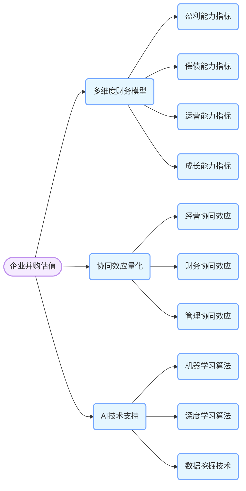

# AI辅助企业并购估值：多维度财务模型与协同效应量化

> 关键词：AI、企业并购估值、多维度财务模型、协同效应量化、机器学习算法

> 摘要：本文聚焦于AI在企业并购估值中的应用，深入探讨了多维度财务模型的构建以及协同效应的量化方法。通过对相关核心概念、算法原理、数学模型的详细阐述，并结合实际项目案例，展示了AI如何提升企业并购估值的准确性和效率。同时，分析了AI在企业并购估值领域的实际应用场景，推荐了相关的学习资源、开发工具和论文著作，最后对未来发展趋势与挑战进行了总结。

## 1. 背景介绍 
### 1.1 目的和范围
企业并购作为企业实现扩张和战略转型的重要手段，其估值的准确性直接影响到并购的成败。传统的企业并购估值方法往往存在数据处理效率低、难以全面考虑复杂因素等问题。本文的目的在于介绍如何利用AI技术辅助企业进行并购估值，构建多维度财务模型并量化协同效应，以提高估值的准确性和可靠性。范围涵盖了从核心概念的解释、算法原理的分析到实际项目案例的应用，以及相关工具和资源的推荐等方面。

### 1.2 预期读者
本文预期读者包括企业并购领域的专业人士，如投资银行家、并购顾问、企业高管等，他们希望借助AI技术提升并购估值的水平；也包括对AI在金融领域应用感兴趣的研究人员和学者，以及从事相关软件开发的程序员和架构师。

### 1.3 文档结构概述
本文将按照以下结构展开：首先介绍核心概念与联系，包括企业并购估值、多维度财务模型和协同效应的定义和相互关系；接着阐述核心算法原理和具体操作步骤，并用Python代码进行详细说明；然后讲解数学模型和公式，并举例说明；之后通过项目实战展示代码的实际应用和详细解释；再分析实际应用场景；推荐相关的工具和资源；最后总结未来发展趋势与挑战，并提供常见问题解答和扩展阅读参考资料。

### 1.4 术语表
#### 1.4.1 核心术语定义
- **企业并购估值**：指在企业并购过程中，对目标企业的价值进行评估的过程，旨在确定合理的并购价格。
- **多维度财务模型**：综合考虑企业多个财务维度的指标，如盈利能力、偿债能力、运营能力等，构建的用于评估企业价值的模型。
- **协同效应**：指企业并购后，通过整合资源、优化业务流程等方式，实现的大于并购前各企业单独经营时的效益之和的额外收益。
- **AI（人工智能）**：是一门研究如何使计算机系统能够模拟人类智能的技术，包括机器学习、深度学习、自然语言处理等多个领域。

#### 1.4.2 相关概念解释
- **机器学习**：是AI的一个重要分支，通过让计算机从数据中学习模式和规律，从而实现对未知数据的预测和决策。
- **深度学习**：是机器学习的一种，基于人工神经网络，通过多层神经元的计算和学习，能够处理复杂的非线性数据。
- **数据挖掘**：从大量的数据中发现有价值的信息和知识的过程，常用于企业并购估值中的数据预处理和特征提取。

#### 1.4.3 缩略词列表
- **AI**：Artificial Intelligence（人工智能）
- **ML**：Machine Learning（机器学习）
- **DL**：Deep Learning（深度学习）
- **NPV**：Net Present Value（净现值）
- **DCF**：Discounted Cash Flow（现金流折现法）

## 2. 核心概念与联系 

### 核心概念原理
#### 企业并购估值
企业并购估值是一个复杂的过程，其核心原理是基于目标企业的未来预期收益来确定其当前的价值。常见的估值方法包括市场法、成本法和收益法。市场法是通过比较目标企业与同行业类似企业的市场价值来确定其估值；成本法是基于目标企业的资产重置成本来评估其价值；收益法是通过预测目标企业未来的现金流，并将其折现到当前时刻来计算其价值。

#### 多维度财务模型
多维度财务模型是在传统财务分析的基础上，综合考虑多个财务维度的指标，以更全面、准确地评估企业的价值。这些维度包括盈利能力、偿债能力、运营能力、成长能力等。通过构建多维度财务模型，可以更深入地了解企业的财务状况和经营业绩，从而为企业并购估值提供更可靠的依据。

#### 协同效应
协同效应是企业并购的重要动机之一。它可以分为经营协同效应、财务协同效应和管理协同效应。经营协同效应主要体现在并购后企业通过整合资源、优化业务流程等方式，实现成本降低、收入增加等效益；财务协同效应主要表现为并购后企业的融资成本降低、资金使用效率提高等；管理协同效应则是指并购后企业通过整合管理团队、优化管理流程等方式，提高企业的管理效率和决策水平。

### 架构的文本示意图
```plaintext
企业并购估值
|-- 多维度财务模型
|   |-- 盈利能力指标
|   |-- 偿债能力指标
|   |-- 运营能力指标
|   |-- 成长能力指标
|-- 协同效应量化
|   |-- 经营协同效应
|   |-- 财务协同效应
|   |-- 管理协同效应
|-- AI技术支持
|   |-- 机器学习算法
|   |-- 深度学习算法
|   |-- 数据挖掘技术
```

### Mermaid流程图


## 3. 核心算法原理 & 具体操作步骤 

### 核心算法原理
在AI辅助企业并购估值中，常用的算法包括线性回归、决策树、随机森林和神经网络等。这里以线性回归为例进行详细阐述。

线性回归是一种用于建立自变量和因变量之间线性关系的统计方法。在企业并购估值中，我们可以将目标企业的价值作为因变量，将多个财务指标作为自变量，通过线性回归模型来预测目标企业的价值。

线性回归的数学模型可以表示为：
$$y = \beta_0 + \beta_1x_1 + \beta_2x_2 + \cdots + \beta_nx_n + \epsilon$$
其中，$y$ 是因变量（目标企业的价值），$x_1, x_2, \cdots, x_n$ 是自变量（财务指标），$\beta_0, \beta_1, \cdots, \beta_n$ 是回归系数，$\epsilon$ 是误差项。

### 具体操作步骤
#### 步骤1：数据收集与预处理
收集目标企业和同行业类似企业的财务数据，包括盈利能力、偿债能力、运营能力等方面的指标。对数据进行清洗，去除缺失值和异常值，并进行标准化处理，使数据具有可比性。

#### 步骤2：特征选择
从收集到的财务指标中选择对目标企业价值影响较大的指标作为自变量。可以使用相关性分析、方差分析等方法进行特征选择。

#### 步骤3：模型训练
将选择好的自变量和因变量数据划分为训练集和测试集。使用训练集数据对线性回归模型进行训练，通过最小化误差项的平方和来估计回归系数。

#### 步骤4：模型评估
使用测试集数据对训练好的模型进行评估，常用的评估指标包括均方误差（MSE）、均方根误差（RMSE）、决定系数（$R^2$）等。

#### 步骤5：模型应用
使用训练好的模型对目标企业的价值进行预测，并结合协同效应的量化结果，最终确定目标企业的并购估值。

### Python源代码实现
```python
import pandas as pd
from sklearn.model_selection import train_test_split
from sklearn.linear_model import LinearRegression
from sklearn.metrics import mean_squared_error, r2_score

# 步骤1：数据收集与预处理
# 假设我们已经收集到了财务数据，并存储在一个CSV文件中
data = pd.read_csv('financial_data.csv')
# 去除缺失值
data = data.dropna()
# 分离自变量和因变量
X = data.drop('target_value', axis=1)
y = data['target_value']
# 数据标准化处理
X = (X - X.mean()) / X.std()

# 步骤2：特征选择
# 这里简单选择所有特征作为自变量
selected_features = X.columns

# 步骤3：模型训练
# 划分训练集和测试集
X_train, X_test, y_train, y_test = train_test_split(X[selected_features], y, test_size=0.2, random_state=42)
# 创建线性回归模型
model = LinearRegression()
# 训练模型
model.fit(X_train, y_train)

# 步骤4：模型评估
# 预测测试集数据
y_pred = model.predict(X_test)
# 计算均方误差
mse = mean_squared_error(y_test, y_pred)
# 计算决定系数
r2 = r2_score(y_test, y_pred)
print(f"均方误差: {mse}")
print(f"决定系数: {r2}")

# 步骤5：模型应用
# 假设我们有一个新的目标企业的财务数据
new_data = pd.DataFrame({
    'feature1': [1.2],
    'feature2': [2.3],
    # 其他特征...
})
# 数据标准化处理
new_data = (new_data - X.mean()) / X.std()
# 预测新目标企业的价值
new_value = model.predict(new_data)
print(f"新目标企业的预测价值: {new_value[0]}")
```

## 4. 数学模型和公式 & 详细讲解 & 举例说明 

### 线性回归模型
线性回归模型的数学表达式为：
$$y = \beta_0 + \beta_1x_1 + \beta_2x_2 + \cdots + \beta_nx_n + \epsilon$$
其中，$y$ 是因变量，$x_1, x_2, \cdots, x_n$ 是自变量，$\beta_0, \beta_1, \cdots, \beta_n$ 是回归系数，$\epsilon$ 是误差项。回归系数 $\beta_i$ 表示自变量 $x_i$ 对因变量 $y$ 的影响程度。

### 最小二乘法估计回归系数
最小二乘法是一种常用的估计回归系数的方法，其目标是最小化误差项的平方和：
$$\min_{\beta_0, \beta_1, \cdots, \beta_n} \sum_{i=1}^{m} (y_i - (\beta_0 + \beta_1x_{i1} + \beta_2x_{i2} + \cdots + \beta_nx_{in}))^2$$
其中，$m$ 是样本数量，$y_i$ 是第 $i$ 个样本的因变量值，$x_{ij}$ 是第 $i$ 个样本的第 $j$ 个自变量值。

通过求解上述最小化问题，可以得到回归系数的估计值。在Python中，使用 `sklearn.linear_model.LinearRegression` 类可以自动完成回归系数的估计。

### 决定系数 $R^2$
决定系数 $R^2$ 是衡量线性回归模型拟合优度的一个重要指标，其计算公式为：
$$R^2 = 1 - \frac{\sum_{i=1}^{m} (y_i - \hat{y}_i)^2}{\sum_{i=1}^{m} (y_i - \bar{y})^2}$$
其中，$\hat{y}_i$ 是第 $i$ 个样本的预测值，$\bar{y}$ 是因变量的均值。$R^2$ 的取值范围在 $[0, 1]$ 之间，$R^2$ 越接近 1，表示模型的拟合效果越好。

### 举例说明
假设我们有以下数据集：
| 自变量 $x_1$ | 自变量 $x_2$ | 因变量 $y$ |
| --- | --- | --- |
| 1 | 2 | 3 |
| 2 | 3 | 5 |
| 3 | 4 | 7 |
| 4 | 5 | 9 |

我们使用线性回归模型来拟合这些数据，代码如下：
```python
import numpy as np
from sklearn.linear_model import LinearRegression

# 自变量数据
X = np.array([[1, 2], [2, 3], [3, 4], [4, 5]])
# 因变量数据
y = np.array([3, 5, 7, 9])

# 创建线性回归模型
model = LinearRegression()
# 训练模型
model.fit(X, y)

# 打印回归系数
print(f"回归系数: {model.coef_}")
print(f"截距: {model.intercept_}")

# 预测新数据
new_X = np.array([[5, 6]])
new_y = model.predict(new_X)
print(f"预测值: {new_y[0]}")
```
运行上述代码，我们可以得到回归系数和截距的估计值，以及对新数据的预测值。

## 5. 项目实战：代码实际案例和详细解释说明 

### 5.1  开发环境搭建
#### 操作系统
建议使用Windows、Linux或macOS操作系统。

#### Python环境
安装Python 3.7及以上版本，可以从Python官方网站（https://www.python.org/downloads/）下载安装包进行安装。

#### 第三方库
安装以下第三方库：
- `pandas`：用于数据处理和分析。
- `numpy`：用于数值计算。
- `scikit-learn`：用于机器学习模型的构建和训练。
可以使用以下命令进行安装：
```sh
pip install pandas numpy scikit-learn
```

### 5.2  源代码详细实现和代码解读
以下是一个完整的AI辅助企业并购估值的项目实战代码：
```python
import pandas as pd
import numpy as np
from sklearn.model_selection import train_test_split
from sklearn.linear_model import LinearRegression
from sklearn.metrics import mean_squared_error, r2_score

# 步骤1：数据收集与预处理
# 假设我们已经收集到了财务数据，并存储在一个CSV文件中
data = pd.read_csv('financial_data.csv')
# 去除缺失值
data = data.dropna()
# 分离自变量和因变量
X = data.drop('target_value', axis=1)
y = data['target_value']
# 数据标准化处理
X = (X - X.mean()) / X.std()

# 步骤2：特征选择
# 这里简单选择所有特征作为自变量
selected_features = X.columns

# 步骤3：模型训练
# 划分训练集和测试集
X_train, X_test, y_train, y_test = train_test_split(X[selected_features], y, test_size=0.2, random_state=42)
# 创建线性回归模型
model = LinearRegression()
# 训练模型
model.fit(X_train, y_train)

# 步骤4：模型评估
# 预测测试集数据
y_pred = model.predict(X_test)
# 计算均方误差
mse = mean_squared_error(y_test, y_pred)
# 计算决定系数
r2 = r2_score(y_test, y_pred)
print(f"均方误差: {mse}")
print(f"决定系数: {r2}")

# 步骤5：模型应用
# 假设我们有一个新的目标企业的财务数据
new_data = pd.DataFrame({
    'feature1': [1.2],
    'feature2': [2.3],
    # 其他特征...
})
# 数据标准化处理
new_data = (new_data - X.mean()) / X.std()
# 预测新目标企业的价值
new_value = model.predict(new_data)
print(f"新目标企业的预测价值: {new_value[0]}")
```
### 代码解读
1. **数据收集与预处理**：使用 `pandas` 库读取CSV文件中的财务数据，去除缺失值，并对自变量数据进行标准化处理，使数据具有可比性。
2. **特征选择**：这里简单选择所有特征作为自变量，实际应用中可以使用更复杂的特征选择方法。
3. **模型训练**：使用 `train_test_split` 函数将数据划分为训练集和测试集，然后使用 `LinearRegression` 类创建线性回归模型，并使用训练集数据对模型进行训练。
4. **模型评估**：使用测试集数据对训练好的模型进行评估，计算均方误差和决定系数，评估模型的拟合效果。
5. **模型应用**：假设我们有一个新的目标企业的财务数据，对其进行标准化处理后，使用训练好的模型进行预测，得到新目标企业的预测价值。

## 6. 实际应用场景 
### 投资银行
投资银行在企业并购业务中扮演着重要的角色，需要对目标企业进行准确的估值。AI辅助企业并购估值可以帮助投资银行更快速、准确地评估目标企业的价值，提高并购交易的成功率。例如，通过构建多维度财务模型和量化协同效应，投资银行可以为客户提供更合理的并购价格建议。

### 企业战略规划
企业在进行战略规划时，可能会考虑通过并购来实现扩张和转型。AI辅助企业并购估值可以帮助企业更好地评估并购目标的价值和潜在的协同效应，从而做出更明智的决策。例如，企业可以利用AI技术分析目标企业的财务状况和市场前景，预测并购后的协同效益，为战略规划提供有力支持。

### 私募股权投资
私募股权投资机构在进行投资决策时，需要对目标企业进行估值。AI辅助企业并购估值可以帮助私募股权投资机构更全面地了解目标企业的价值，提高投资回报率。例如，通过使用机器学习算法对目标企业的财务数据进行分析，私募股权投资机构可以发现潜在的投资机会，降低投资风险。

## 7. 工具和资源推荐
### 7.1 学习资源推荐
#### 7.1.1 书籍推荐
- 《Python机器学习》：本书详细介绍了Python在机器学习领域的应用，包括线性回归、决策树、神经网络等算法的实现和应用。
- 《金融数据分析与挖掘》：该书结合金融领域的实际案例，介绍了数据分析和挖掘技术在金融领域的应用，包括企业估值、风险评估等方面。
- 《人工智能：现代方法》：这是一本经典的人工智能教材，全面介绍了人工智能的各个领域，包括机器学习、自然语言处理等。

#### 7.1.2 在线课程
- Coursera上的“机器学习”课程：由斯坦福大学教授Andrew Ng主讲，是一门非常经典的机器学习入门课程。
- edX上的“数据科学与机器学习微硕士学位课程”：该课程系统地介绍了数据科学和机器学习的理论和实践，适合有一定编程基础的学习者。
- 网易云课堂上的“Python数据分析与机器学习实战”课程：该课程结合实际案例，介绍了Python在数据分析和机器学习领域的应用。

#### 7.1.3 技术博客和网站
- Medium：是一个技术博客平台，上面有很多关于AI、机器学习和金融科技的文章。
- Kaggle：是一个数据科学竞赛平台，上面有很多关于金融数据挖掘和企业估值的数据集和代码示例。
- Towards Data Science：是一个专注于数据科学和机器学习的博客网站，上面有很多高质量的技术文章。

### 7.2 开发工具框架推荐
#### 7.2.1 IDE和编辑器
- PyCharm：是一款专门为Python开发设计的集成开发环境，具有代码编辑、调试、版本控制等功能。
- Jupyter Notebook：是一个交互式的编程环境，适合进行数据分析和模型开发，支持Python、R等多种编程语言。
- Visual Studio Code：是一款轻量级的代码编辑器，支持多种编程语言，具有丰富的插件扩展功能。

#### 7.2.2 调试和性能分析工具
- pdb：是Python自带的调试工具，可以帮助开发者定位代码中的错误。
- cProfile：是Python的性能分析工具，可以分析代码的运行时间和函数调用次数，帮助开发者优化代码性能。
- TensorBoard：是TensorFlow的可视化工具，可以用于可视化模型的训练过程和性能指标。

#### 7.2.3 相关框架和库
- scikit-learn：是一个常用的机器学习库，提供了丰富的机器学习算法和工具，包括线性回归、决策树、随机森林等。
- TensorFlow：是一个开源的深度学习框架，广泛应用于图像识别、自然语言处理等领域。
- PyTorch：是另一个流行的深度学习框架，具有简洁易用的特点，适合快速开发和实验。

### 7.3 相关论文著作推荐
#### 7.3.1 经典论文
- “Regression Shrinkage and Selection via the Lasso”：该论文介绍了Lasso回归算法，是一种用于特征选择和模型正则化的方法。
- “Random Forests”：该论文提出了随机森林算法，是一种集成学习方法，在分类和回归问题中具有很好的性能。
- “Deep Residual Learning for Image Recognition”：该论文提出了残差网络（ResNet），是一种深度学习模型，在图像识别领域取得了很好的效果。

#### 7.3.2 最新研究成果
- 在顶级学术会议如NeurIPS、ICML、KDD等上发表的关于AI在金融领域应用的研究论文。
- 在知名学术期刊如Journal of Financial Economics、Review of Financial Studies等上发表的关于企业并购估值和协同效应量化的研究论文。

#### 7.3.3 应用案例分析
- 一些大型金融机构和企业发布的关于AI辅助企业并购估值的应用案例报告，这些报告通常包含了实际项目的背景、方法和结果。

## 8. 总结：未来发展趋势与挑战
### 未来发展趋势
#### 更复杂的模型应用
随着AI技术的不断发展，未来将有更多复杂的模型应用于企业并购估值中，如深度学习模型、强化学习模型等。这些模型可以处理更复杂的非线性数据，提高估值的准确性。

#### 多源数据融合
除了财务数据，未来的企业并购估值将更多地融合多源数据，如社交媒体数据、物联网数据等。通过综合分析多源数据，可以更全面地了解目标企业的价值和潜在的协同效应。

#### 实时估值
随着信息技术的不断进步，未来的企业并购估值将实现实时化。通过实时获取和分析数据，可以及时调整估值结果，提高并购决策的及时性和准确性。

### 挑战
#### 数据质量问题
AI辅助企业并购估值依赖于大量的数据，但数据质量往往存在问题，如数据缺失、数据错误、数据不一致等。如何保证数据的质量是一个亟待解决的问题。

#### 模型解释性
一些复杂的AI模型，如深度学习模型，往往缺乏解释性。在企业并购估值中，决策者需要了解模型的决策过程和依据，因此如何提高模型的解释性是一个重要的挑战。

#### 法律法规和伦理问题
AI在企业并购估值中的应用可能会涉及到法律法规和伦理问题，如数据隐私保护、算法歧视等。如何在应用AI技术的同时，遵守相关的法律法规和伦理准则，是一个需要关注的问题。

## 9. 附录：常见问题与解答
### 问题1：AI辅助企业并购估值的准确性如何保证？
解答：可以通过以下方法保证AI辅助企业并购估值的准确性：
- 收集高质量的数据，确保数据的完整性和准确性。
- 选择合适的模型和算法，并进行充分的模型评估和调优。
- 结合专家经验和行业知识，对模型的结果进行验证和调整。

### 问题2：AI技术是否可以完全替代人工进行企业并购估值？
解答：目前AI技术还不能完全替代人工进行企业并购估值。虽然AI技术可以处理大量的数据和复杂的模型，但在一些关键环节，如企业的战略规划、协同效应的定性分析等，还需要人工的专业判断和经验。AI技术更多地是作为一种辅助工具，帮助提高估值的效率和准确性。

### 问题3：如何选择适合的AI算法进行企业并购估值？
解答：选择适合的AI算法需要考虑以下因素：
- 数据的特点，如数据的规模、维度、分布等。
- 问题的类型，如回归问题、分类问题等。
- 模型的可解释性要求。
一般来说，可以先尝试一些简单的算法，如线性回归、决策树等，然后根据模型的性能和需求，逐步尝试更复杂的算法。

## 10. 扩展阅读 & 参考资料
### 扩展阅读
- 《智能金融：AI时代金融行业的创新与转型》
- 《数据驱动的金融风险管理》
- 《金融科技：变革与监管》

### 参考资料
- 《企业并购估值方法研究》
- 《协同效应的量化与评估》
- 《AI在金融领域的应用现状与未来趋势》

作者：AI天才研究院/AI Genius Institute & 禅与计算机程序设计艺术 /Zen And The Art of Computer Programming