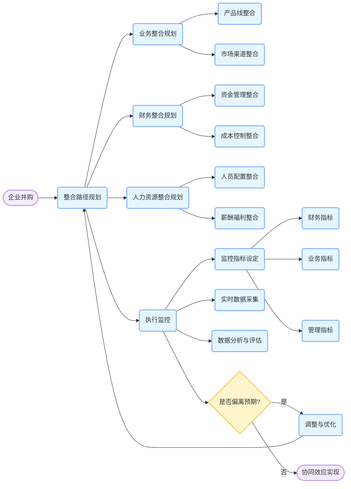

# AI辅助企业并购协同效应实现：整合路径规划与执行监控

> 关键词：AI、企业并购、协同效应、整合路径规划、执行监控

> 摘要：本文聚焦于AI在企业并购协同效应实现过程中的应用，详细探讨了如何利用AI进行整合路径规划以及执行监控。通过对核心概念、算法原理、数学模型等方面的深入分析，结合项目实战案例，阐述了AI技术在这一领域的具体应用方式和优势。同时，介绍了实际应用场景、相关工具和资源，并对未来发展趋势与挑战进行了总结，旨在为企业在并购过程中借助AI实现协同效应提供全面的技术指导和实践参考。

## 1. 背景介绍 
### 1.1 目的和范围
企业并购作为一种重要的资本运作方式，旨在通过整合资源实现协同效应，提升企业的竞争力和价值。然而，传统的并购整合过程面临着诸多挑战，如信息不对称、决策效率低下、整合难度大等。本文章的目的在于探讨如何利用人工智能（AI）技术辅助企业在并购过程中更好地规划整合路径，并对执行过程进行有效监控，从而提高协同效应的实现概率。

文章的范围涵盖了AI在企业并购整合中的各个环节，包括核心概念的阐述、算法原理的分析、数学模型的构建、项目实战案例的讲解以及实际应用场景的探讨等。

### 1.2 预期读者
本文的预期读者主要包括企业高管、并购专业人士、投资银行家、财务分析师、人工智能研究人员以及对企业并购和AI技术应用感兴趣的相关人员。这些读者希望了解AI如何在企业并购中发挥作用，以及如何利用AI技术提升并购整合的效率和效果。

### 1.3 文档结构概述
本文将按照以下结构进行组织：
- 核心概念与联系：介绍企业并购协同效应、整合路径规划和执行监控的核心概念，并阐述它们之间的联系。
- 核心算法原理 & 具体操作步骤：详细讲解用于整合路径规划和执行监控的核心算法原理，并给出具体的操作步骤，同时使用Python源代码进行示例。
- 数学模型和公式 & 详细讲解 & 举例说明：构建数学模型和公式来描述整合路径规划和执行监控的过程，并通过具体例子进行详细说明。
- 项目实战：代码实际案例和详细解释说明：通过一个实际的项目案例，展示如何使用AI技术进行整合路径规划和执行监控，并对代码进行详细解读。
- 实际应用场景：探讨AI在企业并购中的实际应用场景，包括财务整合、业务整合、人力资源整合等。
- 工具和资源推荐：推荐相关的学习资源、开发工具框架和论文著作，帮助读者进一步深入学习和研究。
- 总结：未来发展趋势与挑战：总结AI在企业并购协同效应实现中的应用现状，并对未来的发展趋势和挑战进行分析。
- 附录：常见问题与解答：解答读者在阅读过程中可能遇到的常见问题。
- 扩展阅读 & 参考资料：提供相关的扩展阅读材料和参考资料，方便读者进一步探索。

### 1.4 术语表
#### 1.4.1 核心术语定义
- **企业并购（Corporate Merger and Acquisition）**：指企业通过收购、合并等方式获取其他企业的控制权，以实现资源整合和战略目标的一种经济行为。
- **协同效应（Synergy Effect）**：指企业在并购后，通过整合资源、优化业务流程等方式，实现整体价值大于各部分价值之和的效果。协同效应可以分为经营协同效应、财务协同效应和管理协同效应等。
- **整合路径规划（Integration Path Planning）**：指在企业并购后，为实现协同效应而制定的一系列整合步骤和计划，包括业务整合、财务整合、人力资源整合等方面的规划。
- **执行监控（Execution Monitoring）**：指在整合路径规划的执行过程中，对各项任务的执行情况进行实时监测和评估，及时发现问题并采取措施进行调整的过程。

#### 1.4.2 相关概念解释
- **人工智能（Artificial Intelligence）**：指计算机系统能够执行通常需要人类智能才能完成的任务，如学习、推理、决策等。在本文中，主要涉及机器学习、深度学习等AI技术在企业并购中的应用。
- **机器学习（Machine Learning）**：是人工智能的一个分支，通过让计算机从数据中自动学习模式和规律，从而实现预测和决策等功能。常见的机器学习算法包括决策树、支持向量机、神经网络等。
- **深度学习（Deep Learning）**：是机器学习的一个子领域，通过构建深度神经网络模型，让计算机自动学习数据的特征和模式，从而实现更复杂的任务，如图像识别、自然语言处理等。

#### 1.4.3 缩略词列表
- **AI**：Artificial Intelligence，人工智能
- **ML**：Machine Learning，机器学习
- **DL**：Deep Learning，深度学习

## 2. 核心概念与联系 
### 核心概念原理
#### 企业并购协同效应
企业并购协同效应是企业并购的核心目标之一。从原理上讲，它基于资源互补和规模经济的理念。例如，两家企业在不同地区拥有销售渠道，并购后可以共享这些渠道，扩大市场覆盖范围，实现经营协同效应。财务协同效应则可能体现在并购后企业的资金成本降低、税收优惠增加等方面。管理协同效应可以通过整合管理团队、优化管理流程来实现，提高企业的管理效率。

#### 整合路径规划
整合路径规划是为了实现协同效应而制定的详细计划。它需要考虑多个方面的因素，如业务流程、组织结构、企业文化等。首先，要对并购双方的业务进行全面评估，确定哪些业务可以进行整合，哪些需要保留或剥离。然后，根据评估结果制定具体的整合步骤和时间表。例如，在业务整合方面，可以按照产品线、客户群体等维度进行整合，逐步实现业务的协同发展。

#### 执行监控
执行监控是确保整合路径规划顺利实施的重要环节。它通过建立监控指标体系，对整合过程中的各项任务进行实时跟踪和评估。例如，设定财务指标（如收入、利润等）、业务指标（如市场份额、客户满意度等）和管理指标（如员工离职率、流程效率等），定期对这些指标进行监测和分析。一旦发现指标偏离预期，及时采取措施进行调整，确保整合过程朝着预定目标前进。

### 架构的文本示意图
```plaintext
企业并购协同效应实现架构
|-- 企业并购
|   |-- 目标企业选择
|   |-- 并购交易达成
|-- 整合路径规划
|   |-- 业务整合规划
|   |   |-- 产品线整合
|   |   |-- 市场渠道整合
|   |-- 财务整合规划
|   |   |-- 资金管理整合
|   |   |-- 成本控制整合
|   |-- 人力资源整合规划
|   |   |-- 人员配置整合
|   |   |-- 薪酬福利整合
|-- 执行监控
|   |-- 监控指标设定
|   |   |-- 财务指标
|   |   |-- 业务指标
|   |   |-- 管理指标
|   |-- 实时数据采集
|   |-- 数据分析与评估
|   |-- 调整与优化
```

### Mermaid流程图


## 3. 核心算法原理 & 具体操作步骤 
### 核心算法原理
在企业并购整合路径规划和执行监控中，我们可以使用机器学习中的决策树算法和深度学习中的循环神经网络（RNN）算法。

#### 决策树算法原理
决策树是一种基于树结构进行决策的机器学习算法。它通过对数据进行划分，构建一个树形结构，每个内部节点表示一个属性上的测试，每个分支表示一个测试输出，每个叶节点表示一个类别或值。在企业并购整合路径规划中，决策树可以根据企业的各种属性（如业务类型、财务状况、市场份额等）来决定不同的整合策略。

#### 循环神经网络（RNN）算法原理
RNN是一种专门处理序列数据的神经网络。在执行监控中，我们可以使用RNN来对整合过程中的时间序列数据（如财务指标的变化、业务指标的波动等）进行建模和预测。RNN通过在网络中引入循环结构，使得网络能够记住之前的输入信息，从而更好地处理序列数据。

### 具体操作步骤
#### 决策树算法操作步骤
1. **数据收集**：收集并购双方企业的相关数据，包括业务数据、财务数据、市场数据等。
2. **数据预处理**：对收集到的数据进行清洗、归一化等处理，以便后续分析。
3. **特征选择**：选择对整合策略有重要影响的特征，如业务增长率、利润率等。
4. **模型训练**：使用训练数据构建决策树模型。
5. **模型评估**：使用测试数据对决策树模型进行评估，计算模型的准确率、召回率等指标。
6. **决策制定**：根据训练好的决策树模型，对不同的企业情况制定相应的整合策略。

#### RNN算法操作步骤
1. **数据收集**：收集整合过程中的时间序列数据，如每月的销售额、利润等。
2. **数据预处理**：对时间序列数据进行归一化处理，将数据转换到合适的范围。
3. **模型构建**：构建RNN模型，包括选择合适的网络结构（如简单RNN、LSTM等）和参数设置。
4. **模型训练**：使用训练数据对RNN模型进行训练，调整模型的参数。
5. **模型评估**：使用测试数据对RNN模型进行评估，计算模型的预测误差。
6. **预测与监控**：使用训练好的RNN模型对未来的指标进行预测，并实时监控指标的变化情况。

### Python源代码示例
```python
# 决策树算法示例
import pandas as pd
from sklearn.tree import DecisionTreeClassifier
from sklearn.model_selection import train_test_split
from sklearn.metrics import accuracy_score

# 数据收集与预处理
data = pd.read_csv('merger_data.csv')
X = data.drop('integration_strategy', axis=1)
y = data['integration_strategy']
X_train, X_test, y_train, y_test = train_test_split(X, y, test_size=0.2, random_state=42)

# 模型训练
model = DecisionTreeClassifier()
model.fit(X_train, y_train)

# 模型评估
y_pred = model.predict(X_test)
accuracy = accuracy_score(y_test, y_pred)
print(f"Decision Tree Accuracy: {accuracy}")

# RNN算法示例
import numpy as np
import tensorflow as tf
from tensorflow.keras.models import Sequential
from tensorflow.keras.layers import SimpleRNN, Dense

# 数据收集与预处理
data = np.loadtxt('time_series_data.csv', delimiter=',')
data = (data - np.mean(data)) / np.std(data)  # 归一化处理
X = []
y = []
for i in range(len(data) - 10):
    X.append(data[i:i+10])
    y.append(data[i+10])
X = np.array(X)
y = np.array(y)
X_train, X_test, y_train, y_test = train_test_split(X, y, test_size=0.2, random_state=42)

# 模型构建
model = Sequential()
model.add(SimpleRNN(32, input_shape=(10, 1)))
model.add(Dense(1))
model.compile(optimizer='adam', loss='mse')

# 模型训练
model.fit(X_train, y_train, epochs=50, batch_size=32)

# 模型评估
loss = model.evaluate(X_test, y_test)
print(f"RNN Loss: {loss}")
```

## 4. 数学模型和公式 & 详细讲解 & 举例说明 
### 决策树算法的数学模型和公式
#### 信息熵
信息熵是衡量数据不确定性的指标，其计算公式为：
$$H(X) = -\sum_{i=1}^{n}p(x_i)\log_2p(x_i)$$
其中，$X$ 是一个离散随机变量，$p(x_i)$ 是 $X$ 取值为 $x_i$ 的概率，$n$ 是 $X$ 的取值个数。

#### 信息增益
信息增益是衡量使用某个属性进行划分后数据不确定性减少的程度，其计算公式为：
$$IG(X, A) = H(X) - \sum_{v\in Values(A)}\frac{|S_v|}{|S|}H(S_v)$$
其中，$IG(X, A)$ 表示使用属性 $A$ 对数据集 $S$ 进行划分的信息增益，$H(X)$ 是数据集 $S$ 的信息熵，$Values(A)$ 是属性 $A$ 的所有可能取值，$S_v$ 是属性 $A$ 取值为 $v$ 的子集，$|S|$ 和 $|S_v|$ 分别表示数据集 $S$ 和子集 $S_v$ 的样本数量。

#### 举例说明
假设我们有一个数据集 $S$，包含 10 个样本，其中 6 个样本的类别为 $C_1$，4 个样本的类别为 $C_2$。则数据集 $S$ 的信息熵为：
$$H(S) = -\frac{6}{10}\log_2\frac{6}{10} - \frac{4}{10}\log_2\frac{4}{10} \approx 0.971$$
假设我们有一个属性 $A$，其取值为 $A_1$ 和 $A_2$，$A_1$ 对应的子集 $S_1$ 包含 4 个样本，其中 3 个样本的类别为 $C_1$，1 个样本的类别为 $C_2$；$A_2$ 对应的子集 $S_2$ 包含 6 个样本，其中 3 个样本的类别为 $C_1$，3 个样本的类别为 $C_2$。则子集 $S_1$ 和 $S_2$ 的信息熵分别为：
$$H(S_1) = -\frac{3}{4}\log_2\frac{3}{4} - \frac{1}{4}\log_2\frac{1}{4} \approx 0.811$$
$$H(S_2) = -\frac{3}{6}\log_2\frac{3}{6} - \frac{3}{6}\log_2\frac{3}{6} = 1$$
使用属性 $A$ 对数据集 $S$ 进行划分的信息增益为：
$$IG(S, A) = H(S) - \frac{4}{10}H(S_1) - \frac{6}{10}H(S_2) \approx 0.971 - \frac{4}{10} \times 0.811 - \frac{6}{10} \times 1 \approx 0.134$$

### RNN算法的数学模型和公式
#### 简单RNN的前向传播公式
简单RNN的前向传播公式为：
$$h_t = \tanh(W_{hh}h_{t-1} + W_{xh}x_t + b_h)$$
$$y_t = W_{hy}h_t + b_y$$
其中，$h_t$ 是时刻 $t$ 的隐藏状态，$x_t$ 是时刻 $t$ 的输入，$W_{hh}$ 是隐藏状态到隐藏状态的权重矩阵，$W_{xh}$ 是输入到隐藏状态的权重矩阵，$W_{hy}$ 是隐藏状态到输出的权重矩阵，$b_h$ 和 $b_y$ 分别是隐藏状态和输出的偏置向量，$\tanh$ 是激活函数。

#### 举例说明
假设我们有一个简单RNN模型，输入维度为 2，隐藏状态维度为 3，输出维度为 1。则 $W_{xh}$ 是一个 $3\times2$ 的矩阵，$W_{hh}$ 是一个 $3\times3$ 的矩阵，$W_{hy}$ 是一个 $1\times3$ 的矩阵。假设在时刻 $t$，输入 $x_t = [0.1, 0.2]$，上一时刻的隐藏状态 $h_{t-1} = [0.3, 0.4, 0.5]$。则时刻 $t$ 的隐藏状态 $h_t$ 为：
$$h_t = \tanh(W_{hh}h_{t-1} + W_{xh}x_t + b_h)$$
假设 $W_{hh} = \begin{bmatrix}0.1 & 0.2 & 0.3\\0.4 & 0.5 & 0.6\\0.7 & 0.8 & 0.9\end{bmatrix}$，$W_{xh} = \begin{bmatrix}0.1 & 0.2\\0.3 & 0.4\\0.5 & 0.6\end{bmatrix}$，$b_h = [0.1, 0.2, 0.3]$，则：
$$W_{hh}h_{t-1} = \begin{bmatrix}0.1 & 0.2 & 0.3\\0.4 & 0.5 & 0.6\\0.7 & 0.8 & 0.9\end{bmatrix}\begin{bmatrix}0.3\\0.4\\0.5\end{bmatrix} = \begin{bmatrix}0.26\\0.53\\0.8\end{bmatrix}$$
$$W_{xh}x_t = \begin{bmatrix}0.1 & 0.2\\0.3 & 0.4\\0.5 & 0.6\end{bmatrix}\begin{bmatrix}0.1\\0.2\end{bmatrix} = \begin{bmatrix}0.05\\0.11\\0.17\end{bmatrix}$$
$$W_{hh}h_{t-1} + W_{xh}x_t + b_h = \begin{bmatrix}0.26\\0.53\\0.8\end{bmatrix} + \begin{bmatrix}0.05\\0.11\\0.17\end{bmatrix} + \begin{bmatrix}0.1\\0.2\\0.3\end{bmatrix} = \begin{bmatrix}0.41\\0.84\\1.27\end{bmatrix}$$
$$h_t = \tanh\begin{bmatrix}0.41\\0.84\\1.27\end{bmatrix} = \begin{bmatrix}0.39\\0.68\\0.85\end{bmatrix}$$
时刻 $t$ 的输出 $y_t$ 为：
$$y_t = W_{hy}h_t + b_y$$
假设 $W_{hy} = [0.1, 0.2, 0.3]$，$b_y = 0.1$，则：
$$y_t = [0.1, 0.2, 0.3]\begin{bmatrix}0.39\\0.68\\0.85\end{bmatrix} + 0.1 = 0.48$$

## 5. 项目实战：代码实际案例和详细解释说明 
### 5.1  开发环境搭建
#### 操作系统
建议使用Linux系统（如Ubuntu）或Windows 10系统，这些系统对Python开发环境的支持较好。

#### Python环境
安装Python 3.7及以上版本，可以从Python官方网站（https://www.python.org/downloads/）下载安装包进行安装。

#### 依赖库安装
使用pip命令安装以下依赖库：
```bash
pip install pandas numpy scikit-learn tensorflow
```

### 5.2  源代码详细实现和代码解读
```python
# 导入必要的库
import pandas as pd
import numpy as np
from sklearn.tree import DecisionTreeClassifier
from sklearn.model_selection import train_test_split
from sklearn.metrics import accuracy_score
import tensorflow as tf
from tensorflow.keras.models import Sequential
from tensorflow.keras.layers import SimpleRNN, Dense

# 数据收集与预处理
# 假设我们有一个包含企业并购相关数据的CSV文件
data = pd.read_csv('merger_data.csv')
# 提取特征和标签
X = data.drop('integration_strategy', axis=1)
y = data['integration_strategy']
# 划分训练集和测试集
X_train, X_test, y_train, y_test = train_test_split(X, y, test_size=0.2, random_state=42)

# 决策树模型训练
# 创建决策树分类器
model_dt = DecisionTreeClassifier()
# 使用训练数据进行训练
model_dt.fit(X_train, y_train)
# 在测试集上进行预测
y_pred_dt = model_dt.predict(X_test)
# 计算准确率
accuracy_dt = accuracy_score(y_test, y_pred_dt)
print(f"Decision Tree Accuracy: {accuracy_dt}")

# 时间序列数据处理
# 假设我们有一个包含时间序列数据的CSV文件
time_series_data = np.loadtxt('time_series_data.csv', delimiter=',')
# 归一化处理
time_series_data = (time_series_data - np.mean(time_series_data)) / np.std(time_series_data)
# 构建训练数据
X_ts = []
y_ts = []
for i in range(len(time_series_data) - 10):
    X_ts.append(time_series_data[i:i+10])
    y_ts.append(time_series_data[i+10])
X_ts = np.array(X_ts)
y_ts = np.array(y_ts)
# 划分训练集和测试集
X_train_ts, X_test_ts, y_train_ts, y_test_ts = train_test_split(X_ts, y_ts, test_size=0.2, random_state=42)

# RNN模型构建与训练
# 创建Sequential模型
model_rnn = Sequential()
# 添加SimpleRNN层
model_rnn.add(SimpleRNN(32, input_shape=(10, 1)))
# 添加全连接层
model_rnn.add(Dense(1))
# 编译模型
model_rnn.compile(optimizer='adam', loss='mse')
# 训练模型
model_rnn.fit(X_train_ts, y_train_ts, epochs=50, batch_size=32)
# 在测试集上进行评估
loss_rnn = model_rnn.evaluate(X_test_ts, y_test_ts)
print(f"RNN Loss: {loss_rnn}")
```

### 5.3  代码解读与分析
#### 数据收集与预处理部分
- 使用`pandas`库的`read_csv`函数读取CSV文件，将数据加载到DataFrame中。
- 使用`drop`方法提取特征，将标签列从数据中分离出来。
- 使用`train_test_split`函数将数据划分为训练集和测试集，方便后续模型的训练和评估。
- 对于时间序列数据，使用`np.loadtxt`函数读取数据，并进行归一化处理，将数据转换到合适的范围。

#### 决策树模型部分
- 创建`DecisionTreeClassifier`对象，使用训练数据进行训练。
- 使用`predict`方法在测试集上进行预测，得到预测结果。
- 使用`accuracy_score`函数计算模型的准确率，评估模型的性能。

#### RNN模型部分
- 使用`Sequential`模型构建RNN模型，添加`SimpleRNN`层和全连接层。
- 使用`compile`方法编译模型，指定优化器和损失函数。
- 使用`fit`方法对模型进行训练，调整模型的参数。
- 使用`evaluate`方法在测试集上进行评估，计算模型的损失值。

## 6. 实际应用场景 
### 财务整合
在企业并购后的财务整合过程中，AI可以发挥重要作用。通过使用机器学习算法对财务数据进行分析，预测财务指标的变化趋势，帮助企业制定合理的财务策略。例如，使用RNN算法对企业的现金流进行预测，提前发现潜在的资金风险，及时采取措施进行调整。同时，AI还可以帮助企业进行成本控制和预算管理，通过对历史数据的学习，优化成本结构，提高资金使用效率。

### 业务整合
在业务整合方面，AI可以辅助企业进行市场分析和客户细分。通过对市场数据和客户数据的挖掘，发现潜在的市场机会和客户需求，帮助企业调整业务策略。例如，使用决策树算法对客户进行分类，针对不同类型的客户制定个性化的营销策略。此外，AI还可以优化业务流程，通过对业务流程数据的分析，发现流程中的瓶颈和问题，提出改进建议，提高业务效率。

### 人力资源整合
在人力资源整合中，AI可以用于员工评估和人才管理。通过对员工的绩效数据、技能数据等进行分析，评估员工的能力和潜力，为员工的晋升、培训等提供决策支持。例如，使用机器学习算法构建员工绩效预测模型，提前预测员工的绩效表现，为人力资源管理提供参考。同时，AI还可以帮助企业进行文化融合，通过对员工的沟通数据和行为数据的分析，了解员工的文化差异和需求，采取相应的措施促进文化融合。

## 7. 工具和资源推荐
### 7.1 学习资源推荐
#### 7.1.1 书籍推荐
- 《机器学习》（周志华著）：全面介绍了机器学习的基本概念、算法和应用，是机器学习领域的经典教材。
- 《深度学习》（Ian Goodfellow、Yoshua Bengio和Aaron Courville著）：系统阐述了深度学习的理论和实践，适合对深度学习感兴趣的读者。
- 《Python数据分析实战》（Sebastian Raschka著）：通过实际案例介绍了Python在数据分析中的应用，包括数据处理、可视化、机器学习等方面。

#### 7.1.2 在线课程
- Coursera上的“机器学习”课程（Andrew Ng教授主讲）：是机器学习领域的经典在线课程，内容全面，讲解清晰。
- edX上的“深度学习基础”课程：由深度学习领域的专家授课，深入介绍了深度学习的原理和应用。
- 中国大学MOOC上的“人工智能基础”课程：适合初学者了解人工智能的基本概念和技术。

#### 7.1.3 技术博客和网站
- Medium：有很多关于AI和机器学习的技术博客文章，涵盖了最新的研究成果和实践经验。
- Kaggle：是一个数据科学竞赛平台，上面有很多优秀的数据科学项目和代码分享，可以学习到不同的数据分析和机器学习技巧。
- 机器之心：专注于人工智能领域的资讯和技术分享，提供了很多有价值的行业动态和技术文章。

### 7.2 开发工具框架推荐
#### 7.2.1 IDE和编辑器
- PyCharm：是一款专门为Python开发设计的集成开发环境，功能强大，支持代码调试、自动补全、版本控制等功能。
- Jupyter Notebook：是一个交互式的开发环境，适合进行数据探索和模型实验，支持多种编程语言。
- Visual Studio Code：是一款轻量级的代码编辑器，支持多种编程语言和插件扩展，具有良好的开发体验。

#### 7.2.2 调试和性能分析工具
- TensorBoard：是TensorFlow的可视化工具，可以用于可视化模型的训练过程、网络结构、指标变化等，帮助开发者进行调试和性能分析。
- Py-Spy：是一个Python性能分析工具，可以实时监测Python程序的CPU使用情况，找出性能瓶颈。
- cProfile：是Python标准库中的性能分析模块，可以对Python程序进行详细的性能分析，输出函数调用时间、调用次数等信息。

#### 7.2.3 相关框架和库
- TensorFlow：是一个开源的机器学习框架，由Google开发，支持深度学习、机器学习等多种算法，具有高效、灵活等特点。
- PyTorch：是另一个流行的深度学习框架，由Facebook开发，具有动态图、易于调试等优点，受到很多研究人员和开发者的喜爱。
- Scikit-learn：是一个简单易用的机器学习库，提供了丰富的机器学习算法和工具，适合初学者快速上手。

### 7.3 相关论文著作推荐
#### 7.3.1 经典论文
- “A Logical Calculus of the Ideas Immanent in Nervous Activity”（Warren S. McCulloch和Walter Pitts著）：提出了神经元模型，为神经网络的发展奠定了基础。
- “Learning Representations by Back-propagating Errors”（David E. Rumelhart、Geoffrey E. Hinton和Ronald J. Williams著）：介绍了反向传播算法，推动了神经网络的发展。
- “Gradient-based learning applied to document recognition”（Yann LeCun、Léon Bottou、Yoshua Bengio和Patrick Haffner著）：提出了LeNet卷积神经网络，开启了卷积神经网络在图像识别领域的应用。

#### 7.3.2 最新研究成果
- 关注顶级学术会议（如NeurIPS、ICML、CVPR等）上的论文，了解AI领域的最新研究进展。
- 查阅知名学术期刊（如Journal of Artificial Intelligence Research、Artificial Intelligence等）上的文章，获取高质量的研究成果。

#### 7.3.3 应用案例分析
- 研究一些知名企业在AI应用方面的案例，如Google在搜索、图像识别等领域的应用，Facebook在社交网络、自然语言处理等领域的应用。
- 关注行业报告和研究机构发布的案例分析，了解AI在不同行业的应用实践和效果。

## 8. 总结：未来发展趋势与挑战
### 未来发展趋势
#### AI技术的不断创新
随着AI技术的不断发展，新的算法和模型将不断涌现。例如，强化学习在企业并购中的应用可能会越来越广泛，通过智能体与环境的交互，自动优化整合路径规划和执行监控策略。此外，量子计算技术的发展也可能为AI在企业并购中的应用带来新的突破，提高计算效率和处理复杂问题的能力。

#### 与其他技术的融合
AI将与区块链、物联网等技术进行深度融合。区块链技术可以提供安全可靠的数据共享和交易平台，保障企业并购过程中数据的真实性和完整性。物联网技术可以实时收集企业的生产、销售等数据，为AI分析提供更丰富的数据源，从而实现更精准的整合路径规划和执行监控。

#### 行业应用的深化
AI在企业并购中的应用将从大型企业向中小企业扩展，涵盖更多的行业领域。同时，AI将不仅仅应用于并购后的整合阶段，还将在并购前的目标企业筛选、估值等环节发挥重要作用，实现企业并购全流程的智能化。

### 挑战
#### 数据质量和安全问题
AI的应用依赖于大量高质量的数据。然而，在企业并购过程中，数据可能存在不完整、不准确、不一致等问题，影响AI模型的训练和预测效果。此外，企业的敏感数据涉及商业机密和隐私，如何保障数据的安全和隐私是一个重要的挑战。

#### 人才短缺
AI技术的应用需要具备专业知识和技能的人才。目前，市场上既懂AI技术又熟悉企业并购业务的复合型人才相对短缺，这限制了AI在企业并购中的广泛应用。

#### 法律法规和伦理问题
随着AI在企业并购中的应用越来越广泛，相关的法律法规和伦理问题也日益凸显。例如，AI算法的决策过程可能存在不透明性，如何确保算法的公平性和可解释性是一个亟待解决的问题。此外，AI的应用可能会对就业市场产生影响，如何平衡技术发展和社会稳定也是需要考虑的问题。

## 9. 附录：常见问题与解答
### 问题1：AI在企业并购中的应用是否会完全取代人工决策？
答：不会。虽然AI可以提供数据支持和决策建议，但企业并购涉及到很多复杂的因素，如企业文化、战略方向等，这些因素难以用数据完全量化。人工决策在综合考虑各种因素、进行战略判断和风险管理等方面仍然具有不可替代的作用。AI更多的是作为辅助工具，帮助决策者做出更科学、更准确的决策。

### 问题2：如何确保AI模型在企业并购中的可靠性和稳定性？
答：可以从以下几个方面确保AI模型的可靠性和稳定性：
- **数据质量**：收集高质量、准确、完整的数据，并进行严格的数据预处理和清洗，避免数据噪声对模型的影响。
- **模型评估**：使用多种评估指标对模型进行评估，如准确率、召回率、均方误差等，并进行交叉验证，确保模型在不同数据集上的性能稳定。
- **模型监控**：在模型上线后，实时监控模型的性能和预测结果，一旦发现异常情况，及时进行调整和优化。
- **模型更新**：随着企业数据的不断变化和业务的发展，及时更新模型，确保模型能够适应新的情况。

### 问题3：企业在应用AI进行并购整合时，需要具备哪些条件？
答：企业在应用AI进行并购整合时，需要具备以下条件：
- **数据基础**：企业需要拥有一定规模的历史数据，包括财务数据、业务数据、市场数据等，以便为AI模型的训练提供足够的信息。
- **技术能力**：企业需要具备一定的AI技术能力，包括数据处理、模型开发、算法优化等方面的能力。如果企业自身缺乏这些能力，可以考虑与专业的AI技术公司合作。
- **组织文化**：企业需要建立适应AI应用的组织文化，鼓励员工学习和接受新的技术，提高员工的数字化素养。
- **战略规划**：企业需要将AI应用纳入到企业的战略规划中，明确AI在企业并购整合中的目标和应用场景，确保AI应用与企业的战略方向一致。

## 10. 扩展阅读 & 参考资料
### 扩展阅读
- 《智能商业》（曾鸣著）：介绍了智能商业的发展趋势和应用场景，对企业如何利用AI等技术进行商业模式创新有一定的启发。
- 《未来简史：从智人到智神》（尤瓦尔·赫拉利著）：探讨了科技发展对人类社会的影响，包括AI在未来社会中的角色和作用。
- 《数据驱动的企业管理》（刘宝红著）：强调了数据在企业管理中的重要性，介绍了如何通过数据分析提高企业的运营效率和决策水平。

### 参考资料
- 《企业并购与重组》（王化成主编）：系统介绍了企业并购的理论、方法和实践，为理解企业并购的基本概念和流程提供了参考。
- 《机器学习实战》（Peter Harrington著）：通过实际案例介绍了机器学习算法的实现和应用，适合初学者学习机器学习。
- 《TensorFlow实战》（黄文坚、唐源著）：详细介绍了TensorFlow框架的使用方法和应用场景，帮助读者掌握深度学习的实践技巧。

作者：AI天才研究院/AI Genius Institute & 禅与计算机程序设计艺术 /Zen And The Art of Computer Programming