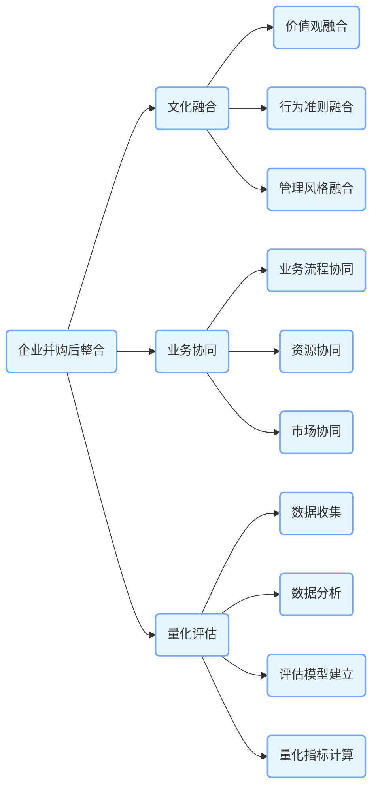

# AI辅助企业并购后整合：文化融合与业务协同的量化评估

> 关键词：AI、企业并购后整合、文化融合、业务协同、量化评估

> 摘要：本文聚焦于AI在企业并购后整合过程中对文化融合与业务协同进行量化评估的应用。首先介绍了相关背景，包括目的、预期读者、文档结构和术语表等。接着阐述了核心概念及其联系，通过文本示意图和Mermaid流程图展示其架构。详细讲解了核心算法原理，并用Python源代码进行说明，同时给出了相关数学模型和公式。通过项目实战案例，展示了开发环境搭建、源代码实现及解读。探讨了实际应用场景，推荐了学习资源、开发工具框架和相关论文著作。最后总结了未来发展趋势与挑战，提供了常见问题解答和扩展阅读参考资料，旨在为企业在并购后整合中利用AI进行量化评估提供全面的指导。

## 1. 背景介绍 
### 1.1 目的和范围
企业并购是企业实现快速扩张、优化资源配置的重要战略手段。然而，并购后的整合过程充满挑战，其中文化融合和业务协同是关键因素。文化融合不佳可能导致员工士气低落、人才流失，业务协同不畅则会影响企业的运营效率和竞争力。本研究的目的是探讨如何利用AI技术对企业并购后的文化融合与业务协同进行量化评估，为企业提供科学的决策依据，提高并购成功率。

本研究的范围涵盖了AI在企业并购后整合中的应用，包括文化融合和业务协同的量化评估方法、相关算法原理、实际案例分析以及未来发展趋势等方面。

### 1.2 预期读者
本文的预期读者包括企业管理者、投资银行家、并购顾问、数据分析专家、AI研究人员以及对企业并购和AI应用感兴趣的专业人士。

### 1.3 文档结构概述
本文将按照以下结构展开：
1. **背景介绍**：阐述研究的目的、范围、预期读者和文档结构，并给出相关术语的定义和解释。
2. **核心概念与联系**：介绍文化融合、业务协同和量化评估的核心概念，展示它们之间的联系，并通过文本示意图和Mermaid流程图进行可视化。
3. **核心算法原理 & 具体操作步骤**：详细讲解用于量化评估的核心算法原理，并用Python源代码进行说明，同时给出具体的操作步骤。
4. **数学模型和公式 & 详细讲解 & 举例说明**：建立量化评估的数学模型，给出相关公式，并通过具体例子进行详细讲解。
5. **项目实战：代码实际案例和详细解释说明**：通过一个实际项目案例，展示开发环境搭建、源代码实现及解读。
6. **实际应用场景**：探讨AI在企业并购后整合中的实际应用场景。
7. **工具和资源推荐**：推荐学习资源、开发工具框架和相关论文著作。
8. **总结：未来发展趋势与挑战**：总结AI在企业并购后整合中的应用现状，分析未来发展趋势和面临的挑战。
9. **附录：常见问题与解答**：提供常见问题的解答，帮助读者更好地理解和应用本文的内容。
10. **扩展阅读 & 参考资料**：列出扩展阅读的建议和参考资料，方便读者进一步深入研究。

### 1.4 术语表
#### 1.4.1 核心术语定义
- **企业并购后整合**：指企业在完成并购交易后，对被并购企业的资源、业务、文化等进行调整和融合，以实现协同效应和企业价值最大化的过程。
- **文化融合**：指并购双方企业在价值观、行为准则、管理风格等方面相互理解、相互接纳和相互融合的过程。
- **业务协同**：指并购双方企业在业务流程、资源配置、市场拓展等方面实现优势互补、协同运作，从而提高企业整体竞争力和运营效率的过程。
- **量化评估**：指运用数学模型和统计方法，对文化融合和业务协同的程度进行定量分析和评价的过程。
- **AI（人工智能）**：指计算机系统能够执行通常需要人类智能才能完成的任务，如学习、推理、决策等的技术。

#### 1.4.2 相关概念解释
- **数据挖掘**：指从大量数据中发现有价值信息和知识的过程，常用于量化评估中的数据处理和分析。
- **机器学习**：指让计算机通过数据学习模式和规律，并利用这些模式和规律进行预测和决策的技术，是AI的重要分支。
- **自然语言处理**：指让计算机理解和处理人类语言的技术，可用于分析企业文本数据，如员工反馈、企业文化宣传资料等。

#### 1.4.3 缩略词列表
- **AI**：Artificial Intelligence（人工智能）
- **ML**：Machine Learning（机器学习）
- **NLP**：Natural Language Processing（自然语言处理）

## 2. 核心概念与联系 

### 核心概念原理
#### 文化融合
文化融合的核心在于并购双方企业价值观、行为准则和管理风格的相互接纳和融合。企业价值观是企业的核心信仰和行为指南，不同企业的价值观可能存在差异。在并购后，需要通过沟通、培训等方式，让双方员工理解和认同新的价值观。行为准则是企业员工在日常工作中遵循的规范，文化融合需要统一双方的行为准则，避免因行为差异导致的冲突。管理风格则涉及企业的决策方式、组织架构和领导方式等方面，需要进行适当的调整和融合，以提高管理效率。

#### 业务协同
业务协同的原理是通过整合并购双方的业务流程、资源和市场，实现优势互补和协同效应。业务流程协同包括优化供应链、生产流程、销售流程等，以提高运营效率和降低成本。资源协同涉及人力、物力、财力等资源的合理配置，避免资源浪费和重复建设。市场协同则是通过整合双方的市场渠道、客户资源和品牌影响力，扩大市场份额和提高市场竞争力。

#### 量化评估
量化评估是运用数学模型和统计方法，对文化融合和业务协同的程度进行定量分析和评价。通过收集相关数据，如员工满意度调查数据、业务指标数据等，利用数据分析技术，建立评估模型，计算出文化融合和业务协同的量化指标。这些指标可以直观地反映企业并购后整合的效果，为企业管理者提供决策依据。

### 架构的文本示意图
```plaintext
企业并购后整合
|-- 文化融合
|   |-- 价值观融合
|   |-- 行为准则融合
|   |-- 管理风格融合
|-- 业务协同
|   |-- 业务流程协同
|   |-- 资源协同
|   |-- 市场协同
|-- 量化评估
|   |-- 数据收集
|   |-- 数据分析
|   |-- 评估模型建立
|   |-- 量化指标计算
```

### Mermaid流程图


## 3. 核心算法原理 & 具体操作步骤 

### 核心算法原理
在量化评估文化融合和业务协同的过程中，我们可以使用机器学习算法，如多元线性回归、决策树和神经网络等。这里以多元线性回归为例进行说明。

多元线性回归是一种用于建立因变量与多个自变量之间线性关系的统计方法。在企业并购后整合的量化评估中，我们可以将文化融合和业务协同的量化指标作为因变量，将影响文化融合和业务协同的因素作为自变量。例如，影响文化融合的因素可能包括员工沟通频率、培训参与度等，影响业务协同的因素可能包括业务流程相似度、资源共享程度等。

多元线性回归的数学模型可以表示为：

$$y = \beta_0 + \beta_1x_1 + \beta_2x_2 + \cdots + \beta_nx_n + \epsilon$$

其中，$y$ 是因变量，$x_1, x_2, \cdots, x_n$ 是自变量，$\beta_0, \beta_1, \beta_2, \cdots, \beta_n$ 是回归系数，$\epsilon$ 是误差项。

通过收集大量的数据，我们可以使用最小二乘法来估计回归系数 $\beta_0, \beta_1, \beta_2, \cdots, \beta_n$，使得误差项 $\epsilon$ 的平方和最小。

### Python源代码实现
```python
import numpy as np
from sklearn.linear_model import LinearRegression

# 示例数据
# 自变量矩阵，每一行代表一个样本，每一列代表一个自变量
X = np.array([[1, 2, 3], [4, 5, 6], [7, 8, 9]])
# 因变量向量
y = np.array([10, 20, 30])

# 创建线性回归模型
model = LinearRegression()

# 拟合模型
model.fit(X, y)

# 输出回归系数
print("回归系数:", model.coef_)
print("截距:", model.intercept_)

# 预测新样本
new_X = np.array([[10, 11, 12]])
prediction = model.predict(new_X)
print("预测值:", prediction)
```

### 具体操作步骤
1. **数据收集**：收集与文化融合和业务协同相关的数据，如员工调查问卷数据、业务指标数据等。确保数据的准确性和完整性。
2. **数据预处理**：对收集到的数据进行清洗、转换和归一化等预处理操作，以提高数据质量和模型的性能。
3. **特征选择**：从预处理后的数据中选择与文化融合和业务协同相关性较高的特征作为自变量。
4. **模型训练**：使用选择好的特征和对应的因变量数据，训练多元线性回归模型。
5. **模型评估**：使用测试数据对训练好的模型进行评估，计算模型的评估指标，如均方误差、决定系数等，以评估模型的性能。
6. **量化指标计算**：使用训练好的模型，对企业并购后的文化融合和业务协同进行量化评估，计算出相应的量化指标。

## 4. 数学模型和公式 & 详细讲解 & 举例说明 

### 数学模型
在多元线性回归模型中，我们已经介绍了基本的数学模型：

$$y = \beta_0 + \beta_1x_1 + \beta_2x_2 + \cdots + \beta_nx_n + \epsilon$$

其中，$y$ 是因变量，代表文化融合或业务协同的量化指标；$x_1, x_2, \cdots, x_n$ 是自变量，代表影响文化融合或业务协同的因素；$\beta_0, \beta_1, \beta_2, \cdots, \beta_n$ 是回归系数，需要通过数据估计得到；$\epsilon$ 是误差项，反映了模型无法解释的随机因素。

### 公式详细讲解
#### 最小二乘法估计回归系数
最小二乘法的目标是使得误差项 $\epsilon$ 的平方和最小，即：

$$\min_{\beta_0, \beta_1, \cdots, \beta_n} \sum_{i=1}^{m} (y_i - (\beta_0 + \beta_1x_{i1} + \beta_2x_{i2} + \cdots + \beta_nx_{in}))^2$$

其中，$m$ 是样本数量，$y_i$ 是第 $i$ 个样本的因变量值，$x_{i1}, x_{i2}, \cdots, x_{in}$ 是第 $i$ 个样本的自变量值。

通过求解上述最小化问题，可以得到回归系数的估计值。在Python的 `sklearn.linear_model.LinearRegression` 中，已经实现了最小二乘法的求解过程。

#### 评估指标
常用的评估指标包括均方误差（Mean Squared Error，MSE）和决定系数（Coefficient of Determination，$R^2$）。

均方误差的计算公式为：

$$MSE = \frac{1}{m} \sum_{i=1}^{m} (y_i - \hat{y}_i)^2$$

其中，$\hat{y}_i$ 是模型对第 $i$ 个样本的预测值。均方误差越小，说明模型的预测效果越好。

决定系数的计算公式为：

$$R^2 = 1 - \frac{\sum_{i=1}^{m} (y_i - \hat{y}_i)^2}{\sum_{i=1}^{m} (y_i - \bar{y})^2}$$

其中，$\bar{y}$ 是因变量的平均值。决定系数的取值范围是 $[0, 1]$，越接近 1 说明模型对数据的拟合效果越好。

### 举例说明
假设我们要评估企业并购后的文化融合程度，我们选择了两个自变量：员工沟通频率 $x_1$ 和培训参与度 $x_2$，因变量是文化融合量化指标 $y$。我们收集了 5 个样本的数据，如下表所示：

| 样本编号 | 员工沟通频率 $x_1$ | 培训参与度 $x_2$ | 文化融合量化指标 $y$ |
|----------|-------------------|------------------|----------------------|
| 1        | 2                 | 0.8              | 7                  |
| 2        | 3                 | 0.9              | 8                  |
| 3        | 4                 | 0.7              | 7.5                |
| 4        | 1                 | 0.6              | 6                  |
| 5        | 5                 | 0.95             | 9                  |

使用Python代码进行分析：
```python
import numpy as np
from sklearn.linear_model import LinearRegression
from sklearn.metrics import mean_squared_error, r2_score

# 自变量矩阵
X = np.array([[2, 0.8], [3, 0.9], [4, 0.7], [1, 0.6], [5, 0.95]])
# 因变量向量
y = np.array([7, 8, 7.5, 6, 9])

# 创建线性回归模型
model = LinearRegression()

# 拟合模型
model.fit(X, y)

# 输出回归系数
print("回归系数:", model.coef_)
print("截距:", model.intercept_)

# 预测
y_pred = model.predict(X)

# 计算评估指标
mse = mean_squared_error(y, y_pred)
r2 = r2_score(y, y_pred)

print("均方误差:", mse)
print("决定系数:", r2)
```

通过上述代码，我们可以得到回归系数、截距、均方误差和决定系数。回归系数表示每个自变量对因变量的影响程度，均方误差和决定系数可以评估模型的性能。

## 5. 项目实战：代码实际案例和详细解释说明 

### 5.1  开发环境搭建
#### 安装Python
首先，确保你已经安装了Python。建议使用Python 3.7及以上版本。你可以从Python官方网站（https://www.python.org/downloads/）下载并安装适合你操作系统的Python版本。

#### 安装必要的库
我们需要安装一些必要的Python库，如 `numpy`、`pandas`、`scikit-learn` 等。可以使用以下命令进行安装：
```sh
pip install numpy pandas scikit-learn
```

### 5.2  源代码详细实现和代码解读
假设我们有一个包含企业并购后文化融合和业务协同相关数据的CSV文件 `data.csv`，文件包含以下列：`communication_frequency`（员工沟通频率）、`training_participation`（培训参与度）、`process_similarity`（业务流程相似度）、`resource_sharing`（资源共享程度）和 `integration_score`（整合得分，作为因变量）。

以下是完整的Python代码实现：
```python
import numpy as np
import pandas as pd
from sklearn.linear_model import LinearRegression
from sklearn.model_selection import train_test_split
from sklearn.metrics import mean_squared_error, r2_score

# 读取数据
data = pd.read_csv('data.csv')

# 提取自变量和因变量
X = data[['communication_frequency', 'training_participation', 'process_similarity', 'resource_sharing']]
y = data['integration_score']

# 划分训练集和测试集
X_train, X_test, y_train, y_test = train_test_split(X, y, test_size=0.2, random_state=42)

# 创建线性回归模型
model = LinearRegression()

# 拟合模型
model.fit(X_train, y_train)

# 输出回归系数
print("回归系数:", model.coef_)
print("截距:", model.intercept_)

# 在测试集上进行预测
y_pred = model.predict(X_test)

# 计算评估指标
mse = mean_squared_error(y_test, y_pred)
r2 = r2_score(y_test, y_pred)

print("均方误差:", mse)
print("决定系数:", r2)
```

### 代码解读与分析
1. **数据读取**：使用 `pandas` 库的 `read_csv` 函数读取CSV文件中的数据。
2. **自变量和因变量提取**：从数据中提取自变量（影响文化融合和业务协同的因素）和因变量（整合得分）。
3. **数据集划分**：使用 `train_test_split` 函数将数据集划分为训练集和测试集，其中测试集占比为 20%。
4. **模型创建和拟合**：创建 `LinearRegression` 模型，并使用训练集数据进行拟合。
5. **回归系数和截距输出**：输出模型的回归系数和截距，回归系数表示每个自变量对因变量的影响程度。
6. **预测和评估**：使用训练好的模型在测试集上进行预测，并计算均方误差和决定系数，评估模型的性能。

## 6. 实际应用场景 
### 企业决策支持
企业管理者可以根据量化评估结果，制定针对性的整合策略。例如，如果文化融合量化指标较低，说明企业在文化方面存在较大问题，管理者可以加强文化沟通和培训，促进双方文化的融合。如果业务协同量化指标不理想，管理者可以对业务流程进行优化，加强资源共享和市场协同。

### 投资者评估
投资者在评估企业并购项目时，可以参考量化评估结果。量化指标可以直观地反映企业并购后的整合效果和潜在风险，帮助投资者做出更明智的投资决策。

### 并购后绩效监控
企业可以定期进行量化评估，监控并购后文化融合和业务协同的进展情况。通过对比不同时期的量化指标，及时发现问题并采取措施进行调整，确保并购项目按计划推进。

### 行业标杆对比
企业可以将自己的量化评估结果与行业内其他企业的并购案例进行对比，了解自身在文化融合和业务协同方面的优势和不足，借鉴其他企业的成功经验，提升自身的并购整合能力。

## 7. 工具和资源推荐
### 7.1 学习资源推荐
#### 7.1.1 书籍推荐
- 《Python机器学习实战》：本书详细介绍了Python在机器学习中的应用，包括各种机器学习算法的原理和实现，适合初学者入门。
- 《人工智能：一种现代的方法》：这是一本经典的人工智能教材，全面介绍了人工智能的各个领域，包括机器学习、自然语言处理等。
- 《企业并购与重组》：该书系统阐述了企业并购的理论、策略和整合方法，对理解企业并购后整合有很大帮助。

#### 7.1.2 在线课程
- Coursera上的“机器学习”课程：由斯坦福大学教授Andrew Ng主讲，是学习机器学习的经典课程。
- edX上的“人工智能基础”课程：提供了人工智能的基础知识和实践技能培训。
- 网易云课堂上的“企业并购与整合实战”课程：结合实际案例，讲解企业并购后的整合策略和方法。

#### 7.1.3 技术博客和网站
- 机器之心（https://www.alignmentnews.com/）：提供最新的人工智能技术资讯和深度分析。
- 开源中国（https://www.oschina.net/）：涵盖了各种开源技术和项目，包括机器学习和数据分析相关的内容。
- 36氪（https://36kr.com/）：关注科技、商业等领域的创新动态，有很多关于企业并购和AI应用的报道。

### 7.2 开发工具框架推荐
#### 7.2.1 IDE和编辑器
- PyCharm：是一款专门为Python开发设计的集成开发环境，具有代码编辑、调试、自动补全等功能，非常适合Python机器学习项目的开发。
- Jupyter Notebook：是一个基于Web的交互式开发环境，可以将代码、文本、图表等内容整合在一起，方便进行数据分析和模型实验。
- Visual Studio Code：是一款轻量级的代码编辑器，支持多种编程语言和插件扩展，可用于Python开发和机器学习项目。

#### 7.2.2 调试和性能分析工具
- TensorBoard：是TensorFlow的可视化工具，可以用于监控模型训练过程中的各种指标，如损失函数、准确率等，帮助开发者调试模型。
- Py-Spy：是一个Python性能分析工具，可以实时监控Python程序的CPU使用情况和函数调用时间，帮助开发者找出性能瓶颈。
- Scikit-learn的交叉验证工具：可以用于评估机器学习模型的性能，通过多次划分训练集和测试集，计算模型的平均评估指标，提高评估结果的可靠性。

#### 7.2.3 相关框架和库
- Scikit-learn：是一个简单易用的机器学习库，提供了各种机器学习算法的实现，如线性回归、决策树、神经网络等，适合初学者和快速开发。
- TensorFlow：是一个开源的深度学习框架，由Google开发，广泛应用于图像识别、自然语言处理等领域。
- PyTorch：是另一个流行的深度学习框架，具有动态图和易于使用的特点，受到很多研究者和开发者的喜爱。

### 7.3 相关论文著作推荐
#### 7.3.1 经典论文
- “Machine Learning” by Tom M. Mitchell：这是机器学习领域的经典著作，系统介绍了机器学习的基本概念、算法和应用。
- “Deep Learning” by Yann LeCun, Yoshua Bengio, and Geoffrey Hinton：该论文对深度学习的发展和应用进行了全面的综述，是深度学习领域的重要文献。
- “Mergers and Acquisitions: A Guide to Creating Value for Stakeholders” by Robert F. Bruner：这本书对企业并购的理论和实践进行了深入探讨，提供了很多有价值的见解。

#### 7.3.2 最新研究成果
- 可以关注顶级学术会议和期刊，如NeurIPS（神经信息处理系统大会）、ICML（国际机器学习会议）、Journal of Financial Economics（金融经济学杂志）等，获取关于AI和企业并购的最新研究成果。

#### 7.3.3 应用案例分析
- 一些咨询公司和研究机构会发布企业并购的应用案例分析报告，如麦肯锡、波士顿咨询等。这些报告可以帮助我们了解实际案例中AI在企业并购后整合中的应用情况和效果。

## 8. 总结：未来发展趋势与挑战
### 未来发展趋势
#### AI技术的不断创新
随着AI技术的不断发展，如深度学习、强化学习等技术的不断创新，将为企业并购后整合的量化评估提供更强大的工具和方法。例如，深度学习可以处理更复杂的数据，如文本、图像等，从而更全面地评估文化融合和业务协同。

#### 多源数据的融合应用
未来，企业将更多地融合多源数据，如社交媒体数据、传感器数据等，进行量化评估。多源数据的融合可以提供更丰富的信息，提高评估的准确性和全面性。

#### 实时评估和动态调整
借助实时数据采集和处理技术，企业可以实现对文化融合和业务协同的实时评估，并根据评估结果进行动态调整。这将有助于企业及时发现问题并采取措施，提高并购整合的效率和成功率。

#### 智能化决策支持系统的发展
未来将出现更多基于AI的智能化决策支持系统，为企业管理者提供更科学、更智能的决策建议。这些系统可以根据量化评估结果和企业的战略目标，自动生成整合策略和行动计划。

### 挑战
#### 数据质量和隐私问题
数据质量是量化评估的基础，如果数据不准确、不完整或存在偏差，将影响评估结果的可靠性。同时，企业在收集和使用数据时，还需要考虑数据隐私和安全问题，遵守相关法律法规。

#### AI模型的可解释性
一些复杂的AI模型，如深度学习模型，往往具有较高的预测精度，但缺乏可解释性。在企业并购后整合的量化评估中，管理者需要理解模型的决策过程和依据，因此提高AI模型的可解释性是一个重要的挑战。

#### 文化和组织差异的复杂性
不同企业的文化和组织差异非常复杂，难以用简单的指标和模型进行量化评估。如何准确地衡量文化融合和业务协同的程度，是一个需要深入研究的问题。

#### 技术人才短缺
AI技术的应用需要具备相关专业知识和技能的人才，但目前市场上这类人才相对短缺。企业需要加强人才培养和引进，以满足AI在企业并购后整合中的应用需求。

## 9. 附录：常见问题与解答
### 1. 如何选择合适的自变量进行量化评估？
选择自变量时，需要考虑以下几个方面：
- **相关性**：自变量应与文化融合或业务协同有较高的相关性，可以通过数据分析方法，如相关性分析，来筛选出相关性较高的自变量。
- **可测量性**：自变量应能够通过数据进行测量和量化，确保数据的准确性和可靠性。
- **实际意义**：自变量应具有实际的业务意义，能够反映影响文化融合和业务协同的关键因素。

### 2. 如果数据量较小，如何保证模型的性能？
当数据量较小时，可以采取以下措施来保证模型的性能：
- **特征选择**：选择与因变量相关性较高的特征，减少特征数量，避免过拟合。
- **交叉验证**：使用交叉验证方法，如K折交叉验证，充分利用有限的数据进行模型评估和调优。
- **选择简单模型**：避免使用过于复杂的模型，选择简单的模型，如线性回归模型，更容易在小数据集上取得较好的性能。

### 3. 如何评估量化评估结果的可靠性？
可以从以下几个方面评估量化评估结果的可靠性：
- **模型评估指标**：计算模型的评估指标，如均方误差、决定系数等，评估模型的拟合效果和预测能力。
- **稳定性分析**：通过多次重复实验，观察评估结果的稳定性，如果结果波动较小，说明评估结果较为可靠。
- **业务合理性**：评估结果应符合业务实际情况，具有一定的合理性。如果评估结果与实际情况相差较大，需要重新检查数据和模型。

### 4. AI在企业并购后整合中的应用是否会取代人类决策？
AI在企业并购后整合中的应用主要是提供数据支持和决策建议，不能完全取代人类决策。人类管理者具有丰富的经验和判断力，能够考虑到各种复杂的因素和情境。AI可以帮助管理者更科学、更高效地做出决策，但最终的决策仍需要人类管理者根据实际情况进行综合判断。

## 10. 扩展阅读 & 参考资料
### 扩展阅读
- 《大数据时代：生活、工作与思维的大变革》：了解大数据的概念、技术和应用，对理解数据在企业并购后整合中的作用有帮助。
- 《创新者的窘境》：探讨企业在面对技术变革和市场竞争时的创新策略，对企业并购和整合有一定的启示。
- 《组织文化与领导力》：深入研究组织文化的形成、发展和变革，有助于理解企业并购后的文化融合问题。

### 参考资料
- 相关学术论文和研究报告，可以从学术数据库，如IEEE Xplore、ACM Digital Library等获取。
- 企业年报、行业研究报告等公开资料，了解企业并购的实际情况和行业发展趋势。
- 官方文档和技术博客，如Scikit-learn、TensorFlow等库的官方文档，获取最新的技术信息和使用方法。

作者：AI天才研究院/AI Genius Institute & 禅与计算机程序设计艺术 /Zen And The Art of Computer Programming