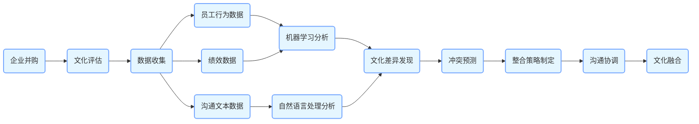

# AI辅助企业并购文化整合：减少冲突

> 关键词：AI、企业并购、文化整合、冲突减少、人工智能应用

> 摘要：本文聚焦于AI在企业并购文化整合中的应用，旨在探讨如何借助AI技术减少文化整合过程中的冲突。首先介绍了企业并购文化整合的背景和重要性，阐述了AI在此过程中的关键作用。接着详细解析了相关核心概念，包括企业文化、文化冲突以及AI在文化整合中的应用原理，并给出了相应的架构示意图和流程图。深入讲解了用于文化整合分析的核心算法原理及具体操作步骤，同时给出Python源代码示例。从数学模型和公式层面进一步剖析了文化整合的量化分析方法。通过实际项目案例展示了如何运用AI进行文化整合的代码实现和详细解读。列举了AI辅助企业并购文化整合的实际应用场景，推荐了相关的学习资源、开发工具框架以及论文著作。最后总结了未来发展趋势与挑战，并提供常见问题解答和扩展阅读参考资料，为企业借助AI实现高效文化整合提供全面的技术支持和理论指导。

## 1. 背景介绍 
### 1.1 目的和范围
企业并购作为一种重要的资本运作方式，在实现资源优化配置、扩大市场份额等方面具有显著作用。然而，企业并购后的文化整合一直是困扰众多企业的难题。文化差异可能导致员工之间的沟通障碍、价值观冲突以及工作效率低下等问题，严重影响并购后企业的协同效应和长期发展。本文章的目的在于探讨如何利用AI技术辅助企业进行并购后的文化整合，减少文化冲突，提高整合效率和效果。范围涵盖了AI在文化整合过程中的各个环节，包括文化评估、冲突预测、沟通协调以及整合策略制定等方面。

### 1.2 预期读者
本文预期读者主要包括企业的高级管理人员、并购整合专家、IT技术人员以及对企业并购和AI应用感兴趣的研究人员。企业高级管理人员可以从文中了解如何运用AI技术解决文化整合难题，制定更加科学的并购战略；并购整合专家能够获取新的技术手段和方法，提升文化整合的专业水平；IT技术人员可以借鉴文中的算法原理和代码实现，开发相关的AI应用系统；研究人员则可以在此基础上开展更深入的学术研究。

### 1.3 文档结构概述
本文共分为十个部分。第一部分为背景介绍，阐述了文章的目的、范围、预期读者和文档结构概述，并给出了相关术语的定义和解释。第二部分介绍了企业并购文化整合的核心概念以及AI在其中的联系，同时给出了架构示意图和流程图。第三部分详细讲解了用于文化整合分析的核心算法原理和具体操作步骤，并提供Python源代码示例。第四部分从数学模型和公式的角度对文化整合进行了量化分析，并举例说明。第五部分通过实际项目案例展示了AI辅助文化整合的代码实现和详细解读。第六部分列举了AI在企业并购文化整合中的实际应用场景。第七部分推荐了相关的学习资源、开发工具框架以及论文著作。第八部分总结了未来发展趋势与挑战。第九部分为附录，提供常见问题解答。第十部分给出了扩展阅读和参考资料。

### 1.4 术语表
#### 1.4.1 核心术语定义
- **企业并购**：指两家或更多的独立企业合并组成一家企业，通常由一家占优势的公司吸收一家或更多的公司。
- **文化整合**：是指在企业并购过程中，将不同企业文化相互融合、协调，形成一种共同的价值观、行为准则和经营理念的过程。
- **文化冲突**：指不同文化背景的群体在价值观、信仰、行为方式等方面存在差异，导致在企业并购后产生的矛盾和摩擦。
- **AI（人工智能）**：是一门研究如何使计算机能够模拟人类智能的学科和技术，包括机器学习、自然语言处理、计算机视觉等多个领域。

#### 1.4.2 相关概念解释
- **机器学习**：是AI的一个重要分支，它让计算机通过数据学习模式和规律，从而做出预测和决策。在企业并购文化整合中，机器学习可以用于分析员工的行为数据、文本数据等，以发现潜在的文化冲突。
- **自然语言处理**：主要研究如何让计算机理解和处理人类语言。在文化整合中，自然语言处理可以用于分析员工的沟通文本、社交媒体言论等，以了解员工的态度和情绪。
- **数据挖掘**：是从大量数据中发现有价值信息和知识的过程。在企业并购文化整合中，数据挖掘可以用于挖掘员工的行为模式、团队协作情况等，为文化整合提供决策支持。

#### 1.4.3 缩略词列表
- **AI**：Artificial Intelligence（人工智能）
- **ML**：Machine Learning（机器学习）
- **NLP**：Natural Language Processing（自然语言处理）

## 2. 核心概念与联系 

### 核心概念原理
#### 企业文化
企业文化是企业在长期发展过程中形成的共同价值观、行为准则、经营理念等的总和。它包括物质文化、制度文化、行为文化和精神文化四个层面。物质文化是企业文化的外在表现，如企业的办公环境、产品包装等；制度文化是企业的规章制度和管理流程；行为文化是员工的行为方式和工作习惯；精神文化是企业文化的核心，如企业的价值观、使命和愿景等。

#### 文化冲突
文化冲突是企业并购后常见的问题。由于不同企业的文化背景、发展历程和管理模式不同，员工在价值观、工作方式、沟通风格等方面可能存在差异。这些差异可能导致员工之间的误解、矛盾和冲突，影响企业的工作效率和团队协作。文化冲突主要表现为价值观冲突、管理风格冲突和沟通障碍等。

#### AI在文化整合中的应用原理
AI可以通过多种技术手段辅助企业进行并购后的文化整合。首先，利用机器学习算法对企业的各种数据进行分析，如员工的行为数据、绩效数据、沟通数据等，以发现潜在的文化差异和冲突。其次，借助自然语言处理技术分析员工的文本数据，如邮件、聊天记录、社交媒体言论等，了解员工的态度和情绪，及时发现文化冲突的迹象。最后，通过智能推荐系统为企业提供个性化的文化整合策略和建议，帮助企业制定科学合理的整合方案。

### 架构示意图


该架构示意图展示了AI辅助企业并购文化整合的整个流程。从企业并购开始，首先进行文化评估，收集相关数据，包括员工行为数据、沟通文本数据和绩效数据等。然后利用机器学习和自然语言处理技术对数据进行分析，发现文化差异，预测冲突。根据分析结果制定整合策略，通过沟通协调促进文化融合。

## 3. 核心算法原理 & 具体操作步骤 

### 核心算法原理
#### 聚类分析算法
聚类分析是一种无监督学习算法，它将数据集中的对象划分为不同的簇，使得同一簇内的对象相似度较高，不同簇之间的对象相似度较低。在企业并购文化整合中，聚类分析可以用于将员工按照文化特征进行分类，从而发现不同文化群体的存在。常用的聚类分析算法有K-Means算法。

K-Means算法的基本思想是：首先随机选择K个中心点作为初始聚类中心，然后将数据集中的每个对象分配到距离最近的中心点所在的簇中，接着重新计算每个簇的中心点，重复这个过程直到中心点不再发生变化或达到最大迭代次数。

#### 情感分析算法
情感分析是自然语言处理的一个重要任务，它用于判断文本的情感倾向，如积极、消极或中性。在企业并购文化整合中，情感分析可以用于分析员工的沟通文本，了解员工对并购和文化整合的态度和情绪。常用的情感分析算法有基于机器学习的方法和基于词典的方法。

基于机器学习的方法通常使用分类器，如朴素贝叶斯分类器、支持向量机等，对文本进行情感分类。基于词典的方法则是通过预先定义的情感词典，计算文本中每个词的情感得分，然后综合得到文本的情感倾向。

### 具体操作步骤及Python源代码示例
#### 聚类分析（K-Means算法）
```python
import numpy as np
from sklearn.cluster import KMeans
import matplotlib.pyplot as plt

# 生成示例数据
np.random.seed(0)
X = np.vstack([
    np.random.normal(loc=[0, 0], scale=1, size=(100, 2)),
    np.random.normal(loc=[5, 5], scale=1, size=(100, 2)),
    np.random.normal(loc=[10, 0], scale=1, size=(100, 2))
])

# 使用K-Means算法进行聚类
kmeans = KMeans(n_clusters=3, random_state=0)
kmeans.fit(X)

# 获取聚类标签
labels = kmeans.labels_

# 可视化聚类结果
plt.scatter(X[:, 0], X[:, 1], c=labels, cmap='viridis')
plt.scatter(kmeans.cluster_centers_[:, 0], kmeans.cluster_centers_[:, 1], marker='x', color='red', s=200)
plt.title('K-Means Clustering')
plt.xlabel('Feature 1')
plt.ylabel('Feature 2')
plt.show()
```
上述代码首先生成了一个包含三个聚类的示例数据集，然后使用K-Means算法将数据集中的对象划分为三个簇。最后，通过可视化的方式展示了聚类结果。

#### 情感分析（基于朴素贝叶斯分类器）
```python
from sklearn.feature_extraction.text import TfidfVectorizer
from sklearn.naive_bayes import MultinomialNB
from sklearn.pipeline import Pipeline
from sklearn.model_selection import train_test_split
from sklearn.metrics import accuracy_score

# 示例数据集
documents = [
    "This is a great opportunity for our company.",
    "I'm really worried about the merger.",
    "The new culture seems exciting.",
    "I don't like the changes after the merger."
]
labels = [1, 0, 1, 0]  # 1表示积极，0表示消极

# 划分训练集和测试集
X_train, X_test, y_train, y_test = train_test_split(documents, labels, test_size=0.2, random_state=0)

# 创建情感分析管道
pipeline = Pipeline([
    ('vectorizer', TfidfVectorizer()),
    ('classifier', MultinomialNB())
])

# 训练模型
pipeline.fit(X_train, y_train)

# 预测
y_pred = pipeline.predict(X_test)

# 计算准确率
accuracy = accuracy_score(y_test, y_pred)
print(f"Accuracy: {accuracy}")
```
上述代码使用朴素贝叶斯分类器进行情感分析。首先，将示例数据集划分为训练集和测试集，然后创建一个包含TfidfVectorizer和MultinomialNB的管道。接着，使用训练集对模型进行训练，最后使用测试集进行预测并计算准确率。

## 4. 数学模型和公式 & 详细讲解 & 举例说明 

### 聚类分析（K-Means算法）
#### 数学模型和公式
K-Means算法的目标是最小化所有数据点到其所属簇中心点的距离平方和，即：
$$
J = \sum_{i=1}^{K} \sum_{x_j \in C_i} ||x_j - \mu_i||^2
$$
其中，$K$ 是聚类的数量，$C_i$ 是第 $i$ 个簇，$x_j$ 是数据集中的第 $j$ 个数据点，$\mu_i$ 是第 $i$ 个簇的中心点。

#### 详细讲解
K-Means算法通过迭代的方式不断更新簇的中心点，直到目标函数 $J$ 收敛或达到最大迭代次数。具体步骤如下：
1. 随机选择 $K$ 个中心点 $\mu_1, \mu_2, \cdots, \mu_K$。
2. 对于每个数据点 $x_j$，计算其到每个中心点的距离 $||x_j - \mu_i||^2$，将 $x_j$ 分配到距离最近的中心点所在的簇 $C_i$ 中。
3. 重新计算每个簇的中心点 $\mu_i$：
$$
\mu_i = \frac{1}{|C_i|} \sum_{x_j \in C_i} x_j
$$
其中，$|C_i|$ 是第 $i$ 个簇的大小。
4. 重复步骤2和3，直到中心点不再发生变化或达到最大迭代次数。

#### 举例说明
假设有一个二维数据集 $X = \{x_1, x_2, x_3, x_4\}$，其中 $x_1 = (1, 2)$，$x_2 = (2, 3)$，$x_3 = (8, 9)$，$x_4 = (9, 10)$，我们要将其划分为两个簇（$K = 2$）。

1. 随机选择两个中心点 $\mu_1 = (1, 2)$，$\mu_2 = (8, 9)$。
2. 计算每个数据点到中心点的距离：
    - $||x_1 - \mu_1||^2 = 0$，$||x_1 - \mu_2||^2 = (1 - 8)^2 + (2 - 9)^2 = 98$，所以 $x_1$ 属于簇 $C_1$。
    - $||x_2 - \mu_1||^2 = (2 - 1)^2 + (3 - 2)^2 = 2$，$||x_2 - \mu_2||^2 = (2 - 8)^2 + (3 - 9)^2 = 72$，所以 $x_2$ 属于簇 $C_1$。
    - $||x_3 - \mu_1||^2 = (8 - 1)^2 + (9 - 2)^2 = 98$，$||x_3 - \mu_2||^2 = 0$，所以 $x_3$ 属于簇 $C_2$。
    - $||x_4 - \mu_1||^2 = (9 - 1)^2 + (10 - 2)^2 = 128$，$||x_4 - \mu_2||^2 = (9 - 8)^2 + (10 - 9)^2 = 2$，所以 $x_4$ 属于簇 $C_2$。
3. 重新计算中心点：
    - $\mu_1 = \frac{1}{2} (x_1 + x_2) = \frac{1}{2} ((1, 2) + (2, 3)) = (1.5, 2.5)$
    - $\mu_2 = \frac{1}{2} (x_3 + x_4) = \frac{1}{2} ((8, 9) + (9, 10)) = (8.5, 9.5)$
4. 重复步骤2和3，直到中心点不再发生变化。

### 情感分析（基于朴素贝叶斯分类器）
#### 数学模型和公式
朴素贝叶斯分类器基于贝叶斯定理，对于一个文本 $x = (x_1, x_2, \cdots, x_n)$，其属于类别 $c$ 的概率为：
$$
P(c|x) = \frac{P(x|c)P(c)}{P(x)}
$$
其中，$P(c|x)$ 是给定文本 $x$ 时类别 $c$ 的后验概率，$P(x|c)$ 是类别 $c$ 下文本 $x$ 的似然概率，$P(c)$ 是类别 $c$ 的先验概率，$P(x)$ 是文本 $x$ 的概率。

由于 $P(x)$ 对于所有类别都是相同的，因此可以忽略不计，只需要比较 $P(x|c)P(c)$ 的大小来确定文本的类别。

在朴素贝叶斯分类器中，假设文本中的每个特征（词）是相互独立的，即：
$$
P(x|c) = \prod_{i=1}^{n} P(x_i|c)
$$

#### 详细讲解
基于朴素贝叶斯分类器的情感分析步骤如下：
1. 收集训练数据集，包括文本和对应的情感标签（积极或消极）。
2. 对训练数据进行预处理，如分词、去除停用词等。
3. 计算每个类别的先验概率 $P(c)$，即每个类别在训练数据集中的比例。
4. 计算每个特征（词）在每个类别下的似然概率 $P(x_i|c)$，可以使用拉普拉斯平滑来避免概率为零的情况。
5. 对于新的文本，计算其属于每个类别的后验概率 $P(c|x)$，选择后验概率最大的类别作为文本的情感标签。

#### 举例说明
假设有一个训练数据集，包含以下文本和标签：
| 文本 | 标签 |
| --- | --- |
| "This is a great movie." | 积极 |
| "The food is terrible." | 消极 |
| "I love this book." | 积极 |
| "This service is bad." | 消极 |

我们要对新的文本 "This movie is amazing." 进行情感分析。

1. 计算先验概率：
    - $P(积极) = \frac{2}{4} = 0.5$
    - $P(消极) = \frac{2}{4} = 0.5$
2. 对训练数据进行分词和去除停用词，得到特征集合。
3. 计算每个特征在每个类别下的似然概率，例如：
    - $P("great"|积极) = \frac{1}{3}$（在积极文本中 "great" 出现1次，积极文本总词数为3）
    - $P("terrible"|消极) = \frac{1}{3}$
4. 对于新的文本 "This movie is amazing."，分词后得到特征集合 {"this", "movie", "is", "amazing"}，计算其属于每个类别的后验概率：
    - $P(积极|x) \propto P(积极) \times P("this"|积极) \times P("movie"|积极) \times P("is"|积极) \times P("amazing"|积极)$
    - $P(消极|x) \propto P(消极) \times P("this"|消极) \times P("movie"|消极) \times P("is"|消极) \times P("amazing"|消极)$
5. 比较 $P(积极|x)$ 和 $P(消极|x)$ 的大小，选择后验概率最大的类别作为文本的情感标签。

## 5. 项目实战：代码实际案例和详细解释说明 

### 5.1  开发环境搭建
#### 操作系统
建议使用Linux系统，如Ubuntu 18.04及以上版本，或者Windows 10系统。

#### Python环境
安装Python 3.7及以上版本，可以从Python官方网站（https://www.python.org/downloads/）下载安装包进行安装。

#### 依赖库安装
使用pip命令安装所需的依赖库：
```sh
pip install numpy pandas scikit-learn matplotlib
```

### 5.2  源代码详细实现和代码解读
```python
import numpy as np
import pandas as pd
from sklearn.cluster import KMeans
from sklearn.feature_extraction.text import TfidfVectorizer
from sklearn.naive_bayes import MultinomialNB
from sklearn.pipeline import Pipeline
from sklearn.model_selection import train_test_split
from sklearn.metrics import accuracy_score

# 模拟企业员工数据
employee_data = {
    'behavior_score': np.random.randint(0, 100, 200),
    'communication_text': [
        "The new work environment is great.",
        "I'm not satisfied with the changes.",
        # 更多文本数据...
    ] * 100,
    'performance_score': np.random.randint(0, 100, 200)
}
df = pd.DataFrame(employee_data)

# 聚类分析（K-Means算法）
X_cluster = df[['behavior_score', 'performance_score']].values
kmeans = KMeans(n_clusters=3, random_state=0)
df['cluster_label'] = kmeans.fit_predict(X_cluster)

# 情感分析（基于朴素贝叶斯分类器）
# 假设已经有情感标签的训练数据
train_texts = [
    "This is a great opportunity for our company.",
    "I'm really worried about the merger.",
    "The new culture seems exciting.",
    "I don't like the changes after the merger."
]
train_labels = [1, 0, 1, 0]  # 1表示积极，0表示消极

# 创建情感分析管道
pipeline = Pipeline([
    ('vectorizer', TfidfVectorizer()),
    ('classifier', MultinomialNB())
])

# 训练模型
pipeline.fit(train_texts, train_labels)

# 对员工沟通文本进行情感分析
df['sentiment_label'] = pipeline.predict(df['communication_text'])

# 输出结果
print(df[['cluster_label', 'sentiment_label']])
```
### 代码解读与分析
1. **数据模拟**：使用 `numpy` 和 `pandas` 模拟了企业员工的行为得分、沟通文本和绩效得分数据，并将其存储在一个 `DataFrame` 中。
2. **聚类分析**：提取行为得分和绩效得分作为特征，使用K-Means算法将员工划分为三个簇，并将聚类标签添加到 `DataFrame` 中。
3. **情感分析**：创建一个包含TfidfVectorizer和MultinomialNB的管道，使用示例训练数据对模型进行训练。然后对员工的沟通文本进行情感分析，并将情感标签添加到 `DataFrame` 中。
4. **结果输出**：打印出聚类标签和情感标签，以便进一步分析员工的文化特征和态度。

通过这个项目实战，我们可以看到如何运用AI技术对企业员工数据进行分析，从而辅助企业进行并购后的文化整合。

## 6. 实际应用场景 
### 文化评估阶段
在企业并购前，AI可以帮助企业对目标企业的文化进行全面评估。通过分析目标企业的官方网站、社交媒体、员工博客等文本数据，了解其价值观、经营理念和管理风格。同时，利用机器学习算法对目标企业的员工行为数据、绩效数据等进行分析，发现潜在的文化差异和问题。例如，通过分析员工的考勤数据、工作时长数据等，了解员工的工作态度和敬业精神；通过分析员工的团队协作数据，了解其团队文化和沟通方式。

### 冲突预测阶段
在企业并购后，AI可以实时监测员工的沟通文本、行为数据等，预测潜在的文化冲突。例如，通过自然语言处理技术分析员工的邮件、聊天记录等，发现员工之间的矛盾和不满情绪；通过机器学习算法分析员工的行为模式，预测可能出现的团队冲突。一旦发现潜在的冲突，系统可以及时发出预警，提醒企业管理人员采取措施进行干预。

### 沟通协调阶段
AI可以为企业提供智能化的沟通协调工具。例如，开发智能聊天机器人，解答员工关于并购和文化整合的疑问，提供相关的政策和信息。同时，利用自然语言处理技术分析员工的沟通需求和偏好，为员工提供个性化的沟通建议。此外，AI还可以通过分析员工的沟通数据，发现沟通中的问题和障碍，帮助企业优化沟通流程和方式。

### 整合策略制定阶段
AI可以根据文化评估和冲突预测的结果，为企业制定个性化的文化整合策略。例如，通过分析不同文化群体的特征和需求，制定针对性的培训计划和激励措施；根据员工的情感倾向和态度，调整文化整合的节奏和方式。同时，AI还可以通过模拟不同的整合策略，评估其效果和风险，为企业提供决策支持。

## 7. 工具和资源推荐
### 7.1 学习资源推荐
#### 7.1.1 书籍推荐
- 《人工智能：一种现代的方法》：这本书是人工智能领域的经典教材，全面介绍了人工智能的基本概念、算法和应用。
- 《Python机器学习》：详细介绍了Python在机器学习中的应用，包括各种机器学习算法的原理和实现。
- 《自然语言处理入门》：适合初学者学习自然语言处理的基础知识和技术。

#### 7.1.2 在线课程
- Coursera上的“机器学习”课程：由斯坦福大学教授Andrew Ng主讲，是机器学习领域最受欢迎的在线课程之一。
- edX上的“人工智能基础”课程：系统介绍了人工智能的基本概念、算法和应用。
- 网易云课堂上的“Python自然语言处理实战”课程：通过实际案例介绍了Python在自然语言处理中的应用。

#### 7.1.3 技术博客和网站
- Medium：上面有很多关于人工智能、机器学习和自然语言处理的技术文章和案例分享。
- Towards Data Science：专注于数据科学和机器学习领域的技术博客，提供了很多实用的教程和案例。
- AI社区：国内的人工智能技术社区，有很多关于人工智能的最新动态和技术讨论。

### 7.2 开发工具框架推荐
#### 7.2.1 IDE和编辑器
- PyCharm：一款专门为Python开发设计的集成开发环境，提供了丰富的功能和插件，方便开发和调试。
- Jupyter Notebook：一种交互式的开发环境，适合进行数据分析和模型实验。
- Visual Studio Code：一款轻量级的代码编辑器，支持多种编程语言和插件，具有良好的扩展性。

#### 7.2.2 调试和性能分析工具
- PDB：Python自带的调试器，可以帮助开发者定位和解决代码中的问题。
- cProfile：Python的性能分析工具，可以分析代码的运行时间和资源消耗情况。
- TensorBoard：TensorFlow提供的可视化工具，可以帮助开发者可视化模型的训练过程和性能指标。

#### 7.2.3 相关框架和库
- Scikit-learn：一个简单易用的机器学习库，提供了各种机器学习算法和工具，方便进行数据处理、模型训练和评估。
- NLTK：自然语言处理工具包，提供了丰富的语料库和工具，方便进行文本处理、词性标注、命名实体识别等任务。
- SpaCy：一个高效的自然语言处理库，提供了快速的文本处理和分析功能，适合处理大规模文本数据。

### 7.3 相关论文著作推荐
#### 7.3.1 经典论文
- “A Mathematical Theory of Communication”：信息论的经典论文，为自然语言处理和机器学习提供了理论基础。
- “The Elements of Statistical Learning”：机器学习领域的经典著作，详细介绍了各种机器学习算法的原理和应用。
- “Neural Networks and Deep Learning”：深度学习领域的经典论文，介绍了神经网络的基本原理和深度学习的发展历程。

#### 7.3.2 最新研究成果
- 关注顶级学术会议，如NeurIPS、ICML、ACL等，这些会议上会发表很多关于人工智能、机器学习和自然语言处理的最新研究成果。
- 查阅相关学术期刊，如Journal of Artificial Intelligence Research、Artificial Intelligence等，这些期刊上会发表高质量的学术论文。

#### 7.3.3 应用案例分析
- 一些知名企业的技术博客和官方网站会分享他们在人工智能和机器学习领域的应用案例，如Google、Microsoft、Facebook等。
- 一些行业报告和研究机构的网站也会提供相关的应用案例分析，如Gartner、IDC等。

## 8. 总结：未来发展趋势与挑战
### 未来发展趋势
#### 更智能化的文化整合解决方案
未来，AI技术将不断发展和完善，为企业提供更智能化的文化整合解决方案。例如，利用深度学习算法对大量的企业数据进行分析，发现更复杂的文化模式和潜在的冲突；开发更智能的聊天机器人和虚拟助手，提供更个性化的服务和支持。

#### 跨领域融合应用
AI技术将与其他领域的技术进行更深入的融合，如区块链、物联网等。例如，利用区块链技术保证企业数据的安全性和可信度，利用物联网技术收集更多的员工行为数据，为文化整合提供更全面的支持。

#### 云服务模式的普及
随着云计算技术的发展，越来越多的企业将选择使用云服务模式来进行文化整合。云服务提供商可以提供强大的计算资源和存储能力，帮助企业降低成本，提高效率。

### 挑战
#### 数据隐私和安全问题
在使用AI技术进行文化整合的过程中，需要收集和处理大量的企业数据，包括员工的个人信息和敏感数据。因此，数据隐私和安全问题是一个重要的挑战。企业需要采取有效的措施来保护数据的安全，遵守相关的法律法规。

#### 算法解释性问题
一些复杂的AI算法，如深度学习算法，往往具有较高的黑盒性，难以解释其决策过程和结果。在企业并购文化整合中，这可能会导致企业管理人员对算法的信任度降低，影响决策的制定。因此，提高算法的解释性是一个亟待解决的问题。

#### 文化多样性和复杂性
不同企业的文化具有多样性和复杂性，AI技术在处理这些文化差异时可能会遇到困难。例如，一些文化因素可能难以用数据来量化和分析，需要结合人类的经验和判断。因此，如何更好地处理文化多样性和复杂性是未来的一个挑战。

## 9. 附录：常见问题与解答
### 问题1：AI技术在企业并购文化整合中的效果如何评估？
答：可以从多个方面评估AI技术在企业并购文化整合中的效果。例如，通过员工满意度调查了解员工对文化整合的态度和感受；分析企业的绩效指标，如销售额、利润率等，评估文化整合对企业业绩的影响；观察员工的行为变化，如团队协作效率、沟通频率等，评估文化整合对员工行为的影响。

### 问题2：AI技术是否可以完全替代人工进行文化整合？
答：虽然AI技术可以在文化整合中发挥重要作用，但目前还不能完全替代人工。文化整合涉及到很多人类的情感、价值观和人际关系等方面的因素，需要人类的经验和判断。AI技术可以为人工提供辅助和支持，帮助企业更高效地进行文化整合。

### 问题3：如何确保AI模型在文化整合中的公平性和公正性？
答：为了确保AI模型在文化整合中的公平性和公正性，需要采取以下措施：一是使用多样化的数据集进行模型训练，避免数据偏差；二是对模型进行定期评估和监测，发现并纠正可能存在的不公平问题；三是引入人类的监督和干预，确保模型的决策符合企业的价值观和道德标准。

## 10. 扩展阅读 & 参考资料
### 扩展阅读
- 《企业文化管理》：深入介绍了企业文化的建设和管理方法，对于理解企业并购文化整合有很大的帮助。
- 《大数据时代：生活、工作与思维的大变革》：探讨了大数据在各个领域的应用和影响，对于理解AI技术在企业并购文化整合中的应用有一定的启发。
- 《智能时代：大数据与智能革命重新定义未来》：介绍了人工智能技术的发展趋势和应用前景，为未来的研究提供了方向。

### 参考资料
- 《人工智能导论》，清华大学出版社
- 《机器学习实战》，人民邮电出版社
- 相关学术期刊和会议论文，如Journal of Artificial Intelligence Research、NeurIPS等

作者：AI天才研究院/AI Genius Institute & 禅与计算机程序设计艺术 /Zen And The Art of Computer Programming