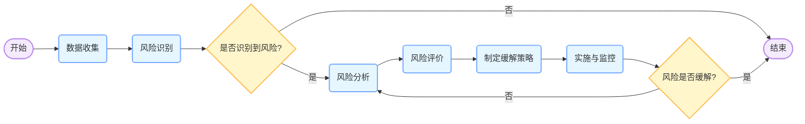

# AI辅助企业并购风险评估与缓解策略

> 关键词：AI、企业并购、风险评估、缓解策略、数据分析

> 摘要：本文深入探讨了如何利用人工智能技术辅助企业进行并购过程中的风险评估与制定相应的缓解策略。首先介绍了企业并购风险评估的背景，包括目的、预期读者等信息。接着阐述了相关核心概念及联系，详细讲解了用于风险评估的核心算法原理与具体操作步骤，通过数学模型和公式对评估过程进行了理论支持，并给出举例说明。通过项目实战展示了如何运用代码实现风险评估。分析了实际应用场景，推荐了学习、开发相关的工具和资源。最后总结了未来发展趋势与挑战，解答了常见问题并提供了扩展阅读与参考资料，旨在为企业利用AI进行并购风险评估提供全面且深入的指导。

## 1. 背景介绍 
### 1.1 目的和范围
企业并购作为企业快速扩张和战略转型的重要手段，一直以来都伴随着各种风险。这些风险可能来自财务、市场、文化等多个方面，如果不能有效评估和应对，可能导致并购失败，给企业带来巨大损失。本文的目的在于探讨如何利用人工智能（AI）技术辅助企业进行并购风险评估，并制定相应的缓解策略。范围涵盖了从风险评估的基本概念、算法原理、数学模型到实际项目应用，以及相关工具和资源的推荐等多个方面。

### 1.2 预期读者
本文预期读者包括企业高管、并购项目经理、投资银行家、风险管理专家以及对AI在企业并购领域应用感兴趣的研究人员和技术爱好者。这些读者希望通过了解AI在企业并购风险评估中的应用，提升自身在并购决策和风险管理方面的能力。

### 1.3 文档结构概述
本文将按照以下结构展开：首先介绍背景信息，包括目的、读者和文档结构；接着阐述核心概念与联系，构建风险评估的理论基础；然后详细讲解核心算法原理和具体操作步骤，并通过数学模型进行理论支持；通过项目实战展示代码实现和应用；分析实际应用场景；推荐相关的工具和资源；总结未来发展趋势与挑战；解答常见问题；最后提供扩展阅读和参考资料。

### 1.4 术语表
#### 1.4.1 核心术语定义
- **企业并购**：指企业之间的合并与收购行为，是企业通过产权交易获得其他企业的控制权，以实现自身战略目标的一种经济活动。
- **风险评估**：对企业并购过程中可能面临的各种风险进行识别、分析和评价，确定风险的可能性和影响程度。
- **人工智能（AI）**：研究、开发用于模拟、延伸和扩展人的智能的理论、方法、技术及应用系统的一门新的技术科学。在本文中主要指利用机器学习、深度学习等技术进行数据处理和分析。
- **缓解策略**：针对评估出的风险，制定相应的措施和方法，以降低风险发生的可能性或减轻风险带来的影响。

#### 1.4.2 相关概念解释
- **机器学习**：人工智能的一个分支，它使计算机能够通过数据学习模式和规律，而无需明确的编程指令。在企业并购风险评估中，机器学习算法可以用于分析大量的历史数据，预测未来风险。
- **深度学习**：一种基于人工神经网络的机器学习技术，它能够自动从数据中提取高层次的特征表示。深度学习在处理复杂数据和模式识别方面具有很强的能力，可用于更精准的风险评估。
- **数据挖掘**：从大量的数据中提取有用的信息和知识的过程。在企业并购风险评估中，数据挖掘技术可以帮助发现潜在的风险因素和模式。

#### 1.4.3 缩略词列表
- **AI**：Artificial Intelligence（人工智能）
- **ML**：Machine Learning（机器学习）
- **DL**：Deep Learning（深度学习）

## 2. 核心概念与联系 

### 核心概念原理
企业并购风险评估是一个复杂的过程，涉及多个方面的因素。核心概念包括风险识别、风险分析和风险评价。

- **风险识别**：通过对企业并购过程中的各种信息进行收集和整理，识别可能存在的风险因素。这些风险因素可以分为内部因素和外部因素，内部因素如企业的财务状况、管理水平等，外部因素如市场竞争、政策法规等。
- **风险分析**：对识别出的风险因素进行分析，确定其发生的可能性和影响程度。可以采用定性分析和定量分析相结合的方法，定性分析主要基于专家经验和判断，定量分析则通过数学模型和统计方法进行。
- **风险评价**：根据风险分析的结果，对风险进行综合评价，确定风险的等级和优先级。风险评价的结果可以为企业制定缓解策略提供依据。

### 架构的文本示意图
```plaintext
企业并购风险评估系统
|-- 数据收集模块
|   |-- 内部数据（财务报表、管理信息等）
|   |-- 外部数据（市场数据、政策法规等）
|-- 风险识别模块
|   |-- 特征提取
|   |-- 风险因素筛选
|-- 风险分析模块
|   |-- 定性分析（专家判断）
|   |-- 定量分析（机器学习、深度学习等）
|-- 风险评价模块
|   |-- 风险等级划分
|   |-- 优先级排序
|-- 缓解策略制定模块
|   |-- 针对不同风险的策略
|   |-- 策略实施与监控
```

### Mermaid 流程图


## 3. 核心算法原理 & 具体操作步骤 

### 核心算法原理
在企业并购风险评估中，常用的机器学习算法包括逻辑回归、决策树、随机森林和神经网络等。下面以逻辑回归算法为例进行详细讲解。

逻辑回归是一种广泛应用于分类问题的统计模型，它通过对输入特征进行线性组合，然后使用逻辑函数将线性组合的结果映射到概率值。逻辑函数的公式为：

$$\sigma(z)=\frac{1}{1 + e^{-z}}$$

其中，$z$ 是线性组合的结果，$\sigma(z)$ 是逻辑函数的输出，取值范围在 $(0, 1)$ 之间，表示样本属于正类的概率。

在企业并购风险评估中，我们可以将风险分为高风险和低风险两类，逻辑回归模型的目标是根据输入的特征预测样本属于高风险类别的概率。

### 具体操作步骤
#### 步骤 1：数据准备
首先需要收集与企业并购风险相关的数据，包括企业的财务指标、市场数据、行业信息等。然后对数据进行清洗和预处理，去除缺失值、异常值，并进行特征编码和标准化处理。

```python
import pandas as pd
from sklearn.preprocessing import StandardScaler
from sklearn.model_selection import train_test_split

# 读取数据
data = pd.read_csv('merger_risk_data.csv')

# 分离特征和标签
X = data.drop('risk_label', axis=1)
y = data['risk_label']

# 数据标准化
scaler = StandardScaler()
X_scaled = scaler.fit_transform(X)

# 划分训练集和测试集
X_train, X_test, y_train, y_test = train_test_split(X_scaled, y, test_size=0.2, random_state=42)
```

#### 步骤 2：模型训练
使用训练集数据对逻辑回归模型进行训练。

```python
from sklearn.linear_model import LogisticRegression

# 创建逻辑回归模型
model = LogisticRegression()

# 模型训练
model.fit(X_train, y_train)
```

#### 步骤 3：模型评估
使用测试集数据对训练好的模型进行评估，常用的评估指标包括准确率、精确率、召回率和F1值等。

```python
from sklearn.metrics import accuracy_score, precision_score, recall_score, f1_score

# 模型预测
y_pred = model.predict(X_test)

# 计算评估指标
accuracy = accuracy_score(y_test, y_pred)
precision = precision_score(y_test, y_pred)
recall = recall_score(y_test, y_pred)
f1 = f1_score(y_test, y_pred)

print(f'Accuracy: {accuracy}')
print(f'Precision: {precision}')
print(f'Recall: {recall}')
print(f'F1-score: {f1}')
```

#### 步骤 4：风险预测
使用训练好的模型对新的样本进行风险预测。

```python
# 假设有一个新的样本
new_sample = [[1.2, 3.4, 5.6, 7.8]]
new_sample_scaled = scaler.transform(new_sample)

# 预测风险概率
risk_prob = model.predict_proba(new_sample_scaled)[:, 1]
print(f'Risk probability: {risk_prob[0]}')
```

## 4. 数学模型和公式 & 详细讲解 & 举例说明 

### 逻辑回归的数学模型
逻辑回归的数学模型可以表示为：

$$P(Y = 1|X)=\frac{1}{1 + e^{-(w_0 + w_1x_1 + w_2x_2 + \cdots + w_nx_n)}}$$

其中，$P(Y = 1|X)$ 表示在给定特征 $X=(x_1, x_2, \cdots, x_n)$ 的情况下，样本属于正类（高风险）的概率；$w_0$ 是截距项，$w_1, w_2, \cdots, w_n$ 是特征的权重系数。

### 损失函数
逻辑回归使用对数损失函数（也称为交叉熵损失函数）来衡量模型预测值与真实值之间的差异。对数损失函数的公式为：

$$L(w)=-\frac{1}{m}\sum_{i = 1}^{m}[y^{(i)}\log(P(Y = 1|X^{(i)}))+(1 - y^{(i)})\log(1 - P(Y = 1|X^{(i)}))]$$

其中，$m$ 是样本数量，$y^{(i)}$ 是第 $i$ 个样本的真实标签（$0$ 或 $1$），$P(Y = 1|X^{(i)})$ 是模型对第 $i$ 个样本属于正类的预测概率。

### 优化算法
为了最小化损失函数 $L(w)$，可以使用梯度下降算法来更新权重系数 $w$。梯度下降算法的更新公式为：

$$w_j := w_j-\alpha\frac{\partial L(w)}{\partial w_j}$$

其中，$\alpha$ 是学习率，控制每次更新的步长；$\frac{\partial L(w)}{\partial w_j}$ 是损失函数 $L(w)$ 对权重系数 $w_j$ 的偏导数。

### 举例说明
假设我们有一个简单的企业并购风险评估数据集，包含两个特征 $x_1$（企业的资产负债率）和 $x_2$（市场份额增长率），以及一个标签 $y$（是否为高风险企业）。我们使用逻辑回归模型对这个数据集进行训练，得到的权重系数为 $w_0 = -1$，$w_1 = 0.5$，$w_2 = 0.3$。

现在有一个新的企业，其资产负债率 $x_1 = 0.6$，市场份额增长率 $x_2 = 0.1$，我们可以计算该企业属于高风险企业的概率：

$$z = w_0 + w_1x_1 + w_2x_2=-1 + 0.5\times0.6 + 0.3\times0.1=-1 + 0.3 + 0.03=-0.67$$

$$P(Y = 1|X)=\frac{1}{1 + e^{-z}}=\frac{1}{1 + e^{0.67}}\approx0.34$$

因此，该企业属于高风险企业的概率约为 $0.34$。

## 5. 项目实战：代码实际案例和详细解释说明 

### 5.1  开发环境搭建
#### 操作系统
建议使用 Linux 或 macOS 操作系统，因为它们对 Python 开发环境的支持更好。如果使用 Windows 操作系统，也可以通过安装 Anaconda 来搭建开发环境。

#### Python 版本
建议使用 Python 3.7 及以上版本。

#### 安装必要的库
使用 `pip` 命令安装以下必要的库：

```bash
pip install pandas numpy scikit-learn matplotlib
```

### 5.2  源代码详细实现和代码解读
```python
import pandas as pd
import numpy as np
from sklearn.preprocessing import StandardScaler
from sklearn.model_selection import train_test_split
from sklearn.linear_model import LogisticRegression
from sklearn.metrics import accuracy_score, precision_score, recall_score, f1_score
import matplotlib.pyplot as plt

# 读取数据
data = pd.read_csv('merger_risk_data.csv')

# 数据探索
print('数据基本信息：')
data.info()

# 查看数据集行数和列数
rows, columns = data.shape

if rows < 30:
    # 小样本数据（行数少于30）查看全量数据信息
    print('数据全部内容信息：')
    print(data.to_csv(sep='\t', na_rep='nan'))
else:
    # 大样本数据查看数据前几行信息
    print('数据前几行内容信息：')
    print(data.head().to_csv(sep='\t', na_rep='nan'))

# 分离特征和标签
X = data.drop('risk_label', axis=1)
y = data['risk_label']

# 数据标准化
scaler = StandardScaler()
X_scaled = scaler.fit_transform(X)

# 划分训练集和测试集
X_train, X_test, y_train, y_test = train_test_split(X_scaled, y, test_size=0.2, random_state=42)

# 创建逻辑回归模型
model = LogisticRegression()

# 模型训练
model.fit(X_train, y_train)

# 模型预测
y_pred = model.predict(X_test)

# 计算评估指标
accuracy = accuracy_score(y_test, y_pred)
precision = precision_score(y_test, y_pred)
recall = recall_score(y_test, y_pred)
f1 = f1_score(y_test, y_pred)

print(f'Accuracy: {accuracy}')
print(f'Precision: {precision}')
print(f'Recall: {recall}')
print(f'F1-score: {f1}')

# 绘制混淆矩阵
from sklearn.metrics import confusion_matrix
import seaborn as sns

cm = confusion_matrix(y_test, y_pred)
sns.heatmap(cm, annot=True, fmt='d', cmap='Blues')
plt.xlabel('Predicted')
plt.ylabel('True')
plt.title('Confusion Matrix')
plt.show()
```

### 代码解读与分析
1. **数据读取**：使用 `pandas` 库的 `read_csv` 函数读取存储在 `merger_risk_data.csv` 文件中的企业并购风险评估数据。
2. **数据探索**：通过 `data.info()` 查看数据的基本信息，包括数据类型、缺失值等情况。根据数据集的行数，选择输出全量数据信息或前几行数据信息，方便了解数据的内容。
3. **特征和标签分离**：使用 `drop` 方法将标签列 `risk_label` 从数据集中分离出来，得到特征矩阵 `X` 和标签向量 `y`。
4. **数据标准化**：使用 `StandardScaler` 对特征矩阵 `X` 进行标准化处理，使特征具有相同的尺度，有助于提高模型的训练效果。
5. **数据集划分**：使用 `train_test_split` 函数将标准化后的特征矩阵和标签向量划分为训练集和测试集，测试集占总数据的 20%。
6. **模型创建与训练**：创建 `LogisticRegression` 逻辑回归模型，并使用训练集数据对模型进行训练。
7. **模型预测与评估**：使用训练好的模型对测试集数据进行预测，得到预测结果 `y_pred`。计算准确率、精确率、召回率和 F1 值等评估指标，评估模型的性能。
8. **混淆矩阵绘制**：使用 `confusion_matrix` 函数计算混淆矩阵，并使用 `seaborn` 库的 `heatmap` 函数绘制混淆矩阵热力图，直观展示模型的预测结果。

## 6. 实际应用场景 
### 金融机构
金融机构在为企业并购提供融资支持时，需要对并购项目的风险进行评估。通过使用AI技术，可以更全面、准确地分析企业的财务状况、市场前景等因素，评估并购项目的风险等级。根据风险评估结果，金融机构可以决定是否提供融资以及融资的额度和利率，降低自身的信贷风险。

### 投资银行
投资银行在企业并购交易中扮演着重要的角色，需要为客户提供专业的并购建议和方案。AI技术可以帮助投资银行快速筛选潜在的并购目标，评估目标企业的价值和风险。同时，通过对市场数据和行业动态的实时监测，投资银行可以及时调整并购策略，提高交易的成功率。

### 企业自身
企业在进行并购决策时，需要对目标企业进行深入的尽职调查和风险评估。AI技术可以帮助企业整合内部和外部数据，分析目标企业的财务、市场、技术等方面的情况，识别潜在的风险因素。企业可以根据风险评估结果制定相应的缓解策略，如调整并购价格、优化并购方案等，降低并购风险。

### 监管机构
监管机构需要对企业并购活动进行监管，确保并购交易符合法律法规和市场规则。AI技术可以帮助监管机构实时监测并购市场的动态，分析并购交易的风险特征和趋势。监管机构可以根据监测结果及时采取措施，防范系统性风险，维护市场的稳定和健康发展。

## 7. 工具和资源推荐
### 7.1 学习资源推荐
#### 7.1.1 书籍推荐
- 《Python机器学习》：这本书详细介绍了Python在机器学习领域的应用，包括各种机器学习算法的原理和实现，适合初学者入门。
- 《深度学习》：由深度学习领域的三位先驱Ian Goodfellow、Yoshua Bengio和Aaron Courville撰写，是深度学习领域的经典教材，对深度学习的理论和实践进行了全面的阐述。
- 《数据挖掘：概念与技术》：这本书系统地介绍了数据挖掘的基本概念、算法和应用，对于理解企业并购风险评估中的数据挖掘技术有很大帮助。

#### 7.1.2 在线课程
- Coursera上的“机器学习”课程：由斯坦福大学教授Andrew Ng主讲，是机器学习领域最受欢迎的在线课程之一，课程内容涵盖了机器学习的基本概念、算法和应用。
- edX上的“深度学习微硕士项目”：提供了深度学习的系统学习路径，包括深度学习基础、卷积神经网络、循环神经网络等课程，适合有一定编程基础的学习者深入学习。
- 阿里云天池的“AI训练营”：提供了丰富的AI实践项目和课程，包括企业并购风险评估等应用场景的案例分析和实践操作，有助于学习者将理论知识应用到实际项目中。

#### 7.1.3 技术博客和网站
- Medium：一个技术博客平台，上面有很多关于AI、机器学习和数据分析的优质文章，作者来自世界各地的技术专家和爱好者。
- Towards Data Science：专注于数据科学和机器学习领域的博客网站，提供了大量的技术文章、教程和案例分析。
- Kaggle：一个数据科学竞赛平台，上面有很多企业并购风险评估相关的数据集和竞赛项目，学习者可以通过参与竞赛来提升自己的实践能力。

### 7.2 开发工具框架推荐
#### 7.2.1 IDE和编辑器
- PyCharm：一款专业的Python集成开发环境，提供了丰富的代码编辑、调试和项目管理功能，适合开发大型的Python项目。
- Jupyter Notebook：一个交互式的开发环境，支持Python、R等多种编程语言，适合进行数据探索、模型实验和结果展示。
- Visual Studio Code：一款轻量级的代码编辑器，支持多种编程语言和插件扩展，具有良好的跨平台性能，适合快速开发和调试代码。

#### 7.2.2 调试和性能分析工具
- PDB：Python自带的调试工具，可以帮助开发者在代码中设置断点、单步执行代码，方便排查代码中的错误。
- TensorBoard：TensorFlow提供的可视化工具，可以用于可视化模型的训练过程、损失函数的变化、模型的结构等信息，帮助开发者分析模型的性能。
- Scikit-learn的 `cross_val_score` 函数：可以用于对模型进行交叉验证，评估模型的泛化能力和稳定性。

#### 7.2.3 相关框架和库
- Scikit-learn：一个简单易用的机器学习库，提供了各种机器学习算法的实现，包括分类、回归、聚类等算法，适合初学者快速上手。
- TensorFlow：一个开源的深度学习框架，由Google开发，提供了丰富的深度学习模型和工具，支持分布式训练和部署。
- PyTorch：另一个流行的深度学习框架，具有动态图机制，易于使用和调试，在学术界和工业界都有广泛的应用。

### 7.3 相关论文著作推荐
#### 7.3.1 经典论文
- 《A Logical Calculus of the Ideas Immanent in Nervous Activity》：由Warren McCulloch和Walter Pitts在1943年发表，提出了人工神经元的数学模型，为神经网络的发展奠定了基础。
- 《Learning Representations by Back-propagating Errors》：由David Rumelhart、Geoffrey Hinton和Ronald Williams在1986年发表，介绍了反向传播算法，使得神经网络的训练变得更加高效。
- 《ImageNet Classification with Deep Convolutional Neural Networks》：由Alex Krizhevsky、Ilya Sutskever和Geoffrey Hinton在2012年发表，提出了AlexNet卷积神经网络，在ImageNet图像分类竞赛中取得了优异的成绩，开启了深度学习在计算机视觉领域的应用热潮。

#### 7.3.2 最新研究成果
- 《Attention Is All You Need》：提出了Transformer模型，引入了注意力机制，在自然语言处理领域取得了巨大的成功，为后续的研究和应用奠定了基础。
- 《Masked Autoencoders Are Scalable Vision Learners》：提出了基于掩码自编码器的视觉预训练方法，在计算机视觉领域取得了很好的效果，为图像理解和生成任务提供了新的思路。
- 《GPT-4 Technical Report》：介绍了OpenAI开发的GPT-4大型语言模型，展示了其在自然语言处理任务中的强大能力和广泛应用前景。

#### 7.3.3 应用案例分析
- 《Using Machine Learning to Predict Merger and Acquisition Outcomes》：研究了如何使用机器学习算法预测企业并购的结果，通过对大量的并购案例进行分析，建立了预测模型，并评估了模型的性能。
- 《AI-driven Risk Assessment in Corporate Mergers and Acquisitions》：探讨了如何利用人工智能技术进行企业并购风险评估，分析了不同类型的风险因素，并提出了相应的评估方法和模型。
- 《Case Studies in Successful M&A Risk Mitigation with AI》：通过实际案例分析，展示了如何使用AI技术制定企业并购风险缓解策略，以及这些策略在实际应用中的效果。

## 8. 总结：未来发展趋势与挑战
### 未来发展趋势
#### 多模态数据融合
未来，企业并购风险评估将不仅仅依赖于结构化的财务数据和市场数据，还将融合非结构化的数据，如文本、图像、视频等。通过多模态数据融合，可以更全面、准确地评估企业的风险状况。

#### 强化学习的应用
强化学习可以在动态的环境中进行决策优化，未来有望在企业并购风险评估和缓解策略制定中得到应用。通过强化学习算法，可以根据实时的市场变化和风险情况，动态调整并购策略和缓解措施。

#### 人工智能与区块链技术的结合
区块链技术具有去中心化、不可篡改、可追溯等特点，可以为企业并购风险评估提供更可靠的数据来源和信任机制。人工智能与区块链技术的结合，将有助于提高风险评估的准确性和可信度。

### 挑战
#### 数据质量和隐私问题
企业并购风险评估需要大量的高质量数据，但实际中数据可能存在缺失、错误、不一致等问题，影响评估结果的准确性。同时，数据隐私问题也是一个重要的挑战，如何在保护数据隐私的前提下进行有效的风险评估是需要解决的问题。

#### 模型解释性和可解释性
深度学习等复杂的人工智能模型在企业并购风险评估中取得了很好的效果，但这些模型往往是黑盒模型，缺乏解释性和可解释性。在实际应用中，决策者需要了解模型的决策依据和风险评估的结果，因此提高模型的解释性和可解释性是一个重要的挑战。

#### 技术人才短缺
人工智能技术在企业并购风险评估中的应用需要具备跨领域知识和技能的技术人才，包括机器学习、数据分析、企业管理等方面的知识。目前，这类技术人才相对短缺，制约了人工智能技术在企业并购领域的推广和应用。

## 9. 附录：常见问题与解答
### 问题 1：AI在企业并购风险评估中的准确性如何保证？
答：为了保证AI在企业并购风险评估中的准确性，需要从以下几个方面入手：
- **数据质量**：确保收集到的数据准确、完整、一致，对数据进行清洗和预处理，去除噪声和异常值。
- **特征工程**：选择合适的特征，对特征进行编码和标准化处理，提高特征的表达能力。
- **模型选择和调优**：根据数据特点和问题需求选择合适的模型，并对模型进行调优，如调整超参数、进行模型融合等。
- **模型评估和验证**：使用多种评估指标对模型进行评估，采用交叉验证等方法验证模型的泛化能力。

### 问题 2：AI技术在企业并购风险评估中的应用成本高吗？
答：AI技术在企业并购风险评估中的应用成本取决于多个因素，如数据收集和处理成本、模型开发和训练成本、计算资源成本等。对于一些大型企业和金融机构来说，由于有足够的资源和数据支持，应用成本相对较低。而对于一些中小企业来说，可能需要考虑成本效益问题。可以通过选择开源的工具和框架、使用云计算等方式降低应用成本。

### 问题 3：如何选择适合企业并购风险评估的AI算法？
答：选择适合企业并购风险评估的AI算法需要考虑以下几个因素：
- **数据类型和规模**：如果数据是结构化的且规模较小，可以选择简单的机器学习算法，如逻辑回归、决策树等；如果数据是非结构化的且规模较大，可以选择深度学习算法，如卷积神经网络、循环神经网络等。
- **问题复杂度**：如果问题比较简单，如二分类问题，可以选择简单的分类算法；如果问题比较复杂，如多分类问题或回归问题，可以选择更复杂的算法。
- **模型可解释性**：如果决策者需要了解模型的决策依据，应选择具有较好解释性的算法，如决策树、线性回归等。

### 问题 4：AI技术在企业并购风险评估中能否替代人工判断？
答：AI技术在企业并购风险评估中可以提供更全面、准确的数据分析和预测，但不能完全替代人工判断。AI模型是基于历史数据和预设的算法进行训练和预测的，对于一些复杂的、不确定的情况，如市场突发变化、政策调整等，AI模型可能无法准确预测。而人工判断可以结合专家经验、行业洞察和实时信息，对风险进行综合评估和决策。因此，在企业并购风险评估中，应将AI技术与人工判断相结合，发挥各自的优势。

## 10. 扩展阅读 & 参考资料
### 扩展阅读
- 《人工智能时代的企业风险管理》：探讨了人工智能技术在企业风险管理领域的应用和挑战，为企业如何利用AI技术提升风险管理能力提供了思路和方法。
- 《并购估值》：详细介绍了企业并购估值的方法和技巧，对于理解企业并购风险评估中的价值评估环节有很大帮助。
- 《数据驱动的决策：如何用数据改变企业未来》：强调了数据在企业决策中的重要性，介绍了如何通过数据分析和挖掘来支持企业的战略决策，包括企业并购决策。

### 参考资料
- 《企业并购风险管理》：对企业并购过程中的各种风险进行了系统的分析和研究，提出了相应的风险管理策略和方法。
- 《机器学习实战》：通过实际案例介绍了机器学习算法的实现和应用，帮助读者快速掌握机器学习的基本原理和实践技巧。
- 《深度学习实战》：结合具体的项目实践，详细介绍了深度学习的开发流程和应用场景，对于深入理解深度学习在企业并购风险评估中的应用有很大帮助。

作者：AI天才研究院/AI Genius Institute & 禅与计算机程序设计艺术 /Zen And The Art of Computer Programming