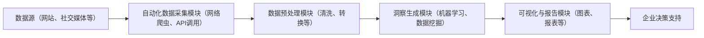

# AI辅助企业竞争情报分析：自动化数据采集与洞察生成

> 关键词：AI、企业竞争情报分析、自动化数据采集、洞察生成、数据处理

> 摘要：本文聚焦于AI在企业竞争情报分析中的应用，重点探讨自动化数据采集与洞察生成的相关技术和方法。首先介绍了背景信息，包括目的范围、预期读者等内容；接着阐述核心概念与联系，通过文本示意图和Mermaid流程图展示其架构；详细讲解核心算法原理和具体操作步骤，结合Python代码进行说明；给出数学模型和公式并举例；通过项目实战展示代码实现和解读；分析实际应用场景；推荐相关工具和资源；最后总结未来发展趋势与挑战，还包含常见问题解答和扩展阅读参考资料，旨在为企业利用AI提升竞争情报分析能力提供全面的指导。

## 1. 背景介绍 
### 1.1 目的和范围
在当今竞争激烈的商业环境中，企业需要及时、准确地了解竞争对手的动态和市场趋势，以制定有效的战略决策。传统的竞争情报分析方法往往依赖于人工收集和分析数据，效率低下且容易出现遗漏。AI辅助企业竞争情报分析的出现，为解决这些问题提供了新的途径。本文的目的是深入探讨如何利用AI技术实现自动化数据采集与洞察生成，提高企业竞争情报分析的效率和准确性。

本文的范围涵盖了从数据采集到洞察生成的整个过程，包括核心概念、算法原理、数学模型、项目实战、应用场景、工具资源等方面。旨在为企业和相关从业人员提供全面的技术指导和实践参考。

### 1.2 预期读者
本文的预期读者包括企业管理人员、市场分析师、竞争情报专家、数据科学家、AI工程师等。对于希望了解如何利用AI技术提升企业竞争情报分析能力的人员，以及对自动化数据采集和洞察生成技术感兴趣的专业人士，本文将提供有价值的信息和指导。

### 1.3 文档结构概述
本文将按照以下结构进行组织：
1. 背景介绍：介绍文章的目的、范围、预期读者和文档结构概述。
2. 核心概念与联系：阐述AI辅助企业竞争情报分析中涉及的核心概念和它们之间的联系，通过文本示意图和Mermaid流程图进行展示。
3. 核心算法原理 & 具体操作步骤：详细讲解实现自动化数据采集和洞察生成的核心算法原理，并给出具体的操作步骤，结合Python代码进行说明。
4. 数学模型和公式 & 详细讲解 & 举例说明：介绍相关的数学模型和公式，并通过具体的例子进行详细讲解。
5. 项目实战：代码实际案例和详细解释说明：通过一个实际的项目案例，展示如何使用AI技术实现自动化数据采集和洞察生成，包括开发环境搭建、源代码详细实现和代码解读。
6. 实际应用场景：分析AI辅助企业竞争情报分析在不同行业和场景中的实际应用。
7. 工具和资源推荐：推荐相关的学习资源、开发工具框架和论文著作。
8. 总结：未来发展趋势与挑战：总结AI辅助企业竞争情报分析的发展趋势，并分析面临的挑战。
9. 附录：常见问题与解答：解答读者在阅读过程中可能遇到的常见问题。
10. 扩展阅读 & 参考资料：提供相关的扩展阅读材料和参考资料。

### 1.4 术语表
#### 1.4.1 核心术语定义
- **企业竞争情报分析**：指企业为了获取竞争优势，对竞争对手、市场环境等相关信息进行收集、分析和利用的过程。
- **自动化数据采集**：利用计算机技术和软件工具，自动从各种数据源中收集所需数据的过程。
- **洞察生成**：通过对采集到的数据进行分析和挖掘，发现有价值的信息和规律，为企业决策提供支持的过程。
- **AI（人工智能）**：指计算机系统能够执行通常需要人类智能才能完成的任务，如学习、推理、解决问题等。

#### 1.4.2 相关概念解释
- **数据挖掘**：从大量数据中发现有价值的信息和知识的过程，是洞察生成的重要手段之一。
- **机器学习**：AI的一个重要分支，通过让计算机从数据中学习模式和规律，从而实现预测和决策的能力。
- **自然语言处理（NLP）**：研究如何让计算机理解和处理人类语言的技术，在数据采集和洞察生成中有着广泛的应用。

#### 1.4.3 缩略词列表
- **AI**：Artificial Intelligence（人工智能）
- **NLP**：Natural Language Processing（自然语言处理）
- **API**：Application Programming Interface（应用程序编程接口）

## 2. 核心概念与联系 

### 核心概念原理
AI辅助企业竞争情报分析的核心原理是利用AI技术实现自动化数据采集和洞察生成。具体来说，自动化数据采集是通过编写程序，利用网络爬虫、API调用等技术，从各种数据源（如网站、社交媒体、新闻媒体等）中自动收集与企业竞争情报相关的数据。洞察生成则是利用机器学习、数据挖掘、自然语言处理等技术，对采集到的数据进行清洗、预处理、分析和挖掘，提取有价值的信息和规律，为企业决策提供支持。

### 架构的文本示意图
```plaintext
+---------------------+
|    数据源            |
| （网站、社交媒体等） |
+---------------------+
           |
           v
+---------------------+
| 自动化数据采集模块   |
| （网络爬虫、API调用） |
+---------------------+
           |
           v
+---------------------+
| 数据预处理模块       |
| （清洗、转换等）     |
+---------------------+
           |
           v
+---------------------+
| 洞察生成模块         |
| （机器学习、数据挖掘）|
+---------------------+
           |
           v
+---------------------+
| 可视化与报告模块     |
| （图表、报表等）     |
+---------------------+
           |
           v
+---------------------+
| 企业决策支持         |
+---------------------+
```

### Mermaid流程图


## 3. 核心算法原理 & 具体操作步骤 

### 自动化数据采集算法原理及Python代码实现
自动化数据采集常用的技术有网络爬虫和API调用。下面分别介绍这两种技术的原理和Python代码实现。

#### 网络爬虫原理
网络爬虫是一种自动抓取网页内容的程序。其基本原理是通过发送HTTP请求获取网页的HTML代码，然后使用解析库（如BeautifulSoup）解析HTML代码，提取所需的数据。

#### Python代码实现
```python
import requests
from bs4 import BeautifulSoup

# 定义要爬取的网页URL
url = 'https://example.com'

# 发送HTTP请求
response = requests.get(url)

# 检查请求是否成功
if response.status_code == 200:
    # 使用BeautifulSoup解析HTML代码
    soup = BeautifulSoup(response.text, 'html.parser')
    
    # 提取所需的数据，例如所有的标题标签
    titles = soup.find_all('h1')
    
    # 打印提取的数据
    for title in titles:
        print(title.text)
else:
    print('请求失败，状态码：', response.status_code)
```

#### API调用原理
API（应用程序编程接口）是一种允许不同软件系统之间进行交互的接口。通过调用API，可以方便地从第三方数据源获取所需的数据。

#### Python代码实现
```python
import requests

# 定义API的URL
api_url = 'https://api.example.com/data'

# 定义请求参数
params = {
    'key': 'your_api_key',
    'param1': 'value1',
    'param2': 'value2'
}

# 发送HTTP请求
response = requests.get(api_url, params=params)

# 检查请求是否成功
if response.status_code == 200:
    # 获取JSON格式的数据
    data = response.json()
    
    # 打印数据
    print(data)
else:
    print('请求失败，状态码：', response.status_code)
```

### 洞察生成算法原理及Python代码实现
洞察生成常用的技术有机器学习和数据挖掘。下面以文本分类为例，介绍机器学习算法的原理和Python代码实现。

#### 文本分类原理
文本分类是指将文本数据分类到不同的类别中。常用的文本分类算法有朴素贝叶斯、支持向量机等。其基本原理是通过训练一个分类模型，让模型学习文本数据和类别之间的映射关系，然后使用训练好的模型对新的文本数据进行分类。

#### Python代码实现
```python
from sklearn.feature_extraction.text import TfidfVectorizer
from sklearn.naive_bayes import MultinomialNB
from sklearn.model_selection import train_test_split
from sklearn.metrics import accuracy_score

# 定义样本数据
corpus = [
    'This is a positive sentence.',
    'This is a negative sentence.',
    'Another positive example.',
    'Another negative example.'
]

# 定义样本标签
labels = [1, 0, 1, 0]

# 将文本数据转换为向量表示
vectorizer = TfidfVectorizer()
X = vectorizer.fit_transform(corpus)

# 划分训练集和测试集
X_train, X_test, y_train, y_test = train_test_split(X, labels, test_size=0.2, random_state=42)

# 创建分类模型
model = MultinomialNB()

# 训练模型
model.fit(X_train, y_train)

# 预测测试集
y_pred = model.predict(X_test)

# 计算准确率
accuracy = accuracy_score(y_test, y_pred)
print('准确率：', accuracy)
```

## 4. 数学模型和公式 & 详细讲解 & 举例说明 

### 自动化数据采集相关数学模型和公式
在自动化数据采集过程中，涉及到一些与网络请求和数据处理相关的数学模型和公式。例如，HTTP请求的响应时间可以用以下公式表示：

$$T_{response} = T_{dns} + T_{tcp} + T_{http} + T_{server} + T_{data}$$

其中，$T_{response}$ 表示HTTP请求的总响应时间，$T_{dns}$ 表示DNS解析时间，$T_{tcp}$ 表示TCP连接建立时间，$T_{http}$ 表示HTTP请求发送和接收时间，$T_{server}$ 表示服务器处理请求的时间，$T_{data}$ 表示数据传输时间。

### 洞察生成相关数学模型和公式
#### 朴素贝叶斯分类器
朴素贝叶斯分类器是一种基于贝叶斯定理的分类算法。其基本思想是通过计算每个类别在给定特征下的后验概率，选择后验概率最大的类别作为预测结果。

贝叶斯定理的公式如下：

$$P(C|X) = \frac{P(X|C)P(C)}{P(X)}$$

其中，$P(C|X)$ 表示在特征 $X$ 给定的情况下，类别 $C$ 的后验概率；$P(X|C)$ 表示在类别 $C$ 给定的情况下，特征 $X$ 的条件概率；$P(C)$ 表示类别 $C$ 的先验概率；$P(X)$ 表示特征 $X$ 的概率。

在朴素贝叶斯分类器中，假设特征之间相互独立，即：

$$P(X|C) = \prod_{i=1}^{n}P(x_i|C)$$

其中，$x_i$ 表示特征 $X$ 的第 $i$ 个分量，$n$ 表示特征的维度。

#### 举例说明
假设有一个文本分类问题，要将文本分为“体育”和“科技”两类。已知以下信息：
- 先验概率：$P(体育) = 0.6$，$P(科技) = 0.4$
- 条件概率：$P(篮球|体育) = 0.8$，$P(芯片|科技) = 0.7$

现在有一个新的文本，包含“篮球”和“芯片”两个关键词。我们可以使用朴素贝叶斯分类器来预测这个文本属于哪个类别。

计算后验概率：
- $P(体育|篮球,芯片) = \frac{P(篮球|体育)P(芯片|体育)P(体育)}{P(篮球,芯片)}$
- $P(科技|篮球,芯片) = \frac{P(篮球|科技)P(芯片|科技)P(科技)}{P(篮球,芯片)}$

由于 $P(篮球,芯片)$ 对于两个类别是相同的，我们只需要比较分子的大小即可。

假设 $P(篮球|科技) = 0.2$，$P(芯片|体育) = 0.1$，则：
- $P(体育|篮球,芯片) = 0.8 \times 0.1 \times 0.6 = 0.048$
- $P(科技|篮球,芯片) = 0.2 \times 0.7 \times 0.4 = 0.056$

因为 $P(科技|篮球,芯片) > P(体育|篮球,芯片)$，所以预测这个文本属于“科技”类别。

## 5. 项目实战：代码实际案例和详细解释说明 

### 5.1  开发环境搭建
#### 操作系统
建议使用Linux或macOS系统，因为它们对Python开发的支持更好。如果使用Windows系统，需要安装一些额外的工具，如Git和Anaconda。

#### Python环境
安装Python 3.7及以上版本。可以使用Anaconda来管理Python环境，它提供了一个方便的包管理工具和虚拟环境管理工具。

#### 安装必要的库
使用以下命令安装必要的Python库：
```bash
pip install requests beautifulsoup4 scikit-learn pandas numpy matplotlib
```

### 5.2  源代码详细实现和代码解读
#### 项目需求
我们要实现一个简单的企业竞争情报分析系统，包括自动化数据采集和洞察生成两个部分。具体来说，我们要从新闻网站上采集与竞争对手相关的新闻文章，然后对这些文章进行情感分析，判断文章的情感倾向（积极、消极或中性）。

#### 代码实现
```python
import requests
from bs4 import BeautifulSoup
from sklearn.feature_extraction.text import TfidfVectorizer
from sklearn.naive_bayes import MultinomialNB
import pandas as pd

# 自动化数据采集
def collect_news(url):
    response = requests.get(url)
    if response.status_code == 200:
        soup = BeautifulSoup(response.text, 'html.parser')
        articles = []
        # 假设新闻文章的标题标签为h2
        titles = soup.find_all('h2')
        for title in titles:
            articles.append(title.text)
        return articles
    else:
        print('请求失败，状态码：', response.status_code)
        return []

# 数据预处理
def preprocess_data(articles):
    vectorizer = TfidfVectorizer()
    X = vectorizer.fit_transform(articles)
    return X, vectorizer

# 训练情感分析模型
def train_model(X, y):
    model = MultinomialNB()
    model.fit(X, y)
    return model

# 预测情感倾向
def predict_sentiment(model, vectorizer, articles):
    X = vectorizer.transform(articles)
    y_pred = model.predict(X)
    return y_pred

# 主函数
def main():
    # 定义新闻网站的URL
    news_url = 'https://example.com/news'
    
    # 采集新闻文章
    articles = collect_news(news_url)
    
    # 假设我们有一个训练数据集，包含文章和对应的情感标签
    train_data = pd.read_csv('train_data.csv')
    X_train = train_data['article']
    y_train = train_data['sentiment']
    
    # 数据预处理
    X_train_processed, vectorizer = preprocess_data(X_train)
    
    # 训练模型
    model = train_model(X_train_processed, y_train)
    
    # 预测采集到的新闻文章的情感倾向
    y_pred = predict_sentiment(model, vectorizer, articles)
    
    # 打印预测结果
    for i in range(len(articles)):
        print('文章：', articles[i])
        print('情感倾向：', y_pred[i])

if __name__ == '__main__':
    main()
```

#### 代码解读
1. **自动化数据采集**：`collect_news` 函数通过发送HTTP请求获取新闻网站的HTML代码，然后使用BeautifulSoup解析HTML代码，提取新闻文章的标题。
2. **数据预处理**：`preprocess_data` 函数使用TfidfVectorizer将文本数据转换为向量表示。
3. **训练情感分析模型**：`train_model` 函数使用朴素贝叶斯分类器训练一个情感分析模型。
4. **预测情感倾向**：`predict_sentiment` 函数使用训练好的模型对采集到的新闻文章进行情感分析，预测文章的情感倾向。
5. **主函数**：`main` 函数调用上述函数，完成数据采集、模型训练和预测的整个流程。

### 5.3  代码解读与分析
#### 优点
- 代码结构清晰，模块化设计，易于维护和扩展。
- 使用了常见的机器学习算法和工具，如朴素贝叶斯分类器和TfidfVectorizer，具有较高的准确性和效率。
- 数据采集和模型训练的过程分离，方便后续的数据更新和模型优化。

#### 缺点
- 数据采集部分只提取了新闻文章的标题，可能无法获取足够的信息进行准确的情感分析。
- 模型训练使用的是简单的朴素贝叶斯分类器，对于复杂的文本分类问题可能效果不佳。
- 没有考虑数据的实时性和动态更新，可能导致分析结果不准确。

## 6. 实际应用场景 
### 市场竞争分析
企业可以利用AI辅助竞争情报分析系统，实时监测竞争对手的产品发布、市场策略、价格调整等信息，及时调整自己的市场策略，提高市场竞争力。例如，通过分析竞争对手的新闻报道和社交媒体动态，了解其新产品的特点和优势，为自己的产品研发和市场推广提供参考。

### 行业趋势预测
通过对行业内的大量数据进行采集和分析，企业可以发现行业的发展趋势和潜在机会。例如，分析行业报告、专家观点、市场调研数据等，预测行业的未来发展方向，提前布局，抢占市场先机。

### 风险预警
企业可以利用AI技术对市场风险、政策风险、竞争对手风险等进行实时监测和预警。例如，通过分析新闻报道、政策文件、社交媒体舆情等，及时发现潜在的风险因素，采取相应的措施进行防范和应对。

### 客户需求分析
通过对客户的反馈、评价、购买行为等数据进行采集和分析，企业可以深入了解客户的需求和偏好，为产品研发、市场营销和客户服务提供依据。例如，分析客户在社交媒体上的评论和反馈，了解客户对产品的满意度和改进建议，优化产品和服务。

## 7. 工具和资源推荐
### 7.1 学习资源推荐
#### 7.1.1 书籍推荐
- 《Python数据分析实战》：介绍了Python在数据分析领域的应用，包括数据采集、清洗、分析和可视化等方面的内容。
- 《机器学习实战》：通过实际案例介绍了机器学习的基本算法和应用，适合初学者入门。
- 《自然语言处理入门》：详细介绍了自然语言处理的基本概念、算法和应用，对于理解和应用NLP技术有很大帮助。

#### 7.1.2 在线课程
- Coursera上的“机器学习”课程：由斯坦福大学教授Andrew Ng主讲，是机器学习领域的经典课程。
- edX上的“Python for Data Science”课程：介绍了Python在数据科学领域的应用，包括数据处理、分析和可视化等方面的内容。
- 网易云课堂上的“自然语言处理实战”课程：通过实际案例介绍了自然语言处理的基本算法和应用，适合有一定编程基础的学习者。

#### 7.1.3 技术博客和网站
- Medium：一个技术博客平台，上面有很多关于AI、数据分析、机器学习等领域的优秀文章。
- Towards Data Science：专注于数据科学和机器学习领域的技术博客，提供了很多实用的教程和案例。
- Kaggle：一个数据科学竞赛平台，上面有很多公开的数据集和优秀的解决方案，可以学习到很多实际应用中的技巧和方法。

### 7.2 开发工具框架推荐
#### 7.2.1 IDE和编辑器
- PyCharm：一款专业的Python集成开发环境，提供了丰富的功能和插件，适合开发大型Python项目。
- Jupyter Notebook：一个交互式的编程环境，适合进行数据探索和分析，支持多种编程语言。
- Visual Studio Code：一款轻量级的代码编辑器，支持多种编程语言和插件，适合快速开发和调试代码。

#### 7.2.2 调试和性能分析工具
- pdb：Python自带的调试工具，可以帮助开发者定位和解决代码中的问题。
- cProfile：Python自带的性能分析工具，可以分析代码的执行时间和内存使用情况，帮助开发者优化代码性能。
- TensorBoard：一个可视化工具，用于可视化深度学习模型的训练过程和结果，方便开发者进行模型调优。

#### 7.2.3 相关框架和库
- Scikit-learn：一个简单易用的机器学习库，提供了各种机器学习算法和工具，适合初学者和快速开发。
- TensorFlow：一个开源的深度学习框架，由Google开发，广泛应用于图像识别、自然语言处理等领域。
- PyTorch：一个开源的深度学习框架，由Facebook开发，具有动态图的特点，适合研究和开发。

### 7.3 相关论文著作推荐
#### 7.3.1 经典论文
- “A Logical Calculus of the Ideas Immanent in Nervous Activity”：由Warren McCulloch和Walter Pitts于1943年发表，提出了人工神经网络的基本模型，是神经网络领域的经典论文。
- “Learning Representations by Back-propagating Errors”：由David Rumelhart、Geoffrey Hinton和Ronald Williams于1986年发表，提出了反向传播算法，是深度学习领域的重要突破。
- “ImageNet Classification with Deep Convolutional Neural Networks”：由Alex Krizhevsky、Ilya Sutskever和Geoffrey Hinton于2012年发表，提出了AlexNet模型，在ImageNet图像分类竞赛中取得了巨大成功，标志着深度学习时代的到来。

#### 7.3.2 最新研究成果
- “Attention Is All You Need”：由Vaswani等人于2017年发表，提出了Transformer模型，在自然语言处理领域取得了巨大成功，成为了当前NLP领域的主流模型。
- “BERT: Pre-training of Deep Bidirectional Transformers for Language Understanding”：由Jacob Devlin等人于2018年发表，提出了BERT模型，在多个自然语言处理任务中取得了最先进的结果，推动了NLP技术的发展。
- “Generative Adversarial Networks”：由Ian Goodfellow等人于2014年发表，提出了生成对抗网络（GAN），在图像生成、数据增强等领域取得了广泛应用。

#### 7.3.3 应用案例分析
- 《AI超级大国：中国、硅谷和新世界秩序》：作者李开复通过丰富的案例和深入的分析，探讨了AI在不同行业的应用和影响，以及中美两国在AI领域的竞争和合作。
- 《数据驱动的企业竞争情报分析》：介绍了如何利用数据驱动的方法进行企业竞争情报分析，通过实际案例展示了数据分析在竞争情报分析中的应用和价值。
- 《人工智能时代的企业战略》：探讨了AI对企业战略的影响和挑战，通过案例分析介绍了企业如何制定和实施AI战略，提升企业的竞争力。

## 8. 总结：未来发展趋势与挑战
### 未来发展趋势
- **智能化程度不断提高**：随着AI技术的不断发展，企业竞争情报分析系统将变得更加智能化。例如，能够自动识别和提取有价值的信息，自动生成洞察报告，自动进行决策推荐等。
- **多源数据融合**：未来的竞争情报分析将不再局限于单一的数据源，而是会融合多种数据源，如社交媒体、新闻媒体、行业报告、传感器数据等，以获取更全面、准确的信息。
- **与业务流程深度融合**：竞争情报分析将不再是一个独立的环节，而是会与企业的业务流程深度融合。例如，将竞争情报分析结果直接应用于产品研发、市场营销、供应链管理等业务环节，提高企业的运营效率和决策质量。
- **可视化和交互性增强**：为了更好地展示竞争情报分析结果，未来的系统将更加注重可视化和交互性。例如，使用图表、地图、仪表盘等可视化工具，让用户能够直观地了解数据和分析结果；支持用户进行交互式查询和分析，提高用户的参与度和体验感。

### 挑战
- **数据质量和安全问题**：竞争情报分析依赖于大量的数据，数据的质量和安全直接影响分析结果的准确性和可靠性。因此，如何保证数据的质量和安全是一个重要的挑战。
- **技术复杂性**：AI技术的发展日新月异，企业需要不断学习和掌握新的技术和方法，才能跟上技术的发展步伐。同时，AI技术的应用也面临着技术复杂性和可解释性的问题，如何让非技术人员理解和应用AI技术是一个挑战。
- **人才短缺**：AI辅助企业竞争情报分析需要具备多学科知识和技能的人才，如数据科学、机器学习、自然语言处理、企业管理等。目前，这类人才比较短缺，企业需要加强人才培养和引进。
- **法律法规和伦理问题**：随着AI技术的广泛应用，也带来了一系列的法律法规和伦理问题，如数据隐私保护、算法偏见、人工智能的责任等。企业需要遵守相关的法律法规和伦理准则，合理应用AI技术。

## 9. 附录：常见问题与解答
### 问题1：自动化数据采集是否合法？
解答：自动化数据采集需要遵守相关的法律法规和网站的使用条款。一般来说，在合法合规的前提下，通过网络爬虫和API调用等方式采集公开的数据是允许的。但是，需要注意以下几点：
- 不要过度频繁地发送请求，以免对网站造成负担。
- 不要采集受版权保护或保密的数据。
- 遵守网站的robots.txt文件规定。

### 问题2：如何选择合适的机器学习算法进行洞察生成？
解答：选择合适的机器学习算法需要考虑以下几个因素：
- 数据类型：不同的机器学习算法适用于不同类型的数据，如文本数据、图像数据、数值数据等。
- 问题类型：不同的机器学习算法适用于不同类型的问题，如分类问题、回归问题、聚类问题等。
- 数据规模：数据规模较大时，需要选择计算效率较高的算法；数据规模较小时，可以选择一些简单的算法进行尝试。
- 可解释性：有些应用场景需要算法具有较高的可解释性，如医疗、金融等领域，可以选择一些可解释性较强的算法，如决策树、逻辑回归等。

### 问题3：如何评估洞察生成模型的性能？
解答：评估洞察生成模型的性能可以使用以下几种方法：
- 准确率：表示模型预测正确的样本数占总样本数的比例，适用于分类问题。
- 召回率：表示模型正确预测的正样本数占实际正样本数的比例，适用于分类问题。
- F1值：是准确率和召回率的调和平均数，综合考虑了准确率和召回率，适用于分类问题。
- 均方误差（MSE）：表示模型预测值与真实值之间的平均平方误差，适用于回归问题。
- 决定系数（R²）：表示模型对数据的拟合程度，取值范围为[0, 1]，越接近1表示拟合程度越好，适用于回归问题。

### 问题4：如何处理数据中的噪声和缺失值？
解答：处理数据中的噪声和缺失值可以使用以下几种方法：
- 噪声处理：可以使用滤波、平滑等方法去除数据中的噪声；也可以使用异常检测算法识别和剔除异常值。
- 缺失值处理：可以使用均值、中位数、众数等统计量填充缺失值；也可以使用插值法、回归法等方法进行填充；还可以直接删除包含缺失值的样本。

## 10. 扩展阅读 & 参考资料
### 扩展阅读
- 《大数据时代：生活、工作与思维的大变革》：介绍了大数据的概念、特点和应用，以及大数据对社会和经济的影响。
- 《智能时代：大数据与智能革命重新定义未来》：探讨了智能时代的到来和发展趋势，以及大数据和人工智能对各个行业的影响和变革。
- 《算法之美：指导工作与生活的算法》：通过生动有趣的案例，介绍了算法在日常生活和工作中的应用，以及如何用算法解决实际问题。

### 参考资料
- 《Python数据分析实战》，作者：Sebastian Raschka，机械工业出版社
- 《机器学习实战》，作者：Peter Harrington，人民邮电出版社
- 《自然语言处理入门》，作者：何晗，人民邮电出版社
- 《A Logical Calculus of the Ideas Immanent in Nervous Activity》，作者：Warren McCulloch和Walter Pitts，发表于1943年
- 《Learning Representations by Back-propagating Errors》，作者：David Rumelhart、Geoffrey Hinton和Ronald Williams，发表于1986年
- 《ImageNet Classification with Deep Convolutional Neural Networks》，作者：Alex Krizhevsky、Ilya Sutskever和Geoffrey Hinton，发表于2012年

作者：AI天才研究院/AI Genius Institute & 禅与计算机程序设计艺术 /Zen And The Art of Computer Programming