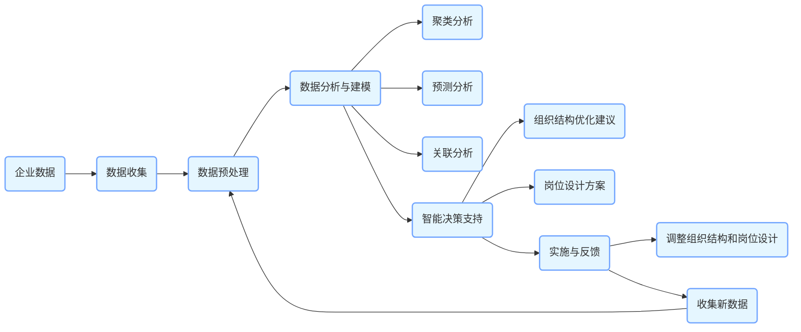

# AI辅助企业组织结构优化与岗位设计

> 关键词：AI、企业组织结构优化、岗位设计、数据分析、智能决策

> 摘要：本文聚焦于AI在企业组织结构优化与岗位设计方面的应用。通过深入探讨AI的核心概念、算法原理、数学模型，结合实际案例详细展示了如何利用AI技术辅助企业进行更科学、高效的组织结构调整和岗位设计。同时分析了其实际应用场景，推荐了相关的学习资源、开发工具和研究论文，最后总结了未来发展趋势与挑战，为企业借助AI提升组织效能提供全面的技术指导。

## 1. 背景介绍 
### 1.1 目的和范围
在当今竞争激烈的商业环境中，企业需要不断优化自身的组织结构和岗位设计，以提高运营效率、增强竞争力。AI技术的快速发展为企业提供了新的解决方案。本文的目的是深入探讨如何利用AI辅助企业进行组织结构优化与岗位设计，涵盖了从理论原理到实际应用的各个方面，包括核心概念、算法实现、数学模型、项目实战等内容。

### 1.2 预期读者
本文的预期读者主要包括企业管理人员、人力资源专家、IT技术人员以及对AI在企业管理中应用感兴趣的研究人员。企业管理人员可以从中了解如何借助AI提升企业组织效能；人力资源专家能够学习到利用AI进行岗位设计和人员配置的方法；IT技术人员可以掌握相关的算法和技术实现；研究人员则可以获取该领域的最新研究动态和应用案例。

### 1.3 文档结构概述
本文首先介绍背景信息，包括目的、预期读者和文档结构。接着阐述核心概念与联系，展示相关的原理和架构。然后详细讲解核心算法原理和具体操作步骤，并用Python代码进行说明。之后介绍数学模型和公式，并举例说明。通过项目实战部分，给出实际案例和代码详细解释。再分析实际应用场景，推荐相关的工具和资源。最后总结未来发展趋势与挑战，提供常见问题解答和扩展阅读参考资料。

### 1.4 术语表
#### 1.4.1 核心术语定义
- **AI（Artificial Intelligence）**：人工智能，是一门研究如何使计算机能够模拟人类智能的技术和学科，包括机器学习、深度学习、自然语言处理等多个领域。
- **企业组织结构优化**：对企业的组织架构进行调整和改进，以提高企业的运营效率、适应市场变化和战略需求。
- **岗位设计**：根据企业的战略目标和业务流程，确定各个岗位的职责、权限、工作内容和任职要求等。

#### 1.4.2 相关概念解释
- **机器学习**：AI的一个重要分支，通过让计算机从数据中学习模式和规律，从而实现预测和决策。
- **数据分析**：对企业的各种数据进行收集、整理、分析和挖掘，以发现有价值的信息和知识。
- **智能决策**：利用AI技术和数据分析结果，为企业提供科学、合理的决策支持。

#### 1.4.3 缩略词列表
- **ML（Machine Learning）**：机器学习
- **DL（Deep Learning）**：深度学习
- **NLP（Natural Language Processing）**：自然语言处理

## 2. 核心概念与联系 

### 核心概念原理
AI辅助企业组织结构优化与岗位设计主要基于数据分析和机器学习技术。企业内部存在大量的数据，如员工的绩效数据、岗位信息、业务流程数据等。通过对这些数据进行收集、整理和分析，可以发现企业组织结构和岗位设计中存在的问题和潜在的优化空间。

机器学习算法可以对数据进行建模和预测，帮助企业进行智能决策。例如，通过聚类算法可以将相似的岗位进行归类，以便进行更合理的岗位设置；通过预测算法可以预测不同岗位的需求，为人员招聘和配置提供依据。

### 架构的文本示意图
```plaintext
企业数据
|
|-- 数据收集（员工绩效、岗位信息、业务流程等）
|
|-- 数据预处理（清洗、转换、归一化等）
|
|-- 数据分析与建模（机器学习算法）
|       |
|       |-- 聚类分析（岗位归类）
|       |-- 预测分析（岗位需求预测）
|       |-- 关联分析（岗位关系分析）
|
|-- 智能决策支持
|       |
|       |-- 组织结构优化建议
|       |-- 岗位设计方案
|
|-- 实施与反馈
|       |
|       |-- 调整组织结构和岗位设计
|       |-- 收集新数据，进行新一轮优化
```

### Mermaid流程图


## 3. 核心算法原理 & 具体操作步骤 

### 聚类分析算法原理及Python实现
聚类分析是将数据集中相似的数据点划分为不同的簇的过程。在企业组织结构优化与岗位设计中，可以使用聚类算法将相似的岗位进行归类。这里以K-Means聚类算法为例进行讲解。

#### 算法原理
K-Means算法的基本思想是通过迭代的方式将数据点分配到K个不同的簇中，使得每个数据点到其所属簇的质心的距离之和最小。具体步骤如下：
1. 随机选择K个数据点作为初始质心。
2. 将每个数据点分配到距离最近的质心所在的簇中。
3. 重新计算每个簇的质心。
4. 重复步骤2和3，直到质心不再发生变化或达到最大迭代次数。

#### Python代码实现
```python
import numpy as np
from sklearn.cluster import KMeans

# 示例数据，假设每个岗位有多个特征
岗位数据 = np.array([[1, 2, 3], [4, 5, 6], [7, 8, 9], [10, 11, 12], [13, 14, 15]])

# 定义簇的数量
K = 2

# 创建K-Means模型
kmeans = KMeans(n_clusters=K)

# 训练模型
kmeans.fit(岗位数据)

# 获取每个岗位所属的簇
岗位簇标签 = kmeans.labels_

print("每个岗位所属的簇标签:", 岗位簇标签)
```

### 预测分析算法原理及Python实现
预测分析可以帮助企业预测不同岗位的需求。这里以线性回归算法为例进行讲解。

#### 算法原理
线性回归是一种用于建立自变量和因变量之间线性关系的统计方法。在岗位需求预测中，可以将影响岗位需求的因素作为自变量，岗位需求作为因变量，建立线性回归模型。

#### Python代码实现
```python
import numpy as np
from sklearn.linear_model import LinearRegression

# 示例数据，假设影响岗位需求的因素有两个
自变量 = np.array([[1, 2], [2, 3], [3, 4], [4, 5], [5, 6]])
因变量 = np.array([3, 5, 7, 9, 11])

# 创建线性回归模型
model = LinearRegression()

# 训练模型
model.fit(自变量, 因变量)

# 预测新的岗位需求
新自变量 = np.array([[6, 7]])
预测结果 = model.predict(新自变量)

print("预测的岗位需求:", 预测结果)
```

### 关联分析算法原理及Python实现
关联分析可以发现岗位之间的关联关系。这里以Apriori算法为例进行讲解。

#### 算法原理
Apriori算法是一种经典的关联规则挖掘算法，通过逐层搜索的方式找出数据集中的频繁项集，并根据频繁项集生成关联规则。

#### Python代码实现
```python
from mlxtend.preprocessing import TransactionEncoder
from mlxtend.frequent_patterns import apriori, association_rules
import pandas as pd

# 示例数据，每个列表表示一个岗位组合
岗位组合数据 = [['岗位A', '岗位B'], ['岗位B', '岗位C'], ['岗位A', '岗位C'], ['岗位A', '岗位B', '岗位C']]

# 数据编码
te = TransactionEncoder()
te_ary = te.fit(岗位组合数据).transform(岗位组合数据)
df = pd.DataFrame(te_ary, columns=te.columns_)

# 挖掘频繁项集
frequent_itemsets = apriori(df, min_support=0.5, use_colnames=True)

# 生成关联规则
rules = association_rules(frequent_itemsets, metric="confidence", min_threshold=0.7)

print("频繁项集:", frequent_itemsets)
print("关联规则:", rules)
```

## 4. 数学模型和公式 & 详细讲解 & 举例说明 

### K-Means聚类算法的数学模型和公式
#### 数学模型
K-Means算法的目标是最小化每个数据点到其所属簇的质心的距离之和，数学表达式为：
$$
J = \sum_{i=1}^{n} \sum_{j=1}^{K} r_{ij} \left\| x_i - \mu_j \right\|^2
$$
其中，$n$ 是数据点的数量，$K$ 是簇的数量，$x_i$ 是第 $i$ 个数据点，$\mu_j$ 是第 $j$ 个簇的质心，$r_{ij}$ 是一个指示变量，如果数据点 $x_i$ 属于簇 $j$，则 $r_{ij} = 1$，否则 $r_{ij} = 0$。

#### 详细讲解
该公式的含义是对于每个数据点，找到其所属的簇，计算该数据点到该簇质心的欧氏距离的平方，然后将所有数据点的距离平方求和。K-Means算法通过迭代的方式不断调整质心的位置，使得 $J$ 的值最小。

#### 举例说明
假设有三个数据点 $x_1 = [1, 2]$，$x_2 = [4, 5]$，$x_3 = [7, 8]$，初始质心为 $\mu_1 = [2, 3]$，$\mu_2 = [6, 7]$。计算每个数据点到质心的距离平方：
- 对于 $x_1$：
  - 到 $\mu_1$ 的距离平方：$\left\| [1, 2] - [2, 3] \right\|^2 = (1 - 2)^2 + (2 - 3)^2 = 2$
  - 到 $\mu_2$ 的距离平方：$\left\| [1, 2] - [6, 7] \right\|^2 = (1 - 6)^2 + (2 - 7)^2 = 50$
  因此，$x_1$ 属于簇 1，$r_{11} = 1$，$r_{12} = 0$。
- 对于 $x_2$：
  - 到 $\mu_1$ 的距离平方：$\left\| [4, 5] - [2, 3] \right\|^2 = (4 - 2)^2 + (5 - 3)^2 = 8$
  - 到 $\mu_2$ 的距离平方：$\left\| [4, 5] - [6, 7] \right\|^2 = (4 - 6)^2 + (5 - 7)^2 = 8$
  这里假设将 $x_2$ 分配到簇 1，$r_{21} = 1$，$r_{22} = 0$。
- 对于 $x_3$：
  - 到 $\mu_1$ 的距离平方：$\left\| [7, 8] - [2, 3] \right\|^2 = (7 - 2)^2 + (8 - 3)^2 = 50$
  - 到 $\mu_2$ 的距离平方：$\left\| [7, 8] - [6, 7] \right\|^2 = (7 - 6)^2 + (8 - 7)^2 = 2$
  因此，$x_3$ 属于簇 2，$r_{31} = 0$，$r_{32} = 1$。

则 $J = r_{11} \left\| x_1 - \mu_1 \right\|^2 + r_{12} \left\| x_1 - \mu_2 \right\|^2 + r_{21} \left\| x_2 - \mu_1 \right\|^2 + r_{22} \left\| x_2 - \mu_2 \right\|^2 + r_{31} \left\| x_3 - \mu_1 \right\|^2 + r_{32} \left\| x_3 - \mu_2 \right\|^2 = 2 + 0 + 8 + 0 + 0 + 2 = 12$。

### 线性回归算法的数学模型和公式
#### 数学模型
线性回归模型的数学表达式为：
$$
y = \beta_0 + \beta_1 x_1 + \beta_2 x_2 + \cdots + \beta_n x_n + \epsilon
$$
其中，$y$ 是因变量，$x_1, x_2, \cdots, x_n$ 是自变量，$\beta_0, \beta_1, \beta_2, \cdots, \beta_n$ 是模型的参数，$\epsilon$ 是误差项。

#### 详细讲解
该公式表示因变量 $y$ 与自变量 $x_1, x_2, \cdots, x_n$ 之间的线性关系。通过最小化误差项的平方和，可以估计出模型的参数 $\beta_0, \beta_1, \beta_2, \cdots, \beta_n$。

#### 举例说明
假设我们要预测岗位需求 $y$ 与两个影响因素 $x_1$ 和 $x_2$ 之间的关系，已知以下数据：
| $x_1$ | $x_2$ | $y$ |
| --- | --- | --- |
| 1 | 2 | 3 |
| 2 | 3 | 5 |
| 3 | 4 | 7 |
| 4 | 5 | 9 |
| 5 | 6 | 11 |

通过最小二乘法可以估计出模型的参数 $\beta_0, \beta_1, \beta_2$。假设估计结果为 $\beta_0 = 1$，$\beta_1 = 2$，$\beta_2 = 0$，则线性回归模型为 $y = 1 + 2x_1$。当 $x_1 = 6$ 时，预测的岗位需求为 $y = 1 + 2 \times 6 = 13$。

### Apriori算法的数学模型和公式
#### 数学模型
Apriori算法主要涉及频繁项集和关联规则的概念。频繁项集是指在数据集中出现频率超过最小支持度的项集。关联规则是形如 $X \Rightarrow Y$ 的规则，其中 $X$ 和 $Y$ 是项集，规则的支持度和置信度分别定义为：
- 支持度：$Support(X \Rightarrow Y) = \frac{Count(X \cup Y)}{N}$
- 置信度：$Confidence(X \Rightarrow Y) = \frac{Count(X \cup Y)}{Count(X)}$
其中，$Count(X)$ 表示项集 $X$ 在数据集中出现的次数，$N$ 是数据集的总记录数。

#### 详细讲解
支持度反映了项集 $X$ 和 $Y$ 同时出现的频率，置信度反映了在项集 $X$ 出现的情况下，项集 $Y$ 出现的概率。Apriori算法通过逐层搜索的方式找出所有满足最小支持度的频繁项集，并根据频繁项集生成满足最小置信度的关联规则。

#### 举例说明
假设有以下岗位组合数据集：
| 记录编号 | 岗位组合 |
| --- | --- |
| 1 | 岗位A, 岗位B |
| 2 | 岗位B, 岗位C |
| 3 | 岗位A, 岗位C |
| 4 | 岗位A, 岗位B, 岗位C |

总记录数 $N = 4$。
- 计算项集 $\{岗位A, 岗位B\}$ 的支持度：$Count(\{岗位A, 岗位B\}) = 2$，则 $Support(\{岗位A, 岗位B\}) = \frac{2}{4} = 0.5$。
- 计算关联规则 $\{岗位A\} \Rightarrow \{岗位B\}$ 的置信度：$Count(\{岗位A\}) = 3$，$Count(\{岗位A, 岗位B\}) = 2$，则 $Confidence(\{岗位A\} \Rightarrow \{岗位B\}) = \frac{2}{3} \approx 0.67$。

## 5. 项目实战：代码实际案例和详细解释说明 

### 5.1  开发环境搭建
#### 安装Python
首先需要安装Python，建议使用Python 3.7及以上版本。可以从Python官方网站（https://www.python.org/downloads/）下载并安装。

#### 安装必要的库
使用以下命令安装本文所需的库：
```sh
pip install numpy pandas scikit-learn mlxtend
```

### 5.2  源代码详细实现和代码解读
#### 数据准备
假设我们有一个包含员工信息和岗位信息的CSV文件 `employee_data.csv`，文件内容如下：
| 员工ID | 岗位名称 | 工作年限 | 绩效评分 |
| --- | --- | --- | --- |
| 1 | 岗位A | 3 | 80 |
| 2 | 岗位B | 5 | 90 |
| 3 | 岗位A | 2 | 70 |
| 4 | 岗位B | 4 | 85 |

以下是读取数据并进行预处理的代码：
```python
import pandas as pd

# 读取数据
data = pd.read_csv('employee_data.csv')

# 提取特征
features = data[['工作年限', '绩效评分']]

# 数据归一化
from sklearn.preprocessing import MinMaxScaler
scaler = MinMaxScaler()
scaled_features = scaler.fit_transform(features)
```
代码解读：
- 首先使用 `pandas` 库的 `read_csv` 函数读取CSV文件。
- 然后提取 `工作年限` 和 `绩效评分` 作为特征。
- 最后使用 `MinMaxScaler` 对特征进行归一化处理，将特征值缩放到 [0, 1] 区间。

#### 岗位聚类分析
```python
from sklearn.cluster import KMeans

# 定义簇的数量
K = 2

# 创建K-Means模型
kmeans = KMeans(n_clusters=K)

# 训练模型
kmeans.fit(scaled_features)

# 获取每个岗位所属的簇
岗位簇标签 = kmeans.labels_

# 将簇标签添加到原始数据中
data['簇标签'] = 岗位簇标签

print(data)
```
代码解读：
- 首先导入 `KMeans` 类，定义簇的数量为 2。
- 然后创建 `KMeans` 模型并使用归一化后的特征进行训练。
- 最后获取每个岗位所属的簇标签，并将其添加到原始数据中。

#### 岗位需求预测
```python
from sklearn.linear_model import LinearRegression
from sklearn.model_selection import train_test_split

# 划分训练集和测试集
X_train, X_test, y_train, y_test = train_test_split(scaled_features, data['绩效评分'], test_size=0.2, random_state=42)

# 创建线性回归模型
model = LinearRegression()

# 训练模型
model.fit(X_train, y_train)

# 预测测试集
y_pred = model.predict(X_test)

# 计算均方误差
from sklearn.metrics import mean_squared_error
mse = mean_squared_error(y_test, y_pred)
print("均方误差:", mse)
```
代码解读：
- 首先使用 `train_test_split` 函数将数据集划分为训练集和测试集，测试集占比为 20%。
- 然后创建 `LinearRegression` 模型并使用训练集进行训练。
- 接着使用训练好的模型对测试集进行预测。
- 最后使用 `mean_squared_error` 函数计算预测结果的均方误差。

### 5.3  代码解读与分析
#### 数据预处理
数据预处理是机器学习中的重要步骤，通过归一化处理可以消除不同特征之间的量纲差异，提高模型的训练效果。

#### 岗位聚类分析
K-Means聚类算法可以将相似的岗位进行归类，有助于企业进行岗位合并或调整。通过分析不同簇的特征，可以了解不同岗位类型的特点。

#### 岗位需求预测
线性回归模型可以根据员工的工作年限和绩效评分预测岗位需求。均方误差可以衡量模型的预测准确性，误差越小，模型的预测效果越好。

## 6. 实际应用场景 
### 岗位合并与调整
通过聚类分析，可以将相似的岗位进行合并，减少岗位冗余，提高工作效率。例如，将职责和技能要求相近的岗位合并为一个岗位，避免人员重复配置。

### 人员招聘与配置
预测分析可以帮助企业预测不同岗位的需求，合理安排人员招聘计划。同时，根据岗位的关联关系，可以将合适的人员配置到相关的岗位上，提高团队协作效率。

### 组织结构优化
关联分析可以发现岗位之间的关联关系，为企业的组织结构调整提供依据。例如，将关联紧密的岗位设置在同一部门或团队，便于沟通和协作。

### 员工培训与发展
根据岗位的聚类结果和关联关系，可以为员工制定个性化的培训计划。对于同一簇的岗位，可以提供相似的培训课程；对于关联岗位，可以提供跨岗位的培训，提升员工的综合能力。

## 7. 工具和资源推荐
### 7.1 学习资源推荐
#### 7.1.1 书籍推荐
- 《机器学习》（周志华）：全面介绍了机器学习的基本概念、算法和应用，是机器学习领域的经典教材。
- 《Python机器学习实战》（Sebastian Raschka）：通过实际案例详细介绍了如何使用Python进行机器学习开发，适合初学者。
- 《人工智能：一种现代的方法》（Stuart Russell, Peter Norvig）：系统阐述了人工智能的基本原理、技术和应用，是人工智能领域的权威著作。

#### 7.1.2 在线课程
- Coursera上的“机器学习”课程（Andrew Ng）：由斯坦福大学教授Andrew Ng授课，是机器学习领域最受欢迎的在线课程之一。
- edX上的“人工智能基础”课程：全面介绍了人工智能的基本概念、算法和应用，适合初学者。
- 中国大学MOOC上的“Python数据分析与挖掘实战”课程：通过实际案例详细介绍了如何使用Python进行数据分析和挖掘，对企业组织结构优化与岗位设计有很大帮助。

#### 7.1.3 技术博客和网站
- 机器之心（https://www.alldatasheet.com/）：专注于人工智能领域的技术和应用，提供最新的技术文章和研究成果。
- 开源中国（https://www.oschina.net/）：提供丰富的开源技术资源和技术文章，涵盖了机器学习、数据分析等多个领域。
- 知乎（https://www.zhihu.com/）：有很多关于人工智能和企业管理的讨论和分享，可以获取不同的观点和经验。

### 7.2 开发工具框架推荐
#### 7.2.1 IDE和编辑器
- PyCharm：一款专业的Python集成开发环境，提供了丰富的代码编辑、调试和部署功能，适合Python开发。
- Jupyter Notebook：一个交互式的开发环境，可以方便地进行数据分析和模型训练，支持Python、R等多种编程语言。
- Visual Studio Code：一款轻量级的代码编辑器，支持多种编程语言和插件扩展，适合快速开发和调试。

#### 7.2.2 调试和性能分析工具
- TensorBoard：TensorFlow提供的可视化工具，可以帮助用户监控模型的训练过程、分析模型的性能。
- Scikit-learn的模型评估工具：Scikit-learn库提供了丰富的模型评估指标和工具，如准确率、召回率、均方误差等，可以帮助用户评估模型的性能。
- Py-spy：一个用于分析Python程序性能的工具，可以帮助用户找出程序中的性能瓶颈。

#### 7.2.3 相关框架和库
- Scikit-learn：一个简单易用的机器学习库，提供了丰富的机器学习算法和工具，如分类、回归、聚类等。
- TensorFlow：一个开源的深度学习框架，广泛应用于图像识别、自然语言处理等领域。
- Pandas：一个强大的数据分析库，提供了数据结构和数据处理工具，方便用户进行数据清洗、转换和分析。

### 7.3 相关论文著作推荐
#### 7.3.1 经典论文
- "A Fast Algorithm for Clustering Large Data Sets with Application to Kernel K-Means"（Chih-Jen Lin）：提出了一种快速的K-Means聚类算法，提高了聚类效率。
- "Regression Analysis: Concepts and Applications"（Douglas C. Montgomery, Elizabeth A. Peck, G. Geoffrey Vining）：系统介绍了回归分析的基本概念、方法和应用。
- "Mining Association Rules between Sets of Items in Large Databases"（Rakesh Agrawal, Ramakrishnan Srikant）：提出了经典的Apriori关联规则挖掘算法。

#### 7.3.2 最新研究成果
- "AI-Enabled Organizational Design: A Framework for Leveraging Artificial Intelligence in Redesigning Organizations"（S. S. Sarker, M. K. Alam）：探讨了如何利用AI进行企业组织结构设计的框架和方法。
- "Machine Learning for Human Resources: A Review and Research Agenda"（J. A. Lepak, S. A. Snell, M. A. Shipton）：综述了机器学习在人力资源管理中的应用，并提出了未来的研究方向。

#### 7.3.3 应用案例分析
- "How AI is Transforming Organizational Structure and Job Design in Tech Companies"（Harvard Business Review）：分析了AI在科技公司组织结构和岗位设计中的应用案例，为企业提供了实践参考。
- "AI-Driven Organizational Optimization: A Case Study in a Manufacturing Company"（MIT Sloan Management Review）：介绍了一家制造企业利用AI进行组织结构优化的案例，展示了AI的实际应用效果。

## 8. 总结：未来发展趋势与挑战
### 未来发展趋势
- **智能化程度不断提高**：随着AI技术的不断发展，企业组织结构优化与岗位设计将更加智能化。AI可以自动分析企业数据，生成更科学、合理的优化方案和岗位设计建议。
- **与其他技术深度融合**：AI将与物联网、大数据、区块链等技术深度融合，为企业提供更全面、准确的信息支持。例如，通过物联网设备收集员工的工作数据，结合AI进行分析，更好地了解员工的工作状态和需求。
- **个性化定制服务**：根据企业的不同行业、规模和发展阶段，提供个性化的组织结构优化和岗位设计解决方案。AI可以根据企业的具体情况进行定制化分析和决策。

### 挑战
- **数据质量和安全问题**：AI的应用依赖于大量的高质量数据。企业需要确保数据的准确性、完整性和安全性，防止数据泄露和滥用。
- **技术人才短缺**：AI技术的应用需要专业的技术人才，包括数据科学家、机器学习工程师等。企业面临着技术人才短缺的问题，需要加强人才培养和引进。
- **组织文化和变革管理**：引入AI进行组织结构优化和岗位设计可能会对企业的组织文化和员工产生影响。企业需要做好变革管理，引导员工适应新的工作方式和组织架构。

## 9. 附录：常见问题与解答
### 问题1：AI辅助企业组织结构优化与岗位设计需要哪些数据？
答：通常需要企业的员工信息数据（如岗位名称、工作年限、绩效评分等）、业务流程数据、财务数据等。具体数据需求根据企业的具体情况和分析目标而定。

### 问题2：如何选择合适的机器学习算法？
答：选择合适的机器学习算法需要考虑问题的类型（如分类、回归、聚类等）、数据的特点（如数据量、特征数量、数据分布等）和算法的性能（如准确率、召回率、运行时间等）。可以通过实验和比较不同算法的性能来选择最合适的算法。

### 问题3：AI辅助企业组织结构优化与岗位设计的实施过程中需要注意什么？
答：需要注意以下几点：
- 确保数据的质量和安全。
- 与企业的战略目标和业务需求相结合。
- 做好员工的沟通和培训，让员工理解和支持变革。
- 对优化方案进行持续评估和调整，确保其有效性。

### 问题4：AI能否完全替代人力资源专家进行岗位设计？
答：AI不能完全替代人力资源专家。虽然AI可以提供数据分析和决策支持，但人力资源专家具有丰富的行业经验和人际关系处理能力，能够考虑到员工的情感和心理因素，做出更人性化的决策。AI和人力资源专家应该相互配合，共同完成企业的岗位设计工作。

## 10. 扩展阅读 & 参考资料
- 《企业数字化转型：从战略到实践》
- 《人工智能时代的人力资源管理》
- https://www.ibm.com/cloud/learn/ai-in-hr
- https://www.forbes.com/sites/forbestechcouncil/2020/06/16/how-ai-is-transforming-human-resources/

作者：AI天才研究院/AI Genius Institute & 禅与计算机程序设计艺术 /Zen And The Art of Computer Programming