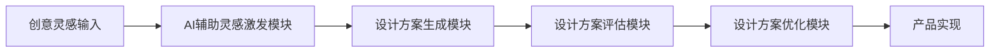

# AI辅助创意设计：从灵感到产品

> 关键词：AI辅助创意设计、灵感激发、设计流程、产品实现、设计工具

> 摘要：本文深入探讨了AI辅助创意设计从灵感到产品的整个过程。首先介绍了相关背景，包括目的范围、预期读者等。接着阐述了核心概念及联系，通过文本示意图和Mermaid流程图清晰展示。详细讲解了核心算法原理和具体操作步骤，并用Python代码进行说明。还给出了数学模型和公式，并举例分析。通过项目实战，展示了代码实际案例及详细解释。探讨了实际应用场景，推荐了学习、开发工具框架以及相关论文著作。最后总结了未来发展趋势与挑战，提供了常见问题解答和扩展阅读参考资料，旨在为设计师和开发者提供全面的AI辅助创意设计知识体系。

## 1. 背景介绍 
### 1.1 目的和范围
随着人工智能技术的飞速发展，其在创意设计领域的应用越来越广泛。本文的目的是全面介绍AI辅助创意设计从灵感到产品的整个流程，涵盖从创意的初步激发，到设计方案的生成、优化，再到最终产品的实现。通过详细阐述这一过程，帮助设计师和开发者更好地理解和应用AI技术，提高创意设计的效率和质量。

### 1.2 预期读者
本文主要面向创意设计领域的专业人士，如平面设计师、产品设计师、室内设计师等，以及对AI技术在设计领域应用感兴趣的开发者和研究人员。对于那些希望了解如何利用AI工具提升创意设计能力的初学者，本文也提供了系统的知识和实践指导。

### 1.3 文档结构概述
本文将按照以下结构进行组织：首先介绍核心概念与联系，包括AI辅助创意设计的基本原理和架构；接着讲解核心算法原理和具体操作步骤，并给出Python代码示例；然后介绍数学模型和公式，通过实际例子进行详细说明；再通过项目实战展示代码的实际应用和详细解读；之后探讨AI辅助创意设计的实际应用场景；推荐相关的学习资源、开发工具框架和论文著作；最后总结未来发展趋势与挑战，提供常见问题解答和扩展阅读参考资料。

### 1.4 术语表
#### 1.4.1 核心术语定义
- **AI辅助创意设计**：利用人工智能技术为创意设计过程提供支持和帮助，包括灵感激发、设计方案生成、设计优化等。
- **创意灵感**：设计师在设计过程中产生的新颖、独特的想法和概念。
- **设计方案**：根据创意灵感生成的具体设计内容，如设计草图、模型等。
- **产品实现**：将设计方案转化为实际产品的过程，包括制造、生产等环节。

#### 1.4.2 相关概念解释
- **机器学习**：人工智能的一个分支，通过让计算机从数据中学习模式和规律，从而实现预测和决策。在AI辅助创意设计中，机器学习可以用于分析设计数据，生成设计方案。
- **深度学习**：一种基于人工神经网络的机器学习方法，能够处理复杂的非线性数据。在创意设计中，深度学习可以用于图像生成、风格迁移等任务。
- **自然语言处理**：研究如何让计算机理解和处理人类语言的技术。在AI辅助创意设计中，自然语言处理可以用于将设计师的文字描述转化为设计方案。

#### 1.4.3 缩略词列表
- **AI**：Artificial Intelligence，人工智能
- **ML**：Machine Learning，机器学习
- **DL**：Deep Learning，深度学习
- **NLP**：Natural Language Processing，自然语言处理

## 2. 核心概念与联系 

### 核心概念原理
AI辅助创意设计的核心原理是利用人工智能技术模拟人类的创意思维过程，为设计师提供灵感和设计方案。具体来说，AI可以通过以下几种方式辅助创意设计：
- **数据驱动的灵感激发**：AI可以分析大量的设计数据，如图片、视频、文本等，发现其中的模式和趋势，为设计师提供灵感。例如，通过分析时尚杂志上的图片，AI可以总结出当前流行的设计元素和风格，为服装设计师提供参考。
- **自动化设计生成**：AI可以根据设计师输入的要求和约束条件，自动生成设计方案。例如，利用生成对抗网络（GAN）可以生成逼真的图像，利用遗传算法可以优化设计方案。
- **设计优化和评估**：AI可以对设计方案进行评估和优化，帮助设计师提高设计质量。例如，通过机器学习算法可以分析设计方案的优缺点，为设计师提供改进建议。

### 架构的文本示意图
```plaintext
创意灵感输入
    |
    v
AI辅助灵感激发模块（数据挖掘、模式识别）
    |
    v
设计方案生成模块（机器学习、深度学习模型）
    |
    v
设计方案评估模块（评估指标、算法）
    |
    v
设计方案优化模块（优化算法）
    |
    v
产品实现（制造、生产）
```

### Mermaid流程图


## 3. 核心算法原理 & 具体操作步骤 

### 核心算法原理
在AI辅助创意设计中，常用的核心算法包括：
- **生成对抗网络（GAN）**：GAN由生成器和判别器组成，生成器试图生成逼真的样本，判别器则试图区分生成的样本和真实的样本。通过不断的对抗训练，生成器可以生成越来越逼真的样本。在创意设计中，GAN可以用于图像生成、风格迁移等任务。
- **遗传算法**：遗传算法是一种基于自然选择和遗传机制的优化算法。它通过模拟生物进化过程，不断迭代优化设计方案。在创意设计中，遗传算法可以用于优化设计参数，如形状、颜色、尺寸等。
- **聚类算法**：聚类算法可以将相似的数据点划分为不同的类别。在创意设计中，聚类算法可以用于分析设计数据，发现其中的模式和趋势，为设计师提供灵感。

### 具体操作步骤
下面以使用GAN进行图像生成为例，介绍具体的操作步骤：
1. **数据准备**：收集和整理用于训练的图像数据，并进行预处理，如缩放、归一化等。
2. **模型构建**：构建生成器和判别器模型，可以使用深度学习框架如TensorFlow或PyTorch。
3. **模型训练**：将预处理后的数据输入到模型中进行训练，通过不断调整生成器和判别器的参数，使生成器能够生成逼真的图像。
4. **图像生成**：训练完成后，使用生成器生成新的图像。

### Python源代码实现
```python
import tensorflow as tf
from tensorflow.keras import layers

# 构建生成器模型
def make_generator_model():
    model = tf.keras.Sequential()
    model.add(layers.Dense(7*7*256, use_bias=False, input_shape=(100,)))
    model.add(layers.BatchNormalization())
    model.add(layers.LeakyReLU())

    model.add(layers.Reshape((7, 7, 256)))
    assert model.output_shape == (None, 7, 7, 256)

    model.add(layers.Conv2DTranspose(128, (5, 5), strides=(2, 2), padding='same', use_bias=False))
    assert model.output_shape == (None, 14, 14, 128)
    model.add(layers.BatchNormalization())
    model.add(layers.LeakyReLU())

    model.add(layers.Conv2DTranspose(64, (5, 5), strides=(2, 2), padding='same', use_bias=False))
    assert model.output_shape == (None, 28, 28, 64)
    model.add(layers.BatchNormalization())
    model.add(layers.LeakyReLU())

    model.add(layers.Conv2DTranspose(1, (5, 5), strides=(1, 1), padding='same', use_bias=False, activation='tanh'))
    assert model.output_shape == (None, 28, 28, 1)

    return model

# 构建判别器模型
def make_discriminator_model():
    model = tf.keras.Sequential()
    model.add(layers.Conv2D(64, (5, 5), strides=(2, 2), padding='same',
                                     input_shape=[28, 28, 1]))
    model.add(layers.LeakyReLU())
    model.add(layers.Dropout(0.3))

    model.add(layers.Conv2D(128, (5, 5), strides=(2, 2), padding='same'))
    model.add(layers.LeakyReLU())
    model.add(layers.Dropout(0.3))

    model.add(layers.Flatten())
    model.add(layers.Dense(1))

    return model

# 定义损失函数
cross_entropy = tf.keras.losses.BinaryCrossentropy(from_logits=True)

def discriminator_loss(real_output, fake_output):
    real_loss = cross_entropy(tf.ones_like(real_output), real_output)
    fake_loss = cross_entropy(tf.zeros_like(fake_output), fake_output)
    total_loss = real_loss + fake_loss
    return total_loss

def generator_loss(fake_output):
    return cross_entropy(tf.ones_like(fake_output), fake_output)

# 定义优化器
generator_optimizer = tf.keras.optimizers.Adam(1e-4)
discriminator_optimizer = tf.keras.optimizers.Adam(1e-4)

# 训练循环
@tf.function
def train_step(images):
    noise = tf.random.normal([BATCH_SIZE, 100])

    with tf.GradientTape() as gen_tape, tf.GradientTape() as disc_tape:
      generated_images = generator(noise, training=True)

      real_output = discriminator(images, training=True)
      fake_output = discriminator(generated_images, training=True)

      gen_loss = generator_loss(fake_output)
      disc_loss = discriminator_loss(real_output, fake_output)

    gradients_of_generator = gen_tape.gradient(gen_loss, generator.trainable_variables)
    gradients_of_discriminator = disc_tape.gradient(disc_loss, discriminator.trainable_variables)

    generator_optimizer.apply_gradients(zip(gradients_of_generator, generator.trainable_variables))
    discriminator_optimizer.apply_gradients(zip(gradients_of_discriminator, discriminator.trainable_variables))

# 训练模型
import time
def train(dataset, epochs):
  for epoch in range(epochs):
    start = time.time()

    for image_batch in dataset:
      train_step(image_batch)

    print ('Time for epoch {} is {} sec'.format(epoch + 1, time.time()-start))

# 实例化模型
generator = make_generator_model()
discriminator = make_discriminator_model()

# 加载数据集
(train_images, train_labels), (_, _) = tf.keras.datasets.mnist.load_data()
train_images = train_images.reshape(train_images.shape[0], 28, 28, 1).astype('float32')
train_images = (train_images - 127.5) / 127.5  # 归一化到 [-1, 1]
BUFFER_SIZE = 60000
BATCH_SIZE = 256
train_dataset = tf.data.Dataset.from_tensor_slices(train_images).shuffle(BUFFER_SIZE).batch(BATCH_SIZE)

# 训练模型
EPOCHS = 50
train(train_dataset, EPOCHS)

# 生成图像
import matplotlib.pyplot as plt
noise = tf.random.normal([1, 100])
generated_image = generator(noise, training=False)
plt.imshow(generated_image[0, :, :, 0], cmap='gray')
plt.show()
```

## 4. 数学模型和公式 & 详细讲解 & 举例说明 

### 生成对抗网络（GAN）的数学模型
GAN的目标是通过对抗训练使生成器生成的样本尽可能接近真实样本。设生成器为 $G(z)$，其中 $z$ 是随机噪声向量，判别器为 $D(x)$，其中 $x$ 是输入样本。GAN的目标函数可以表示为：
$$
\min_G \max_D V(D, G) = \mathbb{E}_{x \sim p_{data}(x)}[\log D(x)] + \mathbb{E}_{z \sim p_z(z)}[\log (1 - D(G(z)))]
$$
其中，$p_{data}(x)$ 是真实数据的分布，$p_z(z)$ 是随机噪声的分布。

### 详细讲解
- **判别器的目标**：判别器的目标是最大化 $V(D, G)$，即尽可能准确地区分真实样本和生成样本。对于真实样本 $x$，判别器希望 $D(x)$ 接近1；对于生成样本 $G(z)$，判别器希望 $D(G(z))$ 接近0。
- **生成器的目标**：生成器的目标是最小化 $V(D, G)$，即尽可能生成让判别器难以区分的样本。生成器希望 $D(G(z))$ 接近1。

### 举例说明
假设我们要使用GAN生成手写数字图像。真实数据是MNIST数据集中的手写数字图像，随机噪声 $z$ 是一个100维的向量。生成器将随机噪声 $z$ 映射到一个28x28的图像，判别器则判断输入的图像是真实的还是生成的。通过不断的对抗训练，生成器可以生成越来越逼真的手写数字图像。

### 遗传算法的数学模型
遗传算法的基本思想是通过模拟生物进化过程，不断迭代优化设计方案。设设计方案的参数为 $x = (x_1, x_2, \cdots, x_n)$，适应度函数为 $f(x)$，表示设计方案的优劣程度。遗传算法的主要步骤包括：
1. **初始化种群**：随机生成一组初始设计方案，作为种群。
2. **评估适应度**：计算每个设计方案的适应度值。
3. **选择操作**：根据适应度值选择一部分设计方案作为父代。
4. **交叉操作**：对父代设计方案进行交叉，生成子代设计方案。
5. **变异操作**：对子代设计方案进行变异，引入新的基因。
6. **更新种群**：用子代设计方案替换部分父代设计方案，更新种群。
7. **重复步骤2-6**：直到满足终止条件。

### 详细讲解
- **适应度函数**：适应度函数是遗传算法的核心，它决定了设计方案的优劣程度。在创意设计中，适应度函数可以根据设计的目标和要求进行定义，如美观度、实用性等。
- **选择操作**：选择操作的目的是选择适应度较高的设计方案作为父代，以便将优秀的基因传递给子代。常用的选择方法包括轮盘赌选择、锦标赛选择等。
- **交叉操作**：交叉操作是将父代设计方案的部分基因进行交换，生成子代设计方案。交叉操作可以增加种群的多样性，提高算法的搜索能力。
- **变异操作**：变异操作是对子代设计方案的部分基因进行随机改变，引入新的基因。变异操作可以避免算法陷入局部最优解。

### 举例说明
假设我们要使用遗传算法优化一个图形的设计，图形的参数包括形状、颜色、尺寸等。适应度函数可以定义为图形的美观度得分。初始种群是一组随机生成的图形设计方案，通过不断的选择、交叉和变异操作，遗传算法可以找到美观度得分较高的图形设计方案。

## 5. 项目实战：代码实际案例和详细解释说明 

### 5.1  开发环境搭建
#### 安装Python
首先，需要安装Python环境。可以从Python官方网站（https://www.python.org/downloads/）下载适合自己操作系统的Python版本，并按照安装向导进行安装。

#### 安装深度学习框架
本文使用TensorFlow作为深度学习框架，可以使用以下命令安装TensorFlow：
```sh
pip install tensorflow
```

#### 安装其他依赖库
还需要安装一些其他的依赖库，如NumPy、Matplotlib等，可以使用以下命令安装：
```sh
pip install numpy matplotlib
```

### 5.2  源代码详细实现和代码解读
以下是一个使用GAN生成手写数字图像的完整代码示例：
```python
import tensorflow as tf
from tensorflow.keras import layers
import matplotlib.pyplot as plt

# 构建生成器模型
def make_generator_model():
    model = tf.keras.Sequential()
    model.add(layers.Dense(7*7*256, use_bias=False, input_shape=(100,)))
    model.add(layers.BatchNormalization())
    model.add(layers.LeakyReLU())

    model.add(layers.Reshape((7, 7, 256)))
    assert model.output_shape == (None, 7, 7, 256)

    model.add(layers.Conv2DTranspose(128, (5, 5), strides=(2, 2), padding='same', use_bias=False))
    assert model.output_shape == (None, 14, 14, 128)
    model.add(layers.BatchNormalization())
    model.add(layers.LeakyReLU())

    model.add(layers.Conv2DTranspose(64, (5, 5), strides=(2, 2), padding='same', use_bias=False))
    assert model.output_shape == (None, 28, 28, 64)
    model.add(layers.BatchNormalization())
    model.add(layers.LeakyReLU())

    model.add(layers.Conv2DTranspose(1, (5, 5), strides=(1, 1), padding='same', use_bias=False, activation='tanh'))
    assert model.output_shape == (None, 28, 28, 1)

    return model

# 构建判别器模型
def make_discriminator_model():
    model = tf.keras.Sequential()
    model.add(layers.Conv2D(64, (5, 5), strides=(2, 2), padding='same',
                                     input_shape=[28, 28, 1]))
    model.add(layers.LeakyReLU())
    model.add(layers.Dropout(0.3))

    model.add(layers.Conv2D(128, (5, 5), strides=(2, 2), padding='same'))
    model.add(layers.LeakyReLU())
    model.add(layers.Dropout(0.3))

    model.add(layers.Flatten())
    model.add(layers.Dense(1))

    return model

# 定义损失函数
cross_entropy = tf.keras.losses.BinaryCrossentropy(from_logits=True)

def discriminator_loss(real_output, fake_output):
    real_loss = cross_entropy(tf.ones_like(real_output), real_output)
    fake_loss = cross_entropy(tf.zeros_like(fake_output), fake_output)
    total_loss = real_loss + fake_loss
    return total_loss

def generator_loss(fake_output):
    return cross_entropy(tf.ones_like(fake_output), fake_output)

# 定义优化器
generator_optimizer = tf.keras.optimizers.Adam(1e-4)
discriminator_optimizer = tf.keras.optimizers.Adam(1e-4)

# 训练循环
@tf.function
def train_step(images):
    noise = tf.random.normal([BATCH_SIZE, 100])

    with tf.GradientTape() as gen_tape, tf.GradientTape() as disc_tape:
      generated_images = generator(noise, training=True)

      real_output = discriminator(images, training=True)
      fake_output = discriminator(generated_images, training=True)

      gen_loss = generator_loss(fake_output)
      disc_loss = discriminator_loss(real_output, fake_output)

    gradients_of_generator = gen_tape.gradient(gen_loss, generator.trainable_variables)
    gradients_of_discriminator = disc_tape.gradient(disc_loss, discriminator.trainable_variables)

    generator_optimizer.apply_gradients(zip(gradients_of_generator, generator.trainable_variables))
    discriminator_optimizer.apply_gradients(zip(gradients_of_discriminator, discriminator.trainable_variables))

# 训练模型
import time
def train(dataset, epochs):
  for epoch in range(epochs):
    start = time.time()

    for image_batch in dataset:
      train_step(image_batch)

    print ('Time for epoch {} is {} sec'.format(epoch + 1, time.time()-start))

# 实例化模型
generator = make_generator_model()
discriminator = make_discriminator_model()

# 加载数据集
(train_images, train_labels), (_, _) = tf.keras.datasets.mnist.load_data()
train_images = train_images.reshape(train_images.shape[0], 28, 28, 1).astype('float32')
train_images = (train_images - 127.5) / 127.5  # 归一化到 [-1, 1]
BUFFER_SIZE = 60000
BATCH_SIZE = 256
train_dataset = tf.data.Dataset.from_tensor_slices(train_images).shuffle(BUFFER_SIZE).batch(BATCH_SIZE)

# 训练模型
EPOCHS = 50
train(train_dataset, EPOCHS)

# 生成图像
noise = tf.random.normal([1, 100])
generated_image = generator(noise, training=False)
plt.imshow(generated_image[0, :, :, 0], cmap='gray')
plt.show()
```

### 代码解读与分析
- **生成器模型**：生成器模型是一个反卷积神经网络，它将一个100维的随机噪声向量映射到一个28x28的图像。通过一系列的反卷积层和批量归一化层，生成器逐渐将噪声向量转换为图像。
- **判别器模型**：判别器模型是一个卷积神经网络，它接受一个28x28的图像作为输入，输出一个标量值，表示该图像是真实图像的概率。通过一系列的卷积层、LeakyReLU激活函数和Dropout层，判别器学习区分真实图像和生成图像。
- **损失函数**：判别器的损失函数是二元交叉熵损失，它衡量判别器对真实图像和生成图像的分类准确性。生成器的损失函数也是二元交叉熵损失，它衡量生成器生成的图像被判别器判断为真实图像的概率。
- **优化器**：使用Adam优化器来更新生成器和判别器的参数，Adam优化器结合了动量和自适应学习率的优点，能够更快地收敛。
- **训练循环**：在每个训练步骤中，首先生成一批随机噪声，然后使用生成器生成一批图像。接着，将真实图像和生成图像分别输入到判别器中，计算判别器的损失。最后，根据判别器的损失更新判别器的参数，根据生成器的损失更新生成器的参数。
- **生成图像**：训练完成后，通过输入一个随机噪声向量，使用生成器生成一个新的图像，并将其显示出来。

## 6. 实际应用场景 
### 平面设计
在平面设计中，AI可以帮助设计师快速生成设计方案，如海报设计、广告设计、包装设计等。例如，设计师可以输入一些关键词和设计要求，AI可以根据这些信息生成多个不同风格的设计方案供设计师选择。AI还可以对设计方案进行评估和优化，帮助设计师提高设计质量。

### 产品设计
在产品设计中，AI可以用于产品的外观设计、功能设计和结构设计。例如，AI可以根据用户的需求和市场趋势，生成产品的外观设计方案，并对产品的功能和结构进行优化。AI还可以模拟产品的使用场景，帮助设计师提前发现产品的问题和不足。

### 室内设计
在室内设计中，AI可以帮助设计师快速生成室内设计方案，如客厅设计、卧室设计、厨房设计等。设计师可以输入房间的尺寸、风格要求和预算等信息，AI可以根据这些信息生成多个不同的设计方案，并提供详细的设计图纸和效果图。AI还可以对设计方案进行光照模拟和空间分析，帮助设计师优化设计方案。

### 服装设计
在服装设计中，AI可以用于服装的款式设计、面料选择和色彩搭配。例如，AI可以分析时尚杂志和社交媒体上的图片，发现当前流行的服装款式和颜色，为设计师提供灵感。AI还可以根据人体数据和穿着需求，生成适合不同身材的服装款式。

## 7. 工具和资源推荐
### 7.1 学习资源推荐
#### 7.1.1 书籍推荐
- 《深度学习》（Deep Learning）：由Ian Goodfellow、Yoshua Bengio和Aaron Courville合著，是深度学习领域的经典教材，全面介绍了深度学习的理论和实践。
- 《Python深度学习》（Deep Learning with Python）：由Francois Chollet著，是一本面向Python开发者的深度学习入门书籍，通过大量的代码示例介绍了深度学习的应用。
- 《人工智能：一种现代的方法》（Artificial Intelligence: A Modern Approach）：由Stuart Russell和Peter Norvig合著，是人工智能领域的经典教材，全面介绍了人工智能的各个方面。

#### 7.1.2 在线课程
- Coursera上的“深度学习专项课程”（Deep Learning Specialization）：由Andrew Ng教授授课，是深度学习领域最受欢迎的在线课程之一，包括五门课程，涵盖了深度学习的基础知识和应用。
- edX上的“人工智能导论”（Introduction to Artificial Intelligence）：由MIT的Patrick H. Winston教授授课，是人工智能领域的经典课程，介绍了人工智能的基本概念和方法。
- 网易云课堂上的“Python数据分析与机器学习实战”：由阿里云大学推出，通过实际案例介绍了Python在数据分析和机器学习中的应用。

#### 7.1.3 技术博客和网站
- Medium：是一个技术博客平台，上面有很多关于AI和创意设计的文章和教程。
- Towards Data Science：是一个专注于数据科学和机器学习的技术博客，上面有很多高质量的文章和教程。
- GitHub：是一个开源代码托管平台，上面有很多关于AI和创意设计的开源项目，可以学习和参考。

### 7.2 开发工具框架推荐
#### 7.2.1 IDE和编辑器
- PyCharm：是一款专门为Python开发设计的集成开发环境，具有代码编辑、调试、版本控制等功能。
- Jupyter Notebook：是一个交互式的笔记本环境，可以方便地进行代码编写、数据分析和可视化。
- Visual Studio Code：是一款轻量级的代码编辑器，支持多种编程语言，具有丰富的插件和扩展功能。

#### 7.2.2 调试和性能分析工具
- TensorBoard：是TensorFlow的可视化工具，可以用于可视化训练过程、模型结构和数据分布等。
- PyTorch Profiler：是PyTorch的性能分析工具，可以用于分析模型的性能瓶颈和优化模型。
- cProfile：是Python的内置性能分析工具，可以用于分析Python代码的性能瓶颈。

#### 7.2.3 相关框架和库
- TensorFlow：是Google开发的深度学习框架，具有高效、灵活和可扩展的特点，广泛应用于图像识别、自然语言处理等领域。
- PyTorch：是Facebook开发的深度学习框架，具有动态图和易于使用的特点，在学术界和工业界都有广泛的应用。
- Scikit-learn：是一个开源的机器学习库，提供了丰富的机器学习算法和工具，如分类、回归、聚类等。

### 7.3 相关论文著作推荐
#### 7.3.1 经典论文
- 《Generative Adversarial Nets》：由Ian Goodfellow等人发表，介绍了生成对抗网络（GAN）的基本原理和训练方法。
- 《Deep Residual Learning for Image Recognition》：由Kaiming He等人发表，介绍了残差网络（ResNet）的基本原理和应用，解决了深度神经网络训练中的梯度消失问题。
- 《Attention Is All You Need》：由Ashish Vaswani等人发表，介绍了Transformer模型的基本原理和应用，在自然语言处理领域取得了巨大的成功。

#### 7.3.2 最新研究成果
- 关注顶级学术会议如NeurIPS、ICML、CVPR等的最新研究成果，了解AI辅助创意设计领域的最新技术和方法。
- 关注知名研究机构如OpenAI、Google Brain、DeepMind等的最新研究动态，获取前沿的研究信息。

#### 7.3.3 应用案例分析
- 分析一些知名公司如Adobe、Autodesk等在AI辅助创意设计方面的应用案例，了解实际应用中的技术和方法。
- 参考一些设计工作室和创意机构的实践经验，学习如何将AI技术应用到创意设计中。

## 8. 总结：未来发展趋势与挑战
### 未来发展趋势
- **智能化程度不断提高**：未来，AI辅助创意设计的智能化程度将不断提高，能够更好地理解设计师的意图和需求，提供更加个性化的设计方案。
- **多模态融合**：AI将不仅能够处理图像和文本信息，还能够处理音频、视频等多模态信息，为创意设计提供更加丰富的素材和灵感。
- **与其他技术的融合**：AI将与虚拟现实（VR）、增强现实（AR）、物联网（IoT）等技术深度融合，创造出更加沉浸式和互动性的设计体验。
- **跨领域应用**：AI辅助创意设计将不仅仅局限于传统的设计领域，还将应用于医疗、教育、金融等多个领域，为这些领域带来创新和变革。

### 挑战
- **数据隐私和安全问题**：AI辅助创意设计需要大量的数据进行训练，这些数据可能包含用户的隐私信息。因此，如何保护数据的隐私和安全是一个重要的挑战。
- **算法可解释性问题**：目前的AI算法大多是黑盒模型，难以解释其决策过程和结果。在创意设计领域，设计师需要了解AI生成的设计方案的原理和依据，因此如何提高算法的可解释性是一个关键问题。
- **设计伦理问题**：AI生成的设计方案可能会引发一些伦理问题，如版权归属、设计的真实性等。如何制定相关的伦理准则和法律法规，规范AI辅助创意设计的发展，是一个亟待解决的问题。
- **人才短缺问题**：AI辅助创意设计需要既懂设计又懂AI技术的复合型人才，目前这类人才相对短缺。如何培养和吸引更多的复合型人才，是推动AI辅助创意设计发展的关键。

## 9. 附录：常见问题与解答
### 1. AI能否完全替代设计师？
答：目前来看，AI还不能完全替代设计师。虽然AI可以生成设计方案，但它缺乏人类设计师的创造力、情感和审美能力。设计师可以利用AI工具提高设计效率和质量，但最终的设计决策和创意仍然需要人类设计师来完成。

### 2. 使用AI辅助创意设计需要具备哪些技术知识？
答：使用AI辅助创意设计需要具备一定的编程知识和机器学习知识。常见的编程语言包括Python，常用的机器学习框架包括TensorFlow和PyTorch。此外，还需要了解一些图像处理、自然语言处理等方面的知识。

### 3. AI生成的设计方案是否有版权问题？
答：目前关于AI生成的设计方案的版权问题还存在争议。一些国家和地区认为，AI生成的作品没有版权，因为它是由机器生成的，没有人类的创造性劳动。而另一些国家和地区则认为，AI生成的作品的版权应该归属于训练AI的开发者或使用者。因此，在使用AI生成的设计方案时，需要注意版权问题，避免侵权。

### 4. 如何评估AI生成的设计方案的质量？
答：评估AI生成的设计方案的质量可以从多个方面进行考虑，如美观度、实用性、创新性等。可以通过人工评估和自动评估相结合的方式进行评估。人工评估可以邀请专业的设计师或用户进行评价，自动评估可以使用一些评估指标和算法，如图像质量评估指标、设计风格评估算法等。

## 10. 扩展阅读 & 参考资料
### 扩展阅读
- 《创意AI：设计的未来》（Creative AI: The Future of Design）：深入探讨了AI在创意设计领域的应用和发展趋势。
- 《AI时代的设计变革》（Design Revolution in the AI Era）：分析了AI对设计行业的影响和挑战，以及设计师如何应对这些变化。

### 参考资料
- 相关的学术论文和研究报告，如IEEE Transactions on Pattern Analysis and Machine Intelligence、ACM Transactions on Graphics等。
- 各大科技公司的官方文档和技术博客，如Google AI Blog、Facebook AI Research等。

作者：AI天才研究院/AI Genius Institute & 禅与计算机程序设计艺术 /Zen And The Art of Computer Programming