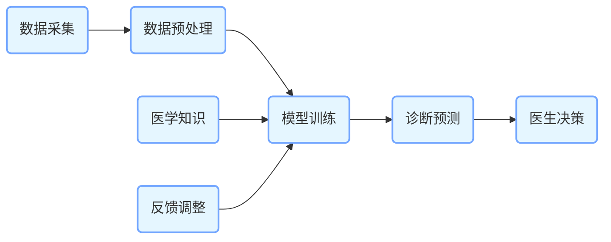

# AI辅助医疗诊断的伦理与技术挑战探讨

> 关键词：AI辅助医疗诊断、伦理挑战、技术挑战、医疗伦理、人工智能技术

> 摘要：本文聚焦于AI辅助医疗诊断这一前沿领域，深入探讨了其在伦理和技术方面所面临的挑战。在伦理层面，分析了数据隐私、责任界定、公平性等问题；在技术层面，研究了算法的可靠性、可解释性等难题。通过对核心概念的阐述、算法原理的分析、数学模型的构建、实际案例的剖析以及相关工具资源的推荐，全面呈现了AI辅助医疗诊断的现状与未来发展趋势，旨在为解决伦理和技术挑战提供思路和参考。

## 1. 背景介绍 
### 1.1 目的和范围
随着人工智能技术的飞速发展，其在医疗领域的应用日益广泛，AI辅助医疗诊断成为了研究和实践的热点。本文章的目的在于深入探讨AI辅助医疗诊断过程中所面临的伦理和技术挑战，全面分析这些挑战的成因、表现形式以及可能带来的影响。范围涵盖了从数据采集到诊断结果输出的整个AI辅助医疗诊断流程，涉及医学、计算机科学、伦理学等多个学科领域。

### 1.2 预期读者
本文预期读者包括医疗行业从业者，如医生、护士、医院管理人员等，他们可以从中了解AI辅助医疗诊断的潜在风险和应对策略，以便更好地应用这一技术；计算机科学和人工智能领域的研究人员和开发者，有助于他们在开发相关算法和系统时考虑伦理和技术因素；伦理学研究者和政策制定者，为他们制定相关伦理准则和政策提供参考依据；此外，对AI辅助医疗诊断感兴趣的普通公众也可以通过本文了解这一领域的基本情况和面临的挑战。

### 1.3 文档结构概述
本文将按照以下结构展开：首先介绍核心概念与联系，阐述AI辅助医疗诊断的基本原理和架构；接着分析核心算法原理和具体操作步骤，并给出Python源代码示例；然后介绍数学模型和公式，通过举例说明其在AI辅助医疗诊断中的应用；之后进行项目实战，包括开发环境搭建、源代码实现和代码解读；再探讨实际应用场景；推荐相关的工具和资源；总结未来发展趋势与挑战；最后设置附录，解答常见问题，并提供扩展阅读和参考资料。

### 1.4 术语表
#### 1.4.1 核心术语定义
- **AI辅助医疗诊断**：指利用人工智能技术，如机器学习、深度学习等，对医疗数据（如医学影像、病历记录等）进行分析和处理，为医生提供诊断建议和决策支持的过程。
- **伦理挑战**：在AI辅助医疗诊断过程中，由于技术应用涉及到人类生命健康、隐私、公平等方面，可能引发的道德和伦理问题。
- **技术挑战**：AI辅助医疗诊断技术在开发和应用过程中面临的技术难题，如算法的准确性、可靠性、可解释性等。
- **数据隐私**：指患者的医疗数据在采集、存储、传输和使用过程中应受到保护，不被非法获取、泄露或滥用的权利。
- **责任界定**：明确在AI辅助医疗诊断出现错误或不良后果时，医生、AI开发者、医疗机构等各方应承担的法律和道德责任。

#### 1.4.2 相关概念解释
- **机器学习**：是人工智能的一个分支，它通过让计算机从数据中学习模式和规律，从而实现对未知数据的预测和分类。在AI辅助医疗诊断中，机器学习算法可以用于分析医学影像、预测疾病风险等。
- **深度学习**：是一种基于人工神经网络的机器学习方法，它具有强大的特征提取和模式识别能力。在医疗领域，深度学习常用于医学影像诊断、疾病预测等任务。
- **可解释性**：指AI模型的决策过程和结果能够被人类理解和解释的程度。在医疗诊断中，可解释性对于医生信任和使用AI辅助诊断结果至关重要。

#### 1.4.3 缩略词列表
- **AI**：Artificial Intelligence，人工智能
- **ML**：Machine Learning，机器学习
- **DL**：Deep Learning，深度学习
- **CNN**：Convolutional Neural Network，卷积神经网络
- **RNN**：Recurrent Neural Network，循环神经网络

## 2. 核心概念与联系 

### 核心概念原理
AI辅助医疗诊断的核心原理是利用人工智能技术对医疗数据进行分析和处理，从而为医生提供诊断建议。其主要步骤包括数据采集、数据预处理、模型训练和诊断预测。

数据采集是指收集各种医疗数据，如医学影像（X光、CT、MRI等）、病历记录、实验室检查结果等。这些数据是AI模型训练的基础。

数据预处理是对采集到的数据进行清洗、转换和特征提取等操作，以提高数据的质量和可用性。例如，对医学影像进行去噪、增强对比度等处理，对病历记录进行文本挖掘和特征提取。

模型训练是使用预处理后的数据对AI模型进行训练，使其学习数据中的模式和规律。常用的AI模型包括机器学习模型（如决策树、支持向量机等）和深度学习模型（如卷积神经网络、循环神经网络等）。

诊断预测是使用训练好的AI模型对新的医疗数据进行分析和预测，给出诊断建议。医生可以根据这些建议进行进一步的诊断和治疗决策。

### 架构示意图


### 各环节联系说明
数据采集是整个流程的起点，为后续的数据预处理和模型训练提供基础。数据预处理的质量直接影响模型训练的效果，经过预处理的数据能够使模型更好地学习到数据中的模式和规律。模型训练是核心环节，通过不断调整模型的参数，使其能够准确地对医疗数据进行分析和预测。诊断预测的结果为医生提供决策支持，但最终的诊断和治疗决策仍由医生根据自己的专业知识和经验做出。医学知识可以作为先验信息融入到模型训练中，提高模型的准确性和可靠性。反馈调整机制可以根据医生的实际诊断结果和患者的治疗情况，对模型进行优化和改进，使模型不断学习和进步。

## 3. 核心算法原理 & 具体操作步骤 

### 核心算法原理
在AI辅助医疗诊断中，深度学习算法中的卷积神经网络（CNN）是一种常用的算法，特别适用于医学影像诊断。CNN的核心原理是通过卷积层、池化层和全连接层等结构，自动提取图像的特征，并进行分类和预测。

卷积层通过卷积核在输入图像上滑动，进行卷积操作，提取图像的局部特征。卷积核是一组可学习的参数，不同的卷积核可以提取不同类型的特征，如边缘、纹理等。

池化层用于对卷积层的输出进行下采样，减少数据的维度，同时保留重要的特征信息。常用的池化方法有最大池化和平均池化。

全连接层将池化层的输出进行扁平化处理，然后通过全连接的方式将特征向量映射到输出层，输出预测结果。

### Python源代码实现
```python
import tensorflow as tf
from tensorflow.keras import layers, models

# 构建CNN模型
def build_cnn_model():
    model = models.Sequential()
    # 第一个卷积层
    model.add(layers.Conv2D(32, (3, 3), activation='relu', input_shape=(150, 150, 3)))
    model.add(layers.MaxPooling2D((2, 2)))
    # 第二个卷积层
    model.add(layers.Conv2D(64, (3, 3), activation='relu'))
    model.add(layers.MaxPooling2D((2, 2)))
    # 第三个卷积层
    model.add(layers.Conv2D(128, (3, 3), activation='relu'))
    model.add(layers.MaxPooling2D((2, 2)))
    # 扁平化处理
    model.add(layers.Flatten())
    # 全连接层
    model.add(layers.Dense(128, activation='relu'))
    # 输出层
    model.add(layers.Dense(1, activation='sigmoid'))

    # 编译模型
    model.compile(optimizer='adam',
                  loss='binary_crossentropy',
                  metrics=['accuracy'])
    return model

# 创建模型实例
model = build_cnn_model()
# 打印模型结构
model.summary()
```

### 具体操作步骤
1. **数据准备**：收集医学影像数据，并将其划分为训练集、验证集和测试集。对数据进行预处理，如调整图像大小、归一化等。
2. **模型构建**：使用上述代码构建CNN模型，根据实际需求调整模型的结构和参数。
3. **模型训练**：使用训练集数据对模型进行训练，设置合适的训练参数，如学习率、批次大小、训练轮数等。在训练过程中，使用验证集数据进行验证，监控模型的性能。
4. **模型评估**：使用测试集数据对训练好的模型进行评估，计算模型的准确率、召回率、F1值等指标，评估模型的性能。
5. **诊断预测**：使用训练好的模型对新的医学影像数据进行诊断预测，输出预测结果。

## 4. 数学模型和公式 & 详细讲解 & 举例说明 

### 卷积操作数学模型
在卷积层中，卷积操作可以用以下数学公式表示：
$$
y_{i,j}^l = \sum_{m=0}^{M - 1} \sum_{n=0}^{N - 1} x_{i + m, j + n}^{l - 1} \cdot w_{m,n}^l + b^l
$$
其中，$y_{i,j}^l$ 表示第 $l$ 层卷积层在位置 $(i, j)$ 处的输出，$x_{i + m, j + n}^{l - 1}$ 表示第 $l - 1$ 层输入在位置 $(i + m, j + n)$ 处的值，$w_{m,n}^l$ 表示第 $l$ 层卷积核在位置 $(m, n)$ 处的权重，$b^l$ 表示第 $l$ 层的偏置，$M$ 和 $N$ 分别表示卷积核的高度和宽度。

### 详细讲解
卷积操作的本质是将卷积核在输入图像上滑动，对每个位置的局部区域进行加权求和，并加上偏置，得到输出特征图。通过不断调整卷积核的权重，模型可以学习到不同的特征模式。

### 举例说明
假设输入图像是一个 $5 \times 5$ 的矩阵：
$$
X = 
\begin{bmatrix}
1 & 2 & 3 & 4 & 5 \\
6 & 7 & 8 & 9 & 10 \\
11 & 12 & 13 & 14 & 15 \\
16 & 17 & 18 & 19 & 20 \\
21 & 22 & 23 & 24 & 25
\end{bmatrix}
$$
卷积核是一个 $3 \times 3$ 的矩阵：
$$
W = 
\begin{bmatrix}
1 & 0 & 1 \\
0 & 1 & 0 \\
1 & 0 & 1
\end{bmatrix}
$$
偏置 $b = 1$。

首先，将卷积核放置在输入图像的左上角，进行卷积操作：
$$
y_{0,0} = (1 \times 1 + 0 \times 2 + 1 \times 3 + 0 \times 6 + 1 \times 7 + 0 \times 8 + 1 \times 11 + 0 \times 12 + 1 \times 13) + 1 = 36
$$
然后，将卷积核向右滑动一个位置，继续进行卷积操作，直到覆盖整个输入图像，得到输出特征图。

### 池化操作数学模型
最大池化操作可以用以下数学公式表示：
$$
y_{i,j}^l = \max_{m = 0}^{M - 1} \max_{n = 0}^{N - 1} x_{i \times s + m, j \times s + n}^{l - 1}
$$
其中，$y_{i,j}^l$ 表示第 $l$ 层池化层在位置 $(i, j)$ 处的输出，$x_{i \times s + m, j \times s + n}^{l - 1}$ 表示第 $l - 1$ 层输入在位置 $(i \times s + m, j \times s + n)$ 处的值，$s$ 表示池化步长，$M$ 和 $N$ 分别表示池化窗口的高度和宽度。

### 详细讲解
最大池化操作的目的是在每个池化窗口内选择最大值作为输出，从而减少数据的维度，同时保留重要的特征信息。池化操作可以提高模型的鲁棒性和计算效率。

### 举例说明
假设输入特征图是一个 $4 \times 4$ 的矩阵：
$$
X = 
\begin{bmatrix}
1 & 2 & 3 & 4 \\
5 & 6 & 7 & 8 \\
9 & 10 & 11 & 12 \\
13 & 14 & 15 & 16
\end{bmatrix}
$$
池化窗口大小为 $2 \times 2$，步长 $s = 2$。

首先，将池化窗口放置在输入特征图的左上角，选择窗口内的最大值：
$$
y_{0,0} = \max(1, 2, 5, 6) = 6
$$
然后，将池化窗口向右滑动 $2$ 个位置，继续选择最大值，直到覆盖整个输入特征图，得到输出特征图：
$$
Y = 
\begin{bmatrix}
6 & 8 \\
14 & 16
\end{bmatrix}
$$

## 5. 项目实战：代码实际案例和详细解释说明 

### 5.1  开发环境搭建
#### 操作系统
建议使用Linux系统，如Ubuntu 18.04或更高版本，也可以使用Windows 10系统。

#### Python环境
安装Python 3.7或更高版本，可以使用Anaconda来管理Python环境。以下是创建和激活虚拟环境的命令：
```bash
# 创建虚拟环境
conda create -n ai_medical python=3.8
# 激活虚拟环境
conda activate ai_medical
```

#### 安装依赖库
在激活的虚拟环境中，使用以下命令安装所需的依赖库：
```bash
pip install tensorflow==2.6.0 numpy pandas matplotlib scikit-learn
```

### 5.2  源代码详细实现和代码解读
```python
import tensorflow as tf
from tensorflow.keras import layers, models
import numpy as np
import pandas as pd
from sklearn.model_selection import train_test_split
from sklearn.preprocessing import StandardScaler

# 加载数据
data = pd.read_csv('medical_data.csv')
X = data.drop('diagnosis', axis=1).values
y = data['diagnosis'].values

# 数据预处理
scaler = StandardScaler()
X = scaler.fit_transform(X)

# 划分训练集和测试集
X_train, X_test, y_train, y_test = train_test_split(X, y, test_size=0.2, random_state=42)

# 构建模型
model = models.Sequential([
    layers.Dense(64, activation='relu', input_shape=(X_train.shape[1],)),
    layers.Dense(32, activation='relu'),
    layers.Dense(1, activation='sigmoid')
])

# 编译模型
model.compile(optimizer='adam',
              loss='binary_crossentropy',
              metrics=['accuracy'])

# 训练模型
history = model.fit(X_train, y_train, epochs=50, batch_size=32, validation_split=0.1)

# 评估模型
test_loss, test_acc = model.evaluate(X_test, y_test)
print(f"Test accuracy: {test_acc}")
```

### 代码解读与分析
1. **数据加载**：使用 `pandas` 库的 `read_csv` 函数加载医疗数据文件 `medical_data.csv`，并将特征数据和标签数据分别存储在 `X` 和 `y` 中。
2. **数据预处理**：使用 `StandardScaler` 对特征数据进行标准化处理，使数据具有零均值和单位方差，有助于提高模型的训练效果。
3. **数据集划分**：使用 `train_test_split` 函数将数据集划分为训练集和测试集，其中测试集占比为 $20\%$。
4. **模型构建**：使用 `Sequential` 模型构建一个简单的全连接神经网络，包含两个隐藏层和一个输出层。隐藏层使用 `ReLU` 激活函数，输出层使用 `sigmoid` 激活函数，适用于二分类问题。
5. **模型编译**：使用 `adam` 优化器、`binary_crossentropy` 损失函数和 `accuracy` 指标对模型进行编译。
6. **模型训练**：使用 `fit` 函数对模型进行训练，设置训练轮数为 $50$，批次大小为 $32$，并使用 $10\%$ 的训练数据作为验证集。
7. **模型评估**：使用 `evaluate` 函数对训练好的模型在测试集上进行评估，输出测试集的准确率。

## 6. 实际应用场景 
### 医学影像诊断
AI辅助医疗诊断在医学影像诊断领域有着广泛的应用。例如，在肺癌诊断中，AI系统可以对胸部CT图像进行分析，自动检测肺部的结节，并判断结节的良恶性。通过对大量的CT图像进行学习和训练，AI模型可以识别出结节的特征，如大小、形状、密度等，并根据这些特征进行分类和预测。医生可以根据AI系统的诊断结果，进行进一步的检查和治疗决策，提高肺癌的早期诊断率和治疗效果。

### 疾病预测和风险评估
AI可以通过分析患者的病历记录、基因数据、生活习惯等多源数据，对疾病的发生风险进行预测和评估。例如，在心血管疾病预测中，AI系统可以根据患者的年龄、性别、血压、血脂、血糖等指标，预测患者未来发生心血管疾病的概率。医生可以根据预测结果，为患者制定个性化的预防和治疗方案，降低心血管疾病的发生率。

### 智能问诊
AI辅助医疗诊断还可以应用于智能问诊系统。患者可以通过语音或文字的方式向智能问诊系统描述自己的症状，系统可以根据患者的描述，结合医学知识和病例数据，给出可能的疾病诊断和建议。智能问诊系统可以为患者提供初步的诊断和咨询服务，缓解医疗资源紧张的问题，同时也可以提高患者的就医效率。

### 药物研发
在药物研发过程中，AI可以帮助筛选药物靶点、预测药物疗效和安全性。通过对大量的生物数据和化学数据进行分析和挖掘，AI模型可以发现潜在的药物靶点，并预测药物与靶点的相互作用。此外，AI还可以对药物的临床试验数据进行分析，预测药物的疗效和安全性，为药物研发提供决策支持，缩短药物研发周期，降低研发成本。

## 7. 工具和资源推荐
### 7.1 学习资源推荐
#### 7.1.1 书籍推荐
- 《深度学习》（Deep Learning）：由Ian Goodfellow、Yoshua Bengio和Aaron Courville所著，是深度学习领域的经典教材，全面介绍了深度学习的基本原理、算法和应用。
- 《Python机器学习》（Python Machine Learning）：Sebastian Raschka所著，详细介绍了使用Python进行机器学习的方法和技巧，包括数据预处理、模型选择、评估等内容。
- 《医学人工智能》（Artificial Intelligence in Medicine）：涵盖了AI在医学领域的各个方面，包括诊断、治疗、研究等，是了解AI辅助医疗诊断的重要参考书籍。

#### 7.1.2 在线课程
- Coursera上的“深度学习专项课程”（Deep Learning Specialization）：由Andrew Ng教授授课，包括神经网络和深度学习、改善深层神经网络、结构化机器学习项目等多个课程，是学习深度学习的优质课程。
- edX上的“人工智能基础”（Fundamentals of Artificial Intelligence）：介绍了人工智能的基本概念、算法和应用，适合初学者入门。
- Kaggle上的“医疗数据科学”（Medical Data Science）：提供了大量的医疗数据分析和机器学习实践案例，通过实际操作来学习AI在医疗领域的应用。

#### 7.1.3 技术博客和网站
- Towards Data Science：是一个专注于数据科学和机器学习的技术博客平台，上面有很多关于AI辅助医疗诊断的文章和案例分享。
- MedRxiv：是一个预印本服务器，提供了最新的医学研究成果，包括AI在医疗领域的应用研究。
- arXiv：是一个广泛使用的学术预印本平台，包含了大量的计算机科学和人工智能领域的研究论文，其中有很多关于AI辅助医疗诊断的前沿研究。

### 7.2 开发工具框架推荐
#### 7.2.1 IDE和编辑器
- PyCharm：是一款专门为Python开发设计的集成开发环境，具有强大的代码编辑、调试、代码分析等功能，适合开发AI辅助医疗诊断项目。
- Jupyter Notebook：是一个交互式的开发环境，支持Python、R等多种编程语言，方便进行数据探索、模型训练和结果可视化。
- Visual Studio Code：是一款轻量级的代码编辑器，具有丰富的插件和扩展功能，支持多种编程语言，可用于开发和调试AI辅助医疗诊断代码。

#### 7.2.2 调试和性能分析工具
- TensorBoard：是TensorFlow的可视化工具，可以用于监控模型的训练过程，如损失函数、准确率等指标的变化，还可以可视化模型的结构和参数分布。
- PyTorch Profiler：是PyTorch的性能分析工具，可以帮助开发者分析模型的性能瓶颈，如计算时间、内存占用等，从而优化模型的性能。
- cProfile：是Python的内置性能分析工具，可以分析Python代码的执行时间和函数调用情况，帮助开发者找出代码中的性能问题。

#### 7.2.3 相关框架和库
- TensorFlow：是Google开发的开源深度学习框架，具有丰富的工具和库，支持多种深度学习模型的构建和训练，广泛应用于AI辅助医疗诊断领域。
- PyTorch：是Facebook开发的开源深度学习框架，具有动态图机制，易于使用和调试，在学术界和工业界都有广泛的应用。
- Scikit-learn：是一个简单易用的机器学习库，提供了丰富的机器学习算法和工具，如分类、回归、聚类等，可用于医疗数据的分析和处理。

### 7.3 相关论文著作推荐
#### 7.3.1 经典论文
- "Deep Residual Learning for Image Recognition"：提出了残差网络（ResNet）的概念，解决了深度神经网络训练过程中的梯度消失问题，在图像识别领域取得了巨大的成功，对AI辅助医疗诊断中的医学影像分析有重要的影响。
- "Generative Adversarial Nets"：介绍了生成对抗网络（GAN）的原理和应用，GAN在医学图像生成、数据增强等方面有广泛的应用前景。
- "Attention Is All You Need"：提出了Transformer模型，该模型在自然语言处理领域取得了巨大的突破，也可以应用于医疗文本分析和智能问诊等方面。

#### 7.3.2 最新研究成果
- 关注顶级学术会议，如NeurIPS（神经信息处理系统大会）、ICML（国际机器学习会议）、CVPR（计算机视觉与模式识别会议）等，这些会议上会发布很多关于AI辅助医疗诊断的最新研究成果。
- 查阅医学和计算机科学领域的顶级期刊，如Nature Medicine、Journal of the American Medical Informatics Association等，了解AI在医疗领域的前沿研究。

#### 7.3.3 应用案例分析
- 一些知名的医疗机构和研究机构会发布AI辅助医疗诊断的应用案例，如斯坦福大学医学中心、麻省理工学院计算机科学与人工智能实验室等。可以通过他们的官方网站或学术论文了解这些案例的具体实现和应用效果。

## 8. 总结：未来发展趋势与挑战
### 未来发展趋势
#### 多模态数据融合
未来，AI辅助医疗诊断将不仅仅依赖于单一类型的数据，如医学影像或病历记录，而是会融合多模态数据，如医学影像、基因数据、生理信号等。通过综合分析多模态数据，可以更全面地了解患者的病情，提高诊断的准确性和可靠性。

#### 个性化医疗
随着基因测序技术的发展和成本的降低，AI将能够根据患者的基因信息、生活习惯、疾病史等因素，为患者提供个性化的医疗诊断和治疗方案。个性化医疗可以提高治疗效果，减少不良反应，是未来医疗发展的重要方向。

#### 边缘计算和物联网
边缘计算和物联网技术的发展将使AI辅助医疗诊断更加便捷和高效。通过在医疗设备上集成AI算法，如可穿戴设备、智能医疗传感器等，可以实时采集和分析患者的生理数据，并及时给出诊断建议。同时，边缘计算可以减少数据传输的延迟和带宽需求，提高系统的响应速度。

#### 与人类医生的协作
AI辅助医疗诊断不会取代人类医生，而是会与人类医生形成协作关系。AI系统可以为医生提供诊断建议和决策支持，帮助医生提高工作效率和诊断准确性。医生则可以利用自己的专业知识和经验，对AI系统的诊断结果进行评估和验证，做出最终的诊断和治疗决策。

### 挑战
#### 伦理挑战
- **数据隐私和安全**：AI辅助医疗诊断需要大量的患者医疗数据，这些数据包含了患者的个人隐私信息。如何保护患者的数据隐私和安全，防止数据泄露和滥用，是一个重要的伦理问题。
- **责任界定**：当AI辅助医疗诊断出现错误或不良后果时，如何明确医生、AI开发者、医疗机构等各方的责任，是一个亟待解决的问题。目前，相关的法律法规还不完善，需要进一步制定和完善。
- **公平性和可及性**：AI辅助医疗诊断技术的应用可能会加剧医疗资源的不均衡分配，导致一些地区和人群无法享受到先进的医疗诊断服务。如何确保AI辅助医疗诊断技术的公平性和可及性，是一个需要关注的伦理问题。

#### 技术挑战
- **算法的可靠性和可解释性**：目前，AI算法在医疗诊断中的可靠性还存在一定的问题，可能会出现误诊和漏诊的情况。此外，很多AI算法是黑盒模型，其决策过程和结果难以被人类理解和解释，这给医生的信任和使用带来了困难。
- **数据质量和标注**：AI模型的训练需要大量高质量的医疗数据，并且这些数据需要进行准确的标注。然而，医疗数据的质量往往参差不齐，标注工作也非常繁琐和困难，这会影响AI模型的训练效果和性能。
- **模型的泛化能力**：AI模型在训练数据上可能表现良好，但在实际应用中，由于数据分布的差异和环境的变化，模型的泛化能力可能会受到影响，导致诊断结果不准确。

## 9. 附录：常见问题与解答
### 问题1：AI辅助医疗诊断会取代人类医生吗？
解答：不会。虽然AI辅助医疗诊断可以提供诊断建议和决策支持，但人类医生具有丰富的专业知识、临床经验和人文关怀能力。在医疗诊断过程中，医生需要综合考虑患者的症状、病史、心理状态等多方面因素，做出最终的诊断和治疗决策。AI辅助医疗诊断只是医生的辅助工具，不能取代人类医生。

### 问题2：如何确保AI辅助医疗诊断的准确性？
解答：可以从以下几个方面确保AI辅助医疗诊断的准确性：
- **数据质量**：收集高质量的医疗数据，并进行准确的标注。数据的质量直接影响AI模型的训练效果和性能。
- **模型选择和优化**：选择合适的AI模型，并对模型进行优化和调整。可以使用交叉验证、正则化等方法提高模型的泛化能力。
- **模型评估和验证**：使用独立的测试集对训练好的模型进行评估和验证，确保模型在实际应用中的准确性。
- **与人类医生的协作**：将AI辅助诊断结果与人类医生的专业判断相结合，提高诊断的准确性。

### 问题3：AI辅助医疗诊断的伦理问题如何解决？
解答：解决AI辅助医疗诊断的伦理问题需要多方面的努力：
- **法律法规**：制定和完善相关的法律法规，明确数据隐私保护、责任界定等方面的规定，为AI辅助医疗诊断的应用提供法律保障。
- **伦理准则**：制定行业伦理准则，规范AI辅助医疗诊断的开发和应用，引导开发者和使用者遵守伦理规范。
- **教育和培训**：加强对医疗从业者、AI开发者和公众的伦理教育和培训，提高他们的伦理意识和责任感。
- **监督和评估**：建立监督和评估机制，对AI辅助医疗诊断系统的开发和应用进行监督和评估，确保其符合伦理要求。

### 问题4：AI辅助医疗诊断需要哪些数据？
解答：AI辅助医疗诊断需要多种类型的数据，包括：
- **医学影像数据**：如X光、CT、MRI等，用于疾病的影像诊断。
- **病历记录**：包含患者的基本信息、症状、病史、诊断结果等，用于疾病的诊断和预测。
- **实验室检查结果**：如血液检查、尿液检查等，用于辅助诊断和疾病监测。
- **基因数据**：用于了解患者的基因信息，为个性化医疗提供依据。
- **生理信号数据**：如心电图、脑电图等，用于监测患者的生理状态。

## 10. 扩展阅读 & 参考资料
### 扩展阅读
- 《医疗大数据与人工智能》：深入探讨了医疗大数据和人工智能在医疗领域的应用和发展，包括数据挖掘、机器学习、深度学习等技术在医疗诊断、治疗、管理等方面的应用。
- 《人工智能时代的医疗革命》：介绍了AI在医疗领域的最新进展和应用案例，以及AI对医疗行业的变革和影响。
- 《医学伦理与法律》：涵盖了医学伦理和法律的基本概念、原则和案例，有助于深入理解AI辅助医疗诊断中的伦理和法律问题。

### 参考资料
- 相关学术论文和研究报告，如在IEEE Transactions on Biomedical Engineering、Journal of Medical Internet Research等期刊上发表的论文。
- 国际组织和机构发布的报告和指南，如世界卫生组织（WHO）、国际标准化组织（ISO）等发布的关于AI在医疗领域应用的相关文件。
- 知名科技公司和研究机构的官方网站，如Google、Microsoft、IBM等公司的AI研究成果和应用案例。

作者：AI天才研究院/AI Genius Institute & 禅与计算机程序设计艺术 /Zen And The Art of Computer Programming