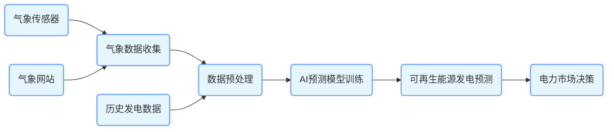

# AI辅助可再生能源发电预测：从气象数据到电力市场

> 关键词：AI、可再生能源发电预测、气象数据、电力市场、机器学习算法

> 摘要：本文聚焦于AI在可再生能源发电预测中的应用，深入探讨了如何从气象数据出发，将预测结果应用到电力市场中。首先介绍了相关背景，包括目的范围、预期读者等；接着阐述了核心概念及联系，详细讲解了核心算法原理和具体操作步骤，给出了数学模型和公式；通过项目实战展示了代码实现和分析；分析了实际应用场景；推荐了学习、开发工具和相关论文著作；最后总结了未来发展趋势与挑战，并提供常见问题解答和扩展阅读参考资料，旨在为相关领域的研究和实践提供全面且深入的指导。

## 1. 背景介绍 
### 1.1 目的和范围
随着全球对可持续能源的需求不断增长，可再生能源如太阳能、风能等在电力供应中所占的比例越来越大。然而，可再生能源的发电具有间歇性和不确定性，这给电力系统的稳定运行和电力市场的有效管理带来了挑战。本文章的目的在于探讨如何利用人工智能技术，结合气象数据，对可再生能源的发电量进行准确预测，并将预测结果应用于电力市场，以提高电力系统的可靠性和电力市场的效率。

文章的范围涵盖了从气象数据的收集和处理，到利用AI算法进行发电预测的整个过程，以及将预测结果应用于电力市场的策略和方法。同时，文章还会介绍相关的数学模型、实际应用案例、工具和资源推荐等内容。

### 1.2 预期读者
本文的预期读者包括从事可再生能源发电、电力系统运行、电力市场研究的工程师、科研人员和管理人员，以及对人工智能在能源领域应用感兴趣的学生和爱好者。对于有一定编程基础和机器学习知识的读者，能够更好地理解文章中的代码实现和算法原理；而对于没有编程经验的读者，也可以通过文章了解相关的技术概念和应用场景。

### 1.3 文档结构概述
本文将按照以下结构进行组织：
- 核心概念与联系：介绍可再生能源发电预测、气象数据和电力市场的相关概念，以及它们之间的联系。
- 核心算法原理 & 具体操作步骤：详细讲解用于可再生能源发电预测的AI算法原理，并给出具体的操作步骤和Python代码实现。
- 数学模型和公式 & 详细讲解 & 举例说明：介绍相关的数学模型和公式，并通过具体例子进行详细讲解。
- 项目实战：代码实际案例和详细解释说明：通过一个实际的项目案例，展示如何利用AI技术进行可再生能源发电预测，并对代码进行详细解释。
- 实际应用场景：分析AI辅助可再生能源发电预测在电力系统运行和电力市场中的实际应用场景。
- 工具和资源推荐：推荐相关的学习资源、开发工具和论文著作。
- 总结：未来发展趋势与挑战：总结AI辅助可再生能源发电预测的未来发展趋势和面临的挑战。
- 附录：常见问题与解答：提供常见问题的解答。
- 扩展阅读 & 参考资料：提供扩展阅读的建议和参考资料。

### 1.4 术语表
#### 1.4.1 核心术语定义
- **可再生能源发电预测**：利用各种技术和方法，对可再生能源（如太阳能、风能等）的发电量进行提前预测。
- **气象数据**：与气象相关的数据，如温度、湿度、风速、光照强度等，这些数据对可再生能源的发电具有重要影响。
- **电力市场**：电力的生产、传输、销售和消费的市场体系，包括发电企业、输电企业、售电企业和用户等市场主体。
- **人工智能（AI）**：计算机科学的一个分支，旨在使计算机系统能够模拟人类的智能行为，如学习、推理、决策等。
- **机器学习**：人工智能的一个子领域，通过让计算机系统从数据中学习模式和规律，从而实现预测和决策等任务。

#### 1.4.2 相关概念解释
- **时间序列分析**：一种用于分析随时间变化的数据的统计方法，常用于可再生能源发电预测中，以捕捉发电量的时间变化规律。
- **深度学习**：机器学习的一个分支，通过构建多层神经网络，自动从数据中学习复杂的特征和模式，在图像识别、自然语言处理等领域取得了显著的成果。
- **电力系统调度**：根据电力负荷的需求和发电资源的情况，合理安排发电设备的运行，以保证电力系统的安全、稳定和经济运行。

#### 1.4.3 缩略词列表
- **AI**：Artificial Intelligence（人工智能）
- **ML**：Machine Learning（机器学习）
- **DL**：Deep Learning（深度学习）
- **PV**：Photovoltaic（光伏发电）
- **WT**：Wind Turbine（风力发电）

## 2. 核心概念与联系 

### 核心概念原理
可再生能源发电预测是基于对气象数据和历史发电数据的分析，利用人工智能算法建立预测模型，从而对未来的发电量进行预测。气象数据是影响可再生能源发电的关键因素，例如，太阳能发电与光照强度、日照时间等气象因素密切相关，而风力发电则与风速、风向等因素有关。

电力市场则是将发电企业生产的电力进行交易和分配的市场机制。准确的可再生能源发电预测可以为电力市场的参与者提供重要的决策依据，例如，发电企业可以根据预测结果合理安排发电计划，提高发电效率和经济效益；电网企业可以根据预测结果进行电力调度，保证电力系统的稳定运行；电力用户可以根据预测结果合理安排用电计划，降低用电成本。

### 架构的文本示意图
```plaintext
气象数据收集 --> 数据预处理 --> AI预测模型训练 --> 可再生能源发电预测 --> 电力市场决策
    |                                       |
    v                                       v
气象传感器、气象网站等               历史发电数据
```

### Mermaid流程图


## 3. 核心算法原理 & 具体操作步骤 

### 核心算法原理
在可再生能源发电预测中，常用的AI算法包括线性回归、支持向量机、决策树、神经网络等。这里以神经网络中的长短期记忆网络（LSTM）为例进行介绍。

LSTM是一种特殊的循环神经网络（RNN），能够处理序列数据中的长期依赖关系。在可再生能源发电预测中，发电量数据是随时间变化的序列数据，LSTM可以有效地捕捉这种时间序列的特征和规律。

LSTM的核心是细胞状态和门控机制。细胞状态是LSTM的记忆单元，用于存储和传递信息；门控机制包括输入门、遗忘门和输出门，用于控制信息的流入、流出和遗忘。

### 具体操作步骤和Python代码实现

#### 步骤1：数据收集和预处理
首先，需要收集气象数据和历史发电数据，并进行预处理，包括数据清洗、归一化等操作。

```python
import pandas as pd
import numpy as np
from sklearn.preprocessing import MinMaxScaler

# 读取数据
data = pd.read_csv('renewable_energy_data.csv')

# 提取特征和标签
features = data[['temperature', 'humidity', 'wind_speed', 'sunshine_hours']].values
labels = data['power_generation'].values

# 数据归一化
scaler_features = MinMaxScaler()
scaler_labels = MinMaxScaler()
features = scaler_features.fit_transform(features)
labels = scaler_labels.fit_transform(labels.reshape(-1, 1))

# 划分训练集和测试集
train_size = int(len(features) * 0.8)
train_features = features[:train_size]
train_labels = labels[:train_size]
test_features = features[train_size:]
test_labels = labels[train_size:]

# 转换为适合LSTM输入的格式 [样本数, 时间步长, 特征数]
def create_sequences(data, seq_length):
    xs = []
    ys = []
    for i in range(len(data) - seq_length):
        x = data[i:i+seq_length]
        y = data[i+seq_length]
        xs.append(x)
        ys.append(y)
    return np.array(xs), np.array(ys)

seq_length = 10
train_X, train_y = create_sequences(train_features, seq_length)
test_X, test_y = create_sequences(test_features, seq_length)
```

#### 步骤2：构建LSTM模型
使用Keras库构建LSTM模型。

```python
from tensorflow.keras.models import Sequential
from tensorflow.keras.layers import LSTM, Dense

model = Sequential()
model.add(LSTM(50, return_sequences=True, input_shape=(seq_length, train_X.shape[2])))
model.add(LSTM(50, return_sequences=False))
model.add(Dense(25))
model.add(Dense(1))

model.compile(optimizer='adam', loss='mean_squared_error')
```

#### 步骤3：模型训练
使用训练数据对模型进行训练。

```python
model.fit(train_X, train_y, batch_size=32, epochs=50)
```

#### 步骤4：模型预测
使用训练好的模型对测试数据进行预测，并将预测结果反归一化。

```python
predictions = model.predict(test_X)
predictions = scaler_labels.inverse_transform(predictions)
test_y = scaler_labels.inverse_transform(test_y)
```

## 4. 数学模型和公式 & 详细讲解 & 举例说明 

### LSTM的数学模型和公式
LSTM的核心公式如下：

#### 遗忘门
$$f_t = \sigma(W_f[h_{t-1}, x_t] + b_f)$$

其中，$f_t$ 是遗忘门的输出，$\sigma$ 是sigmoid函数，$W_f$ 是遗忘门的权重矩阵，$h_{t-1}$ 是上一个时间步的隐藏状态，$x_t$ 是当前时间步的输入，$b_f$ 是遗忘门的偏置项。遗忘门的作用是决定上一个时间步的细胞状态 $C_{t-1}$ 中有多少信息需要被遗忘。

#### 输入门
$$i_t = \sigma(W_i[h_{t-1}, x_t] + b_i)$$
$$\tilde{C}_t = \tanh(W_C[h_{t-1}, x_t] + b_C)$$

其中，$i_t$ 是输入门的输出，$\tilde{C}_t$ 是候选细胞状态，$W_i$ 和 $W_C$ 分别是输入门和候选细胞状态的权重矩阵，$b_i$ 和 $b_C$ 分别是输入门和候选细胞状态的偏置项。输入门的作用是决定当前时间步的输入 $x_t$ 中有多少信息需要被加入到细胞状态中。

#### 细胞状态更新
$$C_t = f_t \odot C_{t-1} + i_t \odot \tilde{C}_t$$

其中，$\odot$ 是元素级乘法。细胞状态更新公式表示，新的细胞状态 $C_t$ 是上一个时间步的细胞状态 $C_{t-1}$ 经过遗忘门过滤后，再加上当前时间步的输入经过输入门过滤后的候选细胞状态 $\tilde{C}_t$。

#### 输出门
$$o_t = \sigma(W_o[h_{t-1}, x_t] + b_o)$$
$$h_t = o_t \odot \tanh(C_t)$$

其中，$o_t$ 是输出门的输出，$W_o$ 是输出门的权重矩阵，$b_o$ 是输出门的偏置项。输出门的作用是决定当前时间步的细胞状态 $C_t$ 中有多少信息需要被输出到隐藏状态 $h_t$ 中。

### 详细讲解
遗忘门的输出 $f_t$ 是一个介于0和1之间的向量，它的每个元素表示上一个时间步的细胞状态中对应元素需要被遗忘的程度。输入门的输出 $i_t$ 同样是一个介于0和1之间的向量，它的每个元素表示当前时间步的输入中对应元素需要被加入到细胞状态中的程度。候选细胞状态 $\tilde{C}_t$ 是一个经过tanh函数处理的向量，其值介于-1和1之间。

细胞状态更新公式中，元素级乘法 $f_t \odot C_{t-1}$ 表示对上一个时间步的细胞状态进行遗忘操作，$i_t \odot \tilde{C}_t$ 表示将当前时间步的输入信息加入到细胞状态中。输出门的输出 $o_t$ 也是一个介于0和1之间的向量，它控制着细胞状态 $C_t$ 中有多少信息被输出到隐藏状态 $h_t$ 中。

### 举例说明
假设我们有一个简单的LSTM单元，输入 $x_t$ 是一个长度为3的向量，上一个时间步的隐藏状态 $h_{t-1}$ 也是一个长度为3的向量。遗忘门的权重矩阵 $W_f$ 是一个 $3 \times 6$ 的矩阵（因为 $[h_{t-1}, x_t]$ 的长度为6），偏置项 $b_f$ 是一个长度为3的向量。

首先，计算 $[h_{t-1}, x_t]$ 的拼接向量，然后将其与 $W_f$ 相乘并加上 $b_f$，再通过sigmoid函数得到遗忘门的输出 $f_t$。假设 $f_t = [0.2, 0.8, 0.5]$，上一个时间步的细胞状态 $C_{t-1} = [1, 2, 3]$，则经过遗忘操作后，$f_t \odot C_{t-1} = [0.2 \times 1, 0.8 \times 2, 0.5 \times 3] = [0.2, 1.6, 1.5]$。

接着，计算输入门的输出 $i_t$ 和候选细胞状态 $\tilde{C}_t$，假设 $i_t = [0.7, 0.3, 0.9]$，$\tilde{C}_t = [0.5, -0.2, 0.8]$，则 $i_t \odot \tilde{C}_t = [0.7 \times 0.5, 0.3 \times (-0.2), 0.9 \times 0.8] = [0.35, -0.06, 0.72]$。

最后，更新细胞状态 $C_t = f_t \odot C_{t-1} + i_t \odot \tilde{C}_t = [0.2 + 0.35, 1.6 - 0.06, 1.5 + 0.72] = [0.55, 1.54, 2.22]$。

## 5. 项目实战：代码实际案例和详细解释说明 

### 5.1  开发环境搭建
为了实现可再生能源发电预测的项目，我们需要搭建以下开发环境：

- **操作系统**：可以选择Windows、Linux或macOS。
- **Python环境**：建议使用Python 3.7及以上版本。可以通过Anaconda或Miniconda来管理Python环境。
- **相关库**：需要安装以下Python库：
  - `pandas`：用于数据处理和分析。
  - `numpy`：用于数值计算。
  - `scikit-learn`：用于数据预处理和模型评估。
  - `tensorflow` 或 `pytorch`：用于构建和训练深度学习模型。这里我们使用`tensorflow`。

可以使用以下命令来安装这些库：

```bash
pip install pandas numpy scikit-learn tensorflow
```

### 5.2  源代码详细实现和代码解读
以下是一个完整的可再生能源发电预测项目的源代码，结合了前面介绍的步骤：

```python
import pandas as pd
import numpy as np
from sklearn.preprocessing import MinMaxScaler
from tensorflow.keras.models import Sequential
from tensorflow.keras.layers import LSTM, Dense

# 步骤1：数据收集和预处理
# 读取数据
data = pd.read_csv('renewable_energy_data.csv')

# 提取特征和标签
features = data[['temperature', 'humidity', 'wind_speed', 'sunshine_hours']].values
labels = data['power_generation'].values

# 数据归一化
scaler_features = MinMaxScaler()
scaler_labels = MinMaxScaler()
features = scaler_features.fit_transform(features)
labels = scaler_labels.fit_transform(labels.reshape(-1, 1))

# 划分训练集和测试集
train_size = int(len(features) * 0.8)
train_features = features[:train_size]
train_labels = labels[:train_size]
test_features = features[train_size:]
test_labels = labels[train_size:]

# 转换为适合LSTM输入的格式 [样本数, 时间步长, 特征数]
def create_sequences(data, seq_length):
    xs = []
    ys = []
    for i in range(len(data) - seq_length):
        x = data[i:i+seq_length]
        y = data[i+seq_length]
        xs.append(x)
        ys.append(y)
    return np.array(xs), np.array(ys)

seq_length = 10
train_X, train_y = create_sequences(train_features, seq_length)
test_X, test_y = create_sequences(test_features, seq_length)

# 步骤2：构建LSTM模型
model = Sequential()
model.add(LSTM(50, return_sequences=True, input_shape=(seq_length, train_X.shape[2])))
model.add(LSTM(50, return_sequences=False))
model.add(Dense(25))
model.add(Dense(1))

model.compile(optimizer='adam', loss='mean_squared_error')

# 步骤3：模型训练
model.fit(train_X, train_y, batch_size=32, epochs=50)

# 步骤4：模型预测
predictions = model.predict(test_X)
predictions = scaler_labels.inverse_transform(predictions)
test_y = scaler_labels.inverse_transform(test_y)

# 步骤5：模型评估
from sklearn.metrics import mean_squared_error, mean_absolute_error

mse = mean_squared_error(test_y, predictions)
mae = mean_absolute_error(test_y, predictions)
print(f"Mean Squared Error: {mse}")
print(f"Mean Absolute Error: {mae}")
```

### 代码解读与分析
- **数据收集和预处理**：
  - 使用`pandas`库读取CSV文件中的数据。
  - 提取特征和标签，并使用`MinMaxScaler`进行归一化处理，将数据缩放到0到1的范围内。
  - 划分训练集和测试集，比例为8:2。
  - 定义`create_sequences`函数，将数据转换为适合LSTM输入的三维格式`[样本数, 时间步长, 特征数]`。

- **构建LSTM模型**：
  - 使用`Sequential`模型构建一个简单的LSTM模型。
  - 添加两个LSTM层，第一个LSTM层的`return_sequences=True`表示返回每个时间步的输出，第二个LSTM层的`return_sequences=False`表示只返回最后一个时间步的输出。
  - 添加两个全连接层，最后一个全连接层的输出维度为1，表示预测的发电量。
  - 使用`adam`优化器和均方误差损失函数进行模型编译。

- **模型训练**：
  - 使用`fit`方法对模型进行训练，设置批量大小为32，训练轮数为50。

- **模型预测**：
  - 使用训练好的模型对测试数据进行预测，并将预测结果反归一化。

- **模型评估**：
  - 使用`mean_squared_error`和`mean_absolute_error`函数计算预测结果的均方误差和平均绝对误差，评估模型的性能。

## 6. 实际应用场景 
### 发电企业
- **发电计划安排**：发电企业可以根据AI预测的可再生能源发电量，合理安排发电设备的运行计划。例如，如果预测到未来几天太阳能发电量较高，可以适当减少其他传统能源的发电，降低发电成本。
- **电力交易策略制定**：在电力市场中，发电企业可以根据预测结果制定合理的电力交易策略。如果预测到发电量将大幅增加，可以提前在市场上出售多余的电力，获取更高的收益。

### 电网企业
- **电力调度**：电网企业可以根据可再生能源发电预测结果，合理安排电力调度，保证电力系统的稳定运行。例如，当预测到风力发电将大幅增加时，可以提前调整其他电源的输出，避免电力过剩或不足。
- **电网规划**：长期的可再生能源发电预测可以为电网规划提供重要依据。电网企业可以根据预测结果，合理规划电网的建设和改造，提高电网对可再生能源的接纳能力。

### 电力用户
- **用电计划安排**：电力用户可以根据可再生能源发电预测结果，合理安排用电计划。例如，在太阳能发电量较高的时段，增加一些高耗能设备的使用，降低用电成本。
- **需求响应**：参与需求响应项目的电力用户可以根据预测结果，在可再生能源发电量不足时减少用电，在发电量充足时增加用电，获得相应的经济补偿。

## 7. 工具和资源推荐
### 7.1 学习资源推荐
#### 7.1.1 书籍推荐
- 《Python机器学习》：介绍了Python在机器学习中的应用，包括数据预处理、模型选择、评估等方面的内容。
- 《深度学习》：由深度学习领域的三位顶尖专家编写，系统地介绍了深度学习的理论和实践。
- 《可再生能源发电预测技术》：专门介绍了可再生能源发电预测的相关技术和方法。

#### 7.1.2 在线课程
- Coursera上的“机器学习”课程：由斯坦福大学的Andrew Ng教授授课，是机器学习领域的经典课程。
- edX上的“深度学习”课程：提供了深度学习的基础理论和实践操作的教学。
- 中国大学MOOC上的“可再生能源发电技术”课程：介绍了可再生能源发电的原理、技术和应用。

#### 7.1.3 技术博客和网站
- Medium：有很多关于人工智能和可再生能源的技术博客文章。
- arXiv：提供了最新的学术研究论文，包括可再生能源发电预测和人工智能领域的研究。
- IEEE Xplore：电气和电子工程师协会的数字图书馆，包含了大量的学术论文和技术报告。

### 7.2 开发工具框架推荐
#### 7.2.1 IDE和编辑器
- PyCharm：一款专业的Python集成开发环境，提供了代码编辑、调试、版本控制等功能。
- Jupyter Notebook：一个交互式的开发环境，适合进行数据分析和模型实验。
- Visual Studio Code：一款轻量级的代码编辑器，支持多种编程语言和插件扩展。

#### 7.2.2 调试和性能分析工具
- TensorBoard：TensorFlow的可视化工具，可以用于查看模型的训练过程、损失函数曲线等信息。
- PyTorch Profiler：PyTorch的性能分析工具，可以帮助用户分析模型的性能瓶颈。
- Scikit-learn的`GridSearchCV`和`RandomizedSearchCV`：用于模型参数调优的工具。

#### 7.2.3 相关框架和库
- TensorFlow：一个开源的深度学习框架，提供了丰富的工具和接口，用于构建和训练深度学习模型。
- PyTorch：另一个流行的深度学习框架，具有动态图的优势，适合快速开发和实验。
- Scikit-learn：一个用于机器学习的Python库，提供了数据预处理、模型选择、评估等功能。

### 7.3 相关论文著作推荐
#### 7.3.1 经典论文
- Hochreiter, S., & Schmidhuber, J. (1997). Long short-term memory. Neural computation, 9(8), 1735-1780.：介绍了长短期记忆网络（LSTM）的原理和应用。
- Bishop, C. M. (2006). Pattern recognition and machine learning. Springer.：机器学习领域的经典著作，系统地介绍了机器学习的理论和方法。

#### 7.3.2 最新研究成果
- 在IEEE Transactions on Power Systems、Renewable Energy等期刊上可以找到关于可再生能源发电预测的最新研究成果。

#### 7.3.3 应用案例分析
- 一些国际知名的能源公司和研究机构会发布关于可再生能源发电预测在实际应用中的案例分析报告，可以通过他们的官方网站获取相关信息。

## 8. 总结：未来发展趋势与挑战
### 未来发展趋势
- **多源数据融合**：除了气象数据和历史发电数据，未来可能会融合更多的数据源，如卫星图像、地理信息数据等，以提高发电预测的准确性。
- **深度学习模型的优化**：不断改进和优化深度学习模型，如采用更复杂的网络结构、引入注意力机制等，以更好地捕捉可再生能源发电的复杂特征和规律。
- **与电力市场的深度融合**：将发电预测结果更深入地应用于电力市场，实现发电、输电、用电的协同优化，提高电力系统的整体效率和经济效益。
- **分布式预测系统**：随着可再生能源发电的分布式发展，未来可能会构建分布式的发电预测系统，提高预测的实时性和可靠性。

### 挑战
- **数据质量和可用性**：气象数据和发电数据的质量和可用性可能会受到多种因素的影响，如传感器故障、数据传输中断等，这会影响发电预测的准确性。
- **模型的可解释性**：深度学习模型通常是黑盒模型，其决策过程难以解释，这在实际应用中可能会带来一些问题，如监管要求、用户信任等。
- **不确定性处理**：可再生能源发电本身具有不确定性，如何有效地处理这种不确定性，提高预测的可靠性，是一个亟待解决的问题。
- **技术人才短缺**：AI辅助可再生能源发电预测需要具备人工智能、能源工程等多领域知识的技术人才，目前这类人才相对短缺。

## 9. 附录：常见问题与解答
### 问题1：如何选择合适的AI算法进行可再生能源发电预测？
答：选择合适的AI算法需要考虑多个因素，如数据的特点（时间序列数据、结构化数据等）、预测的精度要求、计算资源等。对于时间序列数据，LSTM、GRU等循环神经网络通常表现较好；对于结构化数据，线性回归、支持向量机等传统机器学习算法也可以取得不错的效果。可以通过实验比较不同算法的性能，选择最优的算法。

### 问题2：数据归一化的作用是什么？
答：数据归一化的作用是将不同特征的数据缩放到相同的尺度范围内，避免某些特征因为数值范围较大而对模型的训练产生过大的影响。常见的数据归一化方法有MinMaxScaler和StandardScaler。

### 问题3：如何评估可再生能源发电预测模型的性能？
答：常用的评估指标包括均方误差（MSE）、平均绝对误差（MAE）、均方根误差（RMSE）等。这些指标可以衡量预测值与真实值之间的差异，数值越小表示模型的性能越好。

### 问题4：模型训练过程中出现过拟合怎么办？
答：过拟合是指模型在训练集上表现很好，但在测试集上表现较差的现象。可以采取以下措施来解决过拟合问题：
- 增加训练数据：更多的数据可以帮助模型学习到更广泛的特征和规律，减少过拟合的风险。
- 正则化：在模型的损失函数中添加正则化项，如L1和L2正则化，限制模型的复杂度。
- 早停策略：在模型训练过程中，当验证集的性能不再提升时，提前停止训练，避免模型过度拟合训练数据。

## 10. 扩展阅读 & 参考资料
### 扩展阅读
- 《智能电网技术》：介绍了智能电网的相关技术和应用，包括可再生能源的接入和管理。
- 《能源大数据分析与应用》：探讨了大数据技术在能源领域的应用，包括可再生能源发电预测。

### 参考资料
- 相关的学术论文和研究报告，可以通过IEEE Xplore、ACM Digital Library等数据库获取。
- 能源公司和研究机构的官方网站，如国家电网、南方电网、中国电力科学研究院等。

作者：AI天才研究院/AI Genius Institute & 禅与计算机程序设计艺术 /Zen And The Art of Computer Programming