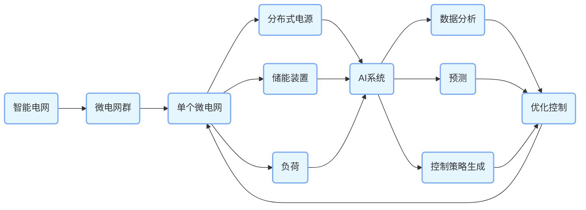

# AI辅助可再生能源系统集成：从微电网到智能电网

> 关键词：AI，可再生能源系统集成，微电网，智能电网，能源管理

> 摘要：本文深入探讨了AI在可再生能源系统集成中的应用，从微电网逐步过渡到智能电网。首先介绍了相关背景，包括目的、预期读者、文档结构和术语表。接着阐述了核心概念与联系，通过文本示意图和Mermaid流程图展示其原理和架构。详细讲解了核心算法原理，并用Python代码进行说明。引入了数学模型和公式，并举例解释。通过项目实战，展示了代码实际案例及详细解读。分析了实际应用场景，推荐了学习、开发工具和相关论文著作。最后总结了未来发展趋势与挑战，提供常见问题解答和扩展阅读参考资料，旨在为相关领域的研究者和从业者提供全面而深入的技术指导。

## 1. 背景介绍 
### 1.1 目的和范围
随着全球对环境保护和可持续发展的关注度不断提高，可再生能源的开发和利用成为了能源领域的重要发展方向。然而，可再生能源具有间歇性和波动性的特点，这给其大规模接入电网带来了挑战。本文章的目的在于探讨如何利用人工智能（AI）技术来辅助可再生能源系统的集成，从相对小型的微电网逐步拓展到大型的智能电网，以提高能源系统的稳定性、可靠性和效率。文章将涵盖AI在可再生能源系统集成中的核心概念、算法原理、数学模型、实际应用案例等方面的内容。

### 1.2 预期读者
本文预期读者包括从事可再生能源、电力系统、人工智能等领域的研究人员、工程师、技术爱好者，以及相关专业的高校师生。对于希望了解AI如何助力可再生能源系统集成，以及如何从微电网过渡到智能电网的读者来说，本文将提供有价值的技术信息和实践指导。

### 1.3 文档结构概述
本文将按照以下结构进行组织：首先介绍相关背景知识，包括目的、预期读者、文档结构和术语表；接着阐述核心概念与联系，通过文本示意图和Mermaid流程图展示其原理和架构；详细讲解核心算法原理，并用Python代码进行说明；引入数学模型和公式，并举例解释；通过项目实战，展示代码实际案例及详细解读；分析实际应用场景；推荐学习、开发工具和相关论文著作；最后总结未来发展趋势与挑战，提供常见问题解答和扩展阅读参考资料。

### 1.4 术语表
#### 1.4.1 核心术语定义
- **可再生能源**：指在自然界中可以不断再生、永续利用的能源，具有取之不尽，用之不竭的特点，主要包括太阳能、风能、水能、生物质能、地热能和海洋能等。
- **微电网**：是一种由分布式电源、储能装置、能量转换装置、相关负荷和监控、保护装置汇集而成的小型发配电系统，是一个能够实现自我控制、保护和管理的自治系统，既可以与外部电网并网运行，也可以孤立运行。
- **智能电网**：是以物理电网为基础，将现代先进的传感测量技术、通信技术、信息技术、计算机技术和控制技术与物理电网高度集成而形成的新型电网。它具有高度的自动化和智能化，能够实现电力系统的优化运行和高效管理。
- **人工智能（AI）**：是研究、开发用于模拟、延伸和扩展人的智能的理论、方法、技术及应用系统的一门新的技术科学。在本文中，主要涉及机器学习、深度学习等AI技术在可再生能源系统集成中的应用。

#### 1.4.2 相关概念解释
- **可再生能源系统集成**：将可再生能源发电设备、储能装置、负荷等进行有机整合，使其能够协调运行，实现可再生能源的高效利用和稳定接入电网的过程。
- **能源管理系统（EMS）**：是一种用于监控、控制和优化能源系统运行的软件系统，通过采集能源系统的运行数据，进行分析和决策，实现能源的合理分配和高效利用。
- **分布式电源（DG）**：指分布在用户侧，就近接入配电网的小型发电装置，如太阳能光伏电站、风力发电机组、小型水电厂等。

#### 1.4.3 缩略词列表
- **AI**：Artificial Intelligence，人工智能
- **EMS**：Energy Management System，能源管理系统
- **DG**：Distributed Generation，分布式电源
- **PV**：Photovoltaic，光伏发电
- **WT**：Wind Turbine，风力发电机

## 2. 核心概念与联系 

### 核心概念原理
在可再生能源系统集成中，从微电网到智能电网的发展是一个逐步演进的过程。微电网作为智能电网的一个组成部分，是实现可再生能源分布式利用的有效方式。微电网通过集成分布式电源、储能装置和负荷，实现了局部区域的能源自给自足和优化调度。

人工智能在这个过程中发挥着关键作用。AI技术可以通过对可再生能源发电数据、负荷数据、电网运行数据等进行分析和预测，实现对微电网和智能电网的优化控制。例如，利用机器学习算法对太阳能光伏发电和风力发电的功率进行预测，提前规划储能装置的充放电策略，以应对可再生能源的间歇性和波动性。

### 架构的文本示意图
```plaintext
            +---------------------+
            |      智能电网       |
            | （大规模、高智能）  |
            +---------------------+
                      |
                      | 包含多个
                      v
            +---------------------+
            |      微电网群       |
            | （多个微电网组成）  |
            +---------------------+
                      |
                      | 包含
                      v
            +---------------------+
            |      单个微电网     |
            | （分布式电源、储能、 |
            |  负荷等组成）      |
            +---------------------+
                      |
                      | 数据交互
                      v
            +---------------------+
            |       AI系统        |
            | （数据分析、预测、  |
            |  控制策略生成）    |
            +---------------------+
```

### Mermaid流程图


该流程图展示了智能电网、微电网、分布式电源、储能装置、负荷和AI系统之间的关系。AI系统通过对分布式电源、储能装置和负荷的数据进行分析、预测，生成控制策略，实现对微电网的优化控制，进而影响整个智能电网的运行。

## 3. 核心算法原理 & 具体操作步骤 

### 可再生能源功率预测算法 - 基于时间序列的机器学习算法
在可再生能源系统集成中，准确预测可再生能源的发电功率是非常重要的。这里我们以基于时间序列的机器学习算法（如长短期记忆网络，LSTM）为例，介绍可再生能源功率预测的核心算法原理和具体操作步骤。

#### 算法原理
长短期记忆网络（LSTM）是一种特殊的循环神经网络（RNN），能够处理序列数据中的长期依赖关系。在可再生能源功率预测中，我们可以将历史的发电功率数据作为输入序列，通过LSTM网络学习数据中的时间模式和规律，从而预测未来的发电功率。

#### Python源代码实现
```python
import numpy as np
import pandas as pd
from sklearn.preprocessing import MinMaxScaler
from tensorflow.keras.models import Sequential
from tensorflow.keras.layers import LSTM, Dense

# 数据准备
def prepare_data(data, n_steps):
    X, y = [], []
    for i in range(len(data)):
        end_ix = i + n_steps
        if end_ix > len(data)-1:
            break
        seq_x, seq_y = data[i:end_ix], data[end_ix]
        X.append(seq_x)
        y.append(seq_y)
    return np.array(X), np.array(y)

# 加载数据
data = pd.read_csv('solar_power_data.csv', header=None)
data = data.values

# 数据归一化
scaler = MinMaxScaler(feature_range=(0, 1))
data = scaler.fit_transform(data)

# 定义时间步长
n_steps = 24

# 准备训练数据
X, y = prepare_data(data, n_steps)

# 调整输入数据的形状以适应LSTM网络
X = X.reshape((X.shape[0], X.shape[1], 1))

# 构建LSTM模型
model = Sequential()
model.add(LSTM(50, activation='relu', input_shape=(n_steps, 1)))
model.add(Dense(1))
model.compile(optimizer='adam', loss='mse')

# 训练模型
model.fit(X, y, epochs=100, verbose=1)

# 进行预测
x_input = data[-n_steps:].reshape((1, n_steps, 1))
yhat = model.predict(x_input, verbose=0)

# 反归一化
yhat = scaler.inverse_transform(yhat)

print('预测的太阳能发电功率:', yhat[0][0])
```

#### 具体操作步骤
1. **数据准备**：从文件中加载历史的可再生能源发电功率数据，并进行归一化处理，将数据缩放到0到1的范围内。
2. **划分训练数据**：使用`prepare_data`函数将数据划分为输入序列和对应的目标值，每个输入序列包含`n_steps`个时间步的数据。
3. **调整数据形状**：将输入数据的形状调整为`(样本数, 时间步长, 特征数)`的形式，以适应LSTM网络的输入要求。
4. **构建LSTM模型**：使用`Sequential`模型构建一个简单的LSTM网络，包含一个LSTM层和一个全连接层。
5. **编译模型**：使用`adam`优化器和均方误差（MSE）损失函数编译模型。
6. **训练模型**：使用训练数据对模型进行训练，设置训练的轮数为100。
7. **进行预测**：使用最后`n_steps`个时间步的数据作为输入，预测未来的发电功率。
8. **反归一化**：将预测结果进行反归一化处理，得到实际的发电功率值。

## 4. 数学模型和公式 & 详细讲解 & 举例说明 

### 微电网能量优化调度模型

#### 数学模型
在微电网中，能量优化调度的目标是在满足负荷需求和电网约束的前提下，最小化微电网的运行成本。我们可以建立如下的数学模型：

**目标函数**：
$$
\min C = \sum_{t=1}^{T} \left( C_{DG}(t) + C_{ES}(t) + C_{grid}(t) \right)
$$
其中，$C$ 是微电网的总运行成本，$T$ 是调度周期的总时间步数，$C_{DG}(t)$ 是分布式电源在时刻 $t$ 的发电成本，$C_{ES}(t)$ 是储能装置在时刻 $t$ 的充放电成本，$C_{grid}(t)$ 是微电网与主电网在时刻 $t$ 的交互成本。

**约束条件**：
1. **功率平衡约束**：
$$
P_{DG}(t) + P_{ES}(t) + P_{grid}(t) = P_{load}(t)
$$
其中，$P_{DG}(t)$ 是分布式电源在时刻 $t$ 的发电功率，$P_{ES}(t)$ 是储能装置在时刻 $t$ 的充放电功率（充电为负，放电为正），$P_{grid}(t)$ 是微电网与主电网在时刻 $t$ 的交互功率（从主电网购电为正，向主电网售电为负），$P_{load}(t)$ 是负荷在时刻 $t$ 的功率需求。

2. **分布式电源发电功率约束**：
$$
0 \leq P_{DG}(t) \leq P_{DG}^{max}
$$
其中，$P_{DG}^{max}$ 是分布式电源的最大发电功率。

3. **储能装置充放电功率约束**：
$$
P_{ES}^{min} \leq P_{ES}(t) \leq P_{ES}^{max}
$$
其中，$P_{ES}^{min}$ 和 $P_{ES}^{max}$ 分别是储能装置的最小和最大充放电功率。

4. **储能装置容量约束**：
$$
E_{ES}^{min} \leq E_{ES}(t) \leq E_{ES}^{max}
$$
其中，$E_{ES}(t)$ 是储能装置在时刻 $t$ 的剩余容量，$E_{ES}^{min}$ 和 $E_{ES}^{max}$ 分别是储能装置的最小和最大允许容量。

#### 详细讲解
目标函数的目的是最小化微电网的总运行成本，包括分布式电源的发电成本、储能装置的充放电成本和与主电网的交互成本。功率平衡约束确保在每个时刻，微电网的发电功率、储能装置的充放电功率和与主电网的交互功率之和等于负荷的功率需求。分布式电源发电功率约束限制了分布式电源的发电功率在其最大允许范围内。储能装置充放电功率约束和容量约束分别限制了储能装置的充放电功率和剩余容量在合理的范围内。

#### 举例说明
假设一个微电网包含一个分布式电源（如太阳能光伏电站）、一个储能装置和一个负荷。调度周期为24小时，时间步长为1小时。分布式电源的最大发电功率为 $P_{DG}^{max} = 100$ kW，储能装置的最大充放电功率为 $P_{ES}^{max} = 50$ kW，最小充放电功率为 $P_{ES}^{min} = -50$ kW，最大允许容量为 $E_{ES}^{max} = 200$ kWh，最小允许容量为 $E_{ES}^{min} = 20$ kWh。负荷的功率需求在不同时刻是已知的。

我们可以使用优化算法（如线性规划、混合整数规划等）来求解上述数学模型，得到每个时刻分布式电源的发电功率、储能装置的充放电功率和与主电网的交互功率，以实现微电网的运行成本最小化。

## 5. 项目实战：代码实际案例和详细解释说明 

### 5.1  开发环境搭建
#### 操作系统
建议使用Linux系统（如Ubuntu）或Windows系统，本文以Ubuntu 20.04为例进行说明。

#### 编程语言和开发工具
- **Python**：作为主要的编程语言，建议安装Python 3.7及以上版本。
- **Anaconda**：用于管理Python环境和安装第三方库，可从[Anaconda官网](https://www.anaconda.com/products/individual)下载安装。

#### 安装必要的Python库
打开终端，创建一个新的虚拟环境并激活：
```bash
conda create -n renewable_energy python=3.8
conda activate renewable_energy
```
安装必要的Python库：
```bash
pip install numpy pandas tensorflow scikit-learn matplotlib
```

### 5.2  源代码详细实现和代码解读
#### 项目概述
本项目的目标是实现一个简单的微电网能量优化调度系统，使用Python和`pulp`库（用于线性规划求解）来求解微电网能量优化调度的数学模型。

#### 源代码实现
```python
from pulp import LpMinimize, LpProblem, LpVariable

# 定义参数
T = 24  # 调度周期（小时）
P_DG_max = 100  # 分布式电源最大发电功率（kW）
P_ES_max = 50  # 储能装置最大充放电功率（kW）
P_ES_min = -50  # 储能装置最小充放电功率（kW）
E_ES_max = 200  # 储能装置最大允许容量（kWh）
E_ES_min = 20  # 储能装置最小允许容量（kWh）
E_ES_init = 100  # 储能装置初始容量（kWh）

# 负荷需求（示例数据）
P_load = [50, 55, 60, 65, 70, 75, 80, 85, 90, 95, 100, 105,
          110, 105, 100, 95, 90, 85, 80, 75, 70, 65, 60, 55]

# 创建线性规划问题
prob = LpProblem("Microgrid_Energy_Optimization", LpMinimize)

# 定义决策变量
P_DG = [LpVariable(f"P_DG_{t}", lowBound=0, upBound=P_DG_max) for t in range(T)]
P_ES = [LpVariable(f"P_ES_{t}", lowBound=P_ES_min, upBound=P_ES_max) for t in range(T)]
P_grid = [LpVariable(f"P_grid_{t}") for t in range(T)]
E_ES = [LpVariable(f"E_ES_{t}", lowBound=E_ES_min, upBound=E_ES_max) for t in range(T)]

# 目标函数：最小化与主电网的交互成本（假设成本系数为1）
prob += sum(P_grid[t] for t in range(T))

# 约束条件
# 功率平衡约束
for t in range(T):
    prob += P_DG[t] + P_ES[t] + P_grid[t] == P_load[t]

# 储能装置容量更新约束
prob += E_ES[0] == E_ES_init
for t in range(1, T):
    prob += E_ES[t] == E_ES[t - 1] + P_ES[t]

# 求解线性规划问题
prob.solve()

# 输出结果
print("最优目标值:", prob.objective.value())
for t in range(T):
    print(f"时刻 {t}:")
    print(f"  分布式电源发电功率: {P_DG[t].value()} kW")
    print(f"  储能装置充放电功率: {P_ES[t].value()} kW")
    print(f"  与主电网交互功率: {P_grid[t].value()} kW")
    print(f"  储能装置剩余容量: {E_ES[t].value()} kWh")
```

#### 代码解读
1. **参数定义**：定义了调度周期、分布式电源和储能装置的相关参数，以及负荷需求数据。
2. **创建线性规划问题**：使用`pulp`库创建一个最小化问题，目标是最小化与主电网的交互成本。
3. **定义决策变量**：定义了分布式电源的发电功率、储能装置的充放电功率、与主电网的交互功率和储能装置的剩余容量作为决策变量。
4. **目标函数**：将与主电网的交互功率之和作为目标函数，通过最小化该目标函数来实现微电网的运行成本最小化。
5. **约束条件**：添加了功率平衡约束和储能装置容量更新约束，确保微电网的运行符合物理规律。
6. **求解问题**：调用`prob.solve()`方法求解线性规划问题。
7. **输出结果**：输出最优目标值和每个时刻的决策变量值。

### 5.3  代码解读与分析
#### 代码优点
- **简洁易懂**：使用`pulp`库将线性规划问题的建模和求解过程封装得非常简单，代码易于理解和修改。
- **可扩展性**：可以方便地添加更多的约束条件和目标函数，以适应不同的微电网能量优化调度问题。

#### 代码局限性
- **数据准确性**：负荷需求数据是示例数据，实际应用中需要使用准确的历史数据或预测数据。
- **模型简化**：该模型假设分布式电源的发电成本和储能装置的充放电成本为零，实际应用中需要考虑这些成本因素。

## 6. 实际应用场景 
### 工业园区微电网
在工业园区中，通常存在大量的负荷需求，同时也有一定的可再生能源发电潜力（如太阳能光伏电站）。通过构建微电网，并利用AI技术进行能量管理和优化调度，可以实现工业园区的能源自给自足和成本降低。AI系统可以实时监测分布式电源的发电功率、负荷需求和储能装置的状态，根据预测结果调整能量分配策略，确保微电网的稳定运行。

### 偏远地区独立微电网
在偏远地区，由于电网覆盖困难，独立微电网成为了满足当地能源需求的有效方式。独立微电网通常由可再生能源发电设备（如风力发电机、太阳能光伏电站）、储能装置和负荷组成。AI技术可以帮助预测可再生能源的发电功率，优化储能装置的充放电策略，提高独立微电网的可靠性和稳定性，减少对传统能源的依赖。

### 智能城市能源管理
在智能城市中，智能电网是实现能源高效利用和可持续发展的关键。AI技术可以集成到智能电网的能源管理系统中，对整个城市的能源消耗、发电和储能进行实时监测和优化调度。例如，通过分析居民和商业用户的用电行为，预测负荷需求，合理分配可再生能源发电资源，实现城市能源的供需平衡和节能减排。

## 7. 工具和资源推荐
### 7.1 学习资源推荐
#### 7.1.1 书籍推荐
- 《人工智能：一种现代的方法》：这本书是人工智能领域的经典教材，全面介绍了人工智能的基本概念、算法和应用，适合初学者和有一定基础的读者阅读。
- 《Python机器学习实战》：通过大量的实际案例，详细介绍了Python在机器学习中的应用，包括数据预处理、模型选择、评估和优化等方面的内容。
- 《智能电网：技术、政策与市场》：系统地介绍了智能电网的相关技术、政策和市场机制，对于了解智能电网的发展趋势和应用场景有很大的帮助。

#### 7.1.2 在线课程
- Coursera上的“机器学习”课程：由斯坦福大学教授Andrew Ng主讲，是机器学习领域最受欢迎的在线课程之一，内容涵盖了机器学习的基本概念、算法和应用。
- edX上的“人工智能基础”课程：介绍了人工智能的基本原理和方法，包括搜索算法、知识表示、推理和机器学习等方面的内容。
- Udemy上的“Python for Data Science and Machine Learning Bootcamp”课程：通过实际项目，教授如何使用Python进行数据分析和机器学习，适合初学者学习。

#### 7.1.3 技术博客和网站
- Medium：是一个知名的技术博客平台，上面有很多关于人工智能、可再生能源和智能电网的文章，可以帮助读者了解最新的技术动态和研究成果。
- IEEE Xplore：是电气和电子工程师协会（IEEE）的数字图书馆，提供了大量的学术论文和技术报告，涵盖了人工智能、电力系统等多个领域。
- arXiv：是一个预印本平台，上面有很多最新的研究论文，可以及时了解到相关领域的前沿研究动态。

### 7.2 开发工具框架推荐
#### 7.2.1 IDE和编辑器
- PyCharm：是一款专门为Python开发设计的集成开发环境（IDE），具有强大的代码编辑、调试和项目管理功能，适合专业的Python开发者使用。
- Jupyter Notebook：是一个交互式的开发环境，支持多种编程语言，尤其适合数据科学和机器学习的开发和实验。用户可以在Notebook中编写代码、运行代码、展示结果和添加注释，非常方便。
- Visual Studio Code：是一款轻量级的代码编辑器，支持多种编程语言和插件扩展。它具有丰富的代码编辑功能和调试功能，同时还可以通过安装插件来支持人工智能和机器学习的开发。

#### 7.2.2 调试和性能分析工具
- TensorBoard：是TensorFlow提供的一个可视化工具，可以帮助用户可视化训练过程中的损失函数、准确率、模型结构等信息，方便用户进行模型调试和优化。
- Py-Spy：是一个轻量级的Python性能分析工具，可以实时监测Python程序的CPU使用情况和函数调用栈，帮助用户找出程序中的性能瓶颈。
- cProfile：是Python标准库中的一个性能分析模块，可以统计Python程序中各个函数的调用次数、执行时间等信息，帮助用户进行性能优化。

#### 7.2.3 相关框架和库
- TensorFlow：是一个开源的机器学习框架，由Google开发和维护。它提供了丰富的机器学习算法和工具，支持分布式训练和部署，广泛应用于图像识别、自然语言处理、语音识别等领域。
- PyTorch：是另一个流行的开源机器学习框架，由Facebook开发和维护。它具有动态计算图的特点，代码简洁易懂，适合快速开发和实验。
- Scikit-learn：是一个简单而高效的Python机器学习库，提供了各种机器学习算法和工具，包括分类、回归、聚类、降维等方面的内容。

### 7.3 相关论文著作推荐
#### 7.3.1 经典论文
- “Long Short-Term Memory”：由Sepp Hochreiter和Jürgen Schmidhuber发表于1997年，介绍了长短期记忆网络（LSTM）的基本原理和结构，是深度学习领域的经典论文之一。
- “The Future of Energy Management in Smart Grids: A Review of Optimization Techniques”：对智能电网中能量管理的优化技术进行了全面的综述，介绍了各种优化算法和模型在智能电网中的应用。
- “Distributed Energy Resources and Microgrids: A Review of Control Strategies and Optimization Techniques”：对分布式能源资源和微电网的控制策略和优化技术进行了综述，分析了不同控制策略和优化算法的优缺点。

#### 7.3.2 最新研究成果
- 可以通过IEEE Xplore、ACM Digital Library等学术数据库搜索最新的研究论文，关注人工智能、可再生能源和智能电网领域的最新研究动态。

#### 7.3.3 应用案例分析
- 可以参考一些实际的应用案例报告，了解AI在可再生能源系统集成中的具体应用和实施效果。例如，一些能源公司或研究机构发布的关于智能微电网项目的报告。

## 8. 总结：未来发展趋势与挑战
### 未来发展趋势
- **深度融合**：AI技术将与可再生能源系统更加深度融合，实现从发电、储能到用电的全环节智能化管理和优化调度。例如，利用深度学习算法对可再生能源发电设备进行故障诊断和预测性维护，提高设备的可靠性和使用寿命。
- **分布式协同**：随着微电网和分布式能源的发展，未来的能源系统将更加注重分布式协同控制。AI技术可以实现多个微电网之间的协同运行和能量交换，提高整个能源系统的灵活性和稳定性。
- **多能源互补**：除了太阳能、风能等可再生能源，未来的能源系统将更加注重多能源互补，如可再生能源与传统能源（如天然气、水能）的联合发电，以及与氢能、储能等新兴能源的融合。AI技术可以帮助优化多能源互补系统的运行策略，实现能源的高效利用和可持续发展。

### 挑战
- **数据质量和安全**：AI技术的应用依赖于大量的高质量数据。然而，可再生能源系统中的数据来源广泛，数据质量参差不齐，同时数据安全也是一个重要的问题。如何确保数据的准确性、完整性和安全性，是AI在可再生能源系统集成中面临的一个挑战。
- **模型复杂度和计算资源**：随着AI模型的不断发展和复杂化，模型的训练和推理需要大量的计算资源。在实际应用中，如何在有限的计算资源下实现高效的模型训练和推理，是一个需要解决的问题。
- **标准和规范**：目前，AI在可再生能源系统集成中的应用还缺乏统一的标准和规范。这导致不同的系统和模型之间难以进行互操作和集成，影响了AI技术的推广和应用。建立统一的标准和规范，是推动AI在可再生能源系统集成中发展的关键。

## 9. 附录：常见问题与解答
### 问题1：AI在可再生能源系统集成中的主要作用是什么？
答：AI在可再生能源系统集成中的主要作用包括可再生能源功率预测、能量优化调度、设备故障诊断和预测性维护等。通过对可再生能源发电数据、负荷数据和电网运行数据的分析和处理，AI可以帮助提高能源系统的稳定性、可靠性和效率。

### 问题2：如何选择合适的AI算法用于可再生能源功率预测？
答：选择合适的AI算法需要考虑多个因素，如数据的特点、预测的精度要求、计算资源等。对于时间序列数据的功率预测，常用的算法包括长短期记忆网络（LSTM）、支持向量机（SVM）、随机森林等。可以通过实验和比较不同算法的性能，选择最适合的算法。

### 问题3：在实际应用中，如何解决AI模型的计算资源问题？
答：可以采取以下措施解决AI模型的计算资源问题：
- **模型优化**：通过模型压缩、量化等技术，减少模型的参数数量和计算复杂度。
- **分布式计算**：利用分布式计算平台（如Spark、Hadoop等）进行模型训练和推理，提高计算效率。
- **边缘计算**：将部分计算任务迁移到边缘设备上进行处理，减少数据传输和中央服务器的计算负担。

### 问题4：AI在可再生能源系统集成中的应用是否会受到政策和法规的限制？
答：AI在可再生能源系统集成中的应用可能会受到政策和法规的限制。例如，数据隐私和安全法规可能会对数据的收集、存储和使用产生影响；能源市场的监管政策可能会对能源交易和调度产生影响。在实际应用中，需要遵守相关的政策和法规，确保AI技术的合法合规应用。

## 10. 扩展阅读 & 参考资料
- 《深度学习》（Ian Goodfellow、Yoshua Bengio和Aaron Courville著）
- 《电力系统分析》（何仰赞、温增银编著）
- IEEE Transactions on Smart Grid
- Renewable Energy期刊
- 相关的学术会议论文集，如IEEE Power & Energy Society General Meeting、ACM SIGKDD Conference on Knowledge Discovery and Data Mining等

作者：AI天才研究院/AI Genius Institute & 禅与计算机程序设计艺术 /Zen And The Art of Computer Programming