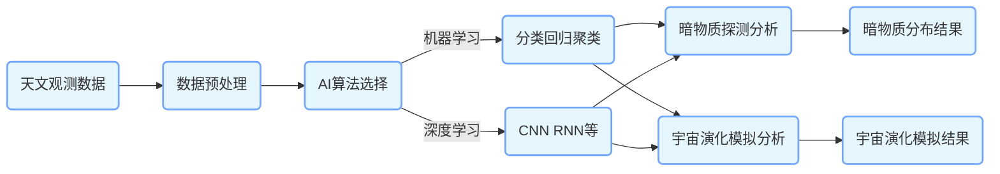

# AI辅助天文数据分析：从暗物质探测到宇宙演化模拟

> 关键词：AI、天文数据分析、暗物质探测、宇宙演化模拟、机器学习

> 摘要：本文聚焦于AI在天文数据分析中的应用，从暗物质探测到宇宙演化模拟进行了全面深入的探讨。首先介绍了相关背景，包括目的范围、预期读者等内容。接着阐述了核心概念及联系，分析了核心算法原理并给出Python代码示例，详细讲解了数学模型和公式。通过项目实战展示了代码实际案例和详细解释，探讨了实际应用场景。同时推荐了学习、开发工具和相关论文著作。最后总结了未来发展趋势与挑战，并给出常见问题解答和扩展阅读参考资料，旨在为读者全面呈现AI辅助天文数据分析的技术全貌。

## 1. 背景介绍 
### 1.1 目的和范围
随着天文观测技术的飞速发展，天文数据呈现出爆炸式增长。从地面到太空的各种望远镜和探测器，每天都会产生海量的数据。然而，传统的数据分析方法在处理这些大规模、复杂且高维的数据时显得力不从心。本文章的目的在于探讨如何利用人工智能（AI）技术来辅助天文数据分析，特别是在暗物质探测和宇宙演化模拟这两个重要的天文学领域。范围涵盖了从AI核心概念和算法原理的介绍，到实际应用案例的分析，以及相关工具和资源的推荐。

### 1.2 预期读者
本文预期读者包括天文学研究人员、AI技术开发者、对天文数据分析和AI交叉领域感兴趣的学生和爱好者。对于天文学研究人员，本文可以提供新的数据分析思路和方法；对于AI技术开发者，能了解到天文领域独特的数据特点和应用需求；对于学生和爱好者，则可以作为入门学习资料，了解AI在天文学中的魅力。

### 1.3 文档结构概述
本文首先介绍了相关背景知识，让读者对文章的目的、预期读者和文档结构有清晰的认识。接着阐述核心概念与联系，通过文本示意图和Mermaid流程图展示AI与天文数据分析的关系。然后详细讲解核心算法原理，并用Python代码实现。随后介绍数学模型和公式，结合具体例子进行说明。通过项目实战部分，展示代码实际案例和详细解释。探讨实际应用场景，推荐相关工具和资源。最后总结未来发展趋势与挑战，给出常见问题解答和扩展阅读参考资料。

### 1.4 术语表
#### 1.4.1 核心术语定义
- **人工智能（AI）**：研究、开发用于模拟、延伸和扩展人的智能的理论、方法、技术及应用系统的一门新的技术科学。
- **天文数据分析**：对天文观测所获得的数据进行处理、分析和解释，以获取有关天体和宇宙的信息。
- **暗物质**：宇宙中一种不发光、不与电磁力相互作用的物质，只能通过引力效应来探测。
- **宇宙演化模拟**：通过计算机模拟宇宙从早期到现在的演化过程，以研究宇宙的结构形成和发展。

#### 1.4.2 相关概念解释
- **机器学习**：AI的一个重要分支，它让计算机通过数据学习模式和规律，而无需明确的编程指令。在天文数据分析中，机器学习可用于分类、回归、聚类等任务。
- **深度学习**：一种基于神经网络的机器学习方法，具有强大的特征提取和模式识别能力，常用于处理大规模、复杂的数据。

#### 1.4.3 缩略词列表
- **AI**：Artificial Intelligence（人工智能）
- **ML**：Machine Learning（机器学习）
- **DL**：Deep Learning（深度学习）

## 2. 核心概念与联系 
### 核心概念原理
在AI辅助天文数据分析中，主要涉及到人工智能和天文学两个核心领域。人工智能中的机器学习和深度学习技术是核心手段。机器学习算法可以对天文数据进行分类、回归和聚类等操作。例如，通过分类算法可以将不同类型的天体（如恒星、星系、星云等）进行区分；回归算法可以预测天体的某些物理参数，如亮度、质量等；聚类算法可以发现数据中的潜在结构，帮助天文学家发现新的天体类型或天文现象。

深度学习则通过构建深度神经网络，自动从天文数据中提取特征。对于图像数据（如星系图像），卷积神经网络（CNN）可以有效地提取图像中的空间特征；对于序列数据（如天体的光变曲线），循环神经网络（RNN）及其变体（如LSTM、GRU）可以捕捉数据中的时间序列信息。

天文学方面，暗物质探测和宇宙演化模拟是两个重要的研究方向。暗物质虽然无法直接观测到，但它通过引力作用影响着可见物质的分布和运动。天文学家可以通过观测星系的旋转曲线、引力透镜效应等现象来间接探测暗物质。宇宙演化模拟则是通过数值模拟的方法，考虑宇宙中的各种物理过程（如引力、气体动力学、恒星形成等），来研究宇宙从早期到现在的演化过程。

### 架构的文本示意图
```plaintext
AI辅助天文数据分析架构

|-- 数据输入
|   |-- 天文观测数据
|       |-- 图像数据（星系图像、恒星图像等）
|       |-- 光谱数据
|       |-- 光变曲线数据
|       |-- 位置和速度数据
|-- AI算法处理
|   |-- 机器学习
|       |-- 分类算法（决策树、支持向量机等）
|       |-- 回归算法（线性回归、神经网络回归等）
|       |-- 聚类算法（K-Means、DBSCAN等）
|   |-- 深度学习
|       |-- 卷积神经网络（CNN）
|       |-- 循环神经网络（RNN）及其变体（LSTM、GRU）
|-- 分析结果输出
|   |-- 暗物质探测结果
|       |-- 暗物质分布估计
|       |-- 暗物质质量预测
|   |-- 宇宙演化模拟结果
|       |-- 宇宙结构形成过程
|       |-- 星系演化轨迹
```

### Mermaid流程图


## 3. 核心算法原理 & 具体操作步骤 
### 机器学习算法 - 决策树分类算法原理
决策树是一种基于树结构进行决策的机器学习算法。它通过对数据的特征进行递归划分，构建一个树状模型。每个内部节点表示一个特征上的测试，每个分支表示测试输出，每个叶节点表示一个类别。

以下是一个简单的Python代码示例，使用Scikit-learn库实现决策树分类算法：
```python
from sklearn.datasets import load_iris
from sklearn.model_selection import train_test_split
from sklearn.tree import DecisionTreeClassifier
from sklearn.metrics import accuracy_score

# 加载鸢尾花数据集
iris = load_iris()
X = iris.data
y = iris.target

# 划分训练集和测试集
X_train, X_test, y_train, y_test = train_test_split(X, y, test_size=0.3, random_state=42)

# 创建决策树分类器
clf = DecisionTreeClassifier()

# 训练模型
clf.fit(X_train, y_train)

# 预测
y_pred = clf.predict(X_test)

# 计算准确率
accuracy = accuracy_score(y_test, y_pred)
print(f"Accuracy: {accuracy}")
```
### 操作步骤
1. **数据加载**：使用`load_iris`函数加载鸢尾花数据集。
2. **数据划分**：使用`train_test_split`函数将数据集划分为训练集和测试集。
3. **模型创建**：创建`DecisionTreeClassifier`对象。
4. **模型训练**：使用`fit`方法对模型进行训练。
5. **预测**：使用`predict`方法对测试集进行预测。
6. **评估**：使用`accuracy_score`函数计算预测准确率。

### 深度学习算法 - 卷积神经网络（CNN）原理
卷积神经网络是一种专门用于处理具有网格结构数据（如图像）的深度学习模型。它主要由卷积层、池化层和全连接层组成。卷积层通过卷积核在输入数据上滑动，提取局部特征；池化层用于降低数据的维度，减少计算量；全连接层将提取的特征进行整合，输出最终的分类结果。

以下是一个简单的Python代码示例，使用Keras库实现一个简单的CNN模型：
```python
from keras.datasets import mnist
from keras.models import Sequential
from keras.layers import Conv2D, MaxPooling2D, Flatten, Dense
from keras.utils import to_categorical

# 加载MNIST数据集
(X_train, y_train), (X_test, y_test) = mnist.load_data()

# 数据预处理
X_train = X_train.reshape(-1, 28, 28, 1).astype('float32') / 255
X_test = X_test.reshape(-1, 28, 28, 1).astype('float32') / 255
y_train = to_categorical(y_train)
y_test = to_categorical(y_test)

# 创建CNN模型
model = Sequential()
model.add(Conv2D(32, (3, 3), activation='relu', input_shape=(28, 28, 1)))
model.add(MaxPooling2D((2, 2)))
model.add(Conv2D(64, (3, 3), activation='relu'))
model.add(MaxPooling2D((2, 2)))
model.add(Flatten())
model.add(Dense(64, activation='relu'))
model.add(Dense(10, activation='softmax'))

# 编译模型
model.compile(optimizer='adam', loss='categorical_crossentropy', metrics=['accuracy'])

# 训练模型
model.fit(X_train, y_train, epochs=5, batch_size=64, validation_data=(X_test, y_test))

# 评估模型
_, accuracy = model.evaluate(X_test, y_test)
print(f"Accuracy: {accuracy}")
```
### 操作步骤
1. **数据加载**：使用`mnist.load_data`函数加载MNIST数据集。
2. **数据预处理**：将图像数据进行归一化处理，并将标签进行one-hot编码。
3. **模型创建**：使用`Sequential`模型创建一个CNN模型，添加卷积层、池化层和全连接层。
4. **模型编译**：使用`compile`方法指定优化器、损失函数和评估指标。
5. **模型训练**：使用`fit`方法对模型进行训练。
6. **模型评估**：使用`evaluate`方法对模型进行评估。

## 4. 数学模型和公式 & 详细讲解 & 举例说明 
### 决策树的信息增益公式
在决策树算法中，信息增益是一种常用的特征选择指标。信息增益表示在使用某个特征进行划分后，数据集的不确定性减少的程度。

信息熵的计算公式为：
$$H(D)=-\sum_{i=1}^{n}p_i\log_2p_i$$
其中，$D$ 表示数据集，$p_i$ 表示数据集中第 $i$ 类样本的比例，$n$ 表示类别数。

条件熵的计算公式为：
$$H(D|A)=\sum_{j=1}^{m}\frac{|D_j|}{|D|}H(D_j)$$
其中，$A$ 表示特征，$D_j$ 表示根据特征 $A$ 的第 $j$ 个取值划分得到的子集，$m$ 表示特征 $A$ 的取值数。

信息增益的计算公式为：
$$IG(D,A)=H(D)-H(D|A)$$

### 举例说明
假设有一个数据集 $D$ 包含 10 个样本，分为两类，其中第一类有 6 个样本，第二类有 4 个样本。则数据集 $D$ 的信息熵为：
$$H(D)=-\frac{6}{10}\log_2\frac{6}{10}-\frac{4}{10}\log_2\frac{4}{10}\approx0.971$$

假设我们有一个特征 $A$，它有两个取值，根据特征 $A$ 划分后得到两个子集 $D_1$ 和 $D_2$，其中 $D_1$ 包含 4 个样本，第一类有 3 个，第二类有 1 个；$D_2$ 包含 6 个样本，第一类有 3 个，第二类有 3 个。

则子集 $D_1$ 的信息熵为：
$$H(D_1)=-\frac{3}{4}\log_2\frac{3}{4}-\frac{1}{4}\log_2\frac{1}{4}\approx0.811$$

子集 $D_2$ 的信息熵为：
$$H(D_2)=-\frac{3}{6}\log_2\frac{3}{6}-\frac{3}{6}\log_2\frac{3}{6}=1$$

条件熵为：
$$H(D|A)=\frac{4}{10}H(D_1)+\frac{6}{10}H(D_2)=\frac{4}{10}\times0.811+\frac{6}{10}\times1\approx0.924$$

信息增益为：
$$IG(D,A)=H(D)-H(D|A)=0.971 - 0.924 = 0.047$$

### 卷积神经网络的卷积操作公式
在卷积神经网络中，卷积操作是核心操作之一。假设输入图像为 $X$，卷积核为 $K$，输出特征图为 $Y$，则卷积操作的计算公式为：
$$Y(i,j)=\sum_{m=0}^{M-1}\sum_{n=0}^{N-1}X(i + m, j + n)K(m,n)$$
其中，$M$ 和 $N$ 分别是卷积核的高度和宽度。

### 举例说明
假设输入图像 $X$ 是一个 $3\times3$ 的矩阵：
$$X=\begin{bmatrix}
1 & 2 & 3 \\
4 & 5 & 6 \\
7 & 8 & 9
\end{bmatrix}$$

卷积核 $K$ 是一个 $2\times2$ 的矩阵：
$$K=\begin{bmatrix}
1 & 0 \\
0 & 1
\end{bmatrix}$$

则输出特征图 $Y$ 的第一个元素 $Y(0,0)$ 为：
$$Y(0,0)=\sum_{m=0}^{1}\sum_{n=0}^{1}X(0 + m, 0 + n)K(m,n)=X(0,0)K(0,0)+X(0,1)K(0,1)+X(1,0)K(1,0)+X(1,1)K(1,1)=1\times1 + 2\times0 + 4\times0 + 5\times1 = 6$$

## 5. 项目实战：代码实际案例和详细解释说明 
### 5.1  开发环境搭建
#### 安装Python
首先，需要安装Python环境。可以从Python官方网站（https://www.python.org/downloads/）下载适合自己操作系统的Python版本。建议安装Python 3.7及以上版本。

#### 安装必要的库
使用`pip`命令安装必要的库，包括`numpy`、`pandas`、`scikit-learn`、`tensorflow`、`keras`等。
```bash
pip install numpy pandas scikit-learn tensorflow keras
```

#### 安装开发工具
可以选择使用Jupyter Notebook或PyCharm等开发工具。Jupyter Notebook适合交互式开发和数据分析，PyCharm则适合大型项目的开发。

### 5.2  源代码详细实现和代码解读
#### 暗物质探测 - 基于机器学习的星系旋转曲线分析
```python
import numpy as np
import pandas as pd
from sklearn.model_selection import train_test_split
from sklearn.linear_model import LinearRegression
from sklearn.metrics import mean_squared_error

# 加载星系旋转曲线数据
data = pd.read_csv('galaxy_rotation_curve.csv')
X = data[['radius']].values
y = data['velocity'].values

# 划分训练集和测试集
X_train, X_test, y_train, y_test = train_test_split(X, y, test_size=0.2, random_state=42)

# 创建线性回归模型
model = LinearRegression()

# 训练模型
model.fit(X_train, y_train)

# 预测
y_pred = model.predict(X_test)

# 计算均方误差
mse = mean_squared_error(y_test, y_pred)
print(f"Mean Squared Error: {mse}")
```
#### 代码解读
1. **数据加载**：使用`pandas`库的`read_csv`函数加载星系旋转曲线数据。
2. **数据划分**：使用`train_test_split`函数将数据集划分为训练集和测试集。
3. **模型创建**：创建`LinearRegression`对象。
4. **模型训练**：使用`fit`方法对模型进行训练。
5. **预测**：使用`predict`方法对测试集进行预测。
6. **评估**：使用`mean_squared_error`函数计算预测的均方误差。

#### 宇宙演化模拟 - 基于深度学习的星系形态分类
```python
import tensorflow as tf
from tensorflow.keras.preprocessing.image import ImageDataGenerator
from tensorflow.keras.models import Sequential
from tensorflow.keras.layers import Conv2D, MaxPooling2D, Flatten, Dense

# 数据生成器
train_datagen = ImageDataGenerator(rescale=1./255, validation_split=0.2)

train_generator = train_datagen.flow_from_directory(
    'galaxy_images/train',
    target_size=(150, 150),
    batch_size=32,
    class_mode='categorical',
    subset='training')

validation_generator = train_datagen.flow_from_directory(
    'galaxy_images/train',
    target_size=(150, 150),
    batch_size=32,
    class_mode='categorical',
    subset='validation')

# 创建CNN模型
model = Sequential()
model.add(Conv2D(32, (3, 3), activation='relu', input_shape=(150, 150, 3)))
model.add(MaxPooling2D((2, 2)))
model.add(Conv2D(64, (3, 3), activation='relu'))
model.add(MaxPooling2D((2, 2)))
model.add(Conv2D(128, (3, 3), activation='relu'))
model.add(MaxPooling2D((2, 2)))
model.add(Flatten())
model.add(Dense(128, activation='relu'))
model.add(Dense(train_generator.num_classes, activation='softmax'))

# 编译模型
model.compile(optimizer='adam', loss='categorical_crossentropy', metrics=['accuracy'])

# 训练模型
model.fit(
    train_generator,
    steps_per_epoch=train_generator.samples // train_generator.batch_size,
    validation_data=validation_generator,
    validation_steps=validation_generator.samples // validation_generator.batch_size,
    epochs=10)
```
#### 代码解读
1. **数据生成器**：使用`ImageDataGenerator`对图像数据进行预处理和增强，并划分训练集和验证集。
2. **数据加载**：使用`flow_from_directory`函数从指定目录加载图像数据。
3. **模型创建**：使用`Sequential`模型创建一个CNN模型，添加卷积层、池化层和全连接层。
4. **模型编译**：使用`compile`方法指定优化器、损失函数和评估指标。
5. **模型训练**：使用`fit`方法对模型进行训练。

### 5.3  代码解读与分析
#### 暗物质探测代码分析
在暗物质探测的代码中，我们使用线性回归模型对星系旋转曲线进行分析。线性回归模型假设星系的旋转速度与半径之间存在线性关系。通过训练模型，我们可以得到一个线性方程，用于预测不同半径处的旋转速度。均方误差是评估模型性能的一个重要指标，它表示预测值与真实值之间的平均误差。如果均方误差较小，说明模型的预测效果较好。

#### 宇宙演化模拟代码分析
在宇宙演化模拟的代码中，我们使用CNN模型对星系形态进行分类。CNN模型通过卷积层和池化层自动提取图像的特征，然后通过全连接层进行分类。数据生成器可以对图像数据进行预处理和增强，提高模型的泛化能力。在训练过程中，我们使用验证集来评估模型的性能，避免过拟合。

## 6. 实际应用场景 
### 暗物质探测
- **星系旋转曲线分析**：通过观测星系中恒星和气体的旋转速度，利用AI算法拟合旋转曲线，与理论模型进行对比，从而推断暗物质的分布和质量。例如，使用机器学习算法对大量星系的旋转曲线数据进行分析，发现一些星系的旋转速度在远离星系中心的区域并没有像牛顿引力理论预测的那样下降，这暗示了暗物质的存在。
- **引力透镜效应分析**：引力透镜是指光线在经过大质量天体（如星系团）时会发生弯曲的现象。通过AI技术对引力透镜图像进行处理和分析，可以重建出背后天体的质量分布，进而探测暗物质的分布。例如，使用深度学习算法对引力透镜图像进行分类和特征提取，提高暗物质探测的精度。

### 宇宙演化模拟
- **星系形成和演化研究**：通过宇宙演化模拟，结合AI算法对模拟结果进行分析，可以研究星系的形成和演化过程。例如，使用机器学习算法对模拟生成的星系图像进行分类，分析不同类型星系的形成机制和演化轨迹。
- **宇宙大尺度结构形成研究**：宇宙大尺度结构是指宇宙中星系和星系团的分布模式。通过宇宙演化模拟和AI技术，可以研究宇宙大尺度结构的形成过程，如星系团的合并、细丝结构的形成等。例如，使用深度学习算法对模拟生成的宇宙大尺度结构图像进行分析，提取结构特征，研究其形成的物理机制。

## 7. 工具和资源推荐
### 7.1 学习资源推荐
#### 7.1.1 书籍推荐
- 《Python机器学习》：这本书详细介绍了Python在机器学习中的应用，包括各种机器学习算法的原理和实现。
- 《深度学习》：由深度学习领域的三位顶尖专家撰写，全面介绍了深度学习的理论和实践。
- 《天文学基础》：适合初学者了解天文学的基本概念和知识。

#### 7.1.2 在线课程
- Coursera上的“机器学习”课程：由斯坦福大学的Andrew Ng教授授课，是机器学习领域的经典课程。
- edX上的“深度学习基础”课程：由微软研究院的专家授课，介绍了深度学习的基本原理和应用。
- 中国大学MOOC上的“天文学概论”课程：由国内高校的天文学教授授课，适合初学者了解天文学知识。

#### 7.1.3 技术博客和网站
- Medium：上面有很多关于AI和天文学的技术博客文章，可以了解到最新的研究成果和应用案例。
- arXiv：一个预印本数据库，包含了大量的天文学和AI领域的研究论文。
- NASA官方网站：可以获取到最新的天文观测数据和研究成果。

### 7.2 开发工具框架推荐
#### 7.2.1 IDE和编辑器
- PyCharm：一款专业的Python集成开发环境，提供了丰富的功能和插件，适合大型项目的开发。
- Jupyter Notebook：一个交互式的开发环境，适合数据分析和模型训练的实验和演示。
- Visual Studio Code：一款轻量级的代码编辑器，支持多种编程语言，并且有丰富的插件生态系统。

#### 7.2.2 调试和性能分析工具
- TensorBoard：TensorFlow的可视化工具，可以用于监控模型训练过程、查看模型结构和分析性能指标。
- Py-Spy：一个Python性能分析工具，可以用于分析Python程序的CPU和内存使用情况。
- cProfile：Python标准库中的性能分析模块，可以用于分析Python程序的函数调用时间和次数。

#### 7.2.3 相关框架和库
- Scikit-learn：一个简单易用的机器学习库，提供了各种机器学习算法的实现。
- TensorFlow：一个开源的深度学习框架，支持分布式训练和模型部署。
- Keras：一个高级神经网络API，基于TensorFlow、Theano等后端，易于使用和快速搭建模型。

### 7.3 相关论文著作推荐
#### 7.3.1 经典论文
- “Gradient-based learning applied to document recognition”：介绍了卷积神经网络在手写字符识别中的应用，是CNN领域的经典论文。
- “Deep Residual Learning for Image Recognition”：提出了残差网络（ResNet），解决了深度神经网络训练中的梯度消失问题。
- “The Structure of Cold Dark Matter Halos”：研究了冷暗物质晕的结构，是暗物质研究领域的经典论文。

#### 7.3.2 最新研究成果
- 定期关注arXiv上的天文学和AI领域的最新研究论文，可以了解到最新的研究成果和发展趋势。
- 参加相关的学术会议，如NeurIPS、ICML、AAS等，听取专家的报告和演讲。

#### 7.3.3 应用案例分析
- 一些知名的研究机构和团队会在其官方网站上发布AI在天文数据分析中的应用案例，可以参考学习。
- 阅读相关的学术期刊文章，如《Astrophysical Journal》、《Monthly Notices of the Royal Astronomical Society》等，了解实际应用案例和研究方法。

## 8. 总结：未来发展趋势与挑战
### 未来发展趋势
- **多模态数据融合**：未来的天文数据分析将不仅仅依赖于单一类型的数据，而是会融合图像、光谱、光变曲线等多模态数据。AI技术将在多模态数据融合方面发挥重要作用，通过挖掘不同数据之间的关联信息，提高天文数据分析的准确性和效率。
- **强化学习在天文模拟中的应用**：强化学习是一种通过智能体与环境进行交互并学习最优策略的机器学习方法。在宇宙演化模拟中，强化学习可以用于优化模拟参数，提高模拟的准确性和效率。
- **AI与天文望远镜的深度结合**：随着天文望远镜技术的不断发展，未来的望远镜将产生更加海量和复杂的数据。AI技术可以与天文望远镜进行深度结合，实现实时数据处理和分析，提高望远镜的观测效率和科学产出。

### 挑战
- **数据质量和标注问题**：天文数据的质量受到多种因素的影响，如观测条件、仪器误差等。同时，很多天文数据缺乏准确的标注，这给AI算法的训练带来了困难。如何提高数据质量和获取准确的标注数据是一个亟待解决的问题。
- **计算资源和时间成本**：AI算法通常需要大量的计算资源和时间来进行训练和推理。对于大规模的天文数据，计算资源和时间成本成为了限制AI应用的重要因素。如何优化算法和利用分布式计算技术来降低计算资源和时间成本是一个挑战。
- **可解释性问题**：深度学习等AI算法通常是黑盒模型，其决策过程难以解释。在天文数据分析中，科学家需要了解模型的决策依据，以便对结果进行科学解释。如何提高AI算法的可解释性是一个重要的研究方向。

## 9. 附录：常见问题与解答
### 问题1：AI在天文数据分析中的优势是什么？
答：AI在天文数据分析中的优势主要体现在以下几个方面：
- 处理大规模数据：AI算法可以高效地处理海量的天文数据，发现数据中的隐藏模式和规律。
- 自动化特征提取：深度学习等AI技术可以自动从数据中提取特征，减少人工特征工程的工作量。
- 提高分析准确性：AI算法可以通过学习大量的数据，提高分析的准确性和可靠性。

### 问题2：如何选择适合的AI算法进行天文数据分析？
答：选择适合的AI算法需要考虑以下几个因素：
- 数据类型：不同类型的数据（如图像、光谱、光变曲线等）适合不同的AI算法。例如，图像数据适合使用卷积神经网络，序列数据适合使用循环神经网络。
- 分析任务：不同的分析任务（如分类、回归、聚类等）需要选择不同的AI算法。例如，分类任务可以选择决策树、支持向量机等算法，回归任务可以选择线性回归、神经网络回归等算法。
- 数据规模和复杂度：数据规模和复杂度也会影响算法的选择。对于大规模、复杂的数据，深度学习算法可能更适合；对于小规模、简单的数据，传统的机器学习算法可能就足够了。

### 问题3：AI在暗物质探测和宇宙演化模拟中的应用前景如何？
答：AI在暗物质探测和宇宙演化模拟中的应用前景非常广阔。在暗物质探测方面，AI可以通过分析星系旋转曲线、引力透镜效应等数据，提高暗物质探测的精度和效率。在宇宙演化模拟方面，AI可以用于优化模拟参数、分析模拟结果，帮助科学家更好地理解宇宙的演化过程。随着AI技术的不断发展和天文数据的不断积累，AI在这两个领域的应用将会取得更加显著的成果。

## 10. 扩展阅读 & 参考资料
### 扩展阅读
- 《AI未来简史》：这本书探讨了AI对人类社会和未来发展的影响，对于了解AI的发展趋势和应用前景有很大的帮助。
- 《宇宙的结构》：介绍了宇宙的基本结构和演化过程，适合对天文学感兴趣的读者深入了解宇宙的奥秘。

### 参考资料
- 《Python机器学习实战》
- 《深度学习入门：基于Python的理论与实现》
- arXiv上的相关研究论文
- 各大天文学和AI领域的学术期刊文章

作者：AI天才研究院/AI Genius Institute & 禅与计算机程序设计艺术 /Zen And The Art of Computer Programming