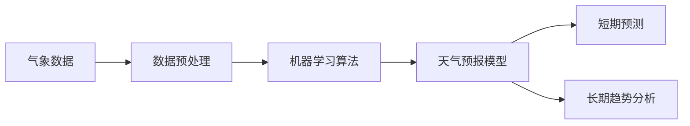

# AI辅助天气预报：从短期预测到长期趋势分析

> 关键词：AI辅助天气预报、短期预测、长期趋势分析、气象数据、机器学习算法

> 摘要：本文围绕AI辅助天气预报展开，详细探讨了其从短期预测到长期趋势分析的应用。首先介绍了相关背景，包括目的、预期读者、文档结构和术语表。接着阐述了核心概念与联系，通过示意图和流程图展示了AI在天气预报中的架构。深入分析了核心算法原理，用Python代码进行了详细阐述，并给出了数学模型和公式。通过项目实战展示了代码实现和解读。同时探讨了实际应用场景，推荐了学习资源、开发工具和相关论文。最后总结了未来发展趋势与挑战，还包含常见问题解答和扩展阅读参考资料，为读者全面了解AI辅助天气预报提供了深入的指导。

## 1. 背景介绍 
### 1.1 目的和范围
天气预报对于人类的生产生活有着至关重要的影响，无论是农业生产、交通运输还是能源管理等领域，都依赖准确的天气预报来做出决策。传统的天气预报方法在处理复杂气象数据和进行长期趋势分析时存在一定的局限性。本文章的目的在于深入探讨AI技术如何辅助天气预报，从短期预测到长期趋势分析，揭示AI在提高天气预报准确性和可靠性方面的潜力。范围涵盖了AI在天气预报中的核心概念、算法原理、实际应用案例以及未来发展趋势等方面。

### 1.2 预期读者
本文预期读者包括气象学专业的学生和研究人员，他们可以从文中了解AI技术在天气预报领域的最新应用和研究成果，为其学术研究提供参考；软件开发人员和数据科学家，他们可以学习到如何将AI算法应用于气象数据处理和分析，开发相关的天气预报软件；以及对天气预报和AI技术感兴趣的普通读者，帮助他们了解这一前沿领域的发展动态。

### 1.3 文档结构概述
本文将按照以下结构进行阐述：首先介绍背景信息，包括目的、读者和文档结构；接着讲解核心概念与联系，通过示意图和流程图展示AI在天气预报中的架构；然后深入分析核心算法原理，用Python代码详细阐述；给出数学模型和公式并举例说明；通过项目实战展示代码实现和解读；探讨实际应用场景；推荐学习资源、开发工具和相关论文；最后总结未来发展趋势与挑战，包含常见问题解答和扩展阅读参考资料。

### 1.4 术语表
#### 1.4.1 核心术语定义
- **AI（Artificial Intelligence）**：人工智能，是研究、开发用于模拟、延伸和扩展人的智能的理论、方法、技术及应用系统的一门新的技术科学。
- **天气预报**：对未来一定时期内天气变化的预先估计和预告。
- **短期预测**：通常指未来1 - 3天的天气预报。
- **长期趋势分析**：对较长时间范围内（如季节、年际等）气象要素变化趋势的分析。

#### 1.4.2 相关概念解释
- **气象数据**：包括气温、气压、湿度、风速、风向等各种与天气相关的数据，是天气预报的基础。
- **机器学习算法**：AI中的一类算法，通过对大量数据的学习来发现数据中的模式和规律，从而进行预测和决策。
- **深度学习**：机器学习的一个分支，通过构建深度神经网络来处理复杂的数据，在图像识别、语音识别等领域取得了显著成果。

#### 1.4.3 缩略词列表
- **AI**：Artificial Intelligence
- **ML**：Machine Learning
- **DL**：Deep Learning

## 2. 核心概念与联系 
在AI辅助天气预报中，核心概念主要包括气象数据、机器学习算法和天气预报模型。气象数据是整个系统的输入，它包含了各种气象要素的历史和实时信息。机器学习算法则用于对这些数据进行处理和分析，挖掘其中的模式和规律。天气预报模型是基于机器学习算法构建的，用于根据输入的气象数据进行短期预测和长期趋势分析。

下面是核心概念原理和架构的文本示意图：

```plaintext
气象数据（气温、气压、湿度等）
        |
        v
数据预处理（清洗、归一化等）
        |
        v
机器学习算法（神经网络、决策树等）
        |
        v
天气预报模型
        |
        v
短期预测、长期趋势分析结果
```

下面是对应的Mermaid流程图：



## 3. 核心算法原理 & 具体操作步骤 
在AI辅助天气预报中，常用的机器学习算法包括神经网络、决策树、随机森林等。这里以神经网络为例，详细阐述其算法原理和具体操作步骤。

### 神经网络原理
神经网络是一种模仿人类神经系统的计算模型，由多个神经元组成。每个神经元接收输入信号，经过加权求和和激活函数处理后输出结果。多个神经元按照层次结构排列，形成输入层、隐藏层和输出层。在天气预报中，输入层接收气象数据，隐藏层对数据进行特征提取和转换，输出层输出预测结果。

### 具体操作步骤
1. **数据收集**：收集历史气象数据，包括气温、气压、湿度、风速等。
2. **数据预处理**：对收集到的数据进行清洗、归一化等处理，以提高模型的训练效果。
3. **模型构建**：构建神经网络模型，确定输入层、隐藏层和输出层的神经元数量，选择合适的激活函数。
4. **模型训练**：使用预处理后的数据对模型进行训练，调整模型的权重和偏置，使模型的预测结果与实际值之间的误差最小。
5. **模型评估**：使用测试数据对训练好的模型进行评估，计算模型的准确率、召回率等指标。
6. **预测应用**：使用训练好的模型对未来的气象数据进行预测。

### Python代码实现
```python
import numpy as np
import pandas as pd
from sklearn.preprocessing import MinMaxScaler
from tensorflow.keras.models import Sequential
from tensorflow.keras.layers import Dense

# 数据收集和预处理
data = pd.read_csv('weather_data.csv')
X = data.drop('temperature', axis=1).values
y = data['temperature'].values

scaler_X = MinMaxScaler()
scaler_y = MinMaxScaler()
X = scaler_X.fit_transform(X)
y = scaler_y.fit_transform(y.reshape(-1, 1))

# 划分训练集和测试集
train_size = int(len(X) * 0.8)
X_train, X_test = X[:train_size], X[train_size:]
y_train, y_test = y[:train_size], y[train_size:]

# 模型构建
model = Sequential()
model.add(Dense(64, input_dim=X_train.shape[1], activation='relu'))
model.add(Dense(32, activation='relu'))
model.add(Dense(1))

# 模型编译
model.compile(loss='mean_squared_error', optimizer='adam')

# 模型训练
model.fit(X_train, y_train, epochs=100, batch_size=32, verbose=1)

# 模型评估
loss = model.evaluate(X_test, y_test)
print(f"Test loss: {loss}")

# 预测应用
new_data = np.array([[1010, 60, 5]])  # 示例新数据
new_data = scaler_X.transform(new_data)
prediction = model.predict(new_data)
prediction = scaler_y.inverse_transform(prediction)
print(f"Predicted temperature: {prediction[0][0]}")
```

## 4. 数学模型和公式 & 详细讲解 & 举例说明 
### 神经网络的数学模型
神经网络的基本数学模型可以用以下公式表示：

$$
z_j = \sum_{i=1}^{n} w_{ji}x_i + b_j
$$

其中，$z_j$ 是第 $j$ 个神经元的输入加权和，$w_{ji}$ 是第 $i$ 个输入与第 $j$ 个神经元之间的权重，$x_i$ 是第 $i$ 个输入，$b_j$ 是第 $j$ 个神经元的偏置。

经过激活函数处理后，神经元的输出为：

$$
a_j = f(z_j)
$$

其中，$a_j$ 是第 $j$ 个神经元的输出，$f$ 是激活函数。常用的激活函数包括Sigmoid函数、ReLU函数等。

### 损失函数
在训练神经网络时，需要定义一个损失函数来衡量模型的预测结果与实际值之间的误差。常用的损失函数是均方误差（Mean Squared Error，MSE）：

$$
MSE = \frac{1}{n} \sum_{i=1}^{n} (y_i - \hat{y}_i)^2
$$

其中，$n$ 是样本数量，$y_i$ 是第 $i$ 个样本的实际值，$\hat{y}_i$ 是第 $i$ 个样本的预测值。

### 举例说明
假设我们有一个简单的神经网络，输入层有2个神经元，隐藏层有3个神经元，输出层有1个神经元。输入数据为 $x = [x_1, x_2]$，隐藏层的权重矩阵为 $W_1$，偏置向量为 $b_1$，输出层的权重矩阵为 $W_2$，偏置向量为 $b_2$。

隐藏层的输入加权和为：

$$
z_{1j} = \sum_{i=1}^{2} w_{1ji}x_i + b_{1j}, j = 1, 2, 3
$$

隐藏层的输出为：

$$
a_{1j} = f(z_{1j}), j = 1, 2, 3
$$

输出层的输入加权和为：

$$
z_{21} = \sum_{j=1}^{3} w_{21j}a_{1j} + b_{21}
$$

输出层的输出为：

$$
\hat{y} = f(z_{21})
$$

假设输入数据 $x = [0.5, 0.3]$，$W_1 = \begin{bmatrix} 0.1 & 0.2 \\ 0.3 & 0.4 \\ 0.5 & 0.6 \end{bmatrix}$，$b_1 = [0.1, 0.2, 0.3]$，$W_2 = \begin{bmatrix} 0.7 & 0.8 & 0.9 \end{bmatrix}$，$b_2 = [0.4]$，激活函数为Sigmoid函数 $f(x) = \frac{1}{1 + e^{-x}}$。

首先计算隐藏层的输入加权和：

$$
z_{11} = 0.1 \times 0.5 + 0.2 \times 0.3 + 0.1 = 0.1 + 0.06 + 0.1 = 0.26
$$

$$
z_{12} = 0.3 \times 0.5 + 0.4 \times 0.3 + 0.2 = 0.15 + 0.12 + 0.2 = 0.47
$$

$$
z_{13} = 0.5 \times 0.5 + 0.6 \times 0.3 + 0.3 = 0.25 + 0.18 + 0.3 = 0.73
$$

然后计算隐藏层的输出：

$$
a_{11} = f(z_{11}) = \frac{1}{1 + e^{-0.26}} \approx 0.564
$$

$$
a_{12} = f(z_{12}) = \frac{1}{1 + e^{-0.47}} \approx 0.617
$$

$$
a_{13} = f(z_{13}) = \frac{1}{1 + e^{-0.73}} \approx 0.674
$$

接着计算输出层的输入加权和：

$$
z_{21} = 0.7 \times 0.564 + 0.8 \times 0.617 + 0.9 \times 0.674 + 0.4 = 0.3948 + 0.4936 + 0.6066 + 0.4 = 1.895
$$

最后计算输出层的输出：

$$
\hat{y} = f(z_{21}) = \frac{1}{1 + e^{-1.895}} \approx 0.865
$$

## 5. 项目实战：代码实际案例和详细解释说明 
### 5.1  开发环境搭建
在进行AI辅助天气预报的项目实战时，需要搭建相应的开发环境。以下是具体步骤：
1. **安装Python**：Python是一种广泛使用的编程语言，在数据处理和机器学习领域有着丰富的库和工具。可以从Python官方网站（https://www.python.org/downloads/）下载并安装Python 3.x版本。
2. **安装必要的库**：使用pip命令安装以下必要的库：
    - `numpy`：用于数值计算。
    - `pandas`：用于数据处理和分析。
    - `scikit-learn`：用于机器学习算法的实现。
    - `tensorflow`：用于构建和训练神经网络模型。
    - `matplotlib`：用于数据可视化。

```bash
pip install numpy pandas scikit-learn tensorflow matplotlib
```

### 5.2  源代码详细实现和代码解读
以下是一个完整的AI辅助天气预报项目的源代码，我们将对其进行详细解读。

```python
import numpy as np
import pandas as pd
from sklearn.preprocessing import MinMaxScaler
from tensorflow.keras.models import Sequential
from tensorflow.keras.layers import Dense
import matplotlib.pyplot as plt

# 数据收集和预处理
data = pd.read_csv('weather_data.csv')
X = data.drop('temperature', axis=1).values
y = data['temperature'].values

scaler_X = MinMaxScaler()
scaler_y = MinMaxScaler()
X = scaler_X.fit_transform(X)
y = scaler_y.fit_transform(y.reshape(-1, 1))

# 划分训练集和测试集
train_size = int(len(X) * 0.8)
X_train, X_test = X[:train_size], X[train_size:]
y_train, y_test = y[:train_size], y[train_size:]

# 模型构建
model = Sequential()
model.add(Dense(64, input_dim=X_train.shape[1], activation='relu'))
model.add(Dense(32, activation='relu'))
model.add(Dense(1))

# 模型编译
model.compile(loss='mean_squared_error', optimizer='adam')

# 模型训练
history = model.fit(X_train, y_train, epochs=100, batch_size=32, verbose=1, validation_data=(X_test, y_test))

# 模型评估
loss = model.evaluate(X_test, y_test)
print(f"Test loss: {loss}")

# 预测应用
predictions = model.predict(X_test)
predictions = scaler_y.inverse_transform(predictions)
y_test = scaler_y.inverse_transform(y_test)

# 可视化结果
plt.plot(y_test, label='Actual Temperature')
plt.plot(predictions, label='Predicted Temperature')
plt.xlabel('Time')
plt.ylabel('Temperature')
plt.title('Actual vs Predicted Temperature')
plt.legend()
plt.show()
```

### 代码解读与分析
1. **数据收集和预处理**：
    - 使用`pandas`库读取CSV文件中的气象数据。
    - 将特征数据和目标数据分别存储在`X`和`y`中。
    - 使用`MinMaxScaler`对数据进行归一化处理，将数据缩放到0 - 1的范围内，以提高模型的训练效果。

2. **划分训练集和测试集**：
    - 将数据按照80%和20%的比例划分为训练集和测试集。

3. **模型构建**：
    - 使用`Sequential`模型构建一个简单的神经网络。
    - 输入层有与特征数据维度相同的神经元数量，隐藏层分别有64和32个神经元，输出层有1个神经元。
    - 使用`ReLU`激活函数增加模型的非线性。

4. **模型编译**：
    - 使用均方误差作为损失函数，`Adam`优化器进行模型训练。

5. **模型训练**：
    - 使用训练集数据对模型进行训练，设置训练轮数为100，批次大小为32。
    - 同时使用测试集数据进行验证，记录训练过程中的损失值。

6. **模型评估**：
    - 使用测试集数据对训练好的模型进行评估，计算测试集上的损失值。

7. **预测应用**：
    - 使用训练好的模型对测试集数据进行预测，并将预测结果进行反归一化处理。

8. **可视化结果**：
    - 使用`matplotlib`库将实际温度和预测温度进行可视化，直观地展示模型的预测效果。

## 6. 实际应用场景 
### 农业领域
在农业生产中，准确的天气预报对于作物种植、灌溉、施肥等决策至关重要。AI辅助天气预报可以提供短期的气象信息，帮助农民及时调整种植计划，避免自然灾害对作物的影响。例如，在即将到来的暴雨前，农民可以提前做好排水准备；在干旱天气来临前，合理安排灌溉。同时，长期趋势分析可以帮助农民了解气候变化对作物生长的影响，调整种植品种和种植时间。

### 交通运输领域
交通运输行业对天气变化非常敏感，恶劣的天气条件会影响道路、铁路、航空等运输的安全和效率。AI辅助天气预报可以为交通运输部门提供实时的气象信息，帮助他们提前做好应对措施。例如，在暴雨、暴雪天气来临前，交通管理部门可以及时发布路况信息，提醒驾驶员注意安全；航空公司可以根据天气预报调整航班计划，避免航班延误和取消。

### 能源管理领域
能源的生产和消耗与天气密切相关。在电力生产方面，风力发电和太阳能发电受天气影响较大，准确的天气预报可以帮助电力公司合理安排发电计划，提高能源利用效率。在能源消耗方面，天气预报可以帮助供暖、制冷等能源用户提前做好能源储备和调整，降低能源成本。

### 城市规划领域
城市规划需要考虑气候变化对城市环境和居民生活的影响。AI辅助天气预报的长期趋势分析可以为城市规划提供数据支持，帮助规划者合理布局城市基础设施，提高城市的抗灾能力。例如，在城市建设中，可以根据未来气候变化趋势，合理规划排水系统、防洪设施等。

## 7. 工具和资源推荐
### 7.1 学习资源推荐
#### 7.1.1 书籍推荐
- 《Python机器学习》：介绍了Python在机器学习领域的应用，包括各种机器学习算法的原理和实现。
- 《深度学习》：由深度学习领域的三位权威专家撰写，全面介绍了深度学习的理论和实践。
- 《气象学与气候学导论》：提供了气象学和气候学的基础知识，对于理解天气预报的原理和方法非常有帮助。

#### 7.1.2 在线课程
- Coursera上的“机器学习”课程：由斯坦福大学的Andrew Ng教授授课，是机器学习领域的经典课程。
- edX上的“深度学习基础”课程：介绍了深度学习的基本概念和算法，通过实际案例进行讲解。
- 中国大学MOOC上的“气象学基础”课程：系统地介绍了气象学的基本原理和方法。

#### 7.1.3 技术博客和网站
- Towards Data Science：一个专注于数据科学和机器学习的博客平台，上面有很多关于AI在各个领域应用的文章。
- Medium：一个综合性的博客平台，有很多技术专家分享他们的经验和见解。
- 中国气象数据网：提供了丰富的气象数据和相关的研究报告，是了解气象领域最新动态的重要网站。

### 7.2 开发工具框架推荐
#### 7.2.1 IDE和编辑器
- PyCharm：一款专业的Python集成开发环境，具有代码编辑、调试、版本控制等功能，非常适合Python开发。
- Jupyter Notebook：一个交互式的开发环境，可以方便地进行代码编写、数据可视化和文档编写，常用于数据科学和机器学习领域。
- Visual Studio Code：一款轻量级的代码编辑器，支持多种编程语言，有丰富的插件可以扩展其功能。

#### 7.2.2 调试和性能分析工具
- TensorBoard：TensorFlow提供的可视化工具，可以用于查看模型的训练过程、损失曲线、参数分布等信息，帮助开发者调试和优化模型。
- Scikit-learn的GridSearchCV：用于模型参数调优的工具，可以通过网格搜索的方式找到最优的模型参数。
- Profile模块：Python内置的性能分析工具，可以分析代码的运行时间和内存使用情况，帮助开发者找出性能瓶颈。

#### 7.2.3 相关框架和库
- TensorFlow：一个开源的深度学习框架，提供了丰富的工具和接口，用于构建和训练各种深度学习模型。
- PyTorch：另一个流行的深度学习框架，具有动态图的特点，易于使用和调试。
- Scikit-learn：一个用于机器学习的Python库，提供了各种机器学习算法的实现，如分类、回归、聚类等。

### 7.3 相关论文著作推荐
#### 7.3.1 经典论文
- “Gradient-Based Learning Applied to Document Recognition”：由Yann LeCun等人撰写，介绍了卷积神经网络（CNN）在手写字符识别中的应用，是深度学习领域的经典论文之一。
- “Long Short-Term Memory”：由Sepp Hochreiter和Jürgen Schmidhuber撰写，提出了长短期记忆网络（LSTM），解决了传统循环神经网络（RNN）中的梯度消失问题。
- “Deep Learning in Neural Networks: An Overview”：对深度学习的发展历程、主要算法和应用进行了全面的综述。

#### 7.3.2 最新研究成果
- 可以通过IEEE Xplore、ACM Digital Library等学术数据库搜索关于AI辅助天气预报的最新研究论文，了解该领域的前沿动态。

#### 7.3.3 应用案例分析
- 一些知名的气象机构和科研团队会发布关于AI在天气预报中应用的案例分析报告，可以通过他们的官方网站获取这些资料。

## 8. 总结：未来发展趋势与挑战
### 未来发展趋势
- **多源数据融合**：未来的AI辅助天气预报将融合更多类型的数据，如卫星遥感数据、气象雷达数据、地面传感器数据等，以提高天气预报的准确性和可靠性。
- **深度学习模型的优化**：随着深度学习技术的不断发展，将出现更加复杂和高效的深度学习模型，用于处理气象数据和进行天气预报。
- **实时预报和预警**：借助高速计算和实时数据处理技术，AI辅助天气预报将能够提供更及时的实时预报和预警信息，帮助人们更好地应对自然灾害。
- **与其他领域的融合**：AI辅助天气预报将与农业、交通、能源等领域进行更深入的融合，为这些领域提供更加个性化和精准的气象服务。

### 挑战
- **数据质量和数量**：气象数据的质量和数量对AI模型的训练效果有着重要影响。目前，气象数据存在噪声、缺失值等问题，需要进一步提高数据的质量和数量。
- **模型可解释性**：深度学习模型通常是黑盒模型，难以解释其决策过程。在天气预报中，模型的可解释性非常重要，需要开发可解释的AI模型。
- **计算资源需求**：复杂的深度学习模型需要大量的计算资源进行训练和推理，如何降低计算成本和提高计算效率是一个挑战。
- **气候变化的不确定性**：随着全球气候变化的加剧，气象系统变得更加复杂和不确定，这给AI辅助天气预报带来了更大的挑战。

## 9. 附录：常见问题与解答
### 问题1：AI辅助天气预报的准确性如何？
答：AI辅助天气预报的准确性受到多种因素的影响，如数据质量、模型选择和训练方法等。目前，AI技术在提高天气预报准确性方面取得了一定的进展，但仍然存在一定的误差。随着技术的不断发展和数据的不断积累，AI辅助天气预报的准确性有望进一步提高。

### 问题2：AI辅助天气预报与传统天气预报方法有什么区别？
答：传统天气预报方法主要基于物理模型和经验公式，通过对气象数据的分析和计算来进行预报。而AI辅助天气预报则利用机器学习和深度学习算法，从大量的气象数据中学习模式和规律，从而进行预测。AI辅助天气预报可以处理更复杂的数据和模式，在一些情况下可以提高天气预报的准确性和效率。

### 问题3：如何选择适合的机器学习算法进行天气预报？
答：选择适合的机器学习算法需要考虑多个因素，如数据的特点、问题的类型、计算资源等。对于气象数据这种具有时间序列特征的数据，可以选择递归神经网络（RNN）、长短期记忆网络（LSTM）等算法。同时，也可以尝试不同的算法并进行比较，选择性能最优的算法。

### 问题4：AI辅助天气预报在长期趋势分析方面的应用前景如何？
答：AI辅助天气预报在长期趋势分析方面具有广阔的应用前景。通过对大量历史气象数据的分析和学习，AI可以发现气候变化的趋势和规律，为应对气候变化提供决策支持。同时，长期趋势分析也可以帮助农业、能源等领域进行长期规划和战略决策。

## 10. 扩展阅读 & 参考资料
### 扩展阅读
- 《人工智能时代的气象服务创新》
- 《气象大数据与人工智能》

### 参考资料
- 相关的学术论文和研究报告
- 气象机构和科研团队的官方网站
- 各类技术博客和论坛

作者：AI天才研究院/AI Genius Institute & 禅与计算机程序设计艺术 /Zen And The Art of Computer Programming