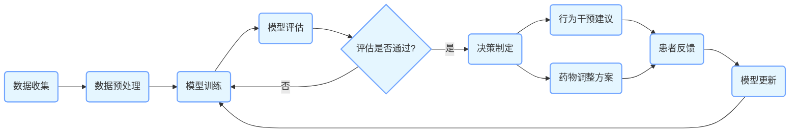

# AI辅助慢性病个性化管理：从行为干预到药物调整

> 关键词：AI、慢性病个性化管理、行为干预、药物调整、健康数据分析

> 摘要：本文聚焦于AI在慢性病个性化管理中的应用，从行为干预延伸至药物调整。详细阐述了AI在这一领域的核心概念、算法原理、数学模型，并通过实际项目案例展示其应用过程。探讨了AI在慢性病管理中的实际应用场景，推荐了相关的学习资源、开发工具和论文著作。最后总结了未来发展趋势与挑战，为该领域的研究和实践提供全面且深入的参考。

## 1. 背景介绍 
### 1.1 目的和范围
慢性病如糖尿病、高血压、心血管疾病等，已经成为全球范围内的主要健康负担。传统的慢性病管理模式往往是基于通用的指南和经验，难以满足每个患者的个性化需求。本文章的目的在于深入探讨如何利用人工智能技术实现慢性病的个性化管理，涵盖从对患者行为的干预到药物治疗方案的精准调整。其范围包括核心概念的阐述、算法原理的讲解、数学模型的分析、实际项目案例的展示以及未来发展趋势的探讨。

### 1.2 预期读者
本文预期读者包括医学领域的专业人士，如医生、护士、健康管理师等，他们可以通过了解AI技术在慢性病管理中的应用，为患者提供更优质的服务；计算机科学领域的开发者、研究人员，他们可以从中获取在医疗健康领域应用AI技术的灵感和方法；以及对健康管理和人工智能交叉领域感兴趣的普通读者。

### 1.3 文档结构概述
本文首先介绍核心概念与联系，明确AI在慢性病个性化管理中的基本原理和架构。接着阐述核心算法原理及具体操作步骤，结合Python代码进行详细说明。然后分析数学模型和公式，并通过举例加深理解。之后通过项目实战，展示代码实际案例并进行详细解释。随后探讨实际应用场景，为AI技术的落地提供参考。再推荐相关的工具和资源，方便读者进一步学习和研究。最后总结未来发展趋势与挑战，并提供常见问题与解答以及扩展阅读和参考资料。

### 1.4 术语表
#### 1.4.1 核心术语定义
- **慢性病个性化管理**：根据每个慢性病患者的个体特征，如基因信息、生活习惯、疾病史等，制定专属的疾病管理方案，以提高治疗效果和患者的生活质量。
- **行为干预**：通过改变患者的生活方式和行为习惯，如饮食、运动、睡眠等，来改善患者的健康状况。
- **药物调整**：根据患者的病情变化、身体反应等因素，对药物的种类、剂量、使用时间等进行调整。
- **人工智能（AI）**：使计算机系统能够模拟人类智能的技术，包括机器学习、深度学习、自然语言处理等。

#### 1.4.2 相关概念解释
- **机器学习**：AI的一个分支，通过让计算机从数据中学习模式和规律，从而进行预测和决策。在慢性病管理中，机器学习可以用于分析患者数据，预测病情发展和药物反应。
- **深度学习**：一种特殊的机器学习技术，使用多层神经网络来处理复杂的数据。在医疗领域，深度学习可以用于图像识别、语音识别和疾病诊断等。
- **电子健康记录（EHR）**：以电子化方式存储的患者健康信息，包括病历、检查报告、用药记录等。EHR是AI进行慢性病管理的数据基础。

#### 1.4.3 缩略词列表
- **AI**：Artificial Intelligence（人工智能）
- **ML**：Machine Learning（机器学习）
- **DL**：Deep Learning（深度学习）
- **EHR**：Electronic Health Record（电子健康记录）

## 2. 核心概念与联系 

### 核心概念原理
AI辅助慢性病个性化管理的核心原理是利用人工智能技术对患者的多源数据进行分析和挖掘，从而为患者提供个性化的健康管理方案。具体来说，AI系统会收集患者的电子健康记录、生活方式数据（如饮食、运动、睡眠等）、生理指标数据（如血压、血糖、心率等），并对这些数据进行预处理和特征提取。然后，使用机器学习或深度学习算法对数据进行建模和分析，预测患者的病情发展、药物反应和健康风险。最后，根据预测结果为患者制定个性化的行为干预和药物调整方案。

### 架构的文本示意图
```plaintext
|---------------------|
|      数据收集       |
|---------------------|
| 电子健康记录 (EHR) |
| 生活方式数据        |
| 生理指标数据        |
|---------------------|
|      数据预处理     |
|---------------------|
| 数据清洗            |
| 特征提取            |
| 数据标准化          |
|---------------------|
|      模型训练       |
|---------------------|
| 机器学习算法        |
| 深度学习算法        |
|---------------------|
|      模型评估       |
|---------------------|
| 准确率评估          |
| 召回率评估          |
| F1值评估            |
|---------------------|
|      决策制定       |
|---------------------|
| 行为干预建议        |
| 药物调整方案        |
|---------------------|
|      反馈与优化     |
|---------------------|
| 患者反馈            |
| 模型更新            |
|---------------------|
```

### Mermaid流程图


## 3. 核心算法原理 & 具体操作步骤 

### 核心算法原理
在AI辅助慢性病个性化管理中，常用的算法包括决策树、支持向量机、神经网络等。这里以决策树算法为例进行详细讲解。决策树是一种基于树结构进行决策的机器学习算法，它通过对数据的特征进行递归划分，构建出一个树形结构，每个内部节点表示一个特征上的测试，每个分支表示测试输出，每个叶节点表示一个类别或值。

### 具体操作步骤及Python源代码
以下是使用Python的`scikit-learn`库实现决策树算法进行慢性病患者病情预测的示例代码：

```python
import numpy as np
from sklearn.datasets import make_classification
from sklearn.model_selection import train_test_split
from sklearn.tree import DecisionTreeClassifier
from sklearn.metrics import accuracy_score

# 生成示例数据
X, y = make_classification(n_samples=1000, n_features=10, n_informative=5, n_redundant=0, random_state=42)

# 划分训练集和测试集
X_train, X_test, y_train, y_test = train_test_split(X, y, test_size=0.2, random_state=42)

# 创建决策树分类器
clf = DecisionTreeClassifier(random_state=42)

# 训练模型
clf.fit(X_train, y_train)

# 预测
y_pred = clf.predict(X_test)

# 计算准确率
accuracy = accuracy_score(y_test, y_pred)
print(f"模型准确率: {accuracy}")
```

### 代码解释
1. **数据生成**：使用`make_classification`函数生成一个包含1000个样本、10个特征的分类数据集。
2. **数据划分**：使用`train_test_split`函数将数据集划分为训练集和测试集，测试集占比为20%。
3. **模型创建**：创建一个决策树分类器`DecisionTreeClassifier`。
4. **模型训练**：使用训练集数据对模型进行训练。
5. **模型预测**：使用训练好的模型对测试集数据进行预测。
6. **模型评估**：使用`accuracy_score`函数计算模型的准确率。

## 4. 数学模型和公式 & 详细讲解 & 举例说明 

### 信息熵
信息熵是决策树算法中常用的一个概念，用于衡量数据的不确定性。对于一个分类问题，假设数据集 $D$ 包含 $n$ 个样本，分为 $k$ 个类别，第 $i$ 个类别的样本数为 $n_i$，则数据集 $D$ 的信息熵 $H(D)$ 定义为：

$$
H(D) = -\sum_{i=1}^{k} \frac{n_i}{n} \log_2 \frac{n_i}{n}
$$

### 详细讲解
信息熵的值越大，表示数据的不确定性越高；信息熵的值越小，表示数据的纯度越高。在决策树算法中，我们希望通过选择合适的特征进行划分，使得划分后的子集的信息熵尽可能小。

### 举例说明
假设有一个数据集 $D$ 包含10个样本，分为2个类别，其中类别1有6个样本，类别2有4个样本。则数据集 $D$ 的信息熵为：

$$
H(D) = -\frac{6}{10} \log_2 \frac{6}{10} - \frac{4}{10} \log_2 \frac{4}{10} \approx 0.971
$$

### 信息增益
信息增益是指在使用某个特征进行划分后，数据集的信息熵减少的程度。假设使用特征 $A$ 对数据集 $D$ 进行划分，划分后的子集为 $D_1, D_2, \cdots, D_v$，则特征 $A$ 对数据集 $D$ 的信息增益 $Gain(D, A)$ 定义为：

$$
Gain(D, A) = H(D) - \sum_{v=1}^{V} \frac{|D_v|}{|D|} H(D_v)
$$

其中，$|D|$ 表示数据集 $D$ 的样本数，$|D_v|$ 表示子集 $D_v$ 的样本数。

### 详细讲解
信息增益越大，表示使用该特征进行划分后，数据集的不确定性减少得越多，该特征对分类的贡献越大。在决策树算法中，我们通常选择信息增益最大的特征作为划分特征。

### 举例说明
假设使用特征 $A$ 对上述数据集 $D$ 进行划分，划分后的子集 $D_1$ 包含5个样本，其中类别1有4个样本，类别2有1个样本；子集 $D_2$ 包含5个样本，其中类别1有2个样本，类别2有3个样本。则子集 $D_1$ 的信息熵为：

$$
H(D_1) = -\frac{4}{5} \log_2 \frac{4}{5} - \frac{1}{5} \log_2 \frac{1}{5} \approx 0.722
$$

子集 $D_2$ 的信息熵为：

$$
H(D_2) = -\frac{2}{5} \log_2 \frac{2}{5} - \frac{3}{5} \log_2 \frac{3}{5} \approx 0.971
$$

则特征 $A$ 对数据集 $D$ 的信息增益为：

$$
Gain(D, A) = 0.971 - \frac{5}{10} \times 0.722 - \frac{5}{10} \times 0.971 \approx 0.124
$$

## 5. 项目实战：代码实际案例和详细解释说明 

### 5.1  开发环境搭建
- **操作系统**：推荐使用Linux或Windows操作系统。
- **Python环境**：安装Python 3.7及以上版本。
- **开发工具**：可以使用Jupyter Notebook、PyCharm等开发工具。
- **依赖库**：安装`scikit-learn`、`pandas`、`numpy`等库，可以使用以下命令进行安装：
```bash
pip install scikit-learn pandas numpy
```

### 5.2  源代码详细实现和代码解读
以下是一个完整的AI辅助慢性病个性化管理项目的示例代码，包括数据加载、预处理、模型训练、预测和评估：

```python
import pandas as pd
from sklearn.model_selection import train_test_split
from sklearn.tree import DecisionTreeClassifier
from sklearn.metrics import accuracy_score, classification_report

# 加载数据
data = pd.read_csv('chronic_disease_data.csv')

# 数据预处理
X = data.drop('disease_label', axis=1)
y = data['disease_label']

# 划分训练集和测试集
X_train, X_test, y_train, y_test = train_test_split(X, y, test_size=0.2, random_state=42)

# 创建决策树分类器
clf = DecisionTreeClassifier(random_state=42)

# 训练模型
clf.fit(X_train, y_train)

# 预测
y_pred = clf.predict(X_test)

# 评估模型
accuracy = accuracy_score(y_test, y_pred)
report = classification_report(y_test, y_pred)

print(f"模型准确率: {accuracy}")
print("分类报告:")
print(report)
```

### 代码解读
1. **数据加载**：使用`pandas`库的`read_csv`函数加载慢性病数据集。
2. **数据预处理**：将特征数据和标签数据分离，`X` 表示特征数据，`y` 表示标签数据。
3. **数据划分**：使用`train_test_split`函数将数据集划分为训练集和测试集，测试集占比为20%。
4. **模型创建**：创建一个决策树分类器`DecisionTreeClassifier`。
5. **模型训练**：使用训练集数据对模型进行训练。
6. **模型预测**：使用训练好的模型对测试集数据进行预测。
7. **模型评估**：使用`accuracy_score`函数计算模型的准确率，使用`classification_report`函数生成分类报告。

### 5.3  代码解读与分析
- **数据加载**：确保数据集文件`chronic_disease_data.csv`存在，并且数据格式正确。
- **数据预处理**：根据实际情况可能需要对数据进行清洗、特征选择和特征缩放等操作。
- **模型选择**：决策树算法是一种简单易懂的算法，但在实际应用中可能需要尝试其他算法，如支持向量机、神经网络等。
- **模型评估**：除了准确率和分类报告，还可以使用其他评估指标，如召回率、F1值等，来全面评估模型的性能。

## 6. 实际应用场景 
### 糖尿病管理
- **行为干预**：AI系统可以根据患者的血糖数据、饮食记录和运动情况，为患者提供个性化的饮食和运动建议。例如，如果患者的血糖值在饭后升高较快，系统可以建议患者减少碳水化合物的摄入，并增加适量的运动。
- **药物调整**：通过分析患者的血糖波动情况、药物使用记录和身体反应，AI系统可以为医生提供药物调整的建议。例如，如果患者在使用某种降糖药物后血糖控制不佳，系统可以建议调整药物剂量或更换药物。

### 高血压管理
- **行为干预**：AI可以监测患者的血压数据、生活习惯（如吸烟、饮酒、睡眠等），并提供针对性的行为干预建议。例如，如果患者的血压在夜间升高，系统可以建议患者改善睡眠质量，避免熬夜。
- **药物调整**：根据患者的血压变化趋势、药物疗效和不良反应，AI系统可以辅助医生调整降压药物的种类和剂量。例如，如果患者在使用一种降压药物后出现头晕等不良反应，系统可以建议更换其他药物。

### 心血管疾病管理
- **行为干预**：AI系统可以综合分析患者的心血管风险因素（如血脂、体重、运动等），为患者制定个性化的健康管理计划。例如，建议患者增加有氧运动，控制体重，减少高脂肪食物的摄入。
- **药物调整**：通过对患者的心脏功能指标、药物治疗效果的长期监测，AI系统可以为医生提供药物调整的决策支持。例如，如果患者在使用抗心律失常药物后效果不佳，系统可以建议联合使用其他药物或调整治疗方案。

## 7. 工具和资源推荐
### 7.1 学习资源推荐
#### 7.1.1 书籍推荐
- 《Python机器学习》：这本书详细介绍了Python在机器学习中的应用，包括各种机器学习算法的原理和实现。
- 《深度学习》：由深度学习领域的三位顶尖专家编写，全面介绍了深度学习的理论和实践。
- 《医学信息学》：涵盖了医学与信息科学的交叉领域，包括电子健康记录、医学数据挖掘等内容。

#### 7.1.2 在线课程
- Coursera上的“机器学习”课程：由斯坦福大学教授Andrew Ng主讲，是机器学习领域的经典课程。
- edX上的“深度学习基础”课程：提供了深度学习的基础知识和实践经验。
- 中国大学MOOC上的“医学信息学”课程：介绍了医学信息学的基本概念和方法。

#### 7.1.3 技术博客和网站
- Medium：上面有很多关于AI和医疗健康的技术博客文章，可以了解到最新的研究成果和应用案例。
- Kaggle：一个数据科学竞赛平台，上面有很多医疗健康相关的数据集和竞赛项目，可以通过参与竞赛来提高自己的实践能力。
- 丁香园：一个专业的医学网站，提供了医学领域的最新资讯和研究成果。

### 7.2 开发工具框架推荐
#### 7.2.1 IDE和编辑器
- PyCharm：一款专业的Python集成开发环境，提供了丰富的代码编辑、调试和项目管理功能。
- Jupyter Notebook：一个交互式的开发环境，适合进行数据探索和模型实验。
- Visual Studio Code：一款轻量级的代码编辑器，支持多种编程语言和插件扩展。

#### 7.2.2 调试和性能分析工具
- Py-Spy：一个用于Python程序性能分析的工具，可以帮助开发者找出程序中的性能瓶颈。
- TensorBoard：TensorFlow提供的一个可视化工具，可以用于可视化模型训练过程和性能指标。
- PDB：Python自带的调试器，可以帮助开发者调试代码。

#### 7.2.3 相关框架和库
- Scikit-learn：一个简单易用的机器学习库，提供了各种机器学习算法的实现。
- TensorFlow：一个开源的深度学习框架，广泛应用于图像识别、自然语言处理等领域。
- PyTorch：另一个流行的深度学习框架，具有动态图和易于使用的特点。

### 7.3 相关论文著作推荐
#### 7.3.1 经典论文
- “The Elements of Statistical Learning”：介绍了统计学习的基本理论和方法，是机器学习领域的经典著作。
- “Deep Learning”：由Yoshua Bengio、Ian Goodfellow和Aaron Courville撰写的深度学习领域的经典论文。
- “Medical Informatics: An Introduction”：介绍了医学信息学的基本概念和方法，为AI在医疗领域的应用提供了理论基础。

#### 7.3.2 最新研究成果
- 可以关注顶级学术会议如NeurIPS、ICML、ACM SIGKDD等的会议论文，了解AI在慢性病管理领域的最新研究成果。
- 医学领域的顶级期刊如《New England Journal of Medicine》、《The Lancet》等也会发表一些关于AI辅助慢性病管理的研究论文。

#### 7.3.3 应用案例分析
- 可以参考一些实际的应用案例分析报告，了解AI在不同慢性病管理场景中的应用效果和挑战。例如，一些大型医疗机构发布的关于AI辅助糖尿病管理的案例报告。

## 8. 总结：未来发展趋势与挑战
### 未来发展趋势
- **多模态数据融合**：未来的AI系统将不仅仅依赖于电子健康记录和生理指标数据，还会融合图像、语音、视频等多模态数据，以更全面地了解患者的健康状况。
- **智能可穿戴设备的应用**：随着智能可穿戴设备的普及，AI系统可以实时获取患者的生理数据，实现更及时的健康监测和干预。
- **个性化医疗的普及**：AI技术将使得慢性病的个性化管理更加普及，每个患者都能获得最适合自己的治疗方案。
- **与医疗物联网的结合**：AI将与医疗物联网技术相结合，实现医疗设备的智能化管理和数据的实时传输，提高医疗服务的效率和质量。

### 挑战
- **数据隐私和安全**：AI系统需要处理大量的患者敏感数据，如何保障数据的隐私和安全是一个重要的挑战。
- **模型的可解释性**：深度学习模型往往是黑盒模型，难以解释其决策过程，这在医疗领域可能会影响医生和患者对模型的信任。
- **医学知识的融合**：如何将医学专业知识与AI技术更好地融合，是提高AI辅助慢性病管理效果的关键。
- **法规和伦理问题**：AI在医疗领域的应用需要遵守相关的法规和伦理准则，如何在法规和伦理的框架内推动技术的发展是一个挑战。

## 9. 附录：常见问题与解答
### 问题1：AI系统能否完全替代医生进行慢性病管理？
答：目前AI系统还不能完全替代医生进行慢性病管理。虽然AI可以提供数据支持和决策建议，但医生的临床经验和专业判断仍然是不可替代的。AI系统可以作为医生的辅助工具，帮助医生提高工作效率和决策的准确性。

### 问题2：如何保证AI模型的准确性和可靠性？
答：可以通过以下方法保证AI模型的准确性和可靠性：
- 使用高质量的数据集进行训练，确保数据的准确性和完整性。
- 采用交叉验证等方法对模型进行评估和优化。
- 定期对模型进行更新和维护，以适应数据的变化和新的医学知识。

### 问题3：AI系统在慢性病管理中的应用是否会增加患者的负担？
答：一般情况下，AI系统的应用不会增加患者的负担。相反，它可以为患者提供更便捷的健康管理服务。例如，患者可以通过智能可穿戴设备实时监测自己的健康状况，并通过手机应用程序获取个性化的健康建议。

### 问题4：AI技术在慢性病管理中的应用面临哪些技术挑战？
答：AI技术在慢性病管理中的应用面临以下技术挑战：
- 数据的质量和多样性：需要处理大量的多源异构数据，数据的质量和多样性会影响模型的性能。
- 模型的可扩展性：随着患者数量的增加和数据量的增大，模型需要具备良好的可扩展性。
- 实时处理能力：在一些场景下，需要对患者的实时数据进行处理和分析，要求模型具备较高的实时处理能力。

## 10. 扩展阅读 & 参考资料
- 《人工智能时代的医疗革命》
- 《数据驱动的医疗决策》
- 相关的学术论文和研究报告可以在IEEE Xplore、ACM Digital Library等学术数据库中查找。

作者：AI天才研究院/AI Genius Institute & 禅与计算机程序设计艺术 /Zen And The Art of Computer Programming