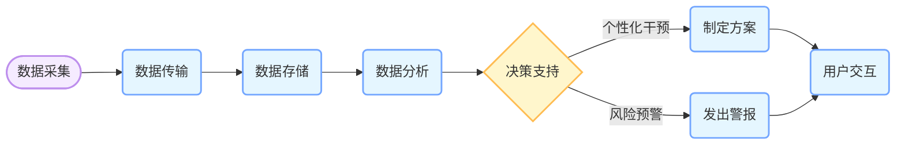

# AI辅助慢性病管理：从日常监测到个性化干预

> 关键词：AI、慢性病管理、日常监测、个性化干预、健康大数据

> 摘要：本文围绕AI辅助慢性病管理展开，深入探讨了从日常监测到个性化干预的整个过程。首先介绍了AI在慢性病管理中的背景和相关概念，阐述了其核心原理和算法。接着通过数学模型和公式对相关技术进行了详细讲解，并给出了具体的项目实战案例。还分析了AI在慢性病管理中的实际应用场景，推荐了相关的工具和资源。最后总结了未来发展趋势与挑战，解答了常见问题并提供了扩展阅读和参考资料，旨在为AI在慢性病管理领域的应用提供全面且深入的技术分析与指导。

## 1. 背景介绍 
### 1.1 目的和范围
慢性病已成为全球范围内严重威胁人类健康的公共卫生问题，如心血管疾病、糖尿病、慢性阻塞性肺疾病等。这些疾病通常具有病程长、病情复杂、需要长期管理等特点。传统的慢性病管理模式主要依赖于定期的医院复诊和患者的自我管理，但存在着信息获取不及时、管理方案缺乏个性化等问题。

本文的目的在于探讨如何利用人工智能（AI）技术来辅助慢性病管理，提高管理效率和质量，实现从日常监测到个性化干预的全流程优化。范围涵盖了AI在慢性病管理中的各个环节，包括数据采集、分析、决策支持以及个性化干预方案的制定等。

### 1.2 预期读者
本文预期读者包括医疗领域的专业人员，如医生、护士、健康管理师等，他们可以通过了解AI技术在慢性病管理中的应用，为患者提供更优质的服务；信息技术领域的开发者和研究人员，他们可以从技术角度深入了解AI在医疗健康领域的具体应用场景和实现方法；同时也适合对健康管理和AI技术感兴趣的普通大众，帮助他们了解AI如何改善慢性病管理。

### 1.3 文档结构概述
本文首先介绍了AI辅助慢性病管理的背景知识，包括目的、预期读者和文档结构。接着阐述了核心概念与联系，包括相关概念的原理和架构，并通过Mermaid流程图进行展示。然后详细讲解了核心算法原理和具体操作步骤，结合Python源代码进行说明。之后介绍了数学模型和公式，并举例说明。再通过项目实战，展示了代码实际案例和详细解释。随后分析了实际应用场景，推荐了相关的工具和资源。最后总结了未来发展趋势与挑战，解答了常见问题并提供了扩展阅读和参考资料。

### 1.4 术语表
#### 1.4.1 核心术语定义
- **人工智能（AI）**：指计算机系统能够执行通常需要人类智能才能完成的任务，如学习、推理、解决问题等。
- **慢性病**：是指不构成传染、具有长期积累形成疾病形态损害的疾病的总称，如冠心病、糖尿病、高血压等。
- **日常监测**：指对慢性病患者的生理指标、生活习惯等进行长期、持续的监测，如血压、血糖、运动步数等。
- **个性化干预**：根据患者的个体特征、疾病状态、生活习惯等因素，制定适合患者的个性化治疗和管理方案。
- **健康大数据**：包含了患者的电子病历、检查检验结果、健康监测数据等多源、异构的数据。

#### 1.4.2 相关概念解释
- **机器学习**：是AI的一个重要分支，通过算法让计算机从数据中学习模式和规律，从而进行预测和决策。
- **深度学习**：是机器学习的一种，通过构建多层神经网络，自动从大量数据中提取特征和模式，具有强大的建模能力。
- **物联网（IoT）**：通过各种传感器和设备，实现物体与物体之间的连接和数据传输，在慢性病管理中可用于实时监测患者的生理指标。

#### 1.4.3 缩略词列表
- **AI**：Artificial Intelligence（人工智能）
- **ML**：Machine Learning（机器学习）
- **DL**：Deep Learning（深度学习）
- **IoT**：Internet of Things（物联网）

## 2. 核心概念与联系 
### 核心概念原理
AI辅助慢性病管理的核心在于利用先进的信息技术和数据分析方法，整合患者的多源健康数据，通过机器学习和深度学习算法挖掘数据中的潜在信息，为慢性病的管理提供决策支持和个性化干预方案。

在日常监测方面，借助物联网技术，各种可穿戴设备（如智能手环、智能手表）和家用医疗设备（如血糖仪、血压计）可以实时采集患者的生理指标和生活习惯数据。这些数据通过网络传输到云端服务器，进行存储和预处理。

在数据分析和决策支持阶段，利用机器学习和深度学习算法对采集到的数据进行分析。例如，通过建立预测模型，预测患者疾病的发展趋势、并发症的发生风险等；通过分类模型，对患者的健康状态进行分类，如健康、疾病稳定、疾病恶化等。

在个性化干预方面，根据数据分析的结果，结合患者的个体特征和偏好，制定个性化的治疗方案、饮食计划、运动计划等。同时，通过智能提醒系统，及时提醒患者进行治疗和健康管理。

### 架构的文本示意图
AI辅助慢性病管理系统主要由以下几个部分组成：
1. **数据采集层**：包括各种可穿戴设备、家用医疗设备、医院信息系统等，负责采集患者的生理指标、生活习惯、病历信息等多源数据。
2. **数据传输层**：通过网络（如蓝牙、Wi-Fi、移动网络等）将采集到的数据传输到云端服务器。
3. **数据存储层**：采用数据库管理系统（如关系型数据库、非关系型数据库）对数据进行存储和管理。
4. **数据分析层**：利用机器学习和深度学习算法对存储的数据进行分析，挖掘数据中的潜在信息。
5. **决策支持层**：根据数据分析的结果，结合医学知识和专家经验，为医生和患者提供决策支持和个性化干预方案。
6. **用户交互层**：通过移动应用、网页等界面，实现医生与患者之间的信息交互和沟通。

### Mermaid流程图


## 3. 核心算法原理 & 具体操作步骤 
### 核心算法原理
在AI辅助慢性病管理中，常用的核心算法包括机器学习算法和深度学习算法。

#### 机器学习算法 - 逻辑回归
逻辑回归是一种常用的分类算法，用于预测事件发生的概率。在慢性病管理中，可以用于预测患者疾病的发生风险、并发症的发生概率等。

逻辑回归的基本原理是通过对输入特征进行线性组合，然后通过逻辑函数（也称为Sigmoid函数）将线性组合的结果映射到[0, 1]区间，得到事件发生的概率。

逻辑函数的定义为：
$$\sigma(z)=\frac{1}{1 + e^{-z}}$$
其中，$z$ 是输入特征的线性组合：
$$z = \theta_0 + \theta_1x_1 + \theta_2x_2 + \cdots + \theta_nx_n$$
$\theta_0, \theta_1, \cdots, \theta_n$ 是模型的参数，$x_1, x_2, \cdots, x_n$ 是输入特征。

逻辑回归的目标是通过最小化损失函数来估计模型的参数。常用的损失函数是对数损失函数：
$$L(\theta)=-\frac{1}{m}\sum_{i = 1}^{m}[y^{(i)}\log(\sigma(z^{(i)}))+(1 - y^{(i)})\log(1 - \sigma(z^{(i)}))]$$
其中，$m$ 是样本数量，$y^{(i)}$ 是第 $i$ 个样本的真实标签，$\sigma(z^{(i)})$ 是第 $i$ 个样本的预测概率。

#### 深度学习算法 - 卷积神经网络（CNN）
卷积神经网络是一种专门用于处理具有网格结构数据的深度学习算法，如图像、时间序列数据等。在慢性病管理中，可以用于对患者的医学影像数据（如X光、CT等）进行分析和诊断。

CNN的基本结构包括卷积层、池化层和全连接层。卷积层通过卷积核在输入数据上滑动，提取数据的特征；池化层用于对特征图进行下采样，减少数据的维度；全连接层用于将提取的特征映射到最终的输出类别。

### 具体操作步骤及Python源代码
#### 逻辑回归实现步骤
1. **数据准备**：加载数据集，将数据集分为训练集和测试集。
2. **模型训练**：使用训练集对逻辑回归模型进行训练，估计模型的参数。
3. **模型评估**：使用测试集对训练好的模型进行评估，计算模型的准确率、召回率等指标。

```python
import numpy as np
from sklearn.datasets import load_breast_cancer
from sklearn.model_selection import train_test_split
from sklearn.linear_model import LogisticRegression
from sklearn.metrics import accuracy_score

# 加载数据集
data = load_breast_cancer()
X = data.data
y = data.target

# 划分训练集和测试集
X_train, X_test, y_train, y_test = train_test_split(X, y, test_size=0.2, random_state=42)

# 创建逻辑回归模型
model = LogisticRegression()

# 模型训练
model.fit(X_train, y_train)

# 模型预测
y_pred = model.predict(X_test)

# 模型评估
accuracy = accuracy_score(y_test, y_pred)
print(f"模型准确率: {accuracy}")
```

#### 卷积神经网络实现步骤
1. **数据准备**：加载医学影像数据集，对数据进行预处理，如归一化、数据增强等。
2. **模型构建**：构建卷积神经网络模型，包括卷积层、池化层和全连接层。
3. **模型训练**：使用训练集对模型进行训练，优化模型的参数。
4. **模型评估**：使用测试集对训练好的模型进行评估，计算模型的准确率、召回率等指标。

```python
import tensorflow as tf
from tensorflow.keras.datasets import mnist
from tensorflow.keras.models import Sequential
from tensorflow.keras.layers import Conv2D, MaxPooling2D, Flatten, Dense
from tensorflow.keras.utils import to_categorical

# 加载数据集
(X_train, y_train), (X_test, y_test) = mnist.load_data()

# 数据预处理
X_train = X_train.reshape(-1, 28, 28, 1).astype('float32') / 255.0
X_test = X_test.reshape(-1, 28, 28, 1).astype('float32') / 255.0
y_train = to_categorical(y_train)
y_test = to_categorical(y_test)

# 构建卷积神经网络模型
model = Sequential([
    Conv2D(32, (3, 3), activation='relu', input_shape=(28, 28, 1)),
    MaxPooling2D((2, 2)),
    Conv2D(64, (3, 3), activation='relu'),
    MaxPooling2D((2, 2)),
    Flatten(),
    Dense(64, activation='relu'),
    Dense(10, activation='softmax')
])

# 编译模型
model.compile(optimizer='adam',
              loss='categorical_crossentropy',
              metrics=['accuracy'])

# 模型训练
model.fit(X_train, y_train, epochs=5, batch_size=64)

# 模型评估
test_loss, test_acc = model.evaluate(X_test, y_test)
print(f"模型准确率: {test_acc}")
```

## 4. 数学模型和公式 & 详细讲解 & 举例说明 
### 逻辑回归数学模型和公式详细讲解
逻辑回归的数学模型基于逻辑函数，其核心是将输入特征的线性组合通过逻辑函数映射到概率值。

#### 线性组合
如前面所述，输入特征的线性组合为：
$$z = \theta_0 + \theta_1x_1 + \theta_2x_2 + \cdots + \theta_nx_n$$
其中，$\theta_0$ 是截距项，$\theta_1, \theta_2, \cdots, \theta_n$ 是特征的权重，$x_1, x_2, \cdots, x_n$ 是输入特征。

线性组合的作用是将输入特征进行加权求和，得到一个数值 $z$，这个数值表示输入特征对事件发生的综合影响。

#### 逻辑函数
逻辑函数 $\sigma(z)$ 将线性组合的结果 $z$ 映射到[0, 1]区间，得到事件发生的概率：
$$\sigma(z)=\frac{1}{1 + e^{-z}}$$
逻辑函数的特点是当 $z$ 趋近于正无穷时，$\sigma(z)$ 趋近于1；当 $z$ 趋近于负无穷时，$\sigma(z)$ 趋近于0。这使得逻辑回归可以用于二分类问题，将输入特征映射到事件发生的概率。

#### 损失函数
逻辑回归使用对数损失函数来衡量模型预测结果与真实标签之间的差异：
$$L(\theta)=-\frac{1}{m}\sum_{i = 1}^{m}[y^{(i)}\log(\sigma(z^{(i)}))+(1 - y^{(i)})\log(1 - \sigma(z^{(i)}))]$$
其中，$m$ 是样本数量，$y^{(i)}$ 是第 $i$ 个样本的真实标签（0或1），$\sigma(z^{(i)})$ 是第 $i$ 个样本的预测概率。

对数损失函数的特点是当预测概率与真实标签接近时，损失值较小；当预测概率与真实标签相差较大时，损失值较大。通过最小化损失函数，可以使模型的预测结果更接近真实标签。

### 举例说明
假设我们要预测患者是否患有糖尿病，我们有两个输入特征：年龄和血糖水平。我们可以使用逻辑回归模型来预测患者患糖尿病的概率。

设年龄为 $x_1$，血糖水平为 $x_2$，模型的参数为 $\theta_0 = -5$，$\theta_1 = 0.1$，$\theta_2 = 0.2$。

对于一个年龄为40岁，血糖水平为120的患者，其线性组合为：
$$z = -5 + 0.1\times40 + 0.2\times120 = -5 + 4 + 24 = 23$$
通过逻辑函数计算其患糖尿病的概率为：
$$\sigma(z)=\frac{1}{1 + e^{-23}}\approx1$$
这表明该患者患糖尿病的概率非常高。

### 卷积神经网络数学模型和公式详细讲解
#### 卷积层
卷积层是CNN的核心层，其主要作用是提取输入数据的特征。卷积层通过卷积核在输入数据上滑动，进行卷积操作，得到特征图。

卷积操作的数学公式为：
$$y_{i,j}^k=\sum_{m = 0}^{M - 1}\sum_{n = 0}^{N - 1}x_{i + m,j + n}^l\times w_{m,n}^{l,k}+b^k$$
其中，$y_{i,j}^k$ 是第 $k$ 个特征图中第 $(i, j)$ 位置的元素，$x_{i + m,j + n}^l$ 是输入数据中第 $l$ 个通道的元素，$w_{m,n}^{l,k}$ 是卷积核中第 $(m, n)$ 位置的元素，$b^k$ 是偏置项，$M$ 和 $N$ 是卷积核的大小。

#### 池化层
池化层用于对特征图进行下采样，减少数据的维度，同时保留重要的特征信息。常用的池化操作有最大池化和平均池化。

最大池化的数学公式为：
$$y_{i,j}^k=\max_{m,n\in\mathcal{R}}x_{i\times s + m,j\times s + n}^k$$
其中，$y_{i,j}^k$ 是池化后第 $k$ 个特征图中第 $(i, j)$ 位置的元素，$x_{i\times s + m,j\times s + n}^k$ 是输入特征图中第 $k$ 个通道的元素，$\mathcal{R}$ 是池化窗口，$s$ 是步长。

#### 全连接层
全连接层将卷积层和池化层提取的特征映射到最终的输出类别。全连接层的数学公式与普通的神经网络层相同：
$$z_j=\sum_{i = 1}^{n}w_{ij}x_i + b_j$$
其中，$z_j$ 是第 $j$ 个神经元的输出，$w_{ij}$ 是连接第 $i$ 个输入神经元和第 $j$ 个输出神经元的权重，$x_i$ 是第 $i$ 个输入神经元的输出，$b_j$ 是偏置项。

### 举例说明
假设我们有一个输入图像的大小为 $32\times32\times3$（高度 $\times$ 宽度 $\times$ 通道数），使用一个大小为 $3\times3\times3$ 的卷积核进行卷积操作，步长为1，填充为0。

卷积核在输入图像上滑动，进行卷积操作，得到一个特征图。假设卷积核的权重为 $w_{m,n}^{l,k}$，输入图像的元素为 $x_{i + m,j + n}^l$，则特征图的元素 $y_{i,j}^k$ 可以通过上述卷积操作的公式计算得到。

经过卷积层后，我们可以使用最大池化层对特征图进行下采样。假设使用一个大小为 $2\times2$ 的池化窗口，步长为2，则池化后特征图的大小将变为原来的一半。

最后，将池化后的特征图展平，输入到全连接层，通过全连接层的计算得到最终的输出类别。

## 5. 项目实战：代码实际案例和详细解释说明 
### 5.1  开发环境搭建
#### 操作系统
可以选择Windows、Linux或macOS操作系统。建议使用Linux系统，如Ubuntu，因为Linux系统在开发和部署机器学习和深度学习项目时具有更好的兼容性和性能。

#### 编程语言
使用Python作为开发语言，Python具有丰富的机器学习和深度学习库，如TensorFlow、PyTorch、Scikit-learn等。

#### 开发工具
可以使用Anaconda来管理Python环境和安装相关的库。Anaconda是一个开源的Python发行版本，包含了许多常用的科学计算和数据分析库。

安装Anaconda后，可以创建一个新的虚拟环境，并安装所需的库：
```bash
# 创建虚拟环境
conda create -n ai_chronic_disease python=3.8

# 激活虚拟环境
conda activate ai_chronic_disease

# 安装所需库
conda install tensorflow scikit-learn pandas numpy matplotlib
```

### 5.2  源代码详细实现和代码解读
#### 数据采集与预处理
假设我们使用一个模拟的糖尿病数据集，包含患者的年龄、BMI、血压等特征，以及是否患有糖尿病的标签。

```python
import pandas as pd
from sklearn.preprocessing import StandardScaler
from sklearn.model_selection import train_test_split

# 加载数据集
data = pd.read_csv('diabetes.csv')

# 分离特征和标签
X = data.drop('Outcome', axis=1)
y = data['Outcome']

# 数据标准化
scaler = StandardScaler()
X_scaled = scaler.fit_transform(X)

# 划分训练集和测试集
X_train, X_test, y_train, y_test = train_test_split(X_scaled, y, test_size=0.2, random_state=42)
```
代码解读：
- 首先使用 `pandas` 库加载糖尿病数据集。
- 然后将特征和标签分离，`X` 表示特征，`y` 表示标签。
- 使用 `StandardScaler` 对特征数据进行标准化处理，将特征数据的均值变为0，标准差变为1，有助于提高模型的训练效果。
- 最后使用 `train_test_split` 函数将数据集划分为训练集和测试集，测试集占比为20%。

#### 模型训练与评估
```python
from sklearn.linear_model import LogisticRegression
from sklearn.metrics import accuracy_score, classification_report

# 创建逻辑回归模型
model = LogisticRegression()

# 模型训练
model.fit(X_train, y_train)

# 模型预测
y_pred = model.predict(X_test)

# 模型评估
accuracy = accuracy_score(y_test, y_pred)
print(f"模型准确率: {accuracy}")

# 分类报告
print(classification_report(y_test, y_pred))
```
代码解读：
- 首先创建一个逻辑回归模型 `LogisticRegression`。
- 使用训练集对模型进行训练，调用 `fit` 方法。
- 使用训练好的模型对测试集进行预测，调用 `predict` 方法。
- 使用 `accuracy_score` 函数计算模型的准确率，使用 `classification_report` 函数生成分类报告，包含准确率、召回率、F1值等指标。

### 5.3  代码解读与分析
#### 数据预处理的重要性
数据预处理是机器学习和深度学习项目中非常重要的一步。在本案例中，我们对特征数据进行了标准化处理，这是因为不同特征的取值范围可能差异很大，如果不进行标准化处理，模型可能会更倾向于取值范围较大的特征，从而影响模型的训练效果。

#### 模型选择与评估
在本案例中，我们选择了逻辑回归模型，逻辑回归是一种简单而有效的分类算法，适用于二分类问题。通过计算模型的准确率和分类报告，我们可以评估模型的性能。准确率可以反映模型预测正确的样本占总样本的比例，分类报告可以提供更详细的性能指标，如召回率、F1值等，有助于我们全面了解模型的性能。

#### 模型优化的方向
如果模型的性能不理想，我们可以考虑以下优化方向：
- **特征工程**：尝试选择更有代表性的特征，或者对特征进行组合和变换，以提高模型的性能。
- **模型选择**：尝试使用其他机器学习或深度学习模型，如决策树、随机森林、神经网络等，比较不同模型的性能。
- **超参数调优**：使用网格搜索、随机搜索等方法，对模型的超参数进行调优，以找到最优的模型参数。

## 6. 实际应用场景 
### 日常监测
AI辅助慢性病管理在日常监测方面具有广泛的应用。通过可穿戴设备和家用医疗设备，患者可以实时监测自己的生理指标，如心率、血压、血糖等。这些数据可以通过网络传输到云端服务器，AI系统可以对数据进行实时分析，及时发现异常情况并发出警报。

例如，对于糖尿病患者，智能血糖仪可以实时采集患者的血糖数据，并将数据上传到手机应用或云端平台。AI系统可以根据患者的历史血糖数据和个体特征，分析血糖的变化趋势，预测低血糖或高血糖的发生风险，并及时提醒患者采取相应的措施，如调整饮食、增加运动或注射胰岛素等。

### 疾病风险预测
AI可以利用患者的多源健康数据，如电子病历、检查检验结果、生活习惯等，建立疾病风险预测模型。通过对大量数据的学习和分析，模型可以预测患者患某种慢性病的风险，如心血管疾病、癌症等。

例如，通过分析患者的年龄、性别、家族病史、血压、血脂、吸烟史等因素，AI系统可以预测患者患冠心病的风险。医生可以根据预测结果，为患者制定个性化的预防措施，如调整饮食、增加运动、定期体检等，降低患者患冠心病的风险。

### 个性化干预方案制定
AI可以根据患者的个体特征、疾病状态、生活习惯等因素，制定个性化的干预方案。例如，对于高血压患者，AI系统可以根据患者的血压水平、年龄、性别、并发症等因素，制定个性化的降压治疗方案，包括药物选择、剂量调整等。

同时，AI系统还可以为患者制定个性化的饮食计划和运动计划。根据患者的身体状况、饮食习惯和运动能力，推荐适合患者的食物和运动方式，并设置合理的目标和计划。例如，对于肥胖的糖尿病患者，AI系统可以推荐低糖、低脂、高纤维的饮食方案，以及适合患者的有氧运动计划，如散步、慢跑、游泳等。

### 远程医疗服务
AI辅助慢性病管理还可以支持远程医疗服务。通过视频通话、远程监测等技术，医生可以远程为患者提供医疗服务，如诊断、治疗、健康指导等。

例如，患者可以通过手机应用与医生进行视频通话，医生可以实时查看患者的生理指标和症状，进行诊断和治疗。同时，AI系统可以辅助医生进行决策，提供相关的医学知识和参考建议。对于一些病情稳定的患者，医生可以通过远程医疗服务进行定期随访，及时了解患者的病情变化，调整治疗方案。

## 7. 工具和资源推荐
### 7.1 学习资源推荐
#### 7.1.1 书籍推荐
- 《Python机器学习》：本书介绍了Python在机器学习中的应用，包括各种机器学习算法的原理和实现，以及如何使用Python库进行数据预处理、模型训练和评估。
- 《深度学习》：由深度学习领域的三位先驱Ian Goodfellow、Yoshua Bengio和Aaron Courville撰写，是深度学习领域的经典教材，全面介绍了深度学习的理论和实践。
- 《医疗大数据与人工智能》：本书结合医疗领域的实际应用，介绍了大数据和人工智能在医疗健康领域的应用，包括数据采集、分析、挖掘和决策支持等方面。

#### 7.1.2 在线课程
- Coursera上的“机器学习”课程：由斯坦福大学的Andrew Ng教授讲授，是机器学习领域的经典课程，介绍了机器学习的基本概念、算法和应用。
- edX上的“深度学习”课程：由微软和伯克利大学联合推出，介绍了深度学习的理论和实践，包括卷积神经网络、循环神经网络等。
- 中国大学MOOC上的“医疗大数据与人工智能”课程：介绍了医疗大数据和人工智能的基本概念、技术和应用，结合医疗领域的实际案例进行讲解。

#### 7.1.3 技术博客和网站
- Towards Data Science：是一个专注于数据科学和机器学习的技术博客，提供了许多高质量的技术文章和教程。
- Medium上的AI相关博客：Medium上有许多AI领域的优秀博客，如OpenAI、Google AI等，分享了最新的研究成果和技术应用。
- 丁香园：是一个专业的医疗健康网站，提供了丰富的医学知识和临床案例，对于了解医疗领域的需求和应用场景非常有帮助。

### 7.2 开发工具框架推荐
#### 7.2.1 IDE和编辑器
- PyCharm：是一款专门为Python开发设计的集成开发环境（IDE），具有代码编辑、调试、自动完成等功能，支持多种Python库和框架。
- Jupyter Notebook：是一个交互式的开发环境，适合进行数据探索、模型训练和可视化等工作。可以在浏览器中直接编写和运行Python代码，方便展示和分享。
- Visual Studio Code：是一款轻量级的代码编辑器，支持多种编程语言和插件，具有丰富的扩展功能，可以用于Python开发。

#### 7.2.2 调试和性能分析工具
- TensorBoard：是TensorFlow提供的一个可视化工具，可以用于查看模型的训练过程、损失函数的变化、模型的结构等信息，帮助开发者进行调试和优化。
- PyTorch Profiler：是PyTorch提供的一个性能分析工具，可以用于分析模型的运行时间、内存使用情况等，帮助开发者找出性能瓶颈。
- Scikit-learn的交叉验证工具：Scikit-learn提供了一些交叉验证工具，如`GridSearchCV`和`RandomizedSearchCV`，可以用于模型的超参数调优和性能评估。

#### 7.2.3 相关框架和库
- TensorFlow：是一个开源的机器学习和深度学习框架，由Google开发，提供了丰富的工具和库，支持多种深度学习模型的开发和训练。
- PyTorch：是一个开源的深度学习框架，由Facebook开发，具有动态图的特点，适合进行快速迭代和实验。
- Scikit-learn：是一个开源的机器学习库，提供了各种机器学习算法和工具，如分类、回归、聚类等，适合进行机器学习模型的开发和评估。

### 7.3 相关论文著作推荐
#### 7.3.1 经典论文
- “Deep Residual Learning for Image Recognition”：提出了残差网络（ResNet），解决了深度学习中梯度消失和梯度爆炸的问题，在图像识别领域取得了很好的效果。
- “Attention Is All You Need”：提出了Transformer模型，引入了注意力机制，在自然语言处理领域取得了很大的突破。
- “A Survey on Machine Learning in Healthcare”：对机器学习在医疗健康领域的应用进行了全面的综述，包括疾病诊断、治疗预测、药物研发等方面。

#### 7.3.2 最新研究成果
- 关注顶级学术会议，如NeurIPS（神经信息处理系统大会）、ICML（国际机器学习会议）、KDD（知识发现与数据挖掘会议）等，这些会议上发表的论文通常代表了该领域的最新研究成果。
- 关注顶级学术期刊，如《Nature Medicine》、《The Lancet》、《Journal of the American Medical Informatics Association》等，这些期刊上发表的论文通常具有较高的学术水平和影响力。

#### 7.3.3 应用案例分析
- 可以参考一些实际的AI辅助慢性病管理项目案例，如IBM Watson for Oncology在肿瘤治疗中的应用、Google DeepMind在糖尿病管理中的应用等。这些案例可以帮助我们了解AI技术在实际应用中的具体实现方法和效果。

## 8. 总结：未来发展趋势与挑战
### 未来发展趋势
#### 多模态数据融合
未来，AI辅助慢性病管理将越来越多地融合多模态数据，如生理指标数据、医学影像数据、基因数据、生活习惯数据等。通过对多模态数据的综合分析，可以更全面地了解患者的健康状况，提高疾病诊断和治疗的准确性。

#### 个性化医疗的深入发展
随着AI技术的不断进步，个性化医疗将得到更深入的发展。AI系统将能够根据患者的个体特征、疾病状态、基因信息等因素，制定更加个性化的治疗方案和健康管理计划。同时，AI还可以为患者提供个性化的健康建议和预警，帮助患者更好地管理自己的健康。

#### 与物联网和区块链技术的结合
AI与物联网技术的结合将使慢性病管理更加智能化和实时化。通过物联网设备，如可穿戴设备、家用医疗设备等，可以实时采集患者的生理指标和生活习惯数据，并将数据传输到云端服务器进行分析。同时，区块链技术可以保证数据的安全性和隐私性，提高患者对数据共享的信任度。

#### 医疗机器人的应用
未来，医疗机器人将在慢性病管理中发挥越来越重要的作用。例如，手术机器人可以进行精确的手术操作，康复机器人可以帮助患者进行康复训练，护理机器人可以为患者提供日常生活护理服务。AI技术可以为医疗机器人提供智能决策和控制，提高医疗机器人的性能和效率。

### 挑战
#### 数据隐私和安全问题
AI辅助慢性病管理涉及大量的患者个人健康数据，这些数据包含了患者的敏感信息，如疾病诊断、治疗方案、基因信息等。因此，数据隐私和安全问题是AI在慢性病管理中面临的重要挑战。需要采取有效的技术和管理措施，确保患者数据的安全性和隐私性，防止数据泄露和滥用。

#### 算法可解释性问题
AI算法，尤其是深度学习算法，通常被认为是“黑匣子”，其决策过程难以解释。在医疗领域，算法的可解释性非常重要，医生和患者需要了解算法的决策依据，才能信任和接受AI系统的建议和决策。因此，如何提高AI算法的可解释性是一个亟待解决的问题。

#### 医学伦理和法律问题
AI辅助慢性病管理涉及到许多医学伦理和法律问题，如患者的知情权、自主权、隐私权等。同时，当AI系统出现错误或失误时，责任的界定和承担也是一个复杂的问题。需要建立健全的医学伦理和法律规范，保障患者的合法权益，促进AI技术在医疗领域的健康发展。

#### 技术普及和人才短缺问题
虽然AI技术在慢性病管理中具有巨大的潜力，但目前在实际应用中还面临着技术普及和人才短缺的问题。许多医疗机构和患者对AI技术的了解和接受程度较低，缺乏相关的技术和设备支持。同时，AI在医疗领域的应用需要既懂医学又懂AI技术的复合型人才，目前这类人才非常短缺。

## 9. 附录：常见问题与解答
### 1. AI在慢性病管理中的应用是否会取代医生？
不会。AI在慢性病管理中主要起到辅助作用，帮助医生更高效地进行疾病诊断、治疗方案制定和健康管理。医生的专业知识、临床经验和人文关怀是AI无法替代的。AI系统可以为医生提供决策支持和参考建议，但最终的诊断和治疗决策仍需要医生根据患者的具体情况进行判断。

### 2. AI算法的准确性如何保证？
AI算法的准确性可以通过以下几个方面来保证：
- **数据质量**：使用高质量、准确、完整的数据进行模型训练，数据的质量直接影响模型的性能。
- **模型选择和优化**：选择合适的模型，并对模型进行优化，如调整超参数、进行特征工程等。
- **交叉验证和评估**：使用交叉验证和多种评估指标对模型进行评估，确保模型的泛化能力和准确性。
- **持续更新和改进**：随着数据的不断积累和医学知识的不断更新，对模型进行持续更新和改进，提高模型的准确性。

### 3. 患者的个人健康数据如何保证安全？
为了保证患者的个人健康数据安全，可以采取以下措施：
- **数据加密**：对患者的个人健康数据进行加密处理，确保数据在传输和存储过程中的安全性。
- **访问控制**：建立严格的访问控制机制，只有授权的人员才能访问患者的个人健康数据。
- **匿名化处理**：在数据使用和共享过程中，对患者的个人信息进行匿名化处理，保护患者的隐私。
- **合规性管理**：遵守相关的法律法规和行业标准，如《网络安全法》、《健康医疗大数据应用发展的指导意见》等，确保数据的安全和合规使用。

### 4. AI技术在慢性病管理中的应用成本高吗？
AI技术在慢性病管理中的应用成本因具体应用场景和技术方案而异。初期可能需要投入一定的成本用于设备采购、系统开发和人员培训等。但从长期来看，AI技术可以提高慢性病管理的效率和质量，降低医疗成本。例如，通过早期疾病风险预测和个性化干预，可以减少患者的住院次数和医疗费用。同时，随着技术的不断发展和普及，AI技术的应用成本也会逐渐降低。

## 10. 扩展阅读 & 参考资料
### 扩展阅读
- 《人工智能时代的医疗革命》：探讨了AI技术在医疗领域的应用和发展趋势，以及对医疗行业的影响。
- 《未来医疗：数据驱动的个性化医疗》：介绍了数据驱动的个性化医疗的概念、技术和应用，以及如何通过AI技术实现个性化医疗。
- 《医疗物联网：从概念到实践》：介绍了医疗物联网的概念、技术和应用，以及如何通过物联网技术实现慢性病的远程监测和管理。

### 参考资料
- 相关学术论文和研究报告，如IEEE、ACM等学术会议和期刊上发表的关于AI在医疗健康领域的研究论文。
- 相关政策文件和行业标准，如国家卫生健康委员会发布的《健康医疗大数据应用发展的指导意见》、《医疗物联网信息安全技术要求》等。
- 相关技术文档和官方网站，如TensorFlow、PyTorch等框架的官方文档和网站。

作者：AI天才研究院/AI Genius Institute & 禅与计算机程序设计艺术 /Zen And The Art of Computer Programming