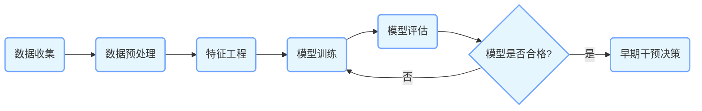

# AI辅助慢性病风险预测：从生活方式分析到早期干预

> 关键词：AI、慢性病风险预测、生活方式分析、早期干预、机器学习

> 摘要：本文聚焦于AI在慢性病风险预测领域的应用，详细阐述了从生活方式分析到早期干预的全过程。首先介绍了研究背景，包括目的、预期读者、文档结构等内容。接着深入讲解核心概念与联系，通过文本示意图和Mermaid流程图呈现相关原理和架构。然后剖析核心算法原理，使用Python代码详细阐述具体操作步骤，并给出对应的数学模型和公式。通过项目实战展示代码实际案例并进行详细解释说明。探讨了AI在慢性病风险预测中的实际应用场景，推荐了相关的工具和资源。最后总结未来发展趋势与挑战，解答常见问题，并提供扩展阅读和参考资料，旨在为推动AI在慢性病风险预测与早期干预方面的应用提供全面而深入的参考。

## 1. 背景介绍 
### 1.1 目的和范围
随着全球人口老龄化的加剧以及生活方式的改变，慢性病的发病率呈现出逐年上升的趋势。慢性病如心血管疾病、糖尿病、癌症等不仅严重影响患者的生活质量，还给社会和家庭带来了沉重的经济负担。传统的慢性病风险预测方法往往依赖于有限的临床指标和经验判断，存在预测准确性低、缺乏个性化等问题。

本研究的目的在于探索如何利用AI技术，结合个体的生活方式信息，实现更精准、个性化的慢性病风险预测，并在此基础上提出有效的早期干预措施。研究范围涵盖了常见慢性病的风险因素分析、生活方式数据的收集与处理、AI算法的选择与优化、早期干预策略的制定等方面。

### 1.2 预期读者
本文的预期读者包括医学领域的研究人员、临床医生、公共卫生工作者，他们可以从中了解AI在慢性病防治中的应用潜力，为实际工作提供新的思路和方法；计算机科学领域的研究人员和开发者，可借鉴其中的算法原理和技术实现，开展相关的研究和开发工作；同时也适合对健康管理和AI技术感兴趣的普通读者，帮助他们更好地理解慢性病风险预测和早期干预的重要性和实现方式。

### 1.3 文档结构概述
本文共分为十个部分。第一部分为背景介绍，阐述研究的目的、预期读者和文档结构。第二部分讲解核心概念与联系，包括相关概念的原理和架构。第三部分介绍核心算法原理及具体操作步骤，使用Python代码进行详细阐述。第四部分给出数学模型和公式，并进行详细讲解和举例说明。第五部分通过项目实战展示代码实际案例并进行详细解释。第六部分探讨实际应用场景。第七部分推荐相关的工具和资源。第八部分总结未来发展趋势与挑战。第九部分为附录，解答常见问题。第十部分提供扩展阅读和参考资料。

### 1.4 术语表
#### 1.4.1 核心术语定义
- **AI（Artificial Intelligence）**：即人工智能，是指通过计算机模拟人类智能的技术和方法，包括机器学习、深度学习、自然语言处理等。
- **慢性病（Chronic Disease）**：是指长期存在的、不能自愈且很难完全治愈的疾病，如心血管疾病、糖尿病、癌症等。
- **风险预测（Risk Prediction）**：是指根据个体的特征和相关信息，对其未来发生某种疾病的可能性进行评估和预测。
- **生活方式（Lifestyle）**：是指人们在日常生活中所采取的行为模式和习惯，包括饮食、运动、吸烟、饮酒等。
- **早期干预（Early Intervention）**：是指在疾病尚未发生或处于早期阶段时，采取相应的措施进行预防和治疗，以降低疾病的发生率和严重程度。

#### 1.4.2 相关概念解释
- **机器学习（Machine Learning）**：是AI的一个重要分支，它通过让计算机从数据中学习模式和规律，从而实现对未知数据的预测和分类。
- **深度学习（Deep Learning）**：是机器学习的一种特殊形式，它使用多层神经网络来自动提取数据中的特征和模式，具有强大的学习能力和预测性能。
- **特征工程（Feature Engineering）**：是指从原始数据中提取和选择有用的特征，以提高模型的性能和预测准确性。
- **模型评估（Model Evaluation）**：是指使用各种指标和方法对训练好的模型进行评估和比较，以选择最优的模型。

#### 1.4.3 缩略词列表
- **AI**：Artificial Intelligence（人工智能）
- **ML**：Machine Learning（机器学习）
- **DL**：Deep Learning（深度学习）
- **BMI**：Body Mass Index（身体质量指数）
- **BP**：Blood Pressure（血压）

## 2. 核心概念与联系 
### 核心概念原理和架构的文本示意图
在AI辅助慢性病风险预测的系统中，主要涉及以下几个核心部分：数据收集、数据预处理、特征工程、模型训练、模型评估和早期干预决策。

数据收集阶段，需要收集个体的生活方式数据（如饮食、运动、吸烟、饮酒等）、临床数据（如血压、血糖、血脂等）以及人口统计学数据（如年龄、性别、种族等）。这些数据来源广泛，包括问卷调查、体检报告、可穿戴设备等。

数据预处理阶段，对收集到的原始数据进行清洗、转换和归一化等操作，以消除数据中的噪声和异常值，提高数据的质量和一致性。

特征工程阶段，从预处理后的数据中提取和选择有用的特征，这些特征将作为模型的输入。特征的选择和提取需要结合医学知识和领域经验，以确保特征的相关性和有效性。

模型训练阶段，选择合适的机器学习或深度学习算法，使用训练数据对模型进行训练。训练的目标是使模型能够学习到数据中的模式和规律，从而对慢性病的风险进行准确预测。

模型评估阶段，使用测试数据对训练好的模型进行评估，计算各种评估指标（如准确率、召回率、F1值等），以评估模型的性能和预测准确性。

早期干预决策阶段，根据模型的预测结果，结合医学知识和临床经验，制定个性化的早期干预措施，如健康建议、饮食调整、运动计划等。

### Mermaid流程图


## 3. 核心算法原理 & 具体操作步骤 
### 算法原理讲解
在AI辅助慢性病风险预测中，常用的算法包括逻辑回归、决策树、随机森林、支持向量机和深度学习算法（如神经网络）等。这里以逻辑回归算法为例进行详细讲解。

逻辑回归是一种常用的分类算法，它通过对输入特征进行线性组合，然后使用逻辑函数将线性组合的结果映射到[0, 1]区间，从而得到一个概率值。这个概率值可以表示样本属于某个类别的可能性。

逻辑回归的基本原理如下：
假设输入特征为 $x = (x_1, x_2, \cdots, x_n)$，对应的权重为 $w = (w_1, w_2, \cdots, w_n)$，偏置为 $b$，则线性组合的结果为：
$$z = w_1x_1 + w_2x_2 + \cdots + w_nx_n + b = \sum_{i=1}^{n}w_ix_i + b$$

然后使用逻辑函数（也称为Sigmoid函数）将 $z$ 映射到[0, 1]区间：
$$\sigma(z) = \frac{1}{1 + e^{-z}}$$

$\sigma(z)$ 表示样本属于正类别的概率，即 $P(y = 1|x) = \sigma(z)$，则样本属于负类别的概率为 $P(y = 0|x) = 1 - \sigma(z)$。

逻辑回归的目标是找到一组最优的权重 $w$ 和偏置 $b$，使得模型对训练数据的预测结果与真实标签之间的误差最小。通常使用最大似然估计来求解最优的 $w$ 和 $b$。

### 具体操作步骤及Python源代码
以下是使用Python实现逻辑回归算法进行慢性病风险预测的具体步骤和代码：

```python
import numpy as np
from sklearn.model_selection import train_test_split
from sklearn.linear_model import LogisticRegression
from sklearn.metrics import accuracy_score, recall_score, f1_score

# 1. 数据准备
# 假设我们有一个包含特征和标签的数据集 X 和 y
# X 是特征矩阵，每一行表示一个样本，每一列表示一个特征
# y 是标签向量，0 表示未患慢性病，1 表示患慢性病
# 这里使用随机生成的数据作为示例
np.random.seed(42)
X = np.random.randn(1000, 10)
y = np.random.randint(0, 2, 1000)

# 2. 数据划分
# 将数据集划分为训练集和测试集，比例为 8:2
X_train, X_test, y_train, y_test = train_test_split(X, y, test_size=0.2, random_state=42)

# 3. 模型训练
# 创建逻辑回归模型
model = LogisticRegression()
# 使用训练数据对模型进行训练
model.fit(X_train, y_train)

# 4. 模型预测
# 使用训练好的模型对测试数据进行预测
y_pred = model.predict(X_test)

# 5. 模型评估
# 计算准确率、召回率和 F1 值
accuracy = accuracy_score(y_test, y_pred)
recall = recall_score(y_test, y_pred)
f1 = f1_score(y_test, y_pred)

print(f"准确率: {accuracy}")
print(f"召回率: {recall}")
print(f"F1 值: {f1}")
```

在上述代码中，首先使用 `numpy` 生成随机数据作为示例数据集。然后使用 `train_test_split` 函数将数据集划分为训练集和测试集。接着创建逻辑回归模型并使用训练数据进行训练。最后使用训练好的模型对测试数据进行预测，并计算准确率、召回率和 F1 值来评估模型的性能。

## 4. 数学模型和公式 & 详细讲解 & 举例说明 
### 逻辑回归的数学模型和公式
逻辑回归的数学模型可以表示为：
$$P(y = 1|x) = \frac{1}{1 + e^{-(w^Tx + b)}}$$
其中，$x$ 是输入特征向量，$w$ 是权重向量，$b$ 是偏置，$y$ 是标签（0 或 1）。

逻辑回归的损失函数通常使用对数损失函数（也称为交叉熵损失函数），其公式为：
$$L(w, b) = -\frac{1}{m}\sum_{i=1}^{m}[y^{(i)}\log(P(y^{(i)} = 1|x^{(i)})) + (1 - y^{(i)})\log(1 - P(y^{(i)} = 1|x^{(i)}))]$$
其中，$m$ 是样本数量，$y^{(i)}$ 是第 $i$ 个样本的真实标签，$P(y^{(i)} = 1|x^{(i)})$ 是第 $i$ 个样本属于正类别的概率。

### 详细讲解
对数损失函数的作用是衡量模型的预测结果与真实标签之间的差异。当预测结果与真实标签完全一致时，损失函数的值为 0；当预测结果与真实标签相差较大时，损失函数的值会增大。

逻辑回归的目标是找到一组最优的权重 $w$ 和偏置 $b$，使得损失函数 $L(w, b)$ 最小。通常使用梯度下降法来求解最优的 $w$ 和 $b$。

梯度下降法的基本思想是：从一个初始的权重和偏置开始，通过不断地更新权重和偏置，使得损失函数的值逐渐减小，直到达到最小值或满足一定的停止条件。

权重和偏置的更新公式为：
$$w := w - \alpha\frac{\partial L(w, b)}{\partial w}$$
$$b := b - \alpha\frac{\partial L(w, b)}{\partial b}$$
其中，$\alpha$ 是学习率，控制每次更新的步长。

### 举例说明
假设我们有一个简单的二分类问题，输入特征只有一个 $x$，真实标签为 $y$。初始权重 $w = 0$，偏置 $b = 0$，学习率 $\alpha = 0.1$。

数据集如下：
| $x$ | $y$ |
|---|---|
| 1 | 1 |
| 2 | 1 |
| 3 | 0 |

首先计算 $P(y = 1|x)$：
$$P(y = 1|x) = \frac{1}{1 + e^{-(w x + b)}}$$

然后计算损失函数 $L(w, b)$：
$$L(w, b) = -\frac{1}{3}[(1\log(P(y = 1|1)) + (1 - 1)\log(1 - P(y = 1|1))) + (1\log(P(y = 1|2)) + (1 - 1)\log(1 - P(y = 1|2))) + (0\log(P(y = 1|3)) + (1 - 0)\log(1 - P(y = 1|3)))]$$

接着计算 $\frac{\partial L(w, b)}{\partial w}$ 和 $\frac{\partial L(w, b)}{\partial b}$，并根据更新公式更新 $w$ 和 $b$。

重复上述步骤，直到损失函数的值不再减小或满足停止条件。

## 5. 项目实战：代码实际案例和详细解释说明 
### 5.1  开发环境搭建
为了实现AI辅助慢性病风险预测的项目，我们需要搭建相应的开发环境。以下是具体的步骤：

1. **安装Python**：建议使用Python 3.7及以上版本。可以从Python官方网站（https://www.python.org/downloads/）下载并安装。
2. **安装必要的库**：使用 `pip` 或 `conda` 安装以下必要的库：
    - `numpy`：用于数值计算。
    - `pandas`：用于数据处理和分析。
    - `scikit-learn`：用于机器学习算法的实现。
    - `matplotlib`：用于数据可视化。

示例命令：
```sh
pip install numpy pandas scikit-learn matplotlib
```

### 5.2  源代码详细实现和代码解读
以下是一个完整的项目实战代码示例，使用随机森林算法进行慢性病风险预测：

```python
import numpy as np
import pandas as pd
from sklearn.model_selection import train_test_split
from sklearn.ensemble import RandomForestClassifier
from sklearn.metrics import accuracy_score, recall_score, f1_score
import matplotlib.pyplot as plt

# 1. 数据加载
# 假设我们有一个 CSV 文件包含慢性病相关数据
data = pd.read_csv('chronic_disease_data.csv')

# 2. 数据预处理
# 分离特征和标签
X = data.drop('label', axis=1)
y = data['label']

# 处理缺失值
X = X.fillna(X.mean())

# 3. 数据划分
# 将数据集划分为训练集和测试集，比例为 8:2
X_train, X_test, y_train, y_test = train_test_split(X, y, test_size=0.2, random_state=42)

# 4. 模型训练
# 创建随机森林分类器
model = RandomForestClassifier(n_estimators=100, random_state=42)
# 使用训练数据对模型进行训练
model.fit(X_train, y_train)

# 5. 模型预测
# 使用训练好的模型对测试数据进行预测
y_pred = model.predict(X_test)

# 6. 模型评估
# 计算准确率、召回率和 F1 值
accuracy = accuracy_score(y_test, y_pred)
recall = recall_score(y_test, y_pred)
f1 = f1_score(y_test, y_pred)

print(f"准确率: {accuracy}")
print(f"召回率: {recall}")
print(f"F1 值: {f1}")

# 7. 特征重要性分析
# 获取特征重要性
feature_importances = model.feature_importances_
feature_names = X.columns

# 绘制特征重要性柱状图
plt.figure(figsize=(10, 6))
plt.bar(feature_names, feature_importances)
plt.xlabel('特征')
plt.ylabel('重要性')
plt.title('特征重要性分析')
plt.xticks(rotation=90)
plt.show()
```

### 5.3  代码解读与分析
1. **数据加载**：使用 `pandas` 库的 `read_csv` 函数加载包含慢性病相关数据的 CSV 文件。
2. **数据预处理**：
    - 分离特征和标签，将 `label` 列作为标签，其余列作为特征。
    - 处理缺失值，使用特征的均值填充缺失值。
3. **数据划分**：使用 `train_test_split` 函数将数据集划分为训练集和测试集，比例为 8:2。
4. **模型训练**：创建随机森林分类器，设置 `n_estimators` 为 100，表示使用 100 棵决策树。使用训练数据对模型进行训练。
5. **模型预测**：使用训练好的模型对测试数据进行预测。
6. **模型评估**：计算准确率、召回率和 F1 值，评估模型的性能。
7. **特征重要性分析**：获取随机森林模型的特征重要性，并使用 `matplotlib` 库绘制特征重要性柱状图，帮助我们了解哪些特征对慢性病风险预测的影响较大。

## 6. 实际应用场景 
### 医疗保健机构
在医疗保健机构中，AI辅助慢性病风险预测可以帮助医生提前发现患者的慢性病风险，制定个性化的预防和治疗方案。例如，医生可以根据患者的生活方式数据和临床指标，使用AI模型预测患者患心血管疾病的风险。如果预测结果显示风险较高，医生可以及时采取干预措施，如建议患者改变生活方式、进行药物治疗等，从而降低患者患心血管疾病的可能性。

### 健康管理平台
健康管理平台可以利用AI技术，结合用户的生活方式数据（如运动、饮食、睡眠等）和健康体检数据，为用户提供个性化的健康风险评估和建议。用户可以通过手机应用或网站查看自己的健康风险报告，并根据平台提供的建议进行健康管理。例如，平台可以根据用户的运动数据和饮食数据，预测用户患糖尿病的风险，并提供相应的饮食和运动建议，帮助用户预防糖尿病的发生。

### 公共卫生部门
公共卫生部门可以使用AI辅助慢性病风险预测技术，对人群的慢性病风险进行监测和评估，制定相应的公共卫生政策和干预措施。例如，通过对某个地区人群的生活方式数据和疾病监测数据进行分析，预测该地区慢性病的流行趋势。如果预测结果显示某种慢性病的发病率可能会上升，公共卫生部门可以提前采取措施，如开展健康教育活动、加强疾病筛查等，以降低该地区慢性病的发病率。

### 保险行业
在保险行业中，AI辅助慢性病风险预测可以帮助保险公司评估投保人的健康风险，制定合理的保险费率。保险公司可以根据投保人的生活方式数据、临床指标和AI模型的预测结果，评估投保人患慢性病的风险。对于风险较高的投保人，保险公司可以适当提高保险费率；对于风险较低的投保人，保险公司可以给予一定的优惠。这样可以提高保险公司的风险管理能力，同时也可以激励投保人保持健康的生活方式。

## 7. 工具和资源推荐
### 7.1 学习资源推荐
#### 7.1.1 书籍推荐
- 《机器学习》（周志华著）：这本书是机器学习领域的经典教材，全面介绍了机器学习的基本概念、算法和应用。
- 《深度学习》（Ian Goodfellow、Yoshua Bengio和Aaron Courville著）：这本书是深度学习领域的权威著作，深入讲解了深度学习的原理、模型和算法。
- 《Python机器学习实战》（Sebastian Raschka著）：这本书通过实际案例介绍了如何使用Python进行机器学习的开发和应用。

#### 7.1.2 在线课程
- Coursera上的“机器学习”课程（Andrew Ng教授授课）：这是一门非常经典的机器学习课程，由机器学习领域的知名专家Andrew Ng教授授课，课程内容全面、深入浅出。
- edX上的“深度学习”课程（由不同的知名教授授课）：该课程涵盖了深度学习的各个方面，包括神经网络、卷积神经网络、循环神经网络等。
- 阿里云天池的“AI实战营”：提供了丰富的AI实战课程和案例，帮助学习者快速掌握AI技术的应用。

#### 7.1.3 技术博客和网站
- Medium：是一个技术博客平台，上面有很多关于AI、机器学习和深度学习的优质文章。
- Kaggle：是一个数据科学竞赛平台，上面有很多优秀的数据科学项目和解决方案，可以学习到很多实用的技术和方法。
- 机器之心：专注于AI领域的资讯和技术分享，提供了很多关于AI最新研究成果和应用案例的报道。

### 7.2 开发工具框架推荐
#### 7.2.1 IDE和编辑器
- PyCharm：是一款专业的Python集成开发环境，提供了丰富的功能和插件，方便Python开发。
- Jupyter Notebook：是一个交互式的开发环境，适合进行数据探索、模型训练和可视化等工作。
- Visual Studio Code：是一款轻量级的代码编辑器，支持多种编程语言，并且有丰富的插件可以扩展功能。

#### 7.2.2 调试和性能分析工具
- PDB：是Python的内置调试器，可以帮助开发者定位和解决代码中的问题。
- cProfile：是Python的性能分析工具，可以分析代码的运行时间和性能瓶颈。
- TensorBoard：是TensorFlow的可视化工具，可以帮助开发者可视化模型的训练过程和性能指标。

#### 7.2.3 相关框架和库
- Scikit-learn：是一个简单易用的机器学习库，提供了各种机器学习算法和工具，适合初学者使用。
- TensorFlow：是一个开源的深度学习框架，由Google开发，具有强大的计算能力和丰富的功能。
- PyTorch：是一个基于Python的深度学习框架，具有简洁易用、灵活性高的特点，受到很多研究者和开发者的喜爱。

### 7.3 相关论文著作推荐
#### 7.3.1 经典论文
- “Gradient-based learning applied to document recognition”（Yann LeCun、Léon Bottou、Yoshua Bengio和Patrick Haffner著）：这篇论文介绍了卷积神经网络（CNN）的基本原理和应用，是深度学习领域的经典论文之一。
- “Long Short-Term Memory”（Sepp Hochreiter和Jürgen Schmidhuber著）：这篇论文提出了长短期记忆网络（LSTM），解决了传统循环神经网络（RNN）的梯度消失问题，在自然语言处理和时间序列分析等领域有广泛的应用。
- “Deep Residual Learning for Image Recognition”（Kaiming He、Xiangyu Zhang、Shaoqing Ren和Jian Sun著）：这篇论文提出了残差网络（ResNet），通过引入残差块解决了深度神经网络训练过程中的梯度消失和梯度爆炸问题，在图像识别领域取得了很好的效果。

#### 7.3.2 最新研究成果
- 可以关注顶级学术会议（如NeurIPS、ICML、CVPR等）上的最新研究成果，了解AI在慢性病风险预测领域的最新进展。
- 一些知名的学术期刊（如Journal of Artificial Intelligence Research、Artificial Intelligence等）也会发表相关的研究论文。

#### 7.3.3 应用案例分析
- 可以查看一些实际应用案例，了解AI在慢性病风险预测和早期干预方面的具体应用和效果。例如，一些医疗保健机构或科研团队发布的相关报告和案例研究。

## 8. 总结：未来发展趋势与挑战
### 未来发展趋势
- **多模态数据融合**：未来的AI辅助慢性病风险预测将不仅仅依赖于单一类型的数据，而是会融合多种模态的数据，如生活方式数据、临床数据、影像数据、基因数据等。通过多模态数据的融合，可以更全面、准确地了解个体的健康状况，提高风险预测的准确性和可靠性。
- **个性化医疗**：随着AI技术的不断发展，个性化医疗将成为未来慢性病防治的重要方向。AI模型可以根据个体的基因信息、生活方式、临床特征等因素，为每个患者制定个性化的预防和治疗方案，提高治疗效果和患者的生活质量。
- **可解释性AI**：目前的AI模型大多是黑盒模型，其决策过程难以理解和解释。未来的研究将更加关注可解释性AI的发展，开发出能够解释其决策过程和结果的AI模型，以便医生和患者更好地理解和信任模型的预测结果。
- **智能健康管理系统**：未来将出现更多的智能健康管理系统，这些系统可以实时监测个体的健康状况，根据AI模型的预测结果提供个性化的健康建议和干预措施。同时，智能健康管理系统还可以与医疗保健机构和医生进行数据共享和交互，实现远程医疗和实时干预。

### 挑战
- **数据质量和隐私问题**：AI辅助慢性病风险预测需要大量的高质量数据，但数据的收集、存储和管理面临着诸多挑战。例如，数据可能存在缺失值、噪声和不一致性等问题，需要进行数据清洗和预处理。此外，数据的隐私和安全也是一个重要的问题，需要采取有效的措施保护患者的个人信息。
- **模型的准确性和可靠性**：虽然AI模型在慢性病风险预测方面取得了一定的进展，但模型的准确性和可靠性仍然有待提高。模型的性能受到多种因素的影响，如数据质量、特征选择、算法选择等。需要不断地优化模型和算法，提高模型的准确性和可靠性。
- **跨学科合作**：AI辅助慢性病风险预测涉及到医学、计算机科学、统计学等多个学科的知识和技术，需要不同学科的专家进行跨学科合作。然而，跨学科合作面临着沟通障碍、知识差异等问题，需要建立有效的合作机制和平台，促进不同学科之间的交流和合作。
- **伦理和法律问题**：AI在慢性病风险预测中的应用也带来了一系列的伦理和法律问题，如模型的公平性、责任归属、隐私保护等。需要制定相应的伦理准则和法律法规，规范AI技术的应用，保障患者的权益和社会的公平正义。

## 9. 附录：常见问题与解答
### 1. AI模型在慢性病风险预测中的准确性如何？
AI模型的准确性受到多种因素的影响，如数据质量、特征选择、算法选择等。一般来说，通过合理的数据预处理、特征工程和模型优化，可以提高模型的准确性。但目前的AI模型仍然存在一定的误差，不能完全替代医生的诊断。

### 2. 如何保证AI模型的可解释性？
为了保证AI模型的可解释性，可以采用一些可解释性的算法和技术，如决策树、规则归纳等。此外，还可以通过特征重要性分析、局部解释等方法，解释模型的决策过程和结果。

### 3. AI模型在慢性病风险预测中会侵犯患者的隐私吗？
在AI模型的开发和应用过程中，需要采取有效的措施保护患者的隐私。例如，对数据进行加密处理、匿名化处理，遵守相关的隐私法律法规等。同时，要建立严格的访问控制和数据安全管理制度，确保患者的个人信息不被泄露。

### 4. 如何选择适合的AI算法进行慢性病风险预测？
选择适合的AI算法需要考虑多个因素，如数据类型、数据规模、问题复杂度等。一般来说，可以先尝试一些简单的算法，如逻辑回归、决策树等，然后根据模型的性能和需求，逐步尝试更复杂的算法，如随机森林、神经网络等。

### 5. AI模型在慢性病风险预测中的应用是否会导致医生失业？
AI模型在慢性病风险预测中的应用不会导致医生失业，而是会为医生提供辅助决策支持，帮助医生更准确、高效地进行诊断和治疗。医生仍然需要具备专业的医学知识和临床经验，对AI模型的预测结果进行评估和判断，制定个性化的治疗方案。

## 10. 扩展阅读 & 参考资料
- 周志华. 机器学习[M]. 清华大学出版社, 2016.
- Ian Goodfellow, Yoshua Bengio, Aaron Courville. 深度学习[M]. 人民邮电出版社, 2017.
- Sebastian Raschka. Python机器学习实战[M]. 机械工业出版社, 2018.
- Andrew Ng. Machine Learning Course on Coursera. https://www.coursera.org/learn/machine-learning
- edX. Deep Learning Courses. https://www.edx.org/
- Kaggle. https://www.kaggle.com/
- 机器之心. https://www.alternativeradio.cn/

作者：AI天才研究院/AI Genius Institute & 禅与计算机程序设计艺术 /Zen And The Art of Computer Programming