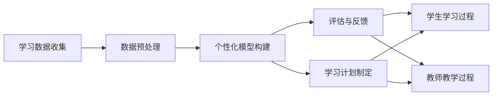

# AI辅助教育评估：个性化学习效果分析

> 关键词：AI辅助教育评估、个性化学习、效果分析、教育技术、数据驱动

> 摘要：本文聚焦于AI辅助教育评估中个性化学习效果分析这一前沿领域。首先介绍了该研究的背景，包括目的、预期读者等内容。接着深入阐述了核心概念及其联系，详细讲解了相关核心算法原理和具体操作步骤，同时给出了数学模型和公式。通过项目实战展示了代码实现与解读，探讨了实际应用场景。还推荐了相关的学习资源、开发工具框架以及论文著作。最后总结了未来发展趋势与挑战，并给出常见问题解答和参考资料。旨在全面剖析AI在辅助教育评估中实现个性化学习效果分析的原理、方法及应用，为教育领域的智能化发展提供理论与实践参考。

## 1. 背景介绍 
### 1.1 目的和范围
在传统教育模式中，往往采用统一的教学方法和评估标准，难以满足每个学生的个性化需求。随着人工智能技术的飞速发展，将其应用于教育评估领域，实现个性化学习效果分析具有重要意义。本研究的目的在于探索如何利用AI技术更精准地评估学生的学习效果，为每个学生制定个性化的学习计划，提高学习效率和质量。范围涵盖了从学生学习数据的收集、处理到利用AI算法进行分析和评估的全过程，以及如何将分析结果应用于实际教学中。

### 1.2 预期读者
本文的预期读者包括教育工作者，如教师、教育管理人员等，他们可以从中了解如何利用AI技术改进教学方法和评估方式；教育技术开发者，他们可以获取相关技术原理和实现方法，开发更有效的教育辅助工具；教育研究人员，他们可以从理论和实践的角度深入研究AI辅助教育评估的相关问题。

### 1.3 文档结构概述
本文首先介绍背景信息，为后续内容奠定基础。接着阐述核心概念与联系，帮助读者理解相关技术的基本原理。然后详细讲解核心算法原理和具体操作步骤，通过Python代码进行说明。之后给出数学模型和公式，并举例说明。项目实战部分展示代码实际案例和详细解释。随后探讨实际应用场景，为读者提供实际参考。推荐相关工具和资源，方便读者进一步学习和研究。最后总结未来发展趋势与挑战，解答常见问题并提供参考资料。

### 1.4 术语表
#### 1.4.1 核心术语定义
- **AI辅助教育评估**：利用人工智能技术对教育过程和结果进行评估的一种方式，通过分析学生的学习数据，提供更准确、个性化的评估结果。
- **个性化学习**：根据每个学生的学习特点、能力、兴趣等因素，为其定制适合的学习内容、方法和进度的学习模式。
- **学习效果分析**：对学生的学习成果进行评估和分析，包括知识掌握程度、技能提升情况、学习态度等方面。

#### 1.4.2 相关概念解释
- **数据驱动**：在教育评估中，基于学生的学习数据进行分析和决策，而不是仅仅依靠主观判断。
- **机器学习**：人工智能的一个分支，通过让计算机从数据中学习模式和规律，自动进行预测和决策。在教育评估中可用于分析学生的学习行为和成绩预测等。

#### 1.4.3 缩略词列表
- **AI**：Artificial Intelligence，人工智能
- **ML**：Machine Learning，机器学习
- **LSTM**：Long Short - Term Memory，长短期记忆网络

## 2. 核心概念与联系 
### 核心概念原理
AI辅助教育评估中的个性化学习效果分析主要基于以下几个核心概念：

#### 学习数据收集
学生的学习数据是进行分析的基础，包括课堂表现、作业完成情况、考试成绩、在线学习行为等。这些数据可以通过多种方式收集，如学习管理系统、在线测试平台、智能教学设备等。

#### 数据预处理
收集到的原始数据往往存在噪声、缺失值等问题，需要进行预处理。数据预处理包括数据清洗、特征提取、归一化等操作，以提高数据的质量和可用性。

#### 个性化模型构建
利用机器学习和深度学习算法，根据学生的学习数据构建个性化模型。这些模型可以用于预测学生的学习成绩、学习进度、学习困难等，从而为每个学生制定个性化的学习计划。

#### 评估与反馈
根据个性化模型的结果，对学生的学习效果进行评估，并及时向学生和教师提供反馈。反馈信息可以帮助学生调整学习策略，教师改进教学方法。

### 架构的文本示意图
```plaintext
学习数据收集 --> 数据预处理 --> 个性化模型构建 --> 评估与反馈
|                                     |
|                                     |
|                                     V
|                                学习计划制定
|                                     |
|                                     |
V                                     V
学生学习过程                          教师教学过程
```

### Mermaid流程图


## 3. 核心算法原理 & 具体操作步骤 
### 核心算法原理
在AI辅助教育评估中，常用的算法包括决策树、神经网络、支持向量机等。这里以长短期记忆网络（LSTM）为例，介绍其在个性化学习效果分析中的应用。

LSTM是一种特殊的循环神经网络（RNN），能够处理序列数据中的长期依赖关系。在教育评估中，学生的学习数据往往是按时间顺序记录的，如每次作业的成绩、每天的学习时长等，LSTM可以很好地处理这些序列数据，挖掘其中的潜在规律。

### 具体操作步骤
#### 步骤1：数据收集
使用学习管理系统或在线学习平台收集学生的学习数据，包括作业成绩、考试成绩、学习时间等。

#### 步骤2：数据预处理
将收集到的数据进行清洗，去除噪声和缺失值。然后进行特征提取，选择与学习效果相关的特征，如作业完成率、考试平均分等。最后对数据进行归一化处理，将数据缩放到[0, 1]区间。

#### 步骤3：构建LSTM模型
使用Python的深度学习库，如Keras或PyTorch，构建LSTM模型。模型的输入是学生的学习数据序列，输出是预测的学习成绩或学习状态。

#### 步骤4：模型训练
将预处理后的数据划分为训练集和测试集，使用训练集对LSTM模型进行训练。训练过程中，通过优化算法（如随机梯度下降）不断调整模型的参数，使模型的预测误差最小。

#### 步骤5：模型评估
使用测试集对训练好的模型进行评估，计算模型的准确率、召回率等指标，评估模型的性能。

#### 步骤6：个性化学习计划制定
根据模型的预测结果，为每个学生制定个性化的学习计划，如推荐适合的学习资源、调整学习进度等。

### Python源代码实现
```python
import numpy as np
from keras.models import Sequential
from keras.layers import LSTM, Dense
from sklearn.preprocessing import MinMaxScaler
from sklearn.model_selection import train_test_split

# 步骤1：数据收集（假设已经收集到数据）
# 这里使用随机生成的数据作为示例
data = np.random.rand(100, 5)  # 100个样本，每个样本有5个特征
labels = np.random.randint(0, 2, 100)  # 100个样本的标签

# 步骤2：数据预处理
scaler = MinMaxScaler()
data = scaler.fit_transform(data)

# 调整数据形状以适应LSTM输入（样本数，时间步长，特征数）
data = np.reshape(data, (data.shape[0], 1, data.shape[1]))

# 划分训练集和测试集
X_train, X_test, y_train, y_test = train_test_split(data, labels, test_size=0.2, random_state=42)

# 步骤3：构建LSTM模型
model = Sequential()
model.add(LSTM(50, input_shape=(1, 5)))
model.add(Dense(1, activation='sigmoid'))

# 编译模型
model.compile(loss='binary_crossentropy', optimizer='adam', metrics=['accuracy'])

# 步骤4：模型训练
model.fit(X_train, y_train, epochs=10, batch_size=32, verbose=1)

# 步骤5：模型评估
loss, accuracy = model.evaluate(X_test, y_test, verbose=0)
print(f"Test Loss: {loss}, Test Accuracy: {accuracy}")

# 步骤6：个性化学习计划制定（这里简单模拟）
predictions = model.predict(X_test)
for i in range(len(predictions)):
    if predictions[i] > 0.5:
        print(f"Student {i} is predicted to perform well. Recommend advanced learning resources.")
    else:
        print(f"Student {i} may need more practice. Recommend basic learning materials.")
```

## 4. 数学模型和公式 & 详细讲解 & 举例说明 
### 数学模型
在LSTM模型中，主要包含三个门控机制：输入门、遗忘门和输出门。这些门控机制通过激活函数来控制信息的流动。

#### 遗忘门
遗忘门决定了上一时刻的细胞状态 $C_{t - 1}$ 中有多少信息需要被遗忘。其计算公式为：

$$f_t = \sigma(W_f[h_{t - 1}, x_t] + b_f)$$

其中，$f_t$ 是遗忘门的输出，$\sigma$ 是sigmoid激活函数，$W_f$ 是遗忘门的权重矩阵，$h_{t - 1}$ 是上一时刻的隐藏状态，$x_t$ 是当前时刻的输入，$b_f$ 是遗忘门的偏置项。

#### 输入门
输入门决定了当前时刻的输入 $x_t$ 中有多少信息需要被加入到细胞状态中。其计算公式为：

$$i_t = \sigma(W_i[h_{t - 1}, x_t] + b_i)$$

$$\tilde{C}_t = \tanh(W_C[h_{t - 1}, x_t] + b_C)$$

其中，$i_t$ 是输入门的输出，$\tilde{C}_t$ 是候选细胞状态，$\tanh$ 是双曲正切激活函数，$W_i$ 和 $W_C$ 分别是输入门和候选细胞状态的权重矩阵，$b_i$ 和 $b_C$ 分别是输入门和候选细胞状态的偏置项。

#### 细胞状态更新
细胞状态 $C_t$ 根据遗忘门和输入门的输出进行更新：

$$C_t = f_t \odot C_{t - 1}+i_t \odot \tilde{C}_t$$

其中，$\odot$ 表示逐元素相乘。

#### 输出门
输出门决定了当前时刻的细胞状态 $C_t$ 中有多少信息需要被输出到隐藏状态 $h_t$ 中。其计算公式为：

$$o_t = \sigma(W_o[h_{t - 1}, x_t] + b_o)$$

$$h_t = o_t \odot \tanh(C_t)$$

其中，$o_t$ 是输出门的输出，$W_o$ 是输出门的权重矩阵，$b_o$ 是输出门的偏置项。

### 详细讲解
遗忘门通过sigmoid函数将输入映射到[0, 1]区间，0表示完全遗忘，1表示完全保留。输入门同样使用sigmoid函数控制输入信息的加入，候选细胞状态使用双曲正切函数将输入映射到[-1, 1]区间。细胞状态的更新是通过遗忘门和输入门的输出进行逐元素相乘和相加实现的。输出门通过sigmoid函数控制细胞状态信息的输出，最终得到当前时刻的隐藏状态。

### 举例说明
假设我们有一个LSTM单元，输入 $x_t$ 是一个长度为3的向量，上一时刻的隐藏状态 $h_{t - 1}$ 是一个长度为4的向量。遗忘门的权重矩阵 $W_f$ 是一个形状为(7, 4)的矩阵（7 = 3 + 4），偏置项 $b_f$ 是一个长度为4的向量。通过计算遗忘门的输出 $f_t$，我们可以确定上一时刻的细胞状态中有多少信息需要被遗忘。同理，输入门、细胞状态更新和输出门也按照上述公式进行计算。

## 5. 项目实战：代码实际案例和详细解释说明 
### 5.1  开发环境搭建
#### 安装Python
首先需要安装Python，建议使用Python 3.6及以上版本。可以从Python官方网站（https://www.python.org/downloads/）下载并安装。

#### 安装必要的库
使用pip安装以下必要的库：
```bash
pip install numpy keras scikit-learn
```

### 5.2  源代码详细实现和代码解读
```python
import numpy as np
from keras.models import Sequential
from keras.layers import LSTM, Dense
from sklearn.preprocessing import MinMaxScaler
from sklearn.model_selection import train_test_split

# 步骤1：数据收集（假设已经收集到数据）
# 这里使用随机生成的数据作为示例
data = np.random.rand(100, 5)  # 100个样本，每个样本有5个特征
labels = np.random.randint(0, 2, 100)  # 100个样本的标签

# 步骤2：数据预处理
scaler = MinMaxScaler()
data = scaler.fit_transform(data)

# 调整数据形状以适应LSTM输入（样本数，时间步长，特征数）
data = np.reshape(data, (data.shape[0], 1, data.shape[1]))

# 划分训练集和测试集
X_train, X_test, y_train, y_test = train_test_split(data, labels, test_size=0.2, random_state=42)

# 步骤3：构建LSTM模型
model = Sequential()
model.add(LSTM(50, input_shape=(1, 5)))
model.add(Dense(1, activation='sigmoid'))

# 编译模型
model.compile(loss='binary_crossentropy', optimizer='adam', metrics=['accuracy'])

# 步骤4：模型训练
model.fit(X_train, y_train, epochs=10, batch_size=32, verbose=1)

# 步骤5：模型评估
loss, accuracy = model.evaluate(X_test, y_test, verbose=0)
print(f"Test Loss: {loss}, Test Accuracy: {accuracy}")

# 步骤6：个性化学习计划制定（这里简单模拟）
predictions = model.predict(X_test)
for i in range(len(predictions)):
    if predictions[i] > 0.5:
        print(f"Student {i} is predicted to perform well. Recommend advanced learning resources.")
    else:
        print(f"Student {i} may need more practice. Recommend basic learning materials.")
```

### 代码解读与分析
#### 数据收集
使用`np.random.rand`生成随机数据作为示例，`np.random.randint`生成随机标签。在实际应用中，需要从学习管理系统或其他数据源中收集真实的学生学习数据。

#### 数据预处理
使用`MinMaxScaler`对数据进行归一化处理，将数据缩放到[0, 1]区间。然后使用`np.reshape`调整数据形状，使其适合LSTM模型的输入。

#### 模型构建
使用`Sequential`模型构建LSTM模型，添加一个LSTM层和一个全连接层。LSTM层的单元数为50，输入形状为(1, 5)。全连接层的输出维度为1，激活函数为sigmoid，用于二分类任务。

#### 模型编译
使用`binary_crossentropy`作为损失函数，`adam`作为优化器，`accuracy`作为评估指标。

#### 模型训练
使用`fit`方法对模型进行训练，训练10个epoch，每个batch包含32个样本。

#### 模型评估
使用`evaluate`方法对模型进行评估，计算测试集的损失和准确率。

#### 个性化学习计划制定
使用`predict`方法对测试集进行预测，根据预测结果为每个学生推荐不同的学习资源。

## 6. 实际应用场景 
### 在线教育平台
在线教育平台可以利用AI辅助教育评估技术，对学生的学习行为进行实时监测和分析。根据学生的学习进度、作业完成情况、考试成绩等数据，为学生提供个性化的学习建议和课程推荐。例如，当学生在某个知识点上遇到困难时，系统可以自动推送相关的学习资料和辅导视频，帮助学生更好地掌握知识。

### 学校课堂教学
在学校课堂教学中，教师可以使用AI辅助教育评估工具，对学生的课堂表现进行评估。通过分析学生的发言次数、参与度、提问频率等数据，了解学生的学习状态和兴趣点。教师可以根据评估结果调整教学策略，如采用小组合作学习、个性化辅导等方式，满足不同学生的学习需求。

### 职业培训
在职业培训领域，AI辅助教育评估可以帮助培训机构了解学员的学习效果和技能提升情况。根据学员的培训成绩、实践操作能力等数据，为学员制定个性化的培训计划，提高培训的针对性和实效性。例如，对于技能掌握较慢的学员，可以增加实践操作的训练时间；对于技能掌握较好的学员，可以提供更高级的培训课程。

## 7. 工具和资源推荐
### 7.1 学习资源推荐
#### 7.1.1 书籍推荐
- 《深度学习》（Deep Learning）：由Ian Goodfellow、Yoshua Bengio和Aaron Courville所著，是深度学习领域的经典教材，全面介绍了深度学习的基本原理和算法。
-