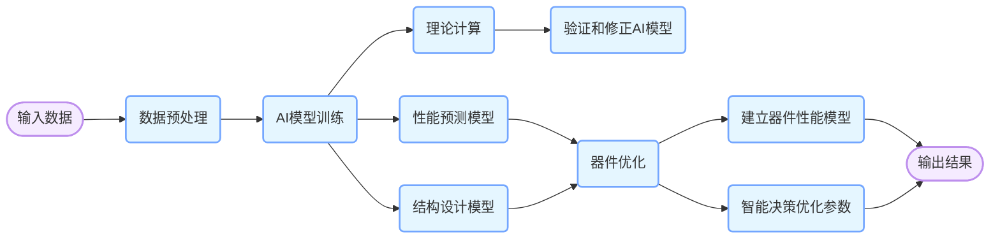

# AI辅助新型光电材料开发：从理论计算到器件优化

> 关键词：AI、新型光电材料、理论计算、器件优化、材料开发

> 摘要：本文聚焦于AI辅助新型光电材料开发这一前沿领域，从理论计算到器件优化进行了全面深入的探讨。首先介绍了该研究的背景，包括目的、预期读者、文档结构和相关术语。接着阐述了核心概念及其联系，给出了原理和架构的文本示意图与Mermaid流程图。详细讲解了核心算法原理，并用Python源代码进行了说明。同时，提供了数学模型和公式，并举例进行了详细解释。通过项目实战，展示了代码实际案例及详细解读。分析了实际应用场景，推荐了相关的工具和资源，包括学习资源、开发工具框架和论文著作。最后总结了未来发展趋势与挑战，解答了常见问题，并提供了扩展阅读和参考资料，旨在为相关领域的研究人员和开发者提供全面且深入的技术指导。

## 1. 背景介绍 
### 1.1 目的和范围
随着科技的不断进步，新型光电材料在光通信、太阳能电池、发光二极管等众多领域展现出巨大的应用潜力。然而，传统的光电材料开发方法往往依赖于大量的实验和试错，不仅耗时费力，而且成本高昂。AI技术的出现为新型光电材料的开发带来了新的机遇。本研究的目的在于探讨如何利用AI技术辅助新型光电材料的开发，从理论计算到器件优化的全流程进行深入研究，以提高材料开发的效率和准确性，降低成本。

本研究的范围涵盖了AI在新型光电材料开发中的各个环节，包括材料的理论计算、性能预测、结构设计以及器件的优化等方面。通过对这些环节的研究，探索AI技术在新型光电材料开发中的应用模式和方法。

### 1.2 预期读者
本文预期读者主要包括从事新型光电材料研究的科研人员、材料科学与工程专业的学生、相关企业的研发工程师以及对AI技术在材料科学领域应用感兴趣的技术爱好者。对于科研人员，本文可以为他们提供新的研究思路和方法；对于学生，有助于他们了解该领域的前沿知识；对于企业研发工程师，能够为实际的产品开发提供参考；对于技术爱好者，则可以拓宽他们的知识面和视野。

### 1.3 文档结构概述
本文按照以下结构进行组织：首先介绍背景信息，包括目的、预期读者、文档结构和术语表；接着阐述核心概念及其联系，给出原理和架构的文本示意图与Mermaid流程图；详细讲解核心算法原理，并使用Python源代码进行说明；提供数学模型和公式，并举例进行详细解释；通过项目实战，展示代码实际案例及详细解读；分析实际应用场景；推荐相关的工具和资源，包括学习资源、开发工具框架和论文著作；最后总结未来发展趋势与挑战，解答常见问题，并提供扩展阅读和参考资料。

### 1.4 术语表
#### 1.4.1 核心术语定义
- **AI（Artificial Intelligence）**：即人工智能，是指计算机系统能够执行通常需要人类智能才能完成的任务，如学习、推理、解决问题等。
- **新型光电材料**：指具有特殊光电性能的材料，如高发光效率、高载流子迁移率等，可用于制造各种光电器件。
- **理论计算**：利用量子力学、统计力学等理论方法对材料的结构和性能进行计算和预测。
- **器件优化**：通过调整材料的结构和性能，提高光电器件的性能和效率。

#### 1.4.2 相关概念解释
- **机器学习**：AI的一个重要分支，通过让计算机从数据中学习模式和规律，从而进行预测和决策。
- **深度学习**：一种基于人工神经网络的机器学习方法，能够自动从大量数据中提取特征，具有强大的学习能力。
- **密度泛函理论（DFT）**：一种常用的量子力学计算方法，用于计算材料的电子结构和性质。

#### 1.4.3 缩略词列表
- **AI**：Artificial Intelligence
- **DFT**：Density Functional Theory
- **ML**：Machine Learning
- **DL**：Deep Learning

## 2. 核心概念与联系 

### 核心概念原理
AI辅助新型光电材料开发主要基于以下几个核心概念：

#### 数据驱动的材料发现
通过收集大量已知光电材料的结构、性能等数据，利用机器学习和深度学习算法建立数据模型，从数据中挖掘潜在的规律和关系，从而预测新型光电材料的性能和结构。

#### 理论计算与AI融合
将量子力学理论计算（如DFT）与AI技术相结合。理论计算可以提供材料的精确结构和性能信息，但计算成本较高；AI技术可以快速对大量数据进行分析和预测，通过两者的融合，可以提高材料开发的效率和准确性。

#### 器件优化的智能决策
利用AI算法对光电器件的性能进行评估和优化。通过建立器件性能模型，AI可以自动搜索最优的材料结构和工艺参数，实现器件性能的提升。

### 架构的文本示意图
```plaintext
输入数据（材料结构、性能数据）
|
|-- 数据预处理（清洗、特征提取）
|
|-- AI模型训练（机器学习、深度学习）
|   |
|   |-- 性能预测模型（预测材料性能）
|   |-- 结构设计模型（设计材料结构）
|
|-- 理论计算（DFT等）
|   |
|   |-- 验证和修正AI模型
|
|-- 器件优化
|   |
|   |-- 建立器件性能模型
|   |-- 智能决策优化参数
|
输出结果（新型光电材料、优化后的器件）
```

### Mermaid流程图


## 3. 核心算法原理 & 具体操作步骤 

### 核心算法原理
在AI辅助新型光电材料开发中，常用的算法包括机器学习算法（如支持向量机、随机森林）和深度学习算法（如神经网络）。下面以神经网络为例，介绍其原理。

神经网络是一种模仿人类神经系统的计算模型，由输入层、隐藏层和输出层组成。输入层接收数据，隐藏层对数据进行处理和转换，输出层输出预测结果。神经网络通过调整神经元之间的连接权重来学习数据中的模式和规律。

### 具体操作步骤
#### 数据收集和预处理
收集已知光电材料的结构和性能数据，对数据进行清洗，去除噪声和缺失值。然后进行特征提取，选择与材料性能相关的特征作为输入。

#### 模型构建
使用Python的深度学习库（如TensorFlow、PyTorch）构建神经网络模型。以下是一个简单的神经网络模型示例：

```python
import tensorflow as tf
from tensorflow.keras import layers

# 构建神经网络模型
model = tf.keras.Sequential([
    layers.Dense(64, activation='relu', input_shape=(input_dim,)),
    layers.Dense(64, activation='relu'),
    layers.Dense(1)
])

# 编译模型
model.compile(optimizer='adam',
              loss='mse',
              metrics=['mae'])
```

#### 模型训练
将预处理后的数据分为训练集和验证集，使用训练集对模型进行训练，通过不断调整模型的权重，使模型的预测结果与真实值之间的误差最小。

```python
# 训练模型
history = model.fit(x_train, y_train,
                    epochs=100,
                    batch_size=32,
                    validation_data=(x_val, y_val))
```

#### 模型评估和优化
使用验证集对模型进行评估，根据评估结果调整模型的参数和结构，以提高模型的性能。

#### 预测和应用
使用训练好的模型对未知光电材料的性能进行预测，并根据预测结果进行材料的设计和器件的优化。

```python
# 预测未知材料的性能
predictions = model.predict(x_test)
```

## 4. 数学模型和公式 & 详细讲解 & 举例说明 

### 神经网络的数学模型
神经网络的基本单元是神经元，其数学模型可以表示为：

$$
y = f(\sum_{i=1}^{n} w_i x_i + b)
$$

其中，$x_i$ 是输入值，$w_i$ 是连接权重，$b$ 是偏置，$f$ 是激活函数。

### 激活函数
激活函数的作用是引入非线性因素，使神经网络能够学习复杂的模式。常用的激活函数包括Sigmoid函数、ReLU函数等。

#### Sigmoid函数
$$
f(x) = \frac{1}{1 + e^{-x}}
$$

Sigmoid函数将输入值映射到 $(0, 1)$ 区间，常用于二分类问题。

#### ReLU函数
$$
f(x) = \max(0, x)
$$

ReLU函数在 $x > 0$ 时输出 $x$，在 $x \leq 0$ 时输出 $0$，具有计算简单、收敛速度快等优点。

### 损失函数
损失函数用于衡量模型预测结果与真实值之间的误差。在回归问题中，常用的损失函数是均方误差（MSE）：

$$
MSE = \frac{1}{n} \sum_{i=1}^{n} (y_i - \hat{y}_i)^2
$$

其中，$y_i$ 是真实值，$\hat{y}_i$ 是预测值。

### 举例说明
假设有一个简单的神经网络，输入层有2个神经元，隐藏层有3个神经元，输出层有1个神经元。输入数据为 $x = [x_1, x_2]$，隐藏层的权重矩阵为 $W_1$，偏置向量为 $b_1$，输出层的权重矩阵为 $W_2$，偏置向量为 $b_2$。

首先，计算隐藏层的输入：

$$
z_1 = W_1 x + b_1
$$

然后，通过激活函数（如ReLU）计算隐藏层的输出：

$$
a_1 = f(z_1)
$$

接着，计算输出层的输入：

$$
z_2 = W_2 a_1 + b_2
$$

最后，得到输出结果：

$$
\hat{y} = z_2
$$

假设 $x = [1, 2]$，$W_1 = \begin{bmatrix} 0.1 & 0.2 \\ 0.3 & 0.4 \\ 0.5 & 0.6 \end{bmatrix}$，$b_1 = [0.1, 0.2, 0.3]$，$W_2 = \begin{bmatrix} 0.7 & 0.8 & 0.9 \end{bmatrix}$，$b_2 = [0.4]$。

计算隐藏层的输入：

$$
z_1 = \begin{bmatrix} 0.1 & 0.2 \\ 0.3 & 0.4 \\ 0.5 & 0.6 \end{bmatrix} \begin{bmatrix} 1 \\ 2 \end{bmatrix} + \begin{bmatrix} 0.1 \\ 0.2 \\ 0.3 \end{bmatrix} = \begin{bmatrix} 0.1\times1 + 0.2\times2 + 0.1 \\ 0.3\times1 + 0.4\times2 + 0.2 \\ 0.5\times1 + 0.6\times2 + 0.3 \end{bmatrix} = \begin{bmatrix} 0.6 \\ 1.3 \\ 2.0 \end{bmatrix}
$$

通过ReLU激活函数计算隐藏层的输出：

$$
a_1 = \begin{bmatrix} \max(0, 0.6) \\ \max(0, 1.3) \\ \max(0, 2.0) \end{bmatrix} = \begin{bmatrix} 0.6 \\ 1.3 \\ 2.0 \end{bmatrix}
$$

计算输出层的输入：

$$
z_2 = \begin{bmatrix} 0.7 & 0.8 & 0.9 \end{bmatrix} \begin{bmatrix} 0.6 \\ 1.3 \\ 2.0 \end{bmatrix} + 0.4 = 0.7\times0.6 + 0.8\times1.3 + 0.9\times2.0 + 0.4 = 3.38
$$

所以，输出结果 $\hat{y} = 3.38$。

## 5. 项目实战：代码实际案例和详细解释说明 

### 5.1  开发环境搭建
#### 安装Python
首先，需要安装Python环境。可以从Python官方网站（https://www.python.org/downloads/）下载适合自己操作系统的Python版本，并按照安装向导进行安装。

#### 安装必要的库
使用pip命令安装必要的库，包括TensorFlow、NumPy、Pandas等。

```bash
pip install tensorflow numpy pandas
```

### 5.2  源代码详细实现和代码解读
以下是一个完整的AI辅助新型光电材料性能预测的代码示例：

```python
import numpy as np
import pandas as pd
from sklearn.model_selection import train_test_split
from tensorflow.keras import layers
from tensorflow.keras.models import Sequential
from tensorflow.keras.optimizers import Adam

# 读取数据
data = pd.read_csv('optoelectronic_materials_data.csv')

# 分离特征和标签
X = data.drop('property', axis=1).values
y = data['property'].values

# 划分训练集和测试集
X_train, X_test, y_train, y_test = train_test_split(X, y, test_size=0.2, random_state=42)

# 构建神经网络模型
model = Sequential([
    layers.Dense(128, activation='relu', input_shape=(X_train.shape[1],)),
    layers.Dense(64, activation='relu'),
    layers.Dense(1)
])

# 编译模型
model.compile(optimizer=Adam(learning_rate=0.001),
              loss='mse',
              metrics=['mae'])

# 训练模型
history = model.fit(X_train, y_train,
                    epochs=100,
                    batch_size=32,
                    validation_split=0.1)

# 评估模型
test_loss, test_mae = model.evaluate(X_test, y_test)
print(f'Test loss: {test_loss}, Test MAE: {test_mae}')

# 预测新数据
new_data = np.random.randn(1, X_train.shape[1])
predictions = model.predict(new_data)
print(f'Predicted property: {predictions[0][0]}')
```

### 代码解读与分析
#### 数据读取和预处理
使用Pandas库读取CSV文件中的数据，并将特征和标签分离。然后使用`train_test_split`函数将数据划分为训练集和测试集。

#### 模型构建
使用Keras构建一个简单的神经网络模型，包含一个输入层、两个隐藏层和一个输出层。隐藏层使用ReLU激活函数，输出层不使用激活函数，因为这是一个回归问题。

#### 模型编译
使用Adam优化器和均方误差损失函数编译模型，并选择平均绝对误差作为评估指标。

#### 模型训练
使用`fit`方法对模型进行训练，设置训练轮数为100，批次大小为32，并使用10%的数据作为验证集。

#### 模型评估
使用`evaluate`方法对模型在测试集上的性能进行评估，输出测试损失和平均绝对误差。

#### 预测新数据
生成一个随机的新数据样本，使用训练好的模型进行预测，并输出预测结果。

## 6. 实际应用场景 
### 光通信领域
在光通信领域，新型光电材料的性能直接影响光信号的传输质量和效率。AI辅助新型光电材料开发可以帮助设计出具有高载流子迁移率、低损耗等性能的材料，用于制造高速光探测器、光调制器等器件，提高光通信系统的性能。

### 太阳能电池领域
太阳能电池的效率是衡量其性能的重要指标。通过AI技术可以预测新型光电材料的光电转换效率，优化材料的结构和组成，开发出高效的太阳能电池材料，提高太阳能的利用效率。

### 发光二极管（LED）领域
LED在照明、显示等领域有着广泛的应用。AI辅助新型光电材料开发可以帮助设计出具有高发光效率、高显色指数等性能的LED材料，改善LED的发光质量，降低能耗。

## 7. 工具和资源推荐
### 7.1 学习资源推荐
#### 7.1.1 书籍推荐
- 《深度学习》（Deep Learning）：由Ian Goodfellow、Yoshua Bengio和Aaron Courville所著，是深度学习领域的经典教材，涵盖了深度学习的基本原理、算法和应用。
- 《Python机器学习》（Python Machine Learning）：由Sebastian Raschka和Vahid Mirjalili所著，介绍了使用Python进行机器学习的方法和技巧，包括数据预处理、模型选择、评估等内容。
- 《材料信息学》（Materials Informatics）：由G. Jeffrey Snyder、C. Wolverton和D. Schwalbe-Koda所著，专门介绍了信息学在材料科学中的应用，包括数据驱动的材料发现、AI辅助材料设计等内容。

#### 7.1.2 在线课程
- Coursera上的“深度学习专项课程”（Deep Learning Specialization）：由Andrew Ng教授授课，系统地介绍了深度学习的各个方面，包括神经网络、卷积神经网络、循环神经网络等。
- edX上的“材料信息学”（Materials Informatics）：由麻省理工学院（MIT）提供，介绍了材料信息学的基本概念、方法和应用。
- Udemy上的“Python for Data Science and Machine Learning Bootcamp”：通过实际项目介绍了使用Python进行数据科学和机器学习的方法和技巧。

#### 7.1.3 技术博客和网站
- Medium：有许多关于AI和材料科学的技术博客，如Towards Data Science、Materials Science and Engineering等，提供了最新的研究成果和技术文章。
- arXiv：是一个预印本平台，包含了大量关于AI和材料科学的研究论文，可以及时了解该领域的最新动态。
- Kaggle：是一个数据科学竞赛平台，有许多关于材料科学和AI的数据集和竞赛项目，可以通过参与竞赛提高自己的实践能力。

### 7.2 开发工具框架推荐
#### 7.2.1 IDE和编辑器
- PyCharm：是一款专门为Python开发设计的集成开发环境（IDE），具有代码自动完成、调试、版本控制等功能，适合专业的Python开发者使用。
- Jupyter Notebook：是一个交互式的开发环境，支持Python、R等多种编程语言，可以方便地进行数据探索、模型训练和可视化。
- Visual Studio Code：是一款轻量级的代码编辑器，支持多种编程语言和插件扩展，具有丰富的功能和良好的用户体验。

#### 7.2.2 调试和性能分析工具
- TensorBoard：是TensorFlow提供的一个可视化工具，可以用于监控模型的训练过程、可视化模型结构、分析性能指标等。
- PyTorch Profiler：是PyTorch提供的性能分析工具，可以帮助开发者找出代码中的性能瓶颈，优化代码性能。
- cProfile：是Python标准库中的一个性能分析工具，可以统计代码中各个函数的执行时间和调用次数，帮助开发者优化代码。

#### 7.2.3 相关框架和库
- TensorFlow：是一个开源的机器学习框架，由Google开发，具有高度的灵活性和可扩展性，支持多种深度学习模型和算法。
- PyTorch：是一个基于Python的深度学习框架，由Facebook开发，具有动态图的特点，易于使用和调试，在学术界和工业界都有广泛的应用。
- Scikit-learn：是一个用于机器学习的Python库，提供了丰富的机器学习算法和工具，如分类、回归、聚类等，适合初学者和快速开发。

### 7.3 相关论文著作推荐
#### 7.3.1 经典论文
- “Deep Learning” by Yann LeCun, Yoshua Bengio, and Geoffrey Hinton：发表于Nature杂志，是深度学习领域的经典综述论文，介绍了深度学习的发展历程、基本原理和应用。
- “Density-functional theory of atoms and molecules” by Walter Kohn and Lu Jeu Sham：提出了密度泛函理论（DFT），是量子力学计算领域的经典论文，为材料的理论计算提供了重要的方法。
- “Materials Informatics: A Review” by G. Jeffrey Snyder, C. Wolverton, and D. Schwalbe-Koda：对材料信息学的发展历程、方法和应用进行了全面的综述，是材料信息学领域的重要论文。

#### 7.3.2 最新研究成果
- 关注arXiv、Nature、Science等学术平台上关于AI和材料科学的最新研究论文，了解该领域的前沿动态和研究成果。

#### 7.3.3 应用案例分析
- 阅读相关的学术论文和行业报告，了解AI辅助新型光电材料开发在实际应用中的案例和经验，如某些企业使用AI技术开发出新型光电材料并应用于产品中的案例分析。

## 8. 总结：未来发展趋势与挑战
### 未来发展趋势
#### 多学科融合
AI辅助新型光电材料开发将与量子力学、材料科学、计算机科学等多学科进行更深入的融合。通过跨学科的研究，可以充分发挥各学科的优势，推动新型光电材料的快速发展。

#### 自动化材料发现
随着AI技术的不断发展，未来将实现自动化的材料发现过程。AI算法可以自动搜索材料数据库，设计新型材料结构，并进行性能预测和优化，大大提高材料开发的效率。

#### 器件一体化设计
AI将不仅用于材料的开发，还将应用于光电器件的一体化设计。通过建立材料-器件-系统的整体模型，AI可以同时优化材料的性能和器件的结构，实现光电器件性能的最大化。

### 挑战
#### 数据质量和数量
AI算法的性能依赖于大量高质量的数据。目前，新型光电材料的数据存在数据量不足、数据质量不高、数据标注困难等问题，需要进一步加强数据的收集、整理和标注工作。

#### 理论与实验的结合
虽然AI可以快速预测材料的性能，但预测结果需要通过实验进行验证。如何将理论计算和实验结果更好地结合起来，提高预测的准确性和可靠性，是一个需要解决的问题。

#### 可解释性和可靠性
深度学习模型往往是黑盒模型，其决策过程难以解释。在新型光电材料开发中，需要确保AI模型的可解释性和可靠性，以便科研人员和工程师能够理解和信任模型的预测结果。

## 9. 附录：常见问题与解答
### 1. AI在新型光电材料开发中的优势是什么？
AI可以快速处理大量的数据，从数据中挖掘潜在的规律和关系，从而提高材料开发的效率和准确性。与传统的实验试错方法相比，AI可以减少实验次数，降低成本。

### 2. 如何选择合适的AI算法用于新型光电材料开发？
选择合适的AI算法需要考虑数据的特点、问题的类型和复杂度等因素。对于小规模数据集和简单问题，可以选择传统的机器学习算法，如支持向量机、随机森林等；对于大规模数据集和复杂问题，可以选择深度学习算法，如神经网络、卷积神经网络等。

### 3. 理论计算和AI在新型光电材料开发中的作用有什么不同？
理论计算可以提供材料的精确结构和性能信息，但计算成本较高，适用于对少数材料进行深入研究。AI可以快速对大量数据进行分析和预测，适用于从大量材料中筛选出有潜力的材料。两者结合可以充分发挥各自的优势，提高材料开发的效率和准确性。

### 4. 如何评估AI模型在新型光电材料开发中的性能？
可以使用常见的评估指标，如均方误差（MSE）、平均绝对误差（MAE）、决定系数（$R^2$）等，对模型的预测结果进行评估。同时，还可以通过交叉验证、留出法等方法，评估模型的泛化能力。

## 10. 扩展阅读 & 参考资料
### 扩展阅读
- 《人工智能：现代方法》（Artificial Intelligence: A Modern Approach）：全面介绍了人工智能的基本概念、算法和应用，是人工智能领域的经典教材。
- 《材料科学基础》（Fundamentals of Materials Science and Engineering）：介绍了材料科学的基本原理和方法，包括材料的结构、性能、制备等内容，有助于深入理解新型光电材料的相关知识。
- 《量子力学导论》（Introduction to Quantum Mechanics）：是量子力学领域的经典教材，介绍了量子力学的基本原理和方法，对于理解理论计算在新型光电材料开发中的应用有很大帮助。

### 参考资料
- 相关学术论文和研究报告，如发表在Nature、Science、Advanced Materials等期刊上的关于AI辅助新型光电材料开发的论文。
- 行业标准和规范，如国际电工委员会（IEC）发布的关于光电器件的标准。
- 开源代码库和数据集，如Kaggle上的材料科学数据集、GitHub上的AI辅助材料开发代码库。

作者：AI天才研究院/AI Genius Institute & 禅与计算机程序设计艺术 /Zen And The Art of Computer Programming