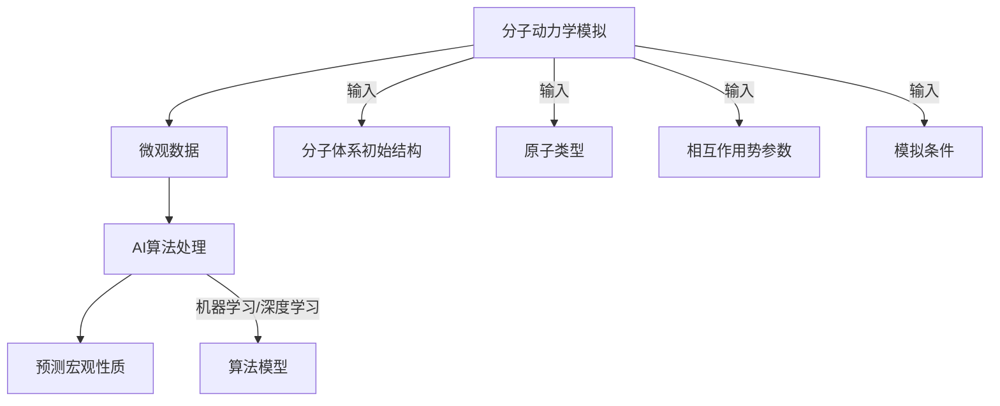

# AI辅助新型功能材料性能预测：从分子动力学到宏观性质

> 关键词：AI、新型功能材料、性能预测、分子动力学、宏观性质

> 摘要：本文聚焦于AI辅助新型功能材料性能预测，从分子动力学到宏观性质的研究方向。首先介绍了该研究的背景、目的、预期读者以及文档结构等基础信息。接着深入阐述了核心概念，包括分子动力学和宏观性质等概念及其联系，并给出相应的文本示意图和Mermaid流程图。详细讲解了核心算法原理，使用Python源代码进行了具体操作步骤的说明。同时给出了相关的数学模型和公式，并举例说明。通过项目实战，展示了代码实际案例及详细解释。探讨了该技术的实际应用场景，推荐了学习资源、开发工具框架以及相关论文著作。最后总结了未来发展趋势与挑战，并对常见问题进行了解答，还提供了扩展阅读和参考资料，旨在为相关领域的研究人员和开发者提供全面而深入的技术指导。

## 1. 背景介绍 
### 1.1 目的和范围
在材料科学领域，新型功能材料的研发一直是核心任务之一。传统的材料研发方法往往依赖于大量的实验和试错，不仅耗时耗力，而且成本高昂。随着人工智能技术的飞速发展，将AI应用于新型功能材料性能预测成为了一个极具潜力的研究方向。本研究的目的在于探索如何利用AI技术，从分子动力学的微观层面出发，准确预测新型功能材料的宏观性质，从而加速材料研发过程，降低研发成本。

本研究的范围涵盖了从分子动力学模拟获取微观数据，到运用AI算法对这些数据进行处理和分析，最终实现对新型功能材料宏观性质（如力学性能、热学性能、电学性能等）的预测。同时，还将探讨该技术在实际应用中的可行性和局限性。

### 1.2 预期读者
本文的预期读者主要包括材料科学领域的研究人员、人工智能领域的开发者以及对跨学科研究感兴趣的学者。对于材料科学研究人员，本文可以提供一种新的研究思路和方法，帮助他们更高效地进行新型功能材料的研发；对于人工智能开发者，本文可以展示AI技术在材料科学领域的具体应用场景，为他们拓展应用领域提供参考；对于跨学科研究学者，本文可以激发他们对不同学科交叉融合的思考和探索。

### 1.3 文档结构概述
本文将按照以下结构进行组织：
1. 背景介绍：介绍研究的目的、范围、预期读者和文档结构。
2. 核心概念与联系：阐述分子动力学、宏观性质等核心概念，以及它们之间的联系，并给出相应的文本示意图和Mermaid流程图。
3. 核心算法原理 & 具体操作步骤：详细讲解用于材料性能预测的核心AI算法原理，并使用Python源代码进行具体操作步骤的说明。
4. 数学模型和公式 & 详细讲解 & 举例说明：给出相关的数学模型和公式，并通过具体例子进行详细讲解。
5. 项目实战：代码实际案例和详细解释说明：通过一个具体的项目实战，展示如何使用AI技术进行新型功能材料性能预测，并对代码进行详细解释。
6. 实际应用场景：探讨该技术在实际中的应用场景，如航空航天、电子信息、能源等领域。
7. 工具和资源推荐：推荐相关的学习资源、开发工具框架以及论文著作。
8. 总结：未来发展趋势与挑战：总结该技术的发展现状，分析未来的发展趋势和面临的挑战。
9. 附录：常见问题与解答：解答读者在阅读过程中可能遇到的常见问题。
10. 扩展阅读 & 参考资料：提供相关的扩展阅读材料和参考资料，方便读者进一步深入研究。

### 1.4 术语表
#### 1.4.1 核心术语定义
- **新型功能材料**：指具有特殊物理、化学或生物性能的材料，如超导材料、纳米材料、智能材料等，这些材料在现代科技领域具有重要的应用价值。
- **分子动力学**：是一种基于牛顿力学原理，通过模拟分子中原子的运动来研究分子结构和性质的方法。它可以提供分子在不同条件下的动态信息，如原子的位置、速度、能量等。
- **宏观性质**：指材料在宏观尺度下表现出来的性质，如密度、硬度、导电性、热导率等，这些性质直接影响材料的实际应用。
- **人工智能（AI）**：是一门研究如何使计算机模拟人类智能的学科，包括机器学习、深度学习、自然语言处理等技术，在材料性能预测中可以用于处理和分析大量的微观数据。

#### 1.4.2 相关概念解释
- **机器学习**：是AI的一个重要分支，它通过让计算机从数据中学习模式和规律，从而实现对未知数据的预测和分类。在材料性能预测中，机器学习算法可以根据分子动力学模拟得到的微观数据，建立与宏观性质之间的映射关系。
- **深度学习**：是一种基于神经网络的机器学习方法，它可以自动从大量数据中提取特征，具有强大的学习能力和泛化能力。在材料性能预测中，深度学习模型可以处理复杂的非线性关系，提高预测的准确性。
- **分子动力学模拟**：是利用计算机模拟分子体系中原子的运动，通过求解牛顿运动方程来获得原子的轨迹和能量等信息。分子动力学模拟可以在不同的温度、压力等条件下进行，为材料性能预测提供微观数据。

#### 1.4.3 缩略词列表
- **AI**：Artificial Intelligence（人工智能）
- **MD**：Molecular Dynamics（分子动力学）
- **ML**：Machine Learning（机器学习）
- **DL**：Deep Learning（深度学习）

## 2. 核心概念与联系 
### 核心概念原理
#### 分子动力学原理
分子动力学基于经典牛顿力学，对于一个由 $N$ 个原子组成的分子体系，每个原子的运动可以用牛顿第二定律来描述：

$$F_i = m_i a_i$$

其中 $F_i$ 是作用在第 $i$ 个原子上的力，$m_i$ 是第 $i$ 个原子的质量，$a_i$ 是第 $i$ 个原子的加速度。通过求解这个运动方程，可以得到每个原子在不同时刻的位置和速度。

在分子动力学模拟中，需要定义原子之间的相互作用势，常见的相互作用势有 Lennard - Jones 势、库仑势等。例如，Lennard - Jones 势用于描述非键合原子之间的范德华相互作用，其表达式为：

$$V_{LJ}(r_{ij}) = 4\epsilon_{ij}\left[\left(\frac{\sigma_{ij}}{r_{ij}}\right)^{12}-\left(\frac{\sigma_{ij}}{r_{ij}}\right)^6\right]$$

其中 $r_{ij}$ 是原子 $i$ 和原子 $j$ 之间的距离，$\epsilon_{ij}$ 和 $\sigma_{ij}$ 是与原子类型有关的参数。

#### 宏观性质原理
宏观性质是材料在宏观尺度下的表现，它是由材料的微观结构和原子间相互作用共同决定的。例如，材料的力学性能与原子间的化学键强度、晶体结构等因素有关；热学性能与原子的振动、热传导机制等有关。

### 核心概念架构的文本示意图
```plaintext
分子动力学模拟
|
|-- 输入：分子体系初始结构、原子类型、相互作用势参数、模拟条件（温度、压力等）
|
|-- 过程：求解牛顿运动方程，得到原子的轨迹和能量信息
|
|-- 输出：微观数据（原子位置、速度、能量等）
|
|
AI算法处理
|
|-- 输入：分子动力学模拟得到的微观数据
|
|-- 过程：机器学习或深度学习算法建立微观数据与宏观性质之间的映射关系
|
|-- 输出：预测的宏观性质（力学性能、热学性能、电学性能等）
```

### Mermaid流程图


## 3. 核心算法原理 & 具体操作步骤 
### 核心算法原理
在AI辅助新型功能材料性能预测中，常用的核心算法包括机器学习算法（如线性回归、决策树、支持向量机等）和深度学习算法（如多层感知机、卷积神经网络等）。这里以多层感知机（Multilayer Perceptron，MLP）为例进行讲解。

多层感知机是一种前馈神经网络，由输入层、隐藏层和输出层组成。输入层接收分子动力学模拟得到的微观数据，隐藏层对输入数据进行非线性变换，输出层输出预测的宏观性质。

MLP的训练过程是通过最小化预测值与真实值之间的误差来调整网络的权重和偏置。常用的损失函数是均方误差（Mean Squared Error，MSE）：

$$MSE = \frac{1}{n}\sum_{i = 1}^{n}(y_i - \hat{y}_i)^2$$

其中 $n$ 是样本数量，$y_i$ 是真实值，$\hat{y}_i$ 是预测值。

### 具体操作步骤及Python源代码
以下是一个使用Python和PyTorch库实现的简单MLP模型进行材料性能预测的示例代码：

```python
import torch
import torch.nn as nn
import torch.optim as optim
from torch.utils.data import DataLoader, TensorDataset

# 定义MLP模型
class MLP(nn.Module):
    def __init__(self, input_size, hidden_size, output_size):
        super(MLP, self).__init__()
        self.fc1 = nn.Linear(input_size, hidden_size)
        self.relu = nn.ReLU()
        self.fc2 = nn.Linear(hidden_size, output_size)

    def forward(self, x):
        out = self.fc1(x)
        out = self.relu(out)
        out = self.fc2(out)
        return out

# 生成示例数据
input_size = 10
hidden_size = 20
output_size = 1
n_samples = 100

# 随机生成输入数据和标签
X = torch.randn(n_samples, input_size)
y = torch.randn(n_samples, output_size)

# 创建数据集和数据加载器
dataset = TensorDataset(X, y)
dataloader = DataLoader(dataset, batch_size=10, shuffle=True)

# 初始化模型、损失函数和优化器
model = MLP(input_size, hidden_size, output_size)
criterion = nn.MSELoss()
optimizer = optim.Adam(model.parameters(), lr=0.001)

# 训练模型
num_epochs = 100
for epoch in range(num_epochs):
    for inputs, labels in dataloader:
        # 前向传播
        outputs = model(inputs)
        loss = criterion(outputs, labels)

        # 反向传播和优化
        optimizer.zero_grad()
        loss.backward()
        optimizer.step()

    if (epoch + 1) % 10 == 0:
        print(f'Epoch [{epoch+1}/{num_epochs}], Loss: {loss.item():.4f}')

# 测试模型
test_input = torch.randn(1, input_size)
with torch.no_grad():
    prediction = model(test_input)
    print(f'Predicted value: {prediction.item()}')
```

### 代码解释
1. **定义MLP模型**：`MLP` 类继承自 `nn.Module`，包含两个全连接层和一个ReLU激活函数。`forward` 方法定义了前向传播的过程。
2. **生成示例数据**：随机生成输入数据 `X` 和标签 `y`，并创建数据集和数据加载器。
3. **初始化模型、损失函数和优化器**：使用 `Adam` 优化器和均方误差损失函数。
4. **训练模型**：通过多次迭代，不断调整模型的权重和偏置，使损失函数逐渐减小。
5. **测试模型**：使用随机生成的测试输入数据进行预测，并输出预测结果。

## 4. 数学模型和公式 & 详细讲解 & 举例说明 
### 多层感知机的数学模型
多层感知机的数学模型可以表示为：

$$\hat{y} = f_{out}(W_{out} \cdot f_{hid}(W_{hid} \cdot x + b_{hid}) + b_{out})$$

其中 $x$ 是输入向量，$W_{hid}$ 和 $b_{hid}$ 是隐藏层的权重矩阵和偏置向量，$f_{hid}$ 是隐藏层的激活函数（如ReLU），$W_{out}$ 和 $b_{out}$ 是输出层的权重矩阵和偏置向量，$f_{out}$ 是输出层的激活函数（如果是回归问题，通常不使用激活函数）。

### 损失函数和优化算法
#### 损失函数
如前面所述，常用的损失函数是均方误差（MSE）：

$$MSE = \frac{1}{n}\sum_{i = 1}^{n}(y_i - \hat{y}_i)^2$$

#### 优化算法
在训练MLP模型时，常用的优化算法是随机梯度下降（Stochastic Gradient Descent，SGD）及其变种，如Adam、Adagrad等。以Adam算法为例，其更新公式为：

$$m_{t} = \beta_1 m_{t - 1}+(1 - \beta_1)g_{t}$$
$$v_{t} = \beta_2 v_{t - 1}+(1 - \beta_2)g_{t}^2$$
$$\hat{m}_{t}=\frac{m_{t}}{1 - \beta_1^t}$$
$$\hat{v}_{t}=\frac{v_{t}}{1 - \beta_2^t}$$
$$\theta_{t + 1}=\theta_{t}-\frac{\eta}{\sqrt{\hat{v}_{t}}+\epsilon}\hat{m}_{t}$$

其中 $g_{t}$ 是当前迭代的梯度，$m_{t}$ 和 $v_{t}$ 是一阶矩估计和二阶矩估计，$\beta_1$ 和 $\beta_2$ 是衰减率，$\eta$ 是学习率，$\epsilon$ 是一个小的常数，用于避免分母为零。

### 举例说明
假设我们要预测一种新型材料的热导率，分子动力学模拟得到的微观数据包括原子的位置、速度等，我们将这些数据作为输入向量 $x$。经过多层感知机的计算，得到预测的热导率 $\hat{y}$。通过最小化 $MSE$ 损失函数，不断调整模型的权重和偏置，使预测值 $\hat{y}$ 尽可能接近真实的热导率 $y$。

## 5. 项目实战：代码实际案例和详细解释说明 
### 5.1  开发环境搭建
#### 安装Python
首先需要安装Python，建议使用Python 3.7及以上版本。可以从Python官方网站（https://www.python.org/downloads/）下载安装包进行安装。

#### 安装必要的库
在项目中，我们需要使用一些Python库，如PyTorch、NumPy、Pandas等。可以使用以下命令进行安装：

```bash
pip install torch numpy pandas
```

### 5.2  源代码详细实现和代码解读
以下是一个更完整的项目实战代码，用于预测新型功能材料的力学性能：

```python
import torch
import torch.nn as nn
import torch.optim as optim
from torch.utils.data import DataLoader, TensorDataset
import numpy as np
import pandas as pd
from sklearn.model_selection import train_test_split
from sklearn.preprocessing import StandardScaler

# 加载数据
data = pd.read_csv('material_data.csv')
X = data.drop('mechanical_property', axis=1).values
y = data['mechanical_property'].values

# 数据预处理
scaler = StandardScaler()
X = scaler.fit_transform(X)

# 划分训练集和测试集
X_train, X_test, y_train, y_test = train_test_split(X, y, test_size=0.2, random_state=42)

# 转换为PyTorch张量
X_train = torch.FloatTensor(X_train)
y_train = torch.FloatTensor(y_train).view(-1, 1)
X_test = torch.FloatTensor(X_test)
y_test = torch.FloatTensor(y_test).view(-1, 1)

# 创建数据集和数据加载器
train_dataset = TensorDataset(X_train, y_train)
train_dataloader = DataLoader(train_dataset, batch_size=32, shuffle=True)

# 定义MLP模型
class MLP(nn.Module):
    def __init__(self, input_size, hidden_size, output_size):
        super(MLP, self).__init__()
        self.fc1 = nn.Linear(input_size, hidden_size)
        self.relu = nn.ReLU()
        self.fc2 = nn.Linear(hidden_size, output_size)

    def forward(self, x):
        out = self.fc1(x)
        out = self.relu(out)
        out = self.fc2(out)
        return out

# 初始化模型、损失函数和优化器
input_size = X_train.shape[1]
hidden_size = 64
output_size = 1
model = MLP(input_size, hidden_size, output_size)
criterion = nn.MSELoss()
optimizer = optim.Adam(model.parameters(), lr=0.001)

# 训练模型
num_epochs = 200
for epoch in range(num_epochs):
    for inputs, labels in train_dataloader:
        # 前向传播
        outputs = model(inputs)
        loss = criterion(outputs, labels)

        # 反向传播和优化
        optimizer.zero_grad()
        loss.backward()
        optimizer.step()

    if (epoch + 1) % 10 == 0:
        print(f'Epoch [{epoch+1}/{num_epochs}], Loss: {loss.item():.4f}')

# 测试模型
with torch.no_grad():
    test_outputs = model(X_test)
    test_loss = criterion(test_outputs, y_test)
    print(f'Test Loss: {test_loss.item():.4f}')
```

### 5.3  代码解读与分析
1. **数据加载和预处理**：使用 `pandas` 库加载存储在CSV文件中的材料数据，将特征数据和目标数据分离。使用 `StandardScaler` 对特征数据进行标准化处理，以提高模型的训练效果。
2. **划分训练集和测试集**：使用 `train_test_split` 函数将数据划分为训练集和测试集，比例为8:2。
3. **转换为PyTorch张量**：将NumPy数组转换为PyTorch张量，以便在PyTorch中进行计算。
4. **创建数据集和数据加载器**：使用 `TensorDataset` 和 `DataLoader` 创建训练数据集和数据加载器，方便批量训练模型。
5. **定义MLP模型**：定义一个简单的多层感知机模型，包含一个隐藏层和一个输出层。
6. **初始化模型、损失函数和优化器**：使用 `Adam` 优化器和均方误差损失函数。
7. **训练模型**：通过多次迭代，不断调整模型的权重和偏置，使损失函数逐渐减小。
8. **测试模型**：使用测试集数据评估模型的性能，计算测试集的损失值。

## 6. 实际应用场景 
### 航空航天领域
在航空航天领域，新型功能材料的性能对飞行器的性能和安全性至关重要。例如，高温合金材料需要具备良好的高温强度、抗氧化性能和抗疲劳性能。通过AI辅助新型功能材料性能预测，可以在材料研发阶段准确预测其性能，从而筛选出最适合的材料，提高飞行器的性能和可靠性。

### 电子信息领域
在电子信息领域，半导体材料、超导材料等新型功能材料的性能直接影响电子设备的性能。例如，通过预测半导体材料的电学性能，可以优化芯片的设计和制造工艺，提高芯片的性能和集成度。

### 能源领域
在能源领域，新型储能材料、太阳能电池材料等的性能对能源的存储和利用效率至关重要。通过AI辅助性能预测，可以加速新型能源材料的研发，提高能源利用效率，推动能源领域的可持续发展。

## 7. 工具和资源推荐
### 7.1 学习资源推荐
#### 7.1.1 书籍推荐
- 《材料科学基础》：介绍了材料科学的基本概念、原理和方法，是材料科学领域的经典教材。
- 《机器学习》：由周志华教授编写，系统介绍了机器学习的基本理论和算法，是机器学习领域的优秀教材。
- 《深度学习》：由Ian Goodfellow、Yoshua Bengio和Aaron Courville编写，全面介绍了深度学习的理论和应用。

#### 7.1.2 在线课程
- Coursera上的“Machine Learning”课程：由Andrew Ng教授授课，是机器学习领域的经典在线课程。
- edX上的“Deep Learning Fundamentals”课程：介绍了深度学习的基本概念、算法和应用。
- 中国大学MOOC上的“材料科学与工程概论”课程：介绍了材料科学与工程的基本概念、原理和应用。

#### 7.1.3 技术博客和网站
- Medium：是一个技术博客平台，上面有很多关于AI和材料科学的优秀文章。
- arXiv：是一个预印本平台，上面有很多最新的学术研究成果，包括AI辅助材料性能预测方面的研究。
- 材料人网：是一个专注于材料科学领域的网站，提供了丰富的材料科学知识和研究动态。

### 7.2 开发工具框架推荐
#### 7.2.1 IDE和编辑器
- PyCharm：是一款专业的Python集成开发环境，提供了丰富的功能和插件，方便Python代码的开发和调试。
- Jupyter Notebook：是一个交互式的编程环境，适合进行数据分析和模型训练的实验和演示。

#### 7.2.2 调试和性能分析工具
- PyTorch Profiler：是PyTorch自带的性能分析工具，可以帮助开发者分析模型的性能瓶颈，优化代码。
- TensorBoard：是TensorFlow的可视化工具，也可以用于PyTorch模型的可视化和性能分析。

#### 7.2.3 相关框架和库
- PyTorch：是一个开源的深度学习框架，提供了丰富的深度学习模型和工具，方便开发者进行模型的构建和训练。
- Scikit - learn：是一个开源的机器学习库，提供了丰富的机器学习算法和工具，方便开发者进行数据处理和模型训练。
- ASE（Atomic Simulation Environment）：是一个用于原子模拟的Python库，提供了分子动力学模拟、量子力学计算等功能，方便开发者进行材料微观结构的模拟和分析。

### 7.3 相关论文著作推荐
#### 7.3.1 经典论文
- “Graph Convolutional Networks for Materials Discovery”：介绍了图卷积网络在材料发现中的应用，为AI辅助材料性能预测提供了新的思路。
- “Machine Learning for Molecular and Materials Science”：综述了机器学习在分子和材料科学中的应用，对该领域的研究具有重要的指导意义。

#### 7.3.2 最新研究成果
- 可以通过arXiv、IEEE Xplore等学术平台搜索最新的关于AI辅助新型功能材料性能预测的研究成果。

#### 7.3.3 应用案例分析
- 一些学术期刊如《Nature Materials》、《Advanced Materials》等会发表一些关于新型功能材料研发和应用的案例分析，可以从中了解AI在实际应用中的效果和挑战。

## 8. 总结：未来发展趋势与挑战
### 未来发展趋势
- **多学科融合加深**：AI辅助新型功能材料性能预测将与量子力学、材料物理、化学等学科进一步融合，实现从微观到宏观的全尺度材料性能预测。
- **模型精度和效率提升**：随着AI算法的不断发展和计算能力的提高，预测模型的精度和效率将不断提升，能够更准确地预测新型功能材料的性能。
- **实际应用广泛拓展**：该技术将在更多领域得到广泛应用，如生物医学、环境保护等，为解决实际问题提供有力支持。

### 挑战
- **数据质量和数量问题**：高质量的材料数据是AI模型训练的基础，但目前材料数据存在数据质量参差不齐、数据量不足等问题，需要建立更加完善的数据采集和管理体系。
- **模型可解释性问题**：AI模型尤其是深度学习模型往往是黑箱模型，缺乏可解释性，在实际应用中可能会影响其可信度和接受度，需要研究更加可解释的AI模型。
- **计算资源需求问题**：分子动力学模拟和AI模型训练都需要大量的计算资源，如何在有限的计算资源下提高计算效率是一个亟待解决的问题。

## 9. 附录：常见问题与解答
### 问题1：AI在材料性能预测中的准确性如何保证？
答：要保证AI在材料性能预测中的准确性，需要从以下几个方面入手：一是保证数据的质量和数量，使用高质量、多样化的数据进行模型训练；二是选择合适的AI算法和模型结构，根据问题的特点和数据的特征选择最适合的算法和模型；三是进行模型评估和优化，使用交叉验证、网格搜索等方法对模型进行评估和优化，提高模型的泛化能力。

### 问题2：分子动力学模拟和AI算法如何结合？
答：分子动力学模拟可以提供材料的微观数据，如原子的位置、速度、能量等。将这些微观数据作为AI算法的输入，通过机器学习或深度学习算法建立微观数据与宏观性质之间的映射关系，从而实现对材料宏观性质的预测。在实际应用中，可以先进行分子动力学模拟得到微观数据，然后将数据进行预处理，再输入到AI模型中进行训练和预测。

### 问题3：AI辅助材料性能预测在实际应用中面临哪些困难？
答：AI辅助材料性能预测在实际应用中面临以下困难：一是数据问题，包括数据质量和数量不足、数据标注困难等；二是模型可解释性问题，AI模型尤其是深度学习模型往往缺乏可解释性，影响其在实际应用中的可信度；三是计算资源问题，分子动力学模拟和AI模型训练都需要大量的计算资源，限制了其在大规模应用中的推广。

## 10. 扩展阅读 & 参考资料
### 扩展阅读
- 《材料基因组工程》：介绍了材料基因组工程的概念、方法和应用，为AI辅助材料性能预测提供了更广阔的视野。
- 《人工智能与材料科学的交叉融合》：探讨了人工智能与材料科学的交叉融合的发展趋势和应用前景。

### 参考资料
- [1] Zhou, Z. H. (2012). Machine learning. Tsinghua University Press.
- [2] Goodfellow, I., Bengio, Y., & Courville, A. (2016). Deep learning. MIT press.
- [3] Jorgensen, W. L., & Tirado - Rives, J. (2005). The OPLS all - atom force field for organic molecules and proteins. Accounts of chemical research, 38(12), 1059 - 1066.

作者：AI天才研究院/AI Genius Institute & 禅与计算机程序设计艺术 /Zen And The Art of Computer Programming