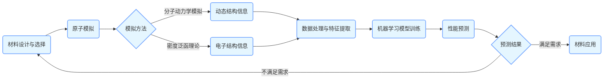

# AI辅助新型半导体材料开发：从原子模拟到性能预测

> 关键词：AI、新型半导体材料、原子模拟、性能预测、材料开发

> 摘要：本文聚焦于AI在新型半导体材料开发中的应用，从原子模拟到性能预测进行深入探讨。首先介绍了该领域的背景，包括目的、预期读者等内容。接着阐述了核心概念及联系，详细讲解了相关算法原理与操作步骤，同时给出数学模型和公式并举例说明。通过项目实战展示了代码实现及解读，分析了实际应用场景。还推荐了相关工具和资源，最后总结了未来发展趋势与挑战，提供常见问题解答和扩展阅读参考资料，旨在为该领域的研究和开发提供全面且深入的技术指导。

## 1. 背景介绍 
### 1.1 目的和范围
半导体材料在现代电子技术、通信技术、能源技术等众多领域发挥着关键作用。传统的半导体材料开发过程耗时且成本高昂，需要大量的实验和试错。而AI技术的兴起为新型半导体材料的开发带来了新的机遇。本文章的目的在于探讨如何利用AI技术辅助新型半导体材料的开发，范围涵盖从原子层面的模拟到材料性能的预测，旨在揭示AI在这一过程中的作用机制和实际应用方法，为相关领域的科研人员和工程师提供技术参考，推动新型半导体材料的高效开发。

### 1.2 预期读者
本文预期读者包括材料科学、凝聚态物理、计算机科学等领域的科研人员、工程师以及对AI和半导体材料开发感兴趣的研究生和高年级本科生。这些读者具备一定的专业知识背景，希望通过本文深入了解AI在新型半导体材料开发中的应用原理、方法和实际案例，从而为自己的研究和工作提供新的思路和方法。

### 1.3 文档结构概述
本文将按照以下结构进行阐述：首先介绍背景信息，包括目的、预期读者和文档结构概述等内容；接着详细讲解核心概念与联系，通过文本示意图和Mermaid流程图展示相关原理和架构；然后阐述核心算法原理及具体操作步骤，使用Python源代码进行详细说明；随后给出数学模型和公式，并举例说明；通过项目实战展示代码实际案例并进行详细解释；分析实际应用场景；推荐相关的工具和资源；总结未来发展趋势与挑战；提供常见问题解答和扩展阅读参考资料。

### 1.4 术语表
#### 1.4.1 核心术语定义
- **AI（Artificial Intelligence）**：人工智能，是研究、开发用于模拟、延伸和扩展人的智能的理论、方法、技术及应用系统的一门新的技术科学。
- **半导体材料**：导电性介于导体和绝缘体之间的材料，具有独特的电学性质，在电子器件中广泛应用。
- **原子模拟**：通过计算机模拟原子的行为和相互作用，以研究材料的微观结构和性质。
- **性能预测**：利用各种方法和模型对材料的性能进行预估，以便在材料开发过程中进行优化和筛选。

#### 1.4.2 相关概念解释
- **分子动力学模拟**：一种基于经典牛顿力学的原子模拟方法，通过求解原子的运动方程来模拟原子的动态行为，研究材料的结构和性质随时间的变化。
- **机器学习**：AI的一个重要分支，通过数据和算法让计算机自动学习和改进，从而实现对未知数据的预测和分类等任务。在材料开发中，可用于建立材料结构与性能之间的关系模型。
- **密度泛函理论（DFT）**：一种广泛应用于量子力学中的计算方法，用于研究多电子体系的电子结构和性质，在原子模拟中具有重要作用。

#### 1.4.3 缩略词列表
- **AI**：Artificial Intelligence（人工智能）
- **DFT**：Density Functional Theory（密度泛函理论）
- **MD**：Molecular Dynamics（分子动力学）

## 2. 核心概念与联系 

### 核心概念原理
在AI辅助新型半导体材料开发的过程中，涉及到多个核心概念，它们相互关联，共同构成了一个完整的开发体系。

原子模拟是从微观层面研究半导体材料的基础。通过对原子的位置、速度、相互作用等进行精确描述和模拟，可以深入了解材料的晶体结构、电子结构等微观性质。常用的原子模拟方法包括分子动力学模拟和基于量子力学的密度泛函理论计算。分子动力学模拟基于经典牛顿力学，通过求解原子的运动方程来模拟原子的动态行为，适用于研究材料的结构和性质随时间的变化，如材料的热稳定性、扩散行为等。密度泛函理论则从量子力学的角度出发，通过求解多电子体系的薛定谔方程来研究材料的电子结构和性质，如能带结构、电子密度分布等。

性能预测是在原子模拟的基础上，利用机器学习等AI技术建立材料结构与性能之间的关系模型，从而对材料的各种性能进行预测。机器学习算法可以从大量的实验数据和模拟数据中学习到材料结构与性能之间的复杂映射关系，然后利用这些模型对新的材料结构进行性能预测。性能预测的内容包括材料的电学性能（如导电性、载流子迁移率等）、光学性能（如吸收光谱、发射光谱等）、热学性能（如热导率等）等。

### 架构的文本示意图
AI辅助新型半导体材料开发的架构可以描述为一个多层次的体系。最底层是原子模拟层，通过分子动力学模拟和密度泛函理论等方法对材料的原子结构和电子结构进行模拟计算，得到材料的微观结构信息和相关物理量。中间层是数据处理和特征提取层，对原子模拟得到的数据进行清洗、整理和特征提取，将其转化为适合机器学习算法处理的特征向量。最上层是性能预测层，利用机器学习算法建立材料特征与性能之间的关系模型，对材料的性能进行预测。同时，预测结果可以反馈到原子模拟层，指导新的材料结构设计和优化。

### Mermaid流程图


## 3. 核心算法原理 & 具体操作步骤 

### 核心算法原理
在AI辅助新型半导体材料开发中，机器学习算法是实现性能预测的核心。常用的机器学习算法包括线性回归、决策树、随机森林、支持向量机和神经网络等。这里以神经网络为例进行详细阐述。

神经网络是一种模仿人类神经系统的计算模型，由大量的神经元组成，这些神经元按层次排列，包括输入层、隐藏层和输出层。神经元之间通过连接权重进行信息传递和处理。在材料性能预测中，输入层的神经元接收材料的特征向量，经过隐藏层的非线性变换后，输出层的神经元输出预测的材料性能值。

神经网络的训练过程是通过调整连接权重来最小化预测值与实际值之间的误差。常用的训练算法是反向传播算法，其基本思想是从输出层开始，将误差反向传播到输入层，根据误差的大小调整连接权重，使得误差逐渐减小。

### 具体操作步骤及Python源代码
以下是一个使用Python和PyTorch库实现简单神经网络进行材料性能预测的示例代码：

```python
import torch
import torch.nn as nn
import torch.optim as optim
from torch.utils.data import DataLoader, TensorDataset
import numpy as np

# 生成示例数据
# 假设我们有100个样本，每个样本有10个特征，目标是预测一个连续的性能值
np.random.seed(42)
X = np.random.rand(100, 10).astype(np.float32)
y = np.random.rand(100, 1).astype(np.float32)

# 将数据转换为PyTorch张量
X_tensor = torch.from_numpy(X)
y_tensor = torch.from_numpy(y)

# 创建数据集和数据加载器
dataset = TensorDataset(X_tensor, y_tensor)
dataloader = DataLoader(dataset, batch_size=10, shuffle=True)

# 定义神经网络模型
class NeuralNetwork(nn.Module):
    def __init__(self):
        super(NeuralNetwork, self).__init__()
        self.fc1 = nn.Linear(10, 20)  # 输入层到第一个隐藏层
        self.relu = nn.ReLU()
        self.fc2 = nn.Linear(20, 1)  # 第一个隐藏层到输出层

    def forward(self, x):
        x = self.fc1(x)
        x = self.relu(x)
        x = self.fc2(x)
        return x

# 初始化模型、损失函数和优化器
model = NeuralNetwork()
criterion = nn.MSELoss()  # 均方误差损失函数
optimizer = optim.Adam(model.parameters(), lr=0.001)  # Adam优化器

# 训练模型
num_epochs = 100
for epoch in range(num_epochs):
    for inputs, labels in dataloader:
        # 前向传播
        outputs = model(inputs)
        loss = criterion(outputs, labels)

        # 反向传播和优化
        optimizer.zero_grad()
        loss.backward()
        optimizer.step()

    if (epoch + 1) % 10 == 0:
        print(f'Epoch [{epoch + 1}/{num_epochs}], Loss: {loss.item():.4f}')

# 使用训练好的模型进行预测
test_input = torch.from_numpy(np.random.rand(1, 10).astype(np.float32))
prediction = model(test_input)
print(f'Predicted value: {prediction.item():.4f}')
```

### 代码解释
1. **数据生成**：使用`numpy`库生成示例数据，包括100个样本，每个样本有10个特征，目标是预测一个连续的性能值。
2. **数据转换和加载**：将`numpy`数组转换为PyTorch张量，并创建数据集和数据加载器，方便进行批量训练。
3. **定义神经网络模型**：定义一个简单的两层神经网络，包括一个输入层、一个隐藏层和一个输出层。使用ReLU激活函数引入非线性。
4. **初始化模型、损失函数和优化器**：初始化神经网络模型，选择均方误差损失函数和Adam优化器。
5. **训练模型**：通过多次迭代训练模型，每次迭代中进行前向传播、计算损失、反向传播和参数更新。
6. **预测**：使用训练好的模型对一个新的样本进行性能预测。

## 4. 数学模型和公式 & 详细讲解 & 举例说明 

### 神经网络的数学模型
神经网络的数学模型可以用以下公式表示。假设输入层有 $n$ 个神经元，隐藏层有 $m$ 个神经元，输出层有 $k$ 个神经元。输入向量为 $\mathbf{x} = [x_1, x_2, \cdots, x_n]^T$，隐藏层的输入为 $\mathbf{z}^h$，输出为 $\mathbf{a}^h$，输出层的输入为 $\mathbf{z}^o$，输出为 $\mathbf{a}^o$。

隐藏层的输入和输出计算如下：
$$
\mathbf{z}^h = \mathbf{W}^h \mathbf{x} + \mathbf{b}^h
$$
$$
\mathbf{a}^h = f(\mathbf{z}^h)
$$
其中，$\mathbf{W}^h$ 是输入层到隐藏层的权重矩阵，$\mathbf{b}^h$ 是隐藏层的偏置向量，$f$ 是激活函数，常用的激活函数有ReLU、Sigmoid等。

输出层的输入和输出计算如下：
$$
\mathbf{z}^o = \mathbf{W}^o \mathbf{a}^h + \mathbf{b}^o
$$
$$
\mathbf{a}^o = g(\mathbf{z}^o)
$$
其中，$\mathbf{W}^o$ 是隐藏层到输出层的权重矩阵，$\mathbf{b}^o$ 是输出层的偏置向量，$g$ 是输出层的激活函数，对于回归问题，通常 $g$ 为恒等函数。

### 损失函数
在神经网络训练中，常用的损失函数是均方误差（MSE），其公式为：
$$
L(\mathbf{W}, \mathbf{b}) = \frac{1}{N} \sum_{i=1}^{N} (\mathbf{a}^o_i - \mathbf{y}_i)^2
$$
其中，$N$ 是样本数量，$\mathbf{a}^o_i$ 是第 $i$ 个样本的预测输出，$\mathbf{y}_i$ 是第 $i$ 个样本的真实标签。

### 反向传播算法
反向传播算法的核心是计算损失函数对权重和偏置的梯度，然后根据梯度更新权重和偏置。以均方误差损失函数为例，损失函数对输出层权重的梯度计算如下：
$$
\frac{\partial L}{\partial \mathbf{W}^o} = \frac{2}{N} \sum_{i=1}^{N} (\mathbf{a}^o_i - \mathbf{y}_i) \cdot (\mathbf{a}^h_i)^T
$$
损失函数对隐藏层权重的梯度计算如下：
$$
\frac{\partial L}{\partial \mathbf{W}^h} = \frac{2}{N} \sum_{i=1}^{N} (\mathbf{W}^o)^T \cdot (\mathbf{a}^o_i - \mathbf{y}_i) \cdot f'(\mathbf{z}^h_i) \cdot (\mathbf{x}_i)^T
$$
其中，$f'$ 是激活函数的导数。

### 举例说明
假设我们有一个简单的神经网络，输入层有2个神经元，隐藏层有3个神经元，输出层有1个神经元。输入向量 $\mathbf{x} = [1, 2]^T$，输入层到隐藏层的权重矩阵 $\mathbf{W}^h = \begin{bmatrix} 0.1 & 0.2 \\ 0.3 & 0.4 \\ 0.5 & 0.6 \end{bmatrix}$，隐藏层的偏置向量 $\mathbf{b}^h = [0.1, 0.2, 0.3]^T$，隐藏层到输出层的权重矩阵 $\mathbf{W}^o = [0.7, 0.8, 0.9]$，输出层的偏置向量 $\mathbf{b}^o = 0.1$，激活函数为ReLU。

首先计算隐藏层的输入：
$$
\mathbf{z}^h = \mathbf{W}^h \mathbf{x} + \mathbf{b}^h = \begin{bmatrix} 0.1 & 0.2 \\ 0.3 & 0.4 \\ 0.5 & 0.6 \end{bmatrix} \begin{bmatrix} 1 \\ 2 \end{bmatrix} + \begin{bmatrix} 0.1 \\ 0.2 \\ 0.3 \end{bmatrix} = \begin{bmatrix} 0.6 \\ 1.3 \\ 2.0 \end{bmatrix}
$$
然后计算隐藏层的输出：
$$
\mathbf{a}^h = f(\mathbf{z}^h) = \begin{bmatrix} \max(0, 0.6) \\ \max(0, 1.3) \\ \max(0, 2.0) \end{bmatrix} = \begin{bmatrix} 0.6 \\ 1.3 \\ 2.0 \end{bmatrix}
$$
接着计算输出层的输入：
$$
\mathbf{z}^o = \mathbf{W}^o \mathbf{a}^h + \mathbf{b}^o = [0.7, 0.8, 0.9] \begin{bmatrix} 0.6 \\ 1.3 \\ 2.0 \end{bmatrix} + 0.1 = 3.29
$$
最后输出层的输出（由于是回归问题，激活函数为恒等函数）：
$$
\mathbf{a}^o = g(\mathbf{z}^o) = 3.29
$$

## 5. 项目实战：代码实际案例和详细解释说明 

### 5.1  开发环境搭建
在进行AI辅助新型半导体材料开发的项目实战之前，需要搭建相应的开发环境。以下是具体的步骤：

#### 操作系统
推荐使用Linux系统，如Ubuntu 18.04或更高版本，因为Linux系统在科学计算和机器学习领域有广泛的应用，并且有丰富的开源软件资源。

#### 编程语言
使用Python作为主要的编程语言，Python具有丰富的科学计算和机器学习库，如NumPy、Pandas、PyTorch、Scikit-learn等。

#### 安装Python和相关库
可以使用Anaconda来管理Python环境和安装相关库。以下是具体的安装步骤：
1. 下载Anaconda安装包：从Anaconda官方网站（https://www.anaconda.com/products/individual）下载适合自己操作系统的安装包。
2. 安装Anaconda：按照安装向导的提示进行安装。
3. 创建虚拟环境：打开终端，运行以下命令创建一个新的虚拟环境：
```bash
conda create -n semiconductor_env python=3.8
```
4. 激活虚拟环境：运行以下命令激活虚拟环境：
```bash
conda activate semiconductor_env
```
5. 安装相关库：在激活的虚拟环境中，运行以下命令安装所需的库：
```bash
conda install numpy pandas matplotlib scikit-learn
pip install torch torchvision
