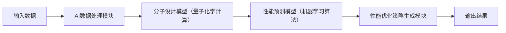

# AI辅助新型电池材料开发：从分子设计到性能优化

> 关键词：AI、新型电池材料开发、分子设计、性能优化、机器学习

> 摘要：本文聚焦于AI在新型电池材料开发中的应用，从背景介绍入手，深入阐述核心概念与联系，详细讲解核心算法原理及具体操作步骤，给出相关数学模型和公式并举例说明。通过项目实战展示代码实际案例及详细解释，探讨实际应用场景，推荐相关工具和资源，最后总结未来发展趋势与挑战，为该领域的研究和开发提供全面而深入的参考。

## 1. 背景介绍 
### 1.1 目的和范围
随着科技的飞速发展，对电池性能的要求越来越高，传统的电池材料开发方法面临着周期长、成本高、效率低等问题。本文章的目的在于探讨如何利用AI技术辅助新型电池材料的开发，从分子设计的层面出发，实现电池性能的优化。文章的范围涵盖了从AI技术在电池材料分子设计中的应用原理，到通过算法实现性能优化的具体步骤，以及实际项目中的应用案例等。

### 1.2 预期读者
本文预期读者包括从事电池材料研究的科研人员、对AI技术在材料科学领域应用感兴趣的工程师、相关专业的高校师生以及关注新能源领域发展的技术爱好者。

### 1.3 文档结构概述
本文首先介绍背景信息，包括目的、预期读者和文档结构。接着阐述核心概念与联系，呈现相关原理和架构的示意图与流程图。然后详细讲解核心算法原理和具体操作步骤，给出数学模型和公式并举例说明。通过项目实战展示代码案例及详细解释，探讨实际应用场景。推荐相关工具和资源，最后总结未来发展趋势与挑战，设置附录解答常见问题，并提供扩展阅读和参考资料。

### 1.4 术语表
#### 1.4.1 核心术语定义
- **AI（Artificial Intelligence）**：即人工智能，是一门研究如何使计算机能够模拟人类智能的学科，包括机器学习、深度学习等技术。
- **新型电池材料**：指具有新的化学成分、结构或性能特点，有望提高电池性能（如能量密度、充放电速度、循环寿命等）的材料。
- **分子设计**：根据特定的性能要求，通过理论计算和模拟等方法，设计出具有特定结构和性质的分子。
- **性能优化**：通过调整材料的组成、结构或制备工艺等，使电池的各项性能指标达到最优。

#### 1.4.2 相关概念解释
- **机器学习**：AI的一个重要分支，它让计算机通过数据学习模式和规律，从而进行预测和决策。在电池材料开发中，机器学习可用于分析材料数据，预测材料性能等。
- **量子化学计算**：基于量子力学原理，计算分子的结构和性质。在电池材料分子设计中，量子化学计算可以提供分子的电子结构、能量等信息。

#### 1.4.3 缩略词列表
- **ML（Machine Learning）**：机器学习
- **DFT（Density Functional Theory）**：密度泛函理论，一种常用的量子化学计算方法

## 2. 核心概念与联系 
### 核心概念原理
在AI辅助新型电池材料开发中，主要涉及到以下几个核心概念及其原理。

#### AI与材料数据
AI技术通过处理大量的材料数据来学习材料结构与性能之间的关系。这些数据可以包括材料的化学成分、晶体结构、物理化学性质等。机器学习算法，如神经网络、决策树等，可以从这些数据中提取有用的信息，建立起材料结构与性能的预测模型。

#### 分子设计原理
分子设计是基于量子化学和材料科学的原理，根据电池性能的需求，设计出具有特定结构和性质的分子。量子化学计算可以提供分子的电子结构、能量等信息，帮助我们理解分子的反应活性和稳定性。通过分子设计，可以有针对性地合成具有优异性能的电池材料。

#### 性能优化原理
性能优化是在分子设计的基础上，通过调整材料的组成、结构或制备工艺等，使电池的各项性能指标达到最优。AI技术可以通过对大量实验数据的分析，预测不同因素对电池性能的影响，从而指导我们进行性能优化。

### 架构的文本示意图
```plaintext
               输入数据
                  |
                  v
            AI数据处理模块
                  |
                  v
      分子设计模型（量子化学计算）
                  |
                  v
      性能预测模型（机器学习算法）
                  |
                  v
    性能优化策略生成模块
                  |
                  v
               输出结果
```

### Mermaid流程图


## 3. 核心算法原理 & 具体操作步骤 
### 核心算法原理
在AI辅助新型电池材料开发中，常用的核心算法包括机器学习算法和量子化学计算方法。

#### 机器学习算法
以神经网络为例，神经网络是一种模仿人类神经系统的计算模型，由多个神经元组成。在电池材料开发中，神经网络可以用于预测材料的性能。其原理是通过大量的训练数据，调整神经网络的权重和偏置，使得神经网络的输出能够尽可能接近真实的性能值。

以下是一个简单的Python代码示例，使用`scikit-learn`库实现一个简单的神经网络回归模型：
```python
import numpy as np
from sklearn.neural_network import MLPRegressor
from sklearn.model_selection import train_test_split
from sklearn.preprocessing import StandardScaler

# 生成一些示例数据
X = np.random.rand(100, 5)  # 100个样本，每个样本有5个特征
y = np.random.rand(100)     # 对应的目标值

# 划分训练集和测试集
X_train, X_test, y_train, y_test = train_test_split(X, y, test_size=0.2, random_state=42)

# 数据标准化
scaler = StandardScaler()
X_train = scaler.fit_transform(X_train)
X_test = scaler.transform(X_test)

# 创建神经网络回归模型
model = MLPRegressor(hidden_layer_sizes=(10, 10), activation='relu', solver='adam', max_iter=1000)

# 训练模型
model.fit(X_train, y_train)

# 预测
y_pred = model.predict(X_test)

# 打印预测结果
print("预测结果:", y_pred)
```

#### 量子化学计算方法
密度泛函理论（DFT）是一种常用的量子化学计算方法，用于计算分子的电子结构和能量。在电池材料分子设计中，DFT可以帮助我们了解分子的稳定性、反应活性等信息。虽然Python本身不能直接进行DFT计算，但可以通过调用相关的量子化学软件（如Gaussian、VASP等）的接口来实现。

### 具体操作步骤
#### 数据收集与预处理
- 收集与电池材料相关的数据，包括材料的化学成分、晶体结构、性能数据等。
- 对数据进行清洗，去除缺失值和异常值。
- 对数据进行特征工程，提取有用的特征。

#### 分子设计
- 根据电池性能的需求，使用量子化学计算方法设计出具有特定结构和性质的分子。
- 对设计出的分子进行筛选，选择具有潜在应用价值的分子。

#### 性能预测
- 使用机器学习算法，基于收集到的数据建立性能预测模型。
- 将设计出的分子的特征输入到性能预测模型中，预测其性能。

#### 性能优化
- 根据性能预测结果，分析影响电池性能的因素。
- 使用AI技术生成性能优化策略，如调整材料的组成、结构或制备工艺等。
- 实施性能优化策略，并进行实验验证。

## 4. 数学模型和公式 & 详细讲解 & 举例说明 
### 机器学习模型的数学原理
#### 神经网络的数学模型
神经网络的基本单元是神经元，神经元的输出可以表示为：
$$
y = f(\sum_{i=1}^{n} w_i x_i + b)
$$
其中，$x_i$ 是输入特征，$w_i$ 是对应的权重，$b$ 是偏置，$f$ 是激活函数。

在多层神经网络中，每一层的输出都会作为下一层的输入。整个神经网络的输出可以通过前向传播算法计算得到。

#### 损失函数
为了训练神经网络，需要定义一个损失函数来衡量预测值与真实值之间的差异。常用的损失函数包括均方误差（MSE）：
$$
MSE = \frac{1}{n} \sum_{i=1}^{n} (y_i - \hat{y}_i)^2
$$
其中，$y_i$ 是真实值，$\hat{y}_i$ 是预测值。

#### 梯度下降算法
为了最小化损失函数，通常使用梯度下降算法来更新神经网络的权重和偏置。梯度下降算法的更新公式为：
$$
w_{i+1} = w_i - \alpha \frac{\partial L}{\partial w_i}
$$
$$
b_{i+1} = b_i - \alpha \frac{\partial L}{\partial b_i}
$$
其中，$\alpha$ 是学习率，$L$ 是损失函数。

### 举例说明
假设我们有一个简单的神经网络，输入层有2个神经元，隐藏层有3个神经元，输出层有1个神经元。输入特征为 $x_1$ 和 $x_2$，隐藏层的权重矩阵为 $W_1$，偏置向量为 $b_1$，输出层的权重矩阵为 $W_2$，偏置向量为 $b_2$。

前向传播过程如下：
- 隐藏层的输入：$z_1 = W_1 \begin{bmatrix} x_1 \\ x_2 \end{bmatrix} + b_1$
- 隐藏层的输出：$a_1 = f(z_1)$
- 输出层的输入：$z_2 = W_2 a_1 + b_2$
- 输出层的输出：$\hat{y} = f(z_2)$

假设真实值为 $y$，使用均方误差作为损失函数：
$$
L = \frac{1}{2} (\hat{y} - y)^2
$$

通过梯度下降算法更新权重和偏置，直到损失函数达到最小值。

## 5. 项目实战：代码实际案例和详细解释说明 
### 5.1  开发环境搭建
#### 安装Python
首先需要安装Python，建议使用Python 3.7及以上版本。可以从Python官方网站（https://www.python.org/downloads/）下载并安装。

#### 安装必要的库
使用`pip`命令安装必要的库，包括`numpy`、`pandas`、`scikit-learn`等：
```sh
pip install numpy pandas scikit-learn
```

### 5.2  源代码详细实现和代码解读
以下是一个完整的项目实战代码示例，用于预测电池材料的能量密度：

```python
import numpy as np
import pandas as pd
from sklearn.model_selection import train_test_split
from sklearn.preprocessing import StandardScaler
from sklearn.neural_network import MLPRegressor
from sklearn.metrics import mean_squared_error

# 加载数据
data = pd.read_csv('battery_data.csv')

# 分离特征和目标值
X = data.drop('energy_density', axis=1).values
y = data['energy_density'].values

# 划分训练集和测试集
X_train, X_test, y_train, y_test = train_test_split(X, y, test_size=0.2, random_state=42)

# 数据标准化
scaler = StandardScaler()
X_train = scaler.fit_transform(X_train)
X_test = scaler.transform(X_test)

# 创建神经网络回归模型
model = MLPRegressor(hidden_layer_sizes=(10, 10), activation='relu', solver='adam', max_iter=1000)

# 训练模型
model.fit(X_train, y_train)

# 预测
y_pred = model.predict(X_test)

# 计算均方误差
mse = mean_squared_error(y_test, y_pred)
print("均方误差:", mse)
```

### 代码解读与分析
#### 数据加载与预处理
- 使用`pandas`库的`read_csv`函数加载电池材料数据。
- 分离特征和目标值，目标值为电池材料的能量密度。
- 使用`train_test_split`函数将数据划分为训练集和测试集。
- 使用`StandardScaler`对数据进行标准化处理，使得数据具有零均值和单位方差。

#### 模型创建与训练
- 使用`MLPRegressor`创建一个神经网络回归模型，设置隐藏层的大小、激活函数、求解器和最大迭代次数。
- 使用`fit`方法对模型进行训练。

#### 预测与评估
- 使用`predict`方法对测试集进行预测。
- 使用`mean_squared_error`函数计算预测值与真实值之间的均方误差，评估模型的性能。

## 6. 实际应用场景 
### 锂离子电池材料开发
在锂离子电池材料开发中，AI可以帮助设计新型的正极材料和负极材料。通过分析大量的材料数据，预测材料的电化学性能，如比容量、充放电效率等。例如，研究人员可以使用AI技术筛选出具有高能量密度和长循环寿命的锂离子电池正极材料，从而提高锂离子电池的性能。

### 固态电池材料研究
固态电池是未来电池发展的重要方向，AI在固态电池材料研究中也具有重要的应用价值。AI可以辅助设计固态电解质材料，预测其离子传导率、稳定性等性能。通过优化固态电解质材料的结构和组成，可以提高固态电池的安全性和性能。

### 新型电池体系探索
除了锂离子电池和固态电池，AI还可以用于探索新型电池体系，如锂硫电池、钠电池等。通过分析不同元素和化合物的性质，预测其在电池中的应用潜力，为新型电池体系的开发提供理论支持。

## 7. 工具和资源推荐
### 7.1 学习资源推荐
#### 7.1.1 书籍推荐
- 《人工智能：一种现代的方法》：这本书全面介绍了人工智能的基本概念、算法和应用，是学习人工智能的经典教材。
- 《Python机器学习》：详细介绍了Python在机器学习中的应用，包括各种机器学习算法的实现和案例分析。
- 《材料科学基础》：介绍了材料科学的基本原理和方法，对于理解电池材料的结构和性能有很大的帮助。

#### 7.1.2 在线课程
- Coursera上的“机器学习”课程：由斯坦福大学的Andrew Ng教授授课，是学习机器学习的经典课程。
- edX上的“人工智能基础”课程：介绍了人工智能的基本概念和算法，适合初学者学习。
- 中国大学MOOC上的“材料科学与工程”课程：提供了材料科学的基础知识和前沿研究成果。

#### 7.1.3 技术博客和网站
- Towards Data Science：一个专注于数据科学和机器学习的技术博客，提供了大量的技术文章和案例分析。
- arXiv：一个预印本平台，提供了最新的学术研究成果，包括AI在材料科学领域的应用。
- Materials Project：一个开源的材料数据库和计算平台，提供了丰富的材料数据和计算工具。

### 7.2 开发工具框架推荐
#### 7.2.1 IDE和编辑器
- PyCharm：一款功能强大的Python集成开发环境，提供了代码编辑、调试、版本控制等功能。
- Jupyter Notebook：一个交互式的编程环境，适合进行数据探索和模型开发。
- Visual Studio Code：一款轻量级的代码编辑器，支持多种编程语言和插件扩展。

#### 7.2.2 调试和性能分析工具
- Py-Spy：一个Python性能分析工具，可以帮助我们找出代码中的性能瓶颈。
- TensorBoard：一个用于可视化深度学习模型训练过程的工具，可以帮助我们监控模型的训练进度和性能。

#### 7.2.3 相关框架和库
- TensorFlow：一个开源的深度学习框架，提供了丰富的神经网络模型和工具。
- PyTorch：另一个流行的深度学习框架，具有简洁易用的API和高效的计算性能。
- RDKit：一个用于化学信息学的开源库，提供了分子结构处理、分子描述符计算等功能。

### 7.3 相关论文著作推荐
#### 7.3.1 经典论文
- “Deep Learning” by Yann LeCun, Yoshua Bengio, and Geoffrey Hinton：这篇论文是深度学习领域的经典论文，介绍了深度学习的基本概念和发展历程。
- “Density-functional theory of atoms and molecules” by Robert G. Parr and Weitao Yang：这篇论文是密度泛函理论领域的经典论文，介绍了密度泛函理论的基本原理和应用。

#### 7.3.2 最新研究成果
- 可以关注《Nature》、《Science》、《Journal of the American Chemical Society》等顶级学术期刊上发表的关于AI辅助电池材料开发的最新研究成果。

#### 7.3.3 应用案例分析
- 一些研究机构和企业会发布关于AI在电池材料开发中的应用案例分析报告，可以通过搜索引擎或相关学术数据库查找。

## 8. 总结：未来发展趋势与挑战
### 未来发展趋势
#### 多学科融合
未来，AI辅助新型电池材料开发将更加注重多学科融合，包括材料科学、物理学、化学、计算机科学等。通过不同学科的交叉融合，可以更好地解决电池材料开发中的复杂问题。

#### 数据驱动的智能设计
随着数据量的不断增加和计算能力的不断提高，数据驱动的智能设计将成为未来的发展趋势。AI可以通过分析大量的实验数据和模拟数据，自动设计出具有优异性能的电池材料。

#### 实验与计算的结合
未来，实验与计算将更加紧密地结合。AI可以通过预测材料的性能，指导实验的设计和优化，同时实验数据也可以反馈给AI模型，进一步提高模型的准确性和可靠性。

### 挑战
#### 数据质量和数量
目前，电池材料相关的数据存在质量参差不齐、数量不足等问题。高质量的数据是AI模型训练的基础，因此需要建立更加完善的数据收集和管理体系。

#### 模型解释性
深度学习模型通常是黑盒模型，其决策过程难以解释。在电池材料开发中，需要了解模型的决策依据，以便更好地指导实验和优化材料性能。因此，提高模型的解释性是一个重要的挑战。

#### 计算资源需求
AI模型的训练和计算需要大量的计算资源，尤其是对于复杂的量子化学计算和深度学习模型。如何在有限的计算资源下提高计算效率是一个亟待解决的问题。

## 9. 附录：常见问题与解答
### 问题1：AI在电池材料开发中的准确性如何保证？
解答：可以通过以下方法保证AI在电池材料开发中的准确性：
- 收集大量高质量的数据，数据的质量和数量直接影响模型的准确性。
- 选择合适的机器学习算法和模型结构，根据具体问题进行模型调优。
- 进行交叉验证和模型评估，使用多种评估指标来评估模型的性能。
- 结合实验验证，通过实验结果来验证模型的预测准确性，并对模型进行改进。

### 问题2：AI能否完全替代实验？
解答：目前AI还不能完全替代实验。虽然AI可以通过数据分析和模拟预测材料的性能，但实验仍然是验证材料性能和发现新现象的重要手段。AI可以为实验提供指导，减少实验的盲目性，提高实验效率，但最终的结果还需要通过实验来验证。

### 问题3：如何选择合适的机器学习算法？
解答：选择合适的机器学习算法需要考虑以下因素：
- 数据类型和规模：不同的算法适用于不同类型和规模的数据。例如，对于大规模数据，深度学习算法可能更合适；对于小规模数据，传统的机器学习算法可能更有效。
- 问题类型：根据具体的问题类型，如分类问题、回归问题等，选择合适的算法。
- 模型复杂度和可解释性：有些算法模型复杂度较高，但预测准确性也较高；有些算法模型复杂度较低，可解释性较好。需要根据具体需求进行选择。

## 10. 扩展阅读 & 参考资料
### 扩展阅读
- 《AI时代的材料科学》：进一步探讨了AI在材料科学领域的应用和发展前景。
- 《电池材料的设计与应用》：详细介绍了电池材料的设计原理和应用案例。

### 参考资料
- 相关学术论文和研究报告，如《Nature》、《Science》等期刊上发表的关于AI辅助电池材料开发的论文。
- 相关书籍和教材，如前面推荐的《人工智能：一种现代的方法》、《Python机器学习》等。
- 在线资源和技术博客，如Towards Data Science、arXiv等。

作者：AI天才研究院/AI Genius Institute & 禅与计算机程序设计艺术 /Zen And The Art of Computer Programming