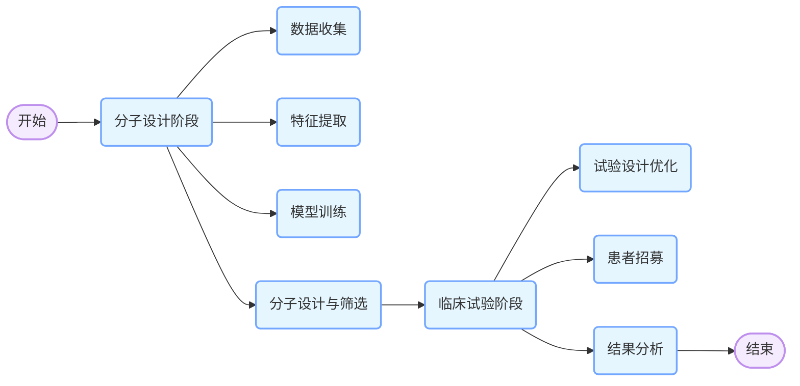

# AI辅助新药研发：从分子设计到临床试验

> 关键词：AI辅助新药研发、分子设计、临床试验、机器学习、药物发现

> 摘要：本文深入探讨了AI在新药研发过程中的应用，从分子设计阶段开始，逐步阐述到临床试验阶段。详细介绍了相关的核心概念、算法原理、数学模型，通过实际案例展示了AI在新药研发中的具体应用。同时，推荐了相关的学习资源、开发工具和论文著作，最后对AI辅助新药研发的未来发展趋势与挑战进行了总结，并解答了常见问题。旨在为相关领域的研究人员和从业者提供全面而深入的技术参考。

## 1. 背景介绍 
### 1.1 目的和范围
新药研发是一个漫长、复杂且成本高昂的过程，传统的研发方式面临着诸多挑战，如研发周期长、成功率低等。本文章的目的在于探讨如何利用AI技术来优化新药研发流程，从分子设计阶段开始，通过更高效的方式筛选和设计具有潜在治疗效果的分子，然后在临床试验阶段辅助进行试验设计、患者招募和结果分析等工作，提高研发效率和成功率。文章的范围涵盖了AI在新药研发各个关键环节的应用，包括核心概念、算法原理、实际案例等方面。

### 1.2 预期读者
本文预期读者包括从事新药研发的科研人员、生物信息学家、计算机科学家、药企的研发管理人员以及对AI在医疗领域应用感兴趣的相关专业学生。对于科研人员来说，可以从中获取AI在新药研发中的最新技术和方法；药企管理人员可以了解如何利用AI技术优化研发流程和降低成本；学生则可以通过本文初步了解该领域的知识体系和研究方向。

### 1.3 文档结构概述
本文首先介绍背景信息，包括目的、预期读者和文档结构。接着阐述核心概念与联系，展示相关的原理和架构。然后详细讲解核心算法原理及具体操作步骤，通过Python代码进行说明。之后介绍数学模型和公式，并举例说明。在项目实战部分，给出代码实际案例和详细解释。再介绍实际应用场景，推荐相关的工具和资源。最后对未来发展趋势与挑战进行总结，解答常见问题，并提供扩展阅读和参考资料。

### 1.4 术语表
#### 1.4.1 核心术语定义
- **AI（Artificial Intelligence）**：人工智能，指计算机系统能够执行通常需要人类智能才能完成的任务，如学习、推理、解决问题等。
- **新药研发**：从发现具有潜在治疗作用的化合物开始，经过一系列的研究和试验，最终将药物推向市场的过程。
- **分子设计**：通过计算机技术和算法，设计出具有特定生物学活性和物理化学性质的分子结构。
- **临床试验**：在人体上进行的药物试验，分为多个阶段，用于评估药物的安全性和有效性。

#### 1.4.2 相关概念解释
- **机器学习**：AI的一个分支，让计算机通过数据学习模式和规律，从而进行预测和决策。在新药研发中，可用于预测分子的活性、毒性等。
- **深度学习**：一种特殊的机器学习方法，使用神经网络模型，能够处理复杂的数据和模式。常用于图像识别、自然语言处理等，在新药研发中可用于分析生物图像和文本数据。
- **虚拟筛选**：利用计算机模拟技术，从大量的化合物库中筛选出可能具有活性的分子。

#### 1.4.3 缩略词列表
- **AI**：Artificial Intelligence
- **ML**：Machine Learning
- **DL**：Deep Learning
- **QSAR**：Quantitative Structure-Activity Relationship
- **FDA**：Food and Drug Administration

## 2. 核心概念与联系 
### 核心概念原理
#### 分子设计阶段
在分子设计阶段，AI主要基于机器学习和深度学习算法，对已知的分子结构和其生物学活性数据进行学习，建立预测模型。这些模型可以根据输入的分子特征，预测分子的活性、毒性、药代动力学性质等。例如，通过定量构效关系（QSAR）模型，分析分子的化学结构与生物活性之间的定量关系，从而设计出具有更好活性的分子。

#### 临床试验阶段
在临床试验阶段，AI可以辅助进行试验设计、患者招募和结果分析。在试验设计方面，AI可以根据患者的特征和疾病的流行情况，优化试验方案，提高试验的效率和准确性。在患者招募方面，AI可以通过分析电子病历和社交媒体数据，快速找到符合试验条件的患者。在结果分析方面，AI可以处理大量的临床试验数据，发现潜在的疗效和安全性问题。

### 架构的文本示意图
```plaintext
AI辅助新药研发架构

分子设计阶段
|-- 数据收集（分子结构数据、活性数据等）
|-- 特征提取（分子描述符、指纹等）
|-- 模型训练（机器学习、深度学习模型）
|-- 分子设计与筛选（预测活性、毒性等）

临床试验阶段
|-- 试验设计优化（患者特征分析、疾病流行情况分析）
|-- 患者招募（电子病历分析、社交媒体数据挖掘）
|-- 结果分析（处理大量试验数据，发现疗效和安全性问题）
```

### Mermaid流程图


## 3. 核心算法原理 & 具体操作步骤 
### 核心算法原理
#### 机器学习算法 - 随机森林
随机森林是一种集成学习算法，由多个决策树组成。在新药研发中，随机森林可以用于预测分子的活性。其原理是通过对训练数据进行多次随机采样，构建多个决策树，每个决策树对输入的分子特征进行分类或回归，最后通过投票或平均的方式得到最终的预测结果。

#### 深度学习算法 - 卷积神经网络（CNN）
CNN常用于处理图像和序列数据。在新药研发中，可以将分子结构表示为图像或序列，然后使用CNN进行特征提取和分类。CNN通过卷积层、池化层和全连接层，自动学习数据中的特征，从而实现对分子活性的预测。

### 具体操作步骤
#### 数据准备
首先，收集分子结构数据和对应的活性数据。分子结构数据可以用SMILES字符串或分子图表示，活性数据可以是IC50值等。然后，对数据进行清洗和预处理，包括去除重复数据、处理缺失值等。

#### 特征提取
对于分子结构数据，可以提取分子描述符、指纹等特征。分子描述符可以是分子的物理化学性质，如分子量、氢键供体数等；指纹可以表示分子的化学结构特征。

#### 模型训练
使用准备好的数据和提取的特征，训练随机森林或CNN模型。在训练过程中，需要选择合适的超参数，如决策树的数量、卷积核的大小等。可以使用交叉验证的方法来评估模型的性能。

#### 分子设计与筛选
使用训练好的模型，对新的分子进行活性预测。根据预测结果，筛选出具有潜在活性的分子进行进一步的研究。

### Python源代码示例
```python
import pandas as pd
from sklearn.ensemble import RandomForestRegressor
from sklearn.model_selection import train_test_split
from sklearn.metrics import mean_squared_error

# 数据准备
data = pd.read_csv('molecule_data.csv')
X = data.drop('activity', axis=1)  # 特征数据
y = data['activity']  # 活性数据

# 划分训练集和测试集
X_train, X_test, y_train, y_test = train_test_split(X, y, test_size=0.2, random_state=42)

# 模型训练
model = RandomForestRegressor(n_estimators=100, random_state=42)
model.fit(X_train, y_train)

# 模型预测
y_pred = model.predict(X_test)

# 模型评估
mse = mean_squared_error(y_test, y_pred)
print(f"Mean Squared Error: {mse}")
```

## 4. 数学模型和公式 & 详细讲解 & 举例说明 
### 定量构效关系（QSAR）模型
#### 数学模型和公式
QSAR模型的基本形式可以表示为：
$$
Y = f(X_1, X_2, \cdots, X_n) + \epsilon
$$
其中，$Y$ 表示分子的生物活性，$X_1, X_2, \cdots, X_n$ 表示分子的特征（如分子描述符），$f$ 是一个函数关系，$\epsilon$ 是误差项。

#### 详细讲解
QSAR模型的核心是建立分子特征与生物活性之间的定量关系。通过对大量已知分子的特征和活性数据进行分析，使用统计方法或机器学习算法来确定函数 $f$ 的形式。常见的方法包括线性回归、多元线性回归、支持向量机等。

#### 举例说明
假设我们要建立一个预测分子IC50值的QSAR模型。我们收集了100个分子的特征数据（如分子量、氢键供体数等）和对应的IC50值。使用多元线性回归方法，得到如下模型：
$$
\log(IC50) = 0.1 \times MW + 0.2 \times HBD - 0.3 \times HBA + 0.5
$$
其中，$MW$ 表示分子量，$HBD$ 表示氢键供体数，$HBA$ 表示氢键受体数。通过这个模型，我们可以根据分子的特征预测其IC50值。

### 深度学习中的损失函数
#### 数学模型和公式
在深度学习中，常用的损失函数是均方误差（MSE）和交叉熵损失。

均方误差的公式为：
$$
MSE = \frac{1}{n} \sum_{i=1}^{n} (y_i - \hat{y}_i)^2
$$
其中，$y_i$ 是真实值，$\hat{y}_i$ 是预测值，$n$ 是样本数量。

交叉熵损失的公式为：
$$
CE = - \frac{1}{n} \sum_{i=1}^{n} [y_i \log(\hat{y}_i) + (1 - y_i) \log(1 - \hat{y}_i)]
$$
适用于二分类问题。

#### 详细讲解
损失函数用于衡量模型预测值与真实值之间的差异。在训练深度学习模型时，我们的目标是最小化损失函数。通过不断调整模型的参数，使得损失函数的值逐渐减小，从而提高模型的预测性能。

#### 举例说明
假设我们有一个二分类问题，真实标签为 $y = [1, 0, 1]$，模型的预测概率为 $\hat{y} = [0.8, 0.2, 0.9]$。使用交叉熵损失计算如下：
$$
CE = - \frac{1}{3} [(1 \times \log(0.8) + (1 - 1) \times \log(1 - 0.8)) + (0 \times \log(0.2) + (1 - 0) \times \log(1 - 0.2)) + (1 \times \log(0.9) + (1 - 1) \times \log(1 - 0.9))]
$$
通过计算得到交叉熵损失的值，我们可以评估模型在这个数据集上的性能。

## 5. 项目实战：代码实际案例和详细解释说明 
### 5.1  开发环境搭建
#### 操作系统
可以选择Windows、Linux或macOS操作系统。建议使用Linux系统，因为它在科学计算和机器学习领域有更好的支持。

#### Python环境
安装Python 3.7及以上版本。可以使用Anaconda来管理Python环境，它包含了许多常用的科学计算和机器学习库。

#### 安装必要的库
使用以下命令安装必要的库：
```bash
pip install pandas numpy scikit-learn tensorflow keras rdkit
```
其中，`pandas` 和 `numpy` 用于数据处理，`scikit-learn` 用于机器学习算法，`tensorflow` 和 `keras` 用于深度学习，`rdkit` 用于分子结构处理。

### 5.2  源代码详细实现和代码解读
```python
import pandas as pd
import numpy as np
from rdkit import Chem
from rdkit.Chem import AllChem
from sklearn.model_selection import train_test_split
from sklearn.ensemble import RandomForestClassifier
from sklearn.metrics import accuracy_score

# 数据加载和预处理
def load_data(file_path):
    data = pd.read_csv(file_path)
    smiles = data['SMILES']
    labels = data['label']
    
    # 计算分子指纹
    fps = []
    for smile in smiles:
        mol = Chem.MolFromSmiles(smile)
        if mol is not None:
            fp = AllChem.GetMorganFingerprintAsBitVect(mol, 2, nBits=1024)
            arr = np.zeros((1,))
            AllChem.DataStructs.ConvertToNumpyArray(fp, arr)
            fps.append(arr)
        else:
            fps.append(np.zeros(1024))
    
    X = np.array(fps)
    y = np.array(labels)
    return X, y

# 模型训练和评估
def train_model(X, y):
    X_train, X_test, y_train, y_test = train_test_split(X, y, test_size=0.2, random_state=42)
    
    model = RandomForestClassifier(n_estimators=100, random_state=42)
    model.fit(X_train, y_train)
    
    y_pred = model.predict(X_test)
    accuracy = accuracy_score(y_test, y_pred)
    print(f"Accuracy: {accuracy}")

# 主函数
if __name__ == "__main__":
    file_path = 'molecule_data.csv'
    X, y = load_data(file_path)
    train_model(X, y)
```

### 5.3  代码解读与分析
#### 数据加载和预处理
- `load_data` 函数用于加载数据和计算分子指纹。首先，从CSV文件中读取SMILES字符串和标签。然后，使用 `rdkit` 库将SMILES字符串转换为分子对象，并计算摩根指纹。最后，将指纹转换为NumPy数组。

#### 模型训练和评估
- `train_model` 函数用于训练随机森林分类器并评估模型性能。首先，将数据划分为训练集和测试集。然后，使用随机森林分类器进行训练。最后，使用测试集进行预测，并计算准确率。

#### 主函数
- 主函数调用 `load_data` 和 `train_model` 函数，完成数据加载、模型训练和评估的整个流程。

## 6. 实际应用场景 
### 分子设计阶段
#### 虚拟筛选
通过AI模型对大量的化合物库进行虚拟筛选，快速找到具有潜在活性的分子。例如，药企可以使用虚拟筛选技术，从数百万个化合物中筛选出可能对特定疾病有效的分子，大大减少了实验筛选的工作量和成本。

#### 先导化合物优化
利用AI技术对已有的先导化合物进行优化，提高其活性、选择性和药代动力学性质。通过分析分子结构和活性之间的关系，设计出更优的化合物结构。

### 临床试验阶段
#### 试验设计优化
AI可以根据患者的特征和疾病的流行情况，优化临床试验方案。例如，通过分析电子病历数据，确定最适合的患者群体和试验剂量，提高试验的效率和准确性。

#### 患者招募
AI可以通过分析电子病历、社交媒体数据和基因数据，快速找到符合试验条件的患者。例如，利用自然语言处理技术从电子病历中提取患者的特征信息，筛选出合适的患者进行招募。

#### 结果分析
AI可以处理大量的临床试验数据，发现潜在的疗效和安全性问题。例如，使用机器学习算法对患者的生理指标和药物反应数据进行分析，预测药物的疗效和副作用。

## 7. 工具和资源推荐
### 7.1 学习资源推荐
#### 7.1.1 书籍推荐
- 《人工智能：一种现代的方法》：全面介绍了人工智能的基本概念、算法和应用，是人工智能领域的经典教材。
- 《Python机器学习》：详细介绍了Python在机器学习中的应用，包括数据处理、模型训练和评估等方面。
- 《深度学习》：由深度学习领域的三位顶尖专家撰写，深入讲解了深度学习的原理和应用。

#### 7.1.2 在线课程
- Coursera上的“机器学习”课程：由Andrew Ng教授讲授，是机器学习领域的经典课程，适合初学者入门。
- edX上的“深度学习微硕士项目”：提供了系统的深度学习课程，包括神经网络、卷积神经网络等内容。
- Kaggle上的“机器学习入门”课程：通过实际案例和竞赛，让学习者快速掌握机器学习的应用。

#### 7.1.3 技术博客和网站
- Medium：有许多关于AI和新药研发的技术博客文章，涵盖了最新的研究成果和应用案例。
- Towards Data Science：专注于数据科学和机器学习领域，提供了丰富的技术文章和教程。
- Bioinformatics.org：生物信息学领域的专业网站，有许多关于AI在生物医学领域应用的文章和资源。

### 7.2 开发工具框架推荐
#### 7.2.1 IDE和编辑器
- PyCharm：功能强大的Python集成开发环境，提供了代码编辑、调试、版本控制等功能。
- Jupyter Notebook：交互式的开发环境，适合进行数据探索和模型训练。可以方便地展示代码、图表和文本。
- Visual Studio Code：轻量级的代码编辑器，支持多种编程语言和插件，可用于开发和调试Python代码。

#### 7.2.2 调试和性能分析工具
- TensorBoard：TensorFlow的可视化工具，可用于监控模型训练过程、查看损失函数和准确率等指标。
- Scikit-learn的GridSearchCV：用于模型超参数调优，通过网格搜索的方式找到最优的超参数组合。
- Profiler：Python的性能分析工具，可用于找出代码中的性能瓶颈。

#### 7.2.3 相关框架和库
- TensorFlow：开源的深度学习框架，提供了丰富的深度学习模型和工具，广泛应用于图像识别、自然语言处理等领域。
- PyTorch：另一个流行的深度学习框架，具有动态图和易于使用的特点，受到许多科研人员的青睐。
- RDKit：开源的化学信息学库，提供了分子结构处理、指纹计算、化学反应模拟等功能。

### 7.3 相关论文著作推荐
#### 7.3.1 经典论文
- “Deep Learning in Drug Discovery”：介绍了深度学习在药物发现中的应用，包括分子设计、靶点预测等方面。
- “Machine Learning Approaches in Drug Discovery and Development”：综述了机器学习在药物研发中的各种应用和方法。
- “Quantitative Structure-Activity Relationships”：经典的QSAR模型论文，阐述了分子结构与生物活性之间的定量关系。

#### 7.3.2 最新研究成果
- 在Nature、Science、Cell等顶级期刊上搜索关于AI辅助新药研发的最新研究论文，了解该领域的前沿动态。
- 关注国际学术会议，如ACM SIGKDD、NeurIPS等，获取最新的研究成果和技术报告。

#### 7.3.3 应用案例分析
- 阅读药企和科研机构发布的AI辅助新药研发的应用案例报告，了解实际应用中的经验和挑战。
- 分析公开的数据集和竞赛项目，学习如何将AI技术应用于新药研发的实际问题。

## 8. 总结：未来发展趋势与挑战
### 未来发展趋势
#### 多组学数据融合
未来，AI将更多地融合基因组学、转录组学、蛋白质组学等多组学数据，全面了解疾病的发生发展机制和药物的作用靶点，提高新药研发的准确性和成功率。

#### 强化学习在新药研发中的应用
强化学习可以在复杂的环境中进行决策和优化，未来有望在分子设计和临床试验设计中发挥重要作用。通过与环境的交互，不断调整策略，找到最优的药物研发方案。

#### 人工智能与实验技术的结合
AI将与高通量实验技术、基因编辑技术等相结合，实现快速、高效的新药研发。例如，利用AI设计分子，然后通过高通量实验进行验证和优化。

### 挑战
#### 数据质量和隐私问题
AI模型的性能依赖于大量高质量的数据，但在新药研发领域，数据的获取和标注往往比较困难。同时，患者数据的隐私保护也是一个重要问题，需要在数据使用和共享过程中采取有效的措施。

#### 模型可解释性
深度学习模型通常是黑箱模型，难以解释其决策过程和结果。在新药研发中，模型的可解释性至关重要，因为医生和监管机构需要了解药物的作用机制和安全性。

#### 跨学科合作
AI辅助新药研发需要计算机科学、生物学、医学等多个学科的专业知识和技能。跨学科合作的难度较大，需要建立有效的沟通机制和合作模式。

## 9. 附录：常见问题与解答
### 问题1：AI在新药研发中的准确性如何保证？
答：可以通过以下方法保证AI在新药研发中的准确性：
- 使用大量高质量的数据进行模型训练，确保数据的多样性和代表性。
- 采用交叉验证、留一法等方法对模型进行评估和验证，选择性能最优的模型。
- 对模型进行可解释性分析，了解模型的决策过程和依据，提高模型的可信度。

### 问题2：AI能否完全替代传统的新药研发方法？
答：目前AI还不能完全替代传统的新药研发方法。虽然AI可以提高研发效率和准确性，但新药研发涉及到许多复杂的生物学和医学问题，需要人类的专业知识和经验进行判断和决策。AI可以作为传统方法的补充和优化，与传统方法相结合，共同推动新药研发的发展。

### 问题3：如何解决AI模型在新药研发中的可解释性问题？
答：可以采用以下方法解决AI模型的可解释性问题：
- 使用可解释的机器学习模型，如决策树、线性回归等，这些模型的决策过程比较容易理解。
- 采用模型解释技术，如特征重要性分析、局部可解释模型无关解释（LIME）等，对模型的决策结果进行解释。
- 结合领域知识，将模型的输出与生物学和医学知识相结合，提高模型的可解释性。

## 10. 扩展阅读 & 参考资料
### 扩展阅读
- 《药物化学》：深入了解药物的化学结构和作用机制，为AI辅助新药研发提供化学基础。
- 《医学统计学》：掌握临床试验数据的统计分析方法，有助于理解AI在临床试验阶段的应用。
- 《生物信息学》：学习生物数据的处理和分析方法，了解AI在生物信息学中的应用。

### 参考资料
- 相关的科研论文和报告，如Nature、Science、Cell等期刊上的文章。
- 药企和科研机构发布的技术文档和白皮书。
- 开源代码库，如GitHub上的相关项目，可用于学习和参考。

作者：AI天才研究院/AI Genius Institute & 禅与计算机程序设计艺术 /Zen And The Art of Computer Programming