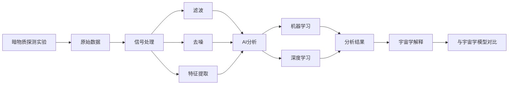

# AI辅助暗物质探测数据分析：从信号处理到宇宙学解释

> 关键词：AI，暗物质探测，数据分析，信号处理，宇宙学解释

> 摘要：本文围绕AI辅助暗物质探测数据分析展开，全面探讨从信号处理到宇宙学解释的整个过程。首先介绍了暗物质探测数据分析的背景，包括目的、预期读者、文档结构和相关术语。接着阐述了核心概念及其联系，详细讲解了核心算法原理和具体操作步骤，并给出Python代码示例。通过数学模型和公式进一步深入剖析，同时结合项目实战展示代码实现和解读。分析了实际应用场景，推荐了相关工具和资源，最后总结了未来发展趋势与挑战，还提供了常见问题解答和扩展阅读参考资料，旨在为该领域的研究和实践提供全面且深入的指导。

## 1. 背景介绍 
### 1.1 目的和范围
暗物质是现代宇宙学中一个极具挑战性和重要性的研究课题。尽管大量的天文观测数据表明暗物质的存在，但至今我们仍未直接探测到它。暗物质探测实验会产生海量的数据，这些数据中可能蕴含着暗物质与普通物质相互作用的微弱信号。本研究的目的是探讨如何利用人工智能（AI）技术来辅助暗物质探测数据分析，从复杂的信号中提取有价值的信息，并将其与宇宙学理论相结合进行解释。

本研究的范围涵盖了从信号处理阶段，即对原始探测数据进行清洗、特征提取等操作，到最终的宇宙学解释，包括对暗物质的性质、分布等方面的推断。我们将研究不同类型的AI算法在暗物质探测数据分析中的应用，评估其性能，并探讨如何将分析结果与现有的宇宙学模型相融合。

### 1.2 预期读者
本文预期读者包括从事暗物质探测实验的物理学家、研究人工智能在科学领域应用的计算机科学家、对宇宙学和数据分析感兴趣的研究生和科研人员。对于物理学家而言，希望通过本文了解AI技术如何为暗物质探测提供新的分析手段；对于计算机科学家，可从中了解暗物质探测领域的数据分析需求和挑战，为AI算法的应用提供新的场景；对于研究生和科研人员，本文可作为该领域的入门参考和研究启发。

### 1.3 文档结构概述
本文将按照以下结构进行组织：首先介绍相关的核心概念及其联系，包括暗物质探测、信号处理和宇宙学解释等概念之间的关系；接着详细讲解核心算法原理和具体操作步骤，使用Python代码进行示例；然后给出相关的数学模型和公式，并通过举例进行说明；通过项目实战展示代码的实际应用和详细解释；分析暗物质探测数据分析在实际中的应用场景；推荐相关的工具和资源，包括学习资源、开发工具框架和相关论文著作；最后总结未来发展趋势与挑战，提供常见问题解答和扩展阅读参考资料。

### 1.4 术语表
#### 1.4.1 核心术语定义
- **暗物质（Dark Matter）**：一种假设的物质形式，它不与电磁辐射相互作用，因此无法直接观测到，但通过引力效应影响可见物质的运动和宇宙结构的形成。
- **信号处理（Signal Processing）**：对信号进行采集、变换、滤波、检测、估计等操作，以提取有用信息或改善信号质量的过程。
- **宇宙学解释（Cosmological Interpretation）**：将观测数据和分析结果与宇宙学理论相结合，对宇宙的起源、演化和结构进行解释的过程。
- **人工智能（Artificial Intelligence，AI）**：研究如何使计算机系统能够模拟人类智能的技术，包括机器学习、深度学习等方法。
- **机器学习（Machine Learning）**：让计算机通过数据学习模式和规律，并进行预测和决策的技术。
- **深度学习（Deep Learning）**：一种基于神经网络的机器学习方法，通过多层神经网络自动学习数据的特征表示。

#### 1.4.2 相关概念解释
- **暗物质探测实验**：旨在直接或间接探测暗物质与普通物质相互作用的实验，常见的有地下实验、空间实验和对撞机实验等。
- **信号噪声**：在探测过程中，除了可能的暗物质信号外，还会受到各种噪声的干扰，如探测器自身的噪声、环境辐射等。
- **特征提取**：从原始数据中提取能够代表数据特征的信息，以便后续的分析和分类。
- **宇宙学模型**：描述宇宙的结构、演化和组成的数学模型，如标准宇宙学模型（ΛCDM模型）。

#### 1.4.3 缩略词列表
- **AI**：Artificial Intelligence，人工智能
- **ML**：Machine Learning，机器学习
- **DL**：Deep Learning，深度学习
- **CDM**：Cold Dark Matter，冷暗物质
- **ΛCDM**：Lambda-Cold Dark Matter，包含宇宙学常数的冷暗物质模型

## 2. 核心概念与联系 
### 核心概念原理
#### 暗物质探测
暗物质探测的基本原理是基于暗物质与普通物质之间可能存在的相互作用。目前主要有三种探测方法：直接探测、间接探测和对撞机探测。直接探测实验通常在地下实验室进行，以减少宇宙射线的干扰，通过探测暗物质与探测器材料中的原子核碰撞产生的微弱信号来寻找暗物质。间接探测则是通过观测暗物质湮灭或衰变产生的次级粒子，如伽马射线、中微子等，来推断暗物质的存在。对撞机探测则是在高能对撞机中试图产生暗物质粒子。

#### 信号处理
信号处理在暗物质探测中起着至关重要的作用。原始的探测数据往往包含大量的噪声和干扰，需要进行信号处理来提取可能的暗物质信号。信号处理的主要步骤包括滤波、去噪、特征提取等。滤波可以去除特定频率的噪声，去噪方法可以采用时域或频域的滤波技术，如小波变换、卡尔曼滤波等。特征提取则是从处理后的信号中提取能够代表暗物质信号特征的参数，如信号的幅度、频率、持续时间等。

#### 宇宙学解释
宇宙学解释是将暗物质探测数据分析的结果与宇宙学理论相结合，对暗物质的性质和宇宙的演化进行推断。宇宙学模型提供了描述宇宙结构形成和演化的框架，通过将观测数据与模型预测进行比较，可以检验模型的正确性，并对暗物质的参数进行约束。例如，通过分析星系的旋转曲线、宇宙微波背景辐射等数据，可以推断暗物质的密度分布和质量。

### 架构的文本示意图
```plaintext
暗物质探测实验 --> 原始数据 --> 信号处理（滤波、去噪、特征提取） --> AI分析（机器学习、深度学习） --> 分析结果 --> 宇宙学解释（与宇宙学模型对比）
```

### Mermaid 流程图


## 3. 核心算法原理 & 具体操作步骤 
### 机器学习算法 - 支持向量机（SVM）原理
支持向量机是一种常用的监督学习算法，用于分类和回归分析。在暗物质探测数据分析中，我们可以使用SVM来区分暗物质信号和噪声信号。

#### 原理
SVM的基本思想是在特征空间中找到一个最优的超平面，使得不同类别的样本能够被最大程度地分开。对于线性可分的数据集，SVM通过求解一个凸二次规划问题来找到最优超平面。对于线性不可分的数据集，SVM引入了松弛变量和核函数的概念。

核函数可以将低维特征空间映射到高维特征空间，使得在高维空间中数据集变得线性可分。常见的核函数有线性核、多项式核、高斯核等。

#### Python代码示例
```python
import numpy as np
from sklearn import svm
from sklearn.model_selection import train_test_split
from sklearn.metrics import accuracy_score

# 生成示例数据
np.random.seed(0)
X = np.r_[np.random.randn(20, 2) - [2, 2], np.random.randn(20, 2) + [2, 2]]
Y = [0] * 20 + [1] * 20

# 划分训练集和测试集
X_train, X_test, y_train, y_test = train_test_split(X, Y, test_size=0.2, random_state=42)

# 创建SVM分类器
clf = svm.SVC(kernel='linear')

# 训练模型
clf.fit(X_train, y_train)

# 预测
y_pred = clf.predict(X_test)

# 计算准确率
accuracy = accuracy_score(y_test, y_pred)
print(f"Accuracy: {accuracy}")
```

### 深度学习算法 - 卷积神经网络（CNN）原理
卷积神经网络是一种专门用于处理具有网格结构数据的深度学习模型，如图像、音频等。在暗物质探测数据分析中，CNN可以用于对探测器图像或信号序列进行特征提取和分类。

#### 原理
CNN主要由卷积层、池化层和全连接层组成。卷积层通过卷积核在输入数据上滑动，提取局部特征。池化层用于减少特征图的尺寸，降低计算量，同时增强模型的鲁棒性。全连接层将卷积层和池化层提取的特征进行整合，输出最终的分类结果。

#### Python代码示例
```python
import tensorflow as tf
from tensorflow.keras import layers, models

# 构建CNN模型
model = models.Sequential()
model.add(layers.Conv2D(32, (3, 3), activation='relu', input_shape=(32, 32, 3)))
model.add(layers.MaxPooling2D((2, 2)))
model.add(layers.Conv2D(64, (3, 3), activation='relu'))
model.add(layers.MaxPooling2D((2, 2)))
model.add(layers.Conv2D(64, (3, 3), activation='relu'))
model.add(layers.Flatten())
model.add(layers.Dense(64, activation='relu'))
model.add(layers.Dense(10))

# 编译模型
model.compile(optimizer='adam',
              loss=tf.keras.losses.SparseCategoricalCrossentropy(from_logits=True),
              metrics=['accuracy'])

# 示例训练数据（这里使用随机数据代替实际数据）
train_images = tf.random.normal([1000, 32, 32, 3])
train_labels = tf.random.uniform([1000], minval=0, maxval=10, dtype=tf.int32)

# 训练模型
model.fit(train_images, train_labels, epochs=5)
```

### 具体操作步骤
1. **数据预处理**：对原始探测数据进行清洗和标准化处理，去除噪声和异常值。
2. **特征提取**：使用信号处理技术从预处理后的数据中提取特征，如时域特征、频域特征等。
3. **模型选择**：根据数据的特点和分析任务选择合适的AI算法，如SVM、CNN等。
4. **模型训练**：使用训练数据对模型进行训练，调整模型的参数以优化性能。
5. **模型评估**：使用测试数据对训练好的模型进行评估，计算评估指标，如准确率、召回率等。
6. **结果分析**：对模型的预测结果进行分析，结合宇宙学理论进行解释。

## 4. 数学模型和公式 & 详细讲解 & 举例说明 
### 支持向量机数学模型
#### 线性可分情况
对于线性可分的数据集 $\{(x_i, y_i)\}_{i=1}^n$，其中 $x_i \in \mathbb{R}^d$ 是特征向量，$y_i \in \{-1, 1\}$ 是类别标签，SVM的目标是找到一个超平面 $w^T x + b = 0$，使得不同类别的样本能够被最大程度地分开。

SVM的优化问题可以表示为：
$$
\begin{aligned}
\min_{w, b} &\quad \frac{1}{2} \|w\|^2 \\
\text{s.t.} &\quad y_i (w^T x_i + b) \geq 1, \quad i = 1, \cdots, n
\end{aligned}
$$

其中，$\|w\|$ 是超平面的法向量的模，约束条件保证了所有样本都被正确分类，并且到超平面的距离至少为 $\frac{1}{\|w\|}$。

#### 线性不可分情况
对于线性不可分的数据集，引入松弛变量 $\xi_i \geq 0$，允许一些样本违反分类约束。优化问题变为：
$$
\begin{aligned}
\min_{w, b, \xi} &\quad \frac{1}{2} \|w\|^2 + C \sum_{i=1}^n \xi_i \\
\text{s.t.} &\quad y_i (w^T x_i + b) \geq 1 - \xi_i, \quad \xi_i \geq 0, \quad i = 1, \cdots, n
\end{aligned}
$$

其中，$C$ 是惩罚参数，用于平衡超平面的间隔和误分类样本的数量。

#### 核函数
为了处理非线性可分的数据集，引入核函数 $K(x_i, x_j) = \phi(x_i)^T \phi(x_j)$，其中 $\phi(x)$ 是将输入特征 $x$ 映射到高维特征空间的函数。优化问题变为：
$$
\begin{aligned}
\max_{\alpha} &\quad \sum_{i=1}^n \alpha_i - \frac{1}{2} \sum_{i=1}^n \sum_{j=1}^n \alpha_i \alpha_j y_i y_j K(x_i, x_j) \\
\text{s.t.} &\quad \sum_{i=1}^n \alpha_i y_i = 0, \quad 0 \leq \alpha_i \leq C, \quad i = 1, \cdots, n
\end{aligned}
$$

### 卷积神经网络数学模型
#### 卷积层
卷积层的输出特征图 $y_{ij}^l$ 可以表示为：
$$
y_{ij}^l = f\left(\sum_{m=0}^{M - 1} \sum_{n=0}^{N - 1} w_{mn}^l x_{i + m, j + n}^{l - 1} + b^l\right)
$$

其中，$f$ 是激活函数，如ReLU函数 $f(x) = \max(0, x)$，$w_{mn}^l$ 是卷积核的权重，$b^l$ 是偏置，$x_{i + m, j + n}^{l - 1}$ 是上一层的输入特征图。

#### 池化层
池化层通常采用最大池化或平均池化。最大池化的输出可以表示为：
$$
y_{ij}^l = \max_{(m, n) \in R_{ij}} x_{mn}^{l - 1}
$$

其中，$R_{ij}$ 是池化窗口对应的区域。

#### 全连接层
全连接层的输出 $y_k$ 可以表示为：
$$
y_k = f\left(\sum_{i=1}^{N} w_{ki} x_i + b_k\right)
$$

其中，$w_{ki}$ 是权重，$b_k$ 是偏置，$x_i$ 是上一层的输入。

### 举例说明
#### 支持向量机举例
假设我们有一个二维数据集，包含两类样本：正类和负类。我们使用SVM来对这些样本进行分类。

```python
import numpy as np
import matplotlib.pyplot as plt
from sklearn import svm

# 生成示例数据
np.random.seed(0)
X = np.r_[np.random.randn(20, 2) - [2, 2], np.random.randn(20, 2) + [2, 2]]
Y = [0] * 20 + [1] * 20

# 创建SVM分类器
clf = svm.SVC(kernel='linear')

# 训练模型
clf.fit(X, Y)

# 绘制数据点
plt.scatter(X[:, 0], X[:, 1], c=Y, cmap=plt.cm.Paired)

# 绘制决策边界
ax = plt.gca()
xlim = ax.get_xlim()
ylim = ax.get_ylim()

# 创建网格点
xx = np.linspace(xlim[0], xlim[1], 30)
yy = np.linspace(ylim[0], ylim[1], 30)
YY, XX = np.meshgrid(yy, xx)
xy = np.vstack([XX.ravel(), YY.ravel()]).T
Z = clf.decision_function(xy).reshape(XX.shape)

# 绘制决策边界和间隔边界
ax.contour(XX, YY, Z, colors='k', levels=[-1, 0, 1], alpha=0.5, linestyles=['--', '-', '--'])

plt.show()
```

#### 卷积神经网络举例
假设我们使用CNN对MNIST手写数字数据集进行分类。

```python
import tensorflow as tf
from tensorflow.keras import layers, models
from tensorflow.keras.datasets import mnist
from tensorflow.keras.utils import to_categorical

# 加载MNIST数据集
(train_images, train_labels), (test_images, test_labels) = mnist.load_data()

# 数据预处理
train_images = train_images.reshape((60000, 28, 28, 1))
train_images = train_images.astype('float32') / 255

test_images = test_images.reshape((10000, 28, 28, 1))
test_images = test_images.astype('float32') / 255

train_labels = to_categorical(train_labels)
test_labels = to_categorical(test_labels)

# 构建CNN模型
model = models.Sequential()
model.add(layers.Conv2D(32, (3, 3), activation='relu', input_shape=(28, 28, 1)))
model.add(layers.MaxPooling2D((2, 2)))
model.add(layers.Conv2D(64, (3, 3), activation='relu'))
model.add(layers.MaxPooling2D((2, 2)))
model.add(layers.Conv2D(64, (3, 3), activation='relu'))
model.add(layers.Flatten())
model.add(layers.Dense(64, activation='relu'))
model.add(layers.Dense(10, activation='softmax'))

# 编译模型
model.compile(optimizer='adam',
              loss='categorical_crossentropy',
              metrics=['accuracy'])

# 训练模型
model.fit(train_images, train_labels, epochs=5, batch_size=64)

# 评估模型
test_loss, test_acc = model.evaluate(test_images, test_labels)
print(f"Test accuracy: {test_acc}")
```

## 5. 项目实战：代码实际案例和详细解释说明 
### 5.1  开发环境搭建
#### 安装Python
首先，需要安装Python环境。建议使用Python 3.7及以上版本。可以从Python官方网站（https://www.python.org/downloads/）下载适合自己操作系统的安装包，并按照安装向导进行安装。

#### 安装必要的库
在暗物质探测数据分析中，我们需要使用一些常用的Python库，如NumPy、Pandas、Scikit-learn、TensorFlow等。可以使用pip命令进行安装：
```sh
pip install numpy pandas scikit-learn tensorflow matplotlib
```

### 5.2  源代码详细实现和代码解读
#### 数据生成和预处理
假设我们模拟一个简单的暗物质探测数据集，其中包含暗物质信号和噪声信号。

```python
import numpy as np

# 生成暗物质信号数据
def generate_dark_matter_signal(num_samples, signal_length):
    signals = []
    for _ in range(num_samples):
        # 模拟暗物质信号的特征
        signal = np.random.normal(loc=1.0, scale=0.1, size=signal_length)
        signals.append(signal)
    return np.array(signals)

# 生成噪声数据
def generate_noise(num_samples, signal_length):
    noises = []
    for _ in range(num_samples):
        # 模拟噪声的特征
        noise = np.random.normal(loc=0.0, scale=0.5, size=signal_length)
        noises.append(noise)
    return np.array(noises)

# 生成数据集
num_samples = 1000
signal_length = 100
dark_matter_signals = generate_dark_matter_signal(num_samples // 2, signal_length)
noises = generate_noise(num_samples // 2, signal_length)

# 合并数据集
X = np.vstack((dark_matter_signals, noises))
y = np.hstack((np.ones(num_samples // 2), np.zeros(num_samples // 2)))

# 划分训练集和测试集
from sklearn.model_selection import train_test_split
X_train, X_test, y_train, y_test = train_test_split(X, y, test_size=0.2, random_state=42)
```

**代码解读**：
- `generate_dark_matter_signal` 函数用于生成暗物质信号数据，通过正态分布模拟信号的特征。
- `generate_noise` 函数用于生成噪声数据，同样使用正态分布模拟噪声的特征。
- 将暗物质信号和噪声数据合并成一个数据集，并为每个样本添加标签。
- 使用 `train_test_split` 函数将数据集划分为训练集和测试集。

#### 使用SVM进行分类
```python
from sklearn import svm
from sklearn.metrics import accuracy_score

# 创建SVM分类器
clf = svm.SVC(kernel='linear')

# 训练模型
clf.fit(X_train, y_train)

# 预测
y_pred = clf.predict(X_test)

# 计算准确率
accuracy = accuracy_score(y_test, y_pred)
print(f"Accuracy: {accuracy}")
```

**代码解读**：
- 创建一个线性核的SVM分类器。
- 使用训练集数据对SVM模型进行训练。
- 使用训练好的模型对测试集数据进行预测。
- 计算预测结果的准确率。

#### 使用CNN进行分类
```python
import tensorflow as tf
from tensorflow.keras import layers, models

# 数据预处理
X_train = X_train.reshape(-1, signal_length, 1)
X_test = X_test.reshape(-1, signal_length, 1)

# 构建CNN模型
model = models.Sequential()
model.add(layers.Conv1D(32, 3, activation='relu', input_shape=(signal_length, 1)))
model.add(layers.MaxPooling1D(2))
model.add(layers.Conv1D(64, 3, activation='relu'))
model.add(layers.MaxPooling1D(2))
model.add(layers.Flatten())
model.add(layers.Dense(64, activation='relu'))
model.add(layers.Dense(1, activation='sigmoid'))

# 编译模型
model.compile(optimizer='adam',
              loss='binary_crossentropy',
              metrics=['accuracy'])

# 训练模型
model.fit(X_train, y_train, epochs=5, batch_size=32)

# 评估模型
test_loss, test_acc = model.evaluate(X_test, y_test)
print(f"Test accuracy: {test_acc}")
```

**代码解读**：
- 将训练集和测试集数据进行形状调整，以适应CNN模型的输入要求。
- 构建一个简单的一维CNN模型，包含卷积层、池化层和全连接层。
- 使用二元交叉熵损失函数和Adam优化器编译模型。
- 使用训练集数据对CNN模型进行训练。
- 使用测试集数据评估模型的性能。

### 5.3  代码解读与分析
#### SVM模型分析
SVM模型在处理线性可分或近似线性可分的数据集时表现较好。在本项目中，我们使用线性核的SVM模型，通过调整惩罚参数 $C$ 可以平衡模型的复杂度和分类准确率。如果数据集是非线性可分的，可以尝试使用其他核函数，如高斯核。

#### CNN模型分析
CNN模型在处理序列数据方面具有优势，通过卷积层和池化层可以自动提取数据的特征。在本项目中，我们使用一维CNN模型对信号数据进行分类。可以通过调整卷积核的数量、大小和层数来优化模型的性能。同时，增加训练数据的数量和多样性也可以提高模型的泛化能力。

## 6. 实际应用场景 
### 直接探测实验数据分析
在暗物质直接探测实验中，探测器会记录暗物质与原子核碰撞产生的微弱信号。这些信号往往淹没在大量的噪声中，传统的信号处理方法可能无法有效地提取暗物质信号。AI技术可以通过学习大量的信号样本，自动识别暗物质信号的特征，提高信号的检测效率和准确率。例如，使用深度学习模型对探测器的波形数据进行分类，区分暗物质信号和噪声信号。

### 间接探测实验数据分析
间接探测实验通过观测暗物质湮灭或衰变产生的次级粒子来推断暗物质的存在。这些次级粒子的信号也非常微弱，并且受到宇宙射线等背景噪声的干扰。AI技术可以用于分析卫星或地面望远镜观测到的伽马射线、中微子等数据，识别可能的暗物质信号特征，如能量谱、空间分布等。通过与宇宙学模型相结合，可以进一步推断暗物质的性质和分布。

### 宇宙学模拟数据验证
宇宙学模拟可以生成大量的暗物质分布和演化数据。AI技术可以用于对这些模拟数据进行分析和验证，评估模拟模型的准确性和可靠性。例如，使用机器学习算法对模拟数据进行分类和聚类，比较不同模拟模型的结果，找出与观测数据最相符的模型。同时，AI技术还可以用于优化宇宙学模拟的参数，提高模拟的精度和效率。

## 7. 工具和资源推荐
### 7.1 学习资源推荐
#### 7.1.1 书籍推荐
- 《机器学习》（周志华）：全面介绍了机器学习的基本概念、算法和应用，是机器学习领域的经典教材。
- 《深度学习》（Ian Goodfellow、Yoshua Bengio和Aaron Courville）：系统地阐述了深度学习的理论和实践，适合深入学习深度学习的读者。
- 《宇宙学》（Steven Weinberg）：详细介绍了宇宙学的基本理论和观测结果，是宇宙学领域的权威著作。

#### 7.1.2 在线课程
- Coursera上的“机器学习”课程（Andrew Ng教授）：经典的机器学习入门课程，涵盖了机器学习的基本算法和应用。
- edX上的“深度学习专项课程”（DeepLearning.AI）：由深度学习领域的专家授课，深入讲解深度学习的理论和实践。
- 中国大学MOOC上的“宇宙学”课程：介绍了宇宙学的基本概念、理论和观测方法。

#### 7.1.3 技术博客和网站
- Medium上的“Towards Data Science”：提供了大量关于数据科学、机器学习和深度学习的技术文章和案例分析。
- arXiv.org：一个开放的预印本平台，包含了大量的科学研究论文，包括暗物质探测和宇宙学方面的研究。
- Kaggle：一个数据科学竞赛平台，提供了丰富的数据集和竞赛项目，可以用于实践和学习。

### 7.2 开发工具框架推荐
#### 7.2.1 IDE和编辑器
- PyCharm：一款功能强大的Python集成开发环境，提供了代码编辑、调试、版本控制等功能。
- Jupyter Notebook：一个交互式的开发环境，适合进行数据探索、模型训练和可视化。
- Visual Studio Code：一款轻量级的代码编辑器，支持多种编程语言和插件扩展。

#### 7.2.2 调试和性能分析工具
- TensorBoard：TensorFlow提供的可视化工具，可以用于监控模型的训练过程、查看模型的结构和性能指标。
- Py-Spy：一个Python性能分析工具，可以用于分析Python代码的运行时间和内存使用情况。
- cProfile：Python标准库中的性能分析模块，可以用于分析Python程序的性能瓶颈。

#### 7.2.3 相关框架和库
- TensorFlow：一个开源的深度学习框架，提供了丰富的神经网络模型和工具，支持分布式训练和模型部署。
- PyTorch：另一个流行的深度学习框架，具有动态图的特点，易于使用和调试。
- Scikit-learn：一个简单易用的机器学习库，提供了各种机器学习算法和工具，如分类、回归、聚类等。

### 7.3 相关论文著作推荐
#### 7.3.1 经典论文
- “The Large Scale Structure of the Universe”（P. J. E. Peebles）：介绍了宇宙大尺度结构的形成和演化理论，是宇宙学领域的经典论文。
- “Particle Dark Matter: Evidence, Candidates and Constraints”（Gianfranco Bertone、Dan Hooper和Joseph Silk）：全面综述了暗物质的探测方法、候选粒子和约束条件。
- “Support-Vector Networks”（Corinna Cortes和Vladimir Vapnik）：提出了支持向量机的基本理论和算法，是机器学习领域的经典论文。

#### 7.3.2 最新研究成果
- 可以通过arXiv.org等预印本平台关注暗物质探测和AI技术在该领域应用的最新研究成果。例如，搜索关键词“Dark Matter Detection with AI”可以找到相关的研究论文。

#### 7.3.3 应用案例分析
- 一些国际知名的暗物质探测实验合作组，如LUX-ZEPLIN、XENON等，会发布他们的实验结果和数据分析方法的相关论文，可以从中了解AI技术在实际实验中的应用案例。

## 8. 总结：未来发展趋势与挑战
### 未来发展趋势
#### 多模态数据融合
未来的暗物质探测实验将采用多种探测方法，产生多模态的数据，如直接探测的信号数据、间接探测的伽马射线数据和中微子数据等。AI技术可以用于融合这些多模态数据，提高暗物质信号的检测能力和对暗物质性质的推断精度。

#### 强化学习在实验优化中的应用
强化学习可以用于优化暗物质探测实验的参数和策略。例如，通过学习不同实验条件下的探测效率和信号特征，自动调整探测器的工作参数，提高实验的灵敏度和效率。

#### 与量子计算的结合
量子计算具有强大的计算能力，可以用于处理复杂的暗物质数据分析任务。未来，AI技术可能与量子计算相结合，开发出更高效的数据分析算法，加速暗物质探测的研究进程。

### 挑战
#### 数据质量和标注问题
暗物质探测实验产生的数据往往具有噪声大、信号微弱等特点，数据质量较差。同时，由于暗物质信号尚未被确证，缺乏大量的标注数据，这给AI模型的训练带来了困难。需要开发更有效的数据预处理和标注方法，提高数据的质量和可用性。

#### 模型可解释性问题
深度学习模型通常是黑盒模型，其决策过程难以解释。在暗物质探测数据分析中，需要对模型的预测结果进行科学的解释，以便与宇宙学理论相结合。因此，需要研究开发具有可解释性的AI模型，提高模型的可信度和实用性。

#### 计算资源和时间成本
AI模型的训练和推理需要大量的计算资源和时间。对于大规模的暗物质探测数据集，计算资源和时间成本成为了限制AI技术应用的重要因素。需要开发更高效的算法和优化策略，降低计算资源的需求和时间成本。

## 9. 附录：常见问题与解答
### 1. AI技术在暗物质探测数据分析中的优势是什么？
AI技术可以自动学习数据中的特征和模式，具有较强的自适应能力和泛化能力。在暗物质探测数据分析中，AI技术可以处理复杂的信号和噪声，提高信号的检测效率和准确率。同时，AI技术可以结合大量的观测数据和宇宙学模型，对暗物质的性质和分布进行更准确的推断。

### 2. 如何选择合适的AI算法进行暗物质探测数据分析？
选择合适的AI算法需要考虑数据的特点和分析任务的需求。如果数据是线性可分的，可以选择线性模型，如线性SVM；如果数据是非线性的，可以选择非线性模型，如深度学习模型。同时，还需要考虑算法的复杂度、计算资源的需求和模型的可解释性等因素。

### 3. 如何评估AI模型在暗物质探测数据分析中的性能？
可以使用常见的评估指标，如准确率、召回率、F1值等，来评估AI模型的分类性能。对于回归任务，可以使用均方误差、平均绝对误差等指标。此外，还可以通过交叉验证、ROC曲线等方法来评估模型的泛化能力和稳定性。

### 4. AI技术能否替代传统的信号处理方法？
AI技术不能完全替代传统的信号处理方法，而是可以与传统方法相结合，发挥各自的优势。传统的信号处理方法在去除噪声、提取特征等方面具有一定的优势，而AI技术可以在复杂信号的分类和模式识别方面提供更强大的能力。

### 5. 如何解决AI模型在暗物质探测数据分析中的可解释性问题？
可以采用一些方法来提高AI模型的可解释性，如特征重要性分析、决策树可视化、局部可解释模型等。这些方法可以帮助我们理解模型的决策过程，找出影响模型预测结果的关键因素。

## 10. 扩展阅读 & 参考资料
### 扩展阅读
- 《人工智能：一种现代的方法》（Stuart Russell和Peter Norvig）：全面介绍了人工智能的理论、算法和应用，是人工智能领域的经典教材。
- 《宇宙的结构》（Brian Greene）：以通俗易懂的语言介绍了宇宙的基本结构和演化，适合对宇宙学感兴趣的读者。
- 《大数据与人工智能》（维克托·迈尔 - 舍恩伯格等）：探讨了大数据和人工智能的发展趋势和应用前景。

### 参考资料
- 相关的学术论文和研究报告，如发表在《Physical Review D》、《Astrophysical Journal》等期刊上的暗物质探测和数据分析相关的论文。
- 国际知名的暗物质探测实验合作组的官方网站，如LUX-ZEPLIN（https://luxzeplin.org/）、XENON（https://xenon1t.org/）等，获取实验数据和研究成果。
- AI技术相关的开源项目和文档，如TensorFlow（https://www.tensorflow.org/）、PyTorch（https://pytorch.org/）等。

作者：AI天才研究院/AI Genius Institute & 禅与计算机程序设计艺术 /Zen And The Art of Computer Programming