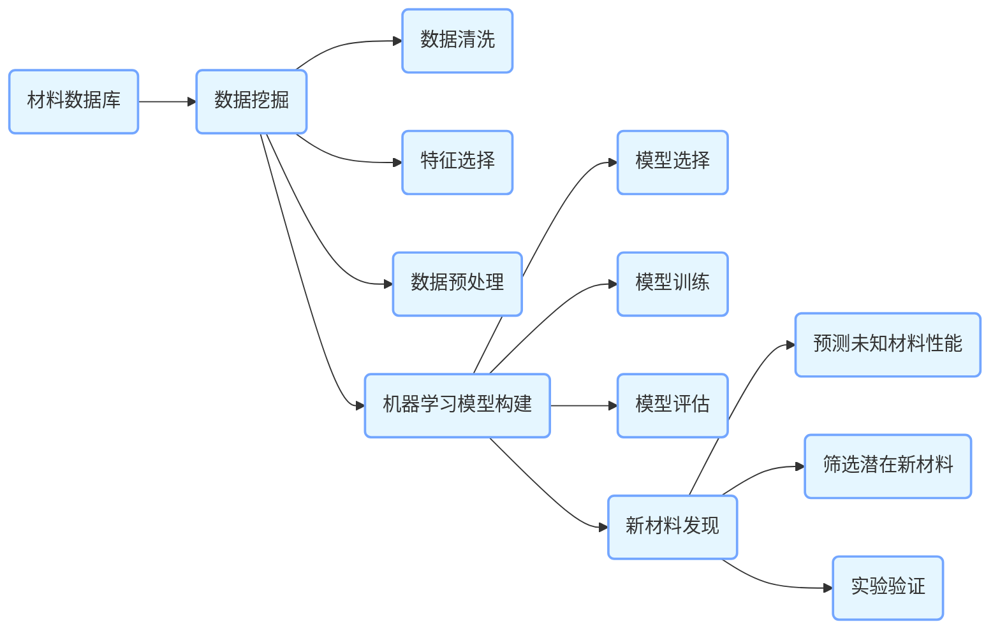

# AI辅助材料科学：从数据挖掘到新材料发现

> 关键词：AI辅助材料科学、数据挖掘、新材料发现、机器学习、材料数据库

> 摘要：本文聚焦于AI辅助材料科学这一前沿领域，深入探讨了从数据挖掘到新材料发现的全过程。首先介绍了该领域的背景信息，包括目的、预期读者等。接着阐述了核心概念及其联系，通过文本示意图和Mermaid流程图进行清晰展示。详细讲解了核心算法原理和具体操作步骤，结合Python源代码进行说明。给出了相关的数学模型和公式，并举例解释。通过项目实战，展示了代码的实际应用和详细解读。分析了实际应用场景，推荐了相关的工具和资源。最后总结了未来发展趋势与挑战，提供了常见问题解答和扩展阅读参考资料，旨在为相关领域的研究人员和开发者提供全面且深入的技术指导。

## 1. 背景介绍 
### 1.1 目的和范围
材料科学作为现代科技的重要基石，对于推动各个领域的发展起着关键作用。传统的材料研发过程往往依赖于经验和试错，耗时费力且成本高昂。随着人工智能技术的飞速发展，将AI应用于材料科学领域，实现从海量材料数据中挖掘有价值信息，进而加速新材料的发现，成为当前研究的热点。本文的目的在于全面介绍AI辅助材料科学的相关技术和方法，涵盖从数据挖掘到新材料发现的整个流程，为研究人员和开发者提供系统的知识体系和实践指导。其范围包括核心概念的阐述、算法原理的讲解、实际项目的案例分析以及未来发展趋势的探讨等。

### 1.2 预期读者
本文的预期读者主要包括材料科学领域的研究人员、人工智能领域的开发者、对跨学科研究感兴趣的学者以及相关专业的学生。对于材料科学研究人员，本文可以帮助他们了解如何利用AI技术提高材料研发效率；对于人工智能开发者，能让他们熟悉材料科学领域的问题和需求，拓展应用场景；对于学者和学生，本文提供了一个跨学科研究的学习范例，有助于拓宽学术视野。

### 1.3 文档结构概述
本文将按照以下结构进行阐述：首先介绍背景信息，让读者对AI辅助材料科学有初步的了解；接着详细讲解核心概念及其联系，通过示意图和流程图直观展示；然后深入探讨核心算法原理和具体操作步骤，结合Python代码进行说明；给出相关的数学模型和公式，并举例解释其应用；通过项目实战，展示代码的实际应用和详细解读；分析实际应用场景，为读者提供应用思路；推荐相关的工具和资源，方便读者进一步学习和研究；最后总结未来发展趋势与挑战，提供常见问题解答和扩展阅读参考资料。

### 1.4 术语表
#### 1.4.1 核心术语定义
- **AI辅助材料科学**：将人工智能技术应用于材料科学领域，利用机器学习、深度学习等方法处理和分析材料数据，以辅助材料研发和新材料发现的交叉学科领域。
- **数据挖掘**：从大量的、不完全的、有噪声的、模糊的、随机的数据中，提取隐含在其中的、人们事先不知道的、但又是潜在有用的信息和知识的过程。
- **新材料发现**：通过理论研究、实验探索等手段，寻找具有新的性能、结构或应用的材料的过程。
- **机器学习**：一门多领域交叉学科，涉及概率论、统计学、逼近论、凸分析、算法复杂度理论等多门学科。它专门研究计算机怎样模拟或实现人类的学习行为，以获取新的知识或技能，重新组织已有的知识结构使之不断改善自身的性能。
- **深度学习**：机器学习的一个分支领域，它是一种基于对数据进行表征学习的方法。深度学习通过构建具有很多层的神经网络模型，自动从数据中学习复杂的模式和特征。

#### 1.4.2 相关概念解释
- **材料数据库**：存储大量材料信息的数据库，包括材料的化学成分、物理性能、制备工艺等数据，是AI辅助材料科学的数据基础。
- **特征工程**：在机器学习中，将原始数据转换为更能代表预测模型的潜在问题的特征的过程，包括特征选择、特征提取和特征构造等。
- **模型评估**：对训练好的机器学习模型进行评估，以衡量其性能和准确性的过程，常用的评估指标包括准确率、召回率、均方误差等。

#### 1.4.3 缩略词列表
- **AI**：Artificial Intelligence，人工智能
- **ML**：Machine Learning，机器学习
- **DL**：Deep Learning，深度学习
- **MSE**：Mean Squared Error，均方误差
- **RMSE**：Root Mean Squared Error，均方根误差

## 2. 核心概念与联系 
### 核心概念原理
在AI辅助材料科学中，核心概念主要包括数据挖掘、机器学习模型构建和新材料发现。数据挖掘是整个流程的基础，它从材料数据库中提取有价值的信息和特征。通过对材料的各种属性数据进行清洗、预处理和特征选择，将其转化为适合机器学习模型输入的格式。

机器学习模型是实现从数据到新材料发现的关键。常用的机器学习模型包括线性回归、决策树、随机森林、支持向量机和深度学习模型等。这些模型通过对训练数据的学习，建立材料属性与结构之间的关系模型。例如，通过学习大量材料的化学成分和物理性能数据，模型可以预测新的化学成分组合对应的物理性能。

新材料发现则是最终目标。在机器学习模型训练完成后，利用模型对未知材料进行预测和筛选。通过输入新的材料特征，模型输出预测的性能指标，研究人员可以根据这些预测结果筛选出具有潜在应用价值的新材料，然后进行实验验证。

### 文本示意图
```plaintext
材料数据库
|
|-- 数据挖掘
|   |-- 数据清洗
|   |-- 特征选择
|   |-- 数据预处理
|
|-- 机器学习模型构建
|   |-- 模型选择
|   |-- 模型训练
|   |-- 模型评估
|
|-- 新材料发现
|   |-- 预测未知材料性能
|   |-- 筛选潜在新材料
|   |-- 实验验证
```

### Mermaid流程图


## 3. 核心算法原理 & 具体操作步骤 
### 线性回归算法原理
线性回归是一种简单而常用的机器学习算法，用于建立自变量和因变量之间的线性关系。在材料科学中，我们可以使用线性回归来预测材料的某种性能（因变量）与其他属性（自变量）之间的关系。

线性回归的数学模型可以表示为：

$$y = \theta_0 + \theta_1x_1 + \theta_2x_2 + \cdots + \theta_nx_n + \epsilon$$

其中，$y$ 是因变量，$x_1, x_2, \cdots, x_n$ 是自变量，$\theta_0, \theta_1, \cdots, \theta_n$ 是模型的参数，$\epsilon$ 是误差项。

线性回归的目标是找到一组最优的参数 $\theta$，使得预测值与真实值之间的误差最小。通常使用最小二乘法来求解参数，即最小化误差平方和：

$$J(\theta) = \frac{1}{2m}\sum_{i=1}^{m}(h_{\theta}(x^{(i)}) - y^{(i)})^2$$

其中，$m$ 是样本数量，$h_{\theta}(x^{(i)})$ 是第 $i$ 个样本的预测值，$y^{(i)}$ 是第 $i$ 个样本的真实值。

### Python代码实现线性回归
```python
import numpy as np
from sklearn.linear_model import LinearRegression
from sklearn.model_selection import train_test_split
from sklearn.metrics import mean_squared_error

# 生成示例数据
np.random.seed(0)
X = np.random.rand(100, 1)
y = 2 * X + 1 + 0.5 * np.random.randn(100, 1)

# 划分训练集和测试集
X_train, X_test, y_train, y_test = train_test_split(X, y, test_size=0.2, random_state=42)

# 创建线性回归模型
model = LinearRegression()

# 训练模型
model.fit(X_train, y_train)

# 预测
y_pred = model.predict(X_test)

# 评估模型
mse = mean_squared_error(y_test, y_pred)
print(f"Mean Squared Error: {mse}")
```

### 具体操作步骤
1. **数据准备**：从材料数据库中获取相关数据，并进行清洗和预处理。将数据划分为训练集和测试集，一般按照80:20的比例划分。
2. **模型选择**：根据问题的特点和数据的性质，选择合适的机器学习模型，如线性回归、决策树等。
3. **模型训练**：使用训练集数据对模型进行训练，通过优化算法（如最小二乘法）找到最优的模型参数。
4. **模型评估**：使用测试集数据对训练好的模型进行评估，计算评估指标（如均方误差、准确率等），评估模型的性能。
5. **预测和筛选**：使用训练好的模型对未知材料进行预测，根据预测结果筛选出具有潜在应用价值的新材料。

## 4. 数学模型和公式 & 详细讲解 & 举例说明 
### 线性回归的数学模型
线性回归的数学模型为：

$$y = \theta_0 + \theta_1x_1 + \theta_2x_2 + \cdots + \theta_nx_n + \epsilon$$

其中，$y$ 是因变量，$x_1, x_2, \cdots, x_n$ 是自变量，$\theta_0, \theta_1, \cdots, \theta_n$ 是模型的参数，$\epsilon$ 是误差项。

### 最小二乘法原理
最小二乘法的目标是最小化误差平方和：

$$J(\theta) = \frac{1}{2m}\sum_{i=1}^{m}(h_{\theta}(x^{(i)}) - y^{(i)})^2$$

其中，$m$ 是样本数量，$h_{\theta}(x^{(i)})$ 是第 $i$ 个样本的预测值，$y^{(i)}$ 是第 $i$ 个样本的真实值。

为了找到使 $J(\theta)$ 最小的 $\theta$，可以对 $J(\theta)$ 求偏导数，并令偏导数等于0：

$$\frac{\partial J(\theta)}{\partial \theta_j} = \frac{1}{m}\sum_{i=1}^{m}(h_{\theta}(x^{(i)}) - y^{(i)})x_j^{(i)} = 0$$

通过求解上述方程组，可以得到最优的 $\theta$ 值。

### 举例说明
假设我们要研究某种材料的硬度（$y$）与化学成分中的碳含量（$x_1$）和硅含量（$x_2$）之间的关系。我们收集了一组样本数据，如下表所示：

| 碳含量 ($x_1$) | 硅含量 ($x_2$) | 硬度 ($y$) |
| -------------- | -------------- | ---------- |
| 0.1            | 0.2            | 10         |
| 0.2            | 0.3            | 12         |
| 0.3            | 0.4            | 14         |
| 0.4            | 0.5            | 16         |
| 0.5            | 0.6            | 18         |

我们可以使用线性回归模型来拟合这些数据：

$$y = \theta_0 + \theta_1x_1 + \theta_2x_2$$

通过最小二乘法求解参数 $\theta_0, \theta_1, \theta_2$，可以得到一个预测模型。然后，我们可以使用这个模型来预测新的碳含量和硅含量组合对应的材料硬度。

## 5. 项目实战：代码实际案例和详细解释说明 
### 5.1  开发环境搭建
#### 安装Python
首先，确保你已经安装了Python 3.x版本。可以从Python官方网站（https://www.python.org/downloads/）下载并安装。

#### 安装必要的库
使用pip命令安装以下必要的库：
```sh
pip install numpy pandas scikit-learn matplotlib
```

### 5.2  源代码详细实现和代码解读
```python
import numpy as np
import pandas as pd
from sklearn.model_selection import train_test_split
from sklearn.linear_model import LinearRegression
from sklearn.metrics import mean_squared_error
import matplotlib.pyplot as plt

# 加载数据
data = pd.read_csv('material_data.csv')

# 提取特征和目标变量
X = data.drop('target_property', axis=1).values
y = data['target_property'].values

# 划分训练集和测试集
X_train, X_test, y_train, y_test = train_test_split(X, y, test_size=0.2, random_state=42)

# 创建线性回归模型
model = LinearRegression()

# 训练模型
model.fit(X_train, y_train)

# 预测
y_pred = model.predict(X_test)

# 评估模型
mse = mean_squared_error(y_test, y_pred)
rmse = np.sqrt(mse)
print(f"Mean Squared Error: {mse}")
print(f"Root Mean Squared Error: {rmse}")

# 可视化结果
plt.scatter(y_test, y_pred)
plt.xlabel('Actual Values')
plt.ylabel('Predicted Values')
plt.title('Actual vs Predicted Values')
plt.show()
```

### 5.3  代码解读与分析
1. **数据加载**：使用 `pandas` 库的 `read_csv` 函数加载材料数据文件 `material_data.csv`。
2. **特征提取**：从数据中提取特征（自变量）和目标变量（因变量），分别存储在 `X` 和 `y` 中。
3. **数据划分**：使用 `sklearn` 库的 `train_test_split` 函数将数据划分为训练集和测试集，测试集占总数据的20%。
4. **模型创建**：创建一个线性回归模型 `LinearRegression()`。
5. **模型训练**：使用训练集数据对模型进行训练，调用 `fit` 方法。
6. **预测**：使用训练好的模型对测试集数据进行预测，调用 `predict` 方法。
7. **模型评估**：使用 `mean_squared_error` 函数计算均方误差，并计算均方根误差。
8. **可视化**：使用 `matplotlib` 库绘制实际值和预测值的散点图，直观展示模型的预测效果。

## 6. 实际应用场景 
### 高性能合金材料研发
在航空航天、汽车制造等领域，对高性能合金材料的需求日益增长。AI辅助材料科学可以通过分析大量合金材料的成分、工艺和性能数据，建立预测模型，快速筛选出具有潜在高性能的合金成分组合。例如，预测合金的强度、硬度、耐腐蚀性等性能，从而加速高性能合金材料的研发进程。

### 新型半导体材料发现
半导体产业是现代信息技术的核心，不断发现新型半导体材料对于提高芯片性能和降低成本至关重要。利用AI技术，可以从海量的材料数据中挖掘出与半导体性能相关的特征，预测新型半导体材料的电学性能、光学性能等。通过筛选出有潜力的材料，再进行实验验证，有望发现具有优异性能的新型半导体材料。

### 生物医用材料设计
生物医用材料在医疗领域有着广泛的应用，如人工关节、心脏支架等。AI辅助材料科学可以结合生物医学数据和材料性能数据，设计出具有良好生物相容性、力学性能和降解性能的生物医用材料。例如，通过预测材料与生物体的相互作用，优化材料的表面性质和结构，提高材料的生物安全性和有效性。

## 7. 工具和资源推荐
### 7.1 学习资源推荐
#### 7.1.1 书籍推荐
- 《机器学习》（周志华）：全面介绍了机器学习的基本概念、算法和应用，是机器学习领域的经典教材。
- 《深度学习》（Ian Goodfellow、Yoshua Bengio和Aaron Courville）：深度学习领域的权威著作，深入讲解了深度学习的理论和实践。
- 《材料科学基础》（胡赓祥、蔡珣、戎咏华）：系统介绍了材料科学的基本概念、理论和方法，是材料科学领域的经典教材。

#### 7.1.2 在线课程
- Coursera上的“机器学习”课程（Andrew Ng教授）：经典的机器学习在线课程，深入浅出地讲解了机器学习的基本算法和应用。
- edX上的“深度学习微硕士项目”：提供了深度学习领域的系统学习课程，包括卷积神经网络、循环神经网络等。
- 中国大学MOOC上的“材料科学基础”课程：由国内知名高校的教授授课，系统介绍了材料科学的基础知识。

#### 7.1.3 技术博客和网站
- Medium：有许多关于AI和材料科学的技术博客，分享最新的研究成果和实践经验。
- arXiv：预印本论文平台，提供了大量关于AI辅助材料科学的最新研究论文。
- Materials Project：提供了丰富的材料数据和计算工具，可用于材料科学研究。

### 7.2 开发工具框架推荐
#### 7.2.1 IDE和编辑器
- PyCharm：功能强大的Python集成开发环境，提供了代码编辑、调试、版本控制等功能。
- Jupyter Notebook：交互式的编程环境，适合进行数据探索和模型实验。
- Visual Studio Code：轻量级的代码编辑器，支持多种编程语言和插件扩展。

#### 7.2.2 调试和性能分析工具
- TensorBoard：用于可视化深度学习模型的训练过程和性能指标。
- Scikit-learn的模型评估工具：提供了各种模型评估指标的计算函数，方便评估模型性能。
- Profiler：Python内置的性能分析工具，可用于分析代码的运行时间和内存使用情况。

#### 7.2.3 相关框架和库
- Scikit-learn：Python中常用的机器学习库，提供了丰富的机器学习算法和工具。
- TensorFlow：Google开发的深度学习框架，支持各种深度学习模型的构建和训练。
- PyTorch：Facebook开发的深度学习框架，具有动态图机制，易于使用和调试。

### 7.3 相关论文著作推荐
#### 7.3.1 经典论文
- “Materials discovery and design using machine learning”（Nature Reviews Materials）：综述了AI在材料发现和设计中的应用。
- “Machine learning for molecular and materials science”（Nature）：介绍了机器学习在分子和材料科学中的最新进展。
- “Accelerated materials property prediction using machine learning”（Physical Review B）：探讨了如何使用机器学习加速材料性能预测。

#### 7.3.2 最新研究成果
可以通过arXiv、IEEE Xplore等数据库搜索最新的研究论文，关注AI辅助材料科学领域的前沿研究。

#### 7.3.3 应用案例分析
- 一些顶级学术期刊（如Science、Nature、Advanced Materials等）会发表AI辅助材料科学的应用案例，可以从中学习实际应用中的方法和经验。

## 8. 总结：未来发展趋势与挑战
### 未来发展趋势
- **多学科融合加深**：AI辅助材料科学将与量子力学、计算化学等学科进一步融合，实现从原子尺度到宏观尺度的材料性能预测和设计。
- **数据驱动的智能材料研发**：随着材料数据库的不断丰富和完善，基于数据驱动的智能材料研发将成为主流，大大提高材料研发的效率和成功率。
- **AI与实验的深度结合**：AI技术将与实验设备和技术深度结合，实现实验过程的自动化和智能化，加速新材料的发现和验证。

### 挑战
- **数据质量和可用性**：材料数据往往存在噪声、缺失值等问题，数据的质量和可用性需要进一步提高。同时，不同来源的数据格式和标准不一致，也给数据整合和分析带来了挑战。
- **模型可解释性**：深度学习等复杂模型虽然在性能预测方面表现出色，但模型的可解释性较差，难以理解模型的决策过程和物理意义。
- **跨学科人才短缺**：AI辅助材料科学是一个跨学科领域，需要同时具备AI和材料科学知识的人才。目前，这类跨学科人才相对短缺，限制了该领域的发展。

## 9. 附录：常见问题与解答
### 问题1：AI辅助材料科学需要具备哪些基础知识？
答：需要具备材料科学的基础知识，包括材料的结构、性能、制备工艺等；同时需要掌握机器学习、深度学习等AI技术的基本概念和算法。此外，还需要具备一定的数学基础，如线性代数、概率论、统计学等。

### 问题2：如何选择合适的机器学习模型？
答：选择合适的机器学习模型需要考虑问题的特点、数据的性质和规模等因素。如果问题是线性回归问题，可以选择线性回归模型；如果问题是非线性问题，可以选择决策树、随机森林、支持向量机等模型；如果数据量较大且问题复杂，可以考虑使用深度学习模型。

### 问题3：如何评估机器学习模型的性能？
答：常用的评估指标包括均方误差（MSE）、均方根误差（RMSE）、准确率、召回率等。对于回归问题，通常使用MSE和RMSE来评估模型的预测误差；对于分类问题，通常使用准确率和召回率来评估模型的分类性能。

### 问题4：如何处理材料数据中的缺失值和噪声？
答：处理缺失值的方法包括删除含有缺失值的样本、填充缺失值（如使用均值、中位数等）、使用插值方法等。处理噪声的方法包括数据平滑、滤波、异常值检测和去除等。

## 10. 扩展阅读 & 参考资料
### 扩展阅读
- 《人工智能：现代方法》（Stuart Russell、Peter Norvig）：全面介绍了人工智能的基本概念、算法和应用，是人工智能领域的经典教材。
- 《材料基因组工程》：介绍了材料基因组工程的概念、方法和应用，与AI辅助材料科学密切相关。

### 参考资料
- 相关学术论文和研究报告
- 材料科学和人工智能领域的专业书籍和教材
- 在线课程和技术博客

作者：AI天才研究院/AI Genius Institute & 禅与计算机程序设计艺术 /Zen And The Art of Computer Programming