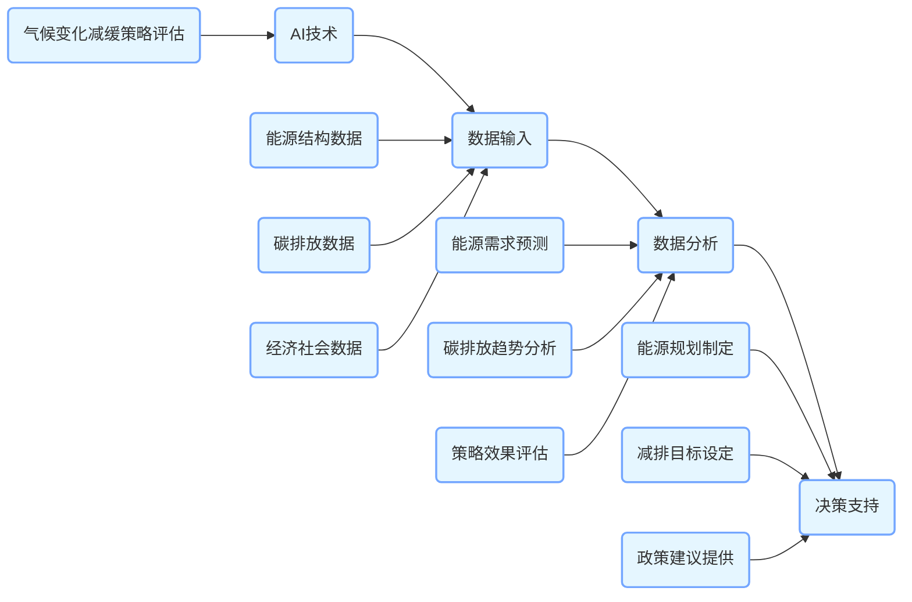

# AI辅助气候变化减缓策略评估：从能源结构到碳排放

> 关键词：AI、气候变化减缓策略、能源结构、碳排放评估、可持续发展

> 摘要：本文聚焦于AI在气候变化减缓策略评估中的应用，从能源结构调整到碳排放分析进行了全面深入的探讨。阐述了相关核心概念及联系，介绍了核心算法原理与具体操作步骤，给出了数学模型和公式并举例说明。通过项目实战展示了代码实现与解读，分析了实际应用场景。同时推荐了学习、开发工具和相关论文著作。最后总结了未来发展趋势与挑战，解答了常见问题并提供了扩展阅读和参考资料，旨在为利用AI评估气候变化减缓策略提供系统的技术指导和理论支持。

## 1. 背景介绍 
### 1.1 目的和范围
随着全球气候变化问题的日益严峻，制定有效的气候变化减缓策略变得至关重要。能源结构的调整和碳排放的控制是应对气候变化的关键环节。本研究的目的在于探讨如何利用人工智能（AI）技术对气候变化减缓策略进行科学、准确的评估，范围涵盖从能源结构的优化调整到碳排放的精确测算与分析，旨在为决策者提供可靠的依据，推动可持续能源发展和碳排放的有效降低。

### 1.2 预期读者
本文预期读者包括从事气候变化研究的科研人员、能源领域的工程师和规划者、政策制定者以及对AI技术在环境领域应用感兴趣的技术爱好者。这些读者希望通过本文了解AI在气候变化减缓策略评估中的具体应用方法和技术原理，从而更好地开展相关工作或进行深入研究。

### 1.3 文档结构概述
本文将首先介绍相关的核心概念与联系，包括能源结构、碳排放以及AI在其中的作用和相互关系；接着阐述核心算法原理和具体操作步骤，通过Python代码详细说明；然后给出数学模型和公式，并结合实例进行讲解；之后通过项目实战展示代码的实际应用和详细解读；分析实际应用场景；推荐相关的学习资源、开发工具和论文著作；最后总结未来发展趋势与挑战，解答常见问题并提供扩展阅读和参考资料。

### 1.4 术语表
#### 1.4.1 核心术语定义
- **气候变化减缓策略**：指为了减少温室气体排放、降低气候变化影响而采取的一系列政策、措施和行动，包括能源结构调整、提高能源效率、发展可再生能源等。
- **能源结构**：指能源总生产量或总消费量中各类一次能源、二次能源的构成及其比例关系，如煤炭、石油、天然气、可再生能源等在能源消费中的占比。
- **碳排放**：指人类活动（如能源生产、工业生产、交通运输等）向大气中排放的二氧化碳等温室气体的量。
- **人工智能（AI）**：是研究、开发用于模拟、延伸和扩展人的智能的理论、方法、技术及应用系统的一门新的技术科学，包括机器学习、深度学习、自然语言处理等技术。

#### 1.4.2 相关概念解释
- **可持续能源**：指在满足当代人能源需求的同时，不损害后代人满足其自身能源需求能力的能源，主要包括太阳能、风能、水能、生物能等可再生能源。
- **碳足迹**：指个人、组织、活动或产品在其整个生命周期中所产生的温室气体排放量，通常以二氧化碳当量来表示。
- **能源效率**：指能源利用过程中，有效利用的能量与实际消耗的能量之比，提高能源效率可以减少能源消耗和碳排放。

#### 1.4.3 缩略词列表
- **AI**：Artificial Intelligence（人工智能）
- **ML**：Machine Learning（机器学习）
- **DL**：Deep Learning（深度学习）
- **CO₂**：Carbon Dioxide（二氧化碳）
- **GHG**：Greenhouse Gas（温室气体）

## 2. 核心概念与联系 

### 核心概念原理
#### 能源结构
能源结构的优化是气候变化减缓的重要手段。不同类型的能源在生产和使用过程中产生的碳排放差异巨大。传统的化石能源（如煤炭、石油、天然气）在燃烧过程中会释放大量的二氧化碳等温室气体，而可再生能源（如太阳能、风能、水能等）则几乎不产生碳排放。通过调整能源结构，增加可再生能源的比例，可以有效降低碳排放。

#### 碳排放
碳排放是导致全球气候变化的主要原因之一。准确测量和评估碳排放对于制定气候变化减缓策略至关重要。碳排放的来源广泛，包括能源生产、工业生产、交通运输、农业等多个领域。通过监测和分析碳排放数据，可以找出主要的排放源，采取针对性的措施进行减排。

#### AI在气候变化减缓策略评估中的作用
AI技术可以通过对大量的能源和碳排放数据进行分析和挖掘，发现数据中的规律和趋势，为气候变化减缓策略的评估提供科学依据。例如，机器学习算法可以用于预测能源需求和碳排放趋势，帮助决策者制定合理的能源规划和减排目标；深度学习算法可以对复杂的能源系统和碳排放过程进行建模和优化，提高能源利用效率和减排效果。

### 架构的文本示意图
```plaintext
+----------------------+
| 气候变化减缓策略评估 |
+----------------------+
          |
          |
+----------------------+
|        AI技术        |
|  - 机器学习          |
|  - 深度学习          |
|  - 数据挖掘          |
+----------------------+
          |
          |
+----------------------+
|      数据输入        |
|  - 能源结构数据      |
|  - 碳排放数据        |
|  - 经济社会数据      |
+----------------------+
          |
          |
+----------------------+
|      数据分析        |
|  - 能源需求预测      |
|  - 碳排放趋势分析    |
|  - 策略效果评估      |
+----------------------+
          |
          |
+----------------------+
|      决策支持        |
|  - 能源规划制定      |
|  - 减排目标设定      |
|  - 政策建议提供      |
+----------------------+
```

### Mermaid流程图


## 3. 核心算法原理 & 具体操作步骤 

### 核心算法原理
#### 线性回归算法用于能源需求预测
线性回归是一种基本的机器学习算法，用于建立自变量和因变量之间的线性关系。在能源需求预测中，可以将时间、经济增长、人口等因素作为自变量，能源需求作为因变量，通过线性回归模型来预测未来的能源需求。

线性回归模型的一般形式为：

$y = \beta_0 + \beta_1x_1 + \beta_2x_2 + \cdots + \beta_nx_n + \epsilon$

其中，$y$ 是因变量（能源需求），$x_1, x_2, \cdots, x_n$ 是自变量（如时间、经济增长等），$\beta_0, \beta_1, \cdots, \beta_n$ 是模型的参数，$\epsilon$ 是误差项。

#### 逻辑回归算法用于碳排放分类
逻辑回归是一种常用的分类算法，用于预测样本属于某个类别的概率。在碳排放分析中，可以将碳排放水平分为高、中、低三个类别，通过逻辑回归模型来预测某个地区或行业的碳排放类别。

逻辑回归模型的输出是一个概率值，通过一个阈值将概率值转换为类别标签。逻辑回归的基本公式为：

$P(y = 1|x) = \frac{1}{1 + e^{-(\beta_0 + \beta_1x_1 + \beta_2x_2 + \cdots + \beta_nx_n)}}$

其中，$P(y = 1|x)$ 是样本 $x$ 属于类别 1（如高碳排放）的概率，$\beta_0, \beta_1, \cdots, \beta_n$ 是模型的参数。

### 具体操作步骤

#### 数据收集与预处理
- 收集能源结构数据、碳排放数据、经济社会数据等相关数据。
- 对数据进行清洗，去除缺失值、异常值等。
- 对数据进行标准化处理，使不同特征具有相同的尺度。

#### 模型训练
- 划分训练集和测试集，一般按照 70% - 30% 或 80% - 20% 的比例划分。
- 使用训练集数据对线性回归或逻辑回归模型进行训练，通过最小化损失函数来估计模型的参数。

#### 模型评估
- 使用测试集数据对训练好的模型进行评估，常用的评估指标包括均方误差（MSE）、准确率、召回率等。
- 根据评估结果调整模型的参数或选择更合适的模型。

#### 预测与分析
- 使用训练好的模型对未来的能源需求或碳排放类别进行预测。
- 分析预测结果，为气候变化减缓策略的制定提供依据。

### Python源代码详细阐述
```python
import numpy as np
import pandas as pd
from sklearn.model_selection import train_test_split
from sklearn.linear_model import LinearRegression, LogisticRegression
from sklearn.metrics import mean_squared_error, accuracy_score

# 数据收集与预处理
# 假设我们有一个包含能源需求、时间、经济增长等特征的数据集
data = pd.read_csv('energy_data.csv')
X = data.drop('energy_demand', axis=1)  # 特征矩阵
y = data['energy_demand']  # 目标变量

# 数据标准化
X = (X - X.mean()) / X.std()

# 划分训练集和测试集
X_train, X_test, y_train, y_test = train_test_split(X, y, test_size=0.2, random_state=42)

# 线性回归模型训练
linear_model = LinearRegression()
linear_model.fit(X_train, y_train)

# 模型预测
y_pred_linear = linear_model.predict(X_test)

# 模型评估
mse_linear = mean_squared_error(y_test, y_pred_linear)
print(f"线性回归模型的均方误差: {mse_linear}")

# 逻辑回归模型示例
# 假设我们有一个包含碳排放水平和相关特征的数据集
carbon_data = pd.read_csv('carbon_data.csv')
X_carbon = carbon_data.drop('carbon_level', axis=1)
y_carbon = carbon_data['carbon_level']

# 数据标准化
X_carbon = (X_carbon - X_carbon.mean()) / X_carbon.std()

# 划分训练集和测试集
X_train_carbon, X_test_carbon, y_train_carbon, y_test_carbon = train_test_split(X_carbon, y_carbon, test_size=0.2, random_state=42)

# 逻辑回归模型训练
logistic_model = LogisticRegression()
logistic_model.fit(X_train_carbon, y_train_carbon)

# 模型预测
y_pred_logistic = logistic_model.predict(X_test_carbon)

# 模型评估
accuracy_logistic = accuracy_score(y_test_carbon, y_pred_logistic)
print(f"逻辑回归模型的准确率: {accuracy_logistic}")
```

## 4. 数学模型和公式 & 详细讲解 & 举例说明 

### 线性回归模型
#### 数学公式
线性回归模型的一般形式为：

$y = \beta_0 + \beta_1x_1 + \beta_2x_2 + \cdots + \beta_nx_n + \epsilon$

其中，$y$ 是因变量（如能源需求），$x_1, x_2, \cdots, x_n$ 是自变量（如时间、经济增长等），$\beta_0$ 是截距项，$\beta_1, \beta_2, \cdots, \beta_n$ 是回归系数，$\epsilon$ 是误差项，通常假设 $\epsilon$ 服从均值为 0、方差为 $\sigma^2$ 的正态分布。

#### 详细讲解
线性回归的目标是找到一组最优的回归系数 $\beta_0, \beta_1, \cdots, \beta_n$，使得模型的预测值与实际值之间的误差最小。常用的方法是最小二乘法，即最小化误差平方和：

$S(\beta) = \sum_{i=1}^{m}(y_i - \hat{y}_i)^2 = \sum_{i=1}^{m}(y_i - (\beta_0 + \beta_1x_{i1} + \beta_2x_{i2} + \cdots + \beta_nx_{in}))^2$

其中，$m$ 是样本数量，$y_i$ 是第 $i$ 个样本的实际值，$\hat{y}_i$ 是第 $i$ 个样本的预测值。

通过对 $S(\beta)$ 求偏导数并令其等于 0，可以得到回归系数的估计值。

#### 举例说明
假设我们有一个简单的线性回归问题，只有一个自变量 $x$（时间）和一个因变量 $y$（能源需求）。数据集如下：

| 时间 $x$ | 能源需求 $y$ |
| ---- | ---- |
| 1 | 10 |
| 2 | 12 |
| 3 | 14 |
| 4 | 16 |
| 5 | 18 |

我们可以使用最小二乘法来估计回归系数 $\beta_0$ 和 $\beta_1$。

首先，计算 $x$ 和 $y$ 的均值：

$\bar{x} = \frac{1 + 2 + 3 + 4 + 5}{5} = 3$

$\bar{y} = \frac{10 + 12 + 14 + 16 + 18}{5} = 14$

然后，计算回归系数 $\beta_1$：

$\beta_1 = \frac{\sum_{i=1}^{5}(x_i - \bar{x})(y_i - \bar{y})}{\sum_{i=1}^{5}(x_i - \bar{x})^2}$

$= \frac{(1 - 3)(10 - 14) + (2 - 3)(12 - 14) + (3 - 3)(14 - 14) + (4 - 3)(16 - 14) + (5 - 3)(18 - 14)}{(1 - 3)^2 + (2 - 3)^2 + (3 - 3)^2 + (4 - 3)^2 + (5 - 3)^2}$

$= \frac{(-2)(-4) + (-1)(-2) + 0 + 1(2) + 2(4)}{4 + 1 + 0 + 1 + 4}$

$= \frac{8 + 2 + 0 + 2 + 8}{10} = 2$

最后，计算截距项 $\beta_0$：

$\beta_0 = \bar{y} - \beta_1\bar{x} = 14 - 2\times3 = 8$

所以，线性回归模型为：

$y = 8 + 2x$

### 逻辑回归模型
#### 数学公式
逻辑回归模型的基本公式为：

$P(y = 1|x) = \frac{1}{1 + e^{-(\beta_0 + \beta_1x_1 + \beta_2x_2 + \cdots + \beta_nx_n)}}$

其中，$P(y = 1|x)$ 是样本 $x$ 属于类别 1（如高碳排放）的概率，$\beta_0, \beta_1, \cdots, \beta_n$ 是模型的参数。

#### 详细讲解
逻辑回归使用逻辑函数（也称为 sigmoid 函数）将线性组合 $\beta_0 + \beta_1x_1 + \beta_2x_2 + \cdots + \beta_nx_n$ 转换为概率值。逻辑函数的特点是将输入的实数映射到 $(0, 1)$ 区间内，适合用于表示概率。

逻辑回归的目标是找到一组最优的参数 $\beta_0, \beta_1, \cdots, \beta_n$，使得模型对训练数据的似然函数最大。常用的方法是最大似然估计，通过最大化似然函数来估计参数。

#### 举例说明
假设我们有一个简单的逻辑回归问题，只有一个自变量 $x$ 和一个二分类因变量 $y$。数据集如下：

| $x$ | $y$ |
| ---- | ---- |
| 1 | 0 |
| 2 | 0 |
| 3 | 1 |
| 4 | 1 |
| 5 | 1 |

我们可以使用 Python 的 `sklearn` 库来训练逻辑回归模型：

```python
import numpy as np
from sklearn.linear_model import LogisticRegression

X = np.array([[1], [2], [3], [4], [5]])
y = np.array([0, 0, 1, 1, 1])

model = LogisticRegression()
model.fit(X, y)

# 预测新样本的概率
new_X = np.array([[6]])
prob = model.predict_proba(new_X)
print(f"样本 x = 6 属于类别 1 的概率: {prob[0][1]}")
```

## 5. 项目实战：代码实际案例和详细解释说明 

### 5.1  开发环境搭建
#### 安装 Python
首先，需要安装 Python 编程语言。可以从 Python 官方网站（https://www.python.org/downloads/） 下载适合自己操作系统的 Python 版本，并按照安装向导进行安装。

#### 安装必要的库
在命令行中使用 `pip` 命令安装以下必要的库：

```sh
pip install numpy pandas scikit-learn matplotlib
```

- `numpy`：用于数值计算。
- `pandas`：用于数据处理和分析。
- `scikit-learn`：提供了丰富的机器学习算法和工具。
- `matplotlib`：用于数据可视化。

### 5.2  源代码详细实现和代码解读
```python
import numpy as np
import pandas as pd
from sklearn.model_selection import train_test_split
from sklearn.linear_model import LinearRegression
from sklearn.metrics import mean_squared_error
import matplotlib.pyplot as plt

# 数据加载
data = pd.read_csv('energy_data.csv')

# 特征选择
X = data[['time', 'gdp']]  # 选择时间和国内生产总值作为特征
y = data['energy_demand']  # 能源需求作为目标变量

# 数据标准化
X = (X - X.mean()) / X.std()

# 划分训练集和测试集
X_train, X_test, y_train, y_test = train_test_split(X, y, test_size=0.2, random_state=42)

# 线性回归模型训练
model = LinearRegression()
model.fit(X_train, y_train)

# 模型预测
y_pred = model.predict(X_test)

# 模型评估
mse = mean_squared_error(y_test, y_pred)
print(f"模型的均方误差: {mse}")

# 数据可视化
plt.scatter(y_test, y_pred)
plt.xlabel('实际能源需求')
plt.ylabel('预测能源需求')
plt.title('实际能源需求 vs 预测能源需求')
plt.show()
```

### 代码解读与分析
#### 数据加载与特征选择
```python
data = pd.read_csv('energy_data.csv')
X = data[['time', 'gdp']]
y = data['energy_demand']
```
使用 `pandas` 库的 `read_csv` 函数加载能源数据文件。选择时间和国内生产总值作为特征，能源需求作为目标变量。

#### 数据标准化
```python
X = (X - X.mean()) / X.std()
```
对特征矩阵进行标准化处理，使不同特征具有相同的尺度，有助于提高模型的训练效果。

#### 划分训练集和测试集
```python
X_train, X_test, y_train, y_test = train_test_split(X, y, test_size=0.2, random_state=42)
```
使用 `sklearn` 库的 `train_test_split` 函数将数据集划分为训练集和测试集，测试集占比为 20%。

#### 线性回归模型训练
```python
model = LinearRegression()
model.fit(X_train, y_train)
```
创建线性回归模型对象，并使用训练集数据对模型进行训练。

#### 模型预测与评估
```python
y_pred = model.predict(X_test)
mse = mean_squared_error(y_test, y_pred)
print(f"模型的均方误差: {mse}")
```
使用训练好的模型对测试集数据进行预测，并计算预测结果的均方误差，评估模型的性能。

#### 数据可视化
```python
plt.scatter(y_test, y_pred)
plt.xlabel('实际能源需求')
plt.ylabel('预测能源需求')
plt.title('实际能源需求 vs 预测能源需求')
plt.show()
```
使用 `matplotlib` 库绘制散点图，直观地展示实际能源需求和预测能源需求之间的关系。

## 6. 实际应用场景 
### 能源规划与政策制定
政府和能源管理部门可以利用 AI 技术对不同能源结构调整方案下的碳排放进行评估，制定合理的能源规划和减排政策。例如，通过预测未来的能源需求和碳排放趋势，确定可再生能源的发展目标和投资计划，推动能源结构的优化升级。

### 企业节能减排管理
企业可以使用 AI 模型对自身的能源消耗和碳排放进行监测和分析，找出节能减排的关键环节和潜力点。例如，通过分析生产过程中的能源数据，优化生产流程，提高能源利用效率，降低碳排放。同时，企业还可以根据 AI 评估结果制定节能减排目标和措施，提升企业的环境形象和竞争力。

### 碳市场交易
在碳市场中，AI 技术可以用于碳排放配额的分配和交易价格的预测。通过对企业的碳排放数据进行分析和评估，确定合理的碳排放配额，促进企业之间的碳排放交易。同时，利用 AI 模型预测碳市场的交易价格走势，为企业和投资者提供决策参考。

### 气候变化研究
科研人员可以利用 AI 技术对气候变化相关的数据进行挖掘和分析，深入研究气候变化的机制和影响因素。例如，通过分析气象数据、能源数据和碳排放数据，建立气候变化模型，预测气候变化的趋势和影响，为应对气候变化提供科学依据。

## 7. 工具和资源推荐
### 7.1 学习资源推荐
#### 7.1.1 书籍推荐
- 《机器学习》（周志华）：全面介绍了机器学习的基本概念、算法和应用，是机器学习领域的经典教材。
- 《深度学习》（Ian Goodfellow、Yoshua Bengio 和 Aaron Courville）：系统阐述了深度学习的理论和方法，适合有一定机器学习基础的读者深入学习。
- 《Python 数据分析实战》（Sebastian Raschka）：介绍了使用 Python 进行数据分析的方法和技巧，包括数据处理、可视化和机器学习等方面。

#### 7.1.2 在线课程
- Coursera 上的 “机器学习” 课程（Andrew Ng 教授主讲）：是一门经典的机器学习入门课程，讲解深入浅出，适合初学者学习。
- edX 上的 “深度学习基础” 课程：由深度学习领域的专家授课，系统介绍了深度学习的基本概念和算法。
- 中国大学 MOOC 上的 “人工智能基础” 课程：涵盖了人工智能的各个方面，包括机器学习、深度学习、自然语言处理等，适合国内学习者。

#### 7.1.3 技术博客和网站
- Medium：上面有很多关于 AI 和气候变化的技术文章和研究成果分享。
- Towards Data Science：专注于数据科学和机器学习领域的技术博客，提供了大量的优质文章和教程。
- 中国气象数据网：提供了丰富的气象数据和气候变化相关的研究报告，是从事气候变化研究的重要资源网站。

### 7.2 开发工具框架推荐
#### 7.2.1 IDE和编辑器
- PyCharm：是一款专业的 Python 集成开发环境，提供了丰富的代码编辑、调试和项目管理功能，适合 Python 开发者使用。
- Jupyter Notebook：是一个交互式的开发环境，支持代码、文本、图表等多种形式的展示，非常适合数据分析和机器学习项目的开发。
- Visual Studio Code：是一款轻量级的代码编辑器，支持多种编程语言和插件扩展，具有强大的代码编辑和调试功能。

#### 7.2.2 调试和性能分析工具
- TensorBoard：是 TensorFlow 提供的可视化工具，可以用于监控模型的训练过程、分析模型的性能和可视化数据。
- Py-Spy：是一个用于 Python 程序性能分析的工具，可以实时监测程序的 CPU 使用率、内存使用率等指标，帮助开发者找出性能瓶颈。
- cProfile：是 Python 标准库中的性能分析模块，可以对 Python 程序的各个函数进行性能分析，找出程序中的耗时函数。

#### 7.2.3 相关框架和库
- TensorFlow：是一个开源的机器学习框架，提供了丰富的深度学习模型和工具，广泛应用于图像识别、自然语言处理等领域。
- PyTorch：是另一个流行的深度学习框架，具有动态图和易于使用的特点，受到了很多科研人员和开发者的喜爱。
- Scikit-learn：是一个简单易用的机器学习库，提供了多种机器学习算法和工具，适合初学者和快速开发。

### 7.3 相关论文著作推荐
#### 7.3.1 经典论文
- “ImageNet Classification with Deep Convolutional Neural Networks”（Alex Krizhevsky、Ilya Sutskever 和 Geoffrey E. Hinton）：介绍了 AlexNet 卷积神经网络，开启了深度学习在图像识别领域的新纪元。
- “Long Short-Term Memory”（Sepp Hochreiter 和 Jürgen Schmidhuber）：提出了长短期记忆网络（LSTM），解决了传统循环神经网络中的梯度消失问题，在自然语言处理等领域取得了广泛应用。
- “The Matrix Cookbook”：是一本关于矩阵运算和线性代数的参考手册，对于理解机器学习中的数学原理非常有帮助。

#### 7.3.2 最新研究成果
- 在 arXiv 预印本平台上搜索 “AI for climate change mitigation” 可以找到很多关于 AI 在气候变化减缓方面的最新研究论文。
- 《Nature》《Science》等顶级学术期刊上也经常发表关于气候变化和 AI 应用的研究成果。

#### 7.3.3 应用案例分析
- 《AI in Energy and Environment》：介绍了 AI 在能源和环境领域的应用案例和实践经验，包括能源管理、碳排放监测等方面。
- 国际能源署（IEA）发布的相关报告中也包含了很多 AI 在能源领域应用的案例分析。

## 8. 总结：未来发展趋势与挑战
### 未来发展趋势
#### AI技术的不断创新
随着AI技术的不断发展，新的算法和模型将不断涌现，如强化学习、生成对抗网络等，这些技术将为气候变化减缓策略评估提供更强大的工具和方法。例如，强化学习可以用于优化能源系统的运行策略，提高能源利用效率和减排效果。

#### 多学科融合发展
气候变化减缓是一个复杂的系统工程，需要涉及能源科学、环境科学、计算机科学、经济学等多个学科的知识和技术。未来，AI技术将与其他学科进行更深入的融合，形成跨学科的研究和应用模式，为气候变化减缓提供更全面、更有效的解决方案。

#### 数据共享与开放
随着数据意识的提高和数据管理技术的发展，未来将有更多的能源和碳排放数据被共享和开放。这将为AI模型的训练和验证提供更丰富的数据资源，提高模型的准确性和可靠性。同时，数据共享也将促进不同地区和机构之间的合作与交流，共同推动气候变化减缓工作的开展。

### 挑战
#### 数据质量和可用性
高质量的数据是AI模型训练和评估的基础。然而，目前能源和碳排放数据存在数据质量不高、数据缺失、数据不一致等问题，影响了AI模型的性能和应用效果。此外，数据的获取和共享也面临着隐私保护、安全等方面的挑战。

#### 模型解释性和可信赖性
AI模型通常是复杂的黑盒模型，其决策过程和结果难以解释和理解。在气候变化减缓策略评估中，决策者需要了解模型的决策依据和可靠性，以便做出合理的决策。因此，提高AI模型的解释性和可信赖性是当前面临的一个重要挑战。

#### 技术应用成本
AI技术的应用需要一定的技术和资金投入，包括数据采集、存储、处理和模型训练等方面的成本。对于一些发展中国家和中小企业来说，这些成本可能是一个较大的负担，限制了AI技术在气候变化减缓领域的广泛应用。

## 9. 附录：常见问题与解答
### 问题1：AI在气候变化减缓策略评估中的准确性如何保证？
答：保证AI在气候变化减缓策略评估中的准确性需要从多个方面入手。首先，要确保数据的质量，对数据进行清洗、预处理和验证，去除错误和异常数据。其次，选择合适的算法和模型，并进行充分的模型训练和调优。可以使用交叉验证等方法来评估模型的性能，选择最优的模型参数。此外，还可以结合多个模型进行集成学习，提高模型的准确性和稳定性。

### 问题2：如何解决AI模型的解释性问题？
答：解决AI模型的解释性问题可以采用以下方法。一是使用可解释的AI算法，如决策树、线性回归等，这些算法的决策过程相对简单，容易解释。二是采用模型解释技术，如特征重要性分析、局部解释方法等，帮助理解模型的决策依据。三是将AI模型与领域知识相结合，通过专家的经验和知识来解释模型的结果。

### 问题3：AI技术在气候变化减缓中的应用是否会带来新的环境问题？
答：AI技术本身在运行过程中会消耗一定的能源，如服务器的运行、数据中心的制冷等。然而，与传统的气候变化减缓方法相比，AI技术可以通过优化能源系统、提高能源利用效率等方式，减少整体的能源消耗和碳排放。同时，随着绿色计算技术的发展，AI技术的能源消耗也将逐渐降低。因此，只要合理应用和管理，AI技术在气候变化减缓中的应用不会带来新的环境问题，反而有助于解决环境问题。

## 10. 扩展阅读 & 参考资料
### 扩展阅读
- 《可持续能源——为了明天》（杰里米·里夫金）：探讨了可持续能源的发展趋势和未来前景，为气候变化减缓提供了宏观的视角和思路。
- 《人工智能时代与人类未来》（李开复、王咏刚）：介绍了人工智能的发展现状和未来趋势，以及对人类社会的影响，有助于读者了解AI技术的发展背景和应用前景。

### 参考资料
- 国际能源署（IEA）发布的相关报告，如《世界能源展望》《可再生能源市场报告》等。
- 政府间气候变化专门委员会（IPCC）发布的评估报告，提供了关于气候变化的科学依据和政策建议。
- 相关学术期刊，如《Journal of Climate》《Energy Policy》《Artificial Intelligence》等。

作者：AI天才研究院/AI Genius Institute & 禅与计算机程序设计艺术 /Zen And The Art of Computer Programming