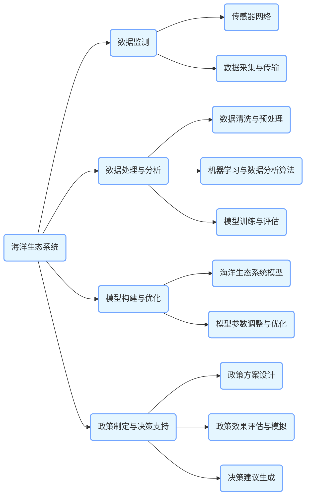

# AI辅助海洋生态系统保护：从数据监测到政策制定

> 关键词：AI、海洋生态系统保护、数据监测、政策制定、机器学习

> 摘要：本文聚焦于AI在海洋生态系统保护中的应用，详细阐述了从数据监测到政策制定的全过程。首先介绍了相关背景知识，包括目的范围、预期读者等。接着深入剖析了核心概念及联系，展示了AI与海洋生态保护各环节的架构关系。通过Python代码讲解了核心算法原理和具体操作步骤，并给出了相关数学模型和公式。在项目实战部分，提供了开发环境搭建、源代码实现及解读。同时探讨了实际应用场景，推荐了学习资源、开发工具框架和相关论文著作。最后总结了未来发展趋势与挑战，还包含常见问题解答和扩展阅读参考资料，旨在为相关领域的研究和实践提供全面的指导。

## 1. 背景介绍 
### 1.1 目的和范围
海洋生态系统是地球上最重要的生态系统之一，它对全球气候调节、生物多样性维持以及人类的食物供应等方面都起着至关重要的作用。然而，近年来，由于人类活动的影响，如过度捕捞、海洋污染、气候变化等，海洋生态系统面临着严重的威胁。本文章的目的在于探讨如何利用人工智能（AI）技术来辅助海洋生态系统的保护，具体范围涵盖从海洋生态数据的监测与收集，到基于这些数据进行分析并制定合理的保护政策的整个流程。

### 1.2 预期读者
本文预期读者包括从事海洋生态研究的科研人员、海洋保护相关的政策制定者、对AI技术在环保领域应用感兴趣的程序员和数据科学家，以及关注海洋生态保护的普通公众。通过阅读本文，科研人员可以了解如何利用AI技术提升研究效率和精度；政策制定者可以获取基于科学数据的决策依据；程序员和数据科学家可以找到新的应用场景和技术挑战；普通公众则可以增强对海洋生态保护的认识和理解。

### 1.3 文档结构概述
本文将按照以下结构展开：首先介绍背景知识，包括目的范围、预期读者和文档结构等；接着阐述核心概念及联系，展示AI与海洋生态保护各环节的架构关系；然后详细讲解核心算法原理和具体操作步骤，通过Python代码进行示例；再给出相关数学模型和公式，并进行详细讲解和举例说明；在项目实战部分，提供开发环境搭建、源代码实现及解读；之后探讨实际应用场景；推荐学习资源、开发工具框架和相关论文著作；最后总结未来发展趋势与挑战，还包含常见问题解答和扩展阅读参考资料。

### 1.4 术语表
#### 1.4.1 核心术语定义
- **人工智能（AI）**：是一门研究如何使计算机系统能够模拟人类智能的学科，包括机器学习、深度学习、自然语言处理等多种技术。
- **海洋生态系统**：指海洋中生物群落与周围环境相互作用所形成的统一整体，包括海洋生物、海洋水体、海洋底质等要素。
- **数据监测**：通过各种传感器和设备对海洋生态系统的相关数据进行实时或定期的采集和记录。
- **政策制定**：根据对海洋生态系统的研究和分析结果，制定出一系列的规则和措施，以保护海洋生态环境和可持续利用海洋资源。

#### 1.4.2 相关概念解释
- **机器学习**：是AI的一个重要分支，它通过让计算机从数据中自动学习模式和规律，从而实现对未知数据的预测和分类。
- **传感器网络**：由大量分布在海洋中的传感器节点组成的网络，用于实时监测海洋环境参数，如温度、盐度、酸碱度等。
- **大数据分析**：对海量的海洋生态数据进行存储、管理和分析，以提取有价值的信息和知识。

#### 1.4.3 缩略词列表
- **AI**：Artificial Intelligence（人工智能）
- **ML**：Machine Learning（机器学习）
- **DL**：Deep Learning（深度学习）
- **IoT**：Internet of Things（物联网）

## 2. 核心概念与联系 

### 核心概念原理
在AI辅助海洋生态系统保护中，主要涉及到以下几个核心概念及其原理：

#### 数据监测
数据监测是整个过程的基础，通过各种传感器和设备收集海洋生态系统的多方面数据。这些传感器可以安装在海洋浮标、水下机器人、卫星等平台上，实时或定期采集海洋环境参数，如水温、盐度、溶解氧、叶绿素含量等，以及海洋生物的信息，如鱼类数量、分布等。数据监测的原理是利用物理、化学和生物传感器将海洋环境中的各种物理量、化学量和生物量转换为电信号或数字信号，然后通过数据传输模块将这些信号传输到数据中心进行处理和分析。

#### 数据处理与分析
收集到的原始海洋数据通常是大量、复杂且包含噪声的，需要进行数据处理和分析。数据处理包括数据清洗、数据集成、数据变换等操作，以去除噪声、填补缺失值、统一数据格式等。数据分析则是利用机器学习和统计学方法从处理后的数据中提取有价值的信息和知识，如海洋生态系统的变化趋势、生物多样性的评估等。机器学习算法可以通过对历史数据的学习，建立数据模型，从而对未来的海洋生态状况进行预测。

#### 模型构建与优化
基于数据分析的结果，构建海洋生态系统的数学模型和计算机模型。这些模型可以描述海洋生态系统中各要素之间的相互关系和动态变化过程，如海洋生物的生长、繁殖、迁徙等。模型构建的过程需要综合考虑海洋生态系统的复杂性和不确定性，采用合适的建模方法和技术。同时，为了提高模型的准确性和可靠性，需要对模型进行优化，通过不断调整模型参数和结构，使其能够更好地拟合实际数据。

#### 政策制定与决策支持
根据模型的分析结果和预测信息，制定合理的海洋生态保护政策和决策。政策制定需要综合考虑经济、社会和环境等多方面的因素，以实现海洋生态系统的可持续发展。AI技术可以为政策制定提供决策支持，通过模拟不同政策方案下海洋生态系统的变化情况，评估政策的效果和影响，从而帮助政策制定者做出更加科学、合理的决策。

### 架构的文本示意图
```plaintext
海洋生态系统
|
|-- 数据监测
|   |-- 传感器网络（浮标、水下机器人、卫星等）
|   |-- 数据采集与传输
|
|-- 数据处理与分析
|   |-- 数据清洗与预处理
|   |-- 机器学习与数据分析算法
|   |-- 模型训练与评估
|
|-- 模型构建与优化
|   |-- 海洋生态系统模型（数学模型、计算机模型）
|   |-- 模型参数调整与优化
|
|-- 政策制定与决策支持
|   |-- 政策方案设计
|   |-- 政策效果评估与模拟
|   |-- 决策建议生成
```

### Mermaid流程图


## 3. 核心算法原理 & 具体操作步骤 

### 核心算法原理
在AI辅助海洋生态系统保护中，常用的核心算法包括机器学习算法，如决策树、随机森林、支持向量机和深度学习算法，如卷积神经网络（CNN）、循环神经网络（RNN）等。下面以决策树算法为例，详细讲解其原理。

决策树是一种基于树结构进行决策的机器学习算法，它通过对数据的特征进行划分，构建一个树形结构的分类器。决策树的每个内部节点表示一个特征上的测试，每个分支表示测试输出，每个叶节点表示一个类别或值。决策树的构建过程是一个递归的过程，通过选择最优的特征进行划分，使得划分后的子集尽可能地纯净，即每个子集中的样本属于同一类别或具有相似的值。

### Python源代码详细阐述
以下是使用Python的`scikit-learn`库实现决策树分类器的示例代码：

```python
# 导入必要的库
from sklearn.datasets import load_iris
from sklearn.model_selection import train_test_split
from sklearn.tree import DecisionTreeClassifier
from sklearn.metrics import accuracy_score

# 加载数据集
iris = load_iris()
X = iris.data  # 特征数据
y = iris.target  # 标签数据

# 划分训练集和测试集
X_train, X_test, y_train, y_test = train_test_split(X, y, test_size=0.3, random_state=42)

# 创建决策树分类器
clf = DecisionTreeClassifier()

# 训练模型
clf.fit(X_train, y_train)

# 预测测试集
y_pred = clf.predict(X_test)

# 计算准确率
accuracy = accuracy_score(y_test, y_pred)
print(f"决策树分类器的准确率: {accuracy}")
```

### 具体操作步骤
1. **数据加载**：使用`load_iris`函数加载鸢尾花数据集，该数据集包含了鸢尾花的四个特征（花萼长度、花萼宽度、花瓣长度、花瓣宽度）和三个类别（Setosa、Versicolour、Virginica）。
2. **数据划分**：使用`train_test_split`函数将数据集划分为训练集和测试集，其中测试集占总数据集的30%。
3. **模型创建**：创建一个`DecisionTreeClassifier`对象，即决策树分类器。
4. **模型训练**：使用训练集数据对决策树分类器进行训练，调用`fit`方法。
5. **模型预测**：使用训练好的模型对测试集数据进行预测，调用`predict`方法。
6. **结果评估**：使用`accuracy_score`函数计算模型的准确率，即预测正确的样本数占总样本数的比例。

## 4. 数学模型和公式 & 详细讲解 & 举例说明 

### 信息熵与信息增益
在决策树算法中，常用信息熵和信息增益来选择最优的特征进行划分。

#### 信息熵
信息熵是用来衡量数据集中不确定性的指标，其定义公式为：
$$
H(X) = -\sum_{i=1}^{n} p(x_i) \log_2 p(x_i)
$$
其中，$X$ 是一个随机变量，$p(x_i)$ 是 $X$ 取值为 $x_i$ 的概率，$n$ 是 $X$ 可能取值的个数。信息熵的值越大，说明数据集的不确定性越大。

#### 信息增益
信息增益是指在划分数据集前后信息熵的减少量，其定义公式为：
$$
IG(D, A) = H(D) - \sum_{v \in Values(A)} \frac{|D_v|}{|D|} H(D_v)
$$
其中，$D$ 是数据集，$A$ 是特征，$Values(A)$ 是特征 $A$ 的所有可能取值，$D_v$ 是数据集 $D$ 中特征 $A$ 取值为 $v$ 的子集，$|D|$ 和 $|D_v|$ 分别表示数据集 $D$ 和子集 $D_v$ 的样本数量。信息增益越大，说明使用该特征进行划分后数据集的不确定性减少得越多，即该特征对分类的贡献越大。

### 详细讲解
信息熵的概念源于信息论，它可以用来衡量一个随机变量的平均不确定性。在决策树中，我们希望通过选择合适的特征进行划分，使得划分后的子集尽可能地纯净，即每个子集中的样本属于同一类别或具有相似的值。信息增益就是用来衡量这种划分效果的指标，通过计算每个特征的信息增益，我们可以选择信息增益最大的特征作为当前节点的划分特征。

### 举例说明
假设我们有一个数据集 $D$，包含 10 个样本，其中 6 个属于类别 0，4 个属于类别 1。则数据集 $D$ 的信息熵为：
$$
H(D) = -\frac{6}{10} \log_2 \frac{6}{10} - \frac{4}{10} \log_2 \frac{4}{10} \approx 0.971
$$
假设我们有一个特征 $A$，它有两个取值 $v_1$ 和 $v_2$，划分后的子集 $D_{v_1}$ 包含 4 个样本，其中 3 个属于类别 0，1 个属于类别 1；子集 $D_{v_2}$ 包含 6 个样本，其中 3 个属于类别 0，3 个属于类别 1。则子集 $D_{v_1}$ 和 $D_{v_2}$ 的信息熵分别为：
$$
H(D_{v_1}) = -\frac{3}{4} \log_2 \frac{3}{4} - \frac{1}{4} \log_2 \frac{1}{4} \approx 0.811
$$
$$
H(D_{v_2}) = -\frac{3}{6} \log_2 \frac{3}{6} - \frac{3}{6} \log_2 \frac{3}{6} = 1
$$
特征 $A$ 的信息增益为：
$$
IG(D, A) = H(D) - \frac{4}{10} H(D_{v_1}) - \frac{6}{10} H(D_{v_2}) \approx 0.971 - \frac{4}{10} \times 0.811 - \frac{6}{10} \times 1 \approx 0.046
$$

## 5. 项目实战：代码实际案例和详细解释说明 

### 5.1  开发环境搭建
#### 操作系统
建议使用Linux或Windows操作系统，其中Linux系统在数据处理和机器学习开发方面具有更好的性能和稳定性。

#### Python环境
安装Python 3.7及以上版本，可以从Python官方网站（https://www.python.org/downloads/）下载并安装。

#### 虚拟环境
为了避免不同项目之间的依赖冲突，建议使用虚拟环境来管理项目的依赖。可以使用`venv`或`conda`来创建虚拟环境。以下是使用`venv`创建虚拟环境的示例命令：
```bash
python -m venv myenv
source myenv/bin/activate  # Linux/Mac
myenv\Scripts\activate  # Windows
```

#### 安装必要的库
在虚拟环境中安装必要的Python库，包括`numpy`、`pandas`、`scikit-learn`、`matplotlib`等。可以使用`pip`来安装这些库，示例命令如下：
```bash
pip install numpy pandas scikit-learn matplotlib
```

### 5.2  源代码详细实现和代码解读
以下是一个使用决策树算法对海洋鱼类分类的示例代码：

```python
import numpy as np
import pandas as pd
from sklearn.model_selection import train_test_split
from sklearn.tree import DecisionTreeClassifier
from sklearn.metrics import accuracy_score

# 加载数据集
data = pd.read_csv('fish_data.csv')

# 提取特征和标签
X = data.drop('Species', axis=1).values
y = data['Species'].values

# 划分训练集和测试集
X_train, X_test, y_train, y_test = train_test_split(X, y, test_size=0.3, random_state=42)

# 创建决策树分类器
clf = DecisionTreeClassifier()

# 训练模型
clf.fit(X_train, y_train)

# 预测测试集
y_pred = clf.predict(X_test)

# 计算准确率
accuracy = accuracy_score(y_test, y_pred)
print(f"决策树分类器的准确率: {accuracy}")
```

### 代码解读
1. **数据加载**：使用`pandas`库的`read_csv`函数加载包含海洋鱼类信息的CSV文件，文件名为`fish_data.csv`。
2. **特征提取**：使用`drop`方法从数据集中删除`Species`列，该列表示鱼类的种类，作为标签数据。其余列作为特征数据。
3. **数据划分**：使用`train_test_split`函数将数据集划分为训练集和测试集，其中测试集占总数据集的30%。
4. **模型创建**：创建一个`DecisionTreeClassifier`对象，即决策树分类器。
5. **模型训练**：使用训练集数据对决策树分类器进行训练，调用`fit`方法。
6. **模型预测**：使用训练好的模型对测试集数据进行预测，调用`predict`方法。
7. **结果评估**：使用`accuracy_score`函数计算模型的准确率，即预测正确的样本数占总样本数的比例。

### 5.3  代码解读与分析
通过上述代码，我们可以实现对海洋鱼类的分类任务。决策树分类器可以根据鱼类的特征（如体长、体重等）对其种类进行预测。在实际应用中，我们可以根据模型的准确率来评估模型的性能，如果准确率较低，可以尝试调整模型的参数或使用其他机器学习算法。

同时，我们还可以对决策树进行可视化，以便更好地理解模型的决策过程。可以使用`graphviz`和`scikit-learn`库的`export_graphviz`函数来实现决策树的可视化，示例代码如下：

```python
from sklearn.tree import export_graphviz
import graphviz

# 导出决策树的DOT文件
dot_data = export_graphviz(clf, out_file=None, 
                           feature_names=data.drop('Species', axis=1).columns,  
                           class_names=clf.classes_,  
                           filled=True, rounded=True,  
                           special_characters=True)  

# 创建Graphviz对象
graph = graphviz.Source(dot_data)  

# 保存决策树图像
graph.render("fish_decision_tree")
```

通过上述代码，我们可以将决策树保存为一个PDF文件，文件名为`fish_decision_tree.pdf`，方便我们查看和分析决策树的结构。

## 6. 实际应用场景 
### 海洋生物多样性监测
AI技术可以通过对海洋生物图像、声音等数据的分析，实现对海洋生物多样性的实时监测。例如，利用卷积神经网络（CNN）对水下摄像头拍摄的海洋生物图像进行识别和分类，可以快速准确地识别出不同种类的海洋生物，从而了解海洋生物的分布和数量变化情况。同时，通过对海洋生物声音的分析，如鲸鱼的叫声、海豚的超声波等，可以监测海洋生物的行为和活动规律，为海洋生物保护提供科学依据。

### 海洋污染监测与预警
AI技术可以结合传感器网络和大数据分析，实现对海洋污染的实时监测和预警。通过在海洋中部署各种传感器，如水质传感器、气象传感器等，可以实时采集海洋环境参数，如水温、盐度、溶解氧、酸碱度、污染物浓度等。利用机器学习算法对这些数据进行分析，可以预测海洋污染的发生和发展趋势，及时发出预警信号，为海洋环境保护部门采取措施提供决策支持。

### 渔业资源管理
AI技术可以帮助渔业部门实现对渔业资源的科学管理。通过对渔业捕捞数据、海洋环境数据等进行分析，利用机器学习算法建立渔业资源模型，可以预测渔业资源的数量和分布变化情况，为渔业捕捞配额的制定提供科学依据。同时，利用AI技术可以实现对渔船的实时监测和管理，防止过度捕捞和非法捕捞行为的发生，保护海洋渔业资源的可持续发展。

### 海洋生态系统建模与模拟
AI技术可以用于构建海洋生态系统的数学模型和计算机模型，模拟海洋生态系统的动态变化过程。通过对海洋生态系统的各种要素，如海洋生物、海洋水体、海洋底质等进行建模，利用机器学习算法对模型进行训练和优化，可以预测海洋生态系统在不同环境条件下的响应和变化情况，为海洋生态保护政策的制定提供科学依据。

## 7. 工具和资源推荐
### 7.1 学习资源推荐
#### 7.1.1 书籍推荐
- 《机器学习》（周志华）：该书是机器学习领域的经典教材，系统地介绍了机器学习的基本概念、算法和应用，适合初学者和有一定基础的读者阅读。
- 《深度学习》（Ian Goodfellow、Yoshua Bengio、Aaron Courville）：该书是深度学习领域的权威著作，详细介绍了深度学习的原理、算法和应用，适合对深度学习感兴趣的读者阅读。
- 《Python机器学习实战》（Sebastian Raschka）：该书通过大量的实际案例，介绍了如何使用Python和相关库进行机器学习的开发和应用，适合有一定Python基础的读者阅读。

#### 7.1.2 在线课程
- Coursera上的“机器学习”课程（Andrew Ng教授）：该课程是机器学习领域的经典在线课程，由斯坦福大学的Andrew Ng教授授课，系统地介绍了机器学习的基本概念、算法和应用，适合初学者学习。
- edX上的“深度学习微硕士”课程：该课程由多家知名高校和企业联合推出，涵盖了深度学习的各个方面，包括卷积神经网络、循环神经网络、生成对抗网络等，适合有一定机器学习基础的读者深入学习。
- 阿里云天池平台上的“AI实战营”：该平台提供了丰富的AI实战项目和课程，包括数据挖掘、机器学习、深度学习等领域，适合有一定编程基础的读者进行实践和学习。

#### 7.1.3 技术博客和网站
- Medium：该网站上有许多关于AI和机器学习的技术博客和文章，涵盖了最新的研究成果、技术应用和实践经验，适合关注AI领域动态的读者阅读。
- Towards Data Science：该网站是一个专注于数据科学和机器学习的社区，提供了大量的技术文章、教程和案例分析，适合对数据科学和机器学习感兴趣的读者学习。
- Kaggle：该网站是一个全球知名的数据科学竞赛平台，提供了丰富的数据集、竞赛项目和解决方案，适合有一定数据科学基础的读者进行实践和交流。

### 7.2 开发工具框架推荐
#### 7.2.1 IDE和编辑器
- PyCharm：是一款专门为Python开发设计的集成开发环境（IDE），提供了丰富的功能和插件，如代码编辑、调试、版本控制等，适合Python开发者使用。
- Jupyter Notebook：是一个基于Web的交互式开发环境，支持多种编程语言，如Python、R等，适合数据科学家和机器学习工程师进行数据分析和模型开发。
- Visual Studio Code：是一款轻量级的代码编辑器，支持多种编程语言和插件，如Python、JavaScript等，适合开发者进行快速开发和调试。

#### 7.2.2 调试和性能分析工具
- TensorBoard：是TensorFlow框架提供的一个可视化工具，用于监控和分析深度学习模型的训练过程和性能指标，如损失函数、准确率等。
- Py-Spy：是一个Python性能分析工具，用于分析Python程序的CPU使用情况和函数调用时间，帮助开发者找出性能瓶颈。
- cProfile：是Python标准库中的一个性能分析模块，用于分析Python程序的函数调用时间和调用次数，帮助开发者优化代码性能。

#### 7.2.3 相关框架和库
- TensorFlow：是Google开发的一个开源深度学习框架，提供了丰富的深度学习模型和工具，如卷积神经网络、循环神经网络、生成对抗网络等，适合深度学习开发者使用。
- PyTorch：是Facebook开发的一个开源深度学习框架，具有简洁易用的API和动态图机制，适合深度学习研究者和开发者使用。
- Scikit-learn：是一个开源的机器学习库，提供了丰富的机器学习算法和工具，如分类、回归、聚类等，适合机器学习初学者和开发者使用。

### 7.3 相关论文著作推荐
#### 7.3.1 经典论文
- 《Gradient-Based Learning Applied to Document Recognition》（Yann LeCun、Léon Bottou、Yoshua Bengio、Patrick Haffner）：该论文介绍了卷积神经网络（CNN）的基本原理和应用，是深度学习领域的经典论文之一。
- 《Long Short-Term Memory》（Sepp Hochreiter、Jürgen Schmidhuber）：该论文介绍了长短期记忆网络（LSTM）的基本原理和应用，是循环神经网络（RNN）领域的经典论文之一。
- 《Generative Adversarial Nets》（Ian J. Goodfellow、Jean Pouget-Abadie、Mehdi Mirza、Bing Xu、David Warde-Farley、Sherjil Ozair、Aaron Courville、Yoshua Bengio）：该论文介绍了生成对抗网络（GAN）的基本原理和应用，是深度学习领域的重要论文之一。

#### 7.3.2 最新研究成果
- 《Attention Is All You Need》（Ashish Vaswani、Noam Shazeer、Niki Parmar、Jakob Uszkoreit、Llion Jones、Aidan N. Gomez、Łukasz Kaiser、Illia Polosukhin）：该论文介绍了Transformer模型的基本原理和应用，是自然语言处理领域的重要研究成果之一。
- 《Masked Autoencoders Are Scalable Vision Learners》（Kaiming He、Xinlei Chen、Saining Xie、Yanghao Li、Piotr Dollár、Ross Girshick）：该论文介绍了Masked Autoencoder（MAE）模型的基本原理和应用，是计算机视觉领域的重要研究成果之一。
- 《Improving Language Understanding by Generative Pre-Training》（Alec Radford、Karthik Narasimhan、Tim Salimans、Ilya Sutskever）：该论文介绍了GPT模型的基本原理和应用，是自然语言处理领域的重要研究成果之一。

#### 7.3.3 应用案例分析
- 《AI for Ocean Conservation: A Review》（作者：多个）：该论文对AI技术在海洋生态保护中的应用进行了全面的综述，包括数据监测、数据分析、模型构建和政策制定等方面，为相关领域的研究和实践提供了重要的参考。
- 《Using Machine Learning to Predict Coral Bleaching》（作者：多个）：该论文介绍了如何使用机器学习算法预测珊瑚礁白化现象，为珊瑚礁保护提供了科学依据。
- 《Deep Learning for Marine Debris Detection from Aerial Imagery》（作者：多个）：该论文介绍了如何使用深度学习算法从航空影像中检测海洋垃圾，为海洋环境保护提供了新的方法和技术。

## 8. 总结：未来发展趋势与挑战
### 未来发展趋势
#### 多模态数据融合
未来，AI技术将更多地融合多种模态的数据，如海洋生物图像、声音、视频、传感器数据等，以更全面、准确地了解海洋生态系统的状况。通过多模态数据融合，可以提高海洋生态监测和分析的精度和效率，为海洋生态保护提供更有力的支持。

#### 强化学习与智能决策
强化学习是一种通过智能体与环境进行交互来学习最优策略的机器学习方法。未来，强化学习将在海洋生态保护中得到更广泛的应用，例如用于渔业资源管理、海洋污染治理等领域。通过强化学习算法，可以实现智能决策，优化海洋生态保护策略，提高保护效果。

#### 边缘计算与物联网结合
随着物联网技术的发展，越来越多的传感器将被部署在海洋中，产生大量的实时数据。为了减少数据传输和处理的延迟，未来将更多地采用边缘计算技术，即在传感器节点或靠近数据源的地方进行数据处理和分析。边缘计算与物联网的结合将提高海洋生态监测的实时性和可靠性。

#### 跨学科融合
海洋生态系统保护是一个复杂的系统工程，需要多学科的知识和技术支持。未来，AI技术将与海洋科学、生物学、生态学、环境科学等学科进行更深入的融合，形成跨学科的研究和应用体系，为海洋生态保护提供更全面、系统的解决方案。

### 挑战
#### 数据质量和数量
海洋生态数据的采集和处理面临着诸多挑战，如数据质量参差不齐、数据缺失、数据噪声等。同时，由于海洋环境的复杂性和广阔性，获取足够数量的高质量数据也存在一定的困难。因此，如何提高数据质量和数量，是AI辅助海洋生态系统保护面临的重要挑战之一。

#### 模型可解释性
深度学习等AI模型通常是黑盒模型，其决策过程难以解释。在海洋生态保护中，模型的可解释性非常重要，因为政策制定者和决策者需要了解模型的决策依据，才能做出合理的决策。因此，如何提高AI模型的可解释性，是未来需要解决的一个关键问题。

#### 计算资源和能源消耗
AI技术的应用需要大量的计算资源和能源消耗，特别是深度学习模型的训练和推理过程。在海洋环境中，由于电力供应和计算设备的限制，如何在有限的计算资源和能源条件下实现高效的AI应用，是一个需要解决的挑战。

#### 法律法规和伦理问题
随着AI技术在海洋生态保护中的广泛应用，也会带来一系列的法律法规和伦理问题，如数据隐私保护、算法歧视、责任界定等。如何制定相应的法律法规和伦理准则，规范AI技术的应用，保障海洋生态保护的公平、公正和可持续发展，是未来需要关注的重要问题。

## 9. 附录：常见问题与解答
### 1. AI技术在海洋生态系统保护中的应用前景如何？
AI技术在海洋生态系统保护中具有广阔的应用前景。通过AI技术可以实现对海洋生态数据的高效监测和分析，提高海洋生态保护的科学性和精准性。同时，AI技术还可以为海洋生态保护政策的制定提供决策支持，促进海洋生态系统的可持续发展。随着AI技术的不断发展和创新，其在海洋生态系统保护中的应用将越来越广泛和深入。

### 2. 如何提高AI模型在海洋生态数据处理中的准确性？
可以从以下几个方面提高AI模型在海洋生态数据处理中的准确性：
- **数据预处理**：对采集到的海洋生态数据进行清洗、去噪、填补缺失值等预处理操作，提高数据质量。
- **特征工程**：选择和提取与海洋生态问题相关的特征，去除无关特征，提高特征的有效性和代表性。
- **模型选择和优化**：根据海洋生态数据的特点和问题的性质，选择合适的AI模型，并对模型的参数进行优化，提高模型的性能。
- **多模型融合**：将多个不同类型的AI模型进行融合，综合利用各模型的优势，提高预测和分类的准确性。

### 3. AI技术在海洋生态系统保护中会带来哪些风险？
AI技术在海洋生态系统保护中可能会带来以下风险：
- **数据安全风险**：海洋生态数据涉及到大量的敏感信息，如海洋生物的分布、渔业资源的储量等。如果数据被泄露或滥用，可能会对海洋生态系统和相关利益方造成损害。
- **算法偏见风险**：AI模型的训练数据可能存在偏差，导致模型产生偏见和歧视。在海洋生态保护中，算法偏见可能会影响政策制定的公平性和有效性。
- **技术依赖风险**：过度依赖AI技术可能会导致人类对海洋生态系统的理解和判断能力下降，同时也可能会面临技术故障和失效的风险。

### 4. 如何推动AI技术在海洋生态系统保护中的应用？
可以从以下几个方面推动AI技术在海洋生态系统保护中的应用：
- **加强科研合作**：鼓励科研机构、高校和企业之间开展合作，共同开展AI技术在海洋生态系统保护中的研究和应用。
- **培养专业人才**：加强对AI技术和海洋生态保护领域专业人才的培养，提高人才的综合素质和创新能力。
- **建立数据共享平台**：建立海洋生态数据共享平台，促进数据的流通和共享，为AI技术的应用提供数据支持。
- **政策支持和引导**：政府出台相关政策，鼓励和支持AI技术在海洋生态系统保护中的应用，为企业和科研机构提供政策保障和资金支持。

## 10. 扩展阅读 & 参考资料
### 扩展阅读
- 《海洋生态系统动力学》：该书系统地介绍了海洋生态系统的结构、功能和动态变化过程，为理解海洋生态系统的复杂性和保护提供了理论基础。
- 《人工智能时代的海洋科技发展》：该书探讨了AI技术在海洋科技领域的应用和发展趋势，对AI辅助海洋生态系统保护具有重要的参考价值。
- 《海洋环境保护前沿技术》：该书介绍了海洋环境保护的最新技术和方法，包括AI技术在海洋污染监测、海洋生态修复等方面的应用。

### 参考资料
- 《海洋生态监测技术规范》：该规范规定了海洋生态监测的方法、技术和要求，为海洋生态数据的采集和处理提供了标准和依据。
- 《联合国海洋法公约》：该公约是国际海洋法的重要文件，对海洋生态系统的保护和可持续利用做出了规定和要求。
- 《全球海洋生态保护行动计划》：该计划是联合国环境规划署制定的全球海洋生态保护战略，为各国开展海洋生态保护工作提供了指导和方向。

作者：AI天才研究院/AI Genius Institute & 禅与计算机程序设计艺术 /Zen And The Art of Computer Programming