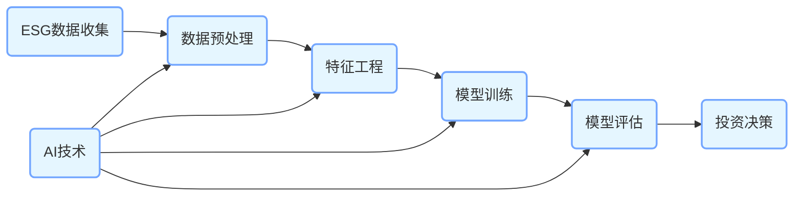

# AI辅助的ESG投资影响评估

> 关键词：AI、ESG投资、影响评估、机器学习、数据驱动决策

> 摘要：本文围绕AI辅助的ESG投资影响评估展开深入探讨。ESG投资近年来受到广泛关注，但其评估过程面临数据量大、指标复杂等挑战。AI技术的引入为解决这些问题提供了有效途径。文章详细介绍了ESG投资和AI的核心概念及联系，阐述了相关核心算法原理和操作步骤，通过数学模型和公式进行理论支持，并给出实际项目案例。同时，分析了该技术在实际应用场景中的表现，推荐了相关的学习资源、开发工具和研究论文。最后，总结了未来发展趋势与挑战，为从业者和研究者提供了全面的参考。

## 1. 背景介绍 
### 1.1 目的和范围
随着全球对可持续发展的关注度不断提高，ESG（环境、社会和治理）投资逐渐成为金融领域的热门话题。ESG投资旨在将环境、社会和治理因素纳入投资决策过程，以实现长期的可持续回报。然而，ESG投资影响评估面临诸多挑战，如数据收集困难、指标体系复杂、评估方法缺乏标准化等。本文的目的是探讨如何利用AI技术辅助ESG投资影响评估，提高评估的准确性和效率。文章将涵盖AI在ESG数据处理、指标分析、模型构建等方面的应用，以及实际案例和未来发展趋势。

### 1.2 预期读者
本文的预期读者包括金融从业者、ESG投资分析师、AI技术开发者、研究机构的学者以及对可持续投资感兴趣的人士。对于金融从业者，文章将提供AI在ESG投资评估中的实际应用方法和案例；对于AI技术开发者，将介绍相关的算法原理和开发工具；对于学者和研究人员，将探讨该领域的前沿研究成果和未来发展方向。

### 1.3 文档结构概述
本文将按照以下结构进行组织：首先介绍核心概念与联系，包括ESG投资和AI的基本原理和架构；接着阐述核心算法原理和具体操作步骤，并给出Python代码示例；然后通过数学模型和公式对评估过程进行详细讲解，并举例说明；再通过实际项目案例展示AI辅助ESG投资影响评估的具体实现；之后分析实际应用场景；推荐相关的工具和资源；最后总结未来发展趋势与挑战，并提供常见问题解答和扩展阅读参考资料。

### 1.4 术语表
#### 1.4.1 核心术语定义
- **ESG投资**：指在投资决策过程中考虑环境（Environmental）、社会（Social）和治理（Governance）因素的投资策略。
- **AI（人工智能）**：是一门研究如何使计算机能够模拟人类智能的技术，包括机器学习、深度学习、自然语言处理等领域。
- **影响评估**：对ESG投资所产生的环境、社会和经济效益进行评估和分析的过程。

#### 1.4.2 相关概念解释
- **机器学习**：是AI的一个重要分支，通过让计算机从数据中学习模式和规律，从而实现预测和决策。
- **深度学习**：是一种基于神经网络的机器学习方法，能够处理复杂的非线性关系，在图像识别、自然语言处理等领域取得了显著成果。
- **数据挖掘**：从大量数据中发现有价值信息和知识的过程，常用于ESG数据的分析和处理。

#### 1.4.3 缩略词列表
- **ESG**：环境、社会和治理（Environmental, Social and Governance）
- **AI**：人工智能（Artificial Intelligence）
- **ML**：机器学习（Machine Learning）
- **DL**：深度学习（Deep Learning）

## 2. 核心概念与联系 

### 2.1 ESG投资核心原理
ESG投资的核心原理是将环境、社会和治理因素纳入投资决策过程，以评估企业的可持续发展能力和长期投资价值。环境因素包括气候变化、资源利用、污染防治等；社会因素包括员工权益、社区关系、消费者权益等；治理因素包括公司治理结构、股东权益保护、合规经营等。通过对这些因素的综合评估，可以筛选出具有良好ESG表现的企业，从而降低投资风险，实现可持续回报。

### 2.2 AI核心原理
AI是一门研究如何使计算机能够模拟人类智能的技术，其核心原理包括机器学习、深度学习、自然语言处理等。机器学习是让计算机从数据中学习模式和规律，从而实现预测和决策；深度学习是基于神经网络的机器学习方法，能够处理复杂的非线性关系；自然语言处理则是让计算机能够理解和处理人类语言。

### 2.3 ESG投资与AI的联系
AI技术可以为ESG投资影响评估提供强大的支持。一方面，AI可以帮助收集、整理和分析大量的ESG数据，提高数据处理的效率和准确性；另一方面，AI可以构建预测模型，对企业的ESG表现和投资回报进行预测，为投资决策提供科学依据。例如，机器学习算法可以对企业的ESG数据进行分类和聚类，发现潜在的投资机会；深度学习算法可以对企业的文本信息进行分析，挖掘隐藏的ESG风险。

### 2.4 架构示意图

该架构图展示了AI辅助ESG投资影响评估的主要流程。首先进行ESG数据收集，然后对数据进行预处理和特征工程，接着使用AI技术进行模型训练和评估，最后根据评估结果进行投资决策。

## 3. 核心算法原理 & 具体操作步骤 

### 3.1 核心算法原理
在AI辅助的ESG投资影响评估中，常用的算法包括线性回归、逻辑回归、决策树、随机森林、支持向量机和深度学习算法等。下面以线性回归为例，介绍其原理。

线性回归是一种用于建立自变量和因变量之间线性关系的统计模型。假设我们有一组ESG数据 $X = [x_1, x_2,..., x_n]$ 作为自变量，投资回报 $y$ 作为因变量，线性回归模型可以表示为：

$y = \theta_0 + \theta_1x_1 + \theta_2x_2 +... + \theta_nx_n + \epsilon$

其中，$\theta_0, \theta_1,..., \theta_n$ 是模型的参数，$\epsilon$ 是误差项。线性回归的目标是通过最小化误差项的平方和来估计模型的参数。

### 3.2 具体操作步骤
#### 3.2.1 数据收集
收集企业的ESG数据，包括环境指标（如碳排放、能源消耗等）、社会指标（如员工满意度、社区贡献等）和治理指标（如董事会独立性、高管薪酬等）。数据来源可以包括企业年报、社会责任报告、政府监管数据等。

#### 3.2.2 数据预处理
对收集到的ESG数据进行预处理，包括数据清洗、缺失值处理、异常值处理和数据标准化等。数据清洗是去除数据中的噪声和错误信息；缺失值处理可以采用均值填充、中位数填充等方法；异常值处理可以采用基于统计的方法或基于机器学习的方法；数据标准化是将数据转换为均值为0，标准差为1的标准正态分布。

#### 3.2.3 特征工程
从预处理后的数据中提取有价值的特征，用于模型训练。特征工程包括特征选择和特征提取。特征选择是从原始特征中选择最相关的特征，减少特征维度；特征提取是通过对原始特征进行变换和组合，生成新的特征。

#### 3.2.4 模型训练
使用预处理后的数据和提取的特征，选择合适的算法进行模型训练。以线性回归为例，Python代码如下：
```python
import numpy as np
from sklearn.linear_model import LinearRegression

# 假设X是ESG特征矩阵，y是投资回报向量
X = np.array([[1, 2, 3], [4, 5, 6], [7, 8, 9]])
y = np.array([10, 20, 30])

# 创建线性回归模型
model = LinearRegression()

# 训练模型
model.fit(X, y)

# 输出模型参数
print("模型参数：", model.coef_)
print("截距：", model.intercept_)
```

#### 3.2.5 模型评估
使用测试数据对训练好的模型进行评估，常用的评估指标包括均方误差（MSE）、均方根误差（RMSE）、决定系数（$R^2$）等。Python代码如下：
```python
from sklearn.metrics import mean_squared_error, r2_score

# 假设X_test是测试数据特征矩阵，y_test是测试数据投资回报向量
X_test = np.array([[10, 11, 12]])
y_test = np.array([40])

# 预测投资回报
y_pred = model.predict(X_test)

# 计算均方误差
mse = mean_squared_error(y_test, y_pred)
print("均方误差：", mse)

# 计算决定系数
r2 = r2_score(y_test, y_pred)
print("决定系数：", r2)
```

#### 3.2.6 投资决策
根据模型评估结果，选择具有良好ESG表现和投资回报潜力的企业进行投资。

## 4. 数学模型和公式 & 详细讲解 & 举例说明 

### 4.1 线性回归模型
线性回归模型的数学表达式为：

$y = \theta_0 + \theta_1x_1 + \theta_2x_2 +... + \theta_nx_n + \epsilon$

其中，$y$ 是因变量（投资回报），$x_1, x_2,..., x_n$ 是自变量（ESG特征），$\theta_0, \theta_1,..., \theta_n$ 是模型的参数，$\epsilon$ 是误差项。

线性回归的目标是最小化误差项的平方和，即最小化损失函数：

$J(\theta) = \frac{1}{2m}\sum_{i=1}^{m}(h_{\theta}(x^{(i)}) - y^{(i)})^2$

其中，$m$ 是样本数量，$h_{\theta}(x^{(i)})$ 是模型的预测值，$y^{(i)}$ 是实际值。

通过最小化损失函数 $J(\theta)$，可以得到模型的最优参数 $\theta$。常用的优化方法包括梯度下降法和正规方程法。

### 4.2 梯度下降法
梯度下降法是一种迭代优化算法，通过不断更新模型的参数，使得损失函数逐渐减小。梯度下降法的更新公式为：

$\theta_j := \theta_j - \alpha\frac{\partial}{\partial\theta_j}J(\theta)$

其中，$\alpha$ 是学习率，控制每次更新的步长。

### 4.3 正规方程法
正规方程法是一种直接求解最优参数的方法，其公式为：

$\theta = (X^TX)^{-1}X^Ty$

其中，$X$ 是特征矩阵，$y$ 是因变量向量。

### 4.4 举例说明
假设我们有以下ESG数据和投资回报数据：

| 环境指标 $x_1$ | 社会指标 $x_2$ | 治理指标 $x_3$ | 投资回报 $y$ |
| --- | --- | --- | --- |
| 1 | 2 | 3 | 10 |
| 4 | 5 | 6 | 20 |
| 7 | 8 | 9 | 30 |

使用线性回归模型进行拟合，我们可以得到模型的参数 $\theta$。

首先，构建特征矩阵 $X$ 和因变量向量 $y$：

$X = \begin{bmatrix} 1 & 2 & 3 \\ 4 & 5 & 6 \\ 7 & 8 & 9 \end{bmatrix}$

$y = \begin{bmatrix} 10 \\ 20 \\ 30 \end{bmatrix}$

使用正规方程法求解参数 $\theta$：

```python
import numpy as np

X = np.array([[1, 2, 3], [4, 5, 6], [7, 8, 9]])
y = np.array([[10], [20], [30]])

# 添加偏置项
X_b = np.c_[np.ones((X.shape[0], 1)), X]

# 求解参数
theta = np.linalg.inv(X_b.T.dot(X_b)).dot(X_b.T).dot(y)

print("模型参数：", theta)
```

通过上述代码，我们可以得到模型的参数 $\theta$，从而建立ESG特征和投资回报之间的线性关系。

## 5. 项目实战：代码实际案例和详细解释说明 

### 5.1  开发环境搭建
#### 5.1.1 安装Python
首先，需要安装Python环境。建议使用Python 3.7及以上版本，可以从Python官方网站（https://www.python.org/downloads/）下载并安装。

#### 5.1.2 安装必要的库
使用pip命令安装必要的Python库，包括numpy、pandas、scikit-learn等。

```bash
pip install numpy pandas scikit-learn
```

### 5.2  源代码详细实现和代码解读
#### 5.2.1 数据加载和预处理
```python
import pandas as pd
from sklearn.preprocessing import StandardScaler

# 加载数据
data = pd.read_csv('esg_data.csv')

# 分离特征和标签
X = data.drop('investment_return', axis=1)
y = data['investment_return']

# 数据标准化
scaler = StandardScaler()
X_scaled = scaler.fit_transform(X)
```
代码解读：首先使用pandas库加载ESG数据文件，然后将特征和标签分离。最后使用StandardScaler对特征数据进行标准化处理，使得数据具有零均值和单位方差。

#### 5.2.2 模型训练和评估
```python
from sklearn.model_selection import train_test_split
from sklearn.linear_model import LinearRegression
from sklearn.metrics import mean_squared_error, r2_score

# 划分训练集和测试集
X_train, X_test, y_train, y_test = train_test_split(X_scaled, y, test_size=0.2, random_state=42)

# 创建线性回归模型
model = LinearRegression()

# 训练模型
model.fit(X_train, y_train)

# 预测投资回报
y_pred = model.predict(X_test)

# 计算评估指标
mse = mean_squared_error(y_test, y_pred)
r2 = r2_score(y_test, y_pred)

print("均方误差：", mse)
print("决定系数：", r2)
```
代码解读：使用train_test_split函数将数据划分为训练集和测试集，比例为8:2。然后创建线性回归模型并进行训练。最后使用测试集进行预测，并计算均方误差和决定系数来评估模型的性能。

### 5.3  代码解读与分析
通过上述代码，我们完成了一个简单的AI辅助ESG投资影响评估项目。首先对数据进行预处理，确保数据的质量和一致性。然后使用线性回归模型进行训练和预测，通过评估指标判断模型的性能。如果均方误差较小，决定系数接近1，则说明模型的拟合效果较好。

在实际应用中，我们可以尝试使用不同的算法（如决策树、随机森林等）和特征工程方法，进一步提高模型的性能。同时，还可以对模型进行调优，如调整超参数等。

## 6. 实际应用场景 
### 6.1 投资组合管理
在投资组合管理中，AI辅助的ESG投资影响评估可以帮助投资者筛选具有良好ESG表现的企业，构建更加可持续的投资组合。通过对企业的ESG数据进行分析和评估，投资者可以识别潜在的风险和机会，优化投资组合的配置，提高投资回报。

### 6.2 风险管理
ESG因素可能会对企业的财务状况和经营业绩产生影响，从而带来投资风险。AI技术可以帮助投资者及时发现企业的ESG风险，如环境污染、劳工纠纷等，并采取相应的风险管理措施。例如，投资者可以通过调整投资组合的权重，减少对高风险企业的投资。

### 6.3 企业评估
对于企业来说，AI辅助的ESG投资影响评估可以帮助其了解自身的ESG表现，发现存在的问题和改进的方向。企业可以根据评估结果制定相应的ESG战略，提高自身的可持续发展能力和竞争力。同时，良好的ESG表现也有助于企业吸引更多的投资者和客户。

### 6.4 政策制定
政府和监管机构可以利用AI辅助的ESG投资影响评估结果，制定相关的政策和法规，推动可持续发展目标的实现。例如，政府可以通过税收优惠、补贴等政策鼓励企业加强ESG管理，引导资本流向具有良好ESG表现的企业。

## 7. 工具和资源推荐
### 7.1 学习资源推荐
#### 7.1.1 书籍推荐
- 《机器学习》（周志华著）：全面介绍了机器学习的基本概念、算法和应用，是机器学习领域的经典教材。
- 《深度学习》（Ian Goodfellow等著）：深入探讨了深度学习的理论和实践，适合有一定机器学习基础的读者。
- 《ESG投资：理念、方法与实践》（林鸿钧等著）：系统介绍了ESG投资的概念、方法和实践案例，对ESG投资感兴趣的读者有很大帮助。

#### 7.1.2 在线课程
- Coursera上的“机器学习”课程（Andrew Ng教授授课）：是一门非常经典的机器学习入门课程，讲解详细，适合初学者。
- edX上的“深度学习”系列课程：由全球知名高校的教授授课，内容涵盖深度学习的各个方面。
- 中国大学MOOC上的“ESG投资与可持续金融”课程：介绍了ESG投资的基本理论和实践，对了解ESG投资有很大帮助。

#### 7.1.3 技术博客和网站
- Medium：是一个技术博客平台，有很多关于AI和ESG投资的优质文章。
- Towards Data Science：专注于数据科学和机器学习领域的博客，提供了很多实用的技术文章和案例。
- ESG Investor：是一个专注于ESG投资的网站，提供了最新的ESG投资资讯和研究报告。

### 7.2 开发工具框架推荐
#### 7.2.1 IDE和编辑器
- PyCharm：是一款专业的Python集成开发环境，具有强大的代码编辑、调试和项目管理功能。
- Jupyter Notebook：是一个交互式的编程环境，适合进行数据探索和模型开发。
- Visual Studio Code：是一款轻量级的代码编辑器，支持多种编程语言，具有丰富的插件生态系统。

#### 7.2.2 调试和性能分析工具
- TensorBoard：是TensorFlow提供的可视化工具，可以帮助用户监控模型的训练过程和性能。
- PyTorch Profiler：是PyTorch提供的性能分析工具，可以帮助用户找出模型中的性能瓶颈。
- Scikit-learn的GridSearchCV：可以帮助用户进行超参数调优，提高模型的性能。

#### 7.2.3 相关框架和库
- Scikit-learn：是一个强大的机器学习库，提供了丰富的机器学习算法和工具。
- TensorFlow：是一个开源的深度学习框架，广泛应用于图像识别、自然语言处理等领域。
- PyTorch：是另一个流行的深度学习框架，具有简洁易用的特点。

### 7.3 相关论文著作推荐
#### 7.3.1 经典论文
- "Machine Learning: A Probabilistic Perspective"（Kevin P. Murphy著）：从概率的角度介绍了机器学习的基本理论和算法，是机器学习领域的经典著作。
- "Deep Residual Learning for Image Recognition"（Kaiming He等著）：提出了残差网络（ResNet），在图像识别领域取得了巨大成功。
- "ESG and Financial Performance: Aggregated Evidence from More Than 2000 Empirical Studies"（Friede等著）：对ESG与财务绩效之间的关系进行了系统的综述和分析。

#### 7.3.2 最新研究成果
- 可以关注顶级学术会议（如NeurIPS、ICML、KDD等）和期刊（如Journal of Machine Learning Research、Journal of Financial Economics等）上的最新研究成果，了解AI和ESG投资领域的前沿动态。

#### 7.3.3 应用案例分析
- 可以参考一些知名金融机构和研究机构发布的ESG投资报告和案例分析，了解AI在ESG投资中的实际应用情况和效果。

## 8. 总结：未来发展趋势与挑战
### 8.1 未来发展趋势
#### 8.1.1 数据整合与共享
未来，ESG数据的整合和共享将更加完善。随着政府和监管机构对ESG信息披露要求的提高，企业将更加规范地披露ESG数据。同时，数据供应商将提供更加全面、准确的ESG数据服务，促进数据的整合和共享。这将为AI辅助的ESG投资影响评估提供更加丰富和高质量的数据支持。

#### 8.1.2 模型创新与优化
AI技术将不断创新和优化，为ESG投资影响评估提供更加先进的模型和算法。例如，深度学习模型将在ESG数据处理和分析中发挥更大的作用，能够更好地处理复杂的非线性关系。同时，强化学习算法也可能被应用于ESG投资决策，实现更加智能化的投资策略。

#### 8.1.3 跨领域融合
ESG投资影响评估将与其他领域进行更加深入的融合。例如，与气候变化模型相结合，评估企业在气候变化背景下的风险和机遇；与社会科学研究相结合，深入分析企业的社会影响。这种跨领域融合将为ESG投资带来更加全面和深入的评估视角。

#### 8.1.4 可持续发展目标导向
未来的ESG投资将更加紧密地围绕可持续发展目标（SDGs）展开。AI技术将帮助投资者更好地衡量企业对SDGs的贡献，引导资本流向能够推动可持续发展的领域。这将有助于实现全球可持续发展目标，促进经济、社会和环境的协调发展。

### 8.2 挑战
#### 8.2.1 数据质量与标准化
ESG数据的质量和标准化仍然是一个挑战。不同企业和数据供应商的ESG数据定义和计算方法存在差异，导致数据的可比性和一致性较差。此外，ESG数据的准确性和完整性也需要进一步提高。解决这些问题需要政府、监管机构和行业组织共同努力，制定统一的ESG数据标准和披露规范。

#### 8.2.2 模型解释性
AI模型的解释性是一个重要的问题。在ESG投资影响评估中，投资者需要了解模型的决策依据，以便做出合理的投资决策。然而，一些复杂的AI模型（如深度学习模型）往往具有较高的黑盒性，难以解释其决策过程。因此，需要研究和开发具有良好解释性的AI模型，提高模型的可信度和可接受性。

#### 8.2.3 伦理和法律问题
AI辅助的ESG投资影响评估涉及到一些伦理和法律问题。例如，数据隐私保护、算法偏见等。在使用AI技术处理ESG数据时，需要确保数据的合法获取和使用，避免侵犯个人隐私。同时，需要对AI算法进行评估和监测，防止算法偏见导致不公平的投资决策。

#### 8.2.4 专业人才短缺
目前，既懂AI技术又懂ESG投资的专业人才短缺。培养这样的复合型人才需要高校和培训机构加强相关专业的建设，提供系统的课程和实践机会。同时，企业也需要加强内部培训，提高员工的AI和ESG投资能力。

## 9. 附录：常见问题与解答
### 9.1 AI在ESG投资影响评估中的准确性如何保证？
为了保证AI在ESG投资影响评估中的准确性，需要从以下几个方面入手：
- **数据质量**：确保收集到的ESG数据准确、完整、一致。可以通过多渠道收集数据，并进行数据清洗和验证。
- **模型选择与调优**：根据数据特点和问题需求选择合适的AI模型，并进行超参数调优。可以使用交叉验证等方法评估模型的性能。
- **模型解释与验证**：对模型的决策过程进行解释和验证，确保模型的输出具有合理性和可解释性。可以使用特征重要性分析、局部解释等方法。

### 9.2 ESG投资影响评估的指标体系如何构建？
ESG投资影响评估的指标体系构建需要考虑以下几个方面：
- **相关性**：指标应与环境、社会和治理因素相关，能够反映企业的可持续发展能力。
- **可量化性**：指标应能够通过数据进行量化，便于进行分析和比较。
- **全面性**：指标体系应涵盖ESG的各个方面，避免遗漏重要信息。
- **动态性**：指标体系应根据市场和社会的变化进行动态调整，确保其有效性和适应性。

### 9.3 AI技术在ESG投资中的应用有哪些局限性？
AI技术在ESG投资中的应用存在以下局限性：
- **数据依赖**：AI模型的性能高度依赖于数据的质量和数量。如果数据存在偏差或缺失，可能会导致模型的不准确。
- **模型解释性**：一些复杂的AI模型（如深度学习模型）难以解释其决策过程，增加了投资者的决策难度。
- **伦理和法律问题**：AI技术的应用可能会引发一些伦理和法律问题，如数据隐私保护、算法偏见等。
- **环境复杂性**：ESG问题涉及到复杂的环境、社会和经济因素，AI模型可能难以全面捕捉这些因素的影响。

### 9.4 如何选择适合的AI算法进行ESG投资影响评估？
选择适合的AI算法进行ESG投资影响评估需要考虑以下几个因素：
- **数据特点**：根据数据的类型（如数值型、文本型）、规模和分布等特点选择合适的算法。例如，对于结构化的数值数据，可以选择线性回归、决策树等算法；对于非结构化的文本数据，可以选择自然语言处理算法。
- **问题需求**：根据评估的具体问题和目标选择合适的算法。例如，如果需要进行分类预测，可以选择逻辑回归、支持向量机等算法；如果需要进行回归预测，可以选择线性回归、随机森林等算法。
- **模型复杂度**：考虑模型的复杂度和可解释性。在保证模型性能的前提下，尽量选择简单易懂的模型。
- **计算资源**：考虑计算资源的限制，选择适合计算资源的算法。例如，深度学习算法通常需要大量的计算资源，对于计算资源有限的情况，可以选择一些轻量级的算法。

## 10. 扩展阅读 & 参考资料
### 10.1 扩展阅读
- 《可持续金融与投资：环境、社会和治理整合》（Rob Bauer等著）：深入探讨了可持续金融和投资的理论和实践，对ESG投资的发展具有重要的指导意义。
- 《人工智能时代的金融风险管理》（陈忠阳等著）：介绍了AI技术在金融风险管理中的应用，对理解AI在ESG投资风险管理中的作用有帮助。
- 《数据驱动的投资决策》（Richard Dewey著）：强调了数据在投资决策中的重要性，介绍了如何利用数据和AI技术进行投资决策。

### 10.2 参考资料
- 相关的学术论文和研究报告，如《Journal of Sustainable Finance & Investment》、《Nature Sustainability》等期刊上的文章。
- 政府和监管机构发布的政策文件和报告，如中国证监会发布的《上市公司投资者关系管理工作指引》等。
- 行业组织和数据供应商发布的ESG数据和报告，如MSCI ESG Research、Sustainalytics等。

作者：AI天才研究院/AI Genius Institute & 禅与计算机程序设计艺术 /Zen And The Art of Computer Programming