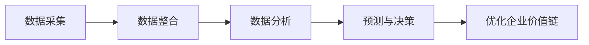

# AI辅助的企业价值链分析

> 关键词：AI辅助、企业价值链分析、核心算法、数学模型、项目实战

> 摘要：本文围绕AI辅助的企业价值链分析展开深入探讨。首先介绍了相关背景，包括目的范围、预期读者等内容。接着阐述了核心概念及联系，展示了原理和架构的示意图与流程图。详细讲解了核心算法原理和具体操作步骤，并结合Python代码进行说明。给出了相关的数学模型和公式，且有举例解释。通过项目实战展示代码案例及详细解读。分析了实际应用场景，推荐了学习资源、开发工具框架和相关论文著作。最后总结了未来发展趋势与挑战，还设置了常见问题解答和扩展阅读参考资料，旨在为企业利用AI进行价值链分析提供全面而深入的指导。

## 1. 背景介绍 
### 1.1 目的和范围
在当今数字化时代，企业面临着日益激烈的市场竞争，如何优化自身的价值链，提高运营效率和竞争力成为关键问题。AI辅助的企业价值链分析旨在借助人工智能技术，深入剖析企业从原材料采购、生产制造到产品销售及售后服务等各个环节的价值创造过程，识别出优势环节和潜在的改进空间，从而为企业制定战略决策提供有力支持。

本文的范围涵盖了AI辅助企业价值链分析的核心概念、算法原理、数学模型、项目实战以及实际应用场景等方面，旨在为读者全面呈现这一领域的知识体系和实践方法。

### 1.2 预期读者
本文的预期读者包括企业管理人员、战略规划师、市场营销人员、数据分析人员以及对AI和企业管理感兴趣的技术爱好者。对于企业管理人员和战略规划师来说，本文可以帮助他们了解如何利用AI技术优化企业价值链，制定更有效的战略决策；市场营销人员可以从中获取关于市场需求和客户价值的深入分析，以更好地开展营销活动；数据分析人员则可以学习到相关的算法和技术，提升数据分析能力；技术爱好者可以了解AI在企业管理领域的应用，拓宽知识面。

### 1.3 文档结构概述
本文将按照以下结构进行阐述：首先介绍背景信息，包括目的范围、预期读者和文档结构概述；接着讲解核心概念与联系，通过示意图和流程图展示其原理和架构；然后详细阐述核心算法原理和具体操作步骤，结合Python代码进行说明；给出相关的数学模型和公式，并举例解释；通过项目实战展示代码案例及详细解读；分析实际应用场景；推荐学习资源、开发工具框架和相关论文著作；最后总结未来发展趋势与挑战，设置常见问题解答和扩展阅读参考资料。

### 1.4 术语表
#### 1.4.1 核心术语定义
- **企业价值链**：企业为了满足客户需求，在生产经营过程中所进行的一系列价值创造活动的集合，包括基本活动（如内部后勤、生产作业、外部后勤、市场营销和服务）和辅助活动（如采购、技术开发、人力资源管理和企业基础设施）。
- **AI辅助**：利用人工智能技术，如机器学习、深度学习、自然语言处理等，对企业价值链相关数据进行分析、挖掘和预测，为企业决策提供支持。
- **价值创造**：企业通过投入资源和进行一系列活动，为客户提供具有价值的产品或服务，从而实现自身价值的增加。

#### 1.4.2 相关概念解释
- **机器学习**：是一门多领域交叉学科，涉及概率论、统计学、逼近论、凸分析、算法复杂度理论等多门学科。它专门研究计算机怎样模拟或实现人类的学习行为，以获取新的知识或技能，重新组织已有的知识结构使之不断改善自身的性能。在企业价值链分析中，机器学习可以用于预测市场需求、分析客户行为等。
- **深度学习**：是机器学习的一个分支领域，它是一种基于对数据进行表征学习的方法。深度学习通过构建具有很多层的神经网络模型，自动从大量数据中学习特征和模式，在图像识别、语音识别、自然语言处理等领域取得了显著的成果。在企业价值链分析中，深度学习可以用于分析复杂的客户情感和市场趋势。
- **自然语言处理**：是计算机科学领域与人工智能领域中的一个重要方向。它研究能实现人与计算机之间用自然语言进行有效通信的各种理论和方法。在企业价值链分析中，自然语言处理可以用于分析客户反馈、市场新闻等文本数据。

#### 1.4.3 缩略词列表
- **AI**：Artificial Intelligence，人工智能
- **ML**：Machine Learning，机器学习
- **DL**：Deep Learning，深度学习
- **NLP**：Natural Language Processing，自然语言处理

## 2. 核心概念与联系 

### 核心概念原理
企业价值链分析的核心在于识别企业各个环节的价值创造过程，并评估其对企业整体价值的贡献。传统的企业价值链分析主要依赖于人工经验和简单的数据分析方法，存在分析效率低、准确性差等问题。而AI辅助的企业价值链分析则利用人工智能技术，对大量的企业内部和外部数据进行深度挖掘和分析，从而更准确地识别价值创造环节和潜在的改进机会。

AI技术在企业价值链分析中的应用主要体现在以下几个方面：
- **数据采集与整合**：利用网络爬虫、传感器等技术，采集企业内部和外部的各种数据，包括生产数据、销售数据、市场数据、客户反馈等，并将这些数据进行整合和清洗，为后续的分析提供高质量的数据基础。
- **数据分析与挖掘**：运用机器学习、深度学习等算法，对整合后的数据进行分析和挖掘，发现数据中的潜在规律和模式。例如，通过聚类分析将客户分为不同的群体，以便企业制定个性化的营销策略；通过关联分析找出产品销售与原材料采购之间的关系，优化采购计划。
- **预测与决策支持**：基于数据分析和挖掘的结果，利用预测模型对市场需求、客户行为等进行预测，为企业的战略决策提供支持。例如，通过预测市场需求，企业可以合理安排生产计划，避免库存积压或缺货现象的发生。

### 架构的文本示意图
```plaintext
+---------------------+
|     数据采集层      |
| （网络爬虫、传感器） |
+---------------------+
|     数据整合层      |
| （数据清洗、转换）   |
+---------------------+
|     数据分析层      |
| （机器学习、深度学习）|
+---------------------+
|    预测与决策层     |
| （预测模型、决策支持）|
+---------------------+
```

### Mermaid流程图


## 3. 核心算法原理 & 具体操作步骤 

### 核心算法原理
在AI辅助的企业价值链分析中，常用的算法包括聚类算法、关联规则算法和预测算法等。下面以聚类算法为例，详细介绍其原理和具体操作步骤。

聚类算法是一种无监督学习算法，其目的是将数据集中的样本划分为不同的簇，使得同一簇内的样本相似度较高，而不同簇之间的样本相似度较低。常用的聚类算法有K-Means算法、层次聚类算法等。

#### K-Means算法原理
K-Means算法是一种基于距离度量的聚类算法，其基本思想是通过迭代的方式，不断调整簇的中心位置，使得每个样本到其所属簇中心的距离之和最小。具体步骤如下：
1. **初始化**：随机选择K个样本作为初始的簇中心。
2. **分配样本**：计算每个样本到各个簇中心的距离，将样本分配到距离最近的簇中。
3. **更新簇中心**：计算每个簇内所有样本的均值，将该均值作为新的簇中心。
4. **重复步骤2和3**：直到簇中心不再发生变化或达到最大迭代次数。

### 具体操作步骤
以下是使用Python实现K-Means算法进行企业客户聚类分析的具体步骤和代码示例：

```python
import numpy as np
import matplotlib.pyplot as plt
from sklearn.cluster import KMeans

# 生成示例数据
np.random.seed(0)
X = np.vstack([
    np.random.normal(loc=[0, 0], scale=1, size=(100, 2)),
    np.random.normal(loc=[5, 5], scale=1, size=(100, 2)),
    np.random.normal(loc=[10, 0], scale=1, size=(100, 2))
])

# 初始化K-Means模型
kmeans = KMeans(n_clusters=3, random_state=0)

# 拟合数据
kmeans.fit(X)

# 获取聚类标签
labels = kmeans.labels_

# 获取簇中心
centroids = kmeans.cluster_centers_

# 可视化聚类结果
plt.scatter(X[:, 0], X[:, 1], c=labels, cmap='viridis')
plt.scatter(centroids[:, 0], centroids[:, 1], marker='X', s=200, c='red')
plt.title('K-Means Clustering')
plt.xlabel('Feature 1')
plt.ylabel('Feature 2')
plt.show()
```

### 代码解释
1. **数据生成**：使用`np.random.normal`函数生成三组二维正态分布的数据，模拟企业客户的特征数据。
2. **模型初始化**：使用`KMeans`类初始化一个K-Means模型，设置簇的数量为3。
3. **数据拟合**：使用`fit`方法将数据拟合到模型中。
4. **获取聚类标签和簇中心**：使用`labels_`属性获取每个样本的聚类标签，使用`cluster_centers_`属性获取每个簇的中心位置。
5. **可视化结果**：使用`matplotlib`库将聚类结果可视化，不同颜色的点表示不同的簇，红色的`X`表示簇中心。

## 4. 数学模型和公式 & 详细讲解 & 举例说明 

### 数学模型和公式
在K-Means算法中，主要涉及到距离度量和目标函数两个数学概念。

#### 距离度量
常用的距离度量方法有欧氏距离、曼哈顿距离等。在K-Means算法中，通常使用欧氏距离来计算样本到簇中心的距离。欧氏距离的计算公式如下：

$$
d(x, y) = \sqrt{\sum_{i=1}^{n}(x_i - y_i)^2}
$$

其中，$x = (x_1, x_2, \cdots, x_n)$ 和 $y = (y_1, y_2, \cdots, y_n)$ 是两个 $n$ 维向量，$d(x, y)$ 表示它们之间的欧氏距离。

#### 目标函数
K-Means算法的目标是最小化每个样本到其所属簇中心的距离之和，即：

$$
J = \sum_{i=1}^{K}\sum_{x \in C_i}d(x, \mu_i)
$$

其中，$K$ 是簇的数量，$C_i$ 是第 $i$ 个簇，$\mu_i$ 是第 $i$ 个簇的中心，$d(x, \mu_i)$ 是样本 $x$ 到簇中心 $\mu_i$ 的距离。

### 详细讲解
在K-Means算法的迭代过程中，每次更新簇中心后，都会重新计算每个样本到各个簇中心的距离，并将样本分配到距离最近的簇中。这个过程不断重复，直到目标函数 $J$ 不再减小或达到最大迭代次数。

### 举例说明
假设有三个样本 $x_1 = (1, 2)$，$x_2 = (4, 5)$，$x_3 = (7, 8)$，初始的簇中心为 $\mu_1 = (2, 3)$ 和 $\mu_2 = (6, 7)$。我们来计算每个样本到各个簇中心的欧氏距离。

- 对于样本 $x_1$：
  - 到簇中心 $\mu_1$ 的距离：
    $$
    d(x_1, \mu_1) = \sqrt{(1 - 2)^2 + (2 - 3)^2} = \sqrt{2}
    $$
  - 到簇中心 $\mu_2$ 的距离：
    $$
    d(x_1, \mu_2) = \sqrt{(1 - 6)^2 + (2 - 7)^2} = \sqrt{50}
    $$
  由于 $d(x_1, \mu_1) < d(x_1, \mu_2)$，所以样本 $x_1$ 被分配到簇 $C_1$。

- 对于样本 $x_2$：
  - 到簇中心 $\mu_1$ 的距离：
    $$
    d(x_2, \mu_1) = \sqrt{(4 - 2)^2 + (5 - 3)^2} = 2\sqrt{2}
    $$
  - 到簇中心 $\mu_2$ 的距离：
    $$
    d(x_2, \mu_2) = \sqrt{(4 - 6)^2 + (5 - 7)^2} = 2\sqrt{2}
    $$
  由于 $d(x_2, \mu_1) = d(x_2, \mu_2)$，我们可以任意将样本 $x_2$ 分配到簇 $C_1$ 或 $C_2$，这里假设分配到簇 $C_1$。

- 对于样本 $x_3$：
  - 到簇中心 $\mu_1$ 的距离：
    $$
    d(x_3, \mu_1) = \sqrt{(7 - 2)^2 + (8 - 3)^2} = 5\sqrt{2}
    $$
  - 到簇中心 $\mu_2$ 的距离：
    $$
    d(x_3, \mu_2) = \sqrt{(7 - 6)^2 + (8 - 7)^2} = \sqrt{2}
    $$
  由于 $d(x_3, \mu_2) < d(x_3, \mu_1)$，所以样本 $x_3$ 被分配到簇 $C_2$。

然后，我们可以根据分配结果更新簇中心，继续进行迭代，直到满足终止条件。

## 5. 项目实战：代码实际案例和详细解释说明 

### 5.1  开发环境搭建
为了实现AI辅助的企业价值链分析项目，我们需要搭建以下开发环境：
- **操作系统**：推荐使用Windows、Linux或macOS。
- **编程语言**：Python 3.x，Python是一种功能强大、易于学习的编程语言，拥有丰富的科学计算和机器学习库。
- **开发工具**：推荐使用Jupyter Notebook或PyCharm，它们提供了方便的代码编辑和调试功能。
- **必要的库**：安装`numpy`、`pandas`、`scikit-learn`、`matplotlib`等库，可以使用以下命令进行安装：
```sh
pip install numpy pandas scikit-learn matplotlib
```

### 5.2  源代码详细实现和代码解读
以下是一个完整的AI辅助企业价值链分析项目的代码示例，该项目的目标是对企业客户进行聚类分析，以便制定个性化的营销策略。

```python
import numpy as np
import pandas as pd
from sklearn.cluster import KMeans
import matplotlib.pyplot as plt

# 读取数据
data = pd.read_csv('customer_data.csv')

# 数据预处理
# 假设数据集中有两个特征：购买频率和平均消费金额
X = data[['purchase_frequency', 'average_consumption']].values

# 确定最佳簇的数量
wcss = []
for i in range(1, 11):
    kmeans = KMeans(n_clusters=i, init='k-means++', max_iter=300, n_init=10, random_state=0)
    kmeans.fit(X)
    wcss.append(kmeans.inertia_)

# 绘制手肘图
plt.plot(range(1, 11), wcss)
plt.title('The Elbow Method')
plt.xlabel('Number of clusters')
plt.ylabel('WCSS')
plt.show()

# 根据手肘图选择最佳簇的数量
optimal_clusters = 3

# 初始化K-Means模型
kmeans = KMeans(n_clusters=optimal_clusters, init='k-means++', max_iter=300, n_init=10, random_state=0)

# 拟合数据
kmeans.fit(X)

# 获取聚类标签
labels = kmeans.labels_

# 获取簇中心
centroids = kmeans.cluster_centers_

# 可视化聚类结果
plt.scatter(X[:, 0], X[:, 1], c=labels, cmap='viridis')
plt.scatter(centroids[:, 0], centroids[:, 1], marker='X', s=200, c='red')
plt.title('Customer Clustering')
plt.xlabel('Purchase Frequency')
plt.ylabel('Average Consumption')
plt.show()

# 将聚类结果添加到原始数据中
data['cluster'] = labels

# 分析每个簇的特征
cluster_analysis = data.groupby('cluster').agg({
    'purchase_frequency': 'mean',
    'average_consumption': 'mean',
    'customer_id': 'count'
}).rename(columns={'customer_id': 'customer_count'})

print(cluster_analysis)
```

### 5.3  代码解读与分析
1. **数据读取**：使用`pandas`库的`read_csv`函数读取存储企业客户数据的CSV文件。
2. **数据预处理**：提取数据集中的`purchase_frequency`（购买频率）和`average_consumption`（平均消费金额）两个特征，并将其转换为`numpy`数组。
3. **确定最佳簇的数量**：使用手肘法（Elbow Method）来确定最佳的簇数量。手肘法的基本思想是计算不同簇数量下的WCSS（Within-Cluster Sum of Squares），即每个样本到其所属簇中心的距离之和。随着簇数量的增加，WCSS会逐渐减小，但当簇数量达到一定值后，WCSS的减小速度会变慢，这个转折点就是最佳的簇数量。
4. **绘制手肘图**：使用`matplotlib`库绘制WCSS随簇数量变化的曲线，通过观察曲线的形状确定最佳簇数量。
5. **初始化K-Means模型**：根据手肘图确定的最佳簇数量，初始化K-Means模型。
6. **拟合数据**：使用`fit`方法将数据拟合到K-Means模型中。
7. **获取聚类标签和簇中心**：使用`labels_`属性获取每个样本的聚类标签，使用`cluster_centers_`属性获取每个簇的中心位置。
8. **可视化聚类结果**：使用`matplotlib`库将聚类结果可视化，不同颜色的点表示不同的簇，红色的`X`表示簇中心。
9. **分析每个簇的特征**：将聚类结果添加到原始数据中，并使用`groupby`方法对每个簇进行分组，计算每个簇的平均购买频率、平均消费金额和客户数量，以便分析每个簇的特征。

## 6. 实际应用场景 
AI辅助的企业价值链分析在多个实际应用场景中具有重要价值，以下是一些常见的应用场景：

### 市场营销
- **客户细分**：通过对客户的消费行为、偏好、人口统计学特征等数据进行聚类分析，将客户分为不同的群体，企业可以针对每个群体制定个性化的营销策略，提高营销效果和客户满意度。
- **市场趋势预测**：利用机器学习和深度学习算法，对市场数据、行业动态、社交媒体信息等进行分析和预测，帮助企业及时了解市场趋势，调整产品策略和营销策略。

### 生产制造
- **生产优化**：通过对生产过程中的数据进行实时监测和分析，如设备运行状态、生产效率、质量控制等，利用AI技术预测设备故障、优化生产流程，提高生产效率和产品质量。
- **供应链管理**：利用AI技术对供应链数据进行分析，如供应商信息、库存水平、物流配送等，优化供应链布局，降低采购成本和库存成本，提高供应链的灵活性和可靠性。

### 客户服务
- **智能客服**：利用自然语言处理技术，开发智能客服系统，自动回答客户的问题，提供个性化的服务，提高客户服务效率和质量。
- **客户反馈分析**：对客户的反馈信息，如投诉、建议、评价等进行文本分析，了解客户的需求和满意度，及时改进产品和服务。

### 财务管理
- **风险评估**：利用机器学习算法，对企业的财务数据、市场数据、信用数据等进行分析，评估企业的财务风险和信用风险，为企业的投资决策和融资决策提供支持。
- **成本控制**：通过对企业的成本数据进行分析，识别成本高的环节和原因，利用AI技术优化成本结构，降低企业的运营成本。

## 7. 工具和资源推荐
### 7.1 学习资源推荐
#### 7.1.1 书籍推荐
- 《机器学习》（周志华著）：这本书是机器学习领域的经典教材，全面介绍了机器学习的基本概念、算法和应用，适合初学者和有一定基础的读者。
- 《深度学习》（Ian Goodfellow、Yoshua Bengio和Aaron Courville著）：这本书是深度学习领域的权威著作，详细介绍了深度学习的理论和实践，适合对深度学习感兴趣的读者。
- 《Python数据分析实战》（Wei-Meng Lee著）：这本书以Python为工具，介绍了数据分析的基本流程和方法，包括数据采集、清洗、分析和可视化等，适合想要学习Python数据分析的读者。

#### 7.1.2 在线课程
- Coursera平台上的“机器学习”课程（由Andrew Ng教授主讲）：这是一门非常经典的机器学习课程，课程内容丰富，讲解详细，适合初学者学习。
- edX平台上的“深度学习”课程（由MIT开设）：这门课程深入介绍了深度学习的理论和实践，包括神经网络、卷积神经网络、循环神经网络等，适合有一定基础的读者。
- 阿里云大学的“人工智能实战营”：这是一个综合性的人工智能在线课程，涵盖了机器学习、深度学习、自然语言处理等多个领域的知识和实践项目，适合想要全面学习人工智能的读者。

#### 7.1.3 技术博客和网站
- Medium：这是一个技术博客平台，上面有很多关于AI、机器学习、数据分析等领域的优秀文章，读者可以从中获取最新的技术动态和实践经验。
- Towards Data Science：这是一个专注于数据科学和机器学习的博客网站，上面有很多高质量的技术文章和案例分析，适合对数据科学和机器学习感兴趣的读者。
- Kaggle：这是一个数据科学竞赛平台，上面有很多公开的数据集和竞赛项目，读者可以通过参与竞赛来提高自己的数据分析和机器学习能力。

### 7.2 开发工具框架推荐
#### 7.2.1 IDE和编辑器
- Jupyter Notebook：这是一个基于Web的交互式开发环境，支持多种编程语言，如Python、R等，适合进行数据分析和机器学习实验。
- PyCharm：这是一个专门为Python开发设计的集成开发环境，提供了丰富的代码编辑、调试、测试等功能，适合开发大型的Python项目。
- Visual Studio Code：这是一个轻量级的代码编辑器，支持多种编程语言和插件扩展，适合快速开发和调试代码。

#### 7.2.2 调试和性能分析工具
- TensorBoard：这是TensorFlow框架提供的一个可视化工具，用于监控和分析深度学习模型的训练过程，如损失函数、准确率、梯度等。
- Py-Spy：这是一个Python性能分析工具，可以实时监测Python程序的CPU使用情况和函数调用时间，帮助开发者找出性能瓶颈。
- Memory Profiler：这是一个Python内存分析工具，可以分析Python程序的内存使用情况，帮助开发者找出内存泄漏问题。

#### 7.2.3 相关框架和库
- TensorFlow：这是一个开源的深度学习框架，由Google开发，提供了丰富的深度学习模型和工具，支持多种编程语言和平台。
- PyTorch：这是一个开源的深度学习框架，由Facebook开发，具有动态图和易于使用的特点，适合进行深度学习研究和开发。
- Scikit-learn：这是一个开源的机器学习库，提供了丰富的机器学习算法和工具，如分类、回归、聚类、降维等，适合进行机器学习实验和开发。

### 7.3 相关论文著作推荐
#### 7.3.1 经典论文
- “A Survey on Clustering Algorithms”（Jiawei Han、Jian Pei和Jianwen Yin著）：这篇论文全面介绍了聚类算法的分类、原理和应用，是聚类算法领域的经典论文。
- “Deep Learning”（Yoshua Bengio、Ian Goodfellow和Aaron Courville著）：这篇论文是深度学习领域的综述性论文，介绍了深度学习的发展历程、基本概念和应用领域。
- “Natural Language Processing (Almost) from Scratch”（Ronan Collobert、Jason Weston、Léon Bottou等著）：这篇论文介绍了自然语言处理的基本方法和技术，是自然语言处理领域的经典论文。

#### 7.3.2 最新研究成果
- 可以关注国际顶级学术会议，如NeurIPS（神经信息处理系统大会）、ICML（国际机器学习会议）、ACL（计算语言学协会年会）等，这些会议上会发表很多关于AI、机器学习、自然语言处理等领域的最新研究成果。
- 也可以关注顶级学术期刊，如Journal of Artificial Intelligence Research（JAIR）、Artificial Intelligence（AI）、ACM Transactions on Intelligent Systems and Technology（TIST）等，这些期刊上会发表很多高质量的学术论文。

#### 7.3.3 应用案例分析
- 可以参考一些企业的官方博客和技术报告，了解他们在实际应用中如何使用AI技术进行企业价值链分析，如Google、Amazon、Microsoft等公司的官方博客。
- 也可以参考一些行业报告和研究机构的分析报告，了解不同行业的企业在应用AI技术方面的案例和经验，如麦肯锡、波士顿咨询集团等机构的报告。

## 8. 总结：未来发展趋势与挑战
### 未来发展趋势
- **多技术融合**：未来，AI技术将与物联网、区块链、云计算等技术深度融合，形成更加智能、高效的企业价值链分析解决方案。例如，通过物联网技术实时采集企业生产设备和供应链的数据，利用区块链技术保证数据的安全性和可信度，结合云计算技术提供强大的计算能力，实现对企业价值链的全面、实时、精准分析。
- **智能化决策**：随着AI技术的不断发展，企业价值链分析将从单纯的数据分析向智能化决策方向发展。AI系统将能够根据分析结果自动生成决策建议，并通过与企业的业务系统集成，实现决策的自动化执行，提高企业的决策效率和响应速度。
- **行业定制化**：不同行业的企业价值链具有不同的特点和需求，未来的AI辅助企业价值链分析解决方案将更加注重行业定制化。针对不同行业的特点，开发专门的算法模型和分析工具，提供更加贴合行业需求的解决方案。

### 挑战
- **数据质量和安全**：AI辅助的企业价值链分析依赖于大量的企业内部和外部数据，数据的质量和安全是关键问题。数据质量不佳可能导致分析结果不准确，而数据安全问题则可能导致企业的商业机密泄露。因此，企业需要加强数据管理，提高数据质量，同时采取有效的数据安全措施，保障数据的安全性和隐私性。
- **技术人才短缺**：AI技术是一个新兴领域，相关的技术人才短缺是一个普遍问题。企业在实施AI辅助的企业价值链分析项目时，需要招聘和培养专业的技术人才，包括数据科学家、机器学习工程师、人工智能专家等。此外，企业还需要对员工进行培训，提高员工的AI技术应用能力。
- **伦理和法律问题**：随着AI技术的广泛应用，伦理和法律问题也日益凸显。例如，AI系统的决策结果可能存在偏见和不公平性，如何确保AI系统的决策结果符合伦理和法律要求是一个亟待解决的问题。此外，AI技术的应用还可能涉及到数据隐私、知识产权等法律问题，企业需要加强对伦理和法律问题的研究和应对。

## 9. 附录：常见问题与解答
### 1. 如何选择适合企业的AI算法？
选择适合企业的AI算法需要考虑多个因素，包括数据类型、问题类型、算法复杂度、计算资源等。例如，如果是分类问题，可以选择逻辑回归、决策树、支持向量机等算法；如果是聚类问题，可以选择K-Means、层次聚类等算法。此外，还可以通过实验和比较不同算法的性能，选择最适合企业的算法。

### 2. AI辅助的企业价值链分析需要多少数据？
AI辅助的企业价值链分析需要的数据量取决于多个因素，如算法类型、问题复杂度、数据质量等。一般来说，数据量越大，模型的性能越好。但同时，也需要注意数据的质量和代表性，避免使用低质量或不具有代表性的数据。在实际应用中，可以根据具体情况逐步增加数据量，并通过交叉验证等方法评估模型的性能。

### 3. 如何评估AI模型的性能？
评估AI模型的性能可以使用多种指标，具体取决于问题类型。对于分类问题，常用的指标有准确率、召回率、F1值等；对于回归问题，常用的指标有均方误差（MSE）、均方根误差（RMSE）、平均绝对误差（MAE）等。此外，还可以使用交叉验证、ROC曲线、混淆矩阵等方法来评估模型的性能。

### 4. AI辅助的企业价值链分析会取代人类决策吗？
AI辅助的企业价值链分析不会取代人类决策，而是为人类决策提供支持。AI技术可以帮助企业快速、准确地分析大量数据，发现潜在的问题和机会，但最终的决策还需要人类根据自己的经验、判断力和价值观来做出。此外，人类还可以对AI系统的决策结果进行监督和调整，确保决策的合理性和有效性。

## 10. 扩展阅读 & 参考资料
### 扩展阅读
- 《人工智能时代的企业管理变革》
- 《数字化转型：企业价值链重塑》
- 《AI驱动的商业模式创新》

### 参考资料
- [1] Han, J., Pei, J., & Yin, J. (2001). Mining frequent patterns without candidate generation. ACM SIGMOD Record, 30(2), 1-12.
- [2] Goodfellow, I., Bengio, Y., & Courville, A. (2016). Deep learning. MIT press.
- [3] Collobert, R., Weston, J., Bottou, L., Karlen, M., Kavukcuoglu, K., & Kuksa, P. (2011). Natural language processing (almost) from scratch. Journal of Machine Learning Research, 12(Aug), 2493-2537.

作者：AI天才研究院/AI Genius Institute & 禅与计算机程序设计艺术 /Zen And The Art of Computer Programming