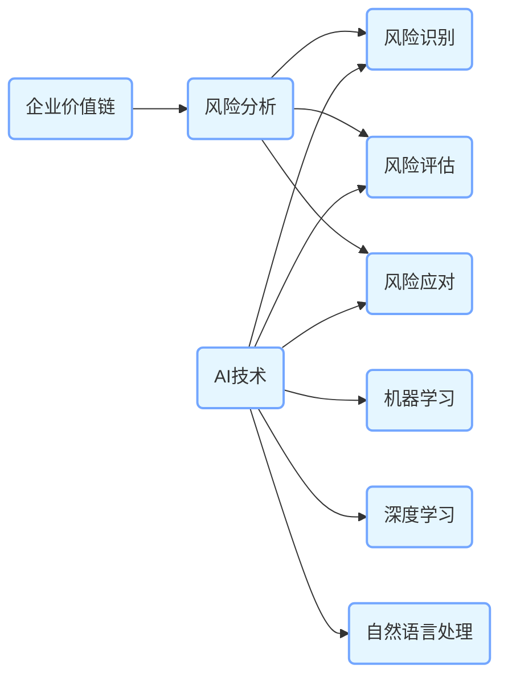

# AI辅助的企业价值链风险分析

> 关键词：AI、企业价值链、风险分析、机器学习、数据分析

> 摘要：本文聚焦于AI辅助的企业价值链风险分析，深入探讨了企业价值链的概念、风险来源，以及AI技术在其中的应用原理和方法。首先介绍了相关背景知识，包括目的、预期读者等。接着阐述了核心概念与联系，通过示意图和流程图展示企业价值链与风险分析的架构。详细讲解了核心算法原理，并给出Python代码示例。运用数学模型和公式对风险进行量化分析，辅以具体例子说明。通过项目实战展示代码的实际应用和解读。分析了实际应用场景，推荐了相关的学习资源、开发工具框架和论文著作。最后总结了未来发展趋势与挑战，提供常见问题解答和扩展阅读参考资料，旨在为企业利用AI进行价值链风险分析提供全面的技术指导和理论支持。

## 1. 背景介绍 
### 1.1 目的和范围
企业在复杂多变的市场环境中运营，其价值链涉及多个环节，每个环节都可能面临各种风险。这些风险可能来自内部的管理不善、技术故障，也可能源于外部的市场波动、政策变化等。传统的风险分析方法往往依赖于人工经验和简单的统计分析，难以全面、准确地识别和评估企业价值链中的风险。

本文的目的是探讨如何利用人工智能（AI）技术辅助企业进行价值链风险分析，提高风险识别的准确性和效率，为企业制定风险管理策略提供科学依据。具体范围涵盖了企业价值链的各个环节，包括采购、生产、销售、物流等，以及常见的风险类型，如市场风险、信用风险、操作风险等。

### 1.2 预期读者
本文的预期读者主要包括企业的管理人员、风险管理专家、数据分析师、IT技术人员等。对于企业管理人员来说，了解AI在价值链风险分析中的应用可以帮助他们更好地制定战略决策，降低企业运营风险；风险管理专家可以借助本文的方法和技术，提升风险评估的水平；数据分析师可以学习到如何运用AI算法处理和分析企业价值链数据；IT技术人员则可以获取相关的开发技术和工具信息，为企业开发定制化的风险分析系统。

### 1.3 文档结构概述
本文将按照以下结构进行阐述：
1. 背景介绍：介绍文章的目的、预期读者和文档结构概述，以及相关术语的定义。
2. 核心概念与联系：阐述企业价值链、风险分析和AI的核心概念，展示它们之间的联系，并通过示意图和流程图进行说明。
3. 核心算法原理 & 具体操作步骤：介绍用于企业价值链风险分析的核心AI算法，如机器学习算法，并给出Python代码示例。
4. 数学模型和公式 & 详细讲解 & 举例说明：运用数学模型和公式对企业价值链风险进行量化分析，并通过具体例子进行说明。
5. 项目实战：代码实际案例和详细解释说明：通过一个实际的项目案例，展示如何使用AI技术进行企业价值链风险分析，包括开发环境搭建、源代码实现和代码解读。
6. 实际应用场景：分析AI辅助企业价值链风险分析在不同行业和领域的实际应用场景。
7. 工具和资源推荐：推荐相关的学习资源、开发工具框架和论文著作，帮助读者进一步深入学习和研究。
8. 总结：未来发展趋势与挑战：总结AI辅助企业价值链风险分析的发展趋势和面临的挑战。
9. 附录：常见问题与解答：解答读者在学习和应用过程中可能遇到的常见问题。
10. 扩展阅读 & 参考资料：提供相关的扩展阅读材料和参考资料。

### 1.4 术语表
#### 1.4.1 核心术语定义
- **企业价值链（Enterprise Value Chain）**：企业为了创造价值而进行的一系列活动的集合，包括基本活动（如采购、生产、销售等）和支持活动（如人力资源管理、技术开发等）。
- **风险分析（Risk Analysis）**：对企业面临的各种风险进行识别、评估和应对的过程，旨在降低风险对企业目标的影响。
- **人工智能（Artificial Intelligence，AI）**：使计算机系统能够模拟人类智能的技术，包括机器学习、深度学习、自然语言处理等。
- **机器学习（Machine Learning）**：AI的一个分支，通过让计算机从数据中学习模式和规律，从而实现预测和决策的功能。
- **数据挖掘（Data Mining）**：从大量数据中发现有价值信息和知识的过程，常用于风险分析和预测。

#### 1.4.2 相关概念解释
- **风险识别（Risk Identification）**：确定企业价值链中可能面临的风险因素的过程，可以通过历史数据、专家经验、问卷调查等方法进行。
- **风险评估（Risk Assessment）**：对识别出的风险因素进行量化分析，评估其发生的可能性和影响程度，常用的方法有定性评估和定量评估。
- **风险应对（Risk Response）**：根据风险评估的结果，制定相应的策略来降低风险的影响，如风险规避、风险减轻、风险转移等。

#### 1.4.3 缩略词列表
- **AI**：Artificial Intelligence（人工智能）
- **ML**：Machine Learning（机器学习）
- **NLP**：Natural Language Processing（自然语言处理）
- **ANN**：Artificial Neural Network（人工神经网络）
- **SVM**：Support Vector Machine（支持向量机）

## 2. 核心概念与联系 
### 2.1 企业价值链的概念
企业价值链是由美国哈佛大学商学院教授迈克尔·波特（Michael Porter）于1985年提出的概念。他认为企业的价值创造是通过一系列相互关联的活动来实现的，这些活动可以分为基本活动和支持活动。基本活动包括内部后勤、生产作业、外部后勤、市场和销售、服务等；支持活动包括采购、技术开发、人力资源管理、企业基础设施等。

企业价值链的各个环节相互依存、相互影响，共同构成了一个有机的整体。每个环节都可能对企业的价值创造产生影响，同时也可能面临各种风险。例如，采购环节可能面临供应商违约、原材料价格波动等风险；生产环节可能面临设备故障、质量问题等风险；销售环节可能面临市场需求变化、竞争对手挤压等风险。

### 2.2 风险分析的概念
风险分析是企业管理中的重要环节，它旨在识别、评估和应对企业面临的各种风险。风险分析的过程通常包括风险识别、风险评估和风险应对三个阶段。

风险识别是风险分析的第一步，它通过各种方法和手段，如历史数据分析、专家经验判断、问卷调查等，确定企业可能面临的风险因素。风险评估是对识别出的风险因素进行量化分析，评估其发生的可能性和影响程度。常用的风险评估方法有定性评估和定量评估。定性评估主要基于专家的主观判断，对风险进行等级划分；定量评估则通过数学模型和统计方法，对风险进行量化计算。风险应对是根据风险评估的结果，制定相应的策略来降低风险的影响。常见的风险应对策略包括风险规避、风险减轻、风险转移和风险接受等。

### 2.3 AI在企业价值链风险分析中的应用
人工智能技术在企业价值链风险分析中具有重要的应用价值。AI可以通过机器学习、深度学习等算法，对企业价值链中的大量数据进行分析和挖掘，发现潜在的风险因素，并对风险进行准确的评估和预测。

例如，AI可以通过对企业采购数据的分析，识别供应商的信用风险和交货风险；通过对生产数据的分析，预测设备故障和质量问题的发生概率；通过对销售数据的分析，评估市场需求的变化趋势和竞争对手的策略。此外，AI还可以通过自然语言处理技术，对企业的新闻报道、社交媒体评论等非结构化数据进行分析，及时发现潜在的声誉风险。

### 2.4 核心概念的联系
企业价值链、风险分析和AI之间存在着密切的联系。企业价值链是风险分析的对象，风险分析是企业管理的重要手段，而AI则为风险分析提供了强大的技术支持。

通过AI技术，企业可以对价值链中的数据进行实时监测和分析，及时发现潜在的风险因素，并采取相应的措施进行应对。同时，AI还可以通过对历史数据的学习和分析，不断优化风险评估模型，提高风险分析的准确性和效率。

### 2.5 文本示意图和Mermaid流程图
#### 2.5.1 文本示意图
```plaintext
企业价值链
├── 基本活动
│   ├── 内部后勤
│   ├── 生产作业
│   ├── 外部后勤
│   ├── 市场和销售
│   └── 服务
├── 支持活动
│   ├── 采购
│   ├── 技术开发
│   ├── 人力资源管理
│   └── 企业基础设施
│
风险分析
├── 风险识别
├── 风险评估
└── 风险应对
│
AI技术
├── 机器学习
├── 深度学习
└── 自然语言处理
```

#### 2.5.2 Mermaid流程图


## 3. 核心算法原理 & 具体操作步骤 
### 3.1 机器学习算法概述
机器学习是AI的一个重要分支，它通过让计算机从数据中学习模式和规律，从而实现预测和决策的功能。在企业价值链风险分析中，常用的机器学习算法包括决策树、支持向量机、神经网络等。

#### 3.1.1 决策树算法
决策树是一种基于树结构进行决策的机器学习算法。它通过对数据进行递归划分，构建一个决策树模型，每个内部节点表示一个属性上的测试，每个分支表示一个测试输出，每个叶节点表示一个类别或值。决策树算法的优点是易于理解和解释，能够处理多分类问题和数值型数据。

#### 3.1.2 支持向量机算法
支持向量机是一种二分类模型，它的基本思想是在特征空间中找到一个最优的超平面，将不同类别的数据分隔开来。支持向量机算法的优点是能够处理高维数据和非线性问题，具有较好的泛化能力。

#### 3.1.3 神经网络算法
神经网络是一种模仿人类神经系统的机器学习算法，它由大量的神经元组成，通过神经元之间的连接和权重调整来学习数据的模式和规律。神经网络算法的优点是能够处理复杂的非线性问题，具有较强的自适应能力。

### 3.2 具体操作步骤
#### 3.2.1 数据收集和预处理
在进行企业价值链风险分析之前，首先需要收集相关的数据。这些数据可以来自企业的内部系统，如ERP系统、CRM系统等，也可以来自外部数据源，如市场调研机构、政府部门等。

收集到的数据通常需要进行预处理，包括数据清洗、数据转换、数据归一化等。数据清洗的目的是去除数据中的噪声和缺失值；数据转换的目的是将数据转换为适合机器学习算法处理的格式；数据归一化的目的是将数据的取值范围缩放到一个固定的区间，以提高算法的性能。

#### 3.2.2 特征选择和提取
在进行机器学习模型训练之前，需要选择和提取合适的特征。特征选择的目的是从原始数据中选择对风险分析有重要影响的特征，以减少数据的维度和复杂度；特征提取的目的是将原始数据转换为更有代表性的特征，以提高模型的性能。

常用的特征选择方法包括相关性分析、卡方检验、信息增益等；常用的特征提取方法包括主成分分析（PCA）、线性判别分析（LDA）等。

#### 3.2.3 模型训练和评估
在完成数据预处理和特征选择提取之后，就可以进行机器学习模型的训练和评估了。模型训练的目的是通过对训练数据的学习，调整模型的参数，使模型能够准确地预测风险。模型评估的目的是通过对测试数据的预测，评估模型的性能，选择最优的模型。

常用的模型评估指标包括准确率、召回率、F1值、均方误差等。

#### 3.2.4 风险预测和预警
在完成模型训练和评估之后，就可以使用训练好的模型对企业价值链中的风险进行预测和预警了。风险预测的目的是根据企业的历史数据和当前状态，预测未来可能发生的风险；风险预警的目的是当风险达到一定的阈值时，及时向企业管理人员发出警报，以便他们采取相应的措施进行应对。

### 3.3 Python代码示例
以下是一个使用Python和Scikit-learn库实现决策树算法进行企业价值链风险分析的示例代码：

```python
import pandas as pd
from sklearn.model_selection import train_test_split
from sklearn.tree import DecisionTreeClassifier
from sklearn.metrics import accuracy_score

# 加载数据
data = pd.read_csv('enterprise_value_chain_risk_data.csv')

# 分离特征和标签
X = data.drop('risk_label', axis=1)
y = data['risk_label']

# 划分训练集和测试集
X_train, X_test, y_train, y_test = train_test_split(X, y, test_size=0.2, random_state=42)

# 创建决策树分类器
clf = DecisionTreeClassifier()

# 训练模型
clf.fit(X_train, y_train)

# 预测测试集
y_pred = clf.predict(X_test)

# 评估模型
accuracy = accuracy_score(y_test, y_pred)
print(f"模型准确率: {accuracy}")
```

在上述代码中，首先使用`pandas`库加载企业价值链风险数据，然后使用`train_test_split`函数将数据划分为训练集和测试集。接着创建一个决策树分类器，并使用训练集对模型进行训练。最后使用测试集对模型进行预测，并计算模型的准确率。

## 4. 数学模型和公式 & 详细讲解 & 举例说明 
### 4.1 风险评估的数学模型
在企业价值链风险分析中，常用的风险评估数学模型包括概率模型、模糊综合评价模型、层次分析法等。

#### 4.1.1 概率模型
概率模型是一种基于概率统计的风险评估模型，它通过对历史数据的分析，计算风险事件发生的概率和影响程度。常用的概率分布包括正态分布、泊松分布、二项分布等。

假设某企业的采购环节面临原材料价格波动的风险，我们可以通过对历史原材料价格数据的分析，计算价格上涨的概率和上涨的幅度。设 $X$ 表示原材料价格上涨的幅度，$P(X)$ 表示价格上涨的概率分布，则原材料价格上涨的期望幅度可以表示为：

$$E(X)=\sum_{i}x_{i}P(x_{i})$$

其中，$x_{i}$ 表示第 $i$ 种价格上涨的幅度，$P(x_{i})$ 表示第 $i$ 种价格上涨幅度发生的概率。

#### 4.1.2 模糊综合评价模型
模糊综合评价模型是一种基于模糊数学的风险评估模型，它通过对风险因素的模糊评价，综合考虑多个因素的影响，得出风险的综合评价结果。模糊综合评价模型的基本步骤包括确定评价因素集、确定评语集、确定权重集、建立模糊关系矩阵、进行模糊合成和综合评价等。

假设某企业的生产环节面临设备故障的风险，我们可以通过模糊综合评价模型对设备故障的风险进行评估。设评价因素集 $U=\{u_{1},u_{2},u_{3}\}$ 分别表示设备的使用年限、维护情况、运行状态；评语集 $V=\{v_{1},v_{2},v_{3}\}$ 分别表示高风险、中风险、低风险；权重集 $A=(a_{1},a_{2},a_{3})$ 表示各评价因素的权重；模糊关系矩阵 $R=(r_{ij})_{3\times3}$ 表示各评价因素对各评语的隶属度。则设备故障的模糊综合评价结果可以表示为：

$$B = A \circ R$$

其中，$\circ$ 表示模糊合成算子，常用的模糊合成算子有最大 - 最小合成算子、加权平均合成算子等。

#### 4.1.3 层次分析法
层次分析法是一种将复杂问题分解为多个层次，通过两两比较确定各因素的相对重要性，从而得出综合评价结果的风险评估模型。层次分析法的基本步骤包括建立层次结构模型、构造判断矩阵、计算权重向量、进行一致性检验等。

假设某企业的销售环节面临市场竞争的风险，我们可以通过层次分析法对市场竞争的风险进行评估。设目标层为市场竞争风险评估，准则层包括竞争对手实力、市场份额、产品差异化等因素，方案层包括不同的销售策略。通过两两比较确定各因素的相对重要性，构造判断矩阵，计算权重向量，最后得出各销售策略的综合评价结果。

### 4.2 举例说明
#### 4.2.1 概率模型举例
假设某企业的采购环节面临原材料价格波动的风险，通过对过去100个月的原材料价格数据进行分析，发现价格上涨的月份有30个，其中上涨幅度在10% - 20%的有10个，上涨幅度在20% - 30%的有15个，上涨幅度在30%以上的有5个。则原材料价格上涨的概率为：

$$P(X>0)=\frac{30}{100}=0.3$$

原材料价格上涨幅度的期望为：

$$E(X)=\frac{10\times0.15 + 15\times0.25 + 5\times0.35}{30}=0.217$$

即原材料价格上涨的期望幅度为21.7%。

#### 4.2.2 模糊综合评价模型举例
假设某企业的生产环节面临设备故障的风险，评价因素集 $U=\{u_{1},u_{2},u_{3}\}$ 分别表示设备的使用年限、维护情况、运行状态；评语集 $V=\{v_{1},v_{2},v_{3}\}$ 分别表示高风险、中风险、低风险；权重集 $A=(0.3, 0.4, 0.3)$ ；模糊关系矩阵 $R$ 为：

$$R=\begin{bmatrix}
0.2 & 0.5 & 0.3 \\
0.1 & 0.6 & 0.3 \\
0.3 & 0.4 & 0.3
\end{bmatrix}$$

则设备故障的模糊综合评价结果为：

$$B = A \circ R=(0.3\times0.2 + 0.4\times0.1 + 0.3\times0.3, 0.3\times0.5 + 0.4\times0.6 + 0.3\times0.4, 0.3\times0.3 + 0.4\times0.3 + 0.3\times0.3)=(0.19, 0.51, 0.3)$$

根据最大隶属度原则，设备故障的风险为中风险。

#### 4.2.3 层次分析法举例
假设某企业的销售环节面临市场竞争的风险，目标层为市场竞争风险评估，准则层包括竞争对手实力、市场份额、产品差异化三个因素，方案层包括三种销售策略 $S_{1}$、$S_{2}$、$S_{3}$。通过两两比较构造的判断矩阵如下：

准则层判断矩阵：

$$A=\begin{bmatrix}
1 & 2 & 3 \\
\frac{1}{2} & 1 & 2 \\
\frac{1}{3} & \frac{1}{2} & 1
\end{bmatrix}$$

方案层相对于竞争对手实力的判断矩阵：

$$B_{1}=\begin{bmatrix}
1 & \frac{1}{3} & \frac{1}{5} \\
3 & 1 & \frac{1}{2} \\
5 & 2 & 1
\end{bmatrix}$$

方案层相对于市场份额的判断矩阵：

$$B_{2}=\begin{bmatrix}
1 & 3 & 5 \\
\frac{1}{3} & 1 & 2 \\
\frac{1}{5} & \frac{1}{2} & 1
\end{bmatrix}$$

方案层相对于产品差异化的判断矩阵：

$$B_{3}=\begin{bmatrix}
1 & \frac{1}{2} & \frac{1}{3} \\
2 & 1 & \frac{1}{2} \\
3 & 2 & 1
\end{bmatrix}$$

通过计算各判断矩阵的特征向量和一致性指标，进行一致性检验，最后得出各销售策略的综合权重，选择综合权重最大的销售策略作为最优策略。

## 5. 项目实战：代码实际案例和详细解释说明 
### 5.1  开发环境搭建
#### 5.1.1 安装Python
首先需要安装Python开发环境，建议使用Python 3.7及以上版本。可以从Python官方网站（https://www.python.org/downloads/）下载并安装Python。

#### 5.1.2 安装必要的库
在进行企业价值链风险分析项目实战时，需要安装一些必要的Python库，如`pandas`、`numpy`、`scikit-learn`等。可以使用`pip`命令进行安装：

```sh
pip install pandas numpy scikit-learn
```

#### 5.1.3 选择开发工具
可以选择使用Jupyter Notebook、PyCharm等开发工具进行代码编写和调试。Jupyter Notebook是一个交互式的开发环境，适合进行数据分析和模型训练；PyCharm是一个专业的Python集成开发环境，适合进行大型项目的开发。

### 5.2  源代码详细实现和代码解读
#### 5.2.1 数据加载和预处理
```python
import pandas as pd
from sklearn.preprocessing import StandardScaler

# 加载数据
data = pd.read_csv('enterprise_value_chain_risk_data.csv')

# 分离特征和标签
X = data.drop('risk_label', axis=1)
y = data['risk_label']

# 数据标准化
scaler = StandardScaler()
X_scaled = scaler.fit_transform(X)
```

代码解读：
- 使用`pandas`库的`read_csv`函数加载企业价值链风险数据。
- 使用`drop`方法分离特征和标签，`risk_label`列表示风险标签。
- 使用`StandardScaler`对特征数据进行标准化处理，将数据的均值变为0，标准差变为1，以提高模型的性能。

#### 5.2.2 特征选择
```python
from sklearn.feature_selection import SelectKBest
from sklearn.feature_selection import chi2

# 选择前10个最重要的特征
selector = SelectKBest(score_func=chi2, k=10)
X_selected = selector.fit_transform(X_scaled, y)
```

代码解读：
- 使用`SelectKBest`和`chi2`进行特征选择，`chi2`是卡方检验的统计量，用于衡量特征与标签之间的相关性。
- 选择前10个最重要的特征，以减少数据的维度和复杂度。

#### 5.2.3 模型训练和评估
```python
from sklearn.model_selection import train_test_split
from sklearn.ensemble import RandomForestClassifier
from sklearn.metrics import accuracy_score

# 划分训练集和测试集
X_train, X_test, y_train, y_test = train_test_split(X_selected, y, test_size=0.2, random_state=42)

# 创建随机森林分类器
clf = RandomForestClassifier()

# 训练模型
clf.fit(X_train, y_train)

# 预测测试集
y_pred = clf.predict(X_test)

# 评估模型
accuracy = accuracy_score(y_test, y_pred)
print(f"模型准确率: {accuracy}")
```

代码解读：
- 使用`train_test_split`函数将数据划分为训练集和测试集，测试集占比为20%。
- 创建一个随机森林分类器，随机森林是一种集成学习算法，由多个决策树组成，具有较好的泛化能力。
- 使用训练集对模型进行训练，然后使用测试集对模型进行预测，最后计算模型的准确率。

### 5.3  代码解读与分析
通过上述代码，我们完成了一个简单的企业价值链风险分析项目。首先对数据进行了加载和预处理，包括数据标准化和特征选择；然后使用随机森林分类器进行模型训练和评估。

在实际应用中，可以根据具体情况选择不同的机器学习算法和特征选择方法，以提高模型的性能。同时，还可以对模型进行调优，如调整模型的参数、使用交叉验证等方法，以进一步提高模型的准确率和稳定性。

## 6. 实际应用场景 
### 6.1 制造业
在制造业中，企业价值链涉及采购、生产、物流等多个环节。AI辅助的企业价值链风险分析可以帮助企业识别和评估这些环节中的风险，如原材料供应中断、生产设备故障、物流配送延迟等。

例如，通过对供应商的历史交货数据和信用评级进行分析，预测供应商违约的可能性，提前采取措施寻找替代供应商；通过对生产设备的运行数据进行实时监测，预测设备故障的发生概率，及时进行维护和保养；通过对物流配送数据的分析，优化物流路线，降低物流成本和配送时间。

### 6.2 金融业
在金融业中，企业价值链包括信贷业务、投资业务、风险管理等环节。AI辅助的企业价值链风险分析可以帮助金融机构识别和评估这些环节中的风险，如信用风险、市场风险、操作风险等。

例如，通过对客户的信用数据、财务数据和行为数据进行分析，评估客户的信用风险，为信贷决策提供依据；通过对市场数据的实时监测和分析，预测市场走势，调整投资组合，降低市场风险；通过对金融交易数据的分析，识别异常交易行为，防范操作风险。

### 6.3 零售业
在零售业中，企业价值链涉及采购、销售、库存管理等环节。AI辅助的企业价值链风险分析可以帮助零售企业识别和评估这些环节中的风险，如商品滞销、库存积压、供应链中断等。

例如，通过对销售数据和市场趋势的分析，预测商品的需求情况，合理安排采购计划，避免商品滞销和库存积压；通过对供应商的供应能力和交货时间进行分析，评估供应链中断的风险，提前采取措施确保商品的供应稳定。

### 6.4 服务业
在服务业中，企业价值链包括服务设计、服务交付、客户关系管理等环节。AI辅助的企业价值链风险分析可以帮助服务企业识别和评估这些环节中的风险，如服务质量下降、客户满意度降低、竞争对手挤压等。

例如，通过对客户反馈数据和服务记录的分析，评估服务质量，及时发现服务过程中的问题，采取措施进行改进；通过对客户行为数据的分析，了解客户需求和偏好，提高客户满意度；通过对市场竞争数据的分析，制定差异化的服务策略，应对竞争对手的挑战。

## 7. 工具和资源推荐
### 7.1 学习资源推荐
#### 7.1.1 书籍推荐
- 《人工智能：一种现代的方法》（Artificial Intelligence: A Modern Approach）：这本书是人工智能领域的经典教材，全面介绍了人工智能的基本概念、算法和应用。
- 《机器学习》（Machine Learning）：这本书是机器学习领域的经典教材，详细介绍了机器学习的各种算法和模型。
- 《Python机器学习实战》（Python Machine Learning）：这本书通过实际案例介绍了如何使用Python进行机器学习项目的开发。

#### 7.1.2 在线课程
- Coursera上的“机器学习”课程（Machine Learning）：由斯坦福大学教授Andrew Ng讲授，是一门非常受欢迎的机器学习入门课程。
- edX上的“人工智能基础”课程（Foundations of Artificial Intelligence）：介绍了人工智能的基本概念、算法和应用。
- Udemy上的“Python数据科学和机器学习实战”课程（Python for Data Science and Machine Learning Bootcamp）：通过实际案例介绍了如何使用Python进行数据科学和机器学习项目的开发。

#### 7.1.3 技术博客和网站
- Towards Data Science：这是一个专注于数据科学和机器学习的技术博客，提供了大量的教程、案例和研究成果。
- Kaggle：这是一个数据科学竞赛平台，提供了丰富的数据集和竞赛项目，可以帮助你提高数据科学和机器学习的实践能力。
- AI Time：这是一个专注于人工智能领域的技术社区，提供了最新的技术动态、研究成果和行业应用案例。

### 7.2 开发工具框架推荐
#### 7.2.1 IDE和编辑器
- PyCharm：这是一个专业的Python集成开发环境，提供了丰富的功能和插件，适合进行大型Python项目的开发。
- Jupyter Notebook：这是一个交互式的开发环境，适合进行数据分析和模型训练，支持多种编程语言。
- Visual Studio Code：这是一个轻量级的代码编辑器，支持多种编程语言和插件，适合进行快速开发和调试。

#### 7.2.2 调试和性能分析工具
- Py-Spy：这是一个用于Python程序性能分析的工具，可以帮助你找出程序中的性能瓶颈。
- PDB：这是Python自带的调试器，可以帮助你调试Python程序中的错误。
- TensorBoard：这是一个用于深度学习模型可视化和性能分析的工具，可以帮助你监控模型的训练过程和性能指标。

#### 7.2.3 相关框架和库
- Scikit-learn：这是一个用于机器学习的Python库，提供了丰富的机器学习算法和工具，适合进行数据挖掘和分析。
- TensorFlow：这是一个开源的深度学习框架，由Google开发，提供了丰富的深度学习模型和工具，适合进行大规模的深度学习项目开发。
- PyTorch：这是一个开源的深度学习框架，由Facebook开发，提供了动态图和静态图两种编程方式，适合进行快速开发和研究。

### 7.3 相关论文著作推荐
#### 7.3.1 经典论文
- “A Machine Learning Approach to Credit Risk Analysis”：这篇论文介绍了如何使用机器学习算法进行信用风险分析。
- “Deep Learning for Image Recognition”：这篇论文介绍了深度学习在图像识别领域的应用。
- “Natural Language Processing with Deep Learning”：这篇论文介绍了深度学习在自然语言处理领域的应用。

#### 7.3.2 最新研究成果
- 关注顶级学术会议如NeurIPS、ICML、CVPR等的最新研究成果，了解AI在企业价值链风险分析领域的最新技术和方法。
- 关注知名学术期刊如Journal of Artificial Intelligence Research、Artificial Intelligence等的最新论文，获取相关领域的前沿研究动态。

#### 7.3.3 应用案例分析
- 一些行业报告和研究机构会发布关于AI在企业价值链风险分析方面的应用案例，可以通过阅读这些案例了解实际应用中的经验和教训。
- 企业自身也可以分享一些成功的应用案例，通过企业官网、行业论坛等渠道获取这些案例信息。

## 8. 总结：未来发展趋势与挑战
### 8.1 未来发展趋势
#### 8.1.1 多模态数据融合
未来，AI辅助的企业价值链风险分析将不仅仅依赖于结构化数据，还将融合图像、语音、文本等多模态数据。例如，通过分析企业的生产车间视频监控数据，实时监测设备的运行状态和工人的操作规范；通过分析客户的语音通话记录，了解客户的需求和满意度。

#### 8.1.2 实时监测和预警
随着物联网技术的发展，企业可以实时获取价值链各个环节的数据。未来，AI将能够对这些实时数据进行快速分析和处理，及时发现潜在的风险，并发出预警。例如，通过对供应链中的货物运输数据进行实时监测，及时发现货物延迟或丢失的情况，采取相应的措施进行处理。

#### 8.1.3 智能决策支持
未来，AI将不仅仅是提供风险分析和预警，还将为企业提供智能决策支持。通过对大量历史数据和实时数据的分析，AI可以为企业提供最优的风险管理策略和决策建议。例如，在面临市场需求变化时，AI可以根据企业的生产能力、库存情况和市场竞争态势，为企业制定最优的生产和销售计划。

#### 8.1.4 与区块链技术结合
区块链技术具有去中心化、不可篡改、安全可靠等特点，将AI与区块链技术结合，可以提高企业价值链风险分析的可信度和安全性。例如，通过区块链技术记录企业的交易数据和供应链信息，确保数据的真实性和完整性，为AI分析提供可靠的数据基础。

### 8.2 挑战
#### 8.2.1 数据质量和安全
AI辅助的企业价值链风险分析依赖于大量的数据，但数据质量和安全是一个重要的挑战。企业需要确保数据的准确性、完整性和一致性，同时要保护数据的安全，防止数据泄露和滥用。

#### 8.2.2 算法可解释性
AI算法，尤其是深度学习算法，往往是一个“黑盒”模型，难以解释其决策过程和结果。在企业价值链风险分析中，算法的可解释性非常重要，企业需要了解算法是如何得出风险评估结果的，以便做出合理的决策。

#### 8.2.3 人才短缺
AI技术的发展需要大量的专业人才，但目前市场上AI人才短缺。企业需要加强人才培养和引进，提高员工的AI技术水平，以满足企业价值链风险分析的需求。

#### 8.2.4 法律法规和伦理问题
AI技术的应用也带来了一些法律法规和伦理问题，如数据隐私保护、算法歧视等。企业需要遵守相关的法律法规，解决伦理问题，确保AI技术的合法、合规和道德应用。

## 9. 附录：常见问题与解答
### 9.1 如何选择合适的机器学习算法进行企业价值链风险分析？
选择合适的机器学习算法需要考虑多个因素，如数据类型、数据规模、问题类型等。如果数据是结构化的，且数据规模较小，可以选择决策树、支持向量机等算法；如果数据是大规模的，且问题是复杂的非线性问题，可以选择神经网络、深度学习等算法。此外，还可以通过交叉验证等方法比较不同算法的性能，选择最优的算法。

### 9.2 如何处理企业价值链风险分析中的缺失值和异常值？
处理缺失值和异常值的方法有很多种。对于缺失值，可以采用删除缺失值、填充缺失值等方法。填充缺失值可以使用均值、中位数、众数等统计量，也可以使用机器学习算法进行预测填充。对于异常值，可以采用删除异常值、替换异常值等方法。替换异常值可以使用上下限截断、聚类等方法。

### 9.3 如何评估AI辅助的企业价值链风险分析模型的性能？
评估AI辅助的企业价值链风险分析模型的性能可以使用多种指标，如准确率、召回率、F1值、均方误差等。对于分类问题，可以使用准确率、召回率、F1值等指标；对于回归问题，可以使用均方误差、均方根误差等指标。此外，还可以使用交叉验证、ROC曲线、混淆矩阵等方法对模型进行评估。

### 9.4 如何将AI辅助的企业价值链风险分析应用到实际企业中？
将AI辅助的企业价值链风险分析应用到实际企业中，需要以下几个步骤：
1. 确定企业的需求和目标，明确需要分析的风险类型和环节。
2. 收集和整理相关的数据，包括企业内部数据和外部数据。
3. 选择合适的机器学习算法和工具，进行模型训练和评估。
4. 将训练好的模型部署到实际生产环境中，进行实时监测和预警。
5. 定期对模型进行评估和优化，根据实际情况调整模型的参数和算法。

## 10. 扩展阅读 & 参考资料
### 10.1 扩展阅读
- 《智能商业》：这本书介绍了AI技术在商业领域的应用，包括企业价值链优化、风险管理等方面。
- 《数据驱动的企业管理》：这本书介绍了如何利用数据驱动企业的决策和管理，包括风险分析和控制。
- 《AI时代的企业转型》：这本书探讨了企业在AI时代如何进行转型，包括引入AI技术进行价值链风险分析和管理。

### 10.2 参考资料
- Michael Porter. Competitive Advantage: Creating and Sustaining Superior Performance. Free Press, 1985.
- Tom Mitchell. Machine Learning. McGraw-Hill, 1997.
- Ian Goodfellow, Yoshua Bengio, Aaron Courville. Deep Learning. MIT Press, 2016.

作者：AI天才研究院/AI Genius Institute & 禅与计算机程序设计艺术 /Zen And The Art of Computer Programming